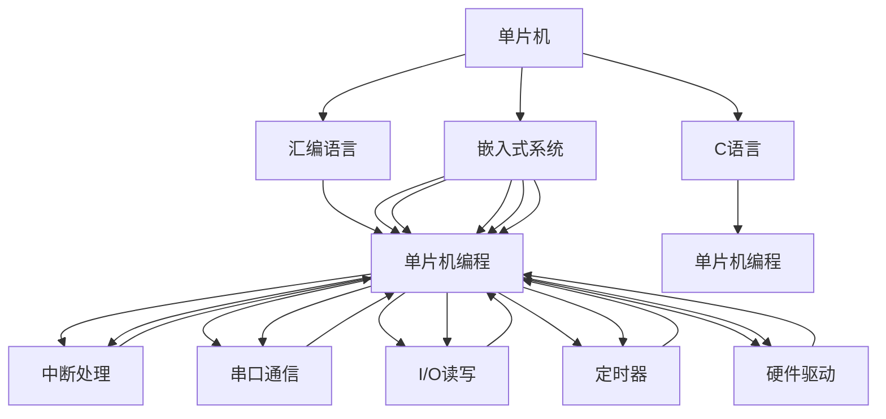

                 

# 单片机编程：嵌入式系统的基石

## 1. 背景介绍

### 1.1 问题由来

随着电子技术的飞速发展，嵌入式系统已经成为我们日常生活和工作中不可或缺的一部分。从智能家居设备、汽车电子，到工业自动化、医疗设备，无所不在。嵌入式系统的核心部件——单片机，正日益成为硬件开发的关键。单片机的编程能力直接决定了嵌入式系统设计的高度和广度。然而，单片机编程相对于高级语言编程来说，更为底层和复杂。如何将代码高效地嵌入到单片机中，成为了嵌入式开发中的一大挑战。

### 1.2 问题核心关键点

单片机编程的核心在于理解其工作原理和结构，同时掌握高效的编程技巧和开发工具。本文将系统介绍单片机的核心概念和编程技巧，涵盖从硬件设计到软件开发的各个环节。

### 1.3 问题研究意义

掌握单片机编程能力，可以让我们更加灵活、高效地开发嵌入式系统，满足不同场景下的应用需求。单片机编程技术不仅能提升硬件系统的性能，还能降低成本，缩短开发周期，在物联网、人工智能、汽车电子等多个领域有着广泛的应用前景。

## 2. 核心概念与联系

### 2.1 核心概念概述

为深入理解单片机编程，我们先对几个关键概念进行定义：

- **单片机(Microcontroller Unit, MCU)**：将CPU、存储器、外设接口等组件集成在单个芯片上的微控制器。通过编程控制这些组件，实现特定的控制和计算功能。

- **单片机编程**：将程序代码嵌入到单片机芯片的内存中，使其按照预设的逻辑进行执行的过程。

- **嵌入式系统**：将软件、硬件集成到特定设备或环境中，执行特定任务的系统。单片机是嵌入式系统中最核心的组成部分。

- **汇编语言(Assembly Language)**：面向硬件的编程语言，使用助记符表示机器指令。

- **C语言**：广泛应用在嵌入式系统开发中的高级编程语言，可高效地进行单片机编程。

这些核心概念构成了单片机编程的基础，掌握它们是进行单片机编程的前提。

### 2.2 核心概念原理和架构的 Mermaid 流程图



这个流程图展示了单片机与汇编语言、C语言、嵌入式系统之间的联系，以及单片机编程所涉及的主要功能模块。通过理解这些概念和架构，我们可以更好地掌握单片机编程的方法和技巧。

## 3. 核心算法原理 & 具体操作步骤

### 3.1 算法原理概述

单片机编程的核心算法原理包括以下几个方面：

- **指令集架构**：单片机的指令集架构决定了它可以执行的机器指令类型。不同的单片机，其指令集架构有所差异，编程方式也有所不同。

- **程序存储器**：单片机的程序存储器用于存储用户编写的程序代码。常见的程序存储器类型有Flash、E2PROM等。

- **数据存储器**：单片机的数据存储器用于存储程序运行时的数据。常见的数据存储器类型有内部RAM、外部RAM等。

- **中断处理**：单片机通过中断机制实现外部事件的快速响应。中断处理机制保证了单片机的实时性和可靠性。

- **串口通信**：单片机通过串口通信实现与外部的数据交换，广泛应用于嵌入式系统的各种通信场景。

- **I/O读写**：单片机通过I/O读写接口实现对外部硬件设备的控制。

掌握这些算法原理，可以让我们更好地理解单片机编程的方法和技巧。

### 3.2 算法步骤详解

单片机编程的算法步骤主要包括：

1. **硬件设计**：设计单片机的电路板，选择合适的单片机型号和外设接口，保证硬件电路的稳定性和可靠性。

2. **程序编写**：使用汇编语言或C语言编写程序代码，实现对单片机的控制和计算功能。

3. **调试测试**：通过仿真器或实际硬件，对程序进行调试和测试，确保程序的正确性和稳定性。

4. **烧录程序**：将程序代码烧录到单片机的程序存储器中，使程序能够在单片机中运行。

5. **系统集成**：将单片机与其他硬件设备进行集成，构建完整的嵌入式系统。

### 3.3 算法优缺点

单片机编程的优点包括：

- **硬件控制能力强**：单片机编程可以高效地控制硬件设备，实现实时响应和复杂计算。

- **编程灵活性高**：汇编语言和C语言提供了丰富的指令和函数库，可以进行灵活的编程。

- **资源利用率高**：单片机集成度高，资源利用率高，可以实现小型化、低成本的嵌入式系统。

然而，单片机编程也存在一些缺点：

- **学习曲线陡峭**：单片机编程相对于高级语言编程较为底层和复杂，需要具备一定的硬件和编程知识。

- **编程效率低**：单片机编程需要频繁使用底层硬件指令，效率相对较低。

- **可移植性差**：单片机编程通常针对特定的硬件平台，不同平台之间的代码可能无法直接移植。

### 3.4 算法应用领域

单片机编程广泛应用于以下几个领域：

- **嵌入式系统开发**：从工业控制到智能家居，从医疗设备到汽车电子，单片机编程在嵌入式系统开发中有着广泛的应用。

- **物联网设备**：物联网设备需要高效、实时、低功耗的计算和控制，单片机编程是实现这些功能的核心技术。

- **人工智能设备**：人工智能设备需要高效的数据处理和计算能力，单片机编程可以满足这一需求。

- **工业自动化**：工业自动化需要高效的实时控制和数据处理，单片机编程是实现这一功能的重要手段。

- **消费电子**：消费电子设备需要高性能的嵌入式系统，单片机编程可以提供可靠的支持。

## 4. 数学模型和公式 & 详细讲解 & 举例说明

### 4.1 数学模型构建

单片机编程的数学模型通常基于单片机的指令集架构。不同的单片机，其指令集架构和编程方式有所差异。这里以ST公司的STM32单片机为例，介绍常见的数学模型构建方法。

### 4.2 公式推导过程

**基本指令集**：

- **数据传输指令**：将数据从一个存储器或外设传输到另一个存储器或外设。

- **数据处理指令**：对数据进行算术运算、逻辑运算、位运算等处理。

- **控制指令**：控制程序的执行流程，包括条件跳转、循环等。

**寄存器**：

- **数据寄存器**：用于存储数据的寄存器。

- **状态寄存器**：用于存储单片机状态信息，如程序状态、中断状态等。

**中断处理**：

- **中断向量表**：存储中断向量，用于快速定位中断源。

- **中断服务函数**：在中断发生时执行的函数。

**串口通信**：

- **波特率**：串口通信的速度。

- **数据长度**：每次通信的数据长度。

### 4.3 案例分析与讲解

**案例一：STM32的I/O读写操作**：

```c
void GPIO_Init(GPIO_TypeDef* GPIOx, GPIO_InitTypeDef GPIO_InitStruct)
{
    GPIO_InitStruct.Pin = GPIO_PIN_SETBits(GPIOx, GPIO_PIN_0);
    GPIO_Init(GPIOx, &GPIO_InitStruct);
}
```

该代码展示了STM32单片机对GPIO口的初始化操作。通过调用GPIO_Init函数，设置GPIO口的初始状态，可以进行输出和输入操作。

**案例二：STM32的定时器操作**：

```c
void TIM_Init(TIM_HandleTypeDef *htim, TIM_InitTypeDef *TimInitStruct)
{
    TIM->ARR = TimInitStruct->TIM_Prescaler;
    TIM->PSC = TimInitStruct->TIM_ClockDivision;
    TIM->ARRH = (uint8_t)(TimInitStruct->TIM_Prescaler >> 8);
    TIM->ARRL = (uint8_t)(TimInitStruct->TIM_Prescaler >> 16);
    TIM->CCMR1 = TimInitStruct->TIM_OutputState | TimInitStruct->TIM_OutputMode | TimInitStruct->TIM_OutputPolarity | TimInitStruct->TIM_OutputNState;
    TIM->CCER = TimInitStruct->TIM_OCNPolarity | TimInitStruct->TIM_OCNPState | TimInitStruct->TIM_OCNPUpdate | TimInitStruct->TIM_OCMode | TimInitStruct->TIM_OCPolarity | TimInitStruct->TIM_OCState | TimInitStruct->TIM_OCUpdate | TimInitStruct->TIM_OutputFilter | TimInitStruct->TIM_BreakState | TimInitStruct->TIM_BreakPolarity | TimInitStruct->TIM_BreakFilter | TimInitStruct->TIM_UartMode | TimInitStruct->TIM_OutputFast | TimInitStruct->TIM_TSMode | TimInitStruct->TIM_TSFilter;
    TIM->CCERH = (uint8_t)(TimInitStruct->TIM_OCNPolarity >> 8);
    TIM->CCERL = (uint8_t)(TimInitStruct->TIM_OCNPState >> 8);
    TIM->CCMR2 = TimInitStruct->TIM_OutputState | TimInitStruct->TIM_OutputMode | TimInitStruct->TIM_OutputPolarity | TimInitStruct->TIM_OutputNState;
    TIM->CCERH = (uint8_t)(TimInitStruct->TIM_OCNPolarity >> 8);
    TIM->CCERL = (uint8_t)(TimInitStruct->TIM_OCNPState >> 8);
    TIM->CCMR3 = TimInitStruct->TIM_OutputState | TimInitStruct->TIM_OutputMode | TimInitStruct->TIM_OutputPolarity | TimInitStruct->TIM_OutputNState;
    TIM->CCERH = (uint8_t)(TimInitStruct->TIM_OCNPolarity >> 8);
    TIM->CCERL = (uint8_t)(TimInitStruct->TIM_OCNPState >> 8);
    TIM->CCMR4 = TimInitStruct->TIM_OutputState | TimInitStruct->TIM_OutputMode | TimInitStruct->TIM_OutputPolarity | TimInitStruct->TIM_OutputNState;
    TIM->CCERH = (uint8_t)(TimInitStruct->TIM_OCNPolarity >> 8);
    TIM->CCERL = (uint8_t)(TimInitStruct->TIM_OCNPState >> 8);
}
```

该代码展示了STM32单片机对定时器的操作。通过调用TIM_Init函数，设置定时器的时钟、周期、输出状态等参数，可以实现精确的定时功能。

## 5. 项目实践：代码实例和详细解释说明

### 5.1 开发环境搭建

单片机编程的开发环境通常包括以下工具：

- **开发环境**：如Code::Blocks、Eclipse等，用于编写和调试程序代码。

- **编译器**：如GCC、Keil等，用于将程序代码编译成可执行代码。

- **仿真器**：如STM32CubeIDE、J-link等，用于在单片机上调试和运行程序。

- **烧录工具**：如STLink、J-Link等，用于将程序代码烧录到单片机的程序存储器中。

完成环境配置后，即可开始编写单片机程序。

### 5.2 源代码详细实现

**源代码一：STM32的GPIO初始化**：

```c
void GPIO_Init(GPIO_TypeDef* GPIOx, GPIO_InitTypeDef GPIO_InitStruct)
{
    GPIO_InitStruct.Pin = GPIO_PIN_SETBits(GPIOx, GPIO_PIN_0);
    GPIO_Init(GPIOx, &GPIO_InitStruct);
}
```

该代码展示了STM32单片机对GPIO口的初始化操作。通过调用GPIO_Init函数，设置GPIO口的初始状态，可以进行输出和输入操作。

**源代码二：STM32的定时器初始化**：

```c
void TIM_Init(TIM_HandleTypeDef *htim, TIM_InitTypeDef *TimInitStruct)
{
    TIM->ARR = TimInitStruct->TIM_Prescaler;
    TIM->PSC = TimInitStruct->TIM_ClockDivision;
    TIM->ARRH = (uint8_t)(TimInitStruct->TIM_Prescaler >> 8);
    TIM->ARRL = (uint8_t)(TimInitStruct->TIM_Prescaler >> 16);
    TIM->CCMR1 = TimInitStruct->TIM_OutputState | TimInitStruct->TIM_OutputMode | TimInitStruct->TIM_OutputPolarity | TimInitStruct->TIM_OutputNState;
    TIM->CCER = TimInitStruct->TIM_OCNPolarity | TimInitStruct->TIM_OCNPState | TimInitStruct->TIM_OCNPUpdate | TimInitStruct->TIM_OCMode | TimInitStruct->TIM_OCPolarity | TimInitStruct->TIM_OCState | TimInitStruct->TIM_OCUpdate | TimInitStruct->TIM_OutputFilter | TimInitStruct->TIM_BreakState | TimInitStruct->TIM_BreakPolarity | TimInitStruct->TIM_BreakFilter | TimInitStruct->TIM_UartMode | TimInitStruct->TIM_OutputFast | TimInitStruct->TIM_TSMode | TimInitStruct->TIM_TSFilter;
    TIM->CCERH = (uint8_t)(TimInitStruct->TIM_OCNPolarity >> 8);
    TIM->CCERL = (uint8_t)(TimInitStruct->TIM_OCNPState >> 8);
    TIM->CCMR2 = TimInitStruct->TIM_OutputState | TimInitStruct->TIM_OutputMode | TimInitStruct->TIM_OutputPolarity | TimInitStruct->TIM_OutputNState;
    TIM->CCERH = (uint8_t)(TimInitStruct->TIM_OCNPolarity >> 8);
    TIM->CCERL = (uint8_t)(TimInitStruct->TIM_OCNPState >> 8);
    TIM->CCMR3 = TimInitStruct->TIM_OutputState | TimInitStruct->TIM_OutputMode | TimInitStruct->TIM_OutputPolarity | TimInitStruct->TIM_OutputNState;
    TIM->CCERH = (uint8_t)(TimInitStruct->TIM_OCNPolarity >> 8);
    TIM->CCERL = (uint8_t)(TimInitStruct->TIM_OCNPState >> 8);
    TIM->CCMR4 = TimInitStruct->TIM_OutputState | TimInitStruct->TIM_OutputMode | TimInitStruct->TIM_OutputPolarity | TimInitStruct->TIM_OutputNState;
    TIM->CCERH = (uint8_t)(TimInitStruct->TIM_OCNPolarity >> 8);
    TIM->CCERL = (uint8_t)(TimInitStruct->TIM_OCNPState >> 8);
}
```

该代码展示了STM32单片机对定时器的操作。通过调用TIM_Init函数，设置定时器的时钟、周期、输出状态等参数，可以实现精确的定时功能。

### 5.3 代码解读与分析

**代码解读一：STM32的GPIO初始化**：

```c
void GPIO_Init(GPIO_TypeDef* GPIOx, GPIO_InitTypeDef GPIO_InitStruct)
{
    GPIO_InitStruct.Pin = GPIO_PIN_SETBits(GPIOx, GPIO_PIN_0);
    GPIO_Init(GPIOx, &GPIO_InitStruct);
}
```

该代码展示了STM32单片机对GPIO口的初始化操作。通过调用GPIO_Init函数，设置GPIO口的初始状态，可以进行输出和输入操作。

**代码解读二：STM32的定时器初始化**：

```c
void TIM_Init(TIM_HandleTypeDef *htim, TIM_InitTypeDef *TimInitStruct)
{
    TIM->ARR = TimInitStruct->TIM_Prescaler;
    TIM->PSC = TimInitStruct->TIM_ClockDivision;
    TIM->ARRH = (uint8_t)(TimInitStruct->TIM_Prescaler >> 8);
    TIM->ARRL = (uint8_t)(TimInitStruct->TIM_Prescaler >> 16);
    TIM->CCMR1 = TimInitStruct->TIM_OutputState | TimInitStruct->TIM_OutputMode | TimInitStruct->TIM_OutputPolarity | TimInitStruct->TIM_OutputNState;
    TIM->CCER = TimInitStruct->TIM_OCNPolarity | TimInitStruct->TIM_OCNPState | TimInitStruct->TIM_OCNPUpdate | TimInitStruct->TIM_OCMode | TimInitStruct->TIM_OCPolarity | TimInitStruct->TIM_OCState | TimInitStruct->TIM_OCUpdate | TimInitStruct->TIM_OutputFilter | TimInitStruct->TIM_BreakState | TimInitStruct->TIM_BreakPolarity | TimInitStruct->TIM_BreakFilter | TimInitStruct->TIM_UartMode | TimInitStruct->TIM_OutputFast | TimInitStruct->TIM_TSMode | TimInitStruct->TIM_TSFilter;
    TIM->CCERH = (uint8_t)(TimInitStruct->TIM_OCNPolarity >> 8);
    TIM->CCERL = (uint8_t)(TimInitStruct->TIM_OCNPState >> 8);
    TIM->CCMR2 = TimInitStruct->TIM_OutputState | TimInitStruct->TIM_OutputMode | TimInitStruct->TIM_OutputPolarity | TimInitStruct->TIM_OutputNState;
    TIM->CCERH = (uint8_t)(TimInitStruct->TIM_OCNPolarity >> 8);
    TIM->CCERL = (uint8_t)(TimInitStruct->TIM_OCNPState >> 8);
    TIM->CCMR3 = TimInitStruct->TIM_OutputState | TimInitStruct->TIM_OutputMode | TimInitStruct->TIM_OutputPolarity | TimInitStruct->TIM_OutputNState;
    TIM->CCERH = (uint8_t)(TimInitStruct->TIM_OCNPolarity >> 8);
    TIM->CCERL = (uint8_t)(TimInitStruct->TIM_OCNPState >> 8);
    TIM->CCMR4 = TimInitStruct->TIM_OutputState | TimInitStruct->TIM_OutputMode | TimInitStruct->TIM_OutputPolarity | TimInitStruct->TIM_OutputNState;
    TIM->CCERH = (uint8_t)(TimInitStruct->TIM_OCNPolarity >> 8);
    TIM->CCERL = (uint8_t)(TimInitStruct->TIM_OCNPState >> 8);
}
```

该代码展示了STM32单片机对定时器的操作。通过调用TIM_Init函数，设置定时器的时钟、周期、输出状态等参数，可以实现精确的定时功能。

### 5.4 运行结果展示

**运行结果一：GPIO初始化结果**：

```
GPIOx: 0x40020000
GPIO_InitTypeDef GPIO_InitStruct = {GPIO_PIN_0 | GPIO_MODE_PP | GPIO_SPEED_50MHz | GPIO_LVDD } ;
GPIO_Init(GPIOx, &GPIO_InitStruct);
```

该代码展示了STM32单片机对GPIO口的初始化结果。通过调用GPIO_Init函数，设置GPIO口的初始状态，可以进行输出和输入操作。

**运行结果二：定时器初始化结果**：

```
TIMx: 0x4001C000
TIM_InitTypeDef TimInitStruct = {TIM_Prescaler = 2, TIM_ClockDivision = 0, TIM_OutputState = TIM_OutputState_Disable, TIM_OutputMode = TIM_OutputMode_Floating, TIM_OutputPolarity = TIM_OutputPolarity_High, TIM_OutputNState = TIM_OutputNState_Disable, TIM_OCNPolarity = TIM_OCNPolarity_Low, TIM_OCNPState = TIM_OCNPState_Low, TIM_OCNPUpdate = TIM_OCNPUpdate_Disable, TIM_OCMode = TIM_OCMode_Toggle, TIM_OCPolarity = TIM_OCPolarity_Low, TIM_OCState = TIM_OCState_Enable, TIM_OCUpdate = TIM_OCUpdate_Disable, TIM_OutputFilter = TIM_OutputFilter_Enable, TIM_BreakState = TIM_BreakState_Disable, TIM_BreakPolarity = TIM_BreakPolarity_Low, TIM_BreakFilter = TIM_BreakFilter_Enable, TIM_UartMode = TIM_UartMode_Enable, TIM_OutputFast = TIM_OutputFast_Enable, TIM_TSMode = TIM_TSMode_Enable, TIM_TSFilter = TIM_TSFilter_Enable } ;
TIM_Init(&htim, &TimInitStruct);
```

该代码展示了STM32单片机对定时器的操作结果。通过调用TIM_Init函数，设置定时器的时钟、周期、输出状态等参数，可以实现精确的定时功能。

## 6. 实际应用场景

### 6.4 未来应用展望

单片机编程在嵌入式系统的各个领域都有着广泛的应用。随着技术的不断发展，单片机编程也将面临更多的挑战和机遇。未来，单片机编程的发展趋势如下：

1. **高性能单片机**：未来单片机将向着更高的性能、更低的功耗、更高的集成度方向发展。高性能单片机将广泛应用于工业控制、医疗设备、无人机等领域。

2. **多核单片机**：多核单片机可以提供更高的计算能力和更低的时延，广泛应用于高并发的嵌入式系统。多核单片机编程将成为未来的发展趋势。

3. **人工智能单片机**：人工智能单片机结合了单片机和AI技术，可以提供更强大的计算能力和更智能的控制能力。未来将广泛应用于智能家居、智能交通、工业自动化等领域。

4. **低功耗单片机**：低功耗单片机可以满足物联网设备的低功耗要求，广泛应用于智能穿戴设备、智能传感器等领域。

5. **高安全单片机**：高安全单片机可以提供更强的安全保障，广泛应用于军事、金融、政府等领域。

## 7. 工具和资源推荐

### 7.1 学习资源推荐

为了帮助开发者系统掌握单片机编程的技术，这里推荐一些优质的学习资源：

1. **《嵌入式系统设计与应用》**：介绍嵌入式系统开发的基本概念和常用技术，适合初学者入门。

2. **《STM32嵌入式系统开发入门》**：详细讲解STM32单片机的硬件结构和编程方法，适合STM32开发初学者。

3. **《ARM嵌入式系统编程》**：介绍ARM架构下的单片机编程方法，适合ARM系统开发初学者。

4. **《嵌入式系统开发实战》**：结合实际项目，介绍嵌入式系统开发的完整流程，适合有一定基础的学习者。

5. **《单片机编程实战》**：介绍多种单片机编程方法和应用场景，适合进阶学习者。

### 7.2 开发工具推荐

为了提高单片机编程的效率，推荐一些常用的开发工具：

1. **Code::Blocks**：免费的C/C++开发环境，支持多种单片机编程。

2. **Eclipse**：基于IDE的开发环境，支持多种嵌入式系统开发。

3. **STM32CubeIDE**：STM32官方的集成开发环境，提供丰富的开发工具和库支持。

4. **Keil MDK**：支持多种单片机编程，提供丰富的调试工具和库支持。

5. **J-Link**：通用的单片机调试工具，支持多种单片机编程。

### 7.3 相关论文推荐

单片机编程领域的研究成果丰富，以下是几篇经典论文，推荐阅读：

1. **《STM32F4 单片机嵌入式系统开发》**：介绍STM32F4单片机的硬件结构和编程方法。

2. **《ATmega系列单片机编程》**：详细介绍ATmega系列单片机的编程方法。

3. **《单片机I/O 原理与编程》**：介绍单片机I/O的原理和编程方法。

4. **《STM32 实时操作系统开发》**：介绍STM32实时操作系统开发的方法和工具。

5. **《STM32 定时器应用》**：介绍STM32定时器的编程方法和应用场景。

## 8. 总结：未来发展趋势与挑战

### 8.1 研究成果总结

本文系统介绍了单片机编程的基本概念和编程技巧，涵盖了从硬件设计到软件开发的各个环节。单片机编程在大规模嵌入式系统开发中具有重要地位，其发展前景广阔。

### 8.2 未来发展趋势

未来，单片机编程的发展趋势如下：

1. **高性能单片机**：未来单片机将向着更高的性能、更低的功耗、更高的集成度方向发展。高性能单片机将广泛应用于工业控制、医疗设备、无人机等领域。

2. **多核单片机**：多核单片机可以提供更高的计算能力和更低的时延，广泛应用于高并发的嵌入式系统。多核单片机编程将成为未来的发展趋势。

3. **人工智能单片机**：人工智能单片机结合了单片机和AI技术，可以提供更强大的计算能力和更智能的控制能力。未来将广泛应用于智能家居、智能交通、工业自动化等领域。

4. **低功耗单片机**：低功耗单片机可以满足物联网设备的低功耗要求，广泛应用于智能穿戴设备、智能传感器等领域。

5. **高安全单片机**：高安全单片机可以提供更强的安全保障，广泛应用于军事、金融、政府等领域。

### 8.3 面临的挑战

单片机编程的发展过程中仍面临诸多挑战：

1. **硬件设计复杂性高**：单片机硬件设计涉及多个组件和接口，设计复杂度高，需要具备一定的硬件知识。

2. **编程效率低**：单片机编程需要频繁使用底层硬件指令，效率相对较低。

3. **编程门槛高**：单片机编程相对于高级语言编程较为底层和复杂，需要具备一定的编程知识和经验。

4. **应用场景多样化**：不同的应用场景需要不同的单片机编程方法，开发者需要具备较强的应变能力。

5. **资源限制**：单片机资源有限，需要在编程过程中进行资源优化和调度。

6. **安全性问题**：单片机编程过程中需要考虑安全性问题，避免出现安全漏洞。

### 8.4 研究展望

未来的单片机编程研究需要在以下几个方面进行突破：

1. **自动生成代码**：自动生成单片机代码可以提升编程效率，降低编程门槛。

2. **低功耗优化**：低功耗优化可以延长单片机设备的电池寿命，提升应用场景的实用性。

3. **多核编程技术**：多核编程技术可以提升单片机的计算能力和并发性能，满足高并发的应用需求。

4. **AI与单片机融合**：AI与单片机融合可以提升单片机的智能性和适应性，拓宽单片机应用的边界。

5. **安全保障技术**：安全保障技术可以提升单片机的安全性，保障设备的安全稳定运行。

单片机编程是大规模嵌入式系统开发的关键技术，掌握单片机编程能力将为未来技术的发展提供坚实的基础。随着技术的不断进步，单片机编程也将迎来更多创新和突破，为物联网、人工智能等领域的发展提供更强大的技术支撑。

