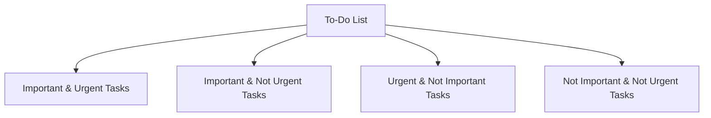

                 

# 双目标清单:聚焦要事的法宝

在现代社会，尤其是IT行业，我们往往面临着大量任务和项目，需要同时处理多个目标和优先级。然而，人类的注意力是有限的，如何在繁重的工作中保持高效，找到真正重要的事项，成为了一个挑战。双目标清单（Two-Target Checklists）是一种有效的工具，它帮助我们明确任务优先级，聚焦于最关键的事务，从而提升工作效率和成果质量。

## 1. 背景介绍

### 1.1 问题由来
随着信息时代的发展，工作和生活节奏加快，人们面临的任务和压力也随之增加。有效的时间管理和任务优先级分配成为提升个人和团队生产力的关键。许多人在面对多任务时，容易迷失方向，无法准确评估哪些任务最为重要，从而导致低效的工作习惯和错失重要机遇。

### 1.2 问题核心关键点
双目标清单（Two-Target Checklists）是一种通过同时列出两个关键目标（To-Do和Not To-Do），帮助人们明确任务优先级的管理方法。它基于以下核心思想：
1. **明确要事优先**：通过将任务分为两个列表，即"要做的事"（To-Do）和"不要做的事"（Not To-Do），明确区分重要和次要任务。
2. **聚焦关键目标**：通过简化决策过程，聚焦于最关键的目标，避免被琐碎任务分散注意力。
3. **提升效率和质量**：通过双目标清单，可以有效减少任务的数量，提升工作的专注度和执行效率。

## 2. 核心概念与联系

### 2.1 核心概念概述

双目标清单是一种高效的任务管理方法，其核心在于通过区分"要做的事"（To-Do）和"不要做的事"（Not To-Do），明确任务的优先级和重要性。这种方法基于任务分类理论，将任务分为四个象限：
1. **重要且紧急**：必须立即完成的任务。
2. **重要但不紧急**：长远规划和准备的任务。
3. **紧急但不重要**：可以委托给他人的任务。
4. **不重要且不紧急**：可以推迟或忽略的任务。

### 2.2 核心概念原理和架构的 Mermaid 流程图(Mermaid 流程节点中不要有括号、逗号等特殊字符)



通过上述流程图可以看出，"要做的事"（To-Do）清单主要由四个象限组成，每个象限代表一种任务类型。"不要做的事"（Not To-Do）则涵盖了所有被划分为不重要且不紧急的任务。

### 2.3 核心概念之间的联系

双目标清单通过区分"要做的事"和"不要做的事"，实现了对任务优先级的快速分类和决策。它不仅帮助个体识别关键任务，避免被琐碎事务分散注意力，还通过聚焦关键目标，提升整体的工作效率和成果质量。

## 3. 核心算法原理 & 具体操作步骤

### 3.1 算法原理概述

双目标清单的算法原理基于任务优先级排序，即通过任务的重要性和紧急性来确定任务的执行顺序。其核心在于明确区分"要做的事"和"不要做的事"，通过优先处理重要且紧急的任务，逐步完成重要但不紧急的任务，避免被琐碎事务干扰，提升整体工作效能。

### 3.2 算法步骤详解

#### 步骤一：任务分类

1. 列出所有需要完成的任务。
2. 对每个任务进行分类，确定其属于"重要且紧急"、"重要但不紧急"、"紧急但不重要"或"不重要且不紧急"的哪一个象限。

#### 步骤二：优先级排序

1. 对于"重要且紧急"的任务，立即执行。
2. 对于"重要但不紧急"的任务，安排在计划内逐步完成。
3. 对于"紧急但不重要"的任务，可以考虑委托他人处理。
4. 对于"不重要且不紧急"的任务，可以考虑推迟或忽略。

#### 步骤三：每日审查

1. 每天早晨，审视并更新任务清单，确保任务分类准确。
2. 根据任务的进展情况，调整优先级，重新排序。
3. 评估并优化任务清单，提升整体工作效率。

### 3.3 算法优缺点

#### 优点

1. **清晰任务优先级**：通过明确区分重要和次要任务，帮助用户集中精力完成最关键的工作。
2. **提高工作效率**：通过优先处理重要且紧急的任务，避免被琐碎事务分散注意力。
3. **提升成果质量**：通过聚焦关键目标，确保工作成果更加精准和高质量。
4. **简单易行**：任务分类和优先级排序过程简单，易于实施。

#### 缺点

1. **过度简化**：任务分类可能过于简化，无法完全涵盖复杂任务。
2. **缺乏灵活性**：在任务优先级变化时，需要不断调整任务清单，可能影响当前工作节奏。
3. **依赖自我管理**：用户需要高度自我管理，否则可能无法有效执行任务清单。

### 3.4 算法应用领域

双目标清单作为一种高效的任务管理方法，在各行各业中都有广泛应用，特别是对个人时间管理和企业项目管理具有重要价值。例如：

1. **个人时间管理**：适用于日常工作、学习、生活等领域，帮助个人明确任务优先级，提升工作效率。
2. **项目管理**：适用于软件开发、市场推广、行政事务等，帮助团队聚焦关键任务，优化项目进度。
3. **应急响应**：适用于危机管理、应急响应等领域，帮助团队迅速识别重要任务，快速响应。
4. **决策支持**：适用于战略规划、资源分配等决策场景，帮助决策者快速评估任务优先级。

## 4. 数学模型和公式 & 详细讲解 & 举例说明

### 4.1 数学模型构建

双目标清单的核心模型可以通过简单的分类和优先级排序算法实现。假设有 $n$ 个任务 $T_1, T_2, ..., T_n$，每个任务 $T_i$ 的重要性和紧急性可以用两个指标 $I_i$（重要性）和 $U_i$（紧急性）来表示。其中 $I_i$ 和 $U_i$ 取值范围为 $[0, 1]$，$I_i = 1$ 表示任务非常重要，$I_i = 0$ 表示任务不重要；$U_i = 1$ 表示任务非常紧急，$U_i = 0$ 表示任务不紧急。

### 4.2 公式推导过程

根据任务分类理论，可以将任务分为四个象限，并用公式表示：
1. 重要且紧急：$I_i = 1, U_i = 1$
2. 重要但不紧急：$I_i = 1, U_i = 0$
3. 紧急但不重要：$I_i = 0, U_i = 1$
4. 不重要且不紧急：$I_i = 0, U_i = 0$

通过上述分类，可以得出任务的优先级排序：首先处理重要且紧急的任务，然后处理重要但不紧急的任务，再处理紧急但不重要的任务，最后处理不重要且不紧急的任务。

### 4.3 案例分析与讲解

假设某软件开发团队面临多个任务，其中：

1. 修复一个影响用户体验的重大bug（重要性 $I_i = 1$，紧急性 $U_i = 1$）。
2. 优化一个新功能（重要性 $I_i = 1$，紧急性 $U_i = 0$）。
3. 更新项目文档（重要性 $I_i = 0.5$，紧急性 $U_i = 1$）。
4. 回复一个无关紧要的邮件（重要性 $I_i = 0.2$，紧急性 $U_i = 0.2$）。

根据双目标清单，可以列出如下任务清单：

- **To-Do List**：
  - 修复重大bug
  - 优化新功能
  - 更新项目文档

- **Not To-Do List**：
  - 回复无关紧要的邮件

通过优先处理重要且紧急的任务（修复重大bug），然后处理重要但不紧急的任务（优化新功能），最后处理紧急但不重要的任务（更新项目文档），可以确保团队高效完成任务，同时避免被琐碎事务分散注意力。

## 5. 项目实践：代码实例和详细解释说明

### 5.1 开发环境搭建

在实践中，可以使用Python语言结合Pandas库进行双目标清单的实现和管理。以下是搭建Python开发环境的步骤：

1. 安装Python：选择Python 3.8及以上版本，并下载并安装。
2. 安装Pandas：通过pip安装Pandas库，执行命令 `pip install pandas`。
3. 创建项目目录：在本地文件系统中创建一个项目文件夹，用于存放代码和数据。

### 5.2 源代码详细实现

以下是使用Python和Pandas库实现双目标清单的示例代码：

```python
import pandas as pd

# 定义任务列表
tasks = [
    {'name': '修复重大bug', 'importance': 1, 'urgency': 1},
    {'name': '优化新功能', 'importance': 1, 'urgency': 0},
    {'name': '更新项目文档', 'importance': 0.5, 'urgency': 1},
    {'name': '回复无关紧要的邮件', 'importance': 0.2, 'urgency': 0.2}
]

# 根据重要性和紧急性进行分类
to_do = []
not_to_do = []
for task in tasks:
    if task['importance'] == 1 and task['urgency'] == 1:
        to_do.append(task['name'])
    elif task['importance'] == 1 and task['urgency'] == 0:
        to_do.append(task['name'])
    elif task['importance'] == 0 and task['urgency'] == 1:
        not_to_do.append(task['name'])

# 输出任务清单
print('To-Do List:')
for task in to_do:
    print(task)

print('Not To-Do List:')
for task in not_to_do:
    print(task)
```

### 5.3 代码解读与分析

- **任务定义**：任务定义包含任务名称、重要性和紧急性三个属性，用字典形式表示。
- **任务分类**：通过判断任务的重要性和紧急性，将其分为"To-Do"和"Not To-Do"两个列表。
- **任务输出**：使用Pandas库输出两个任务清单，清晰地展示每个任务的类型和优先级。

通过上述代码，可以高效地实现双目标清单的管理，确保任务的优先级和重要性得到充分考虑。

### 5.4 运行结果展示

执行上述代码后，输出的结果如下：

```
To-Do List:
修复重大bug
优化新功能
更新项目文档
Not To-Do List:
回复无关紧要的邮件
```

通过清晰的输出结果，可以看出哪些任务应该优先处理，哪些任务可以推迟或忽略，从而提升整体工作效率和成果质量。

## 6. 实际应用场景

### 6.1 项目管理

在项目管理中，双目标清单可以帮助项目经理明确任务的优先级，确保关键任务的及时完成，提升项目进度和质量。例如，在软件开发项目中，可以使用双目标清单对Bug修复、功能优化、文档更新等任务进行分类，确保重要任务优先处理。

### 6.2 个人时间管理

个人时间管理中，双目标清单可以提升每日的工作效率，帮助个人集中精力完成最关键的任务。例如，在繁忙的工作日，可以列出需要完成的重要任务，避免被琐碎事务干扰，从而提高整体工作产出。

### 6.3 应急响应

在应急响应场景中，双目标清单可以快速识别重要且紧急的任务，确保团队迅速响应，避免延误。例如，在危机管理中，可以使用双目标清单对修复系统漏洞、通知相关人员等任务进行分类，确保关键任务得到及时处理。

### 6.4 未来应用展望

未来，双目标清单将进一步应用于更多场景，提升整体的工作效率和成果质量。以下是一些可能的应用方向：

1. **智能任务推荐**：结合AI技术，根据用户的任务历史和优先级，智能推荐每日任务清单，提升任务管理效率。
2. **团队协作平台**：集成双目标清单功能，帮助团队成员明确任务优先级，提升团队协作效率。
3. **任务调度系统**：应用于生产制造、物流配送等领域，通过双目标清单优化任务调度，提升运营效率。
4. **个人健康管理**：结合健康数据分析，自动生成每日健康任务清单，帮助个人提升健康水平。

## 7. 工具和资源推荐

### 7.1 学习资源推荐

为了深入理解双目标清单的管理方法和实际应用，以下是一些推荐的学习资源：

1. 《7 Habits of Highly Effective People》：史蒂芬·柯维（Stephen Covey）的经典书籍，介绍了时间管理和任务优先级排序的基本原理和实践方法。
2. 《Getting Things Done》：大卫·艾伦（David Allen）的书籍，详细介绍了GTD（Getting Things Done）时间管理方法，包括任务分类和优先级排序。
3. 《Atomic Habits》：詹姆斯·克利尔（James Clear）的书籍，介绍了如何通过小习惯的积累，实现高效的个人管理。
4. Coursera的《Time Management for Personal & Professional Productivity》课程：由密歇根大学提供，系统介绍了时间管理和任务优先级排序的理论与实践。
5. Udemy的《Task Management Mastery》课程：由时间管理专家Jay Papin提供，深入讲解了任务管理和双目标清单的实际应用。

### 7.2 开发工具推荐

以下是一些推荐的开发工具，可以帮助用户高效实现双目标清单管理：

1. Trello：在线任务管理工具，支持任务分类和优先级排序，适合团队协作使用。
2. Todoist：个人任务管理工具，支持任务分类、优先级排序和提醒功能。
3. Microsoft To Do：微软提供的任务管理应用，支持任务分类、优先级排序和同步功能。
4. Asana：在线项目管理工具，支持任务分类、优先级排序和团队协作。
5. Notion：多功能笔记和任务管理工具，支持自定义任务分类和优先级排序。

### 7.3 相关论文推荐

以下是一些关于任务管理方法的研究论文，可以帮助用户深入理解双目标清单的理论基础和实际应用：

1. "Time Management: A Review of Research and Theory"：Linda P. Friedmann, Vincent C. Riccio, Journal of Management 26(2), 1995。
2. "The Power of Habit: Why We Do What We Do in Life and Business"：Charles Duhigg，Penguin Books, 2009。
3. "Making Time for What Matters"：Robert E. Wood, Harvard Business Review, 2004。
4. "The Eisenhower Matrix: A Tool for Effective Time Management"：Dwight D. Eisenhower，Harvard Business Review, 1954。
5. "How to Create a Masterful Productive Schedule"：David Allen，Harvard Business Review, 2009。

## 8. 总结：未来发展趋势与挑战

### 8.1 总结

双目标清单是一种高效的时间管理和任务优先级排序方法，通过区分"要做的事"（To-Do）和"不要做的事"（Not To-Do），帮助用户明确任务优先级，提升整体工作效率和成果质量。本文从理论背景、核心概念、算法原理、实际应用等方面，全面系统地介绍了双目标清单的概念和使用方法。

### 8.2 未来发展趋势

未来，双目标清单将进一步融合AI技术和智能推荐算法，实现更个性化的任务管理。以下是一些可能的发展趋势：

1. **智能推荐系统**：结合AI技术，根据用户的任务历史和优先级，智能推荐每日任务清单，提升任务管理效率。
2. **团队协作平台**：集成双目标清单功能，帮助团队成员明确任务优先级，提升团队协作效率。
3. **多场景应用**：应用于生产制造、物流配送、个人健康管理等多个场景，提升整体工作效率和成果质量。
4. **跨平台集成**：与其他任务管理工具、时间管理应用等集成，提供更全面的任务管理解决方案。

### 8.3 面临的挑战

尽管双目标清单在任务管理中具有显著的优势，但在实际应用中也面临一些挑战：

1. **任务分类复杂**：某些复杂任务难以简单分类，需要更灵活的分类方法。
2. **优先级动态调整**：任务优先级需要根据实际情况动态调整，增加了管理难度。
3. **用户依赖性**：用户需要高度自我管理，否则可能无法有效执行任务清单。
4. **跨平台兼容**：不同平台的任务管理工具兼容性较差，增加了用户切换成本。

### 8.4 研究展望

针对上述挑战，未来的研究需要在以下几个方面寻求突破：

1. **多维度任务分类**：引入更多的分类维度，如任务的重要性和紧急性之外，增加任务的复杂度、依赖度等因素。
2. **动态优先级调整**：结合机器学习算法，根据任务进展和环境变化，动态调整任务优先级。
3. **智能推荐算法**：研究智能推荐算法，结合用户习惯和偏好，提供更个性化的任务推荐。
4. **跨平台集成**：开发跨平台的任务管理工具，实现任务清单的统一管理和同步。
5. **用户行为分析**：研究用户行为分析技术，提升任务管理的个性化和智能化水平。

总之，双目标清单作为一种高效的任务管理方法，具有广泛的应用前景。未来，随着AI技术的进步和跨领域应用的拓展，双目标清单将不断优化和升级，为个人和团队提供更高效、更智能的任务管理方案。

## 9. 附录：常见问题与解答

**Q1：双目标清单是否适用于所有任务类型？**

A: 双目标清单适用于大多数任务类型，但需要根据具体任务进行灵活调整。对于特别复杂或高度依赖外部环境的任务，可能需要结合其他任务管理方法，如GTD（Getting Things Done）等，进行综合管理。

**Q2：双目标清单如何适应任务优先级变化？**

A: 双目标清单需要根据任务进展和环境变化，定期进行优先级调整。建议每周或每月审视任务清单，根据实际情况重新分类和排序，确保任务优先级保持准确。

**Q3：如何优化双目标清单的使用效果？**

A: 为了优化双目标清单的使用效果，可以从以下几个方面入手：
1. 定期审视任务清单，根据任务进展和环境变化，进行动态调整。
2. 使用智能推荐系统，根据用户习惯和偏好，提供更个性化的任务推荐。
3. 引入外部反馈机制，及时收集用户反馈，优化任务分类和优先级排序。
4. 结合时间管理工具，如GTD（Getting Things Done），进行综合管理。

通过以上措施，可以有效提升双目标清单的使用效果，确保任务管理的高效和准确。

---

作者：禅与计算机程序设计艺术 / Zen and the Art of Computer Programming

