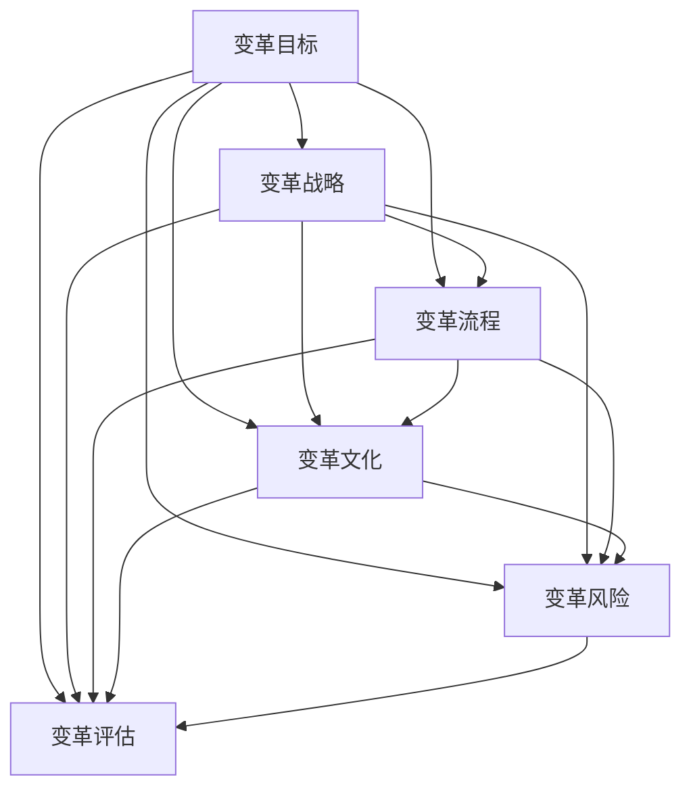

                 

# 变革管理：引导组织转型的技巧

> 关键词：组织转型,变革管理,领导力,变革理论,转型策略

## 1. 背景介绍

### 1.1 问题由来

在快速变化的商业环境中，组织需要不断地适应新的技术和市场趋势，以保持竞争力。然而，大多数组织在面对转型时，都会遇到不同程度的阻碍，如员工抵触、资源匮乏、战略不清等。变革管理（Change Management）便是为了帮助组织有效应对这些挑战，平滑过渡到新的状态，实现可持续发展。

### 1.2 问题核心关键点

变革管理的核心在于通过科学的方法和策略，确保组织顺利完成转型。其关键点包括：
1. **明确的变革目标**：设定清晰、可衡量的变革目标，指引组织转型方向。
2. **全面的变革规划**：设计详细的变革实施计划，包括时间表、资源分配、风险管理等。
3. **有效的沟通策略**：确保信息透明，及时更新，减少员工对变革的抵触情绪。
4. **灵活的变革策略**：根据实际情况调整变革计划，保持敏捷性和灵活性。
5. **领导力的培养**：提升管理层的变革领导能力，确保变革顺利推进。

变革管理的目标是使组织能够适应变化，持续创新，提高整体竞争力。

### 1.3 问题研究意义

研究变革管理的理论和实践，对于提升组织适应性、促进业务增长、优化组织结构具有重要意义：

1. **提高适应性**：通过科学规划和管理，使组织能够更有效地适应外部环境的变化，快速响应市场机会。
2. **推动业务增长**：通过变革管理，优化流程，提升效率，实现业务增长和盈利。
3. **优化组织结构**：通过变革管理，调整组织结构，实现业务重构，提升组织能力。
4. **降低风险**：通过全面的风险评估和管理，减少变革过程中可能遇到的不确定性和风险。
5. **提升员工满意度**：通过有效的沟通和参与机制，提升员工对变革的认同感和参与度，促进组织的稳定发展。

变革管理已成为现代企业发展的重要组成部分，对组织的长期成功至关重要。

## 2. 核心概念与联系

### 2.1 核心概念概述

变革管理涉及多个关键概念，这些概念之间相互关联，共同构成了变革管理的框架：

- **变革目标**：变革旨在实现的长期目标和短期目标。
- **变革战略**：为达成变革目标而设计的详细行动计划和策略。
- **变革流程**：变革实施的步骤和方法。
- **变革文化**：组织内对变革的接受程度和支持程度。
- **变革风险**：变革过程中可能遇到的不确定性和风险。
- **变革评估**：对变革实施过程和结果的评估和反馈。

这些概念通过以下Mermaid流程图进行展示：



### 2.2 核心概念原理和架构

变革管理的基本原理基于组织行为学和心理学，重点在于理解和改变个体的行为和态度，从而实现组织层面的变革。以下是一些关键原理：

- **勒温的三阶段模型**：变革管理可以分为解冻（Unfreeze）、变革（Change）、冻结（Refreeze）三个阶段。解冻阶段需要打破旧有的习惯和观念；变革阶段实施具体的变革措施；冻结阶段巩固变革成果，形成新的工作方式。

- **约翰·科特（John Kotter）的变革八步法**：包括创建紧迫感、组建变革团队、明确变革愿景、传播变革愿景、移除变革障碍、取得短期成果、巩固变革成果和建立变革机制八个步骤。

- **诺曼·维尔奇（Norman Vinjayal）的变革三角模型**：变革管理包含技术（Technology）、人员（People）和流程（Process）三个维度，需要在这三个方面进行综合考虑和协调。

## 3. 核心算法原理 & 具体操作步骤

### 3.1 算法原理概述

变革管理没有单一的“算法”，而是通过一系列策略、工具和方法，引导组织逐步完成转型。以下概述变革管理的主要原理：

- **系统思维**：变革管理需要考虑组织整体的运作，而不仅仅是局部的优化。系统思维强调各部分之间的相互作用和依赖关系。
- **行为科学**：变革管理的核心在于改变人的行为和态度。行为科学提供了一系列方法，如激励理论、动机理论、群体动力学等。
- **决策理论**：变革过程中需要进行大量的决策，决策理论帮助管理者评估和选择最优方案。
- **组织学习**：变革管理强调组织的学习能力，通过不断的反思和改进，提升组织的适应性和创新能力。

### 3.2 算法步骤详解

变革管理的具体步骤可以分为以下五个阶段：

**阶段一：准备阶段**

- **收集信息**：收集组织内部和外部的数据，包括市场环境、竞争对手、客户需求等，作为变革决策的依据。
- **评估现状**：分析组织当前的状态，包括优势、劣势、机会和威胁（SWOT分析）。
- **制定愿景**：确定变革的最终目标和愿景，明确变革的方向和路径。

**阶段二：规划阶段**

- **制定战略**：根据愿景和现状，制定详细的变革战略，包括资源分配、时间表、关键里程碑等。
- **建立团队**：组建变革管理团队，确保变革策略得到有效执行。
- **沟通计划**：制定内部和外部的沟通计划，确保信息透明和及时更新。

**阶段三：实施阶段**

- **宣传变革**：通过培训、会议、宣传材料等形式，宣传变革的重要性和具体措施。
- **执行计划**：按照战略和时间表，逐步实施变革措施，确保每一步都顺利推进。
- **风险管理**：监控变革过程中的风险，及时调整策略，减少不确定性。

**阶段四：评估阶段**

- **绩效评估**：对变革的实施过程和结果进行评估，收集反馈信息，评估目标是否达成。
- **持续改进**：根据评估结果，进行必要的调整和改进，确保变革目标的实现。

**阶段五：巩固阶段**

- **固化成果**：将变革成果制度化，形成新的工作方式和流程。
- **持续学习**：建立持续学习和改进机制，保持组织的适应性和创新能力。

### 3.3 算法优缺点

变革管理有以下优点：
1. **系统性**：通过系统思维和全面的规划，变革管理能够全面考虑组织内部的各种因素，避免单一维度的决策。
2. **科学性**：变革管理基于行为科学和决策理论，提供了一套科学的方法和工具，确保变革的合理性和有效性。
3. **灵活性**：变革管理强调灵活性和适应性，能够根据实际情况进行调整，避免僵化和教条。

变革管理的缺点包括：
1. **复杂性**：变革管理涉及多个方面和环节，需要协调多方利益，管理复杂。
2. **资源需求高**：变革管理需要投入大量的人力、物力和时间，对资源要求高。
3. **阻力大**：变革过程中可能会遇到员工的抵触和反对，需要额外的管理手段和沟通技巧。

### 3.4 算法应用领域

变革管理在多个领域都有广泛的应用，包括但不限于：

- **企业重组**：通过组织架构调整、流程优化、部门整合等方式，提升企业效率和竞争力。
- **技术转型**：采用新技术、新工具，提升产品和服务质量，实现数字化转型。
- **文化变革**：改变组织文化，提升员工满意度和工作积极性，促进组织发展。
- **市场拓展**：进入新市场，开发新产品，提升市场份额和品牌影响力。
- **流程优化**：改进工作流程，提升运营效率，降低成本，提高质量。

## 4. 数学模型和公式 & 详细讲解 & 举例说明

### 4.1 数学模型构建

变革管理没有固定的数学模型，但可以使用一些定量的方法来辅助决策。例如，可以使用回归分析来预测变革对业务绩效的影响。

假设有一个组织，其业务绩效可以用以下线性回归模型表示：

$$
y = \beta_0 + \beta_1 x_1 + \beta_2 x_2 + \epsilon
$$

其中，$y$ 表示业务绩效，$x_1$ 和 $x_2$ 分别表示变革的某些指标，$\beta_0$、$\beta_1$、$\beta_2$ 为回归系数，$\epsilon$ 为误差项。

### 4.2 公式推导过程

使用最小二乘法（Least Squares Method）来求解回归系数 $\beta_0$、$\beta_1$、$\beta_2$。设样本数量为 $N$，样本数据为 $(x_1, x_2, y)$，最小二乘法的目标是最小化误差项 $\epsilon$ 的平方和。

最小化目标函数：

$$
\min_{\beta_0, \beta_1, \beta_2} \sum_{i=1}^{N} (y_i - \beta_0 - \beta_1 x_{1i} - \beta_2 x_{2i})^2
$$

求解该目标函数的最小值，得到：

$$
\beta_0 = \frac{\sum_{i=1}^{N} y_i - (\sum_{i=1}^{N} x_{1i})(\sum_{i=1}^{N} y_i) / N + (\sum_{i=1}^{N} x_{1i})^2 / N}{\sum_{i=1}^{N} x_{1i}^2 / N - (\sum_{i=1}^{N} x_{1i})^2 / N}
$$

$$
\beta_1 = \frac{\sum_{i=1}^{N} x_{1i}y_i - (\sum_{i=1}^{N} x_{1i}) (\sum_{i=1}^{N} y_i) / N}{\sum_{i=1}^{N} x_{1i}^2 / N - (\sum_{i=1}^{N} x_{1i})^2 / N}
$$

$$
\beta_2 = \frac{\sum_{i=1}^{N} x_{2i}y_i - (\sum_{i=1}^{N} x_{2i}) (\sum_{i=1}^{N} y_i) / N}{\sum_{i=1}^{N} x_{2i}^2 / N - (\sum_{i=1}^{N} x_{2i})^2 / N}
$$

### 4.3 案例分析与讲解

假设某公司决定通过技术转型提升业务绩效，选取了两个指标 $x_1$（技术投入）和 $x_2$（员工培训），使用上文介绍的回归模型来预测业务绩效的提升。

- **数据收集**：收集公司过去一年的技术投入和员工培训数据，以及业务绩效数据。
- **模型构建**：使用线性回归模型，将业务绩效与技术投入和员工培训数据进行拟合。
- **结果分析**：通过分析回归系数的显著性，判断技术投入和员工培训对业务绩效的影响。

例如，如果回归结果显示 $x_1$ 和 $x_2$ 的系数均为正且显著，说明技术投入和员工培训对业务绩效有显著的正面影响。

## 5. 项目实践：代码实例和详细解释说明

### 5.1 开发环境搭建

变革管理的实践通常使用Python进行数据分析和模型构建。以下是开发环境的搭建步骤：

1. **安装Python**：从官网下载并安装Python 3.x版本。
2. **安装Pandas**：使用pip安装Pandas库，用于数据处理和分析。
3. **安装NumPy**：使用pip安装NumPy库，用于数学计算和矩阵操作。
4. **安装Matplotlib**：使用pip安装Matplotlib库，用于绘制图表和可视化数据。
5. **安装Scikit-Learn**：使用pip安装Scikit-Learn库，用于机器学习和模型构建。
6. **安装Seaborn**：使用pip安装Seaborn库，用于数据可视化。

### 5.2 源代码详细实现

下面是一个使用Pandas和Scikit-Learn库进行回归分析的Python代码示例：

```python
import pandas as pd
import numpy as np
from sklearn.linear_model import LinearRegression
from sklearn.metrics import mean_squared_error
import matplotlib.pyplot as plt
import seaborn as sns

# 加载数据
data = pd.read_csv('business_performance.csv')

# 数据清洗和处理
X = data[['technical_investment', 'employee_training']]
y = data['business_performance']
X = np.array(X)
y = np.array(y)

# 建立线性回归模型
model = LinearRegression()
model.fit(X, y)

# 预测业务绩效
X_new = np.array([[200000, 10000]])
y_new = model.predict(X_new)

# 计算R方值
r2 = model.score(X, y)

# 绘制散点图和回归线
sns.scatterplot(x=技术投入, y=业务绩效, data=data)
sns.plot(x=技术投入, y=业务绩效, data=data, linestyle='--', color='r', label='回归线')
plt.show()

# 输出结果
print('回归系数：', model.coef_)
print('截距：', model.intercept_)
print('R方值：', r2)
print('预测业务绩效：', y_new)
```

### 5.3 代码解读与分析

上述代码实现了以下功能：

- **数据加载**：使用Pandas加载业务绩效数据，包括技术投入、员工培训和业务绩效三个变量。
- **数据处理**：清洗和处理数据，构建回归模型所需的数据格式。
- **模型建立**：使用Scikit-Learn的LinearRegression模型，构建线性回归模型。
- **模型评估**：计算回归模型的R方值，评估模型的拟合度。
- **结果预测**：使用模型预测新的技术投入和员工培训组合下的业务绩效。
- **数据可视化**：使用Matplotlib和Seaborn绘制散点图和回归线，直观展示数据关系。

## 6. 实际应用场景

### 6.1 企业重组

某传统制造企业面临市场竞争激烈、成本上升等挑战，决定进行组织重组，提升运营效率。企业通过以下步骤实现重组：

1. **评估现状**：对企业的组织结构、流程、人员配置等进行全面的评估。
2. **制定愿景**：确定重组的最终目标，提升运营效率和市场竞争力。
3. **规划方案**：设计详细的重组计划，包括部门整合、流程优化等。
4. **实施方案**：逐步实施重组计划，确保每一步顺利推进。
5. **评估效果**：评估重组的效果，收集员工和客户的反馈，持续改进。

### 6.2 技术转型

某互联网公司决定通过引入人工智能技术，提升产品开发速度和质量。公司通过以下步骤实现技术转型：

1. **收集信息**：了解人工智能技术的最新进展和应用案例。
2. **评估现状**：分析公司现有技术架构和资源配置。
3. **制定愿景**：确定技术转型的最终目标，提升产品开发速度和质量。
4. **规划方案**：设计详细的技术转型计划，包括引入AI工具和平台。
5. **实施方案**：逐步引入AI技术，提升产品开发效率和质量。
6. **评估效果**：评估技术转型的效果，持续优化技术架构和资源配置。

### 6.3 文化变革

某公司决定通过文化变革，提升员工的积极性和创造力。公司通过以下步骤实现文化变革：

1. **收集信息**：了解员工对当前文化的反馈和期望。
2. **评估现状**：分析公司现有的文化状况和存在的问题。
3. **制定愿景**：确定文化变革的最终目标，提升员工的积极性和创造力。
4. **规划方案**：设计详细的文化变革计划，包括团队建设、激励机制等。
5. **实施方案**：逐步实施文化变革计划，确保每一步顺利推进。
6. **评估效果**：评估文化变革的效果，收集员工反馈，持续改进。

## 7. 工具和资源推荐

### 7.1 学习资源推荐

为了帮助开发者系统掌握变革管理的相关知识，这里推荐一些优质的学习资源：

1. **《变革管理》（作者：约翰·科特）**：该书系统介绍了变革管理的理论和方法，是变革管理的经典之作。
2. **《组织变革与转型》（作者：诺曼·维尔奇）**：该书深入探讨了组织变革的三个维度，提供了实用的变革管理工具。
3. **Coursera《变革管理》课程**：斯坦福大学开设的变革管理课程，提供系统的变革管理理论和实践。
4. **Udemy《变革领导力》课程**：通过实际案例，介绍变革领导力的关键技巧和实践。
5. **Harvard Business Review《变革管理》系列文章**：哈佛商学院的研究文章，提供最新的变革管理研究成果和实践案例。

### 7.2 开发工具推荐

变革管理的实践通常使用Python进行数据分析和模型构建。以下是常用的开发工具：

1. **Pandas**：用于数据处理和分析。
2. **NumPy**：用于数学计算和矩阵操作。
3. **Scikit-Learn**：用于机器学习和模型构建。
4. **Matplotlib**：用于数据可视化。
5. **Seaborn**：用于数据可视化。
6. **Jupyter Notebook**：用于编写和运行Python代码。

### 7.3 相关论文推荐

变革管理领域的研究成果丰富，以下是几篇具有代表性的论文：

1. **《组织变革管理：一个系统性的视角》（作者：约翰·科特）**：系统介绍了变革管理的理论和方法。
2. **《组织变革的五个关键阶段》（作者：勒温）**：提出变革管理的三个阶段模型，被广泛应用于变革管理实践中。
3. **《变革管理中的角色和责任》（作者：诺曼·维尔奇）**：探讨变革管理中各个角色的职责和权利。
4. **《变革管理中的员工参与》（作者：艾丽丝·沃克）**：强调员工参与在变革管理中的重要性。
5. **《变革管理中的风险评估与管理》（作者：玛莎·戴维）**：提出风险评估和管理方法，确保变革过程的稳定和可控。

## 8. 总结：未来发展趋势与挑战

### 8.1 研究成果总结

变革管理在过去几十年中取得了显著的进展，但仍然面临一些挑战。未来需要进一步的研究和实践，推动变革管理向更加科学、系统、灵活的方向发展。

### 8.2 未来发展趋势

变革管理未来的发展趋势包括：

1. **数字化变革**：数字化技术将成为变革管理的重要工具，通过数据驱动决策，提升变革效果。
2. **敏捷变革**：敏捷方法将进一步应用于变革管理，提升变革的灵活性和响应速度。
3. **人本变革**：更加注重员工参与和心理健康的变革管理，提升变革的成功率。
4. **全球化变革**：全球化背景下的变革管理，需要考虑跨文化、跨国界等因素。
5. **可持续发展变革**：将可持续发展理念融入变革管理，推动企业的可持续发展。

### 8.3 面临的挑战

尽管变革管理取得了一些进展，但仍然面临一些挑战：

1. **变革阻力大**：员工的抵触和反对是变革管理的重要挑战，需要额外的管理手段和沟通技巧。
2. **资源需求高**：变革管理需要投入大量的人力、物力和时间，对资源要求高。
3. **风险管理难**：变革过程中可能遇到的各种不确定性和风险，需要有效的风险管理措施。
4. **持续改进难**：变革管理需要持续改进，但实际操作中往往难以保持。
5. **衡量效果难**：变革效果难以量化，需要建立科学的评估和反馈机制。

### 8.4 研究展望

未来的研究需要在以下几个方面取得突破：

1. **数据驱动的变革管理**：通过数据分析和机器学习，优化变革管理决策。
2. **员工参与的变革管理**：提升员工的积极性和参与度，确保变革顺利推进。
3. **跨文化变革管理**：在多文化背景下，实现有效的变革管理。
4. **可持续发展变革管理**：将可持续发展理念融入变革管理，推动企业的可持续发展。
5. **技术支持的变革管理**：利用人工智能和大数据技术，提升变革管理的效率和效果。

## 9. 附录：常见问题与解答

**Q1：变革管理是否适用于所有类型的组织？**

A: 变革管理适用于大多数类型的组织，无论是传统制造企业、互联网公司还是公共机构。但不同类型的组织在变革管理中需要针对性地调整策略和方法。

**Q2：变革管理需要多长时间才能完成？**

A: 变革管理的时间周期因组织规模、变革复杂度和外部环境而异。通常需要数月到数年不等，但具体时间取决于多个因素。

**Q3：变革管理是否需要外部咨询师的参与？**

A: 外部咨询师可以提供专业的知识和经验，帮助组织克服变革管理中的难题。但最终变革的执行和落实还是需要内部管理层的全力支持。

**Q4：变革管理是否能够实现组织的可持续发展？**

A: 变革管理能够提升组织的适应性和创新能力，促进可持续发展。但实现可持续发展还需要结合其他策略和措施，如绿色管理、社会责任等。

**Q5：变革管理是否能够提升组织的业绩？**

A: 变革管理通过优化组织结构和流程，提升运营效率和创新能力，能够显著提升组织的业绩。但成功需要精心策划和持续改进。

---

作者：禅与计算机程序设计艺术 / Zen and the Art of Computer Programming

