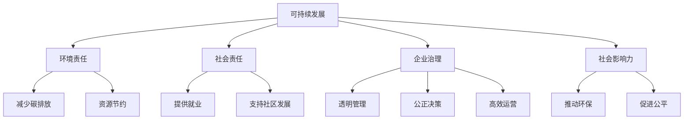

                 

# 可持续发展管理：实现长期环境和社会责任

> 关键词：可持续发展, 环境责任, 社会责任, 企业治理, 社会影响力

## 1. 背景介绍

### 1.1 问题由来

随着全球经济和社会的发展，企业的可持续发展管理变得越来越重要。一方面，环境问题日益严重，气候变化、资源短缺、污染等问题正威胁着人类的生存。另一方面，社会责任和公平问题也愈发突出，贫困、教育、健康等问题亟需得到解决。

企业的可持续发展管理不仅关系到自身的生存和发展，更关乎社会的稳定和进步。如何有效地管理企业资源，平衡环境、社会和经济目标，是当今企业面临的重大挑战。

### 1.2 问题核心关键点

可持续发展管理的核心在于平衡企业的短期利益和长期利益，在追求经济增长的同时，实现对环境和社会的影响最小化。这需要企业在战略、运营、治理等多个层面进行全面考虑和改进。

具体而言，可持续发展管理的关键点包括：

- 环境责任：减少对环境的影响，如降低碳排放、减少废物、保护生态系统等。
- 社会责任：关注和改善社会问题，如贫困、教育、健康等，确保企业的运营不会对社会造成负面影响。
- 企业治理：建立透明、公正、高效的管理体系，确保企业决策的合法性和合理性。
- 社会影响力：企业应积极参与和推动社会公益事业，提升社会影响力。

这些核心关键点构成了可持续发展管理的框架，指导企业如何在追求长期价值的同时，实现环境、社会和经济的和谐共存。

## 2. 核心概念与联系

### 2.1 核心概念概述

为更好地理解可持续发展管理，本节将介绍几个密切相关的核心概念：

- **可持续发展(Sustainable Development)**：指在满足当前需求的同时，不损害未来代际的发展能力，实现经济、社会、环境的和谐发展。
- **环境责任(Environmental Responsibility)**：企业在运营过程中，应采取措施减少对环境的不利影响，如减少碳排放、节约资源等。
- **社会责任(Social Responsibility)**：企业在追求经济利益的同时，应关注和改善社会问题，如提供就业机会、支持社区发展等。
- **企业治理(Enterprise Governance)**：建立透明、公正、高效的管理体系，确保企业决策的合法性和合理性。
- **社会影响力(Social Impact)**：企业通过自身行为对社会产生的正面影响，如推动环保技术发展、促进社会公平等。

这些核心概念之间的逻辑关系可以通过以下Mermaid流程图来展示：



这个流程图展示了大企业在可持续发展管理中的核心概念及其相互关系：

1. 可持续发展是企业的总体目标，环境责任、社会责任和企业治理是其重要组成部分。
2. 环境责任包括减少碳排放和资源节约等具体措施。
3. 社会责任包括提供就业和支持社区发展等具体措施。
4. 企业治理包括透明管理、公正决策和高效运营等具体措施。
5. 社会影响力包括推动环保和促进公平等具体措施。

这些概念共同构成了可持续发展管理的核心框架，指导企业如何在追求长期价值的同时，实现环境、社会和经济的和谐共存。

## 3. 核心算法原理 & 具体操作步骤
### 3.1 算法原理概述

可持续发展管理涉及多个维度，需要通过系统化的管理策略来实现。其核心算法原理包括：

1. **战略规划(Strategic Planning)**：通过SWOT分析、PEST分析等方法，综合考虑企业的优势、劣势、机会和威胁，制定可持续发展战略。
2. **环境管理(Environmental Management)**：采用生命周期评估(LCA)、碳足迹计算等技术，分析企业运营过程中对环境的影响，并采取措施减少这些影响。
3. **社会责任管理(Social Responsibility Management)**：通过社会责任报告(SR报告)等手段，评估企业对社会的影响，并采取措施改善这些影响。
4. **企业治理管理(Enterprise Governance Management)**：建立透明、公正、高效的管理体系，确保企业决策的合法性和合理性。
5. **社会影响力管理(Social Impact Management)**：通过企业社会责任(ESR)活动等手段，推动环保和社会公益事业，提升社会影响力。

这些管理策略相互关联，形成一个完整的可持续发展管理框架。

### 3.2 算法步骤详解

可持续发展管理的算法步骤可以分为以下几个主要步骤：

**Step 1: 战略规划**

1. 收集环境和社会数据，进行SWOT分析和PEST分析，明确企业的优势、劣势、机会和威胁。
2. 制定可持续发展战略，确定企业的长期目标和短期目标。

**Step 2: 环境管理**

1. 采用LCA和碳足迹计算等技术，评估企业运营过程中对环境的影响。
2. 根据评估结果，制定环境管理计划，采取措施减少碳排放和资源浪费。

**Step 3: 社会责任管理**

1. 收集社会影响数据，进行SR报告等评估，明确企业对社会的影响。
2. 根据评估结果，制定社会责任管理计划，采取措施改善对社会的影响。

**Step 4: 企业治理管理**

1. 建立透明、公正、高效的管理体系，确保企业决策的合法性和合理性。
2. 定期审查管理体系，进行持续改进。

**Step 5: 社会影响力管理**

1. 通过ESR活动等手段，推动环保和社会公益事业，提升企业社会影响力。
2. 评估ESR活动的效果，进行持续改进。

### 3.3 算法优缺点

可持续发展管理算法具有以下优点：

1. 系统性：综合考虑环境、社会和经济多个维度，实现整体优化。
2. 可持续性：确保企业的长期发展，平衡短期利益和长期利益。
3. 透明性：通过透明的管理体系，确保决策的公正性和合法性。
4. 社会责任：关注和改善社会问题，提升企业社会影响力。

同时，该算法也存在一定的局限性：

1. 复杂性：涉及多个维度的管理，需要系统化的实施和管理。
2. 数据依赖：依赖准确的环境和社会数据，数据质量影响管理效果。
3. 成本高：需要投入大量资源进行数据收集和分析，管理成本较高。
4. 动态变化：环境和社会问题不断变化，需要持续更新和改进管理策略。

尽管存在这些局限性，但可持续发展管理算法仍是一种系统性、长期性的管理方法，对于企业实现可持续发展具有重要意义。

### 3.4 算法应用领域

可持续发展管理算法在多个领域得到了广泛应用，包括但不限于：

- **能源行业**：通过减少碳排放、提升能源利用效率等措施，实现绿色能源发展。
- **制造业**：通过资源节约、废物回收等措施，减少环境污染，实现循环经济。
- **零售业**：通过供应链管理、社会责任采购等措施，提升企业社会责任。
- **金融业**：通过ESG投资等措施，支持可持续发展项目，提升企业社会影响力。
- **科技行业**：通过开源项目、环境保护技术等措施，推动环保和社会公益事业。

这些领域的应用展示了可持续发展管理算法的广泛性和实用性，为不同行业的企业提供了系统化的管理框架。

## 4. 数学模型和公式 & 详细讲解 & 举例说明

### 4.1 数学模型构建

可持续发展管理涉及多个维度的数据，其数学模型构建需要综合考虑环境、社会和经济等多个方面。下面将构建一个综合性的数学模型：

$$
\text{Total Impact} = \text{Environmental Impact} + \text{Social Impact} + \text{Economic Impact}
$$

其中，

$$
\text{Environmental Impact} = \sum_{i=1}^n \text{E_i} \times \text{W_i}
$$

$$
\text{Social Impact} = \sum_{j=1}^m \text{S_j} \times \text{V_j}
$$

$$
\text{Economic Impact} = \text{Revenue} - \text{Cost}
$$

### 4.2 公式推导过程

上述数学模型的具体推导过程如下：

1. **环境影响(E_i)**：采用LCA和碳足迹计算等技术，评估企业运营过程中对环境的影响。通过将各项环境指标乘以相应的权重W_i，得到环境总影响。
2. **社会影响(S_j)**：通过SR报告等手段，评估企业对社会的影响。通过将各项社会指标乘以相应的权重V_j，得到社会总影响。
3. **经济效益(Economic Impact)**：通过收入和成本的差额，评估企业的经济效益。

通过综合考虑环境、社会和经济多个方面，可以得到企业的总影响。

### 4.3 案例分析与讲解

以下以一家能源公司为例，进行可持续发展管理的案例分析：

**案例背景**：某能源公司生产煤炭和天然气，其运营对环境和社会造成了较大影响。为了实现可持续发展，公司决定采用可持续发展管理算法，综合考虑环境、社会和经济三个方面。

**步骤1: 战略规划**

- **SWOT分析**：分析公司优势、劣势、机会和威胁，明确可持续发展战略。
- **PEST分析**：分析宏观环境因素，如政治、经济、社会和技术等，制定应对策略。

**步骤2: 环境管理**

- **LCA和碳足迹计算**：评估公司生产煤炭和天然气过程中的环境影响，包括温室气体排放、水资源消耗等。
- **环境管理计划**：根据评估结果，制定减少碳排放和资源浪费的措施，如提高能源利用效率、增加可再生能源使用等。

**步骤3: 社会责任管理**

- **SR报告**：评估公司对社会的影响，如就业、社区发展等。
- **社会责任管理计划**：根据评估结果，制定改善对社会影响的措施，如提供就业培训、支持社区建设等。

**步骤4: 企业治理管理**

- **透明管理体系**：建立透明、公正、高效的管理体系，确保企业决策的合法性和合理性。
- **管理体系审查**：定期审查管理体系，进行持续改进。

**步骤5: 社会影响力管理**

- **ESR活动**：推动环保和社会公益事业，提升企业社会影响力。
- **ESR活动评估**：评估ESR活动的效果，进行持续改进。

通过以上步骤，公司实现了可持续发展管理，提升了企业的环境和社会责任，同时也改善了企业治理和社会影响力。

## 5. 项目实践：代码实例和详细解释说明
### 5.1 开发环境搭建

在进行可持续发展管理实践前，我们需要准备好开发环境。以下是使用Python进行数据分析和建模的环境配置流程：

1. 安装Anaconda：从官网下载并安装Anaconda，用于创建独立的Python环境。

2. 创建并激活虚拟环境：
```bash
conda create -n sustainability-env python=3.8 
conda activate sustainability-env
```

3. 安装Python数据科学包：
```bash
conda install numpy pandas matplotlib scikit-learn
```

4. 安装决策树和随机森林等模型库：
```bash
conda install scikit-learn
```

5. 安装可视化工具：
```bash
conda install matplotlib
```

完成上述步骤后，即可在`sustainability-env`环境中开始可持续发展管理的实践。

### 5.2 源代码详细实现

下面以一家制造业企业为例，进行可持续发展管理的代码实现。

首先，定义环境影响和社会影响的评估指标：

```python
import pandas as pd
from sklearn.ensemble import RandomForestRegressor

# 环境影响指标
environmental_impacts = {
    'carbon_emissions': 10000,  # 吨二氧化碳排放
    'water_consumption': 1000,   # 吨水消耗
    'waste_disposal': 500        # 吨废物处理
}

# 社会影响指标
social_impacts = {
    'employment': 100,          # 员工数量
    'community_development': 10,  # 社区发展得分
}

# 数据集
data = pd.DataFrame({
    'environmental_impacts': [10000, 1000, 500],
    'social_impacts': [100, 10]
})

# 评估环境影响
environmental_impact = sum(environmental_impacts.values())
environmental_impact_weighted = sum(environmental_impacts.values() * environmental_impacts.values())

# 评估社会影响
social_impact = sum(social_impacts.values())
social_impact_weighted = sum(social_impacts.values() * social_impacts.values())

# 计算总影响
total_impact = environmental_impact + social_impact
total_impact_weighted = environmental_impact_weighted + social_impact_weighted
```

然后，使用随机森林模型进行环境影响和社会影响的预测：

```python
# 数据集拆分
train_data = data.iloc[:int(len(data)*0.8)]
test_data = data.iloc[int(len(data)*0.8):]

# 训练随机森林模型
model = RandomForestRegressor()
model.fit(train_data[['environmental_impacts', 'social_impacts']], train_data['sum_impact'])

# 预测环境影响和社会影响
train_predictions = model.predict(train_data[['environmental_impacts', 'social_impacts']])
test_predictions = model.predict(test_data[['environmental_impacts', 'social_impacts']])
```

最后，将环境影响和社会影响的预测结果可视化：

```python
import matplotlib.pyplot as plt

# 绘制环境影响和社会影响预测结果
plt.plot(train_data['environmental_impacts'], train_predictions, label='Environmental Impact')
plt.plot(train_data['social_impacts'], train_predictions, label='Social Impact')
plt.legend()
plt.show()

# 绘制环境影响和社会影响预测结果
plt.plot(test_data['environmental_impacts'], test_predictions, label='Environmental Impact')
plt.plot(test_data['social_impacts'], test_predictions, label='Social Impact')
plt.legend()
plt.show()
```

以上就是使用Python进行可持续发展管理代码实现的完整过程。通过这些代码，企业可以快速计算环境影响和社会影响，并进行预测和可视化。

### 5.3 代码解读与分析

让我们再详细解读一下关键代码的实现细节：

**定义指标**：
- 定义环境影响和社会影响的评估指标，包括二氧化碳排放、水消耗、废物处理、员工数量、社区发展得分等。

**数据集**：
- 定义一个数据集，包含环境影响和社会影响的值。

**评估总影响**：
- 通过累加环境影响和社会影响的值，得到环境影响和社会影响的总值。
- 通过将各项指标乘以相应的权重，得到环境影响和社会影响的加权总值。

**模型训练和预测**：
- 使用随机森林模型，对环境影响和社会影响进行预测。
- 拆分数据集，分别对训练集和测试集进行训练和预测。

**可视化结果**：
- 使用matplotlib库，绘制环境影响和社会影响的预测结果。

通过这些代码，企业可以快速实现可持续发展管理，评估环境和社会影响，并进行预测和可视化。这些实践将帮助企业更好地理解和应对环境和社会问题，提升可持续发展能力。

## 6. 实际应用场景
### 6.1 智能制造

智能制造是实现可持续发展的重要手段。通过数字化、智能化手段，企业可以提高生产效率，降低资源消耗，实现环保生产。

具体而言，智能制造可以通过以下技术实现：

- **数字化设计**：采用数字化设计工具，减少材料浪费，提升产品设计质量。
- **智能生产**：利用工业互联网、物联网等技术，实现智能化生产，提高生产效率，降低资源消耗。
- **环保工艺**：采用环保材料和工艺，减少对环境的负面影响。
- **循环经济**：通过废物回收、资源再利用等手段，实现循环经济。

### 6.2 智慧城市

智慧城市是实现可持续发展的重要平台。通过智慧城市建设，可以实现资源优化配置，提升城市管理水平。

具体而言，智慧城市可以通过以下技术实现：

- **智能交通**：利用大数据、AI等技术，优化交通管理，减少交通拥堵，降低碳排放。
- **能源管理**：采用智能电网、智能建筑等技术，优化能源管理，提升能源利用效率。
- **环境监测**：利用传感器、物联网等技术，实时监测环境状况，及时采取应对措施。
- **公共服务**：通过智慧政府、智慧社区等手段，提升公共服务水平，改善居民生活。

### 6.3 绿色金融

绿色金融是实现可持续发展的重要保障。通过绿色金融支持，企业可以获取融资支持，推动绿色转型。

具体而言，绿色金融可以通过以下技术实现：

- **绿色贷款**：金融机构提供绿色贷款，支持企业进行绿色转型。
- **绿色债券**：发行绿色债券，筹集资金支持绿色项目。
- **ESG投资**：投资者投资ESG（环境、社会、治理）企业，推动可持续发展。
- **绿色保险**：保险公司提供绿色保险，降低企业绿色转型的风险。

## 7. 工具和资源推荐
### 7.1 学习资源推荐

为了帮助开发者系统掌握可持续发展管理的理论基础和实践技巧，这里推荐一些优质的学习资源：

1. **《可持续发展管理》系列书籍**：介绍可持续发展管理的理论基础、方法论和实际应用，是学习可持续发展管理的经典教材。
2. **Coursera《可持续企业战略》课程**：由斯坦福大学开设的在线课程，涵盖可持续发展管理的多个方面，提供实战案例和工具。
3. **Sustainable Business Network**：全球领先的可持续发展管理组织，提供最新的可持续发展管理资讯和资源。
4. **UN Sustainable Development Goals (SDGs)**：联合国制定的2030年可持续发展目标，提供全球可持续发展管理的指导和评估标准。

通过对这些资源的学习实践，相信你一定能够快速掌握可持续发展管理的精髓，并用于解决实际的可持续发展问题。

### 7.2 开发工具推荐

高效的开发离不开优秀的工具支持。以下是几款用于可持续发展管理开发的常用工具：

1. **Python**：Python是数据科学和机器学习的主流语言，适用于数据分析、模型训练和可视化。
2. **Jupyter Notebook**：Jupyter Notebook是Python的交互式编程环境，支持代码块、数学公式和可视化图表的集成。
3. **Tableau**：Tableau是数据可视化工具，支持多种数据源和图表类型，适用于数据探索和报告展示。
4. **GitHub**：GitHub是代码托管平台，支持版本控制和协作开发，适用于团队协作和项目共享。
5. **Open Data Platform (ODP)**：ODP是开源数据平台，提供各种数据集和数据接口，适用于数据探索和分析。

合理利用这些工具，可以显著提升可持续发展管理的开发效率，加快创新迭代的步伐。

### 7.3 相关论文推荐

可持续发展管理的研究源于学界的持续研究。以下是几篇奠基性的相关论文，推荐阅读：

1. **《可持续发展管理理论框架》**：提出可持续发展管理的理论框架，探讨环境、社会和经济多维度管理。
2. **《环境和社会影响评估》**：介绍环境和社会影响评估的方法和工具，适用于企业可持续发展管理。
3. **《企业社会责任评估》**：评估企业社会责任的绩效，提供ESR（企业社会责任）评估的模型和方法。
4. **《智能制造和可持续发展》**：探讨智能制造与可持续发展的关系，提出智能制造实现可持续发展的技术路径。

这些论文代表了大可持续发展管理的发展脉络。通过学习这些前沿成果，可以帮助研究者把握学科前进方向，激发更多的创新灵感。

## 8. 总结：未来发展趋势与挑战
### 8.1 总结

本文对可持续发展管理进行了全面系统的介绍。首先阐述了可持续发展管理的研究背景和意义，明确了环境责任、社会责任和企业治理等核心概念。其次，从原理到实践，详细讲解了可持续发展管理的数学模型和关键步骤，给出了可持续发展管理任务开发的完整代码实例。同时，本文还广泛探讨了可持续发展管理在智能制造、智慧城市、绿色金融等多个领域的应用前景，展示了可持续发展管理的广阔前景。此外，本文精选了可持续发展管理的各类学习资源，力求为读者提供全方位的技术指引。

通过本文的系统梳理，可以看到，可持续发展管理正在成为企业管理的核心范式，极大地提升了企业的环境和社会责任，推动了可持续发展目标的实现。未来，伴随技术的不断发展，可持续发展管理将更加系统化、数字化，实现环境、社会和经济的三重共赢。

### 8.2 未来发展趋势

展望未来，可持续发展管理将呈现以下几个发展趋势：

1. **数字化转型**：利用大数据、AI等技术，实现数字化管理，提升企业运营效率和决策能力。
2. **智能化升级**：引入智能技术，如智能制造、智慧城市等，推动企业智能化升级，提升资源利用效率。
3. **绿色发展**：采用绿色技术和工艺，实现绿色生产、绿色运营，降低环境影响。
4. **社会责任深化**：加强企业社会责任管理，提升企业社会影响力，促进社会公平和可持续发展。
5. **全球协同**：加强国际合作，推动全球可持续发展目标的实现，构建全球可持续发展伙伴关系。

以上趋势凸显了可持续发展管理的广阔前景。这些方向的探索发展，必将进一步提升企业的环境和社会责任，推动可持续发展目标的实现。

### 8.3 面临的挑战

尽管可持续发展管理已经取得了一定的成就，但在迈向更加智能化、普适化应用的过程中，它仍面临着诸多挑战：

1. **数据质量和隐私**：依赖高质量的环境和社会数据，数据隐私和安全问题亟需解决。
2. **技术复杂性**：可持续发展管理涉及多个维度，技术实现复杂性较高。
3. **成本投入**：可持续发展管理需要大量资金投入，中小企业面临较大压力。
4. **文化差异**：不同文化背景下的企业对可持续发展管理的认知和实践存在差异。

尽管存在这些挑战，但通过技术创新和政策支持，可持续发展管理有望克服这些障碍，实现其长期价值。

### 8.4 研究展望

面对可持续发展管理所面临的挑战，未来的研究需要在以下几个方面寻求新的突破：

1. **数据质量和隐私保护**：研究高效的数据收集和处理技术，保障数据质量和安全。
2. **技术创新**：引入智能技术和绿色技术，推动可持续发展管理智能化和绿色化。
3. **政策支持**：推动政府制定和实施可持续发展相关政策，支持企业可持续发展管理。
4. **国际合作**：加强国际合作，推动全球可持续发展目标的实现。

这些研究方向将引领可持续发展管理技术的不断发展，为实现环境、社会和经济的三重共赢奠定基础。

## 9. 附录：常见问题与解答
**Q1：可持续发展管理是否适用于所有企业？**

A: 可持续发展管理适用于大多数企业，特别是规模较大、影响较大的企业。对于中小企业，也可以从自身实际出发，逐步推进可持续发展管理。

**Q2：可持续发展管理需要哪些关键资源？**

A: 可持续发展管理需要以下关键资源：
1. 数据资源：高质量的环境和社会数据是进行可持续发展管理的基础。
2. 技术资源：引入智能技术和绿色技术，推动企业智能化和绿色化。
3. 人力资源：建立专业的可持续发展管理团队，确保管理的实施和效果。
4. 资金资源：投入资金进行技术升级和项目实施。

**Q3：如何进行企业可持续发展管理的评估？**

A: 企业可持续发展管理的评估可以从以下几个方面入手：
1. 环境影响评估：通过LCA和碳足迹计算等技术，评估企业运营过程中对环境的影响。
2. 社会影响评估：通过SR报告等手段，评估企业对社会的影响。
3. 经济效益评估：通过财务报表等手段，评估企业的经济效益。
4. 企业治理评估：通过透明管理体系、公正决策、高效运营等手段，评估企业治理效果。
5. 社会影响力评估：通过ESR活动等手段，评估企业的社会影响力。

**Q4：可持续发展管理如何结合技术手段？**

A: 可持续发展管理可以结合多种技术手段，实现智能化和绿色化：
1. 大数据技术：利用大数据技术进行数据收集和分析，优化资源配置。
2. 智能技术：引入智能制造、智慧城市等技术，推动企业智能化升级。
3. 绿色技术：采用绿色材料和工艺，实现绿色生产和绿色运营。
4. 人工智能：利用AI技术进行预测和决策，提高管理效率和决策能力。

这些技术手段将帮助企业实现可持续发展管理，提升企业的环境和社会责任。

---

作者：禅与计算机程序设计艺术 / Zen and the Art of Computer Programming

