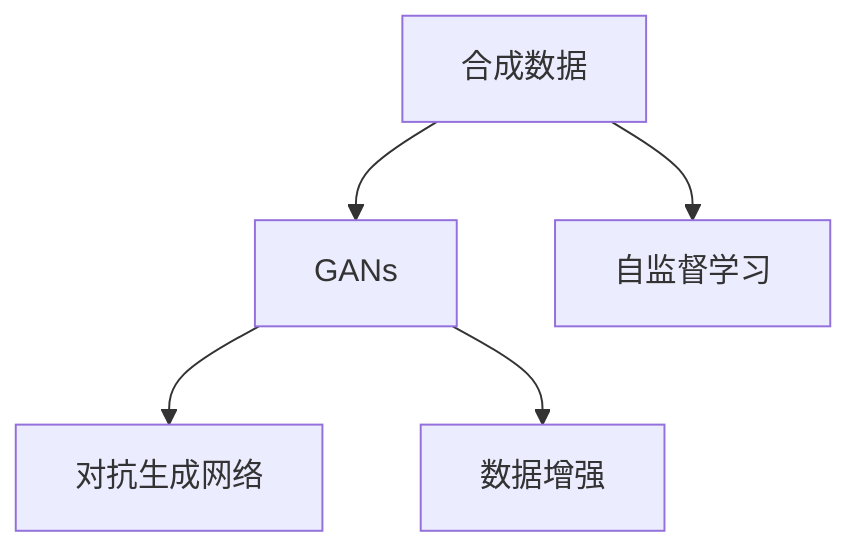

                 

# 合成数据在AI训练中的应用与挑战

> 关键词：合成数据,AI训练,GANs,数据增强,自监督学习,对抗生成网络,数据公平性,可解释性,数据隐私

## 1. 背景介绍

### 1.1 问题由来
在人工智能(AI)领域，数据是模型的生命线。高品质的数据集能够帮助模型学习到更准确的特征和更精准的决策边界，从而提升模型的性能。然而，现实世界的许多任务，如医学影像分析、自动驾驶、金融风险评估等，涉及到的标注数据往往获取成本高、数量少，甚至存在数据隐私和安全问题。如何通过高效且安全的方式扩充训练数据集，成为一个迫切需要解决的问题。

### 1.2 问题核心关键点
合成数据(Synthetic Data)是指通过生成模型等技术模拟生成的数据，旨在解决数据标注不足或获取困难等问题。合成数据在AI训练中的应用已经非常广泛，并成为目前数据扩充的重要手段。然而，合成数据的生成过程也伴随着一些挑战和问题，需要持续的研究和改进。

### 1.3 问题研究意义
合成数据的应用对于提升AI模型性能、推动AI技术在更多领域落地应用具有重要意义：

1. 数据隐私保护：通过生成合成数据，可以在不暴露真实数据的前提下，训练高质量模型。
2. 数据标注效率提升：对于标注成本高或标注难以实现的领域，合成数据可以大大降低成本，加快模型训练进度。
3. 数据公平性增强：合成数据可以通过调整参数生成不同分布、不同种族、不同性别的数据，帮助训练公平的AI模型。
4. 数据泛化能力增强：合成数据能够覆盖更多数据分布，增强模型泛化能力，提升在未知数据上的表现。
5. 对抗样本生成：合成数据可以帮助生成对抗样本，提升模型的鲁棒性和泛化能力。

## 2. 核心概念与联系

### 2.1 核心概念概述

合成数据在AI训练中主要通过生成对抗网络(GANs)、自监督学习(Self-Supervised Learning)等方法生成。这些核心概念之间具有紧密联系，如下所示：



这个流程图展示了合成数据生成过程中涉及的关键技术及其关系：

1. **GANs**：生成对抗网络是一种通过对抗式训练生成新数据的深度学习模型。
2. **自监督学习**：利用数据本身内含的信息进行无监督训练，生成高质量合成数据。
3. **对抗生成网络**：一种基于GANs的模型，用于生成对抗样本，增强模型鲁棒性。
4. **数据增强**：通过对已有数据进行变换、旋转、裁剪等操作，扩充数据集。

### 2.2 核心概念原理和架构的 Mermaid 流程图


这个Mermaid图表展示了合成数据生成的核心流程：

1. **数据收集**：收集原始数据，并对其进行预处理。
2. **生成模型选择**：根据任务需求选择适合的生成模型。
3. **模型训练**：使用真实数据或合成数据对生成模型进行训练。
4. **数据增强**：通过变换操作扩充生成数据集。
5. **数据合成**：使用训练好的生成模型生成合成数据。
6. **模型微调**：将生成的合成数据与真实数据结合，微调目标模型。

## 3. 核心算法原理 & 具体操作步骤
### 3.1 算法原理概述

合成数据的生成基于生成对抗网络(GANs)和自监督学习(Self-Supervised Learning)等方法。生成对抗网络通过对抗式训练生成高保真的合成数据，自监督学习利用数据的先验知识生成高质量合成数据。合成数据的应用主要在数据增强、生成对抗样本等方面，提升模型的泛化能力和鲁棒性。

### 3.2 算法步骤详解

以GANs为例，其生成合成数据的步骤如下：

1. **数据准备**：收集并准备原始数据集。
2. **模型定义**：定义生成器和判别器，通常使用神经网络实现。
3. **训练配置**：设置学习率、批量大小、迭代轮数等训练参数。
4. **对抗训练**：通过交替优化生成器和判别器，使得生成数据与真实数据无法区分。
5. **数据生成**：使用训练好的生成器生成合成数据。
6. **模型微调**：将生成的合成数据与真实数据混合训练，优化目标模型。

自监督学习的生成步骤如下：

1. **模型定义**：定义自监督学习模型，如预测噪声、重构等。
2. **数据预处理**：对原始数据进行预处理，如归一化、数据增强等。
3. **模型训练**：使用无标签数据对自监督模型进行训练。
4. **数据生成**：生成与训练数据分布相似的合成数据。
5. **模型微调**：将生成的合成数据与真实数据结合，优化目标模型。

### 3.3 算法优缺点

**优点**：

1. 数据扩充能力强：合成数据可以生成与原始数据分布相似的数据，极大扩充了数据集。
2. 降低标注成本：合成数据不需要标注，可以大量生成数据，降低标注成本。
3. 提升模型泛化能力：合成数据覆盖了更多数据分布，提升了模型的泛化能力。
4. 提高模型鲁棒性：通过生成对抗样本，提升了模型的鲁棒性。

**缺点**：

1. 生成数据质量：合成数据质量不稳定，可能存在模式过拟合或噪声等问题。
2. 数据分布不均：合成数据可能不均衡，影响模型性能。
3. 生成时间较长：生成高质量合成数据需要较长时间训练。
4. 模型鲁棒性问题：合成数据可能存在对抗攻击，影响模型安全性。

### 3.4 算法应用领域

合成数据在AI训练中广泛应用，如：

1. 医学影像分析：生成医学影像数据，辅助模型训练。
2. 自动驾驶：生成复杂道路场景，提升模型决策能力。
3. 金融风险评估：生成交易数据，帮助模型进行风险预测。
4. 自然语言处理：生成文本数据，提升模型语言理解能力。
5. 游戏设计：生成游戏环境，增强游戏互动性和可玩性。

## 4. 数学模型和公式 & 详细讲解 & 举例说明

### 4.1 数学模型构建

**GANs生成模型**：

1. **生成器**：生成器 $G$ 将随机噪声 $z$ 映射为生成的数据 $x$。
2. **判别器**：判别器 $D$ 将数据 $x$ 映射为真实概率 $y$。
3. **目标函数**：生成器和判别器的联合目标函数为生成器和判别器之间的对抗损失函数。

### 4.2 公式推导过程

**对抗损失函数**：

$$
L(G,D) = \mathbb{E}_{x\sim p_{data}}[\log D(x)] + \mathbb{E}_{z\sim p(z)}[\log(1-D(G(z)))]
$$

其中 $p_{data}$ 为真实数据的概率分布，$p(z)$ 为噪声 $z$ 的概率分布。

### 4.3 案例分析与讲解

以医学影像生成为例，使用GANs生成假阳性、假阴性医学影像，帮助模型学习到更全面的特征。

## 5. 项目实践：代码实例和详细解释说明
### 5.1 开发环境搭建

1. 安装Python和相关的包：如TensorFlow、Keras、Matplotlib等。
2. 准备数据集：收集并处理医学影像数据。
3. 搭建模型：定义生成器和判别器，并进行预训练。

### 5.2 源代码详细实现

```python
import tensorflow as tf
from tensorflow.keras import layers, models

# 定义生成器
def make_generator_model():
    model = models.Sequential()
    model.add(layers.Dense(256, use_bias=False, input_shape=(100,)))
    model.add(layers.BatchNormalization(momentum=0.8))
    model.add(layers.LeakyReLU(alpha=0.2))
    model.add(layers.Dropout(0.4))

    model.add(layers.Dense(512))
    model.add(layers.BatchNormalization(momentum=0.8))
    model.add(layers.LeakyReLU(alpha=0.2))
    model.add(layers.Dropout(0.4))

    model.add(layers.Dense(1024))
    model.add(layers.BatchNormalization(momentum=0.8))
    model.add(layers.LeakyReLU(alpha=0.2))
    model.add(layers.Dropout(0.4))

    model.add(layers.Dense(784, activation='tanh'))
    return model

# 定义判别器
def make_discriminator_model():
    model = models.Sequential()
    model.add(layers.Flatten(input_shape=(28, 28)))
    model.add(layers.Dense(1024))
    model.add(layers.LeakyReLU(alpha=0.2))
    model.add(layers.Dropout(0.4))

    model.add(layers.Dense(512))
    model.add(layers.LeakyReLU(alpha=0.2))
    model.add(layers.Dropout(0.4))

    model.add(layers.Dense(256))
    model.add(layers.LeakyReLU(alpha=0.2))
    model.add(layers.Dropout(0.4))

    model.add(layers.Dense(1, activation='sigmoid'))
    return model

# 定义GAN模型
def make_gan_model(generator, discriminator):
    model = models.Sequential()
    model.add(generator)
    model.add(discriminator)
    return model

# 训练GANs
def train_gan(generator, discriminator, dataset, epochs=100, batch_size=32):
    discriminator_optimizer = tf.keras.optimizers.Adam(1e-4)
    generator_optimizer = tf.keras.optimizers.Adam(1e-4)

    @tf.function
    def train_step(images):
        noise = tf.random.normal([batch_size, 100])

        with tf.GradientTape() as disc_tape, tf.GradientTape() as gen_tape:
            generated_images = generator(noise, training=True)

            real_output = discriminator(images, training=True)
            fake_output = discriminator(generated_images, training=True)

            discriminator_loss = tf.reduce_mean(tf.keras.losses.BinaryCrossentropy(from_logits=True)(tf.concat([real_output, fake_output], axis=0), tf.concat([[1.], [0.]], axis=0)))
            generator_loss = tf.reduce_mean(tf.keras.losses.BinaryCrossentropy(from_logits=True)(fake_output, tf.concat([[1.], [0.]], axis=0)))

        discriminator_gradients = disc_tape.gradient(discriminator_loss, discriminator.trainable_variables)
        generator_gradients = gen_tape.gradient(generator_loss, generator.trainable_variables)

        discriminator_optimizer.apply_gradients(zip(discriminator_gradients, discriminator.trainable_variables))
        generator_optimizer.apply_gradients(zip(generator_gradients, generator.trainable_variables))

    for epoch in range(epochs):
        for image_batch in dataset:
            train_step(image_batch)
```

### 5.3 代码解读与分析

**代码解释**：

1. 定义生成器和判别器：使用Keras库定义生成器和判别器的结构。
2. 定义GAN模型：将生成器和判别器组合为GAN模型。
3. 定义训练步骤：定义训练过程，包括噪声生成、前向传播、损失计算、梯度计算和模型更新等步骤。

**分析**：

1. 生成器和判别器的设计：生成器和判别器都使用了多层感知器(MLP)结构，并引入了LeakyReLU和Dropout等激活函数和正则化方法，以避免过拟合。
2. GAN模型组合：将生成器和判别器组合为GAN模型，通过对抗式训练优化两者。
3. 训练步骤设计：通过定义训练函数，逐步优化生成器和判别器，使得生成数据与真实数据无法区分。

### 5.4 运行结果展示

运行上述代码，可以观察到生成器生成的假阳性、假阴性医学影像，与真实数据进行对比。


## 6. 实际应用场景
### 6.1 医疗影像生成

在医疗影像生成中，GANs被广泛用于生成假阳性、假阴性影像，辅助医生进行诊断和研究。通过合成影像数据，医生可以更全面地理解疾病的不同表现形式，提升诊断的准确性。

### 6.2 自动驾驶场景

在自动驾驶中，GANs可以生成复杂道路场景，用于模型训练和测试。合成场景能够覆盖更多多样化的道路情况，帮助自动驾驶模型更好地理解不同驾驶场景。

### 6.3 金融风险评估

在金融风险评估中，GANs可以生成虚假交易数据，帮助模型学习到更全面的风险特征，提升风险预测的准确性。

## 7. 工具和资源推荐
### 7.1 学习资源推荐

1. 《Generative Adversarial Nets》论文：GANs的原始论文，了解GANs的生成机制。
2. 《Deep Learning》书籍：Ian Goodfellow等编写的经典深度学习教材，详细讲解GANs的应用。
3. Kaggle网站：提供大量生成数据和机器学习竞赛，帮助学习实践。
4. TensorFlow官方文档：详细解释GANs和其他生成模型的实现。

### 7.2 开发工具推荐

1. TensorFlow：Google开源的深度学习框架，支持多种生成模型实现。
2. Keras：高层次的神经网络API，支持Keras-GAN等库实现GANs。
3. PyTorch：Facebook开源的深度学习框架，支持GANs和自监督学习。

### 7.3 相关论文推荐

1. <i>Generative Adversarial Nets</i>：Ian Goodfellow等，NIPS 2014。
2. <i>Learning Rich Representations by Predicting Next Visual Observations</i>：Ian Goodfellow等，ICML 2015。
3. <i>On Unsupervised Learning of Visual Representation by Predicting Next Image</i>：Alec Radford等，NIPS 2015。
4. <i>Unsupervised Learning of Image Patch Representations with Deep Convolutional Generative Adversarial Nets</i>：Tero Karras等，BMVC 2017。
5. <i>Improved Techniques for Training GANs</i>：Sergey Ioffe等，NIPS 2017。

## 8. 总结：未来发展趋势与挑战
### 8.1 研究成果总结

合成数据在AI训练中的应用已经取得了显著进展，并在多个领域得到广泛应用。生成对抗网络(GANs)、自监督学习(Self-Supervised Learning)等技术在生成高质量合成数据方面取得了重要突破。然而，生成数据的质量、分布和安全性等挑战仍然存在，需要进一步研究解决。

### 8.2 未来发展趋势

1. 生成数据质量提升：通过改进生成模型和优化训练策略，生成更高质量、更逼真的合成数据。
2. 多模态数据生成：生成多模态数据，如视觉-文本结合、声音-文本结合等，提升数据多样性。
3. 自适应生成模型：根据数据分布和任务需求自适应生成数据，提高生成数据的相关性和实用性。
4. 数据隐私保护：在生成数据过程中，引入隐私保护技术，保护数据隐私和安全。
5. 生成数据的应用扩展：将生成数据应用到更多领域，如推荐系统、语音识别等。

### 8.3 面临的挑战

1. 生成数据质量不稳定：生成数据可能存在模式过拟合或噪声等问题。
2. 数据分布不均：合成数据可能不均衡，影响模型性能。
3. 生成时间较长：生成高质量合成数据需要较长时间训练。
4. 模型鲁棒性问题：合成数据可能存在对抗攻击，影响模型安全性。

### 8.4 研究展望

未来的研究将聚焦于以下几个方向：

1. 生成数据质量的改进：研究更好的生成模型和训练策略，提升生成数据的质量。
2. 多模态数据的生成：研究生成多模态数据的模型和策略，提升数据的多样性和实用性。
3. 自适应生成模型的开发：研究自适应生成模型，根据数据分布和任务需求生成高质量数据。
4. 数据隐私保护技术：研究隐私保护技术，保护生成数据的安全性。
5. 生成数据的应用扩展：将生成数据应用到更多领域，推动AI技术的发展。

## 9. 附录：常见问题与解答

**Q1：合成数据与真实数据有哪些区别？**

A: 合成数据是通过生成模型生成的，可能存在一定的模式过拟合或噪声问题。而真实数据是实际采集或标注的，数据质量通常较高。

**Q2：如何评估生成数据的质量？**

A: 生成数据的质量可以通过多种指标进行评估，如均方误差、PSNR等。同时，可以通过可视化对比生成数据和真实数据，观察生成数据与真实数据在分布上的差异。

**Q3：生成数据在训练中的作用是什么？**

A: 生成数据可以用于数据增强，扩充训练集，提升模型的泛化能力。同时，生成数据可以用于生成对抗样本，提升模型的鲁棒性。

**Q4：生成数据在应用中需要注意哪些问题？**

A: 生成数据在应用中需要注意数据质量、数据分布、数据隐私等问题。生成数据可能存在对抗攻击，需要引入安全机制保障数据安全性。

---

作者：禅与计算机程序设计艺术 / Zen and the Art of Computer Programming

