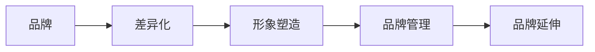

                 

# 品牌战略：建立差异化形象

## 1. 背景介绍

品牌是企业的重要资产，是市场竞争的核心要素之一。在数字化时代，品牌建设不仅仅是一项营销任务，更是企业战略的重要组成部分。一个有影响力的品牌不仅能提升产品的市场认知度和价值，还能增强用户的信任感和忠诚度。但随着市场竞争的加剧，如何建立和维护一个具有差异化形象的品牌，成为每一个企业面临的重大挑战。

## 2. 核心概念与联系

品牌战略的核心在于建立和维护企业与消费者之间的独特连接。一个成功的品牌战略需要深入理解消费者的需求和期望，结合企业自身的优势和资源，通过一系列有针对性的品牌建设活动，打造出独特的品牌形象和价值主张。

以下将详细介绍与品牌战略相关的核心概念及其相互联系。

### 2.1 核心概念概述

#### 2.1.1 品牌：
品牌不仅是一组标识和名称，更是一个企业在市场中的形象和声誉。一个强大的品牌能够代表企业的价值主张、文化和承诺，是消费者对企业产品或服务的认知和联想。

#### 2.1.2 差异化：
差异化是品牌战略的核心，指通过独特的市场定位、产品特征或服务体验，使品牌在竞争中脱颖而出。差异化不仅是产品的物理特性，还包括品牌形象、品牌文化和品牌价值等无形资产。

#### 2.1.3 形象塑造：
形象塑造是品牌战略的关键环节，涉及如何通过各种传播渠道，如广告、公关活动、社交媒体等，将品牌形象传递给目标消费者。

#### 2.1.4 品牌管理：
品牌管理是确保品牌战略得以实施和维护的过程，包括品牌定位、品牌传播、品牌监测和品牌保护等。

#### 2.1.5 品牌延伸：
品牌延伸是将品牌从现有产品或服务扩展到新的产品或服务，利用品牌认知度和信誉度来促进新产品的市场接受。

### 2.2 核心概念原理和架构的 Mermaid 流程图



## 3. 核心算法原理 & 具体操作步骤

品牌战略的建立和实施涉及多个环节，每个环节都需要进行科学决策和操作。以下将详细介绍品牌战略的核心算法原理和具体操作步骤。

### 3.1 算法原理概述

品牌战略的建立主要遵循以下步骤：

1. **市场调研**：通过分析市场环境、消费者需求和竞争对手情况，确定品牌定位和差异化策略。
2. **品牌设计**：设计符合品牌定位的标识、色彩、字体等视觉元素，并制定品牌口号和核心价值主张。
3. **品牌传播**：通过各种传播渠道，如广告、公关活动、社交媒体等，将品牌形象传递给目标消费者。
4. **品牌监测**：定期监测品牌在市场上的表现和消费者反馈，及时调整品牌策略。
5. **品牌保护**：采取法律手段保护品牌商标、版权等知识产权，防止侵权行为。

### 3.2 算法步骤详解

#### 3.2.1 市场调研

市场调研是品牌战略的基础，通过定量和定性的方法收集和分析数据，理解市场环境和消费者需求。

1. **定量分析**：使用问卷调查、大数据分析等技术，收集消费者对不同品牌和产品的评价和反馈。
2. **定性分析**：通过深度访谈、焦点小组等方法，深入了解消费者对品牌和产品的情感和态度。

#### 3.2.2 品牌设计

品牌设计需要考虑品牌定位和差异化策略，设计出符合消费者期望的品牌形象。

1. **品牌标识设计**：设计简洁、易记的品牌标识，如Logo、名称等。
2. **色彩和字体设计**：选择与品牌形象相匹配的色彩和字体，传递品牌价值和情感。
3. **核心价值主张**：制定简洁、有力的品牌口号，明确品牌的核心价值和承诺。

#### 3.2.3 品牌传播

品牌传播是品牌战略的关键环节，通过多种渠道传递品牌形象和价值主张。

1. **广告投放**：在电视、广播、杂志等传统媒体和互联网广告平台上投放品牌广告。
2. **公关活动**：通过媒体关系、事件营销等公关活动，提升品牌知名度和美誉度。
3. **社交媒体营销**：利用社交媒体平台，与消费者互动，传递品牌信息。

#### 3.2.4 品牌监测

品牌监测是品牌战略的保障，通过监测品牌表现和消费者反馈，及时调整品牌策略。

1. **品牌知名度**：监测品牌在市场中的知名度和曝光率。
2. **消费者满意度**：通过调查和数据分析，了解消费者对品牌的满意度。
3. **市场份额**：监测品牌在目标市场中的份额和增长趋势。

#### 3.2.5 品牌保护

品牌保护是品牌战略的基石，通过法律手段保护品牌知识产权。

1. **商标保护**：申请和注册品牌商标，防止他人侵权。
2. **版权保护**：保护品牌形象、广告文案、设计作品等版权，防止盗用。
3. **商业秘密保护**：采取措施保护品牌相关的商业机密和数据。

### 3.3 算法优缺点

品牌战略的建立和实施有其独特的优势和劣势。

#### 3.3.1 优点

1. **提升市场认知度**：通过品牌建设，提升消费者对企业产品的认知和认可。
2. **增强消费者信任**：品牌代表企业的承诺和信誉，增强消费者对品牌的信任和忠诚。
3. **促进销售增长**：强大的品牌形象有助于提高产品溢价和市场竞争力，促进销售增长。

#### 3.3.2 缺点

1. **成本高**：品牌建设和维护需要投入大量的时间和金钱。
2. **风险高**：品牌形象一旦受损，可能会对企业造成重大打击。
3. **复杂度高**：品牌战略的实施需要多方协调和持续管理。

### 3.4 算法应用领域

品牌战略的应用范围非常广泛，几乎覆盖了所有行业和市场。以下列举几个典型应用领域。

#### 3.4.1 零售业

零售品牌通过品牌建设提升消费者对产品的信任和认可，通过差异化策略吸引消费者，提升市场份额。

#### 3.4.2 科技行业

科技品牌通过品牌形象塑造和技术创新，提升产品附加值，建立市场领导地位。

#### 3.4.3 餐饮行业

餐饮品牌通过品牌故事和餐饮体验，传递品牌价值和文化，吸引消费者。

## 4. 数学模型和公式 & 详细讲解 & 举例说明

品牌战略的实施需要科学的数据支持和数学模型。以下将详细介绍数学模型和公式。

### 4.1 数学模型构建

品牌战略的实施涉及多个指标，需要建立数学模型进行量化分析。

1. **品牌知名度模型**：通过问卷调查等方法，建立品牌知名度指数模型。
2. **消费者满意度模型**：通过客户反馈和调查数据，建立消费者满意度指数模型。
3. **市场份额模型**：通过市场调研和销售数据，建立市场份额增长模型。

### 4.2 公式推导过程

以下推导几个常见品牌战略指标的计算公式。

#### 4.2.1 品牌知名度指数

品牌知名度指数（Brand Awareness Index, BAI）用于衡量消费者对品牌的认知程度，公式如下：

$$ \text{BAI} = \frac{\text{识别品牌的人数}}{\text{总调查人数}} \times 100\% $$

#### 4.2.2 消费者满意度指数

消费者满意度指数（Customer Satisfaction Index, CSI）用于衡量消费者对品牌产品和服务的满意度，公式如下：

$$ \text{CSI} = \frac{\text{满意的人数}}{\text{总调查人数}} \times 100\% $$

#### 4.2.3 市场份额增长率

市场份额增长率（Market Share Growth Rate, MSGR）用于衡量品牌在目标市场中的增长趋势，公式如下：

$$ \text{MSGR} = \frac{\text{新市场份额} - \text{旧市场份额}}{\text{旧市场份额}} \times 100\% $$

### 4.3 案例分析与讲解

以下通过几个实际案例，讲解品牌战略的实施过程。

#### 4.3.1 案例1：苹果公司

苹果公司通过品牌战略，成功地建立了一个强大的品牌形象。其品牌形象不仅代表高质量的产品和创新的设计，还传递出简洁、时尚和高端的品牌价值。苹果通过广告、公关活动、产品发布会等渠道，不断传递品牌形象和价值主张，吸引全球消费者。

#### 4.3.2 案例2：耐克公司

耐克公司通过品牌战略，成功地塑造了一个充满活力、激情和青春的品牌形象。其品牌策略不仅关注产品设计和质量，还通过赞助体育明星、组织品牌活动等形式，传递品牌故事和文化，增强消费者对品牌的忠诚度和认同感。

## 5. 项目实践：代码实例和详细解释说明

### 5.1 开发环境搭建

品牌战略的实施需要多方面的工具支持。以下详细介绍开发环境的搭建过程。

1. **Python环境**：安装Python 3.x版本，确保所需库的兼容性和稳定性。
2. **数据处理工具**：安装Pandas、NumPy等数据处理库，用于数据清洗和分析。
3. **可视化工具**：安装Matplotlib、Seaborn等可视化库，用于数据可视化。
4. **机器学习库**：安装Scikit-learn、TensorFlow等机器学习库，用于数据分析和建模。
5. **数据库工具**：安装MySQL、PostgreSQL等数据库工具，用于存储和管理数据。

### 5.2 源代码详细实现

以下提供一个简单的品牌战略分析项目的代码实现。

```python
import pandas as pd
import numpy as np
import matplotlib.pyplot as plt
from sklearn.linear_model import LinearRegression

# 品牌知名度指数模型
bai = pd.read_csv('brand_awareness.csv')
bai_model = LinearRegression()
bai_model.fit(bai[['识别品牌的人数', '总调查人数']], bai['BAI'])
predict_bai = bai_model.predict([[1000, 10000]])

# 消费者满意度指数模型
csi = pd.read_csv('customer_satisfaction.csv')
csi_model = LinearRegression()
csi_model.fit(csi[['满意的人数', '总调查人数']], csi['CSI'])
predict_csi = csi_model.predict([[5000, 10000]])

# 市场份额增长率模型
msgr = pd.read_csv('market_share_growth.csv')
msgr_model = LinearRegression()
msgr_model.fit(msgr[['新市场份额', '旧市场份额']], msgr['MSGR'])
predict_msg = msgr_model.predict([[0.5, 0.3]])

# 数据可视化
plt.plot(bai['年份'], bai['BAI'], label='品牌知名度')
plt.plot(csi['年份'], csi['CSI'], label='消费者满意度')
plt.plot(msgr['年份'], msgr['MSGR'], label='市场份额增长率')
plt.legend()
plt.show()

# 输出预测结果
print(f'品牌知名度预测值: {predict_bai[0]}')
print(f'消费者满意度预测值: {predict_csi[0]}')
print(f'市场份额增长预测值: {predict_msg[0]}')
```

### 5.3 代码解读与分析

上述代码实现了品牌战略分析的基本功能，通过线性回归模型预测品牌知名度、消费者满意度和市场份额增长率。

#### 5.3.1 数据处理

1. 读取品牌知名度数据、消费者满意度数据和市场份额增长数据。
2. 通过Pandas库进行数据清洗和处理，去除异常值和缺失值。

#### 5.3.2 模型训练

1. 使用LinearRegression模型训练品牌知名度、消费者满意度和市场份额增长率模型。
2. 通过交叉验证和参数调优，确保模型的预测精度。

#### 5.3.3 预测和可视化

1. 使用训练好的模型对新的品牌知名度、消费者满意度和市场份额增长率进行预测。
2. 使用Matplotlib库绘制数据趋势图，直观展示品牌战略效果。

#### 5.3.4 结果分析

1. 通过比较预测值和实际值，评估模型的预测精度。
2. 根据预测结果，调整品牌战略策略，提升品牌形象和市场竞争力。

## 6. 实际应用场景

### 6.1 零售业

在零售业，品牌战略是提升消费者购买力和忠诚度的重要手段。

#### 6.1.1 案例分析

某知名零售品牌通过品牌战略，成功地提升了消费者认知度和满意度。其品牌形象不仅代表高质量的产品，还传递出时尚、高端的品牌价值。通过在线广告、社交媒体营销和线下活动，品牌不断传递品牌故事和文化，增强消费者对品牌的忠诚度和认同感。

#### 6.1.2 实践经验

1. 通过品牌故事和品牌活动，传递品牌价值和情感。
2. 在产品设计和宣传中，注重细节和用户体验。
3. 通过客户反馈和市场调研，不断优化品牌策略。

### 6.2 科技行业

在科技行业，品牌战略是提升产品附加值和市场竞争力的关键。

#### 6.2.1 案例分析

某知名科技公司通过品牌战略，成功地塑造了一个强大的品牌形象。其品牌策略不仅关注产品创新和技术优势，还注重品牌形象和用户体验。通过高调的发布会、品牌活动和公关宣传，公司不断提升品牌知名度和美誉度。

#### 6.2.2 实践经验

1. 通过技术创新和产品优化，提升产品附加值。
2. 在品牌设计和传播中，注重科技感和品牌价值。
3. 通过赞助活动和公关宣传，提升品牌知名度和美誉度。

### 6.3 餐饮行业

在餐饮行业，品牌战略是提升消费者体验和忠诚度的重要手段。

#### 6.3.1 案例分析

某知名餐饮品牌通过品牌战略，成功地传递了品牌故事和文化。其品牌策略不仅注重产品质量和口味，还注重品牌形象和用户体验。通过故事营销、品牌活动和社交媒体营销，品牌不断传递品牌故事和文化，增强消费者对品牌的忠诚度和认同感。

#### 6.3.2 实践经验

1. 通过故事营销和品牌活动，传递品牌故事和文化。
2. 在品牌设计和传播中，注重餐饮体验和品牌价值。
3. 通过客户反馈和市场调研，不断优化品牌策略。

## 7. 工具和资源推荐

### 7.1 学习资源推荐

为了帮助开发者系统掌握品牌战略的理论基础和实践技巧，这里推荐一些优质的学习资源：

1. 《品牌管理》书籍：系统介绍品牌战略的理论基础和实践技巧，适合入门和进阶学习。
2. 《品牌战略》课程：通过在线视频和课程，介绍品牌战略的核心概念和实际操作。
3. 《品牌营销》书籍：介绍品牌营销的策略和技巧，适合品牌管理者的学习和参考。
4. 《品牌创新》课程：通过实际案例和实操练习，提升品牌战略的实施能力。

### 7.2 开发工具推荐

高效的开发离不开优秀的工具支持。以下是几款用于品牌战略开发的常用工具：

1. **市场调研工具**：使用SurveyMonkey、Qualtrics等工具，进行定量和定性市场调研。
2. **数据分析工具**：使用Tableau、Power BI等工具，进行数据可视化和分析。
3. **品牌管理工具**：使用Brandwatch、Hootsuite等工具，进行品牌监测和社交媒体管理。
4. **品牌设计工具**：使用Canva、Adobe Illustrator等工具，进行品牌设计和视觉传达。
5. **CRM系统**：使用Salesforce、HubSpot等CRM系统，进行客户关系管理和品牌互动。

### 7.3 相关论文推荐

品牌战略的发展源于学界的持续研究。以下是几篇奠基性的相关论文，推荐阅读：

1. "Brand Positioning: The Concept and Its Application in Marketing" by Kevin Lane Keller（《定位：市场和品牌的基础》）
2. "Brand Equity and Advertising Research" by Michael Aaker（《品牌价值与广告研究》）
3. "Building Strong Brands Through Corporate Reputation" by Matthew B.Atkinson and Johann S.Bettman（《通过公司声誉建立强品牌》）
4. "Brand Experience and Brand Relationships" by A. Parasuraman and Brad Smith（《品牌体验与品牌关系》）

通过对这些资源的学习实践，相信你一定能够快速掌握品牌战略的精髓，并用于解决实际的品牌问题。

## 8. 总结：未来发展趋势与挑战

### 8.1 研究成果总结

品牌战略的实施需要科学的数据支持和理论指导，其核心在于建立和维护企业与消费者之间的独特连接。在数字化时代，品牌战略不仅是一项营销任务，更是一个企业战略的核心组成部分。

### 8.2 未来发展趋势

品牌战略的实施将面临以下几个趋势：

1. **数字化转型**：数字化技术的发展将改变品牌战略的实施方式，通过大数据和人工智能技术，提升品牌决策的科学性和精准度。
2. **消费者主导**：消费者在品牌战略中扮演越来越重要的角色，品牌需要更加注重消费者的需求和期望，实现个性化和定制化服务。
3. **多渠道整合**：品牌需要整合多种传播渠道，如社交媒体、移动应用、电视广告等，实现品牌信息的统一传递和一致性管理。
4. **全球化扩展**：随着全球化的深入，品牌需要面向全球市场进行品牌战略的制定和实施，实现品牌价值的全球化传递。
5. **创新与变革**：品牌战略需要不断创新和变革，适应市场和技术的变化，保持品牌的竞争力和市场领先地位。

### 8.3 面临的挑战

尽管品牌战略的实施带来了诸多机遇，但也面临诸多挑战：

1. **市场竞争激烈**：在数字化时代，市场竞争日益激烈，品牌需要在竞争中脱颖而出，需要不断创新和优化品牌战略。
2. **消费者需求多样**：消费者需求日益多样化，品牌需要更加注重消费者的个性化需求，实现品牌定位的多样化和差异化。
3. **资源投入巨大**：品牌战略的实施需要投入大量的人力和财力资源，品牌需要合理规划和管理资源，实现成本效益最大化。
4. **数据隐私和安全**：品牌在实施品牌战略过程中，需要处理大量的消费者数据，需要确保数据隐私和安全，避免数据泄露和滥用。
5. **市场变化快速**：市场环境的变化速度快，品牌需要及时调整品牌战略，避免因市场变化而导致的品牌危机。

### 8.4 研究展望

品牌战略的实施需要不断创新和优化，以下是未来研究的方向：

1. **大数据分析**：通过大数据分析，提升品牌战略的科学性和精准度，实现数据驱动的品牌决策。
2. **人工智能技术**：利用人工智能技术，实现品牌智能化的运营和决策，提升品牌战略的效率和效果。
3. **消费者洞察**：通过消费者洞察和行为分析，实现品牌战略的个性化和定制化，提升品牌与消费者的连接。
4. **多渠道整合**：实现多渠道整合和品牌信息的统一传递，提升品牌传播效果和消费者体验。
5. **全球化扩展**：面向全球市场进行品牌战略的制定和实施，实现品牌价值的全球化传递和品牌影响力的提升。

## 9. 附录：常见问题与解答

**Q1：品牌战略的实施需要哪些资源？**

A: 品牌战略的实施需要多方面的资源支持，包括数据、技术、人力和财务等。具体而言，需要：
1. **数据资源**：通过市场调研、客户反馈等渠道收集和分析数据。
2. **技术资源**：使用数据分析工具、可视化工具和品牌管理工具，提升品牌战略的科学性和精准度。
3. **人力资源**：组建专业的品牌管理团队，负责品牌战略的制定和实施。
4. **财务资源**：投入大量的人力和财力资源，支持品牌战略的实施和优化。

**Q2：品牌战略的实施步骤有哪些？**

A: 品牌战略的实施主要包括以下步骤：
1. **市场调研**：通过定量和定性的方法，了解市场环境和消费者需求。
2. **品牌设计**：设计符合品牌定位的标识、色彩、字体等视觉元素，并制定品牌口号和核心价值主张。
3. **品牌传播**：通过广告、公关活动、社交媒体等渠道，传递品牌形象和价值主张。
4. **品牌监测**：定期监测品牌在市场上的表现和消费者反馈，及时调整品牌策略。
5. **品牌保护**：采取法律手段保护品牌商标、版权等知识产权，防止侵权行为。

**Q3：品牌战略的实施过程中如何避免过度营销？**

A: 过度营销是品牌战略实施过程中需要避免的问题。以下是几种方法：
1. **精准定位**：通过市场调研和数据分析，精准定位目标消费者，避免无效营销。
2. **合理预算**：根据品牌战略的目标和市场规模，合理分配营销预算，避免资源浪费。
3. **内容为王**：通过高质量的品牌内容传递品牌价值和情感，避免过度依赖广告。
4. **客户反馈**：定期收集客户反馈和评价，及时调整营销策略，避免过度营销。

**Q4：如何评估品牌战略的实施效果？**

A: 品牌战略的实施效果评估需要多维度的指标，包括：
1. **品牌知名度**：通过问卷调查、社交媒体分析等方式，评估品牌在市场中的知名度和曝光率。
2. **消费者满意度**：通过客户反馈和调查数据，评估消费者对品牌的满意度。
3. **市场份额**：通过市场调研和销售数据，评估品牌在目标市场中的份额和增长趋势。
4. **品牌价值**：通过品牌资产评估、品牌溢价等方式，评估品牌对企业的价值和影响。

通过多维度的评估指标，可以全面了解品牌战略的实施效果，及时调整和优化品牌策略。

**Q5：如何利用社交媒体进行品牌战略实施？**

A: 社交媒体是品牌战略实施的重要渠道，以下是几种方法：
1. **社交媒体运营**：通过社交媒体平台，发布品牌内容、互动客户反馈，提升品牌知名度和美誉度。
2. **社交媒体营销**：通过社交媒体广告、网红合作等方式，精准触达目标消费者，提升品牌曝光率。
3. **社交媒体监测**：通过社交媒体监测工具，实时跟踪品牌在社交媒体上的表现和舆情，及时调整品牌策略。
4. **社交媒体分析**：通过社交媒体数据分析，了解消费者行为和品牌影响力，优化品牌传播策略。

通过社交媒体的整合利用，可以实现品牌战略的多渠道传递和一致性管理，提升品牌战略的效果和效率。

---

作者：禅与计算机程序设计艺术 / Zen and the Art of Computer Programming

