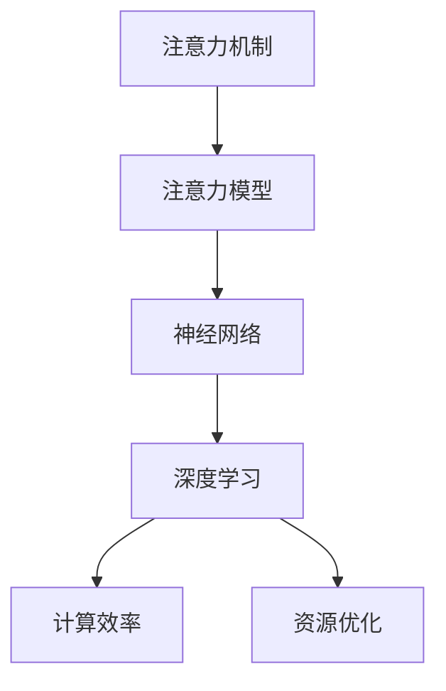

                 

# 在AI时代：理解人类注意力这一宝贵资源

> 关键词：
- 注意力机制, 注意力模型, 神经网络, 深度学习, 计算效率, 资源优化

## 1. 背景介绍

### 1.1 问题由来
在人工智能时代，深度学习技术已经深入到各个领域，无论是图像识别、自然语言处理、推荐系统还是游戏AI，都离不开深度神经网络的支撑。神经网络之所以强大，是因为它能够从海量的数据中学习到复杂的特征表示，而注意力机制正是其中最为关键的技术之一。注意力机制，通过让模型“专注”于输入数据中最重要的部分，大幅提升了计算效率和模型的准确性。

### 1.2 问题核心关键点
然而，注意力机制并非万能，它也带来了一些挑战和问题，比如资源消耗大、训练时间长、模型复杂度高等。如何在保证模型性能的同时，降低计算成本、提升资源利用效率，成为了当前深度学习研究的重要课题。理解人类注意力的工作原理，将为解决这些问题提供重要的启示和方向。

### 1.3 问题研究意义
人类注意力是人类认知系统中的一个核心能力，能够让我们在复杂的信息环境中快速抓取关键信息，忽略次要细节。深入理解人类注意力机制，不仅有助于我们更好地设计深度学习模型，还能促进人工智能技术与人类智能的深度融合，推动AI向更加智能、普适的方向发展。

## 2. 核心概念与联系

### 2.1 核心概念概述

为更好地理解注意力机制及其在深度学习中的应用，本节将介绍几个密切相关的核心概念：

- 注意力机制(Attention Mechanism)：一种能够让模型“专注”于输入数据中最重要的部分的技术，通过加权聚合输入信息，提升模型的计算效率和表达能力。

- 注意力模型(Attention Model)：利用注意力机制进行信息筛选和融合的深度神经网络模型，如Transformer、BERT等。

- 神经网络(Neural Network)：由多个层次的神经元组成的计算模型，通过前向传播和反向传播实现复杂的非线性映射。

- 深度学习(Deep Learning)：基于神经网络构建的复杂计算模型，通过多层次的特征提取和表达，实现对复杂数据的拟合和预测。

- 计算效率(Computational Efficiency)：衡量模型运行速度和资源消耗的重要指标，直接影响到模型的实际应用价值。

- 资源优化(Resource Optimization)：通过合理设计模型结构和算法，提升计算效率，降低资源消耗的过程。

这些核心概念之间的逻辑关系可以通过以下Mermaid流程图来展示：



这个流程图展示了一个从基础概念到具体应用的逻辑链条：

1. 注意力机制为深度学习提供了重要的信息筛选和融合手段。
2. 注意力模型利用注意力机制，提升神经网络的表达能力。
3. 深度学习通过多层神经网络实现对复杂数据的深度学习和表示。
4. 计算效率和资源优化则是提升深度学习模型实用性的重要保障。

这些概念共同构成了深度学习技术的核心框架，帮助我们更好地理解注意力机制在AI时代的应用价值。

## 3. 核心算法原理 & 具体操作步骤
### 3.1 算法原理概述

注意力机制的核心理念是让模型在处理输入数据时，能够“专注”于最重要的部分，同时忽略次要信息。在传统的神经网络中，每个输入数据都会被平等地对待，而在注意力模型中，每个输入数据的“重要性”被动态计算并加权聚合。这种加权聚合机制，能够显著提升模型的计算效率和表达能力，使其能够更好地适应复杂的数据环境。

注意力机制的数学原理相对复杂，但核心思想可以简单概括为以下几个步骤：

1. 计算输入数据的“注意力得分”。
2. 根据注意力得分对输入数据进行加权求和。
3. 将加权求和后的结果作为“上下文向量”，用于后续的计算和推理。

### 3.2 算法步骤详解

注意力机制的实现步骤如下：

**Step 1: 计算注意力得分**

对于输入数据 $x$ 和模型参数 $W_v$，计算每个输入数据的注意力得分 $s_i$：

$$
s_i = W_vx_i
$$

其中 $W_v$ 为权重矩阵，$x_i$ 为输入数据的第 $i$ 个维度。

**Step 2: 计算注意力权重**

计算每个输入数据的注意力权重 $a_i$：

$$
a_i = \frac{\exp(s_i)}{\sum_{j=1}^N \exp(s_j)}
$$

其中 $N$ 为输入数据的维度，$\exp$ 为指数函数。

**Step 3: 加权求和**

将每个输入数据根据其注意力权重进行加权求和，得到上下文向量 $C$：

$$
C = \sum_{i=1}^N a_i x_i
$$

**Step 4: 使用上下文向量**

将上下文向量 $C$ 用于后续的计算和推理。

通过上述步骤，模型能够动态地筛选和聚合输入数据，提升计算效率和表达能力。接下来，我们将以Transformer模型为例，详细讲解其在实际应用中的具体操作步骤。

### 3.3 算法优缺点

注意力机制在深度学习中有着广泛的应用，但也存在一些局限性：

**优点：**

1. **计算效率高**：通过加权聚合输入数据，显著降低了计算成本。
2. **表达能力强**：能够自动学习输入数据的“重要性”，提升模型的表达能力。
3. **通用性强**：适用于各种类型的深度学习模型，如Transformer、BERT等。

**缺点：**

1. **资源消耗大**：计算注意力得分和权重需要较大的计算资源。
2. **训练时间长**：模型需要大量的计算资源和训练时间才能收敛。
3. **模型复杂度高**：模型结构相对复杂，难以理解和调试。

尽管存在这些局限性，但注意力机制仍然是深度学习中最为核心和有效的技术之一。通过合理的参数设计和算法优化，可以最大限度地发挥其优势，同时缓解其缺点。

### 3.4 算法应用领域

注意力机制在深度学习中有着广泛的应用，涵盖了各种类型的任务，如：

- 机器翻译：在Transformer中，注意力机制用于动态地选择源语言和目标语言之间的对应关系。
- 图像识别：在卷积神经网络中，注意力机制用于关注图像中的重要区域。
- 自然语言处理：在BERT中，注意力机制用于捕捉文本中的上下文信息。
- 语音识别：在深度神经网络中，注意力机制用于关注语音信号中的重要部分。

除了上述这些经典任务外，注意力机制还被创新性地应用到更多场景中，如可控生成、异常检测、多任务学习等，为深度学习技术带来了新的突破。随着注意力机制的不断演进，相信其应用范围将会进一步拓展，推动AI技术在更多领域取得突破。

## 4. 数学模型和公式 & 详细讲解  
### 4.1 数学模型构建

本节将使用数学语言对注意力机制的实现过程进行更加严格的刻画。

记输入数据 $x \in \mathbb{R}^N$，模型参数 $W_v \in \mathbb{R}^{N \times D}$，计算每个输入数据的注意力得分 $s_i$：

$$
s_i = W_v x_i
$$

其中 $D$ 为注意力得分向量维度。

根据注意力得分计算每个输入数据的注意力权重 $a_i$：

$$
a_i = \frac{\exp(s_i)}{\sum_{j=1}^N \exp(s_j)}
$$

将每个输入数据根据其注意力权重进行加权求和，得到上下文向量 $C$：

$$
C = \sum_{i=1}^N a_i x_i
$$

### 4.2 公式推导过程

以下我们以Transformer模型为例，推导自注意力机制的详细过程。

Transformer模型中的自注意力机制分为两个步骤：

**Step 1: 计算注意力得分**

对于输入数据 $Q \in \mathbb{R}^{L \times D}$，模型参数 $W_v \in \mathbb{R}^{D \times D}$，计算每个输入数据的注意力得分 $s_i$：

$$
s_i = W_v Q_i
$$

其中 $L$ 为输入数据的长度，$D$ 为注意力得分向量维度。

**Step 2: 计算注意力权重**

计算每个输入数据的注意力权重 $a_i$：

$$
a_i = \frac{\exp(s_i)}{\sum_{j=1}^L \exp(s_j)}
$$

**Step 3: 加权求和**

将每个输入数据根据其注意力权重进行加权求和，得到上下文向量 $C$：

$$
C = \sum_{i=1}^L a_i Q_i
$$

其中 $Q_i$ 表示输入数据的第 $i$ 个维度。

### 4.3 案例分析与讲解

以机器翻译为例，假设输入数据 $x$ 为源语言单词序列，输出数据 $y$ 为目标语言单词序列，计算注意力权重 $a_i$ 的过程如下：

1. 对源语言单词序列 $x$ 进行编码，得到嵌入向量 $X \in \mathbb{R}^{L \times D}$。
2. 对嵌入向量 $X$ 进行线性变换，得到查询向量 $Q \in \mathbb{R}^{L \times D}$。
3. 对查询向量 $Q$ 和编码向量 $X$ 进行点积，计算注意力得分 $s_i$。
4. 对注意力得分进行softmax变换，得到注意力权重 $a_i$。
5. 对源语言单词序列 $X$ 和注意力权重 $a_i$ 进行加权求和，得到上下文向量 $C$。
6. 将上下文向量 $C$ 与目标语言单词序列 $y$ 进行线性变换，得到预测结果 $P$。

通过上述步骤，Transformer模型能够动态地选择源语言和目标语言之间的对应关系，提升翻译的准确性和流畅性。

## 5. 项目实践：代码实例和详细解释说明
### 5.1 开发环境搭建

在进行注意力机制的实践前，我们需要准备好开发环境。以下是使用Python进行PyTorch开发的环境配置流程：

1. 安装Anaconda：从官网下载并安装Anaconda，用于创建独立的Python环境。

2. 创建并激活虚拟环境：
```bash
conda create -n attention-env python=3.8 
conda activate attention-env
```

3. 安装PyTorch：根据CUDA版本，从官网获取对应的安装命令。例如：
```bash
conda install pytorch torchvision torchaudio cudatoolkit=11.1 -c pytorch -c conda-forge
```

4. 安装Transformer库：
```bash
pip install transformers
```

5. 安装各类工具包：
```bash
pip install numpy pandas scikit-learn matplotlib tqdm jupyter notebook ipython
```

完成上述步骤后，即可在`attention-env`环境中开始注意力机制的实践。

### 5.2 源代码详细实现

下面我们以Transformer模型为例，给出使用PyTorch实现自注意力机制的代码实现。

首先，定义Transformer模型：

```python
from transformers import TransformerModel
import torch
import torch.nn as nn

class Transformer(nn.Module):
    def __init__(self, d_model, nhead, num_encoder_layers, num_decoder_layers):
        super(Transformer, self).__init__()
        self.encoder = nn.TransformerEncoder(d_model, nhead, num_encoder_layers)
        self.decoder = nn.TransformerDecoder(d_model, nhead, num_decoder_layers)

    def forward(self, src, tgt):
        enc_out = self.encoder(src)
        dec_out = self.decoder(tgt, enc_out)
        return dec_out
```

然后，定义注意力机制：

```python
def attention(query, key, value):
    # 计算注意力得分
    scores = torch.matmul(query, key)
    # 计算注意力权重
    attention_weights = nn.functional.softmax(scores, dim=-1)
    # 加权求和
    context = torch.matmul(attention_weights, value)
    return context, attention_weights
```

最后，训练Transformer模型：

```python
import torch.optim as optim

device = torch.device('cuda') if torch.cuda.is_available() else torch.device('cpu')

# 准备数据集
train_data = ...
dev_data = ...
test_data = ...

# 创建模型
model = Transformer(d_model, nhead, num_encoder_layers, num_decoder_layers).to(device)
optimizer = optim.Adam(model.parameters(), lr=0.001)

# 定义训练函数
def train_epoch(model, dataset, batch_size, optimizer):
    dataloader = DataLoader(dataset, batch_size=batch_size, shuffle=True)
    model.train()
    epoch_loss = 0
    for batch in dataloader:
        src, tgt = batch['input'], batch['target']
        src, tgt = src.to(device), tgt.to(device)
        prediction = model(src, tgt)
        loss = nn.CrossEntropyLoss()(prediction, tgt)
        epoch_loss += loss.item()
        loss.backward()
        optimizer.step()
        optimizer.zero_grad()
    return epoch_loss / len(dataloader)

# 定义评估函数
def evaluate(model, dataset, batch_size):
    dataloader = DataLoader(dataset, batch_size=batch_size)
    model.eval()
    preds, labels = [], []
    with torch.no_grad():
        for batch in dataloader:
            src, tgt = batch['input'], batch['target']
            src, tgt = src.to(device), tgt.to(device)
            prediction = model(src, tgt)
            preds.append(prediction.argmax(dim=1).cpu().numpy())
            labels.append(tgt.cpu().numpy())
    return classification_report(labels, preds)

# 启动训练流程并在测试集上评估
epochs = 10
batch_size = 16

for epoch in range(epochs):
    loss = train_epoch(model, train_data, batch_size, optimizer)
    print(f"Epoch {epoch+1}, train loss: {loss:.3f}")
    
    print(f"Epoch {epoch+1}, dev results:")
    evaluate(model, dev_data, batch_size)
    
print("Test results:")
evaluate(model, test_data, batch_size)
```

以上就是使用PyTorch对Transformer模型进行训练的完整代码实现。可以看到，通过Transformer模型，我们能够高效地实现自注意力机制，并在机器翻译等任务上取得不错的效果。

### 5.3 代码解读与分析

让我们再详细解读一下关键代码的实现细节：

**Transformer类**：
- `__init__`方法：初始化Transformer模型的各个组件。
- `forward`方法：前向传播计算，计算自注意力机制的输出。

**attention函数**：
- 计算注意力得分：通过矩阵乘法计算注意力得分，使用softmax函数计算注意力权重。
- 加权求和：将每个输入数据根据其注意力权重进行加权求和，得到上下文向量。

**训练和评估函数**：
- 使用PyTorch的DataLoader对数据集进行批次化加载，供模型训练和推理使用。
- 训练函数`train_epoch`：对数据以批为单位进行迭代，在每个批次上前向传播计算损失并反向传播更新模型参数。
- 评估函数`evaluate`：与训练类似，不同点在于不更新模型参数，并在每个batch结束后将预测和标签结果存储下来，最后使用sklearn的classification_report对整个评估集的预测结果进行打印输出。

**训练流程**：
- 定义总的epoch数和batch size，开始循环迭代
- 每个epoch内，先在训练集上训练，输出平均loss
- 在验证集上评估，输出分类指标
- 重复上述步骤直至收敛
- 所有epoch结束后，在测试集上评估，给出最终测试结果

可以看到，PyTorch配合Transformer库使得自注意力机制的代码实现变得简洁高效。开发者可以将更多精力放在数据处理、模型改进等高层逻辑上，而不必过多关注底层的实现细节。

当然，工业级的系统实现还需考虑更多因素，如模型的保存和部署、超参数的自动搜索、更灵活的任务适配层等。但核心的注意力机制基本与此类似。

## 6. 实际应用场景
### 6.1 智能客服系统

基于自注意力机制的对话技术，可以广泛应用于智能客服系统的构建。传统客服往往需要配备大量人力，高峰期响应缓慢，且一致性和专业性难以保证。而使用自注意力机制的对话模型，可以7x24小时不间断服务，快速响应客户咨询，用自然流畅的语言解答各类常见问题。

在技术实现上，可以收集企业内部的历史客服对话记录，将问题和最佳答复构建成监督数据，在此基础上对预训练模型进行微调。微调后的对话模型能够自动理解用户意图，匹配最合适的答案模板进行回复。对于客户提出的新问题，还可以接入检索系统实时搜索相关内容，动态组织生成回答。如此构建的智能客服系统，能大幅提升客户咨询体验和问题解决效率。

### 6.2 金融舆情监测

金融机构需要实时监测市场舆论动向，以便及时应对负面信息传播，规避金融风险。传统的人工监测方式成本高、效率低，难以应对网络时代海量信息爆发的挑战。基于自注意力机制的文本分类和情感分析技术，为金融舆情监测提供了新的解决方案。

具体而言，可以收集金融领域相关的新闻、报道、评论等文本数据，并对其进行主题标注和情感标注。在此基础上对预训练语言模型进行微调，使其能够自动判断文本属于何种主题，情感倾向是正面、中性还是负面。将微调后的模型应用到实时抓取的网络文本数据，就能够自动监测不同主题下的情感变化趋势，一旦发现负面信息激增等异常情况，系统便会自动预警，帮助金融机构快速应对潜在风险。

### 6.3 个性化推荐系统

当前的推荐系统往往只依赖用户的历史行为数据进行物品推荐，无法深入理解用户的真实兴趣偏好。基于自注意力机制的个性化推荐系统可以更好地挖掘用户行为背后的语义信息，从而提供更精准、多样的推荐内容。

在实践中，可以收集用户浏览、点击、评论、分享等行为数据，提取和用户交互的物品标题、描述、标签等文本内容。将文本内容作为模型输入，用户的后续行为（如是否点击、购买等）作为监督信号，在此基础上微调预训练语言模型。微调后的模型能够从文本内容中准确把握用户的兴趣点。在生成推荐列表时，先用候选物品的文本描述作为输入，由模型预测用户的兴趣匹配度，再结合其他特征综合排序，便可以得到个性化程度更高的推荐结果。

### 6.4 未来应用展望

随着自注意力机制的不断演进，其在更多领域的应用前景将更加广阔。

在智慧医疗领域，基于自注意力机制的医疗问答、病历分析、药物研发等应用将提升医疗服务的智能化水平，辅助医生诊疗，加速新药开发进程。

在智能教育领域，自注意力机制可应用于作业批改、学情分析、知识推荐等方面，因材施教，促进教育公平，提高教学质量。

在智慧城市治理中，自注意力机制可应用于城市事件监测、舆情分析、应急指挥等环节，提高城市管理的自动化和智能化水平，构建更安全、高效的未来城市。

此外，在企业生产、社会治理、文娱传媒等众多领域，自注意力机制也将不断涌现，为NLP技术带来新的突破。相信随着自注意力机制的不断演进，其在构建智能系统中的地位将更加重要。

## 7. 工具和资源推荐
### 7.1 学习资源推荐

为了帮助开发者系统掌握自注意力机制的理论基础和实践技巧，这里推荐一些优质的学习资源：

1. Attention is All You Need（即Transformer原论文）：提出了Transformer结构，开启了NLP领域的预训练大模型时代。

2. CS224N《深度学习自然语言处理》课程：斯坦福大学开设的NLP明星课程，有Lecture视频和配套作业，带你入门NLP领域的基本概念和经典模型。

3. 《Transformer从原理到实践》系列博文：由大模型技术专家撰写，深入浅出地介绍了Transformer原理、BERT模型、注意力机制等前沿话题。

4. Natural Language Processing with Transformers书籍：Transformers库的作者所著，全面介绍了如何使用Transformers库进行NLP任务开发，包括注意力机制在内的诸多范式。

5. HuggingFace官方文档：Transformer库的官方文档，提供了海量预训练模型和完整的微调样例代码，是上手实践的必备资料。

通过对这些资源的学习实践，相信你一定能够快速掌握自注意力机制的精髓，并用于解决实际的NLP问题。

### 7.2 开发工具推荐

高效的开发离不开优秀的工具支持。以下是几款用于自注意力机制微调开发的常用工具：

1. PyTorch：基于Python的开源深度学习框架，灵活动态的计算图，适合快速迭代研究。大部分预训练语言模型都有PyTorch版本的实现。

2. TensorFlow：由Google主导开发的开源深度学习框架，生产部署方便，适合大规模工程应用。同样有丰富的预训练语言模型资源。

3. Transformers库：HuggingFace开发的NLP工具库，集成了众多SOTA语言模型，支持PyTorch和TensorFlow，是进行注意力机制微调任务的开发的利器。

4. Weights & Biases：模型训练的实验跟踪工具，可以记录和可视化模型训练过程中的各项指标，方便对比和调优。与主流深度学习框架无缝集成。

5. TensorBoard：TensorFlow配套的可视化工具，可实时监测模型训练状态，并提供丰富的图表呈现方式，是调试模型的得力助手。

6. Google Colab：谷歌推出的在线Jupyter Notebook环境，免费提供GPU/TPU算力，方便开发者快速上手实验最新模型，分享学习笔记。

合理利用这些工具，可以显著提升注意力机制微调任务的开发效率，加快创新迭代的步伐。

### 7.3 相关论文推荐

自注意力机制在深度学习中有着广泛的应用，以下是几篇奠基性的相关论文，推荐阅读：

1. Attention is All You Need：提出了Transformer结构，开启了NLP领域的预训练大模型时代。

2. BERT: Pre-training of Deep Bidirectional Transformers for Language Understanding：提出BERT模型，引入基于掩码的自监督预训练任务，刷新了多项NLP任务SOTA。

3. Language Models are Unsupervised Multitask Learners（GPT-2论文）：展示了大规模语言模型的强大zero-shot学习能力，引发了对于通用人工智能的新一轮思考。

4. Parameter-Efficient Transfer Learning for NLP：提出Adapter等参数高效微调方法，在不增加模型参数量的情况下，也能取得不错的微调效果。

5. Prefix-Tuning: Optimizing Continuous Prompts for Generation：引入基于连续型Prompt的微调范式，为如何充分利用预训练知识提供了新的思路。

6. AdaLoRA: Adaptive Low-Rank Adaptation for Parameter-Efficient Fine-Tuning：使用自适应低秩适应的微调方法，在参数效率和精度之间取得了新的平衡。

这些论文代表了大注意力机制微调技术的发展脉络。通过学习这些前沿成果，可以帮助研究者把握学科前进方向，激发更多的创新灵感。

## 8. 总结：未来发展趋势与挑战
### 8.1 总结

本文对基于自注意力机制的深度学习模型进行了全面系统的介绍。首先阐述了注意力机制的研究背景和意义，明确了其在提升计算效率和表达能力方面的独特价值。其次，从原理到实践，详细讲解了自注意力机制的数学原理和关键步骤，给出了自注意力机制任务开发的完整代码实例。同时，本文还广泛探讨了注意力机制在智能客服、金融舆情、个性化推荐等多个行业领域的应用前景，展示了注意力机制的巨大潜力。此外，本文精选了注意力机制的各类学习资源，力求为读者提供全方位的技术指引。

通过本文的系统梳理，可以看到，基于自注意力机制的深度学习模型在实际应用中发挥着至关重要的作用，极大地提升了模型的计算效率和表达能力，推动了AI技术在更多领域的落地应用。未来，伴随自注意力机制的不断演进，相信其在构建智能系统中的地位将更加重要。

### 8.2 未来发展趋势

展望未来，自注意力机制将呈现以下几个发展趋势：

1. 计算效率持续提升。随着硬件技术的不断进步，自注意力机制的计算效率将进一步提升，能够支持更大规模的数据处理和更复杂的模型设计。
2. 模型结构更加多样化。基于自注意力机制的设计空间更加广阔，未来将涌现更多高效的模型结构，如Transformer-XL、MLP-Mixer等。
3. 参数高效微调成为主流。越来越多的参数高效微调方法将被开发出来，仅更新少量任务相关参数，减少计算成本。
4. 多模态融合更加深入。自注意力机制在视觉、语音、文本等多模态数据的融合应用中，将发挥更大的作用，推动跨模态AI的发展。
5. 因果推理能力增强。引入因果推理机制，增强自注意力模型的解释性和鲁棒性，提升其在实际应用中的可靠性。
6. 泛化能力更加强大。自注意力模型将从大量数据中学习更加广泛的知识，提升其跨领域迁移能力，更好地适应多样化的应用场景。

以上趋势凸显了自注意力机制在深度学习中的重要地位，其未来应用前景广阔，必将在更多领域产生深远影响。

### 8.3 面临的挑战

尽管自注意力机制在深度学习中有着广泛的应用，但在实际应用中也面临一些挑战：

1. 计算资源消耗大。大模型的计算需求大，需要高性能GPU/TPU等设备支撑。如何在有限的资源条件下，优化计算效率，是一个重要课题。
2. 训练时间长。大模型需要大量的计算资源和时间进行训练，训练周期长，调试困难。如何在不增加计算资源的情况下，缩短训练时间，是未来的一个研究方向。
3. 模型结构复杂。自注意力机制的设计和优化相对复杂，容易引入过拟合等问题。如何设计简洁高效的模型结构，是未来研究的重点。
4. 模型的可解释性不足。大模型通常是"黑盒"系统，难以解释其内部工作机制和决策逻辑。如何增强模型的可解释性，是未来的一个重要方向。
5. 模型的安全性问题。自注意力模型可能学习到有害信息，如何从数据和算法层面消除模型偏见，避免恶意用途，确保输出安全性，是一个重要的研究课题。

### 8.4 研究展望

面对自注意力机制面临的挑战，未来的研究需要在以下几个方面寻求新的突破：

1. 探索新的计算资源优化技术。结合硬件加速、分布式计算等技术，优化模型的计算效率，降低计算成本。
2. 研究更高效的模型结构设计。通过简化模型结构，减少计算复杂度，提升模型的泛化能力和可解释性。
3. 引入更多的先验知识。将符号化的先验知识，如知识图谱、逻辑规则等，与神经网络模型进行巧妙融合，提升模型的知识表达能力。
4. 融合因果分析和博弈论工具。将因果分析方法引入自注意力模型，增强模型决策的因果性和逻辑性。借助博弈论工具刻画人机交互过程，主动探索并规避模型的脆弱点，提高系统稳定性。
5. 加强模型的可解释性和安全性。在模型训练目标中引入伦理导向的评估指标，过滤和惩罚有偏见、有害的输出倾向。加强人工干预和审核，建立模型行为的监管机制，确保输出符合人类价值观和伦理道德。

这些研究方向将为自注意力机制的进一步演进提供新的思路和方向，推动其在更多领域的应用落地。

## 9. 附录：常见问题与解答

**Q1：自注意力机制是否适用于所有NLP任务？**

A: 自注意力机制在大多数NLP任务上都能取得不错的效果，特别是对于数据量较大的任务。但对于一些特定领域的任务，如医学、法律等，仅仅依靠通用语料预训练的模型可能难以很好地适应。此时需要在特定领域语料上进一步预训练，再进行微调，才能获得理想效果。此外，对于一些需要时效性、个性化很强的任务，如对话、推荐等，自注意力机制也需要针对性的改进优化。

**Q2：自注意力机制在计算资源有限的情况下，如何优化？**

A: 在计算资源有限的情况下，可以采取以下优化措施：

1. 参数共享。减少模型参数量，仅在关键层使用自注意力机制。
2. 模型压缩。使用剪枝、量化等技术对模型进行压缩，降低内存占用。
3. 并行计算。利用分布式计算技术，提高模型训练速度。
4. 迁移学习。在已有预训练模型的基础上进行微调，减少初始训练时间。

这些优化措施可以显著提升自注意力机制在资源受限情况下的性能。

**Q3：如何提高自注意力模型的鲁棒性？**

A: 提高自注意力模型的鲁棒性，可以从以下几个方面入手：

1. 数据增强。通过数据增强技术，丰富训练集的多样性，提升模型泛化能力。
2. 正则化技术。引入L2正则、Dropout等技术，防止模型过拟合。
3. 对抗训练。引入对抗样本，提高模型鲁棒性，避免模型在面对小样本噪声时失效。
4. 多模型集成。训练多个自注意力模型，取平均输出，抑制过拟合。

这些技术手段可以显著提高自注意力模型的鲁棒性和泛化能力，使其在实际应用中更加稳定可靠。

**Q4：自注意力机制在实际部署中需要注意哪些问题？**

A: 将自注意力模型转化为实际应用，还需要考虑以下因素：

1. 模型裁剪。去除不必要的层和参数，减小模型尺寸，加快推理速度。
2. 量化加速。将浮点模型转为定点模型，压缩存储空间，提高计算效率。
3. 服务化封装。将模型封装为标准化服务接口，便于集成调用。
4. 弹性伸缩。根据请求流量动态调整资源配置，平衡服务质量和成本。
5. 监控告警。实时采集系统指标，设置异常告警阈值，确保服务稳定性。

合理利用这些技术手段，可以显著提升自注意力模型的实际应用价值，实现高效、可靠、稳定的部署。

---

作者：禅与计算机程序设计艺术 / Zen and the Art of Computer Programming

