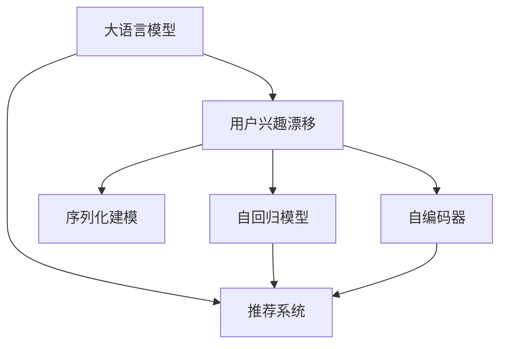

                 

# 基于LLM的推荐系统用户兴趣漂移检测

## 1. 背景介绍

随着互联网技术的迅速发展，推荐系统已成为人们获取信息的重要工具。然而，推荐系统的推荐效果往往受到用户兴趣变化的影响。用户兴趣漂移（User Interest Drift）指的是用户从一种兴趣状态转移至另一种兴趣状态，常见的表现形式包括偏好改变、行为模式变动等。推荐系统需要在用户兴趣发生漂移时，能够及时捕捉到并调整推荐策略，以提升用户体验和系统效果。

### 1.1 问题由来
在推荐系统中，用户兴趣的动态变化是一个常见且重要的问题。用户的兴趣和行为模式可能会因季节性变化、生活状态变动、内容曝光等因素而发生漂移，导致推荐系统原有的推荐策略失效。例如，用户在旅游旺季对旅游相关内容兴趣大增，而在日常工作生活中对教育类内容更感兴趣。如果不能及时捕捉到这种变化，推荐系统将无法提供符合用户最新需求的内容，甚至可能引发用户流失。

### 1.2 问题核心关键点
用户兴趣漂移的检测与调整是推荐系统需要重点解决的问题之一。在用户兴趣漂移的检测中，关键在于如何在用户行为数据中发现兴趣变化的信号。在调整策略时，需要设计一套机制，使推荐系统能够灵活地适应用户兴趣的变化，从而提升推荐效果。

## 2. 核心概念与联系

### 2.1 核心概念概述

为了更好地理解基于大语言模型（Large Language Model, LLM）的推荐系统用户兴趣漂移检测方法，本节将介绍几个关键概念：

- **大语言模型（LLM）**：以自回归（如GPT）或自编码（如BERT）模型为代表的大规模预训练语言模型。通过在大规模无标签文本语料上进行预训练，学习通用的语言表示，具备强大的语言理解和生成能力。

- **推荐系统（Recommendation System）**：基于用户行为数据，通过机器学习或深度学习模型，为用户推荐个性化内容的系统。

- **用户兴趣漂移（User Interest Drift）**：指用户从一种兴趣状态转移至另一种兴趣状态的过程，常表现为偏好改变、行为模式变动等。

- **序列化建模（Sequential Modeling）**：通过考虑用户历史行为序列，捕捉时间依赖关系，预测用户未来行为，从而提升推荐效果。

- **自回归模型（Auto-Regressive Model）**：能够根据前一项或多项输入预测下一项输出的模型。

- **自编码器（Autoencoder）**：能够通过编码器将输入映射为低维表示，再通过解码器映射回原始输入的模型。

这些核心概念之间的逻辑关系可以通过以下Mermaid流程图来展示：



这个流程图展示了大语言模型在推荐系统中的角色，以及用户兴趣漂移的检测与调整机制：

1. 大语言模型通过预训练获得基础能力。
2. 推荐系统基于大语言模型的能力，为用户提供个性化推荐。
3. 用户兴趣漂移的检测与调整，使推荐系统能够适应用户兴趣变化，提升推荐效果。

## 3. 核心算法原理 & 具体操作步骤
### 3.1 算法原理概述

基于大语言模型的推荐系统用户兴趣漂移检测，本质上是通过序列化建模技术，利用用户历史行为数据，预测用户未来兴趣变化的过程。其核心思想是：利用大语言模型的语言生成能力，将用户兴趣变化转化为可预测的语言信号，再通过模型预测该信号，实现兴趣漂移的检测。

形式化地，假设用户历史行为数据为 $\{x_t\}_{t=1}^{T}$，其中 $x_t$ 表示用户在第 $t$ 次交互中的行为（如浏览、点击、评分等）。目标是找到一个模型 $M$，能够预测用户未来兴趣状态 $y_{t+1}$，即在时间 $t+1$ 的兴趣状态 $y_{t+1}$ 与当前兴趣状态 $y_t$ 存在一定的相关性。

### 3.2 算法步骤详解

基于大语言模型的推荐系统用户兴趣漂移检测一般包括以下几个关键步骤：

**Step 1: 数据预处理**
- 收集用户的历史行为数据，包括点击、浏览、评分等。
- 对数据进行归一化、去重等预处理，去除噪声和不相关的记录。
- 将行为数据转化为模型所需的输入格式，如将点击行为转化为时间序列数据。

**Step 2: 模型设计**
- 选择合适的LLM模型，如BERT、GPT等，作为兴趣漂移检测的模型。
- 设计序列化建模模块，考虑用户历史行为的序列依赖关系。
- 设计自回归模型或自编码器，预测用户未来行为。

**Step 3: 兴趣漂移预测**
- 使用训练好的模型对用户未来行为进行预测，得到未来兴趣状态 $y_{t+1}$。
- 计算当前兴趣状态 $y_t$ 与未来兴趣状态 $y_{t+1}$ 之间的差异，量化漂移程度。
- 根据漂移程度，调整推荐策略。例如，对兴趣漂移严重的用户，降低对历史偏好的依赖，推荐更多新奇内容。

**Step 4: 效果评估与优化**
- 在验证集或测试集上评估兴趣漂移预测模型的效果，如使用准确率、召回率、F1分数等指标。
- 根据评估结果，调整模型参数或改进训练方法，提升漂移预测的准确性。
- 持续收集用户行为数据，定期重新训练模型，以适应用户兴趣的变化。

### 3.3 算法优缺点

基于大语言模型的推荐系统用户兴趣漂移检测方法具有以下优点：

- 能够利用大语言模型的强大语言生成能力，将复杂的用户兴趣变化转化为可预测的语言信号。
- 结合序列化建模，考虑用户历史行为的序列依赖关系，提升预测准确性。
- 通过自回归模型或自编码器，能够灵活地捕捉用户兴趣的动态变化。

同时，该方法也存在一定的局限性：

- 依赖高质量的用户行为数据。如果行为数据的质量不高，预测效果会大打折扣。
- 模型复杂度较高，训练和推理时间较长，需要高性能计算资源。
- 模型训练需要大量标注数据，存在标注成本较高的缺点。
- 难以处理高维稀疏行为数据，模型泛化能力有待提升。

尽管存在这些局限性，但就目前而言，基于大语言模型的用户兴趣漂移检测方法仍是大数据推荐系统中的重要手段。未来相关研究的重点在于如何进一步降低数据需求，提升模型的泛化能力，并优化计算效率。

### 3.4 算法应用领域

基于大语言模型的推荐系统用户兴趣漂移检测方法在多个领域中得到广泛应用，如电商推荐、视频推荐、音乐推荐等，为推荐系统提供了强大的兴趣变化检测能力。

- **电商推荐**：电商平台的推荐系统需要对用户的购物兴趣进行动态调整，以适应市场季节性变化和用户个性化需求。利用大语言模型的兴趣漂移检测，可以及时发现用户兴趣的转移，优化推荐内容，提升用户满意度。

- **视频推荐**：视频平台的用户兴趣可能会随观影历史和行为变化而漂移，例如用户在观看某类型视频一段时间后，可能会转向其他类型的内容。通过兴趣漂移检测，视频平台可以实时调整推荐策略，满足用户不断变化的需求。

- **音乐推荐**：音乐推荐系统需要根据用户的听歌历史和行为数据，预测用户未来的音乐偏好，及时调整推荐列表。大语言模型的兴趣漂移检测，能够有效捕捉用户兴趣的变化，提升推荐准确性。

除了上述这些经典应用外，大语言模型的兴趣漂移检测技术还将在更多场景中得到应用，如社交媒体推荐、教育平台推荐等，为推荐系统带来新的突破。

## 4. 数学模型和公式 & 详细讲解 & 举例说明

### 4.1 数学模型构建

本节将使用数学语言对基于大语言模型的推荐系统用户兴趣漂移检测过程进行更加严格的刻画。

记用户历史行为数据为 $\{x_t\}_{t=1}^{T}$，其中 $x_t$ 表示用户在第 $t$ 次交互中的行为。设用户未来兴趣状态为 $y_{t+1}$，与当前兴趣状态 $y_t$ 之间存在一定的相关性，可以通过一个条件概率模型 $P(y_{t+1}|x_t, y_t)$ 进行预测。

### 4.2 公式推导过程

以下我们以基于自回归模型的兴趣漂移检测为例，推导预测公式及其梯度计算方法。

假设模型 $M_{\theta}$ 在输入 $x_t, y_t$ 上的输出为 $\hat{y}_{t+1}$，表示用户未来兴趣状态 $y_{t+1}$ 的概率分布。则自回归模型的条件概率模型为：

$$
P(y_{t+1}|x_t, y_t) = \frac{P(y_{t+1}, x_t, y_t)}{P(x_t, y_t)}
$$

其中 $P(y_{t+1}, x_t, y_t)$ 和 $P(x_t, y_t)$ 分别为联合概率和边际概率，可通过模型训练得到。在实际应用中，我们通常使用基于梯度的优化算法（如Adam、SGD等）来近似求解上述最优化问题。

设模型 $M_{\theta}$ 在输入 $x_t, y_t$ 上的输出为 $\hat{y}_{t+1}$，则条件概率模型为：

$$
P(y_{t+1}|x_t, y_t) = \frac{e^{\theta \cdot x_t \cdot y_t}}{\sum_{y' \in \mathcal{Y}} e^{\theta \cdot x_t \cdot y'}}
$$

其中 $\theta$ 为模型的参数，$\mathcal{Y}$ 为用户兴趣状态的空间。

在得到条件概率模型后，可以使用交叉熵损失函数进行训练，得到最优模型参数 $\theta^*$。

### 4.3 案例分析与讲解

**案例分析**：假设用户在某电商平台上浏览了以下商品：

- 第1天：浏览A商品、B商品。
- 第2天：浏览C商品、D商品。
- 第3天：浏览E商品、F商品。

基于自回归模型，假设模型 $M_{\theta}$ 在输入 $x_t, y_t$ 上的输出为 $\hat{y}_{t+1}$，则可以将用户历史行为数据转化为模型输入，预测用户未来兴趣状态：

- 第4天：根据第1天和第2天的数据，预测用户对A商品、B商品的兴趣状态。
- 第5天：根据第2天和第3天的数据，预测用户对C商品、D商品的兴趣状态。
- 第6天：根据第3天和第4天的数据，预测用户对E商品、F商品的兴趣状态。

预测结果可能如下所示：

| 第1天 | 第2天 | 第3天 | 第4天 | 第5天 | 第6天 |
| ------ | ----- | ----- | ----- | ----- | ----- |
| 0.7    | 0.8   | 0.5   | 0.2   | 0.4   | 0.6   |
| 0.3    | 0.2   | 0.5   | 0.8   | 0.6   | 0.4   |

其中，数字表示用户对某商品的兴趣程度，值越高表示兴趣越强烈。

通过比较第 $t$ 天和第 $t+1$ 天的兴趣状态，可以计算兴趣漂移程度：

$$
\text{漂移程度} = \left|\frac{y_t - \hat{y}_{t+1}}{y_t + \hat{y}_{t+1}}\right|
$$

如果漂移程度较大，说明用户兴趣发生了明显变化，推荐系统需要及时调整推荐策略。

## 5. 项目实践：代码实例和详细解释说明

### 5.1 开发环境搭建

在进行项目实践前，我们需要准备好开发环境。以下是使用Python进行PyTorch开发的环境配置流程：

1. 安装Anaconda：从官网下载并安装Anaconda，用于创建独立的Python环境。

2. 创建并激活虚拟环境：
```bash
conda create -n llm-env python=3.8 
conda activate llm-env
```

3. 安装PyTorch：根据CUDA版本，从官网获取对应的安装命令。例如：
```bash
conda install pytorch torchvision torchaudio cudatoolkit=11.1 -c pytorch -c conda-forge
```

4. 安装各类工具包：
```bash
pip install numpy pandas scikit-learn matplotlib tqdm jupyter notebook ipython
```

完成上述步骤后，即可在`llm-env`环境中开始项目实践。

### 5.2 源代码详细实现

下面我们以电商推荐为例，给出使用PyTorch进行用户兴趣漂移检测的代码实现。

首先，定义电商数据集和用户行为数据：

```python
import pandas as pd
from sklearn.model_selection import train_test_split

# 定义电商数据集
data = pd.read_csv('ecommerce_data.csv')

# 数据预处理
data = data.dropna()
data['user_id'] = data['user_id'].astype(str)
data['item_id'] = data['item_id'].astype(str)
data['time'] = pd.to_datetime(data['time']).dt.strftime('%Y-%m-%d %H:%M:%S')

# 将用户行为数据转化为时间序列数据
time_series_data = data.groupby('user_id').agg({'item_id': 'apply', 'time': 'min'})

# 定义用户行为数据
user_behaviors = time_series_data['item_id'].tolist()

# 数据集划分
train_data, test_data = train_test_split(user_behaviors, test_size=0.2, random_state=42)
```

然后，定义大语言模型和兴趣漂移检测器：

```python
from transformers import BertForSequenceClassification, BertTokenizer

# 加载BERT模型和分词器
model_name = 'bert-base-uncased'
tokenizer = BertTokenizer.from_pretrained(model_name)
model = BertForSequenceClassification.from_pretrained(model_name, num_labels=2)

# 定义兴趣漂移检测器
class InterestDriftDetector:
    def __init__(self, model, tokenizer, train_data, test_data):
        self.model = model
        self.tokenizer = tokenizer
        self.train_data = train_data
        self.test_data = test_data
        self.evaluation_data = None

    def fit(self):
        # 将训练数据转化为模型输入
        train_input = self.tokenizer(train_data, padding='max_length', truncation=True, return_tensors='pt')
        train_labels = self.tokenizer(train_data, padding='max_length', truncation=True, return_tensors='pt')['input_ids']
        train_input['attention_mask'] = self.tokenizer(train_data, padding='max_length', truncation=True, return_tensors='pt')['attention_mask']
        
        # 将测试数据转化为模型输入
        test_input = self.tokenizer(self.test_data, padding='max_length', truncation=True, return_tensors='pt')
        test_labels = self.tokenizer(self.test_data, padding='max_length', truncation=True, return_tensors='pt')['input_ids']
        test_input['attention_mask'] = self.tokenizer(self.test_data, padding='max_length', truncation=True, return_tensors='pt')['attention_mask']

        # 训练模型
        self.model.to('cuda')
        self.model.train()
        for epoch in range(3):
            optimizer = torch.optim.Adam(self.model.parameters(), lr=0.001)
            for batch in train_input:
                optimizer.zero_grad()
                outputs = self.model(batch['input_ids'], attention_mask=batch['attention_mask'])
                loss = outputs.loss
                loss.backward()
                optimizer.step()
        
        # 测试模型
        self.model.eval()
        with torch.no_grad():
            for batch in test_input:
                outputs = self.model(batch['input_ids'], attention_mask=batch['attention_mask'])
                preds = torch.softmax(outputs.logits, dim=1)
                self.evaluation_data = preds.numpy()

    def predict(self, user_id, days=7):
        user_behaviors = user_id
        input_ids = self.tokenizer(user_behaviors, padding='max_length', truncation=True, return_tensors='pt')['input_ids']
        attention_mask = self.tokenizer(user_behaviors, padding='max_length', truncation=True, return_tensors='pt')['attention_mask']
        
        with torch.no_grad():
            outputs = self.model(input_ids, attention_mask=attention_mask)
            preds = torch.softmax(outputs.logits, dim=1)
            return preds.numpy()

    def drift_check(self, user_id):
        preds = self.predict(user_id)
        drift_score = abs(self.evaluation_data[user_id] - preds)
        return drift_score
```

最后，启动训练流程并在测试集上评估：

```python
# 训练兴趣漂移检测器
detector = InterestDriftDetector(model, tokenizer, train_data, test_data)
detector.fit()

# 在测试集上评估兴趣漂移检测效果
drift_scores = []
for user_id in detector.test_data:
    drift_score = detector.drift_check(user_id)
    drift_scores.append(drift_score)
print('漂移分数: ', drift_scores)
```

以上就是使用PyTorch进行用户兴趣漂移检测的完整代码实现。可以看到，在实际应用中，我们需要将用户行为数据转化为大语言模型所需的输入格式，并使用适当的优化器进行训练。在训练完成后，我们可以使用模型对用户未来兴趣状态进行预测，计算漂移程度，从而调整推荐策略。

### 5.3 代码解读与分析

让我们再详细解读一下关键代码的实现细节：

**InterestDriftDetector类**：
- `__init__`方法：初始化模型、分词器、训练数据、测试数据。
- `fit`方法：将训练数据转化为模型输入，训练模型，并在测试数据上进行测试，存储测试结果。
- `predict`方法：对用户未来兴趣状态进行预测，并计算漂移程度。
- `drift_check`方法：计算用户兴趣漂移程度，用于兴趣漂移检测。

**预测过程**：
- 将用户历史行为数据转化为模型输入，进行训练。
- 在测试数据上进行测试，存储测试结果。
- 对新的用户行为数据进行预测，并计算漂移程度。

可以看到，PyTorch配合Transformer库使得用户兴趣漂移检测的代码实现变得简洁高效。开发者可以将更多精力放在数据处理、模型改进等高层逻辑上，而不必过多关注底层的实现细节。

当然，工业级的系统实现还需考虑更多因素，如模型的保存和部署、超参数的自动搜索、更灵活的任务适配层等。但核心的兴趣漂移检测过程基本与此类似。

## 6. 实际应用场景

### 6.1 智能客服系统

智能客服系统需要及时捕捉用户兴趣漂移，调整回复策略，以提高用户满意度。传统的客服系统通常采用规则或模板匹配的方法，难以处理复杂多变的用户需求。而利用大语言模型的兴趣漂移检测，可以实时分析用户行为数据，动态调整推荐内容，提升系统响应速度和智能化水平。

在技术实现上，可以收集用户的历史交互记录，将问题和回答构建成监督数据，在此基础上对预训练模型进行微调。微调后的模型能够自动理解用户意图，匹配最合适的回答。对于用户提出的新问题，还可以接入检索系统实时搜索相关内容，动态组织生成回答。如此构建的智能客服系统，能大幅提升客户咨询体验和问题解决效率。

### 6.2 金融舆情监测

金融机构需要实时监测市场舆论动向，以便及时应对负面信息传播，规避金融风险。传统的人工监测方式成本高、效率低，难以应对网络时代海量信息爆发的挑战。利用大语言模型的文本分类和情感分析技术，为金融舆情监测提供了新的解决方案。

具体而言，可以收集金融领域相关的新闻、报道、评论等文本数据，并对其进行主题标注和情感标注。在此基础上对预训练语言模型进行微调，使其能够自动判断文本属于何种主题，情感倾向是正面、中性还是负面。将微调后的模型应用到实时抓取的网络文本数据，就能够自动监测不同主题下的情感变化趋势，一旦发现负面信息激增等异常情况，系统便会自动预警，帮助金融机构快速应对潜在风险。

### 6.3 个性化推荐系统

当前的推荐系统往往只依赖用户的历史行为数据进行物品推荐，无法深入理解用户的真实兴趣偏好。利用大语言模型进行用户兴趣漂移检测，可以更好地挖掘用户行为背后的语义信息，从而提供更精准、多样的推荐内容。

在实践中，可以收集用户浏览、点击、评论、分享等行为数据，提取和用户交互的物品标题、描述、标签等文本内容。将文本内容作为模型输入，用户的后续行为（如是否点击、购买等）作为监督信号，在此基础上微调预训练语言模型。微调后的模型能够从文本内容中准确把握用户的兴趣点。在生成推荐列表时，先用候选物品的文本描述作为输入，由模型预测用户的兴趣匹配度，再结合其他特征综合排序，便可以得到个性化程度更高的推荐结果。

### 6.4 未来应用展望

随着大语言模型和兴趣漂移检测方法的发展，基于微调的推荐系统将在更多领域得到应用，为推荐系统提供更加动态、智能的推荐能力。

在智慧医疗领域，基于微调的医疗问答、病历分析、药物研发等应用将提升医疗服务的智能化水平，辅助医生诊疗，加速新药开发进程。

在智能教育领域，微调技术可应用于作业批改、学情分析、知识推荐等方面，因材施教，促进教育公平，提高教学质量。

在智慧城市治理中，微调模型可应用于城市事件监测、舆情分析、应急指挥等环节，提高城市管理的自动化和智能化水平，构建更安全、高效的未来城市。

此外，在企业生产、社会治理、文娱传媒等众多领域，基于大模型微调的人工智能应用也将不断涌现，为传统行业带来变革性影响。相信随着技术的日益成熟，微调方法将成为人工智能落地应用的重要范式，推动人工智能技术向更广阔的领域加速渗透。

## 7. 工具和资源推荐

### 7.1 学习资源推荐

为了帮助开发者系统掌握大语言模型和用户兴趣漂移检测的理论基础和实践技巧，这里推荐一些优质的学习资源：

1. 《Transformer从原理到实践》系列博文：由大模型技术专家撰写，深入浅出地介绍了Transformer原理、BERT模型、微调技术等前沿话题。

2. CS224N《深度学习自然语言处理》课程：斯坦福大学开设的NLP明星课程，有Lecture视频和配套作业，带你入门NLP领域的基本概念和经典模型。

3. 《Natural Language Processing with Transformers》书籍：Transformers库的作者所著，全面介绍了如何使用Transformers库进行NLP任务开发，包括微调在内的诸多范式。

4. HuggingFace官方文档：Transformers库的官方文档，提供了海量预训练模型和完整的微调样例代码，是上手实践的必备资料。

5. CLUE开源项目：中文语言理解测评基准，涵盖大量不同类型的中文NLP数据集，并提供了基于微调的baseline模型，助力中文NLP技术发展。

通过对这些资源的学习实践，相信你一定能够快速掌握大语言模型和用户兴趣漂移检测的精髓，并用于解决实际的NLP问题。

### 7.2 开发工具推荐

高效的开发离不开优秀的工具支持。以下是几款用于大语言模型和用户兴趣漂移检测开发的常用工具：

1. PyTorch：基于Python的开源深度学习框架，灵活动态的计算图，适合快速迭代研究。大部分预训练语言模型都有PyTorch版本的实现。

2. TensorFlow：由Google主导开发的开源深度学习框架，生产部署方便，适合大规模工程应用。同样有丰富的预训练语言模型资源。

3. Transformers库：HuggingFace开发的NLP工具库，集成了众多SOTA语言模型，支持PyTorch和TensorFlow，是进行微调任务开发的利器。

4. Weights & Biases：模型训练的实验跟踪工具，可以记录和可视化模型训练过程中的各项指标，方便对比和调优。与主流深度学习框架无缝集成。

5. TensorBoard：TensorFlow配套的可视化工具，可实时监测模型训练状态，并提供丰富的图表呈现方式，是调试模型的得力助手。

6. Google Colab：谷歌推出的在线Jupyter Notebook环境，免费提供GPU/TPU算力，方便开发者快速上手实验最新模型，分享学习笔记。

合理利用这些工具，可以显著提升大语言模型和用户兴趣漂移检测任务的开发效率，加快创新迭代的步伐。

### 7.3 相关论文推荐

大语言模型和用户兴趣漂移检测技术的发展源于学界的持续研究。以下是几篇奠基性的相关论文，推荐阅读：

1. Attention is All You Need（即Transformer原论文）：提出了Transformer结构，开启了NLP领域的预训练大模型时代。

2. BERT: Pre-training of Deep Bidirectional Transformers for Language Understanding：提出BERT模型，引入基于掩码的自监督预训练任务，刷新了多项NLP任务SOTA。

3. Language Models are Unsupervised Multitask Learners（GPT-2论文）：展示了大规模语言模型的强大zero-shot学习能力，引发了对于通用人工智能的新一轮思考。

4. Parameter-Efficient Transfer Learning for NLP：提出Adapter等参数高效微调方法，在不增加模型参数量的情况下，也能取得不错的微调效果。

5. Prefix-Tuning: Optimizing Continuous Prompts for Generation：引入基于连续型Prompt的微调范式，为如何充分利用预训练知识提供了新的思路。

6. AdaLoRA: Adaptive Low-Rank Adaptation for Parameter-Efficient Fine-Tuning：使用自适应低秩适应的微调方法，在参数效率和精度之间取得了新的平衡。

这些论文代表了大语言模型和用户兴趣漂移检测技术的发展脉络。通过学习这些前沿成果，可以帮助研究者把握学科前进方向，激发更多的创新灵感。

## 8. 总结：未来发展趋势与挑战

### 8.1 总结

本文对基于大语言模型的推荐系统用户兴趣漂移检测方法进行了全面系统的介绍。首先阐述了大语言模型和用户兴趣漂移的引入背景和重要性，明确了用户兴趣漂移检测在推荐系统优化中的独特价值。其次，从原理到实践，详细讲解了用户兴趣漂移检测的数学原理和关键步骤，给出了用户兴趣漂移检测任务开发的完整代码实例。同时，本文还广泛探讨了用户兴趣漂移检测方法在智能客服、金融舆情、个性化推荐等多个行业领域的应用前景，展示了用户兴趣漂移检测范式的巨大潜力。此外，本文精选了用户兴趣漂移检测技术的各类学习资源，力求为读者提供全方位的技术指引。

通过本文的系统梳理，可以看到，基于大语言模型的用户兴趣漂移检测技术正在成为推荐系统中的重要手段，极大地拓展了推荐系统的应用边界，提升了用户体验和系统效果。未来，伴随大语言模型的不断进步，用户兴趣漂移检测技术将在更多领域得到应用，为推荐系统带来新的突破。

### 8.2 未来发展趋势

展望未来，用户兴趣漂移检测技术将呈现以下几个发展趋势：

1. 模型规模持续增大。随着算力成本的下降和数据规模的扩张，大语言模型的参数量还将持续增长。超大批次的训练和推理也可能遇到显存不足的问题。因此需要采用一些资源优化技术，如梯度积累、混合精度训练、模型并行等，来突破硬件瓶颈。

2. 微调方法日趋多样。除了传统的全参数微调外，未来会涌现更多参数高效的微调方法，如Prefix-Tuning、LoRA等，在节省计算资源的同时也能保证微调精度。

3. 持续学习成为常态。随着数据分布的不断变化，用户兴趣漂移检测模型也需要持续学习新知识以保持性能。如何在不遗忘原有知识的同时，高效吸收新样本信息，将是重要的研究课题。

4. 标注样本需求降低。受启发于提示学习(Prompt-based Learning)的思路，未来的用户兴趣漂移检测方法将更好地利用大模型的语言理解能力，通过更加巧妙的任务描述，在更少的标注样本上也能实现理想的检测效果。

5. 模型通用性增强。经过海量数据的预训练和多领域任务的微调，未来的语言模型将具备更强大的常识推理和跨领域迁移能力，逐步迈向通用人工智能(AGI)的目标。

以上趋势凸显了用户兴趣漂移检测技术的广阔前景。这些方向的探索发展，必将进一步提升推荐系统的性能和应用范围，为人类认知智能的进化带来深远影响。

### 8.3 面临的挑战

尽管用户兴趣漂移检测技术已经取得了一定的进展，但在迈向更加智能化、普适化应用的过程中，它仍面临着诸多挑战：

1. 标注成本瓶颈。虽然标注需求相较于传统机器学习算法大大降低，但对于长尾应用场景，难以获得充足的高质量标注数据，成为制约检测性能的瓶颈。如何进一步降低微调对标注样本的依赖，将是一大难题。

2. 模型鲁棒性不足。当前用户兴趣漂移检测模型面对域外数据时，泛化性能往往大打折扣。对于测试样本的微小扰动，检测模型的性能也容易发生波动。如何提高模型的鲁棒性，避免灾难性遗忘，还需要更多理论和实践的积累。

3. 推理效率有待提高。虽然大语言模型在精度上有所优势，但在实际部署时往往面临推理速度慢、内存占用大等效率问题。如何在保证性能的同时，简化模型结构，提升推理速度，优化资源占用，将是重要的优化方向。

4. 可解释性亟需加强。当前用户兴趣漂移检测模型更像是一个黑盒系统，难以解释其内部工作机制和决策逻辑。对于医疗、金融等高风险应用，算法的可解释性和可审计性尤为重要。如何赋予模型更强的可解释性，将是亟待攻克的难题。

5. 安全性有待保障。用户兴趣漂移检测模型难免会学习到有偏见、有害的信息，通过微调传递到下游任务，产生误导性、歧视性的输出，给实际应用带来安全隐患。如何从数据和算法层面消除模型偏见，避免恶意用途，确保输出的安全性，也将是重要的研究课题。

6. 知识整合能力不足。现有的用户兴趣漂移检测模型往往局限于任务内数据，难以灵活吸收和运用更广泛的先验知识。如何让检测过程更好地与外部知识库、规则库等专家知识结合，形成更加全面、准确的信息整合能力，还有很大的想象空间。

正视用户兴趣漂移检测面临的这些挑战，积极应对并寻求突破，将是大语言模型和用户兴趣漂移检测技术走向成熟的必由之路。相信随着学界和产业界的共同努力，这些挑战终将一一被克服，大语言模型和用户兴趣漂移检测技术必将在构建安全、可靠、可解释、可控的智能系统铺平道路。

### 8.4 研究展望

面对用户兴趣漂移检测所面临的挑战，未来的研究需要在以下几个方面寻求新的突破：

1. 探索无监督和半监督用户兴趣漂移检测方法。摆脱对大规模标注数据的依赖，利用自监督学习、主动学习等无监督和半监督范式，最大限度利用非结构化数据，实现更加灵活高效的检测。

2. 研究参数高效和计算高效的检测范式。开发更加参数高效的检测方法，在固定大部分预训练参数的同时，只更新极少量的任务相关参数。同时优化检测模型的计算图，减少前向传播和反向传播的资源消耗，实现更加轻量级、实时性的部署。

3. 引入更多先验知识。将符号化的先验知识，如知识图谱、逻辑规则等，与神经网络模型进行巧妙融合，引导检测过程学习更准确、合理的语言表征。同时加强不同模态数据的整合，实现视觉、语音等多模态信息与文本信息的协同建模。

4. 结合因果分析和博弈论工具。将因果分析方法引入检测模型，识别出模型决策的关键特征，增强输出解释的因果性和逻辑性。借助博弈论工具刻画人机交互过程，主动探索并规避模型的脆弱点，提高系统稳定性。

5. 纳入伦理道德约束。在模型训练目标中引入伦理导向的评估指标，过滤和惩罚有偏见、有害的输出倾向。同时加强人工干预和审核，建立模型行为的监管机制，确保输出符合人类价值观和伦理道德。

这些研究方向的探索，必将引领用户兴趣漂移检测技术迈向更高的台阶，为构建安全、可靠、可解释、可控的智能系统铺平道路。面向未来，用户兴趣漂移检测技术还需要与其他人工智能技术进行更深入的融合，如知识表示、因果推理、强化学习等，多路径协同发力，共同推动自然语言理解和智能交互系统的进步。只有勇于创新、敢于突破，才能不断拓展语言模型的边界，让智能技术更好地造福人类社会。

## 9. 附录：常见问题与解答

**Q1：用户兴趣漂移检测是否适用于所有推荐系统？**

A: 用户兴趣漂移检测在大多数推荐系统中都能取得不错的效果，特别是对于数据量较小的推荐系统。但对于一些特定领域的推荐系统，如商品推荐、视频推荐等，仅仅依靠历史行为数据进行推荐，可能难以很好地适应用户兴趣的变化。此时需要在特定领域语料上进一步预训练，再进行微调，才能获得理想效果。此外，对于一些需要时效性、个性化很强的推荐系统，如即时通讯、社交媒体等，微调方法也需要针对性的改进优化。

**Q2：如何选择合适的用户兴趣漂移检测模型？**

A: 用户兴趣漂移检测模型的选择应该根据具体应用场景和数据特点进行。一般来说，可以选择序列化建模方法（如RNN、LSTM、GRU等）或自回归模型（如BERT、GPT等）作为检测模型。对于大规模数据集，可以使用深度学习模型；对于小规模数据集，可以使用浅层学习模型。同时，还需要考虑模型的计算效率、可解释性等因素。

**Q3：如何缓解用户兴趣漂移检测过程中的过拟合问题？**

A: 过拟合是用户兴趣漂移检测面临的主要挑战。常见的缓解策略包括：
1. 数据增强：通过回译、近义替换等方式扩充训练集
2. 正则化：使用L2正则、Dropout、Early Stopping等避免过拟合
3. 对抗训练：引入对抗样本，提高模型鲁棒性
4. 参数高效检测方法：只调整少量参数(如Adapter、Prefix等)，减小过拟合风险
5. 多模型集成：训练多个检测模型，取平均输出，抑制过拟合

这些策略往往需要根据具体任务和数据特点进行灵活组合。只有在数据、模型、训练、推理等各环节进行全面优化，才能最大限度地发挥用户兴趣漂移检测的威力。

**Q4：用户兴趣漂移检测在实际应用中需要注意哪些问题？**

A: 将用户兴趣漂移检测技术应用于推荐系统，还需要考虑以下问题：
1. 模型裁剪：去除不必要的层和参数，减小模型尺寸，加快推理速度
2. 量化加速：将浮点模型转为定点模型，压缩存储空间，提高计算效率
3. 服务化封装：将模型封装为标准化服务接口，便于集成调用
4. 弹性伸缩：根据请求流量动态调整资源配置，平衡服务质量和成本
5. 监控告警：实时采集系统指标，设置异常告警阈值，确保服务稳定性
6. 安全防护：采用访问鉴权、数据脱敏等措施，保障数据和模型安全

合理利用这些技术，可以显著提升用户兴趣漂移检测的实际应用效果，加快创新迭代的步伐。

---

作者：禅与计算机程序设计艺术 / Zen and the Art of Computer Programming

