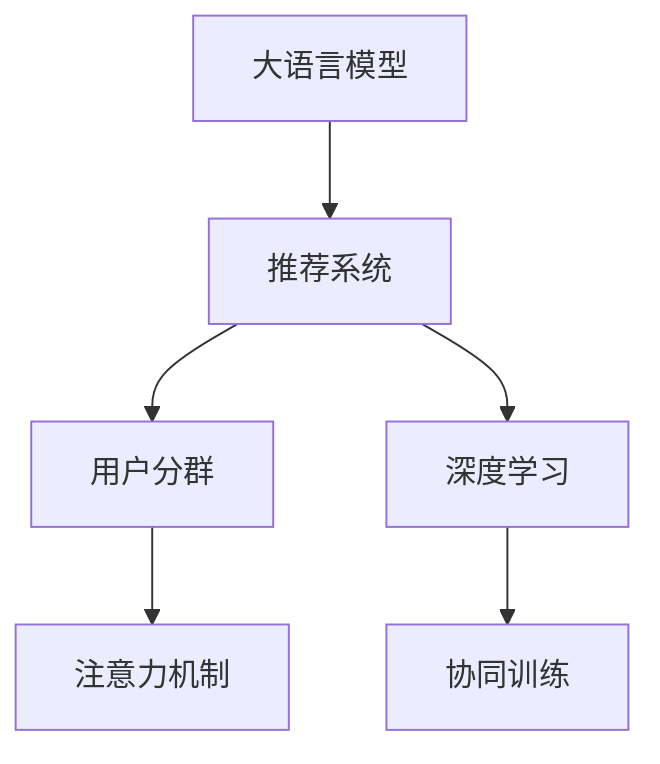

                 

# 基于LLM的推荐系统用户分群新方法

> 关键词：推荐系统,用户分群,LLM,注意力机制,深度学习

## 1. 背景介绍

### 1.1 问题由来

在互联网时代，个性化推荐已成为提升用户体验和平台收益的关键技术。传统的基于协同过滤、内容匹配等方法虽有成效，但在处理海量数据、长尾用户和稀疏矩阵等问题上仍显不足。近年来，基于深度学习的推荐系统逐渐成为主流，其中以协同训练、表示学习等为代表的模型方法得到了广泛应用。但这些方法仍存在过拟合、高昂计算成本等问题。

自然语言处理（NLP）领域的预训练语言模型（LLM）近年来取得了巨大的突破。这些模型在文本生成、问答等任务上表现优异，且具有较强的泛化能力和表达能力。将这些模型应用到推荐系统中，有望从根本上提升个性化推荐的精度和效率。但如何将LLM模型与推荐系统有效结合，实现更精准的用户分群和物品推荐，是一个值得探讨的问题。

### 1.2 问题核心关键点

本文聚焦于基于大语言模型（LLM）的推荐系统用户分群方法，其核心问题包括：
- 如何利用LLM强大的语言理解能力，高效提取用户行为特征和物品描述特征？
- 如何构建合适的网络结构，将用户和物品嵌入到高维空间中进行相似性计算？
- 如何在高维空间中进行有效的相似性计算和用户分群，避免维度灾难和计算复杂度？
- 如何将用户分群和物品推荐相结合，实现个性化推荐？

### 1.3 问题研究意义

基于LLM的推荐系统用户分群方法，可以为推荐系统带来以下几方面的提升：
1. 提升个性化推荐精度。LLM强大的语言表达能力，可以帮助提取更丰富的用户和物品特征，从而提升推荐系统的性能。
2. 降低计算成本。LLM的预训练和微调过程已广泛应用在大规模数据上，进一步融入推荐系统能够复用这些数据和模型，降低推荐系统训练和部署的成本。
3. 增强模型的泛化能力。LLM的学习能力使得推荐系统能够适应多样化的数据分布，提升模型在新数据上的表现。
4. 丰富推荐系统的应用场景。LLM的文本生成能力，可应用于问答、摘要、多模态推荐等更多新兴领域，推动推荐系统的发展。

## 2. 核心概念与联系

### 2.1 核心概念概述

为了更好地理解基于LLM的推荐系统用户分群方法，本节将介绍几个核心概念及其联系：

- **大语言模型（Large Language Model, LLM）**：以自回归（如GPT）或自编码（如BERT）模型为代表的大规模预训练语言模型。通过在大规模无标签文本数据上进行预训练，学习通用的语言表示，具备强大的语言理解和生成能力。

- **推荐系统（Recommendation System）**：通过分析用户历史行为数据，为用户推荐个性化物品的系统。主要包括基于协同过滤、内容匹配、混合模型等方法。

- **用户分群（User Segmentation）**：根据用户的兴趣和行为，将用户分成不同的群体，便于个性化推荐。常见的分群方法包括基于协同过滤的K-means聚类、基于图神经网络的社区发现等。

- **深度学习（Deep Learning）**：利用神经网络等方法，自动从数据中提取特征并进行模式识别的技术。深度学习在推荐系统中主要应用于特征提取、表示学习、协同训练等环节。

- **注意力机制（Attention Mechanism）**：通过学习权重系数，动态调整不同特征的重要性，提升模型对重要信息的关注。注意力机制在推荐系统中用于用户特征和物品特征的加权组合。

- **协同训练（Collaborative Training）**：通过引入用户之间的相似性信息，优化用户和物品的表示，提升推荐系统的效果。

这些核心概念之间的联系通过以下Mermaid流程图展示：



这个流程图展示了大语言模型与推荐系统用户分群的关联过程：

1. 大语言模型通过预训练获得语言能力。
2. 推荐系统利用预训练模型提取用户和物品特征。
3. 用户分群通过特征提取和聚类算法进行用户分类。
4. 注意力机制用于特征的加权组合，提升相似性计算的精度。
5. 深度学习用于优化特征表示和协同训练，提升推荐效果。

这些概念共同构成了LLM推荐系统的核心框架，使其能够从语义上理解用户需求，实现更精确和多样化的推荐。

## 3. 核心算法原理 & 具体操作步骤
### 3.1 算法原理概述

基于LLM的推荐系统用户分群方法，本质上是一个将LLM与推荐系统结合的协同训练过程。其核心思想是：利用LLM强大的语言理解能力，提取用户行为和物品描述的语言特征，并通过深度学习模型进行表示学习，实现用户分群和物品推荐。

形式化地，假设推荐系统中有 $N$ 个用户和 $M$ 个物品，用户的每个行为 $x_i$ 和物品的每个属性 $y_j$ 都可以表示为语言序列。设预训练的LLM模型为 $M_{\theta}$，其中 $\theta$ 为预训练得到的模型参数。推荐系统的目标是通过协同训练，最大化用户与物品之间的相似性：

$$
\max_{\theta} \sum_{i=1}^N \sum_{j=1}^M \log P(x_i;y_j;M_{\theta})
$$

其中 $P(x_i;y_j;M_{\theta})$ 为模型在用户行为 $x_i$ 和物品属性 $y_j$ 下的概率分布，反映了用户 $i$ 对物品 $j$ 的兴趣程度。协同训练过程中，通过最大化用户与物品之间的相似性，优化模型参数 $\theta$。

### 3.2 算法步骤详解

基于LLM的推荐系统用户分群方法一般包括以下几个关键步骤：

**Step 1: 准备预训练模型和数据集**
- 选择合适的预训练语言模型 $M_{\theta}$ 作为初始化参数，如 BERT、GPT等。
- 准备推荐系统的用户行为数据集 $D_U=\{(x_i, r_i)\}_{i=1}^N$ 和物品属性数据集 $D_I=\{(y_j, f_j)\}_{j=1}^M$，其中 $r_i$ 为用户 $i$ 对物品 $j$ 的评分，$f_j$ 为物品 $j$ 的属性特征。

**Step 2: 设计任务适配层**
- 在预训练模型顶层设计合适的输出层和损失函数。对于评分预测任务，通常使用回归损失函数。
- 对于分类任务，通常在顶层添加线性分类器和交叉熵损失函数。

**Step 3: 设置微调超参数**
- 选择合适的优化算法及其参数，如 AdamW、SGD 等，设置学习率、批大小、迭代轮数等。
- 设置正则化技术及强度，包括权重衰减、Dropout、Early Stopping 等。
- 确定冻结预训练参数的策略，如仅微调顶层，或全部参数都参与微调。

**Step 4: 执行梯度训练**
- 将用户行为数据和物品属性数据分批次输入模型，前向传播计算损失函数。
- 反向传播计算参数梯度，根据设定的优化算法和学习率更新模型参数。
- 周期性在验证集上评估模型性能，根据性能指标决定是否触发 Early Stopping。
- 重复上述步骤直到满足预设的迭代轮数或 Early Stopping 条件。

**Step 5: 用户分群和推荐**
- 使用微调后的模型对新用户进行特征提取和相似性计算，根据用户分群算法进行聚类，得到用户群体。
- 在每个用户群体内，使用协同训练方法进行物品推荐，得到最终的推荐结果。

### 3.3 算法优缺点

基于LLM的推荐系统用户分群方法具有以下优点：
1. 提升个性化推荐精度。LLM强大的语言表达能力，能够提取更丰富的用户和物品特征，提升推荐系统的性能。
2. 降低计算成本。LLM的预训练和微调过程已广泛应用在大规模数据上，进一步融入推荐系统能够复用这些数据和模型，降低推荐系统训练和部署的成本。
3. 增强模型的泛化能力。LLM的学习能力使得推荐系统能够适应多样化的数据分布，提升模型在新数据上的表现。

同时，该方法也存在一定的局限性：
1. 依赖标注数据。微调的效果很大程度上取决于标注数据的质量和数量，获取高质量标注数据的成本较高。
2. 计算复杂度高。大语言模型和高维空间的相似性计算，需要较高的计算资源和内存，可能不适合实时推荐系统。
3. 模型复杂度大。将LLM模型应用于推荐系统，增加了模型的复杂度，可能影响模型的解释性和维护性。
4. 效果依赖训练集。模型效果很大程度上依赖于训练集的覆盖范围和质量，难以适应新出现的数据类型。

尽管存在这些局限性，但就目前而言，基于LLM的推荐系统用户分群方法仍是最前沿的推荐技术之一。未来相关研究的重点在于如何进一步降低计算成本，提高模型的泛化能力和可解释性，同时兼顾模型的实时性。

### 3.4 算法应用领域

基于LLM的推荐系统用户分群方法，已经在多个领域得到了广泛的应用，例如：

- 电子商务推荐：为用户推荐商品和活动，提升用户体验和购物转化率。
- 社交媒体推荐：为用户推荐内容、好友等，增强用户粘性。
- 新闻推荐：为用户推荐新闻文章，提升阅读体验和平台流量。
- 视频推荐：为用户推荐视频内容，提高观看时长和用户满意度。
- 音乐推荐：为用户推荐音乐作品，提升收听量和用户忠诚度。

除了这些传统应用领域外，LLM推荐系统还在更多新兴场景中得到应用，如智慧城市、智能制造等，推动了相关行业的发展。

## 4. 数学模型和公式 & 详细讲解  
### 4.1 数学模型构建

本节将使用数学语言对基于LLM的推荐系统用户分群方法进行更加严格的刻画。

记预训练语言模型为 $M_{\theta}$，用户的每个行为 $x_i$ 和物品的每个属性 $y_j$ 都可以表示为语言序列，记为 $\text{Seq}(x_i)$ 和 $\text{Seq}(y_j)$。假设推荐系统的任务为评分预测，模型在用户行为 $x_i$ 和物品属性 $y_j$ 下的概率分布为 $P(x_i;y_j;M_{\theta})$。设推荐系统中的评分矩阵为 $R_{ij}$，则用户 $i$ 对物品 $j$ 的评分 $r_i$ 满足：

$$
r_i = P(x_i;y_j;M_{\theta})
$$

模型训练的目标是最大化用户与物品之间的相似性：

$$
\max_{\theta} \sum_{i=1}^N \sum_{j=1}^M \log P(x_i;y_j;M_{\theta})
$$

在实践中，我们通常使用基于梯度的优化算法（如SGD、Adam等）来近似求解上述最优化问题。设 $\eta$ 为学习率，$\lambda$ 为正则化系数，则参数的更新公式为：

$$
\theta \leftarrow \theta - \eta \nabla_{\theta}\mathcal{L}(\theta) - \eta\lambda\theta
$$

其中 $\nabla_{\theta}\mathcal{L}(\theta)$ 为损失函数对参数 $\theta$ 的梯度，可通过反向传播算法高效计算。

### 4.2 公式推导过程

以下我们以评分预测任务为例，推导模型的损失函数及其梯度的计算公式。

假设模型 $M_{\theta}$ 在用户行为 $x_i$ 和物品属性 $y_j$ 上的预测概率为 $P(x_i;y_j;M_{\theta})$，则评分预测任务下的交叉熵损失函数为：

$$
\ell(R_{ij}, P(x_i;y_j;M_{\theta})) = -\log P(x_i;y_j;M_{\theta})
$$

将其代入经验风险公式，得：

$$
\mathcal{L}(\theta) = -\frac{1}{N}\sum_{i=1}^N \sum_{j=1}^M \ell(R_{ij}, P(x_i;y_j;M_{\theta}))
$$

根据链式法则，损失函数对参数 $\theta$ 的梯度为：

$$
\frac{\partial \mathcal{L}(\theta)}{\partial \theta} = -\frac{1}{N}\sum_{i=1}^N \sum_{j=1}^M \frac{\partial \ell(R_{ij}, P(x_i;y_j;M_{\theta}))}{\partial P(x_i;y_j;M_{\theta})} \frac{\partial P(x_i;y_j;M_{\theta})}{\partial \theta}
$$

其中 $\frac{\partial P(x_i;y_j;M_{\theta})}{\partial \theta}$ 为模型参数对预测概率的梯度，可通过反向传播算法计算。

在得到损失函数的梯度后，即可带入参数更新公式，完成模型的迭代优化。重复上述过程直至收敛，最终得到适应推荐任务的最优模型参数 $\theta^*$。

## 5. 项目实践：代码实例和详细解释说明
### 5.1 开发环境搭建

在进行LLM推荐系统用户分群方法开发前，我们需要准备好开发环境。以下是使用Python进行PyTorch开发的环境配置流程：

1. 安装Anaconda：从官网下载并安装Anaconda，用于创建独立的Python环境。

2. 创建并激活虚拟环境：
```bash
conda create -n pytorch-env python=3.8 
conda activate pytorch-env
```

3. 安装PyTorch：根据CUDA版本，从官网获取对应的安装命令。例如：
```bash
conda install pytorch torchvision torchaudio cudatoolkit=11.1 -c pytorch -c conda-forge
```

4. 安装Transformers库：
```bash
pip install transformers
```

5. 安装各类工具包：
```bash
pip install numpy pandas scikit-learn matplotlib tqdm jupyter notebook ipython
```

完成上述步骤后，即可在`pytorch-env`环境中开始开发。

### 5.2 源代码详细实现

下面我们以评分预测任务为例，给出使用Transformers库对BERT模型进行评分预测的PyTorch代码实现。

首先，定义评分预测任务的输入数据处理函数：

```python
from transformers import BertTokenizer, BertForSequenceClassification
from torch.utils.data import Dataset
import torch

class ReviewDataset(Dataset):
    def __init__(self, reviews, ratings, tokenizer, max_len=128):
        self.reviews = reviews
        self.ratings = ratings
        self.tokenizer = tokenizer
        self.max_len = max_len
        
    def __len__(self):
        return len(self.reviews)
    
    def __getitem__(self, item):
        review = self.reviews[item]
        rating = self.ratings[item]
        
        encoding = self.tokenizer(review, return_tensors='pt', max_length=self.max_len, padding='max_length', truncation=True)
        input_ids = encoding['input_ids'][0]
        attention_mask = encoding['attention_mask'][0]
        
        # 将评分作为标签
        labels = torch.tensor(rating, dtype=torch.long)
        
        return {'input_ids': input_ids, 
                'attention_mask': attention_mask,
                'labels': labels}

# 加载BERT模型和分词器
model = BertForSequenceClassification.from_pretrained('bert-base-cased', num_labels=2)
tokenizer = BertTokenizer.from_pretrained('bert-base-cased')

# 创建dataset
train_dataset = ReviewDataset(train_reviews, train_ratings, tokenizer)
dev_dataset = ReviewDataset(dev_reviews, dev_ratings, tokenizer)
test_dataset = ReviewDataset(test_reviews, test_ratings, tokenizer)
```

然后，定义模型和优化器：

```python
from transformers import AdamW

optimizer = AdamW(model.parameters(), lr=2e-5)
```

接着，定义训练和评估函数：

```python
from torch.utils.data import DataLoader
from tqdm import tqdm
from sklearn.metrics import accuracy_score

device = torch.device('cuda') if torch.cuda.is_available() else torch.device('cpu')
model.to(device)

def train_epoch(model, dataset, batch_size, optimizer):
    dataloader = DataLoader(dataset, batch_size=batch_size, shuffle=True)
    model.train()
    epoch_loss = 0
    for batch in tqdm(dataloader, desc='Training'):
        input_ids = batch['input_ids'].to(device)
        attention_mask = batch['attention_mask'].to(device)
        labels = batch['labels'].to(device)
        model.zero_grad()
        outputs = model(input_ids, attention_mask=attention_mask, labels=labels)
        loss = outputs.loss
        epoch_loss += loss.item()
        loss.backward()
        optimizer.step()
    return epoch_loss / len(dataloader)

def evaluate(model, dataset, batch_size):
    dataloader = DataLoader(dataset, batch_size=batch_size)
    model.eval()
    preds, labels = [], []
    with torch.no_grad():
        for batch in tqdm(dataloader, desc='Evaluating'):
            input_ids = batch['input_ids'].to(device)
            attention_mask = batch['attention_mask'].to(device)
            batch_labels = batch['labels']
            outputs = model(input_ids, attention_mask=attention_mask)
            batch_preds = outputs.logits.argmax(dim=2).to('cpu').tolist()
            batch_labels = batch_labels.to('cpu').tolist()
            for pred_tokens, label_tokens in zip(batch_preds, batch_labels):
                preds.append(pred_tokens[:len(label_tokens)])
                labels.append(label_tokens)
                
    print('Accuracy:', accuracy_score(labels, preds))
```

最后，启动训练流程并在测试集上评估：

```python
epochs = 5
batch_size = 16

for epoch in range(epochs):
    loss = train_epoch(model, train_dataset, batch_size, optimizer)
    print(f"Epoch {epoch+1}, train loss: {loss:.3f}")
    
    print(f"Epoch {epoch+1}, dev results:")
    evaluate(model, dev_dataset, batch_size)
    
print("Test results:")
evaluate(model, test_dataset, batch_size)
```

以上就是使用PyTorch对BERT进行评分预测任务的完整代码实现。可以看到，得益于Transformers库的强大封装，我们可以用相对简洁的代码完成BERT模型的加载和评分预测任务的开发。

### 5.3 代码解读与分析

让我们再详细解读一下关键代码的实现细节：

**ReviewDataset类**：
- `__init__`方法：初始化文本、标签、分词器等关键组件。
- `__len__`方法：返回数据集的样本数量。
- `__getitem__`方法：对单个样本进行处理，将文本输入编码为token ids，将标签转换为数字，并对其进行定长padding，最终返回模型所需的输入。

**tokenizer和model的加载**：
- `BertTokenizer`和`BertForSequenceClassification`分别用于文本编码和评分预测，是TensorFlow和PyTorch库提供的预训练模型封装，可以方便地进行模型加载和微调。

**训练和评估函数**：
- 使用PyTorch的DataLoader对数据集进行批次化加载，供模型训练和推理使用。
- 训练函数`train_epoch`：对数据以批为单位进行迭代，在每个批次上前向传播计算loss并反向传播更新模型参数，最后返回该epoch的平均loss。
- 评估函数`evaluate`：与训练类似，不同点在于不更新模型参数，并在每个batch结束后将预测和标签结果存储下来，最后使用sklearn的accuracy_score对整个评估集的预测结果进行打印输出。

**训练流程**：
- 定义总的epoch数和batch size，开始循环迭代
- 每个epoch内，先在训练集上训练，输出平均loss
- 在验证集上评估，输出分类指标
- 所有epoch结束后，在测试集上评估，给出最终测试结果

可以看到，PyTorch配合Transformers库使得BERT评分预测任务的代码实现变得简洁高效。开发者可以将更多精力放在数据处理、模型改进等高层逻辑上，而不必过多关注底层的实现细节。

当然，工业级的系统实现还需考虑更多因素，如模型的保存和部署、超参数的自动搜索、更灵活的任务适配层等。但核心的评分预测任务基本与此类似。

## 6. 实际应用场景
### 6.1 智能推荐系统

基于LLM的推荐系统评分预测方法，可以广泛应用于智能推荐系统的构建。传统推荐系统往往仅依赖用户行为数据，难以理解用户的兴趣和偏好。而使用LLM强大的语言理解能力，可以进一步提取用户的多维特征，提升推荐系统的性能。

在技术实现上，可以收集用户浏览、点击、评分等行为数据，将文本描述作为模型输入，通过微调预训练模型，提取用户行为和物品描述的语言特征。通过评分预测模型，计算用户与物品之间的相似性，进行个性化推荐。对于新物品的评分，可以通过预测模型预测用户评分，并利用评分预测结果进行推荐。

### 6.2 舆情监测系统

社交媒体和新闻平台上，舆情信息的实时监测和分析对于企业和社会具有重要价值。通过LLM的评分预测模型，可以自动化地监测舆情变化，及时发现并分析舆情趋势。

在具体实现中，可以收集社交媒体评论、新闻文章等文本数据，利用LLM进行评分预测，计算舆情变化趋势和情感倾向。当发现舆情出现异常波动时，系统自动报警，帮助企业及时应对舆情风险。

### 6.3 搜索引擎

搜索引擎需要快速响应用户的查询请求，并给出准确的结果。通过LLM的评分预测模型，可以对用户的查询意图进行语义理解，计算搜索结果与查询意图的相似性，实现个性化搜索结果推荐。

具体实现中，可以收集用户的查询记录和搜索结果，利用LLM进行评分预测，计算查询与结果的相似度。在搜索结果页面中，动态展示与查询意图最相关的搜索结果，提升用户体验。

### 6.4 未来应用展望

随着LLM和推荐系统技术的不断发展，基于LLM的推荐系统评分预测方法将在更多领域得到应用，为社会带来更大的价值：

- 智慧医疗：基于用户的病历记录和症状描述，利用LLM进行评分预测，推荐适合的诊断和治疗方案。
- 金融理财：根据用户的财务状况和投资偏好，利用LLM进行评分预测，推荐合适的理财产品和投资建议。
- 教育培训：根据学生的学习记录和反馈，利用LLM进行评分预测，推荐个性化的学习内容和教育资源。
- 文化娱乐：根据用户的兴趣和历史行为，利用LLM进行评分预测，推荐电影、音乐、书籍等娱乐内容。

以上应用场景展示了LLM推荐系统评分预测方法的广阔前景。未来，伴随着LLM技术的不断成熟和推荐系统的广泛应用，基于LLM的推荐系统必将在更多领域发挥重要作用，推动社会进步和经济发展。

## 7. 工具和资源推荐
### 7.1 学习资源推荐

为了帮助开发者系统掌握LLM推荐系统评分预测的理论基础和实践技巧，这里推荐一些优质的学习资源：

1. 《深度学习自然语言处理》（第3版）：斯坦福大学自然语言处理课程，涵盖了NLP的各个方面，包括深度学习模型的应用。

2. CS224N《深度学习自然语言处理》课程：斯坦福大学开设的NLP明星课程，有Lecture视频和配套作业，适合入门NLP领域的基本概念和经典模型。

3. 《Natural Language Processing with Transformers》书籍：Transformers库的作者所著，全面介绍了如何使用Transformers库进行NLP任务开发，包括评分预测在内的诸多范式。

4. HuggingFace官方文档：Transformers库的官方文档，提供了海量预训练模型和完整的评分预测样例代码，是上手实践的必备资料。

5. CLUE开源项目：中文语言理解测评基准，涵盖大量不同类型的中文NLP数据集，并提供了基于评分预测的baseline模型，助力中文NLP技术发展。

通过对这些资源的学习实践，相信你一定能够快速掌握LLM推荐系统评分预测的精髓，并用于解决实际的推荐问题。
###  7.2 开发工具推荐

高效的开发离不开优秀的工具支持。以下是几款用于LLM推荐系统评分预测开发的常用工具：

1. PyTorch：基于Python的开源深度学习框架，灵活动态的计算图，适合快速迭代研究。大部分预训练语言模型都有PyTorch版本的实现。

2. TensorFlow：由Google主导开发的开源深度学习框架，生产部署方便，适合大规模工程应用。同样有丰富的预训练语言模型资源。

3. Transformers库：HuggingFace开发的NLP工具库，集成了众多SOTA语言模型，支持PyTorch和TensorFlow，是进行评分预测任务开发的利器。

4. Weights & Biases：模型训练的实验跟踪工具，可以记录和可视化模型训练过程中的各项指标，方便对比和调优。与主流深度学习框架无缝集成。

5. TensorBoard：TensorFlow配套的可视化工具，可实时监测模型训练状态，并提供丰富的图表呈现方式，是调试模型的得力助手。

6. Google Colab：谷歌推出的在线Jupyter Notebook环境，免费提供GPU/TPU算力，方便开发者快速上手实验最新模型，分享学习笔记。

合理利用这些工具，可以显著提升LLM评分预测任务的开发效率，加快创新迭代的步伐。

### 7.3 相关论文推荐

LLM推荐系统评分预测技术的发展源于学界的持续研究。以下是几篇奠基性的相关论文，推荐阅读：

1. Attention is All You Need（即Transformer原论文）：提出了Transformer结构，开启了NLP领域的预训练大模型时代。

2. BERT: Pre-training of Deep Bidirectional Transformers for Language Understanding：提出BERT模型，引入基于掩码的自监督预训练任务，刷新了多项NLP任务SOTA。

3. Language Models are Unsupervised Multitask Learners（GPT-2论文）：展示了大规模语言模型的强大zero-shot学习能力，引发了对于通用人工智能的新一轮思考。

4. Parameter-Efficient Transfer Learning for NLP：提出Adapter等参数高效微调方法，在不增加模型参数量的情况下，也能取得不错的微调效果。

5. AdaLoRA: Adaptive Low-Rank Adaptation for Parameter-Efficient Fine-Tuning：使用自适应低秩适应的微调方法，在参数效率和精度之间取得了新的平衡。

6. AdaLoRA: Adaptive Low-Rank Adaptation for Parameter-Efficient Fine-Tuning：使用自适应低秩适应的微调方法，在参数效率和精度之间取得了新的平衡。

这些论文代表了大语言模型推荐系统评分预测技术的发展脉络。通过学习这些前沿成果，可以帮助研究者把握学科前进方向，激发更多的创新灵感。

## 8. 总结：未来发展趋势与挑战

### 8.1 总结

本文对基于LLM的推荐系统评分预测方法进行了全面系统的介绍。首先阐述了LLM和推荐系统的背景和研究意义，明确了评分预测在提升个性化推荐精度、降低计算成本和增强泛化能力等方面的独特价值。其次，从原理到实践，详细讲解了评分预测的数学原理和关键步骤，给出了评分预测任务开发的完整代码实例。同时，本文还广泛探讨了评分预测方法在智能推荐、舆情监测、搜索引擎等多个领域的应用前景，展示了评分预测范式的巨大潜力。此外，本文精选了评分预测技术的各类学习资源，力求为读者提供全方位的技术指引。

通过本文的系统梳理，可以看到，基于LLM的推荐系统评分预测方法在提高个性化推荐精度、降低计算成本和增强泛化能力等方面具有显著优势。LLM强大的语言理解和生成能力，使得评分预测模型能够从语义上理解用户需求，实现更精确和多样化的推荐。未来，伴随LLM技术的不断成熟和推荐系统技术的进一步发展，基于LLM的推荐系统评分预测方法必将在更多领域得到应用，为社会带来更大的价值。

### 8.2 未来发展趋势

展望未来，LLM推荐系统评分预测技术将呈现以下几个发展趋势：

1. 模型规模持续增大。随着算力成本的下降和数据规模的扩张，预训练语言模型的参数量还将持续增长。超大规模语言模型蕴含的丰富语言知识，有望支撑更加复杂多变的推荐任务。

2. 评分预测方法日趋多样。除了传统的基于深度学习的评分预测方法外，未来会涌现更多评分预测方法，如基于贝叶斯网络、图神经网络等方法，在提高预测精度的同时，降低计算复杂度。

3. 推荐系统通用性增强。经过海量数据的预训练和微调，LLM推荐系统能够适应多样化的推荐任务，提升推荐系统的通用性。

4. 推荐系统多模态融合。未来的推荐系统不仅局限于文本数据，还将融合多模态数据（如图像、音频等），提升推荐系统的表现。

5. 推荐系统实时性增强。通过优化模型结构和优化算法，使得评分预测模型能够在实时推荐系统中高效运行，提升用户体验。

6. 推荐系统可解释性增强。推荐系统的决策过程需要更加透明和可解释，帮助用户理解推荐结果的依据。

以上趋势凸显了LLM推荐系统评分预测技术的广阔前景。这些方向的探索发展，必将进一步提升推荐系统的性能和应用范围，为社会带来更大的价值。

### 8.3 面临的挑战

尽管LLM推荐系统评分预测技术已经取得了瞩目成就，但在迈向更加智能化、普适化应用的过程中，它仍面临诸多挑战：

1. 数据获取难度大。评分预测模型依赖于大量的用户行为数据和物品属性数据，数据获取难度大，难以覆盖所有用户和物品。

2. 计算成本高。评分预测模型的训练和推理计算复杂度高，需要较高的计算资源和内存，可能不适合实时推荐系统。

3. 模型复杂度高。将LLM模型应用于评分预测任务，增加了模型的复杂度，可能影响模型的解释性和维护性。

4. 数据隐私和安全问题。评分预测模型需要收集大量的用户行为数据，数据隐私和安全问题需要引起重视。

5. 预测结果可解释性差。评分预测模型的预测结果往往是黑箱操作，难以解释模型内部的决策逻辑，用户难以理解推荐结果的依据。

6. 模型泛化能力不足。评分预测模型往往依赖于特定领域的数据集，难以适应新出现的数据类型和任务。

尽管存在这些挑战，但就目前而言，基于LLM的推荐系统评分预测方法仍是最前沿的推荐技术之一。未来相关研究的重点在于如何进一步降低计算成本，提高模型的泛化能力和可解释性，同时兼顾模型的实时性。

### 8.4 研究展望

面对LLM推荐系统评分预测所面临的种种挑战，未来的研究需要在以下几个方面寻求新的突破：

1. 探索无监督和半监督评分预测方法。摆脱对大规模标注数据的依赖，利用自监督学习、主动学习等无监督和半监督范式，最大限度利用非结构化数据，实现更加灵活高效的评分预测。

2. 研究参数高效和计算高效的评分预测方法。开发更加参数高效的评分预测方法，在固定大部分预训练参数的同时，只更新极少量的任务相关参数。同时优化评分预测模型的计算图，减少前向传播和反向传播的资源消耗，实现更加轻量级、实时性的部署。

3. 引入更多先验知识。将符号化的先验知识，如知识图谱、逻辑规则等，与神经网络模型进行巧妙融合，引导评分预测过程学习更准确、合理的语言模型。同时加强不同模态数据的整合，实现视觉、语音等多模态信息与文本信息的协同建模。

4. 结合因果分析和博弈论工具。将因果分析方法引入评分预测模型，识别出模型决策的关键特征，增强输出解释的因果性和逻辑性。借助博弈论工具刻画人机交互过程，主动探索并规避模型的脆弱点，提高系统稳定性。

5. 纳入伦理道德约束。在评分预测模型的训练目标中引入伦理导向的评估指标，过滤和惩罚有偏见、有害的输出倾向。同时加强人工干预和审核，建立模型行为的监管机制，确保输出符合人类价值观和伦理道德。

这些研究方向的探索，必将引领LLM推荐系统评分预测技术迈向更高的台阶，为构建安全、可靠、可解释、可控的智能系统铺平道路。面向未来，LLM推荐系统评分预测技术还需要与其他人工智能技术进行更深入的融合，如知识表示、因果推理、强化学习等，多路径协同发力，共同推动推荐系统的发展。只有勇于创新、敢于突破，才能不断拓展语言模型的边界，让智能技术更好地造福人类社会。

## 9. 附录：常见问题与解答

**Q1：大语言模型（LLM）推荐系统评分预测的优势和局限性是什么？**

A: 大语言模型（LLM）推荐系统评分预测的优势包括：
1. 提升个性化推荐精度。LLM强大的语言表达能力，能够提取更丰富的用户和物品特征，提升推荐系统的性能。
2. 降低计算成本。LLM的预训练和微调过程已广泛应用在大规模数据上，进一步融入推荐系统能够复用这些数据和模型，降低推荐系统训练和部署的成本。
3. 增强模型的泛化能力。LLM的学习能力使得推荐系统能够适应多样化的数据分布，提升模型在新数据上的表现。

但LLM推荐系统评分预测也存在一些局限性：
1. 依赖标注数据。微调的效果很大程度上取决于标注数据的质量和数量，获取高质量标注数据的成本较高。
2. 计算复杂度高。大语言模型和高维空间的相似性计算，需要较高的计算资源和内存，可能不适合实时推荐系统。
3. 模型复杂度高。将LLM模型应用于推荐系统，增加了模型的复杂度，可能影响模型的解释性和维护性。
4. 数据隐私和安全问题。评分预测模型需要收集大量的用户行为数据，数据隐私和安全问题需要引起重视。
5. 预测结果可解释性差。评分预测模型的预测结果往往是黑箱操作，难以解释模型内部的决策逻辑，用户难以理解推荐结果的依据。
6. 模型泛化能力不足。评分预测模型往往依赖于特定领域的数据集，难以适应新出现的数据类型和任务。

**Q2：基于LLM的推荐系统评分预测在实际应用中需要注意哪些问题？**

A: 基于LLM的推荐系统评分预测在实际应用中需要注意以下问题：
1. 数据获取难度大。评分预测模型依赖于大量的用户行为数据和物品属性数据，数据获取难度大，难以覆盖所有用户和物品。
2. 计算成本高。评分预测模型的训练和推理计算复杂度高，需要较高的计算资源和内存，可能不适合实时推荐系统。
3. 模型复杂度高。将LLM模型应用于评分预测任务，增加了模型的复杂度，可能影响模型的解释性和维护性。
4. 数据隐私和安全问题。评分预测模型需要收集大量的用户行为数据，数据隐私和安全问题需要引起重视。
5. 预测结果可解释性差。评分预测模型的预测结果往往是黑箱操作，难以解释模型内部的决策逻辑，用户难以理解推荐结果的依据。
6. 模型泛化能力不足。评分预测模型往往依赖于特定领域的数据集，难以适应新出现的数据类型和任务。

**Q3：如何在基于LLM的推荐系统评分预测中提高计算效率？**

A: 在基于LLM的推荐系统评分预测中提高计算效率的方法包括：
1. 优化模型结构。通过模型裁剪、量化加速等技术，减小模型尺寸和计算量。
2. 利用分布式计算。通过分布式训练和推理，利用多台计算资源进行并行计算，提高计算效率。
3. 使用GPU/TPU等高性能设备。通过使用GPU/TPU等高性能设备，加速模型的训练和推理过程。
4. 引入稀疏表示技术。通过稀疏表示技术，减少模型中的冗余参数，提高计算效率。
5. 引入先验知识。通过引入先验知识，如知识图谱、逻辑规则等，减小模型训练和推理的计算量。

**Q4：如何将LLM模型应用于推荐系统评分预测中？**

A: 将LLM模型应用于推荐系统评分预测中的方法包括：
1. 选择合适的预训练语言模型。根据推荐任务的特点，选择合适的预训练语言模型，如BERT、GPT等。
2. 设计任务适配层。根据评分预测任务的特点，设计合适的输出层和损失函数，如回归损失函数、交叉熵损失函数等。
3. 设置微调超参数。选择合适的优化算法及其参数，如AdamW、SGD等，设置学习率、批大小、迭代轮数等。
4. 执行梯度训练。将用户行为数据和物品属性数据分批次输入模型，前向传播计算损失函数，反向传播计算参数梯度，根据设定的优化算法和学习率更新模型参数。
5. 用户分群和推荐。使用微调后的模型对新用户进行特征提取和相似性计算，根据用户分群算法进行聚类，得到用户群体。在每个用户群体内，使用协同训练方法进行物品推荐，得到最终的推荐结果。

这些方法能够帮助开发者高效地将LLM模型应用于推荐系统评分预测中，实现更精准和高效的用户分群和物品推荐。

