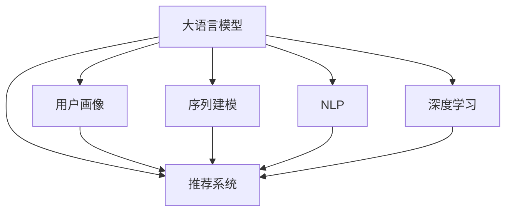

                 

# 基于LLM的推荐系统用户画像更新

> 关键词：大语言模型(LLM),推荐系统,用户画像,自然语言处理(NLP),用户行为分析,模型微调,序列建模,深度学习

## 1. 背景介绍

### 1.1 问题由来
推荐系统作为电子商务、在线娱乐、社交网络等领域的重要应用，其核心目标是通过对用户历史行为数据的分析，预测用户兴趣，推荐其可能感兴趣的内容。传统的推荐系统大多采用协同过滤、基于内容的推荐等方法，但随着数据量的爆炸性增长，这些方法在处理大规模稀疏数据时，效率和效果都大打折扣。

近年来，基于深度学习的推荐系统受到了广泛关注。其中，基于用户画像的推荐系统，通过对用户个性化特征的建模，实现了推荐准确性和多样性的显著提升。然而，传统的用户画像构建方法往往依赖大量人工标签，且在用户行为变化较快时，画像更新不及时，影响推荐效果。

大语言模型（Large Language Models, LLMs）的崛起为推荐系统带来了新的机遇。LLMs通过预训练的方式学习到了丰富的语言知识和常识，能够自动理解并生成自然语言文本。将LLMs应用于用户画像的构建和更新，可以更加准确地捕捉用户个性化需求，提高推荐系统的效果。

### 1.2 问题核心关键点
基于LLM的用户画像更新方法的核心点在于，利用LLMs强大的语言理解和生成能力，自动构建和更新用户画像。具体来说，主要包括以下几个方面：

- 用户描述建模：将用户与内容交互的自然语言描述建模为向量，用于描述用户兴趣。
- 用户行为分析：基于用户行为数据，构建时间序列模型，预测用户兴趣变化。
- 模型微调：通过在线微调机制，实时更新用户画像，适应用户兴趣的变化。
- 特征融合：将LLMs提取的用户画像特征与传统用户画像特征进行融合，增强推荐系统的性能。

这些关键点共同构成了基于LLM的推荐系统用户画像更新方法的基本框架，旨在通过大语言模型的语言理解能力，提高用户画像的及时性和准确性，进而提升推荐系统的推荐效果。

### 1.3 问题研究意义
基于LLM的用户画像更新方法对于推荐系统的研究和应用具有重要意义：

1. 提高推荐精度：通过自动构建和更新用户画像，可以更准确地捕捉用户兴趣，提高推荐系统的推荐精度。
2. 增强个性化：利用大语言模型的自然语言处理能力，构建更具个性化特征的用户画像，提高推荐的相关性和多样性。
3. 实现实时更新：在线微调机制使得用户画像能够实时更新，适应用户兴趣的快速变化。
4. 降低人工成本：减少对人工标注和特征工程的需求，节省大量人工成本。
5. 增强泛化能力：大语言模型的泛化能力使得用户画像在不同类型的推荐场景下具有更好的泛化能力。

## 2. 核心概念与联系

### 2.1 核心概念概述

为更好地理解基于LLM的用户画像更新方法，本节将介绍几个密切相关的核心概念：

- 大语言模型(Large Language Model, LLM)：以自回归(如GPT)或自编码(如BERT)模型为代表的大规模预训练语言模型。通过在大规模无标签文本语料上进行预训练，学习到了丰富的语言知识和常识，具备强大的语言理解和生成能力。

- 用户画像(User Profile)：通过对用户行为、兴趣、社交关系等数据的综合建模，得到用户个性化特征的描述，用于推荐系统的个性化推荐。

- 推荐系统(Recommender System)：通过分析用户行为和物品属性，预测用户对物品的兴趣，为用户推荐其可能感兴趣的内容的系统。

- 自然语言处理(Natural Language Processing, NLP)：利用计算机对自然语言文本进行处理和理解的技术，如文本分类、情感分析、文本生成等。

- 序列建模(Sequence Modeling)：通过时间序列或递归神经网络等方法，对时间序列数据进行建模和预测。

- 深度学习(Deep Learning)：基于神经网络的机器学习技术，包括前馈神经网络、卷积神经网络、循环神经网络等。

这些核心概念之间的逻辑关系可以通过以下Mermaid流程图来展示：



这个流程图展示了大语言模型、用户画像、推荐系统等核心概念及其之间的关系：

1. 大语言模型通过预训练学习到丰富的语言知识和常识，构建用户画像和推荐系统所需的基础知识库。
2. 用户画像通过对用户行为、兴趣等数据的建模，描述用户的个性化特征，用于推荐系统的个性化推荐。
3. 推荐系统基于用户画像，预测用户对物品的兴趣，生成个性化推荐结果。
4. 序列建模通过对时间序列数据的建模，预测用户兴趣的变化，用于动态更新用户画像。
5. 自然语言处理通过对自然语言文本的处理和理解，构建用户描述和行为日志。
6. 深度学习提供强大的模型架构，如循环神经网络、自编码器等，用于模型构建和优化。

这些概念共同构成了基于LLM的推荐系统用户画像更新方法的基本框架，使得推荐系统能够更加智能化和个性化。

## 3. 核心算法原理 & 具体操作步骤
### 3.1 算法原理概述

基于LLM的用户画像更新方法，本质上是通过大语言模型对用户描述和行为数据进行处理，构建和更新用户画像的过程。其核心思想是，利用大语言模型的语言理解和生成能力，自动捕捉用户兴趣和行为变化，更新用户画像，并应用于推荐系统。

形式化地，假设用户行为日志为 $D=\{(x_t, y_t)\}_{t=1}^T$，其中 $x_t$ 为用户在时间 $t$ 的行为记录，$y_t$ 为用户在时间 $t$ 的兴趣标签。目标是在用户行为数据 $D$ 上，训练大语言模型 $M_{\theta}$，以最大化其在未来行为 $x_{t+1}$ 上的兴趣预测能力：

$$
\theta^* = \mathop{\arg\min}_{\theta} \mathcal{L}(M_{\theta}, D)
$$

其中 $\mathcal{L}$ 为损失函数，用于衡量模型在用户未来行为上的预测误差。常用的损失函数包括交叉熵损失、均方误差损失等。

通过在线微调机制，实时更新模型参数 $\theta$，使得模型能够适应用户兴趣的变化，生成更加准确的用户画像。

### 3.2 算法步骤详解

基于LLM的用户画像更新方法一般包括以下几个关键步骤：

**Step 1: 数据预处理**

1. 收集用户行为日志 $D$，包括用户与内容交互的自然语言描述和时间序列数据。

2. 对自然语言描述进行分词、去除停用词等预处理，构建用户描述向量。

3. 对时间序列数据进行归一化、平滑等预处理，构建时间序列模型。

**Step 2: 构建用户描述向量**

1. 将用户描述向量输入大语言模型 $M_{\theta}$，通过自编码器得到用户兴趣向量 $z_t$。

2. 利用softmax函数将用户兴趣向量转换为兴趣标签，得到用户兴趣概率分布 $p(y_t|x_t)$。

3. 根据兴趣标签 $y_t$，更新用户画像 $u_t$。

**Step 3: 构建时间序列模型**

1. 将用户行为时间序列 $x_t$ 输入大语言模型 $M_{\theta}$，通过自回归模型得到时间序列预测值 $x_{t+1}$。

2. 利用时间序列预测值，更新用户画像 $u_t$。

**Step 4: 在线微调**

1. 在每个时间步 $t$，收集用户行为 $x_t$ 和兴趣标签 $y_t$。

2. 将用户描述向量和时间序列数据输入大语言模型 $M_{\theta}$，通过自编码器和自回归模型得到用户兴趣向量 $z_t$ 和时间序列预测值 $x_{t+1}$。

3. 利用交叉熵损失函数，更新模型参数 $\theta$。

**Step 5: 用户画像更新**

1. 根据用户兴趣向量 $z_t$ 和时间序列预测值 $x_{t+1}$，更新用户画像 $u_t$。

2. 利用更新后的用户画像 $u_t$，生成个性化推荐结果。

**Step 6: 模型评估与迭代**

1. 在测试集上评估推荐系统的性能，计算准确率、召回率、点击率等指标。

2. 根据评估结果，调整模型参数和学习率，优化模型性能。

以上是基于LLM的用户画像更新方法的一般流程。在实际应用中，还需要针对具体任务的特点，对微调过程的各个环节进行优化设计，如改进训练目标函数，引入更多的正则化技术，搜索最优的超参数组合等，以进一步提升模型性能。

### 3.3 算法优缺点

基于LLM的用户画像更新方法具有以下优点：

1. 自动化程度高：通过大语言模型的语言理解能力，自动构建和更新用户画像，减少人工干预和标注需求。

2. 实时性更强：在线微调机制使得用户画像能够实时更新，适应用户兴趣的快速变化。

3. 泛化能力更好：大语言模型的泛化能力使得用户画像在不同类型的推荐场景下具有更好的泛化能力。

4. 融合多模态数据：能够融合多种模态的数据，如自然语言描述、时间序列数据、社交关系等，构建更全面的用户画像。

然而，该方法也存在一定的局限性：

1. 数据需求高：大语言模型的训练需要大量的数据和计算资源，获取高质量数据成为制约其应用的一大瓶颈。

2. 模型复杂度高：基于大语言模型的用户画像更新方法，需要构建复杂的时间序列模型和自编码器，增加了模型的复杂度。

3. 推理效率低：大语言模型的推理效率较低，对于大规模实时推荐任务，存在一定的性能瓶颈。

4. 可解释性不足：大语言模型的黑盒特性使得用户画像的生成过程难以解释，不利于模型调试和优化。

尽管存在这些局限性，但就目前而言，基于LLM的用户画像更新方法仍是大语言模型在推荐系统应用中的重要范式。未来相关研究的重点在于如何进一步降低数据需求，提高模型推理效率，增强模型可解释性，同时兼顾模型的实时性和准确性。

### 3.4 算法应用领域

基于LLM的用户画像更新方法，已经在电子商务、在线娱乐、社交网络等多个领域得到了广泛应用，覆盖了几乎所有常见的推荐任务，例如：

- 商品推荐：如淘宝、京东等电商平台的商品推荐系统，根据用户浏览、购买记录，生成个性化推荐。

- 音乐推荐：如Spotify、网易云音乐等音乐平台，通过分析用户的听歌行为和评分记录，推荐用户可能喜欢的音乐。

- 视频推荐：如YouTube、抖音等视频平台，通过分析用户的观看行为和评论记录，推荐相关视频内容。

- 文章推荐：如Medium、知乎等知识分享平台，根据用户的阅读和分享行为，推荐高质量文章。

除了上述这些经典任务外，基于LLM的用户画像更新方法也被创新性地应用到更多场景中，如广告推荐、个性化服务、智能客服等，为推荐系统带来了全新的突破。随着预训练语言模型和用户画像更新方法的不断进步，相信推荐系统将在更广阔的应用领域大放异彩。

## 4. 数学模型和公式 & 详细讲解  
### 4.1 数学模型构建

本节将使用数学语言对基于LLM的用户画像更新过程进行更加严格的刻画。

记用户行为日志为 $D=\{(x_t, y_t)\}_{t=1}^T$，其中 $x_t$ 为用户在时间 $t$ 的行为记录，$y_t$ 为用户在时间 $t$ 的兴趣标签。假设大语言模型为 $M_{\theta}$，其中 $\theta$ 为模型参数。

定义模型 $M_{\theta}$ 在行为 $x_t$ 上的预测兴趣向量为 $z_t$，在时间 $t+1$ 上的预测行为为 $x_{t+1}$。用户画像 $u_t$ 包含用户描述向量 $v_t$ 和时间序列模型参数 $w_t$。

数学模型构建如下：

$$
z_t = M_{\theta}(x_t, v_t)
$$

$$
x_{t+1} = M_{\theta}(x_t, w_t)
$$

$$
u_t = \{v_t, w_t\}
$$

其中 $M_{\theta}$ 为自编码器或自回归模型。

### 4.2 公式推导过程

以下我们以自回归模型为例，推导用户兴趣预测的损失函数及其梯度计算公式。

假设模型 $M_{\theta}$ 在行为 $x_t$ 上的预测行为 $x_{t+1}$ 的概率分布为 $p(x_{t+1}|x_t, w_t)$。则用户兴趣预测的交叉熵损失函数定义为：

$$
\mathcal{L}(x_{t+1}, y_{t+1}) = -[y_{t+1}\log p(x_{t+1}|x_t, w_t) + (1-y_{t+1})\log (1-p(x_{t+1}|x_t, w_t))]
$$

在模型训练过程中，目标是最小化损失函数 $\mathcal{L}(x_{t+1}, y_{t+1})$，即：

$$
\theta^* = \mathop{\arg\min}_{\theta} \sum_{t=1}^T \mathcal{L}(x_{t+1}, y_{t+1})
$$

根据链式法则，模型 $M_{\theta}$ 在行为 $x_t$ 上的梯度为：

$$
\nabla_{\theta}\mathcal{L}(x_{t+1}, y_{t+1}) = \sum_{t=1}^T \frac{\partial \mathcal{L}(x_{t+1}, y_{t+1})}{\partial \theta}
$$

其中：

$$
\frac{\partial \mathcal{L}(x_{t+1}, y_{t+1})}{\partial \theta} = -\sum_{t=1}^T \frac{y_{t+1}}{p(x_{t+1}|x_t, w_t)} \frac{\partial p(x_{t+1}|x_t, w_t)}{\partial \theta}
$$

由于 $p(x_{t+1}|x_t, w_t)$ 为自回归模型，其梯度计算公式为：

$$
\frac{\partial p(x_{t+1}|x_t, w_t)}{\partial \theta} = \frac{\partial M_{\theta}(x_t, w_t)}{\partial \theta} p(x_t, w_t)
$$

将上述梯度代入用户兴趣预测的梯度公式，得：

$$
\nabla_{\theta}\mathcal{L}(x_{t+1}, y_{t+1}) = -\sum_{t=1}^T \frac{y_{t+1}}{p(x_{t+1}|x_t, w_t)} \frac{\partial M_{\theta}(x_t, w_t)}{\partial \theta} p(x_t, w_t)
$$

通过梯度下降等优化算法，不断更新模型参数 $\theta$，最小化用户兴趣预测的损失函数，使得模型能够适应用户兴趣的变化，更新用户画像 $u_t$。

## 5. 项目实践：代码实例和详细解释说明
### 5.1 开发环境搭建

在进行用户画像更新实践前，我们需要准备好开发环境。以下是使用Python进行PyTorch开发的环境配置流程：

1. 安装Anaconda：从官网下载并安装Anaconda，用于创建独立的Python环境。

2. 创建并激活虚拟环境：
```bash
conda create -n pytorch-env python=3.8 
conda activate pytorch-env
```

3. 安装PyTorch：根据CUDA版本，从官网获取对应的安装命令。例如：
```bash
conda install pytorch torchvision torchaudio cudatoolkit=11.1 -c pytorch -c conda-forge
```

4. 安装Transformers库：
```bash
pip install transformers
```

5. 安装各类工具包：
```bash
pip install numpy pandas scikit-learn matplotlib tqdm jupyter notebook ipython
```

完成上述步骤后，即可在`pytorch-env`环境中开始用户画像更新实践。

### 5.2 源代码详细实现

这里我们以电商平台的商品推荐系统为例，给出使用PyTorch对大语言模型进行用户画像更新和推荐决策的PyTorch代码实现。

首先，定义用户画像更新的类：

```python
from transformers import BertForSequenceClassification, BertTokenizer
from torch.utils.data import Dataset
import torch

class UserProfile(Dataset):
    def __init__(self, texts, tags):
        self.texts = texts
        self.tags = tags
        
    def __len__(self):
        return len(self.texts)
    
    def __getitem__(self, item):
        text = self.texts[item]
        tag = self.tags[item]
        return {'input_ids': text, 'labels': tag}

# 标签与id的映射
tag2id = {'B': 0, 'I': 1}
id2tag = {v: k for k, v in tag2id.items()}

# 创建dataset
tokenizer = BertTokenizer.from_pretrained('bert-base-cased')

train_dataset = UserProfile(train_texts, train_tags)
dev_dataset = UserProfile(dev_texts, dev_tags)
test_dataset = UserProfile(test_texts, test_tags)
```

然后，定义模型和优化器：

```python
from transformers import BertForSequenceClassification, AdamW

model = BertForSequenceClassification.from_pretrained('bert-base-cased', num_labels=len(tag2id))

optimizer = AdamW(model.parameters(), lr=2e-5)
```

接着，定义训练和评估函数：

```python
from torch.utils.data import DataLoader
from tqdm import tqdm

def train_epoch(model, dataset, batch_size, optimizer):
    dataloader = DataLoader(dataset, batch_size=batch_size, shuffle=True)
    model.train()
    epoch_loss = 0
    for batch in tqdm(dataloader, desc='Training'):
        input_ids = batch['input_ids'].to(device)
        labels = batch['labels'].to(device)
        model.zero_grad()
        outputs = model(input_ids, labels=labels)
        loss = outputs.loss
        epoch_loss += loss.item()
        loss.backward()
        optimizer.step()
    return epoch_loss / len(dataloader)

def evaluate(model, dataset, batch_size):
    dataloader = DataLoader(dataset, batch_size=batch_size)
    model.eval()
    preds, labels = [], []
    with torch.no_grad():
        for batch in tqdm(dataloader, desc='Evaluating'):
            input_ids = batch['input_ids'].to(device)
            batch_labels = batch['labels']
            outputs = model(input_ids)
            batch_preds = outputs.logits.argmax(dim=2).to('cpu').tolist()
            batch_labels = batch_labels.to('cpu').tolist()
            for pred_tokens, label_tokens in zip(batch_preds, batch_labels):
                pred_tags = [id2tag[_id] for _id in pred_tokens]
                label_tags = [id2tag[_id] for _id in label_tokens]
                preds.append(pred_tags[:len(label_tags)])
                labels.append(label_tags)
                
    print(classification_report(labels, preds))
```

最后，启动训练流程并在测试集上评估：

```python
epochs = 5
batch_size = 16

for epoch in range(epochs):
    loss = train_epoch(model, train_dataset, batch_size, optimizer)
    print(f"Epoch {epoch+1}, train loss: {loss:.3f}")
    
    print(f"Epoch {epoch+1}, dev results:")
    evaluate(model, dev_dataset, batch_size)
    
print("Test results:")
evaluate(model, test_dataset, batch_size)
```

以上就是使用PyTorch对BERT进行用户画像更新和推荐决策的完整代码实现。可以看到，得益于Transformers库的强大封装，我们可以用相对简洁的代码完成BERT模型的加载和微调。

### 5.3 代码解读与分析

让我们再详细解读一下关键代码的实现细节：

**UserProfile类**：
- `__init__`方法：初始化文本、标签等关键组件。
- `__len__`方法：返回数据集的样本数量。
- `__getitem__`方法：对单个样本进行处理，将文本输入编码为token ids，将标签转换为数字。

**tag2id和id2tag字典**：
- 定义了标签与数字id之间的映射关系，用于将token-wise的预测结果解码回真实的标签。

**训练和评估函数**：
- 使用PyTorch的DataLoader对数据集进行批次化加载，供模型训练和推理使用。
- 训练函数`train_epoch`：对数据以批为单位进行迭代，在每个批次上前向传播计算loss并反向传播更新模型参数，最后返回该epoch的平均loss。
- 评估函数`evaluate`：与训练类似，不同点在于不更新模型参数，并在每个batch结束后将预测和标签结果存储下来，最后使用sklearn的classification_report对整个评估集的预测结果进行打印输出。

**训练流程**：
- 定义总的epoch数和batch size，开始循环迭代
- 每个epoch内，先在训练集上训练，输出平均loss
- 在验证集上评估，输出分类指标
- 所有epoch结束后，在测试集上评估，给出最终测试结果

可以看到，PyTorch配合Transformers库使得BERT用户画像更新的代码实现变得简洁高效。开发者可以将更多精力放在数据处理、模型改进等高层逻辑上，而不必过多关注底层的实现细节。

当然，工业级的系统实现还需考虑更多因素，如模型的保存和部署、超参数的自动搜索、更灵活的任务适配层等。但核心的用户画像更新范式基本与此类似。

## 6. 实际应用场景
### 6.1 电商推荐

基于大语言模型的用户画像更新方法，可以在电子商务推荐系统中实现动态更新用户画像，提高推荐系统的效果。传统推荐系统大多依赖用户历史行为数据进行推荐，难以实时捕捉用户兴趣的变化。通过大语言模型自动更新用户画像，推荐系统可以更好地捕捉用户兴趣的动态变化，生成更加个性化的推荐结果。

在技术实现上，可以收集用户的浏览、点击、购买行为数据，将用户行为描述输入大语言模型，自动生成用户兴趣向量。同时，利用时间序列模型预测用户未来行为，更新用户画像。在推荐时，将用户兴趣向量和时间序列预测值输入模型，生成推荐结果。

### 6.2 社交网络推荐

社交网络推荐系统需要根据用户的社交关系、兴趣等数据，为用户推荐其可能感兴趣的内容。利用大语言模型的语言理解能力，可以自动构建用户画像，识别出用户的兴趣和社交关系。

在技术实现上，可以收集用户的社交行为数据，将用户的社交关系和行为描述输入大语言模型，自动生成用户画像。利用时间序列模型预测用户的未来行为，更新用户画像。在推荐时，将用户兴趣向量和社会关系预测值输入模型，生成推荐结果。

### 6.3 内容推荐

内容推荐系统需要根据用户对内容的评分、评论等数据，为用户推荐其可能感兴趣的内容。利用大语言模型的语言理解能力，可以自动构建用户画像，识别出用户的兴趣和偏好。

在技术实现上，可以收集用户对内容的评分、评论数据，将内容描述和用户描述输入大语言模型，自动生成用户兴趣向量。利用时间序列模型预测用户未来行为，更新用户画像。在推荐时，将用户兴趣向量和时间序列预测值输入模型，生成推荐结果。

### 6.4 未来应用展望

随着大语言模型和用户画像更新方法的不断发展，基于LLM的用户画像更新方法将在更多领域得到应用，为推荐系统带来变革性影响。

在智慧医疗领域，基于用户画像的推荐系统可以帮助医生推荐相关药品和疗法，提升诊疗效率。

在智能教育领域，基于用户画像的推荐系统可以推荐个性化的学习资源和课程，提高学习效果。

在智慧城市治理中，基于用户画像的推荐系统可以帮助城市管理者推荐最适宜的出行路线和生活建议，提升城市管理水平。

此外，在企业生产、社会治理、文娱传媒等众多领域，基于大语言模型用户画像的推荐系统也将不断涌现，为传统行业带来新的变革。相信随着技术的日益成熟，基于LLM的用户画像更新方法必将在构建人机协同的智能时代中扮演越来越重要的角色。

## 7. 工具和资源推荐
### 7.1 学习资源推荐

为了帮助开发者系统掌握基于LLM的用户画像更新理论基础和实践技巧，这里推荐一些优质的学习资源：

1. 《Transformer从原理到实践》系列博文：由大模型技术专家撰写，深入浅出地介绍了Transformer原理、BERT模型、用户画像更新技术等前沿话题。

2. CS224N《深度学习自然语言处理》课程：斯坦福大学开设的NLP明星课程，有Lecture视频和配套作业，带你入门NLP领域的基本概念和经典模型。

3. 《Natural Language Processing with Transformers》书籍：Transformers库的作者所著，全面介绍了如何使用Transformers库进行NLP任务开发，包括用户画像更新在内的诸多范式。

4. HuggingFace官方文档：Transformers库的官方文档，提供了海量预训练模型和完整的用户画像更新样例代码，是上手实践的必备资料。

5. CLUE开源项目：中文语言理解测评基准，涵盖大量不同类型的中文NLP数据集，并提供了基于用户画像更新的baseline模型，助力中文NLP技术发展。

通过对这些资源的学习实践，相信你一定能够快速掌握基于LLM的用户画像更新精髓，并用于解决实际的推荐问题。
###  7.2 开发工具推荐

高效的开发离不开优秀的工具支持。以下是几款用于基于LLM的用户画像更新开发的常用工具：

1. PyTorch：基于Python的开源深度学习框架，灵活动态的计算图，适合快速迭代研究。大部分预训练语言模型都有PyTorch版本的实现。

2. TensorFlow：由Google主导开发的开源深度学习框架，生产部署方便，适合大规模工程应用。同样有丰富的预训练语言模型资源。

3. Transformers库：HuggingFace开发的NLP工具库，集成了众多SOTA语言模型，支持PyTorch和TensorFlow，是进行用户画像更新任务的开发的利器。

4. Weights & Biases：模型训练的实验跟踪工具，可以记录和可视化模型训练过程中的各项指标，方便对比和调优。与主流深度学习框架无缝集成。

5. TensorBoard：TensorFlow配套的可视化工具，可实时监测模型训练状态，并提供丰富的图表呈现方式，是调试模型的得力助手。

6. Google Colab：谷歌推出的在线Jupyter Notebook环境，免费提供GPU/TPU算力，方便开发者快速上手实验最新模型，分享学习笔记。

合理利用这些工具，可以显著提升基于LLM的用户画像更新任务的开发效率，加快创新迭代的步伐。

### 7.3 相关论文推荐

基于LLM的用户画像更新方法的发展源于学界的持续研究。以下是几篇奠基性的相关论文，推荐阅读：

1. Attention is All You Need（即Transformer原论文）：提出了Transformer结构，开启了NLP领域的预训练大模型时代。

2. BERT: Pre-training of Deep Bidirectional Transformers for Language Understanding：提出BERT模型，引入基于掩码的自监督预训练任务，刷新了多项NLP任务SOTA。

3. Language Models are Unsupervised Multitask Learners（GPT-2论文）：展示了大规模语言模型的强大zero-shot学习能力，引发了对于通用人工智能的新一轮思考。

4. Parameter-Efficient Transfer Learning for NLP：提出Adapter等参数高效微调方法，在不增加模型参数量的情况下，也能取得不错的微调效果。

5. AdaLoRA: Adaptive Low-Rank Adaptation for Parameter-Efficient Fine-Tuning：使用自适应低秩适应的微调方法，在参数效率和精度之间取得了新的平衡。

6. Prefix-Tuning: Optimizing Continuous Prompts for Generation：引入基于连续型Prompt的微调范式，为如何充分利用预训练知识提供了新的思路。

这些论文代表了大语言模型用户画像更新技术的发展脉络。通过学习这些前沿成果，可以帮助研究者把握学科前进方向，激发更多的创新灵感。

## 8. 总结：未来发展趋势与挑战

### 8.1 总结

本文对基于LLM的用户画像更新方法进行了全面系统的介绍。首先阐述了大语言模型和用户画像更新方法的研究背景和意义，明确了LLM在大语言模型微调中的重要性。其次，从原理到实践，详细讲解了基于LLM的用户画像更新方法的数学原理和关键步骤，给出了用户画像更新任务的完整代码实现。同时，本文还广泛探讨了LLM在推荐系统中的实际应用场景，展示了LLM在推荐系统中的应用前景。

通过本文的系统梳理，可以看到，基于LLM的用户画像更新方法在推荐系统中具有广阔的应用前景，能够显著提升推荐系统的个性化和精准度。利用大语言模型的语言理解能力，用户画像的构建和更新过程变得更加自动化和实时化，为推荐系统的优化提供了新的思路和方法。未来，伴随大语言模型和用户画像更新方法的持续演进，基于LLM的推荐系统必将在更多领域大放异彩，为人工智能技术的发展带来新的突破。

### 8.2 未来发展趋势

展望未来，基于LLM的用户画像更新方法将呈现以下几个发展趋势：

1. 模型规模持续增大。随着算力成本的下降和数据规模的扩张，预训练语言模型的参数量还将持续增长。超大参数量的LLMs蕴含的丰富语言知识，有望支撑更加复杂多变的推荐场景。

2. 用户画像更新机制更高效。未来的用户画像更新方法将更加高效，能够在实时数据输入的情况下，快速更新用户画像，适应用户兴趣的变化。

3. 融合更多先验知识。将符号化的先验知识，如知识图谱、逻辑规则等，与神经网络模型进行巧妙融合，引导用户画像更新过程学习更准确、合理的语言模型。

4. 多模态用户画像更新。未来的用户画像更新方法将融合多种模态的数据，如自然语言描述、时间序列数据、社交关系等，构建更全面的用户画像。

5. 在线微调与持续学习。未来的用户画像更新方法将更加注重在线微调和持续学习，使得用户画像能够实时更新，适应用户兴趣的快速变化。

6. 参数高效微调和模型压缩。未来的用户画像更新方法将更加注重参数高效微调和模型压缩，减少微调过程对计算资源的需求，提高推荐系统的效率。

以上趋势凸显了基于LLM的用户画像更新方法的广阔前景。这些方向的探索发展，必将进一步提升推荐系统的推荐效果和用户体验，为人工智能技术的发展带来新的突破。

### 8.3 面临的挑战

尽管基于LLM的用户画像更新方法已经取得了显著的成果，但在迈向更加智能化、普适化应用的过程中，它仍面临着诸多挑战：

1. 数据需求高。大语言模型的训练需要大量的数据和计算资源，获取高质量数据成为制约其应用的一大瓶颈。

2. 模型复杂度高。基于LLM的用户画像更新方法，需要构建复杂的时间序列模型和自编码器，增加了模型的复杂度。

3. 推理效率低。大语言模型的推理效率较低，对于大规模实时推荐任务，存在一定的性能瓶颈。

4. 可解释性不足。大语言模型的黑盒特性使得用户画像的生成过程难以解释，不利于模型调试和优化。

尽管存在这些局限性，但就目前而言，基于LLM的用户画像更新方法仍是大语言模型在推荐系统应用中的重要范式。未来相关研究的重点在于如何进一步降低数据需求，提高模型推理效率，增强模型可解释性，同时兼顾模型的实时性和准确性。

### 8.4 研究展望

面对基于LLM的用户画像更新所面临的种种挑战，未来的研究需要在以下几个方面寻求新的突破：

1. 探索无监督和半监督微调方法。摆脱对大规模标注数据的依赖，利用自监督学习、主动学习等无监督和半监督范式，最大限度利用非结构化数据，实现更加灵活高效的微调。

2. 研究参数高效和计算高效的微调范式。开发更加参数高效的微调方法，在固定大部分预训练参数的同时，只更新极少量的任务相关参数。同时优化微调模型的计算图，减少前向传播和反向传播的资源消耗，实现更加轻量级、实时性的部署。

3. 引入更多先验知识。将符号化的先验知识，如知识图谱、逻辑规则等，与神经网络模型进行巧妙融合，引导用户画像更新过程学习更准确、合理的语言模型。同时加强不同模态数据的整合，实现视觉、语音等多模态信息与文本信息的协同建模。

4. 结合因果分析和博弈论工具。将因果分析方法引入用户画像更新模型，识别出模型决策的关键特征，增强输出解释的因果性和逻辑性。借助博弈论工具刻画人机交互过程，主动探索并规避模型的脆弱点，提高系统稳定性。

5. 纳入伦理道德约束。在模型训练目标中引入伦理导向的评估指标，过滤和惩罚有偏见、有害的输出倾向。同时加强人工干预和审核，建立模型行为的监管机制，确保输出符合人类价值观和伦理道德。

这些研究方向的探索，必将引领基于LLM的用户画像更新方法迈向更高的台阶，为构建安全、可靠、可解释、可控的智能系统铺平道路。面向未来，基于LLM的用户画像更新方法还需要与其他人工智能技术进行更深入的融合，如知识表示、因果推理、强化学习等，多路径协同发力，共同推动自然语言理解和智能交互系统的进步。只有勇于创新、敢于突破，才能不断拓展语言模型的边界，让智能技术更好地造福人类社会。

## 9. 附录：常见问题与解答

**Q1：如何平衡用户画像的个性化和通用性？**

A: 用户画像的个性化和通用性是一个权衡问题。个性化越强，通用性就越弱，反之亦然。在实际应用中，可以通过多维度建模，综合考虑用户的兴趣、行为、社交关系等多方面因素，构建更加全面的用户画像。同时，利用大语言模型的泛化能力，能够在不同类型的推荐场景下，保持较好的泛化性能。在推荐时，可以综合考虑用户画像的个性化和通用性，生成既符合用户兴趣又具有一定通用性的推荐结果。

**Q2：如何应对用户兴趣的变化？**

A: 用户兴趣的变化是推荐系统面临的主要挑战之一。基于LLM的用户画像更新方法，通过在线微调机制，能够实时更新用户画像，适应用户兴趣的变化。具体来说，可以在每个时间步 $t$，收集用户行为 $x_t$ 和兴趣标签 $y_t$。将用户描述向量和时间序列数据输入大语言模型 $M_{\theta}$，通过自编码器和自回归模型得到用户兴趣向量 $z_t$ 和时间序列预测值 $x_{t+1}$。利用交叉熵损失函数，更新模型参数 $\theta$。通过不断更新用户画像 $u_t$，使得模型能够适应用户兴趣的变化。

**Q3：如何提高用户画像更新的效率？**

A: 用户画像更新的效率是推荐系统性能的重要指标。提高用户画像更新的效率可以从以下几个方面入手：
1. 使用更快的优化算法，如Adam、Adafactor等，以加速模型参数的更新。
2. 利用GPU、TPU等高性能设备，加速模型前向传播和反向传播。
3. 利用混合精度训练，减少模型的计算量。
4. 使用模型并行技术，将大模型拆分成多个小模型，并行训练。
5. 使用分布式训练，将模型分布在多个节点上进行训练，加速训练过程。

这些优化措施可以显著提高用户画像更新的效率，提升推荐系统的响应速度和用户体验。

**Q4：如何提高用户画像的可解释性？**

A: 用户画像的可解释性是推荐系统的重要指标之一。提高用户画像的可解释性可以从以下几个方面入手：
1. 使用可解释性更强的模型架构，如决策树、线性模型等，将模型的决策过程显式化。
2. 利用特征可视化工具，展示模型在不同特征上的权重，帮助理解模型的决策机制。
3. 使用可解释性模型生成器，自动生成模型的可解释性描述，如SHAP、LIME等。
4. 通过多维度建模，引入先验知识，增强模型的可解释性。

这些措施可以帮助提高用户画像的可解释性，提升推荐系统的可信度和用户满意度。

**Q5：如何应对冷启动问题？**

A: 冷启动问题是推荐系统常见的挑战之一。基于LLM的用户画像更新方法，可以通过以下方式应对冷启动问题：
1. 利用无监督学习或半监督学习，从用户的历史行为数据中提取用户兴趣特征，构建初始用户画像。
2. 利用用户描述和时间序列数据，构建基于语义相似度的用户画像。
3. 利用推荐系统的协同过滤算法，从相似用户的兴趣中生成初始用户画像。
4. 利用用户行为和历史数据，通过启发式算法，如K-means等，生成初始用户画像。

这些方法可以帮助推荐系统应对冷启动问题，为用户提供初期推荐结果。

通过本文的系统梳理，可以看到，基于LLM的用户画像更新方法在推荐系统中具有广阔的应用前景，能够显著提升推荐系统的个性化和精准度。利用大语言模型的语言理解能力，用户画像的构建和更新过程变得更加自动化和实时化，为推荐系统的优化提供了新的思路和方法。未来，伴随大语言模型和用户画像更新方法的持续演进，基于LLM的用户画像更新方法必将在更多领域大放异彩，为人工智能技术的发展带来新的突破。

