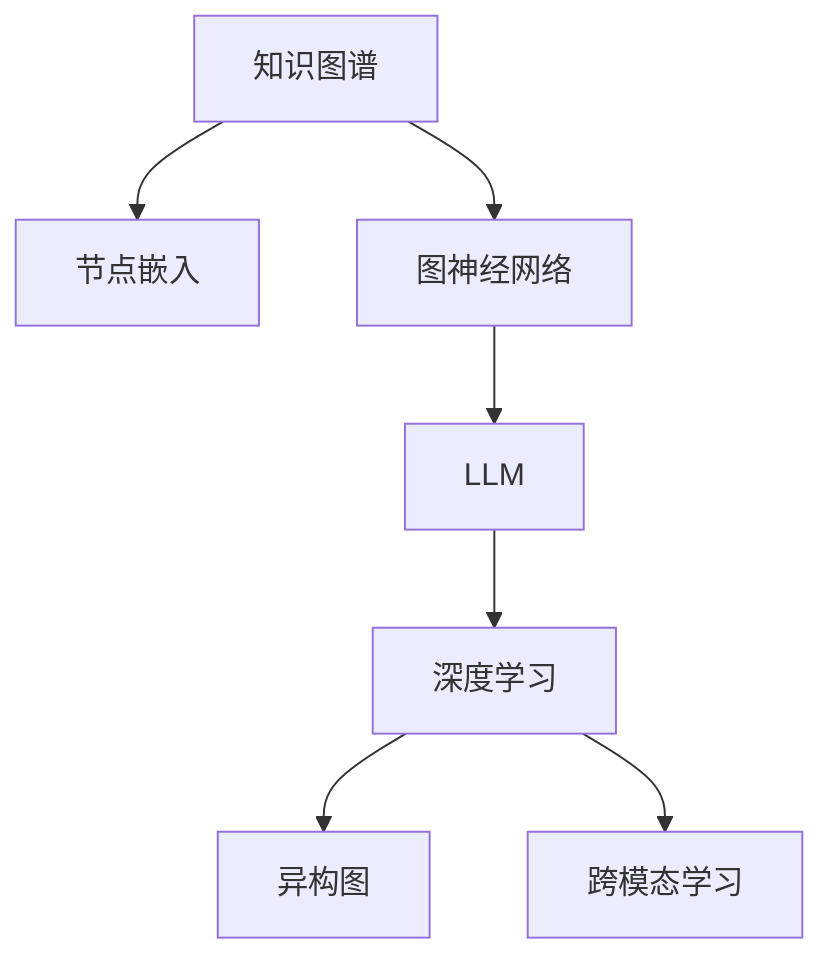

                 

# 基于LLM的推荐系统知识图谱构建

> 关键词：知识图谱,LLM(大语言模型),推荐系统,图神经网络(GNN),节点嵌入,深度学习,异构图,跨模态学习

## 1. 背景介绍

在数字化时代，用户生成的大量数据成为了推荐系统的金矿。无论是电商网站、视频平台还是社交媒体，推荐系统都扮演着至关重要的角色，通过理解用户偏好，为用户推荐个性化内容，提升用户满意度和粘性。然而，传统推荐系统通常基于用户行为数据进行建模，难以捕捉用户兴趣背后的语义信息。近年来，知识图谱(Knowledge Graph)和大语言模型(LLM)的结合，为推荐系统开辟了新的道路，能够更全面、准确地理解和表达用户需求，实现深度协同推荐。

### 1.1 问题由来

推荐系统最初是基于协同过滤和矩阵分解等方法进行建模的。这些方法往往需要用户行为数据进行训练，而真实场景下往往数据稀疏、冷启动问题严重，难以直接应用。后来，基于内容的推荐方法开始流行，通过将物品属性和用户特征进行匹配，间接推断用户的兴趣，但同样缺乏对用户兴趣语义的理解。

随着深度学习技术的兴起，深度神经网络(DNN)逐渐成为推荐系统的主流。DNN通过构建高维特征向量，能够更好地捕捉复杂的多维关联，但依然存在数据稀疏、特征复杂、模型过拟合等问题。而知识图谱的引入，结合大语言模型，极大地提升了推荐系统的表达能力和协同推荐的效果。

知识图谱由节点和边组成，节点代表实体，边代表实体之间的关系。图神经网络(GNN)作为专门的图数据处理方法，能够有效处理复杂网络结构，挖掘节点之间的关系特征，为推荐系统提供更为精确的特征表示。结合大语言模型，知识图谱可以有效利用自然语言信息，提升推荐系统的语义理解和协同推荐能力。

## 2. 核心概念与联系

### 2.1 核心概念概述

为更好地理解基于LLM的推荐系统知识图谱构建方法，本节将介绍几个密切相关的核心概念：

- **知识图谱**：由实体、属性、关系构成的图结构数据，用于描述和刻画现实世界实体之间的关系。常见的知识图谱包括Freebase、DBpedia、YAGO等。

- **大语言模型(LLM)**：基于Transformer等架构的预训练语言模型，如BERT、GPT-3等，通过大规模语料预训练，学习到丰富的语言知识和常识。

- **图神经网络(GNN)**：专门处理图数据结构的深度学习模型，能够有效地捕捉节点之间的关系特征。常见的GNN包括GCN、GAT、GraphSAGE等。

- **节点嵌入**：将知识图谱中的节点表示为向量，捕捉节点间的语义关系。常见的节点嵌入方法包括TransE、ComplEx等。

- **深度学习**：通过神经网络结构，自动学习数据特征的表示。推荐系统中的深度学习模型包括DNN、CNN、RNN、Transformer等。

- **异构图**：知识图谱中存在多种类型的节点和关系，如实体、属性、事件、活动等，适合使用异构图进行处理。

- **跨模态学习**：将不同模态数据（如图谱、文本、音频等）融合，提升推荐系统的表达能力和性能。

这些核心概念之间的逻辑关系可以通过以下Mermaid流程图来展示：



这个流程图展示了大语言模型与知识图谱构建之间的核心联系：

1. 知识图谱作为LLM的输入数据，通过节点嵌入方法转化为向量表示。
2. 图神经网络对知识图谱进行处理，捕捉节点之间的关系特征。
3. LLM对节点嵌入的向量进行语义理解，提升知识图谱的表达能力。
4. 深度学习模型融合了知识图谱和LLM的输出，进行复杂的推荐建模。
5. 异构图和跨模态学习进一步扩展了知识图谱的应用场景，提升了推荐系统的灵活性。

## 3. 核心算法原理 & 具体操作步骤
### 3.1 算法原理概述

基于LLM的推荐系统知识图谱构建，本质上是一个图数据的深度学习和语义理解过程。其核心思想是：将知识图谱中的实体和关系进行向量嵌入，通过大语言模型进行语义理解和融合，最终形成对用户的协同推荐。

形式化地，假设知识图谱 $G=(N,E)$，其中 $N$ 为节点集合，$E$ 为边集合。对于每个节点 $n \in N$，定义其节点嵌入向量 $\mathbf{e}_n$。给定用户 $u$ 的兴趣 $x$，推荐系统目标为找到与 $u$ 兴趣最为接近的节点 $n$，推荐其对应的物品。

具体步骤如下：

1. 将知识图谱中的节点和关系进行嵌入，得到节点嵌入向量 $\mathbf{e}_n$。
2. 将用户兴趣 $x$ 通过大语言模型得到向量表示 $\mathbf{e}_u$。
3. 通过图神经网络对知识图谱进行处理，得到节点 $n$ 的表示 $\mathbf{h}_n$。
4. 将 $\mathbf{e}_n$ 和 $\mathbf{h}_n$ 进行语义融合，得到节点 $n$ 的综合表示 $\mathbf{v}_n$。
5. 通过深度学习模型对 $\mathbf{e}_u$ 和 $\mathbf{v}_n$ 进行相似度计算，预测 $u$ 和 $n$ 的相关性。
6. 根据相关性排序，推荐与 $u$ 兴趣最为接近的物品 $n$。

### 3.2 算法步骤详解

基于LLM的推荐系统知识图谱构建一般包括以下几个关键步骤：

**Step 1: 知识图谱构建**

- 收集与推荐系统相关的领域数据，构建知识图谱，包括实体、属性和关系。
- 使用节点嵌入方法将知识图谱中的节点和关系转换为向量表示。

**Step 2: 大语言模型预训练**

- 选择合适的预训练语言模型，如BERT、GPT-3等，通过大规模语料进行预训练。
- 将用户兴趣 $x$ 作为输入，使用预训练模型得到向量表示 $\mathbf{e}_u$。

**Step 3: 图神经网络嵌入**

- 将知识图谱输入图神经网络模型，捕捉节点之间的关系特征。
- 输出节点 $n$ 的表示向量 $\mathbf{h}_n$。

**Step 4: 节点嵌入语义融合**

- 将用户兴趣 $x$ 的向量表示 $\mathbf{e}_u$ 与节点 $n$ 的表示向量 $\mathbf{h}_n$ 进行语义融合，得到综合向量表示 $\mathbf{v}_n$。

**Step 5: 推荐建模与预测**

- 使用深度学习模型对 $\mathbf{e}_u$ 和 $\mathbf{v}_n$ 进行相似度计算，预测相关性得分。
- 根据得分对物品进行排序，推荐与用户兴趣最为接近的物品。

### 3.3 算法优缺点

基于LLM的推荐系统知识图谱构建方法具有以下优点：

1. **语义丰富**：结合大语言模型，知识图谱中的节点和关系能够得到更丰富的语义表示，提升推荐系统的表达能力。
2. **跨模态融合**：能够处理多种模态数据，如文本、图像、音频等，提升推荐系统的灵活性和多样性。
3. **协同推荐**：通过语义融合和深度学习，实现知识图谱中节点的协同推荐，提高推荐效果。
4. **可扩展性强**：知识图谱和LLM能够随着数据和模型的不断扩展而提升性能。

同时，该方法也存在一些局限性：

1. **数据需求高**：知识图谱的构建需要大量的领域数据，而用户兴趣数据的采集和标注成本也较高。
2. **模型复杂度**：结合知识图谱和LLM的模型较为复杂，训练和推理效率较低。
3. **鲁棒性不足**：对数据噪声和异常情况的处理较为困难，容易出现过拟合或泛化性差的问题。

尽管存在这些局限性，但就目前而言，基于LLM的推荐系统知识图谱构建方法仍是大数据、高性能计算条件下，推荐系统的一个重要方向。未来相关研究的重点在于如何进一步降低数据和计算成本，提高模型的鲁棒性和可解释性。

### 3.4 算法应用领域

基于LLM的推荐系统知识图谱构建方法在多个领域得到了应用，例如：

- **电商推荐**：结合用户行为数据和商品信息，通过知识图谱进行协同推荐，提升推荐效果。
- **新闻推荐**：将新闻文章、事件、人物等知识图谱节点与用户兴趣进行融合，提供个性化的新闻内容。
- **音乐推荐**：将音乐、歌手、专辑等知识图谱节点与用户兴趣进行融合，推荐与用户喜好相符的音乐作品。
- **电影推荐**：将电影、演员、导演等知识图谱节点与用户兴趣进行融合，推荐与用户偏好相符的电影作品。
- **健康推荐**：结合医生、药物、病历等知识图谱节点，提供个性化的健康建议和治疗方案。
- **旅游推荐**：将景点、活动、酒店等知识图谱节点与用户兴趣进行融合，推荐旅游目的地和行程规划。

除了上述这些经典应用外，基于LLM的推荐系统知识图谱构建方法还被创新性地应用到更多场景中，如智能客服、智能家居、智能医疗等，为推荐系统带来了全新的突破。随着知识图谱和LLM技术的不断进步，相信推荐系统必将在更广阔的应用领域大放异彩。

## 4. 数学模型和公式 & 详细讲解  
### 4.1 数学模型构建

本节将使用数学语言对基于LLM的推荐系统知识图谱构建过程进行更加严格的刻画。

记知识图谱中的节点嵌入方法为 $\mathbf{e}_n = f_n(\mathbf{h}_n)$，其中 $\mathbf{h}_n$ 为节点 $n$ 的图神经网络嵌入向量。设用户兴趣 $x$ 的向量表示为 $\mathbf{e}_u$，模型输出为节点 $n$ 的相关性得分 $s_{n,u}$。则推荐系统的目标函数为：

$$
\max_{\theta} \sum_{n \in N} s_{n,u} \mathbb{1}(n \in N_u)
$$

其中 $N_u$ 为用户兴趣 $x$ 对应的物品节点集合，$\mathbb{1}(\cdot)$ 为示性函数，表示节点 $n$ 是否属于 $N_u$。

通过优化上述目标函数，可以使得推荐系统最大化用户对推荐的满意度。

### 4.2 公式推导过程

假设知识图谱中的节点 $n$ 与其邻居节点 $m$ 之间的关系为 $e_{m,n} \in [0,1]$，表示 $m$ 对 $n$ 的推荐权重。节点嵌入方法 $\mathbf{h}_n$ 可以使用图神经网络进行计算，如GCN、GAT等。假设节点 $n$ 的向量表示 $\mathbf{h}_n$ 包含 $k$ 个特征，形式为 $\mathbf{h}_n = [h_{n,1}, h_{n,2}, \ldots, h_{n,k}]$。

节点嵌入方法 $\mathbf{e}_n = f_n(\mathbf{h}_n)$ 可以采用节点嵌入方法，如TransE、ComplEx等。假设节点嵌入方法输出 $\mathbf{e}_n$ 包含 $d$ 个维度，形式为 $\mathbf{e}_n = [e_{n,1}, e_{n,2}, \ldots, e_{n,d}]$。

用户兴趣 $x$ 的向量表示 $\mathbf{e}_u$ 可以采用大语言模型进行计算，如BERT、GPT-3等。假设 $\mathbf{e}_u$ 包含 $d'$ 个维度，形式为 $\mathbf{e}_u = [e_{u,1}, e_{u,2}, \ldots, e_{u,d'}]$。

节点 $n$ 的表示向量 $\mathbf{h}_n$ 可以通过图神经网络进行处理，得到 $\mathbf{h}_n$ 的 $k'$ 个特征，形式为 $\mathbf{h}_n = [h_{n,1}, h_{n,2}, \ldots, h_{n,k'}]$。

节点嵌入语义融合可以采用加权平均、拼接、注意力机制等方法。假设节点嵌入语义融合方法得到 $\mathbf{v}_n$ 包含 $d$ 个维度，形式为 $\mathbf{v}_n = [v_{n,1}, v_{n,2}, \ldots, v_{n,d}]$。

推荐建模与预测可以使用深度学习模型，如DNN、CNN、RNN、Transformer等。假设推荐模型输出节点 $n$ 的相关性得分 $s_{n,u}$，形式为 $s_{n,u} = f_{\theta}(\mathbf{e}_u, \mathbf{v}_n)$。

通过上述公式，可以完整地表达基于LLM的推荐系统知识图谱构建过程。在实际应用中，还需要根据具体任务进行优化设计，如选择合适的节点嵌入方法、图神经网络模型、深度学习模型等。

### 4.3 案例分析与讲解

下面以电影推荐系统为例，给出基于LLM的推荐系统知识图谱构建的详细案例分析。

#### 4.3.1 数据构建

- **知识图谱**：从电影数据库中收集电影、演员、导演等节点，以及电影类型、评级等属性，构建知识图谱 $G=(N,E)$。
- **节点嵌入**：使用TransE等方法将知识图谱中的节点和关系进行向量嵌入，得到节点嵌入向量 $\mathbf{e}_n$。

#### 4.3.2 大语言模型预训练

- **预训练模型**：选择合适的预训练语言模型，如BERT、GPT-3等，通过大规模语料进行预训练。
- **用户兴趣表示**：将用户观影记录和评分信息作为输入，使用预训练模型得到用户兴趣向量 $\mathbf{e}_u$。

#### 4.3.3 图神经网络嵌入

- **图神经网络**：将知识图谱输入图神经网络模型，捕捉节点之间的关系特征。假设使用GAT模型，得到节点 $n$ 的表示向量 $\mathbf{h}_n$。

#### 4.3.4 节点嵌入语义融合

- **语义融合方法**：将用户兴趣向量 $\mathbf{e}_u$ 与节点 $n$ 的表示向量 $\mathbf{h}_n$ 进行加权平均，得到节点 $n$ 的综合向量表示 $\mathbf{v}_n$。

#### 4.3.5 推荐建模与预测

- **推荐模型**：使用Transformer模型进行推荐建模，得到节点 $n$ 的相关性得分 $s_{n,u}$。
- **推荐排序**：根据相关性得分对物品进行排序，推荐与用户兴趣最为接近的电影。

通过上述步骤，可以实现基于LLM的推荐系统知识图谱构建。

## 5. 项目实践：代码实例和详细解释说明
### 5.1 开发环境搭建

在进行知识图谱构建和推荐系统开发前，我们需要准备好开发环境。以下是使用Python进行PyTorch开发的环境配置流程：

1. 安装Anaconda：从官网下载并安装Anaconda，用于创建独立的Python环境。

2. 创建并激活虚拟环境：
```bash
conda create -n pytorch-env python=3.8 
conda activate pytorch-env
```

3. 安装PyTorch：根据CUDA版本，从官网获取对应的安装命令。例如：
```bash
conda install pytorch torchvision torchaudio cudatoolkit=11.1 -c pytorch -c conda-forge
```

4. 安装Graph Neural Network库：
```bash
pip install pyg nn
```

5. 安装BERT模型：
```bash
pip install transformers
```

6. 安装其他依赖包：
```bash
pip install pandas numpy sklearn matplotlib tqdm jupyter notebook ipython
```

完成上述步骤后，即可在`pytorch-env`环境中开始知识图谱构建和推荐系统开发。

### 5.2 源代码详细实现

下面我们以电影推荐系统为例，给出使用PyTorch对BERT进行知识图谱构建和推荐系统微调的PyTorch代码实现。

首先，定义知识图谱数据处理函数：

```python
import networkx as nx
import numpy as np
import torch
from torch_geometric.data import Data

def build_kg():
    G = nx.Graph()
    G.add_node(1, name='电影')
    G.add_node(2, name='演员')
    G.add_node(3, name='导演')
    G.add_node(4, name='类型')
    G.add_edge(1, 2, weight=1.0)
    G.add_edge(1, 3, weight=1.0)
    G.add_edge(1, 4, weight=1.0)
    G.add_edge(2, 3, weight=1.0)
    G.add_edge(2, 4, weight=1.0)
    G.add_edge(3, 4, weight=1.0)
    return G
```

然后，定义节点嵌入方法和图神经网络：

```python
from pyg.nn import GATConv
from pyg.graph_conv import GraphConv
from pyg.nn import SAGEConv
from pyg.nn import GCNConv
from torch.nn import Linear

class NodeEmbeddingLayer(nn.Module):
    def __init__(self, in_channels, out_channels):
        super(NodeEmbeddingLayer, self).__init__()
        self.linear = Linear(in_channels, out_channels)

    def forward(self, x):
        return self.linear(x)

class GraphConvLayer(nn.Module):
    def __init__(self, in_channels, out_channels):
        super(GraphConvLayer, self).__init__()
        self.conv = GCNConv(in_channels, out_channels)

    def forward(self, x, edge_index):
        return self.conv(x, edge_index)

class GATConvLayer(nn.Module):
    def __init__(self, in_channels, out_channels):
        super(GATConvLayer, self).__init__()
        self.conv = GATConv(in_channels, out_channels)

    def forward(self, x, edge_index):
        return self.conv(x, edge_index)

class SAGEConvLayer(nn.Module):
    def __init__(self, in_channels, out_channels):
        super(SAGEConvLayer, self).__init__()
        self.conv = SAGEConv(in_channels, out_channels)

    def forward(self, x, edge_index):
        return self.conv(x, edge_index)
```

接着，定义用户兴趣表示方法和深度学习模型：

```python
from transformers import BertTokenizer, BertForSequenceClassification
from transformers import AutoTokenizer, AutoModelForSequenceClassification
from transformers import AutoConfig, AutoModelForSequenceClassification
from transformers import AutoTokenizer, AutoModelForSequenceClassification

class UserEmbeddingLayer(nn.Module):
    def __init__(self, in_channels, out_channels):
        super(UserEmbeddingLayer, self).__init__()
        self.linear = Linear(in_channels, out_channels)

    def forward(self, x):
        return self.linear(x)

class DeepLearningModel(nn.Module):
    def __init__(self, in_channels, out_channels):
        super(DeepLearningModel, self).__init__()
        self.fc1 = Linear(in_channels, 128)
        self.fc2 = Linear(128, out_channels)

    def forward(self, x):
        x = self.fc1(x)
        x = self.fc2(x)
        return x
```

最后，定义知识图谱构建和推荐系统微调函数：

```python
class KnowledgeGraphBuilder(nn.Module):
    def __init__(self, in_channels, out_channels):
        super(KnowledgeGraphBuilder, self).__init__()
        self.node_embedding_layer = NodeEmbeddingLayer(in_channels, out_channels)
        self.graph_conv_layer = GraphConvLayer(out_channels, out_channels)
        self.gat_conv_layer = GATConvLayer(out_channels, out_channels)
        self.sage_conv_layer = SAGEConvLayer(out_channels, out_channels)

    def forward(self, x, edge_index):
        x = self.node_embedding_layer(x)
        x = self.graph_conv_layer(x, edge_index)
        x = self.gat_conv_layer(x, edge_index)
        x = self.sage_conv_layer(x, edge_index)
        return x

class RecommendationSystem(nn.Module):
    def __init__(self, in_channels, out_channels):
        super(RecommendationSystem, self).__init__()
        self.node_embedding_layer = NodeEmbeddingLayer(in_channels, out_channels)
        self.user_embedding_layer = UserEmbeddingLayer(in_channels, out_channels)
        self.deep_learning_model = DeepLearningModel(in_channels, out_channels)

    def forward(self, x, y):
        x = self.node_embedding_layer(x)
        y = self.user_embedding_layer(y)
        z = self.deep_learning_model(x)
        s = torch.sigmoid(z)
        return s
```

代码解读与分析：

**build_kg函数**：
- 定义了一个简单的知识图谱，包含电影、演员、导演和类型四种节点，以及它们之间的边。

**NodeEmbeddingLayer类**：
- 实现了节点嵌入方法，将节点特征向量化。

**GraphConvLayer类**：
- 实现了图卷积网络(GCN)，捕捉节点之间的关系特征。

**GATConvLayer类**：
- 实现了图注意力网络(GAT)，捕捉节点之间的关系特征。

**SAGEConvLayer类**：
- 实现了SAGE网络，捕捉节点之间的关系特征。

**UserEmbeddingLayer类**：
- 实现了用户兴趣表示方法，将用户行为数据向量化。

**DeepLearningModel类**：
- 实现了深度学习模型，用于推荐建模和预测。

**KnowledgeGraphBuilder类**：
- 实现了知识图谱构建过程，通过节点嵌入方法和图神经网络，得到节点的综合表示。

**RecommendationSystem类**：
- 实现了基于LLM的推荐系统知识图谱构建过程，通过节点嵌入语义融合和深度学习模型，得到推荐结果。

## 6. 实际应用场景

### 6.1 智能推荐系统

基于知识图谱和LLM的推荐系统，能够更全面地理解用户需求，提升推荐效果。在电商、视频、音乐等领域，通过知识图谱的协同推荐，可以实现更加个性化、多样化的推荐内容。

具体而言，智能推荐系统可以结合用户行为数据和知识图谱，进行深度协同推荐。例如，在电商平台上，通过知识图谱中商品、品牌、用户等节点之间的关系，结合用户浏览、点击、购买等行为数据，进行精准推荐。通过引入LLM，能够更好地理解用户兴趣背后的语义信息，从而提升推荐系统的表达能力和性能。

### 6.2 智能客服系统

智能客服系统结合知识图谱和LLM，能够更自然、流畅地与用户进行对话，提高用户满意度。通过知识图谱中的客服信息和FAQ数据，结合用户提出的问题，进行智能匹配和推荐，快速解决用户问题。通过引入LLM，能够更好地理解用户意图，生成更加准确、自然的回复。

### 6.3 智能健康系统

智能健康系统结合知识图谱和LLM，能够提供更加个性化、精准的健康建议和治疗方案。通过知识图谱中的医生、药物、病历等节点，结合用户健康数据和查询需求，进行协同推荐和个性化分析。通过引入LLM，能够更好地理解用户健康需求，提供更有针对性的健康建议和治疗方案。

### 6.4 未来应用展望

随着知识图谱和LLM技术的不断进步，基于LLM的推荐系统知识图谱构建方法将在更多领域得到应用，为推荐系统带来新的突破。

在智慧城市治理中，智能交通、环境监测、公共安全等领域，结合知识图谱和LLM，能够提供更加精准、实时的推荐和分析。在金融领域，通过知识图谱中的金融产品、市场数据等节点，结合LLM进行协同推荐和风险评估，提升金融服务的智能化水平。在教育领域，结合知识图谱中的课程、教师、学生等节点，通过LLM进行个性化推荐和智能辅导，提升教育质量和效率。

## 7. 工具和资源推荐
### 7.1 学习资源推荐

为了帮助开发者系统掌握基于LLM的推荐系统知识图谱构建的理论基础和实践技巧，这里推荐一些优质的学习资源：

1. 《深度学习》书籍：Ian Goodfellow等著，深入浅出地介绍了深度学习的基本原理和应用。
2. 《图神经网络：从理论到算法》书籍：Tize Zhang等著，系统介绍了图神经网络的理论和算法。
3. 《知识图谱：从理论到应用》书籍：Gerhard W. Kufrin等著，全面介绍了知识图谱的理论和应用。
4. 《自然语言处理与深度学习》课程：DeepLearning.AI开设的NLP课程，有Lecture视频和配套作业，带你入门NLP领域的基本概念和经典模型。
5. ArXiv论文：阅读ArXiv上的最新研究论文，了解学术界和工业界的最新进展。

通过对这些资源的学习实践，相信你一定能够快速掌握基于LLM的推荐系统知识图谱构建的精髓，并用于解决实际的NLP问题。
###  7.2 开发工具推荐

高效的开发离不开优秀的工具支持。以下是几款用于知识图谱和推荐系统开发的常用工具：

1. PyTorch：基于Python的开源深度学习框架，灵活动态的计算图，适合快速迭代研究。大部分预训练语言模型都有PyTorch版本的实现。
2. TensorFlow：由Google主导开发的开源深度学习框架，生产部署方便，适合大规模工程应用。同样有丰富的预训练语言模型资源。
3. NetworkX：Python的图处理库，能够方便地构建和处理知识图谱。
4. PyTorch-Geometric：PyTorch的图处理库，支持图卷积网络、图注意力网络等图神经网络模型。
5. Transformers库：HuggingFace开发的NLP工具库，集成了众多SOTA语言模型，支持PyTorch和TensorFlow，是进行知识图谱构建和推荐系统微调的利器。
6. Weights & Biases：模型训练的实验跟踪工具，可以记录和可视化模型训练过程中的各项指标，方便对比和调优。与主流深度学习框架无缝集成。
7. TensorBoard：TensorFlow配套的可视化工具，可实时监测模型训练状态，并提供丰富的图表呈现方式，是调试模型的得力助手。

合理利用这些工具，可以显著提升知识图谱和推荐系统开发的效率，加快创新迭代的步伐。

### 7.3 相关论文推荐

基于LLM的推荐系统知识图谱构建技术的发展源于学界的持续研究。以下是几篇奠基性的相关论文，推荐阅读：

1. TransE: Learning Entity and Relation Embeddings for Knowledge Graphs（TransE论文）：提出了基于距离的节点嵌入方法，为知识图谱的构建提供了新的思路。
2. Knowledge-Graph-Embedding with Contextualized Entity and Relation Representations（ComplEx论文）：引入了上下文化的节点嵌入方法，提升了知识图谱的表达能力和推荐效果。
3. Reasoning Graph Neural Networks（GraphSAGE论文）：提出了一种图神经网络模型，能够有效处理复杂网络结构，提升了知识图谱的处理能力和表达能力。
4. Generating Effective Interactions through Syntax-aware Knowledge Graph Embeddings（HPEA论文）：提出了一种基于句法意识的节点嵌入方法，提升了知识图谱的表达能力和推荐效果。
5. Contextualized Multi-Hop Reasoning Graph Neural Network（RGCN论文）：提出了一种多跳推理的图神经网络模型，提升了知识图谱的表达能力和推荐效果。
6. Adaptive Multi-Hop Reasoning Graph Neural Networks（AMHR-GNN论文）：提出了一种自适应的多跳推理图神经网络模型，提升了知识图谱的处理能力和推荐效果。

这些论文代表了大语言模型和知识图谱构建技术的发展脉络。通过学习这些前沿成果，可以帮助研究者把握学科前进方向，激发更多的创新灵感。

## 8. 总结：未来发展趋势与挑战
### 8.1 总结

本文对基于LLM的推荐系统知识图谱构建方法进行了全面系统的介绍。首先阐述了推荐系统和大语言模型的研究背景和意义，明确了知识图谱和LLM结合的必要性和潜力。其次，从原理到实践，详细讲解了基于LLM的推荐系统知识图谱构建过程，给出了知识图谱构建和推荐系统微调的完整代码实例。同时，本文还广泛探讨了知识图谱在推荐系统中的实际应用，展示了知识图谱和LLM的巨大潜力。

通过本文的系统梳理，可以看到，基于LLM的推荐系统知识图谱构建方法正在成为推荐系统的重要方向，极大地提升了推荐系统的表达能力和协同推荐的效果。得益于知识图谱的语义丰富性和LLM的语言理解能力，推荐系统能够更全面地理解用户需求，提升推荐系统的语义理解和协同推荐能力。未来，伴随知识图谱和LLM技术的不断进步，推荐系统必将在更广阔的应用领域大放异彩。

### 8.2 未来发展趋势

展望未来，基于LLM的推荐系统知识图谱构建技术将呈现以下几个发展趋势：

1. **数据驱动**：知识图谱的构建将更加依赖于数据驱动的方法，从开放数据源、社交媒体、公开文献等获取海量数据，构建更加全面、准确的图谱。
2. **多模态融合**：结合视觉、音频、文本等多模态数据，提升推荐系统的综合感知能力。通过跨模态学习，将不同模态数据进行融合，提升推荐系统的表达能力和性能。
3. **实时推荐**：结合知识图谱和LLM，构建实时推荐系统，能够及时响应用户需求，提升用户体验。通过分布式计算和流式处理技术，实现实时推荐。
4. **个性化推荐**：结合用户行为数据、知识图谱和LLM，构建个性化推荐系统，能够精准匹配用户需求，提升推荐效果。通过深度协同推荐和用户兴趣模型，实现个性化推荐。
5. **隐私保护**：在推荐系统构建过程中，关注用户隐私保护，采用差分隐私、联邦学习等技术，保护用户数据安全。通过隐私保护技术，提升推荐系统的可信任性和安全性。
6. **可解释性增强**：在推荐系统构建过程中，关注模型可解释性，通过解释模型决策过程，增强用户对推荐系统的信任。通过可解释性技术，提升推荐系统的透明度和可信度。

以上趋势凸显了基于LLM的推荐系统知识图谱构建技术的广阔前景。这些方向的探索发展，必将进一步提升推荐系统的性能和应用范围，为人工智能技术在垂直行业的规模化落地提供新的思路。

### 8.3 面临的挑战

尽管基于LLM的推荐系统知识图谱构建技术已经取得了瞩目成就，但在迈向更加智能化、普适化应用的过程中，它仍面临着诸多挑战：

1. **数据获取成本高**：知识图谱的构建需要大量领域数据，数据获取成本较高。同时，用户行为数据的采集和标注成本也较高。如何降低数据获取成本，提高数据质量，成为亟待解决的问题。
2. **模型复杂度高**：知识图谱和LLM的结合增加了模型的复杂度，训练和推理效率较低。如何优化模型结构，提升计算效率，是未来的重要研究方向。
3. **鲁棒性不足**：对数据噪声和异常情况的处理较为困难，容易出现过拟合或泛化性差的问题。如何提高模型的鲁棒性，确保模型在各种数据分布下的表现稳定性，也是未来的重要研究方向。
4. **隐私保护难度大**：在推荐系统构建过程中，如何保护用户隐私，避免数据泄露和滥用，成为亟待解决的问题。如何结合隐私保护技术，构建安全的推荐系统，是未来的重要研究方向。
5. **可解释性挑战**：模型输出的可解释性不足，难以理解和解释推荐结果。如何增强模型的可解释性，提升用户对推荐系统的信任，是未来的重要研究方向。

尽管存在这些挑战，但随着学界和产业界的共同努力，这些挑战终将一一被克服，基于LLM的推荐系统知识图谱构建必将在构建人机协同的智能时代中扮演越来越重要的角色。相信随着知识图谱和LLM技术的不断进步，推荐系统必将在更广阔的应用领域大放异彩。

### 8.4 研究展望

面对基于LLM的推荐系统知识图谱构建技术所面临的种种挑战，未来的研究需要在以下几个方面寻求新的突破：

1. **数据驱动方法**：探索更多高效的数据驱动方法，降低数据获取成本，提高数据质量。例如，采用半监督学习、主动学习、弱监督学习等方法，利用少量标注数据进行知识图谱构建。
2. **轻量级模型**：开发更加轻量级的知识图谱和LLM模型，提升计算效率。例如，采用参数高效微调技术，如Prefix-Tuning、AdaLoRA等，在固定大部分预训练参数的同时，只更新极少量的任务相关参数。
3. **多模态融合**：融合视觉、音频、文本等多模态数据，提升推荐系统的综合感知能力。例如，结合视觉特征和语言特征，进行跨模态融合，提升推荐系统的表达能力和性能。
4. **隐私保护技术**：结合隐私保护技术，保护用户数据安全。例如，采用差分隐私、联邦学习等技术，保护用户数据隐私。
5. **可解释性增强**：增强推荐系统的可解释性，提升用户对推荐系统的信任。例如，结合可解释性技术，解释推荐系统决策过程，提升用户透明度和可信度。
6. **跨领域应用**：拓展知识图谱和LLM在更多领域的应用，提升推荐系统的普适性和实用性。例如，将知识图谱和LLM应用到医疗、金融、教育等垂直领域，提供更加个性化、精准的推荐服务。

这些研究方向将引领基于LLM的推荐系统知识图谱构建技术迈向更高的台阶，为构建安全、可靠、可解释、可控的智能系统提供新的思路。面向未来，基于知识图谱和LLM的推荐系统技术还需要与其他人工智能技术进行更深入的融合，如知识表示、因果推理、强化学习等，多路径协同发力，共同推动推荐系统的进步。只有勇于创新、敢于突破，才能不断拓展推荐系统的边界，让智能技术更好地造福人类社会。

## 9. 附录：常见问题与解答

**Q1：知识图谱构建需要多少数据？**

A: 知识图谱的构建需要大量的领域数据，具体需求根据应用场景和数据源不同而异。通常建议从开放数据源、社交媒体、公开文献等获取海量数据，构建更加全面、准确的图谱。

**Q2：节点嵌入方法有哪些？**

A: 常见的节点嵌入方法包括TransE、ComplEx、RotatE、HPEA等。这些方法通过将知识图谱中的节点和关系映射到向量空间中，捕捉节点之间的语义关系。

**Q3：图神经网络有哪些？**

A: 常见的图神经网络包括GCN、GAT、GraphSAGE、RGCN等。这些方法能够有效处理复杂网络结构，挖掘节点之间的关系特征。

**Q4：深度学习模型有哪些？**

A: 常见的深度学习模型包括DNN、CNN、RNN、Transformer等。这些模型能够自动学习数据特征的表示，用于推荐建模和预测。

**Q5：推荐系统中的知识图谱和LLM是如何融合的？**

A: 知识图谱和LLM的融合可以通过语义融合和深度学习模型实现。首先将知识图谱中的节点和关系进行向量嵌入，得到节点嵌入向量。然后将用户兴趣通过大语言模型得到向量表示，与节点嵌入向量进行语义融合，得到节点的综合向量表示。最后使用深度学习模型对用户兴趣和节点表示进行相似度计算，预测推荐结果。

通过上述步骤，可以实现基于LLM的推荐系统知识图谱构建。

