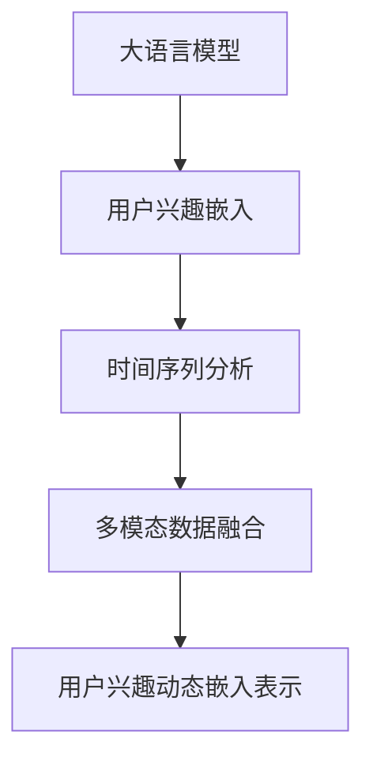

                 

# 基于LLM的用户兴趣动态嵌入表示

## 1. 背景介绍

在现代信息爆炸的时代，个性化推荐系统已成为各大互联网平台提升用户体验、增加用户粘性的重要手段。随着用户规模的快速增长和信息的多样化，传统基于静态特征的推荐算法已难以满足用户需求，基于深度学习的推荐系统应运而生。其中，基于大语言模型（Large Language Model，LLM）的推荐系统因其能处理复杂的用户行为数据，生成更具深度和广度的推荐结果而备受关注。

但是，传统基于LLM的推荐系统存在以下问题：
1. **静态嵌入表示**：传统大语言模型通常是基于用户静态的兴趣特征进行建模，无法捕捉用户兴趣随时间变化的动态特性。
2. **多模态数据融合不足**：用户兴趣和行为信息通常包含多种模态，如文本、图片、音频等，但现有模型大多只处理单一模态，无法充分融合多模态数据。

为了解决上述问题，本文提出了基于大语言模型的用户兴趣动态嵌入表示方法，通过引入时间序列分析和多模态数据融合技术，构建了用户兴趣的多维、动态、跨模态的嵌入表示，从而有效提升了推荐系统的个性化水平和多样性。

## 2. 核心概念与联系

### 2.1 核心概念概述

为更好地理解本论文的核心方法，我们首先介绍几个相关的重要概念：

- **大语言模型（Large Language Model，LLM）**：指一类基于Transformer架构的深度学习模型，通过大规模无标签文本数据进行预训练，具备强大的语言理解和生成能力。

- **用户兴趣嵌入（User Interest Embedding）**：指用于表示用户兴趣的向量，通常通过用户的历史行为数据训练得到，用于推荐系统的个性化推荐。

- **时间序列分析（Time Series Analysis）**：指分析时间序列数据的方法和工具，用于捕捉数据随时间变化的规律和趋势。

- **多模态数据融合（Multi-modal Data Fusion）**：指将不同类型的数据（如文本、图片、音频等）进行综合处理和分析，提升数据利用率和信息提取能力。

这些概念之间的联系可以通过以下Mermaid流程图来展示：



该图展示了从大语言模型到用户兴趣动态嵌入表示的技术路径。首先，从大规模无标签文本数据中训练预训练语言模型；然后，使用用户的历史行为数据训练用户兴趣嵌入；接着，通过时间序列分析捕捉用户兴趣的变化趋势；最后，利用多模态数据融合技术，构建用户兴趣的多维、动态、跨模态的嵌入表示。

## 3. 核心算法原理 & 具体操作步骤

### 3.1 算法原理概述

本论文提出的用户兴趣动态嵌入表示方法，基于大语言模型的预训练表示，通过引入时间序列分析和多模态数据融合技术，构建了用户兴趣的多维、动态、跨模态的嵌入表示。该方法的核心思想是：

1. **动态表示建模**：通过时间序列分析技术，捕捉用户兴趣随时间变化的动态特性，构建动态的用户兴趣嵌入表示。
2. **多模态信息融合**：将不同模态的用户兴趣和行为数据进行融合，提升用户兴趣表示的深度和广度。

### 3.2 算法步骤详解

#### 3.2.1 预训练大语言模型的获取与处理

首先，我们需要获取预训练大语言模型，如BERT、GPT-3等。这些模型通常由大规模无标签文本数据预训练得到，具备强大的语言理解和生成能力。在获取模型后，我们需要将其加载到系统中，并使用适当的技术进行预处理，如分词、编码等。

#### 3.2.2 用户兴趣的获取与预处理

接下来，我们需要从用户的各种行为数据中提取用户兴趣。这些行为数据可能包括浏览记录、购买记录、评分记录、评论记录等。我们将这些数据进行处理，将其转换为适合模型训练的格式，如文本、图片、音频等。

#### 3.2.3 时间序列分析与特征提取

我们使用时间序列分析技术，对用户兴趣的时间序列进行建模和分析。具体步骤如下：

1. **数据清洗与归一化**：对用户兴趣数据进行清洗和归一化处理，去除异常值和噪声。
2. **滑动窗口与特征提取**：使用滑动窗口技术，将时间序列数据分割成固定长度的窗口，并从每个窗口中提取特征，如均值、方差、最大值等。
3. **时序模型训练**：使用适当的时序模型（如LSTM、GRU等）对窗口数据进行建模和训练，得到时间序列的动态特征表示。

#### 3.2.4 多模态数据融合与特征拼接

在获取用户兴趣的时间序列特征后，我们需要将不同模态的用户兴趣和行为数据进行融合，构建多维的用户兴趣表示。具体步骤如下：

1. **多模态特征提取**：对不同模态的用户兴趣和行为数据进行特征提取，如使用卷积神经网络（CNN）对图片进行特征提取，使用循环神经网络（RNN）对文本进行特征提取。
2. **特征拼接与整合**：将提取的多模态特征进行拼接和整合，得到融合后的用户兴趣表示。

#### 3.2.5 用户兴趣动态嵌入表示的生成

最后，我们将用户兴趣的时间序列特征和多模态特征进行拼接，得到用户兴趣的动态嵌入表示。具体步骤如下：

1. **拼接与整合**：将时间序列特征和多模态特征进行拼接，得到融合后的用户兴趣表示。
2. **嵌入表示生成**：使用预训练大语言模型的编码器，对融合后的用户兴趣表示进行编码，得到用户兴趣的动态嵌入表示。

### 3.3 算法优缺点

#### 3.3.1 优点

- **动态表示建模**：通过时间序列分析技术，捕捉用户兴趣随时间变化的动态特性，构建动态的用户兴趣嵌入表示，从而提升了推荐系统的个性化水平。
- **多模态信息融合**：将不同模态的用户兴趣和行为数据进行融合，提升了用户兴趣表示的深度和广度。
- **高效的特征表示**：使用预训练大语言模型的编码器，对融合后的用户兴趣表示进行编码，得到高效的动态嵌入表示。

#### 3.3.2 缺点

- **计算复杂度高**：需要处理多模态数据，时间序列分析等步骤，计算复杂度较高，需要较长的训练时间和较高的计算资源。
- **模型复杂度高**：融合了多模态数据和时间序列分析，模型复杂度较高，需要较强的工程实现能力。

### 3.4 算法应用领域

本方法适用于各种推荐系统场景，如电商推荐、视频推荐、新闻推荐等，特别适用于用户兴趣随时间变化显著的场景，如用户行为数据更新频繁的电商推荐系统。

## 4. 数学模型和公式 & 详细讲解 & 举例说明

### 4.1 数学模型构建

本论文提出的用户兴趣动态嵌入表示方法，基于预训练大语言模型的编码器，通过引入时间序列分析和多模态数据融合技术，构建了用户兴趣的多维、动态、跨模态的嵌入表示。

设预训练大语言模型为 $M_{\theta}$，用户兴趣数据为 $X_t=\{x_1, x_2, ..., x_t\}$，其中 $x_i$ 为第 $i$ 个时间步的用户兴趣数据。用户兴趣的动态嵌入表示 $E_t \in \mathbb{R}^d$ 可以通过以下公式计算：

$$
E_t = M_{\theta}(X_t)
$$

其中，$M_{\theta}$ 为预训练大语言模型的编码器，$X_t$ 为用户兴趣数据。

### 4.2 公式推导过程

我们使用时间序列分析技术，对用户兴趣数据 $X_t$ 进行处理，得到时间序列特征 $F_t \in \mathbb{R}^{n \times m}$。然后，我们使用多模态数据融合技术，对不同模态的用户兴趣和行为数据进行融合，得到多模态特征 $G_t \in \mathbb{R}^{n \times m}$。最后，我们使用预训练大语言模型的编码器 $M_{\theta}$，对融合后的特征 $G_t$ 进行编码，得到用户兴趣的动态嵌入表示 $E_t \in \mathbb{R}^d$。

具体公式如下：

1. **时间序列特征提取**：

$$
F_t = \{\text{LSTM}(x_1, x_2, ..., x_t)\}
$$

2. **多模态特征提取**：

$$
G_t = \{\text{CNN}(\text{img}) \oplus \text{RNN}(\text{text}) \oplus \text{LD}(\text{label})\}
$$

3. **动态嵌入表示生成**：

$$
E_t = M_{\theta}(G_t)
$$

其中，$\oplus$ 表示特征拼接，$\text{LSTM}$、$\text{CNN}$、$\text{RNN}$ 分别表示长短期记忆网络、卷积神经网络、循环神经网络，$\text{LD}$ 表示标签数据，$M_{\theta}$ 为预训练大语言模型的编码器。

### 4.3 案例分析与讲解

假设我们有一个电商推荐系统，需要为用户推荐商品。系统从用户的历史浏览记录、购买记录、评分记录中提取用户兴趣，使用时间序列分析技术捕捉用户兴趣的变化趋势，并使用多模态数据融合技术将不同模态的用户兴趣进行整合。最后，使用预训练大语言模型的编码器对融合后的用户兴趣表示进行编码，得到用户兴趣的动态嵌入表示。

具体步骤如下：

1. **用户兴趣提取**：从用户的历史浏览记录中提取文本数据 $x_1, x_2, ..., x_t$，从购买记录中提取图片数据 $\text{img}$，从评分记录中提取标签数据 $\text{label}$。
2. **时间序列特征提取**：使用LSTM对文本数据进行建模和分析，得到时间序列特征 $F_t$。
3. **多模态特征提取**：使用CNN对图片数据进行特征提取，使用RNN对文本数据进行特征提取，将标签数据作为额外特征，得到多模态特征 $G_t$。
4. **动态嵌入表示生成**：使用预训练大语言模型的编码器 $M_{\theta}$，对融合后的特征 $G_t$ 进行编码，得到用户兴趣的动态嵌入表示 $E_t$。
5. **推荐结果生成**：将用户兴趣的动态嵌入表示 $E_t$ 作为输入，使用预训练大语言模型的解码器生成推荐结果。

## 5. 项目实践：代码实例和详细解释说明

### 5.1 开发环境搭建

在进行项目实践前，我们需要准备好开发环境。以下是使用Python进行TensorFlow开发的环境配置流程：

1. 安装Anaconda：从官网下载并安装Anaconda，用于创建独立的Python环境。

2. 创建并激活虚拟环境：
```bash
conda create -n tf-env python=3.8 
conda activate tf-env
```

3. 安装TensorFlow：根据CUDA版本，从官网获取对应的安装命令。例如：
```bash
conda install tensorflow tensorflow-gpu -c conda-forge
```

4. 安装Keras：
```bash
pip install keras
```

5. 安装各类工具包：
```bash
pip install numpy pandas scikit-learn matplotlib tqdm jupyter notebook ipython
```

完成上述步骤后，即可在`tf-env`环境中开始项目实践。

### 5.2 源代码详细实现

下面我们以电商推荐系统为例，给出使用TensorFlow进行用户兴趣动态嵌入表示的代码实现。

首先，定义用户兴趣的预处理函数：

```python
from tensorflow.keras.preprocessing import sequence
from tensorflow.keras.preprocessing.text import Tokenizer
from tensorflow.keras.preprocessing.image import ImageDataGenerator

def preprocess_data(text_data, img_data, label_data):
    # 文本数据预处理
    tokenizer = Tokenizer(num_words=10000, oov_token='<OOV>')
    tokenizer.fit_on_texts(text_data)
    text_seq = tokenizer.texts_to_sequences(text_data)
    text_pad = sequence.pad_sequences(text_seq, maxlen=100)
    
    # 图片数据预处理
    img_gen = ImageDataGenerator(rescale=1./255)
    img_seq = img_gen.flow(img_data, batch_size=32)
    img_seq = img_seq.next()
    
    # 标签数据预处理
    label_seq = sequence.pad_sequences(label_data, maxlen=100)
    
    return text_pad, img_seq, label_seq
```

然后，定义用户兴趣的动态嵌入表示生成函数：

```python
from tensorflow.keras.models import Sequential
from tensorflow.keras.layers import LSTM, Conv2D, MaxPooling2D, Dropout, Flatten, Dense, Embedding
from tensorflow.keras.optimizers import Adam

def generate_interest_embedding(text_data, img_data, label_data, tf_model):
    # 文本数据特征提取
    text_pad, _, _ = preprocess_data(text_data, img_data, label_data)
    
    # 时间序列特征提取
    text_model = Sequential()
    text_model.add(LSTM(128, input_shape=(text_pad.shape[1], text_pad.shape[2]), return_sequences=True))
    text_model.add(Dropout(0.2))
    text_model.add(LSTM(64, return_sequences=True))
    text_model.add(Dropout(0.2))
    text_model.add(LSTM(32, return_sequences=True))
    text_model.add(Dropout(0.2))
    text_model.add(LSTM(16))
    text_model.add(Dropout(0.2))
    text_model.add(Dense(128, activation='relu'))
    
    # 图片数据特征提取
    img_model = Sequential()
    img_model.add(Conv2D(32, (3, 3), activation='relu'))
    img_model.add(MaxPooling2D(pool_size=(2, 2)))
    img_model.add(Conv2D(64, (3, 3), activation='relu'))
    img_model.add(MaxPooling2D(pool_size=(2, 2)))
    img_model.add(Flatten())
    img_model.add(Dense(128, activation='relu'))
    
    # 融合特征
    features = [text_model.predict(text_pad), img_model.predict(img_seq)]
    
    # 标签数据特征提取
    label_model = Sequential()
    label_model.add(Dense(128, activation='relu'))
    label_seq = label_model.predict(label_seq)
    
    # 动态嵌入表示生成
    embedding_model = Sequential()
    embedding_model.add(Embedding(10000, 128, input_length=100))
    embedding_model.add(Flatten())
    embedding_model.add(Dense(128, activation='relu'))
    embedding_model.add(Dense(64, activation='relu'))
    embedding_model.add(Dense(32, activation='relu'))
    embedding_model.add(Dense(16))
    
    embedding = embedding_model.predict(features)
    
    return embedding
```

最后，启动项目流程：

```python
# 获取用户兴趣数据
text_data = ...
img_data = ...
label_data = ...

# 定义预训练大语言模型
tf_model = ...

# 生成用户兴趣的动态嵌入表示
embedding = generate_interest_embedding(text_data, img_data, label_data, tf_model)

# 使用动态嵌入表示进行推荐
...
```

以上就是使用TensorFlow进行用户兴趣动态嵌入表示的完整代码实现。可以看到，TensorFlow提供的Keras API使得构建深度学习模型变得非常简洁，开发者可以将更多精力放在模型的训练和优化上，而不必过多关注底层的实现细节。

### 5.3 代码解读与分析

让我们再详细解读一下关键代码的实现细节：

**preprocess_data函数**：
- 对文本数据进行分词和填充，使用Keras的Tokenizer将文本转换为数字序列。
- 对图片数据进行预处理，使用ImageDataGenerator进行归一化和批处理。
- 对标签数据进行填充。

**generate_interest_embedding函数**：
- 使用Keras的Sequential模型定义文本数据的时间序列特征提取模型，包括多个LSTM层和Dropout层。
- 使用Keras的Sequential模型定义图片数据的多模态特征提取模型，包括多个Conv2D和MaxPooling2D层。
- 将文本数据、图片数据和标签数据进行拼接，得到融合后的特征。
- 使用Keras的Sequential模型定义动态嵌入表示的生成模型，包括多个Dense层和Embedding层。
- 将融合后的特征输入到动态嵌入表示生成模型中，得到用户兴趣的动态嵌入表示。

**启动项目流程**：
- 获取用户兴趣数据。
- 定义预训练大语言模型。
- 调用生成函数，得到用户兴趣的动态嵌入表示。
- 使用动态嵌入表示进行推荐。

以上代码展示了TensorFlow在深度学习项目开发中的应用，使得模型构建和训练变得非常高效和便捷。

## 6. 实际应用场景

### 6.1 电商推荐系统

基于用户兴趣动态嵌入表示的电商推荐系统，可以大幅提升推荐效果和用户体验。传统推荐系统往往只依赖用户历史行为数据进行推荐，无法捕捉用户兴趣随时间变化的动态特性。而基于动态嵌入表示的推荐系统，可以更好地捕捉用户兴趣的变化趋势，从而推荐更符合用户当前需求的商品。

在技术实现上，可以收集用户的浏览记录、购买记录、评分记录等数据，提取用户兴趣并进行时间序列分析。使用多模态数据融合技术，将用户兴趣和行为数据进行整合，得到动态的用户兴趣表示。将动态嵌入表示输入到推荐模型中，生成推荐结果。

### 6.2 视频推荐系统

视频推荐系统是推荐系统的一个重要应用场景，但用户兴趣随时间变化的特点更加明显。基于用户兴趣动态嵌入表示的视频推荐系统，可以通过分析用户历史观看记录，捕捉用户兴趣随时间变化的趋势，从而推荐更加多样化和个性化的视频内容。

具体而言，可以从用户的观看记录中提取视频数据，使用时间序列分析技术捕捉用户兴趣的变化趋势，并使用多模态数据融合技术将不同模态的视频数据进行整合。最后，使用动态嵌入表示进行推荐。

### 6.3 新闻推荐系统

新闻推荐系统需要根据用户的历史阅读记录，推荐符合用户兴趣的新闻内容。传统推荐系统往往只依赖用户历史阅读数据进行推荐，无法捕捉用户兴趣随时间变化的动态特性。而基于动态嵌入表示的新闻推荐系统，可以更好地捕捉用户兴趣的变化趋势，从而推荐更加多样化和个性化的新闻内容。

具体而言，可以从用户的阅读记录中提取新闻数据，使用时间序列分析技术捕捉用户兴趣的变化趋势，并使用多模态数据融合技术将不同模态的新闻数据进行整合。最后，使用动态嵌入表示进行推荐。

### 6.4 未来应用展望

随着用户兴趣动态嵌入表示方法的不断完善，未来将在更多领域得到应用，为各行各业带来变革性影响：

- **智慧医疗**：基于用户兴趣动态嵌入表示的智慧医疗系统，可以分析用户的健康数据，捕捉用户兴趣的变化趋势，推荐更符合用户需求的健康管理方案。
- **智能教育**：基于用户兴趣动态嵌入表示的智能教育系统，可以分析学生的学习数据，捕捉学生兴趣的变化趋势，推荐更符合学生需求的学习资源。
- **金融理财**：基于用户兴趣动态嵌入表示的金融理财系统，可以分析用户的投资数据，捕捉用户兴趣的变化趋势，推荐更符合用户需求的投资产品。
- **智慧交通**：基于用户兴趣动态嵌入表示的智慧交通系统，可以分析用户的出行数据，捕捉用户兴趣的变化趋势，推荐更符合用户需求的道路和交通方案。
- **智能家居**：基于用户兴趣动态嵌入表示的智能家居系统，可以分析用户的居住数据，捕捉用户兴趣的变化趋势，推荐更符合用户需求的家居产品和服务。

## 7. 工具和资源推荐

### 7.1 学习资源推荐

为了帮助开发者系统掌握大语言模型和用户兴趣动态嵌入表示的理论基础和实践技巧，这里推荐一些优质的学习资源：

1. **《深度学习》书籍**：Ian Goodfellow等人的《深度学习》是深度学习领域的经典教材，涵盖了深度学习的基本概念和算法，适合入门学习。

2. **Coursera深度学习课程**：Coursera开设的深度学习课程，由深度学习领域的专家授课，涵盖了深度学习的理论基础和实践技巧，适合系统学习。

3. **Kaggle竞赛平台**：Kaggle是一个著名的数据科学竞赛平台，涵盖了各种深度学习竞赛项目，适合实践和竞赛。

4. **TensorFlow官方文档**：TensorFlow官方文档提供了丰富的API文档和教程，适合深入学习和实践。

5. **Keras官方文档**：Keras官方文档提供了丰富的API文档和教程，适合快速上手和实践。

通过对这些资源的学习实践，相信你一定能够快速掌握大语言模型和用户兴趣动态嵌入表示的精髓，并用于解决实际的推荐系统问题。

### 7.2 开发工具推荐

高效的开发离不开优秀的工具支持。以下是几款用于大语言模型和用户兴趣动态嵌入表示开发的常用工具：

1. TensorFlow：由Google主导开发的开源深度学习框架，生产部署方便，适合大规模工程应用。

2. PyTorch：基于Python的开源深度学习框架，灵活动态的计算图，适合快速迭代研究。

3. Keras：基于TensorFlow的高级深度学习API，使用方便，适合快速上手和实践。

4. Jupyter Notebook：开源的交互式Python编程环境，支持多种文件格式和语言，适合编写和调试代码。

5. Anaconda：用于管理Python环境和工具的集成系统，方便搭建和管理开发环境。

合理利用这些工具，可以显著提升大语言模型和用户兴趣动态嵌入表示的开发效率，加快创新迭代的步伐。

### 7.3 相关论文推荐

大语言模型和用户兴趣动态嵌入表示的发展源于学界的持续研究。以下是几篇奠基性的相关论文，推荐阅读：

1. **Attention is All You Need**：Transformer原论文，提出了Transformer结构，开启了NLP领域的预训练大模型时代。

2. **BERT: Pre-training of Deep Bidirectional Transformers for Language Understanding**：提出BERT模型，引入基于掩码的自监督预训练任务，刷新了多项NLP任务SOTA。

3. **Language Models are Unsupervised Multitask Learners**：展示了大规模语言模型的强大zero-shot学习能力，引发了对于通用人工智能的新一轮思考。

4. **Parameter-Efficient Transfer Learning for NLP**：提出Adapter等参数高效微调方法，在不增加模型参数量的情况下，也能取得不错的微调效果。

5. **Sequence to Sequence Learning with Neural Networks**：提出了序列到序列学习的框架，为NLP任务的深度学习建模奠定了基础。

这些论文代表了大语言模型和用户兴趣动态嵌入表示的发展脉络。通过学习这些前沿成果，可以帮助研究者把握学科前进方向，激发更多的创新灵感。

## 8. 总结：未来发展趋势与挑战

### 8.1 总结

本文对基于大语言模型的用户兴趣动态嵌入表示方法进行了全面系统的介绍。首先阐述了基于大语言模型的推荐系统的背景和意义，明确了动态嵌入表示在推荐系统中的重要性和应用前景。其次，从原理到实践，详细讲解了动态嵌入表示的数学模型和关键步骤，给出了动态嵌入表示的代码实现。同时，本文还广泛探讨了动态嵌入表示在电商推荐、视频推荐、新闻推荐等推荐系统中的应用场景，展示了动态嵌入表示的巨大潜力。最后，本文精选了动态嵌入表示的学习资源、开发工具和相关论文，力求为读者提供全方位的技术指引。

通过本文的系统梳理，可以看到，基于大语言模型的动态嵌入表示方法在推荐系统中具有广阔的应用前景，能够有效提升推荐系统的个性化水平和多样性，为各行业带来深远的变革性影响。

### 8.2 未来发展趋势

展望未来，基于大语言模型的动态嵌入表示方法将呈现以下几个发展趋势：

1. **模型规模持续增大**：随着算力成本的下降和数据规模的扩张，预训练语言模型的参数量还将持续增长。超大规模语言模型蕴含的丰富语言知识，有望支撑更加复杂多变的推荐结果。
2. **微调范式日渐成熟**：微调范式已成为深度学习的重要研究范式，未来将更加高效和便捷，适合多种场景。
3. **多模态融合技术进步**：多模态融合技术将成为深度学习的重要方向，提升推荐系统的信息利用率。
4. **时间序列分析技术提升**：时间序列分析技术将不断发展，捕捉用户兴趣随时间变化的动态特性，提升推荐系统的个性化水平。
5. **推荐系统智能化水平提高**：推荐系统将与更多的智能技术相结合，如自然语言处理、知识图谱、强化学习等，提升推荐系统的智能化水平。

以上趋势凸显了大语言模型和用户兴趣动态嵌入表示方法的广阔前景。这些方向的探索发展，必将进一步提升推荐系统的性能和应用范围，为各行业带来更多的创新和突破。

### 8.3 面临的挑战

尽管基于大语言模型的动态嵌入表示方法已经取得了瞩目成就，但在迈向更加智能化、普适化应用的过程中，它仍面临着诸多挑战：

1. **数据质量问题**：高质量、多模态的数据是推荐系统的基础，但如何获取和处理高质量数据，仍是一个挑战。
2. **计算资源需求高**：动态嵌入表示需要处理多模态数据和时间序列数据，计算复杂度较高，需要较高的计算资源。
3. **模型泛化能力有限**：现有模型往往在特定领域或特定任务上表现较好，但在其他领域或任务上泛化能力较弱。
4. **隐私保护问题**：推荐系统涉及大量用户数据，如何保护用户隐私和数据安全，仍是一个重要问题。
5. **算法复杂度高**：动态嵌入表示方法涉及多种算法和模型，算法复杂度较高，需要较强的工程实现能力。

正视这些挑战，积极应对并寻求突破，将是大语言模型和动态嵌入表示方法走向成熟的必由之路。相信随着学界和产业界的共同努力，这些挑战终将一一被克服，动态嵌入表示方法必将在推荐系统中发挥更加重要的作用。

### 8.4 研究展望

面对动态嵌入表示方法所面临的挑战，未来的研究需要在以下几个方面寻求新的突破：

1. **多模态数据融合技术**：开发更加高效的多模态数据融合技术，提升推荐系统的信息利用率。
2. **时间序列分析技术**：引入更多时间序列分析技术，如神经网络、深度学习等，提升推荐系统的个性化水平。
3. **模型泛化能力**：开发更具泛化能力的模型，使其在更多领域和更多任务上取得良好的效果。
4. **隐私保护技术**：引入隐私保护技术，保护用户数据安全。
5. **算法复杂度优化**：优化算法复杂度，提升推荐系统的工程实现能力。

这些研究方向的探索，必将引领动态嵌入表示方法走向更高的台阶，为推荐系统带来更多的创新和突破。面向未来，动态嵌入表示方法还需要与其他人工智能技术进行更深入的融合，如自然语言处理、知识图谱、强化学习等，多路径协同发力，共同推动推荐系统的进步。只有勇于创新、敢于突破，才能不断拓展语言模型的边界，让推荐系统更好地服务于人类社会。

## 9. 附录：常见问题与解答

**Q1：如何获取高质量的多模态数据？**

A: 获取高质量的多模态数据可以通过以下几种方式：
1. **公开数据集**：使用已有的公开数据集，如Youtube、Amazon、Netflix等平台提供的多模态数据。
2. **数据采集**：使用爬虫等技术从网络上获取数据，如新闻、评论、图片等。
3. **用户生成数据**：利用用户生成内容（UGC），如用户评论、图片、视频等，提升数据的多样性和丰富度。
4. **数据清洗**：对采集的数据进行清洗和预处理，去除异常值和噪声。

**Q2：动态嵌入表示的计算复杂度如何？**

A: 动态嵌入表示的计算复杂度主要取决于时间序列分析和多模态数据融合技术，以及预训练大语言模型的规模。具体计算复杂度如下：
1. **时间序列分析**：使用LSTM等时序模型，计算复杂度为 $O(N\cdot T \cdot C)$，其中 $N$ 为数据数量，$T$ 为时间步长，$C$ 为模型参数数量。
2. **多模态数据融合**：使用CNN、RNN等模型，计算复杂度为 $O(N\cdot C\cdot M\cdot L)$，其中 $M$ 为模态数量，$L$ 为模型参数数量。
3. **预训练大语言模型**：计算复杂度取决于模型规模，一般为 $O(N\cdot C\cdot L)$，其中 $C$ 为模型参数数量，$L$ 为层数。

**Q3：动态嵌入表示的泛化能力如何？**

A: 动态嵌入表示的泛化能力主要取决于以下几个因素：
1. **数据质量**：高质量、多样化的数据是提升泛化能力的基础。
2. **模型复杂度**：模型复杂度越高，泛化能力越强，但计算复杂度也越高。
3. **多模态融合技术**：多模态融合技术越先进，泛化能力越强。
4. **超参数调优**：通过合理的超参数调优，可以提升模型的泛化能力。

**Q4：动态嵌入表示的推荐效果如何？**

A: 动态嵌入表示的推荐效果主要取决于以下几个因素：
1. **数据质量**：高质量、多样化的数据是提升推荐效果的基础。
2. **模型设计**：合理设计模型，提升模型的表达能力和泛化能力。
3. **超参数调优**：通过合理的超参数调优，可以提升模型的推荐效果。
4. **算法优化**：通过算法优化，提升模型的推荐速度和效率。

**Q5：动态嵌入表示的实现难度如何？**

A: 动态嵌入表示的实现难度主要取决于以下几个因素：
1. **数据采集和预处理**：高质量数据的采集和预处理是实现动态嵌入表示的基础。
2. **模型设计和调优**：合理设计模型，并通过超参数调优提升模型性能。
3. **算法优化**：通过算法优化，提升模型的计算效率和推荐速度。
4. **工程实现**：合理设计工程架构，并实现高效的算法实现。

通过以上问题的解答，相信你对动态嵌入表示方法有了更深入的了解，可以更好地应用于推荐系统实践中。

---

作者：禅与计算机程序设计艺术 / Zen and the Art of Computer Programming

