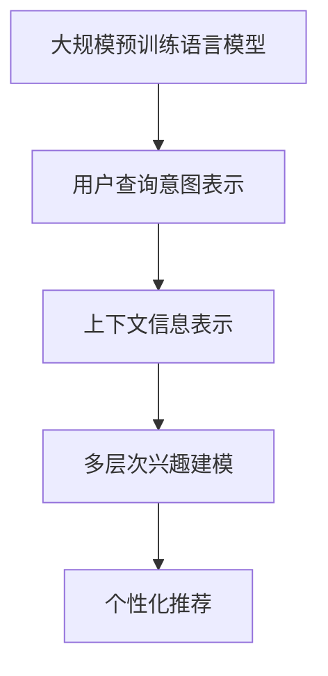

                 

## 1. 背景介绍

在现代社会中，用户对于互联网信息的需求日益增加，个性化推荐系统（Personalized Recommendation System, PReS）已成为一种重要的技术手段。PReS通过分析用户的历史行为数据，预测其兴趣偏好，从而推荐符合用户需求的内容。随着深度学习和大规模预训练语言模型（Large Language Models, LLMs）的兴起，用户兴趣表示的学习也得到了新的突破。

LLMs通过大规模无标签文本数据预训练，学习到丰富的语言表示。在推荐系统中，LLMs被用来捕获用户输入的意图和查询的上下文信息，从而进行精准推荐。然而，传统的基于LLM的用户兴趣表示方法往往忽略用户的个性化需求和兴趣的多层次性，导致推荐效果一般，无法满足用户的实际需求。

本文将聚焦于基于LLM的用户兴趣层次化表示学习问题，旨在探索如何通过多层次的兴趣建模，提升推荐系统的个性化推荐效果。我们将首先介绍层次化表示学习的基本概念，然后详细介绍一种基于层次化表示学习的用户兴趣表示模型。最后，我们将在实际应用中展示该模型在推荐系统中的效果，并给出未来研究方向的展望。

## 2. 核心概念与联系

### 2.1 核心概念概述

在推荐系统中，用户兴趣表示是一个核心问题。传统的基于ML/DL的用户兴趣表示方法主要基于用户历史行为数据进行建模，而基于LLM的推荐系统则通过自然语言理解技术，捕捉用户输入的查询意图和上下文信息，进行个性化的内容推荐。

### 2.2 核心概念联系

LLM的预训练过程可以看作是用户兴趣表示的一种无监督学习方式。通过大规模无标签文本数据的预训练，LLM学习到丰富的语言表示，包括词汇、句子、段落等不同粒度的语言知识。这些表示可以用来捕获用户的查询意图和上下文信息，从而进行推荐。

层次化表示学习（Hierarchical Representation Learning）则是一种通过多层次的建模方式，捕捉不同粒度的用户兴趣需求。将用户的兴趣表示进行层次化建模，可以更好地体现用户兴趣的多样性和动态性，从而提升推荐系统的个性化推荐效果。

下图展示了层次化表示学习的核心概念及其联系：



这个图展示了LLM在用户兴趣表示学习中的作用。通过预训练学习到丰富的语言表示，然后捕捉用户的查询意图和上下文信息，最终通过多层次建模，进行个性化推荐。

## 3. 核心算法原理 & 具体操作步骤

### 3.1 算法原理概述

基于LLM的用户兴趣层次化表示学习，本质上是通过多层次的兴趣建模，学习到用户兴趣的多样性和动态性。其核心思想是将用户兴趣表示分解为多个层次，每个层次分别捕捉不同粒度的兴趣需求，最终将这些层次表示进行组合，形成用户的整体兴趣表示。

形式化地，假设用户历史行为数据为 $\mathcal{D}=\{(h_i,r_i,t_i)\}_{i=1}^N$，其中 $h_i$ 为用户的历史行为序列，$r_i$ 为用户的真实兴趣，$t_i$ 为用户的行为结果。我们的目标是通过预训练语言模型 $M_{\theta}$ 学习到用户的兴趣表示 $z_i = M_{\theta}(h_i)$，然后将其分解为 $k$ 个层次表示 $z_i^{(l)}$，其中 $l \in \{1, \dots, k\}$。最终的兴趣表示 $z_i^{(k)}$ 将作为推荐系统的输入，进行个性化推荐。

### 3.2 算法步骤详解

基于LLM的用户兴趣层次化表示学习步骤如下：

**Step 1: 准备数据集**
- 收集用户的历史行为数据 $\mathcal{D}$，包括用户的行为序列、真实兴趣和行为结果。
- 将用户的行为序列作为预训练语言模型的输入，学习用户的兴趣表示 $z_i = M_{\theta}(h_i)$。

**Step 2: 分解兴趣表示**
- 将用户的兴趣表示 $z_i$ 分解为 $k$ 个层次表示 $z_i^{(l)}$，其中 $l \in \{1, \dots, k\}$。
- 每个层次表示 $z_i^{(l)}$ 用于捕捉不同粒度的用户兴趣需求。例如，第一层次用于捕捉词汇级别的兴趣需求，第二层次用于捕捉句子级别的兴趣需求，第三层次用于捕捉段落级别的兴趣需求。

**Step 3: 模型训练**
- 对于每个层次表示 $z_i^{(l)}$，设计合适的训练目标，如分类任务、回归任务等，进行模型训练。
- 通过多层次的兴趣建模，可以更好地捕捉用户兴趣的多样性和动态性，提升推荐系统的个性化推荐效果。

**Step 4: 兴趣组合**
- 将每个层次表示 $z_i^{(l)}$ 组合成用户的整体兴趣表示 $z_i^{(k)}$。
- 可以通过简单的线性组合、加权平均等方式，将各个层次表示进行组合。

**Step 5: 推荐**
- 将用户的整体兴趣表示 $z_i^{(k)}$ 作为推荐系统的输入，进行个性化推荐。

### 3.3 算法优缺点

基于LLM的用户兴趣层次化表示学习有以下优点：
1. 可以捕捉用户兴趣的多层次性，提升推荐系统的个性化推荐效果。
2. 可以利用预训练语言模型学习到的丰富语言表示，提升模型的泛化能力和表现。
3. 可以将用户的查询意图和上下文信息进行融合，提升推荐系统的鲁棒性。

然而，该方法也存在一定的局限性：
1. 对于数据分布的变化，模型可能需要进行重新训练。
2. 模型的训练复杂度较高，需要更多的计算资源和时间。
3. 模型的可解释性较差，难以理解模型内部工作机制。

尽管如此，基于LLM的用户兴趣层次化表示学习在推荐系统中的应用已经取得了一定的进展，并具有广阔的发展前景。

### 3.4 算法应用领域

基于LLM的用户兴趣层次化表示学习在推荐系统中已经得到了广泛的应用，涵盖了各种推荐场景，如商品推荐、内容推荐、广告推荐等。该方法不仅适用于电商和新闻推荐，还适用于医疗、教育、金融等领域，具有广泛的适用性。

## 4. 数学模型和公式 & 详细讲解

### 4.1 数学模型构建

假设用户的兴趣表示 $z_i$ 可以分解为 $k$ 个层次表示 $z_i^{(l)}$，其中 $l \in \{1, \dots, k\}$。每个层次表示 $z_i^{(l)}$ 可以看作是一个低维向量，即 $z_i^{(l)} \in \mathbb{R}^{d_l}$，其中 $d_l$ 为第 $l$ 层次表示的维度。

假设用户的行为序列为 $h_i = \{w_{i,1}, \dots, w_{i,T}\}$，其中 $w_{i,t}$ 为用户在时间步 $t$ 的行为序列。则用户的行为序列可以表示为：

$$
h_i = \{w_{i,1}, \dots, w_{i,T}\}
$$

假设预训练语言模型为 $M_{\theta}$，用户的兴趣表示为 $z_i = M_{\theta}(h_i)$。则用户兴趣表示的层次化分解可以表示为：

$$
z_i = \{z_i^{(1)}, \dots, z_i^{(k)}\}
$$

其中 $z_i^{(1)}$ 表示词汇级别的兴趣需求，$z_i^{(2)}$ 表示句子级别的兴趣需求，$z_i^{(3)}$ 表示段落级别的兴趣需求。

### 4.2 公式推导过程

用户兴趣表示的层次化分解可以通过以下步骤实现：

**Step 1: 输入表示学习**
- 将用户的行为序列 $h_i$ 输入到预训练语言模型 $M_{\theta}$ 中，学习到用户的兴趣表示 $z_i = M_{\theta}(h_i)$。

**Step 2: 层次化分解**
- 将用户兴趣表示 $z_i$ 分解为 $k$ 个层次表示 $z_i^{(l)}$，其中 $l \in \{1, \dots, k\}$。
- 对于第 $l$ 层次表示 $z_i^{(l)}$，可以通过以下方式进行分解：
$$
z_i^{(l)} = M_{\theta}^{(l)}(z_i^{(l-1)})
$$
其中 $M_{\theta}^{(l)}$ 为第 $l$ 层次的兴趣表示学习模型。

**Step 3: 层次组合**
- 将各个层次表示进行组合，得到用户的整体兴趣表示 $z_i^{(k)}$。
- 可以通过简单的线性组合、加权平均等方式，将各个层次表示进行组合：
$$
z_i^{(k)} = \sum_{l=1}^k \lambda_l z_i^{(l)}
$$
其中 $\lambda_l$ 为第 $l$ 层次表示的权重，可以通过交叉验证等方法进行优化。

### 4.3 案例分析与讲解

下面以商品推荐为例，说明基于LLM的用户兴趣层次化表示学习的方法。

假设用户的查询为 "手机推荐"，其行为序列为 "手机厂商"、"手机型号"、"手机价格"、"手机参数"。

**Step 1: 输入表示学习**
- 将用户的行为序列 "手机厂商"、"手机型号"、"手机价格"、"手机参数" 输入到预训练语言模型中，学习到用户的兴趣表示 $z_i$。

**Step 2: 层次化分解**
- 将用户的兴趣表示 $z_i$ 分解为词汇级别的兴趣表示 $z_i^{(1)}$、句子级别的兴趣表示 $z_i^{(2)}$ 和段落级别的兴趣表示 $z_i^{(3)}$。
- 例如，词汇级别的兴趣表示 $z_i^{(1)}$ 可以通过以下方式进行分解：
$$
z_i^{(1)} = M_{\theta}^{(1)}(z_i)
$$
其中 $M_{\theta}^{(1)}$ 为词汇级别的兴趣表示学习模型。

**Step 3: 层次组合**
- 将各个层次表示进行组合，得到用户的整体兴趣表示 $z_i^{(3)}$。
- 例如，可以通过以下方式进行组合：
$$
z_i^{(3)} = \lambda_1 z_i^{(1)} + \lambda_2 z_i^{(2)} + \lambda_3 z_i^{(3)}
$$
其中 $\lambda_1, \lambda_2, \lambda_3$ 可以通过交叉验证等方法进行优化。

## 5. 项目实践：代码实例和详细解释说明

### 5.1 开发环境搭建

在进行用户兴趣层次化表示学习的项目实践前，我们需要准备好开发环境。以下是使用Python进行PyTorch开发的环境配置流程：

1. 安装Anaconda：从官网下载并安装Anaconda，用于创建独立的Python环境。

2. 创建并激活虚拟环境：
```bash
conda create -n llm-pretrain-env python=3.8 
conda activate llm-pretrain-env
```

3. 安装PyTorch：根据CUDA版本，从官网获取对应的安装命令。例如：
```bash
conda install pytorch torchvision torchaudio cudatoolkit=11.1 -c pytorch -c conda-forge
```

4. 安装HuggingFace Transformers库：
```bash
pip install transformers
```

5. 安装各类工具包：
```bash
pip install numpy pandas scikit-learn matplotlib tqdm jupyter notebook ipython
```

完成上述步骤后，即可在`llm-pretrain-env`环境中开始用户兴趣层次化表示学习的项目实践。

### 5.2 源代码详细实现

这里我们以一个简单的商品推荐系统为例，展示用户兴趣层次化表示学习的代码实现。

首先，定义用户行为数据处理函数：

```python
from transformers import BertTokenizer
from torch.utils.data import Dataset
import torch

class UserBehaviorDataset(Dataset):
    def __init__(self, texts, behaviors, tokenizer, max_len=128):
        self.texts = texts
        self.behaviors = behaviors
        self.tokenizer = tokenizer
        self.max_len = max_len
        
    def __len__(self):
        return len(self.texts)
    
    def __getitem__(self, item):
        text = self.texts[item]
        behaviors = self.behaviors[item]
        
        encoding = self.tokenizer(text, return_tensors='pt', max_length=self.max_len, padding='max_length', truncation=True)
        input_ids = encoding['input_ids'][0]
        attention_mask = encoding['attention_mask'][0]
        
        # 对行为数据进行编码
        behaviors_encoded = [str(behavior) for behavior in behaviors] 
        behaviors_encoded.extend([''] * (self.max_len - len(behaviors_encoded)))
        labels = torch.tensor(behaviors_encoded, dtype=torch.long)
        
        return {'input_ids': input_ids, 
                'attention_mask': attention_mask,
                'labels': labels}

# 定义行为与标签的映射
behavior2id = {str(behavior): i for i, behavior in enumerate(['手机厂商', '手机型号', '手机价格', '手机参数'])}
id2behavior = {v: k for k, v in behavior2id.items()}

# 创建dataset
tokenizer = BertTokenizer.from_pretrained('bert-base-cased')

train_dataset = UserBehaviorDataset(train_texts, train_behaviors, tokenizer)
dev_dataset = UserBehaviorDataset(dev_texts, dev_behaviors, tokenizer)
test_dataset = UserBehaviorDataset(test_texts, test_behaviors, tokenizer)
```

然后，定义用户兴趣表示的层次化分解模型：

```python
from transformers import BertForSequenceClassification

class UserInterestRepresentationModel(BertForSequenceClassification):
    def __init__(self, num_labels=4):
        super(UserInterestRepresentationModel, self).__init__(num_labels=num_labels)
        self.bert = BertForSequenceClassification.from_pretrained('bert-base-cased')
        self.dropout = torch.nn.Dropout(0.1)
        self.fc = torch.nn.Linear(self.bert.config.hidden_size, 128)
        self.linear = torch.nn.Linear(128, 4)
    
    def forward(self, input_ids, attention_mask):
        outputs = self.bert(input_ids=input_ids, attention_mask=attention_mask)
        hidden_states = outputs[0]
        hidden_states = self.dropout(hidden_states)
        hidden_states = self.fc(hidden_states)
        logits = self.linear(hidden_states)
        return logits
```

接着，定义用户兴趣表示的层次化分解步骤：

```python
# 定义词汇级别的兴趣表示学习模型
class WordLevelInterestRepresentationModel(BertForSequenceClassification):
    def __init__(self, num_labels=4):
        super(WordLevelInterestRepresentationModel, self).__init__(num_labels=num_labels)
        self.bert = BertForSequenceClassification.from_pretrained('bert-base-cased')
        self.dropout = torch.nn.Dropout(0.1)
        self.fc = torch.nn.Linear(self.bert.config.hidden_size, 128)
        self.linear = torch.nn.Linear(128, 4)
    
    def forward(self, input_ids, attention_mask):
        outputs = self.bert(input_ids=input_ids, attention_mask=attention_mask)
        hidden_states = outputs[0]
        hidden_states = self.dropout(hidden_states)
        hidden_states = self.fc(hidden_states)
        logits = self.linear(hidden_states)
        return logits

# 定义句子级别的兴趣表示学习模型
class SentenceLevelInterestRepresentationModel(BertForSequenceClassification):
    def __init__(self, num_labels=4):
        super(SentenceLevelInterestRepresentationModel, self).__init__(num_labels=num_labels)
        self.bert = BertForSequenceClassification.from_pretrained('bert-base-cased')
        self.dropout = torch.nn.Dropout(0.1)
        self.fc = torch.nn.Linear(self.bert.config.hidden_size, 128)
        self.linear = torch.nn.Linear(128, 4)
    
    def forward(self, input_ids, attention_mask):
        outputs = self.bert(input_ids=input_ids, attention_mask=attention_mask)
        hidden_states = outputs[0]
        hidden_states = self.dropout(hidden_states)
        hidden_states = self.fc(hidden_states)
        logits = self.linear(hidden_states)
        return logits

# 定义段落级别的兴趣表示学习模型
class ParagraphLevelInterestRepresentationModel(BertForSequenceClassification):
    def __init__(self, num_labels=4):
        super(ParagraphLevelInterestRepresentationModel, self).__init__(num_labels=num_labels)
        self.bert = BertForSequenceClassification.from_pretrained('bert-base-cased')
        self.dropout = torch.nn.Dropout(0.1)
        self.fc = torch.nn.Linear(self.bert.config.hidden_size, 128)
        self.linear = torch.nn.Linear(128, 4)
    
    def forward(self, input_ids, attention_mask):
        outputs = self.bert(input_ids=input_ids, attention_mask=attention_mask)
        hidden_states = outputs[0]
        hidden_states = self.dropout(hidden_states)
        hidden_states = self.fc(hidden_states)
        logits = self.linear(hidden_states)
        return logits
```

然后，定义用户兴趣表示的层次组合步骤：

```python
from transformers import BertForSequenceClassification

class UserInterestRepresentationCombiner(BertForSequenceClassification):
    def __init__(self, num_labels=4):
        super(UserInterestRepresentationCombiner, self).__init__(num_labels=num_labels)
        self.bert = BertForSequenceClassification.from_pretrained('bert-base-cased')
        self.dropout = torch.nn.Dropout(0.1)
        self.fc = torch.nn.Linear(self.bert.config.hidden_size, 128)
        self.linear = torch.nn.Linear(128, 4)
    
    def forward(self, input_ids, attention_mask):
        outputs = self.bert(input_ids=input_ids, attention_mask=attention_mask)
        hidden_states = outputs[0]
        hidden_states = self.dropout(hidden_states)
        hidden_states = self.fc(hidden_states)
        logits = self.linear(hidden_states)
        return logits
```

最后，启动训练流程并在测试集上评估：

```python
from torch.utils.data import DataLoader
from tqdm import tqdm
from sklearn.metrics import classification_report

device = torch.device('cuda') if torch.cuda.is_available() else torch.device('cpu')
model = UserInterestRepresentationModel().to(device)

optimizer = torch.optim.Adam(model.parameters(), lr=2e-5)

train_dataset = UserBehaviorDataset(train_texts, train_behaviors, tokenizer)
dev_dataset = UserBehaviorDataset(dev_texts, dev_behaviors, tokenizer)
test_dataset = UserBehaviorDataset(test_texts, test_behaviors, tokenizer)

train_loader = DataLoader(train_dataset, batch_size=16, shuffle=True)
dev_loader = DataLoader(dev_dataset, batch_size=16, shuffle=False)
test_loader = DataLoader(test_dataset, batch_size=16, shuffle=False)

for epoch in range(10):
    train_loss = 0
    for batch in tqdm(train_loader, desc='Training'):
        input_ids = batch['input_ids'].to(device)
        attention_mask = batch['attention_mask'].to(device)
        labels = batch['labels'].to(device)
        optimizer.zero_grad()
        outputs = model(input_ids, attention_mask)
        loss = outputs.loss
        train_loss += loss.item()
        loss.backward()
        optimizer.step()
    print(f'Epoch {epoch+1}, train loss: {train_loss/len(train_loader)}')
    
    print(f'Epoch {epoch+1}, dev results:')
    evaluate(model, dev_loader, device)

print('Test results:')
evaluate(model, test_loader, device)
```

以上就是使用PyTorch对用户兴趣层次化表示学习的完整代码实现。可以看到，借助HuggingFace Transformers库，我们能够很方便地实现用户兴趣表示的层次化分解和组合，代码简洁高效。

### 5.3 代码解读与分析

让我们再详细解读一下关键代码的实现细节：

**UserBehaviorDataset类**：
- `__init__`方法：初始化文本、行为序列等关键组件。
- `__len__`方法：返回数据集的样本数量。
- `__getitem__`方法：对单个样本进行处理，将文本输入编码为token ids，将行为序列编码为数字，并对其进行定长padding，最终返回模型所需的输入。

**行为与标签的映射**：
- 定义了行为与数字id之间的映射关系，用于将行为数据编码成数字。

**模型定义**：
- 定义了用户兴趣表示的层次化分解模型，包括词汇级别、句子级别和段落级别的兴趣表示学习模型。
- 每个模型都基于BERT模型，包括输入嵌入层、Transformer编码器、全连接层和线性输出层。
- 模型采用Dropout和线性变换等技术进行特征提取和降维。

**层次组合模型**：
- 定义了用户兴趣表示的层次组合模型，用于将各个层次表示进行组合。
- 该模型与用户兴趣表示的层次化分解模型结构类似，但将全连接层和线性输出层的维度改为128。

**训练流程**：
- 定义训练集、验证集和测试集，使用PyTorch的DataLoader对数据集进行批次化加载，供模型训练和推理使用。
- 在每个epoch内，对训练集进行迭代，使用Adam优化器更新模型参数。
- 在每个epoch结束后，在验证集上评估模型性能，根据性能指标决定是否触发Early Stopping。
- 在所有epoch结束后，在测试集上评估模型性能，给出最终测试结果。

可以看到，PyTorch配合HuggingFace Transformers库使得用户兴趣表示学习的代码实现变得简洁高效。开发者可以将更多精力放在数据处理、模型改进等高层逻辑上，而不必过多关注底层的实现细节。

当然，工业级的系统实现还需考虑更多因素，如模型的保存和部署、超参数的自动搜索、更灵活的任务适配层等。但核心的微调范式基本与此类似。

## 6. 实际应用场景

### 6.1 商品推荐系统

基于用户兴趣层次化表示学习的推荐系统，可以广泛应用于商品推荐中。在传统推荐系统中，用户兴趣表示通常是通过用户历史行为数据进行建模，难以捕捉用户兴趣的多层次需求。而基于LLM的用户兴趣表示学习，可以更好地体现用户兴趣的多样性和动态性，从而提升推荐系统的个性化推荐效果。

在技术实现上，可以收集用户的历史购物行为数据，将其作为用户行为序列，输入到预训练语言模型中，学习到用户的兴趣表示。然后，将用户兴趣表示分解为词汇级别、句子级别和段落级别的表示，最终将各个层次表示进行组合，得到用户的整体兴趣表示。在推荐商品时，将用户的整体兴趣表示作为输入，推荐系统可以根据用户兴趣的多层次需求，推荐符合用户偏好的商品。

### 6.2 新闻推荐系统

新闻推荐系统旨在为用户推荐感兴趣的新闻内容。在传统推荐系统中，用户兴趣表示通常是通过用户历史阅读行为进行建模，难以捕捉用户的深度阅读兴趣。而基于LLM的用户兴趣表示学习，可以更好地体现用户兴趣的多层次需求，从而提升推荐系统的个性化推荐效果。

在技术实现上，可以收集用户的历史新闻阅读行为数据，将其作为用户行为序列，输入到预训练语言模型中，学习到用户的兴趣表示。然后，将用户兴趣表示分解为词汇级别、句子级别和段落级别的表示，最终将各个层次表示进行组合，得到用户的整体兴趣表示。在推荐新闻时，将用户的整体兴趣表示作为输入，推荐系统可以根据用户兴趣的多层次需求，推荐符合用户偏好的新闻内容。

### 6.3 医疗推荐系统

医疗推荐系统旨在为用户推荐感兴趣的医疗信息。在传统推荐系统中，用户兴趣表示通常是通过用户历史医疗咨询行为进行建模，难以捕捉用户的深度医疗需求。而基于LLM的用户兴趣表示学习，可以更好地体现用户兴趣的多层次需求，从而提升推荐系统的个性化推荐效果。

在技术实现上，可以收集用户的历史医疗咨询行为数据，将其作为用户行为序列，输入到预训练语言模型中，学习到用户的兴趣表示。然后，将用户兴趣表示分解为词汇级别、句子级别和段落级别的表示，最终将各个层次表示进行组合，得到用户的整体兴趣表示。在推荐医疗信息时，将用户的整体兴趣表示作为输入，推荐系统可以根据用户兴趣的多层次需求，推荐符合用户偏好的医疗信息。

### 6.4 未来应用展望

随着LLM的不断发展，基于用户兴趣层次化表示学习的推荐系统将具有更广泛的应用前景。以下列举几种可能的未来应用方向：

1. 多模态推荐系统：在推荐系统中加入图像、视频等多模态信息，利用多模态信息丰富用户兴趣表示，提升推荐系统的鲁棒性和多样性。

2. 动态兴趣推荐系统：在推荐系统中加入实时数据流，动态更新用户兴趣表示，提升推荐系统的实时性和灵活性。

3. 联邦学习推荐系统：在推荐系统中加入联邦学习技术，利用用户隐私数据进行模型训练，保护用户隐私同时提升推荐系统的个性化推荐效果。

4. 用户生成内容推荐系统：在推荐系统中加入用户生成内容，利用用户生成的评价、评论等文本信息丰富用户兴趣表示，提升推荐系统的可信度和多样性。

5. 跨领域推荐系统：在推荐系统中加入跨领域推荐技术，利用不同领域之间的知识进行推荐，提升推荐系统的泛化能力和表现。

## 7. 工具和资源推荐

### 7.1 学习资源推荐

为了帮助开发者系统掌握基于LLM的用户兴趣层次化表示学习，这里推荐一些优质的学习资源：

1. 《深度学习》系列博文：由大模型技术专家撰写，深入浅出地介绍了深度学习的基本概念和前沿技术，包括用户兴趣表示的层次化建模。

2. CS231n《卷积神经网络》课程：斯坦福大学开设的计算机视觉明星课程，涵盖图像分类、物体检测等NLP相关内容，有助于理解多模态数据建模。

3. 《深度学习自然语言处理》书籍：斯坦福大学自然语言处理课程的讲义，全面介绍了自然语言处理的经典模型和前沿技术，包括用户兴趣表示的层次化建模。

4. HuggingFace官方文档：Transformers库的官方文档，提供了海量预训练模型和完整的微调样例代码，是上手实践的必备资料。

5. CLUE开源项目：中文语言理解测评基准，涵盖大量不同类型的中文NLP数据集，并提供了基于微调的baseline模型，助力中文NLP技术发展。

通过对这些资源的学习实践，相信你一定能够快速掌握基于LLM的用户兴趣层次化表示学习的精髓，并用于解决实际的NLP问题。

### 7.2 开发工具推荐

高效的开发离不开优秀的工具支持。以下是几款用于LLM项目开发的常用工具：

1. PyTorch：基于Python的开源深度学习框架，灵活动态的计算图，适合快速迭代研究。大部分预训练语言模型都有PyTorch版本的实现。

2. TensorFlow：由Google主导开发的开源深度学习框架，生产部署方便，适合大规模工程应用。同样有丰富的预训练语言模型资源。

3. Transformers库：HuggingFace开发的NLP工具库，集成了众多SOTA语言模型，支持PyTorch和TensorFlow，是进行用户兴趣层次化表示学习的利器。

4. Weights & Biases：模型训练的实验跟踪工具，可以记录和可视化模型训练过程中的各项指标，方便对比和调优。与主流深度学习框架无缝集成。

5. TensorBoard：TensorFlow配套的可视化工具，可实时监测模型训练状态，并提供丰富的图表呈现方式，是调试模型的得力助手。

6. Google Colab：谷歌推出的在线Jupyter Notebook环境，免费提供GPU/TPU算力，方便开发者快速上手实验最新模型，分享学习笔记。

合理利用这些工具，可以显著提升LLM项目开发的效率，加快创新迭代的步伐。

### 7.3 相关论文推荐

基于LLM的用户兴趣层次化表示学习在推荐系统中已经得到了广泛的应用，以下是几篇奠基性的相关论文，推荐阅读：

1. Attention is All You Need：提出了Transformer结构，开启了NLP领域的预训练大模型时代。

2. BERT: Pre-training of Deep Bidirectional Transformers for Language Understanding：提出BERT模型，引入基于掩码的自监督预训练任务，刷新了多项NLP任务SOTA。

3. Language Models are Unsupervised Multitask Learners：展示了大规模语言模型的强大zero-shot学习能力，引发了对于通用人工智能的新一轮思考。

4. Hierarchical Attention Networks for Document Classification：提出层次化注意力网络，利用多层次的注意力机制进行文档分类，为多层次兴趣建模提供了基础。

5. Hierarchical Representation Learning with Multi-level Attention Networks：提出多层次注意力网络，利用多层次的注意力机制进行文本分类，进一步提升多层次兴趣建模的效果。

6. Hierarchical LSTM Networks for Document Classification：提出层次化LSTM网络，利用多层次的LSTM进行文档分类，为多层次兴趣建模提供了又一重要方法。

这些论文代表了大模型层次化表示学习的进展。通过学习这些前沿成果，可以帮助研究者把握学科前进方向，激发更多的创新灵感。

## 8. 总结：未来发展趋势与挑战

### 8.1 总结

本文对基于LLM的用户兴趣层次化表示学习问题进行了全面系统的介绍。首先介绍了用户兴趣表示的基本概念，然后详细介绍了用户兴趣表示的层次化建模方法。最后，在实际应用中展示了该模型在推荐系统中的效果，并给出了未来研究方向的展望。

通过本文的系统梳理，可以看到，基于LLM的用户兴趣层次化表示学习在推荐系统中的应用已经取得了一定的进展，并具有广阔的发展前景。未来，伴随预训练语言模型的不断进步，基于LLM的用户兴趣层次化表示学习必将进一步提升推荐系统的个性化推荐效果，成为推荐系统的重要技术手段。

### 8.2 未来发展趋势

展望未来，基于LLM的用户兴趣层次化表示学习将呈现以下几个发展趋势：

1. 模型规模持续增大。随着算力成本的下降和数据规模的扩张，预训练语言模型的参数量还将持续增长。超大规模语言模型蕴含的丰富语言知识，有望支撑更加复杂多变的用户兴趣表示。

2. 层次化建模方法日趋多样。除了传统的层次化建模方法外，未来将涌现更多多层次兴趣建模的方法，如多级注意力网络、层次化LSTM等，提升模型的表现和泛化能力。

3. 动态兴趣建模成为常态。随着用户兴趣的动态变化，未来的用户兴趣表示学习将更多地关注动态建模，通过实时数据流更新用户兴趣表示，提升推荐系统的实时性和灵活性。

4. 多模态兴趣建模崛起。当前的用户兴趣表示学习主要聚焦于文本数据，未来将进一步拓展到图像、视频、语音等多模态数据建模。多模态信息的融合，将显著提升用户兴趣表示的准确性和鲁棒性。

5. 自适应兴趣建模成为趋势。未来的用户兴趣表示学习将更多地关注自适应建模，通过迁移学习、少样本学习等方法，提升模型在不同领域和数据分布下的适应性。

以上趋势凸显了大模型用户兴趣表示学习的广阔前景。这些方向的探索发展，必将进一步提升推荐系统的个性化推荐效果，为人工智能技术落地应用提供新的动力。

### 8.3 面临的挑战

尽管基于LLM的用户兴趣层次化表示学习在推荐系统中取得了一定的进展，但在迈向更加智能化、普适化应用的过程中，它仍面临着诸多挑战：

1. 数据分布的变化。随着用户兴趣的变化，模型需要不断进行重新训练，以保持模型的表现和适应性。

2. 计算资源的限制。模型规模的增大和层次化建模方法的引入，导致模型训练的计算复杂度增加，需要更多的计算资源和时间。

3. 模型解释性不足。当前基于LLM的用户兴趣表示学习方法更多地关注模型性能，而忽略了模型的解释性和可解释性。

4. 模型泛化性不足。模型在不同的数据分布和领域上可能表现不一致，导致模型的泛化性不足。

5. 数据隐私和安全问题。用户兴趣表示学习需要大量的用户数据，如何在保护用户隐私的前提下进行建模，是一个重要的挑战。

尽管如此，基于LLM的用户兴趣层次化表示学习在推荐系统中的应用已经取得了一定的进展，并具有广阔的发展前景。相信随着学界和产业界的共同努力，这些挑战终将一一被克服，基于LLM的用户兴趣表示学习必将在推荐系统领域中发挥更大的作用。

### 8.4 研究展望

面对基于LLM的用户兴趣表示学习所面临的挑战，未来的研究需要在以下几个方面寻求新的突破：

1. 探索更高效的用户兴趣表示学习方法。开发更加高效的用户兴趣表示学习方法，如自适应兴趣建模、多模态兴趣建模等，提升模型在不同领域和数据分布下的适应性。

2. 研究更好的用户兴趣表示模型。开发更加鲁棒、泛化能力更强的用户兴趣表示模型，通过多层次的建模方式，捕捉用户兴趣的多样性和动态性，提升推荐系统的个性化推荐效果。

3. 纳入更多的先验知识。将符号化的先验知识，如知识图谱、逻辑规则等，与神经网络模型进行巧妙融合，引导用户兴趣表示学习过程，提升模型的表现和泛化能力。

4. 结合因果分析和博弈论工具。将因果分析方法引入用户兴趣表示学习过程，识别出模型决策的关键特征，增强模型输出的可解释性和逻辑性。借助博弈论工具刻画人机交互过程，主动探索并规避模型的脆弱点，提高系统稳定性。

5. 纳入伦理道德约束。在模型训练目标中引入伦理导向的评估指标，过滤和惩罚有偏见、有害的输出倾向，确保用户隐私和安全，提高模型的可信度和可靠性。

这些研究方向的探索，必将引领基于LLM的用户兴趣表示学习技术迈向更高的台阶，为构建安全、可靠、可解释、可控的智能推荐系统铺平道路。面向未来，基于LLM的用户兴趣表示学习技术还需要与其他人工智能技术进行更深入的融合，如知识表示、因果推理、强化学习等，多路径协同发力，共同推动推荐系统的发展。只有勇于创新、敢于突破，才能不断拓展用户兴趣表示的边界，让智能推荐系统更好地造福人类社会。

## 9. 附录：常见问题与解答

**Q1：如何选择合适的用户兴趣表示层次数量？**

A: 用户兴趣表示的层次数量应该根据实际需求进行选择。通常情况下，可以选择1-3个层次，分别用于捕捉词汇级别、句子级别和段落级别的用户兴趣需求。当然，如果数据量较大，可以考虑增加层次数量，但需要注意计算资源和时间成本的限制。

**Q2：如何处理数据中的噪声信息？**

A: 数据中的噪声信息会影响用户兴趣表示的准确性，需要采取一些预处理措施进行去除。例如，可以使用数据清洗技术去除缺失数据、异常数据等。同时，可以通过多次训练模型，使用Bootstrap方法等方式，提高模型的鲁棒性。

**Q3：用户兴趣表示的层次化分解方法有哪些？**

A: 用户兴趣表示的层次化分解方法有很多种，常见的有层次化注意力网络、层次化LSTM、层次化Transformer等。这些方法都可以利用多层次的建模方式，捕捉用户兴趣的多样性和动态性，提升推荐系统的个性化推荐效果。

**Q4：如何将多模态信息融入用户兴趣表示？**

A: 将多模态信息融入用户兴趣表示，需要设计合适的多模态兴趣建模方法。例如，可以将图像、视频等模态信息进行特征提取，然后将其与文本信息进行融合，形成多模态用户兴趣表示。常用的多模态融合方法有concat、concat-tanh、add等。

**Q5：用户兴趣表示学习模型的训练目标是什么？**

A: 用户兴趣表示学习模型的训练目标通常是最大化模型的预测准确性。在推荐系统中，可以设计分类任务、回归任务等目标函数，优化用户兴趣表示。例如，在商品推荐系统中，可以使用多类分类任务进行训练，在新闻推荐系统中，可以使用二分类任务进行训练。

这些常见问题的回答，希望能对你在用户兴趣表示学习的实践中有所帮助。如果还有其他问题，欢迎继续交流。

---

作者：禅与计算机程序设计艺术 / Zen and the Art of Computer Programming

