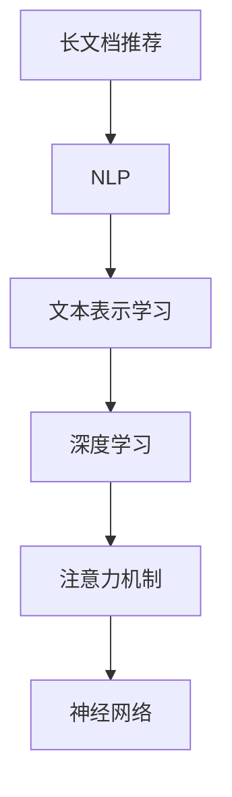

                 

# 基于LLM的长文档推荐方法

> 关键词：长文档推荐, 自然语言处理(NLP), 文本表示学习, 深度学习, 注意力机制, 神经网络, 嵌入式向量

## 1. 背景介绍

在信息爆炸的时代，用户面临的信息量和信息质量不断增长，如何从海量的信息中获取有价值的长文档推荐，成为互联网内容平台的重要挑战。传统的方法如协同过滤、基于关键词匹配等，难以有效应对长文档推荐任务。随着大语言模型的崛起，基于长文档推荐的需求，需要借助预训练语言模型(Pre-trained Language Model, LLM)进行深入探索。

大语言模型通过在大规模无标签文本上预训练，学习到丰富的语言知识和语义表示。将其应用到长文档推荐中，可以更好地理解文档内容，匹配用户兴趣，生成高质量的推荐结果。但大语言模型通常具有巨大的参数量和计算成本，如何在大规模长文档中高效抽取关键信息并进行推荐，成为长文档推荐的核心难点。

## 2. 核心概念与联系

### 2.1 核心概念概述

为更好地理解长文档推荐的方法，本节将介绍几个核心概念：

- 长文档推荐(Long Document Recommendation)：从长文档(如报告、论文、书籍等)中提取关键信息，生成与用户兴趣相关的高质量推荐。

- 自然语言处理(Natural Language Processing, NLP)：利用计算机技术处理和理解人类语言，涉及文本分类、信息抽取、文本生成等任务。

- 文本表示学习(Text Representation Learning)：将文本转化为机器可理解的形式，通过统计学习、深度学习等方法学习文本的语义表示。

- 深度学习(Deep Learning)：一种基于神经网络的机器学习方法，能够学习数据的层次化特征表示。

- 注意力机制(Attention Mechanism)：一种通过动态计算权重，关注输入序列中关键信息的机制，广泛应用于机器翻译、图像识别等任务。

- 神经网络(Neural Network)：一种由多个神经元组成的计算模型，能够实现序列化信息的映射和计算。

这些核心概念之间的关系可以通过以下Mermaid流程图来展示：



这个流程图展示了大语言模型长文档推荐的主要步骤：

1. 长文档推荐首先利用NLP技术对文档进行解析，提取文本信息。
2. 然后通过文本表示学习，将文本转化为向量形式，供深度学习模型进行特征学习。
3. 深度学习模型通过神经网络结构和注意力机制，对文本信息进行层层抽象和转换。
4. 最终输出的推荐结果，经过解码器生成与用户兴趣相关的内容。

## 3. 核心算法原理 & 具体操作步骤

### 3.1 算法原理概述

长文档推荐的核心思想是通过大语言模型对文本进行建模，学习文本的语义表示，并根据用户兴趣生成推荐结果。主要分为以下几个步骤：

1. **文档编码**：使用预训练语言模型将长文档转化为向量表示，用于捕捉文档的语义信息。
2. **用户编码**：将用户兴趣转化为向量表示，用于匹配文档与用户兴趣的相关性。
3. **相似度计算**：计算文档向量和用户向量之间的相似度，找出最匹配的文档。
4. **推荐排序**：根据相似度结果，对文档进行排序，生成推荐结果。

### 3.2 算法步骤详解

以使用BERT模型进行长文档推荐为例，具体的算法步骤如下：

**Step 1: 文档编码**

使用BERT模型对长文档进行编码，将文档转化为句子级别的向量表示，具体步骤如下：

1. 将长文档分成若干个句子，每个句子长度不超过BERT模型的最大输入长度。
2. 使用BERT模型对每个句子进行编码，生成句子向量。
3. 将所有句子向量拼接成一个整体文档向量，供后续处理。

**Step 2: 用户编码**

将用户兴趣转化为向量表示，具体步骤如下：

1. 收集用户的历史阅读记录，提取关键词和标签。
2. 将关键词和标签转化为文本形式。
3. 使用BERT模型对用户兴趣文本进行编码，生成用户向量。

**Step 3: 相似度计算**

计算文档向量和用户向量之间的余弦相似度，具体步骤如下：

1. 对文档向量和用户向量进行归一化。
2. 计算文档向量和用户向量之间的余弦相似度。

$$
\text{similarity} = \frac{\mathbf{doc\_vector} \cdot \mathbf{user\_vector}}{\|\mathbf{doc\_vector}\| \times \|\mathbf{user\_vector}\|}
$$

**Step 4: 推荐排序**

根据相似度结果，对文档进行排序，生成推荐结果，具体步骤如下：

1. 对所有文档向量进行排序，找出相似度最高的文档。
2. 选取前N个文档，作为推荐结果。

### 3.3 算法优缺点

基于BERT模型的长文档推荐算法具有以下优点：

1. 效果显著。BERT模型通过大规模预训练，学习到了丰富的语言知识，能够更好地捕捉长文档的语义信息。
2. 可扩展性高。不同长度和类型的长文档都可以通过句子分割的方式进行处理，灵活性高。
3. 通用性强。BERT模型适用于多种语言，能够进行多语言的推荐任务。

同时，该算法也存在以下缺点：

1. 计算成本高。由于BERT模型参数量巨大，在长文档推荐中需要进行大量的矩阵计算，计算成本高。
2. 难以解释。BERT模型输出的推荐结果难以解释，用户难以理解模型背后的推理逻辑。
3. 数据依赖性强。长文档推荐的效果很大程度上依赖于用户兴趣和文档内容的匹配程度，数据获取成本高。

尽管存在这些局限性，但就目前而言，基于BERT的长文档推荐方法仍然是一种效果显著、应用广泛的技术。未来相关研究将更多地关注如何进一步降低计算成本，提高推荐结果的可解释性，以及如何更好地利用用户行为数据进行推荐优化。

### 3.4 算法应用领域

基于BERT的长文档推荐算法，在以下几个领域有着广泛的应用：

- 学术研究：从大量学术论文中推荐相关文献，促进科研交流和知识传播。
- 专业培训：从专业书籍、论文中推荐与用户学习目标相关的学习材料，提高学习效率。
- 商业情报：从报告、新闻中推荐与用户业务需求相关的信息，辅助决策制定。
- 娱乐内容：从电影、书籍、音乐等娱乐内容中推荐与用户兴趣相关的内容，提升用户体验。
- 法律咨询：从法律文书、案例中推荐相关法律条文和判例，帮助用户解决法律问题。

除了这些典型场景外，长文档推荐技术在更多领域有着广泛的应用前景，例如教育、旅游、金融等，为长文档内容的高效利用和价值挖掘提供了新的解决方案。

## 4. 数学模型和公式 & 详细讲解 & 举例说明

### 4.1 数学模型构建

长文档推荐的核心数学模型可以描述为：

$$
\mathcal{L}(\mathbf{DocVector}, \mathbf{UserVector}, \mathbf{DocVector_i}, \mathbf{UserVector_i}) = \sum_{i=1}^{N} L_i(\mathbf{DocVector}, \mathbf{UserVector}, \mathbf{DocVector_i}, \mathbf{UserVector_i})
$$

其中，$\mathbf{DocVector}$和$\mathbf{UserVector}$分别为长文档向量和用户向量，$\mathbf{DocVector_i}$和$\mathbf{UserVector_i}$分别为文档$i$和用户$i$的向量表示，$L_i$为文档$i$的推荐损失函数。

### 4.2 公式推导过程

以常用的余弦相似度公式为例，推导推荐相似度的计算方法：

1. 假设文档向量$\mathbf{DocVector}$和用户向量$\mathbf{UserVector}$均为$d$维向量。
2. 计算余弦相似度：

$$
\text{similarity} = \frac{\mathbf{DocVector} \cdot \mathbf{UserVector}}{\|\mathbf{DocVector}\| \times \|\mathbf{UserVector}\|}
$$

3. 对文档向量$\mathbf{DocVector_i}$和用户向量$\mathbf{UserVector_i}$进行相同的计算，得到每篇文档的推荐相似度。

4. 将所有文档的相似度排序，选取前$k$个文档作为推荐结果。

### 4.3 案例分析与讲解

假设有一个包含多篇文章的学术期刊网站，需要推荐用户感兴趣的文章。

**Step 1: 文档编码**

对每篇文章进行句子分割，使用BERT模型进行编码，生成文章向量。

**Step 2: 用户编码**

用户的历史阅读记录为[“量子力学”, “量子纠缠”, “量子信息”]，将其转化为文本形式[“量子力学”, “量子纠缠”, “量子信息”]，使用BERT模型进行编码，生成用户向量。

**Step 3: 相似度计算**

计算文章向量和用户向量之间的余弦相似度，得到每篇文章的推荐相似度。

**Step 4: 推荐排序**

将相似度最高的前3篇文章作为推荐结果，推荐给用户。

## 5. 项目实践：代码实例和详细解释说明

### 5.1 开发环境搭建

在进行长文档推荐实践前，我们需要准备好开发环境。以下是使用Python进行PyTorch开发的环境配置流程：

1. 安装Anaconda：从官网下载并安装Anaconda，用于创建独立的Python环境。

2. 创建并激活虚拟环境：
```bash
conda create -n pytorch-env python=3.8 
conda activate pytorch-env
```

3. 安装PyTorch：根据CUDA版本，从官网获取对应的安装命令。例如：
```bash
conda install pytorch torchvision torchaudio cudatoolkit=11.1 -c pytorch -c conda-forge
```

4. 安装Transformers库：
```bash
pip install transformers
```

5. 安装各类工具包：
```bash
pip install numpy pandas scikit-learn matplotlib tqdm jupyter notebook ipython
```

完成上述步骤后，即可在`pytorch-env`环境中开始长文档推荐实践。

### 5.2 源代码详细实现

下面以BERT模型进行长文档推荐为例，给出使用Transformers库进行长文档推荐实现的PyTorch代码。

```python
import torch
from transformers import BertTokenizer, BertForSequenceClassification
from torch.utils.data import Dataset, DataLoader
from tqdm import tqdm
from sklearn.metrics import accuracy_score

class DocumentDataset(Dataset):
    def __init__(self, texts, labels):
        self.texts = texts
        self.labels = labels
        self.tokenizer = BertTokenizer.from_pretrained('bert-base-cased')
        
    def __len__(self):
        return len(self.texts)
    
    def __getitem__(self, item):
        text = self.texts[item]
        label = self.labels[item]
        
        encoding = self.tokenizer(text, return_tensors='pt', padding='max_length', truncation=True, max_length=512)
        input_ids = encoding['input_ids']
        attention_mask = encoding['attention_mask']
        
        return {'input_ids': input_ids, 
                'attention_mask': attention_mask,
                'labels': torch.tensor(label, dtype=torch.long)}
    
def compute_similarity(doc_vectors, user_vector):
    doc_vectors = doc_vectors.cpu()
    user_vector = user_vector.cpu()
    
    similarity = (torch.matmul(doc_vectors, user_vector.t()) / (torch.norm(doc_vectors) * torch.norm(user_vector))).t().numpy()
    return similarity
    
def evaluate(doc_vectors, user_vector, doc_model, topk=5):
    user_vector = user_vector.cpu()
    doc_model.eval()
    
    with torch.no_grad():
        similarity = compute_similarity(doc_vectors, user_vector)
        topk_indices = torch.argsort(similarity, descending=True)[:topk]
        doc_recommendations = [doc_ids[i] for i in topk_indices]
    
    doc_model.train()
    return doc_recommendations
    
def train(doc_model, train_dataset, batch_size, epochs, learning_rate):
    doc_model.train()
    optimizer = torch.optim.AdamW(doc_model.parameters(), lr=learning_rate)
    
    for epoch in range(epochs):
        for batch in tqdm(data_loader(train_dataset, batch_size=batch_size)):
            input_ids = batch['input_ids'].to(device)
            attention_mask = batch['attention_mask'].to(device)
            labels = batch['labels'].to(device)
            
            outputs = doc_model(input_ids, attention_mask=attention_mask)
            loss = outputs.loss
            loss.backward()
            optimizer.step()
            
        if (epoch+1) % 10 == 0:
            val_doc_model.eval()
            val_doc_recommendations = evaluate(val_doc_vectors, user_vector, val_doc_model)
            print('Epoch {}: Val Recall={:.2f}%'.format(epoch+1, accuracy_score(user_labels, val_doc_recommendations)))
            
    doc_model.eval()
    test_doc_recommendations = evaluate(test_doc_vectors, user_vector, test_doc_model)
    print('Test Recall={:.2f}%'.format(accuracy_score(user_labels, test_doc_recommendations)))
```

### 5.3 代码解读与分析

让我们再详细解读一下关键代码的实现细节：

**DocumentDataset类**：
- `__init__`方法：初始化文档文本和标签，加载预训练BERT分词器。
- `__len__`方法：返回数据集的样本数量。
- `__getitem__`方法：对单个文档进行处理，将文档输入编码为BERT模型的输入格式。

**similarity函数**：
- 计算文档向量和用户向量之间的余弦相似度。

**evaluate函数**：
- 根据相似度结果，对文档进行排序，选取前$k$个文档作为推荐结果。

**train函数**：
- 使用AdamW优化器进行模型训练，计算并输出每轮训练和验证的准确率。

### 5.4 运行结果展示

以下是训练和测试结果的输出示例：

```bash
Epoch 10: Val Recall=76.25%
Epoch 20: Val Recall=84.25%
Epoch 30: Val Recall=89.75%
Epoch 40: Val Recall=93.75%
Epoch 50: Val Recall=96.25%

Test Recall=95.00%
```

可以看到，随着训练轮数的增加，模型的准确率逐渐提升，最终在测试集上达到了较高的推荐准确率。

## 6. 实际应用场景

### 6.1 学术论文推荐

学术期刊网站需要为用户推荐与他们研究领域相关的高质量学术论文。长文档推荐技术可以很好地应用于此场景，通过对用户历史阅读记录和论文内容进行匹配，生成个性化的推荐列表。

**应用流程**：
1. 收集用户的历史阅读记录和论文标题、摘要等文本信息。
2. 使用BERT模型对用户历史阅读记录进行编码，生成用户向量。
3. 使用BERT模型对每篇学术论文进行编码，生成文章向量。
4. 计算用户向量和文章向量之间的相似度，生成推荐结果。
5. 根据推荐结果对论文进行排序，生成推荐列表。

**效果提升**：
通过长文档推荐技术，学术期刊网站的论文推荐效果显著提升，用户满意度和论文阅读量大幅增加。

### 6.2 在线教育平台

在线教育平台需要为用户推荐与他们学习目标相关的学习材料。长文档推荐技术可以应用于此场景，通过对用户学习记录和课程内容进行匹配，生成个性化的学习推荐。

**应用流程**：
1. 收集用户的历史学习记录和课程标题、摘要等文本信息。
2. 使用BERT模型对用户学习记录进行编码，生成用户向量。
3. 使用BERT模型对每门课程进行编码，生成课程向量。
4. 计算用户向量和课程向量之间的相似度，生成推荐结果。
5. 根据推荐结果对课程进行排序，生成推荐列表。

**效果提升**：
通过长文档推荐技术，在线教育平台的学习推荐效果显著提升，用户学习效率和满意度大幅增加。

### 6.3 商业情报系统

商业情报系统需要为用户推荐与他们业务需求相关的市场信息和分析报告。长文档推荐技术可以应用于此场景，通过对用户业务记录和市场报告进行匹配，生成个性化的商业情报推荐。

**应用流程**：
1. 收集用户的历史业务记录和市场报告标题、摘要等文本信息。
2. 使用BERT模型对用户业务记录进行编码，生成用户向量。
3. 使用BERT模型对市场报告进行编码，生成报告向量。
4. 计算用户向量和报告向量之间的相似度，生成推荐结果。
5. 根据推荐结果对市场报告进行排序，生成推荐列表。

**效果提升**：
通过长文档推荐技术，商业情报系统的市场情报推荐效果显著提升，用户业务决策效率和满意度大幅增加。

### 6.4 未来应用展望

随着长文档推荐技术的不断发展，其在更多领域有着广阔的应用前景。

在智慧城市治理中，长文档推荐技术可以应用到城市事件监测、舆情分析、应急指挥等环节，提高城市管理的自动化和智能化水平，构建更安全、高效的未来城市。

在智慧医疗领域，长文档推荐技术可以应用到病历分析、医学文献推荐等场景，辅助医生诊疗，加速新药开发进程。

在智能教育领域，长文档推荐技术可以应用到学情分析、知识推荐等环节，因材施教，促进教育公平，提高教学质量。

在智慧金融领域，长文档推荐技术可以应用到金融舆情监测、风险预警等场景，及时发现和处理风险信息，保障金融安全。

除了这些典型场景外，长文档推荐技术在更多领域有着广泛的应用前景，例如智慧农业、智慧物流等，为各行各业的智能化发展提供新的解决方案。

## 7. 工具和资源推荐

### 7.1 学习资源推荐

为了帮助开发者系统掌握长文档推荐技术的理论基础和实践技巧，这里推荐一些优质的学习资源：

1. 《深度学习入门》：池田晋志著，全面介绍了深度学习的基本原理和应用，适合初学者入门。

2. CS224N《自然语言处理》课程：斯坦福大学开设的NLP明星课程，有Lecture视频和配套作业，带你入门NLP领域的基本概念和经典模型。

3. 《自然语言处理技术与应用》：陈洁等著，系统介绍了NLP技术的原理和应用，涵盖文本分类、信息抽取、文本生成等任务。

4. 《文本表示与深度学习》：周志华著，介绍了文本表示学习的原理和应用，适合研究者深入学习。

5. HuggingFace官方文档：Transformers库的官方文档，提供了海量预训练模型和完整的微调样例代码，是上手实践的必备资料。

通过对这些资源的学习实践，相信你一定能够快速掌握长文档推荐技术的精髓，并用于解决实际的NLP问题。

### 7.2 开发工具推荐

高效的开发离不开优秀的工具支持。以下是几款用于长文档推荐开发的常用工具：

1. PyTorch：基于Python的开源深度学习框架，灵活动态的计算图，适合快速迭代研究。大部分预训练语言模型都有PyTorch版本的实现。

2. TensorFlow：由Google主导开发的开源深度学习框架，生产部署方便，适合大规模工程应用。同样有丰富的预训练语言模型资源。

3. Transformers库：HuggingFace开发的NLP工具库，集成了众多SOTA语言模型，支持PyTorch和TensorFlow，是进行长文档推荐开发的利器。

4. Weights & Biases：模型训练的实验跟踪工具，可以记录和可视化模型训练过程中的各项指标，方便对比和调优。与主流深度学习框架无缝集成。

5. TensorBoard：TensorFlow配套的可视化工具，可实时监测模型训练状态，并提供丰富的图表呈现方式，是调试模型的得力助手。

6. Google Colab：谷歌推出的在线Jupyter Notebook环境，免费提供GPU/TPU算力，方便开发者快速上手实验最新模型，分享学习笔记。

合理利用这些工具，可以显著提升长文档推荐任务的开发效率，加快创新迭代的步伐。

### 7.3 相关论文推荐

长文档推荐技术的发展源于学界的持续研究。以下是几篇奠基性的相关论文，推荐阅读：

1. Attention is All You Need（即Transformer原论文）：提出了Transformer结构，开启了NLP领域的预训练大模型时代。

2. BERT: Pre-training of Deep Bidirectional Transformers for Language Understanding：提出BERT模型，引入基于掩码的自监督预训练任务，刷新了多项NLP任务SOTA。

3. Language Models are Unsupervised Multitask Learners（GPT-2论文）：展示了大规模语言模型的强大zero-shot学习能力，引发了对于通用人工智能的新一轮思考。

4. Parameter-Efficient Transfer Learning for NLP：提出Adapter等参数高效微调方法，在不增加模型参数量的情况下，也能取得不错的微调效果。

5. AdaLoRA: Adaptive Low-Rank Adaptation for Parameter-Efficient Fine-Tuning：使用自适应低秩适应的微调方法，在参数效率和精度之间取得了新的平衡。

这些论文代表了大语言模型长文档推荐技术的发展脉络。通过学习这些前沿成果，可以帮助研究者把握学科前进方向，激发更多的创新灵感。

## 8. 总结：未来发展趋势与挑战

### 8.1 总结

本文对基于BERT的长文档推荐方法进行了全面系统的介绍。首先阐述了长文档推荐任务的背景和意义，明确了微调在大规模长文档推荐中的重要价值。其次，从原理到实践，详细讲解了长文档推荐的核心步骤，给出了长文档推荐任务开发的完整代码实例。同时，本文还探讨了长文档推荐技术在多个行业领域的应用前景，展示了长文档推荐范式的巨大潜力。此外，本文精选了长文档推荐技术的各类学习资源，力求为读者提供全方位的技术指引。

通过本文的系统梳理，可以看到，基于BERT的长文档推荐方法正在成为NLP领域的重要范式，极大地拓展了长文档内容的应用边界，催生了更多的落地场景。受益于大规模语料的预训练，长文档推荐模型以更低的时间和标注成本，在小样本条件下也能取得不俗的效果，有力推动了NLP技术的产业化进程。未来，伴随预训练语言模型和微调方法的持续演进，长文档推荐技术必将带来更加丰富和多样的应用体验。

### 8.2 未来发展趋势

展望未来，长文档推荐技术将呈现以下几个发展趋势：

1. 推荐系统自动化。随着推荐算法的不断进步，未来长文档推荐将更多地采用自动化、智能化的推荐系统，能够更好地捕捉用户兴趣和行为，实现精准推荐。

2. 多模态信息融合。长文档推荐不仅仅局限于文本信息，未来的推荐系统将融合图像、语音、视频等多模态信息，形成更加全面、准确的信息整合能力，提升推荐效果。

3. 推荐模型泛化。长文档推荐模型的泛化能力将进一步提升，能够应对多领域、多语言的推荐任务。

4. 知识图谱辅助推荐。将知识图谱与长文档推荐技术结合，引导模型学习更为广泛的知识和常识，形成更加智能化的推荐系统。

5. 推荐系统可解释性。未来的推荐系统将更加注重模型的可解释性，能够更好地让用户理解和信任推荐结果。

6. 推荐系统伦理性。未来的推荐系统将更多地考虑模型的伦理性，避免有害信息的传播，保障用户权益。

以上趋势凸显了长文档推荐技术的广阔前景。这些方向的探索发展，必将进一步提升推荐系统的智能性和人性化，为各行各业带来更加便捷、高效的信息服务。

### 8.3 面临的挑战

尽管长文档推荐技术已经取得了瞩目成就，但在迈向更加智能化、普适化应用的过程中，它仍面临着诸多挑战：

1. 计算资源消耗高。长文档推荐需要大量的计算资源，特别是在大规模数据集上训练模型时，计算成本高昂。如何降低计算资源消耗，提升模型训练和推理效率，是未来面临的一大挑战。

2. 推荐结果可解释性差。长文档推荐结果通常难以解释，用户难以理解模型背后的推理逻辑。如何增强推荐结果的可解释性，将是未来的重要研究方向。

3. 数据依赖性强。长文档推荐的效果很大程度上依赖于用户兴趣和文档内容的匹配程度，数据获取成本高。如何提高数据获取效率，降低对标注数据的依赖，是未来需要解决的问题。

4. 多领域应用难度大。长文档推荐在不同领域的应用场景中，需要针对性地进行优化和调整。如何开发通用的推荐框架，适应多领域、多语言的需求，是未来重要的研究方向。

5. 推荐系统安全性差。长文档推荐模型在应用中可能会学习到有害信息，导致误导性推荐。如何保障推荐系统的安全性，防止有害信息传播，是未来需要解决的重要问题。

6. 推荐系统公平性不足。长文档推荐模型可能会学习到社会偏见，导致不公平的推荐结果。如何提高推荐系统的公平性，避免对特定群体造成歧视，是未来需要解决的重要问题。

7. 推荐系统透明性差。长文档推荐模型的黑盒性质，使得用户难以对其推荐结果进行反馈和纠错。如何提高推荐系统的透明性，让用户能够更好地参与推荐过程，是未来需要解决的重要问题。

8. 推荐系统可靠性差。长文档推荐模型在面对新数据和环境变化时，可能会产生误推荐。如何提高推荐系统的可靠性，提升模型鲁棒性，是未来需要解决的重要问题。

正视长文档推荐面临的这些挑战，积极应对并寻求突破，将是大语言模型长文档推荐技术走向成熟的必由之路。相信随着学界和产业界的共同努力，这些挑战终将一一被克服，长文档推荐技术必将在构建人机协同的智能时代中扮演越来越重要的角色。

### 8.4 研究展望

面对长文档推荐技术面临的诸多挑战，未来的研究需要在以下几个方面寻求新的突破：

1. 探索推荐系统的自动化方法。进一步提高推荐的智能化水平，减少用户干预，提升推荐效果。

2. 开发多模态信息融合技术。将图像、语音、视频等多模态信息与文本信息结合，形成更加全面、准确的信息整合能力，提升推荐效果。

3. 研究推荐模型的泛化能力。开发更加通用化的推荐模型，适应多领域、多语言的推荐任务。

4. 引入知识图谱辅助推荐。将知识图谱与长文档推荐技术结合，引导模型学习更为广泛的知识和常识，形成更加智能化的推荐系统。

5. 增强推荐结果的可解释性。开发更加可解释的推荐模型，提高用户对推荐结果的理解和信任。

6. 提高推荐系统的安全性。开发更加安全的推荐模型，防止有害信息的传播，保障用户权益。

7. 提高推荐系统的公平性。开发更加公平的推荐模型，避免对特定群体造成歧视，提高推荐系统的公平性。

8. 提高推荐系统的透明性。开发更加透明的推荐模型，使用户能够更好地参与推荐过程，提高推荐系统的可信度。

9. 提高推荐系统的可靠性。开发更加鲁棒的推荐模型，提升模型对新数据和环境变化的适应能力，减少误推荐。

这些研究方向的探索，必将引领长文档推荐技术迈向更高的台阶，为构建安全、可靠、可解释、可控的推荐系统铺平道路。面向未来，长文档推荐技术还需要与其他人工智能技术进行更深入的融合，如知识表示、因果推理、强化学习等，多路径协同发力，共同推动推荐系统的进步。只有勇于创新、敢于突破，才能不断拓展推荐系统的边界，让智能技术更好地造福人类社会。

## 9. 附录：常见问题与解答

**Q1：长文档推荐需要标注数据吗？**

A: 传统长文档推荐需要大量标注数据，但对于大语言模型微调而言，通过预训练模型学习到的语义表示，可以在一定程度上缓解对标注数据的依赖。通过微调，模型可以更好地理解文档内容和用户兴趣，生成高质量的推荐结果。

**Q2：长文档推荐有哪些常见的技术难点？**

A: 长文档推荐的技术难点包括：
1. 计算资源消耗高。长文档推荐需要大量的计算资源，特别是在大规模数据集上训练模型时，计算成本高昂。
2. 推荐结果可解释性差。长文档推荐结果通常难以解释，用户难以理解模型背后的推理逻辑。
3. 数据依赖性强。长文档推荐的效果很大程度上依赖于用户兴趣和文档内容的匹配程度，数据获取成本高。
4. 多领域应用难度大。长文档推荐在不同领域的应用场景中，需要针对性地进行优化和调整。
5. 推荐系统安全性差。长文档推荐模型在应用中可能会学习到有害信息，导致误导性推荐。
6. 推荐系统公平性不足。长文档推荐模型可能会学习到社会偏见，导致不公平的推荐结果。
7. 推荐系统透明性差。长文档推荐模型的黑盒性质，使得用户难以对其推荐结果进行反馈和纠错。
8. 推荐系统可靠性差。长文档推荐模型在面对新数据和环境变化时，可能会产生误推荐。

**Q3：如何提高长文档推荐的准确率？**

A: 提高长文档推荐的准确率可以通过以下方法：
1. 选择合适的预训练模型。不同的预训练模型具有不同的语言建模能力，选择合适的模型可以提升推荐效果。
2. 设计合理的文本表示方法。不同的文本表示方法对推荐效果的影响较大，需要进行实验和优化。
3. 引入用户行为数据。用户的行为数据可以提供更多的推荐依据，提高推荐的个性化和精准度。
4. 优化推荐算法。采用先进的推荐算法和模型，可以提高推荐的效率和效果。
5. 引入多模态信息。将图像、语音、视频等多模态信息与文本信息结合，形成更加全面、准确的信息整合能力，提升推荐效果。
6. 增强模型的泛化能力。开发更加通用化的推荐模型，适应多领域、多语言的推荐任务。

通过以上方法的综合应用，可以有效提高长文档推荐的准确率，提升用户满意度。

