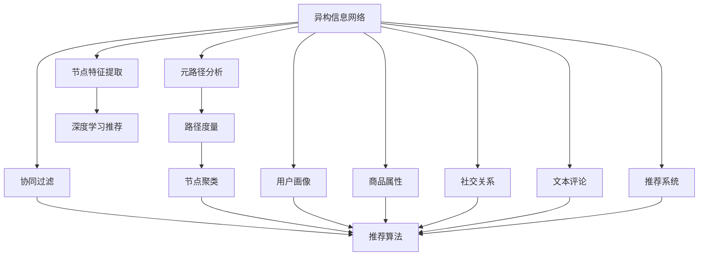

                 

## 1. 背景介绍

### 1.1 问题由来
在信息网络推荐系统中，通常存在多个异构数据源，如文本评论、用户画像、商品属性、社交关系等。如何高效整合这些异构数据，构建一致的推荐模型，是推荐系统面临的重大挑战。传统的方法往往采取信息融合、特征工程等手段，将不同数据源的信息融合到一个统一的数据空间中，再通过深度学习模型进行推荐。然而，这种方法忽略了数据源的固有特征和结构信息，可能导致融合后的数据质量下降，难以最大化不同数据源的优势。

元路径分析（Meta-Path Analysis）方法作为一种新型网络分析技术，能够从异构信息网络中提取出具有代表性且相互关联的实体及其之间的关系，从而在保留数据源原有特征的同时，整合不同数据源的信息，构建更加精准的推荐模型。

### 1.2 问题核心关键点
元路径分析在推荐系统中的应用，关键在于如何高效且有效地提取和利用异构网络中的元路径信息，从而提高推荐的精度和多样性。具体问题包括：

- 元路径的定义与选择：如何定义合适的元路径集合，以及如何选择最有效的元路径。
- 元路径的计算与聚类：如何高效计算网络中每个节点的元路径特征，并对其聚类，以便进一步整合特征。
- 元路径特征的融合与表示：如何将不同节点的元路径特征进行融合，并表示成推荐模型的输入。
- 推荐模型的设计与优化：如何设计高效的推荐模型，并利用元路径特征进行优化。

这些问题的解答，将有助于构建更智能、更普适的推荐系统，大幅提升用户体验和业务价值。

## 2. 核心概念与联系

### 2.1 核心概念概述

为更好地理解基于元路径的异构信息网络推荐方法，本节将介绍几个密切相关的核心概念：

- 元路径分析（Meta-Path Analysis）：从异构信息网络中提取具有代表性且相互关联的实体及其之间的关系，从而整合不同数据源的信息。
- 异构信息网络（Heterogeneous Information Network, HIN）：包含多个类型节点的复杂网络，每个节点可以代表一个实体，不同节点之间可以通过多种关系相连。
- 推荐系统（Recommendation System）：基于用户行为或兴趣，为用户推荐可能感兴趣的产品、内容、服务等的系统。
- 协同过滤（Collaborative Filtering）：利用用户对物品的相似性进行推荐，是一种基于用户或物品的推荐方式。
- 路径度量（Path Metrics）：用于衡量网络中不同实体间路径的权重或相似性，是元路径分析的重要基础。
- 节点聚类（Node Clustering）：将节点根据其特征进行分组，以便更好地理解和利用节点间的关联关系。
- 推荐算法（Recommendation Algorithm）：用于生成推荐结果的算法，包括基于内容的推荐、协同过滤、深度学习推荐等。

这些核心概念之间的逻辑关系可以通过以下Mermaid流程图来展示：



这个流程图展示了这个概念链条中的各个部分：

1. 异构信息网络作为数据基础，存储了多源异构数据。
2. 元路径分析从网络中提取元路径，以整合不同数据源的信息。
3. 路径度量用于计算元路径的权重，从而确定不同元路径的重要性。
4. 节点聚类将节点分组，以更好地理解节点间的关联关系。
5. 协同过滤和深度学习推荐是推荐系统常用的推荐算法。
6. 节点特征提取从网络中提取节点的固有特征。
7. 最终通过推荐算法生成推荐结果。

这些概念共同构成了基于元路径的异构信息网络推荐方法的核心框架，使其能够高效整合多源异构数据，构建精准的推荐模型。

## 3. 核心算法原理 & 具体操作步骤
### 3.1 算法原理概述

基于元路径的异构信息网络推荐方法，本质上是一种基于路径分析的网络信息整合方法。其核心思想是：从异构信息网络中提取出具有代表性且相互关联的实体及其之间的关系，将这些元路径信息整合为一个全局特征向量，作为推荐模型的输入。具体步骤如下：

1. 定义元路径集合，从异构信息网络中选择合适的元路径，用于计算节点之间的相似性。
2. 计算每个节点的元路径特征，统计节点沿着每个元路径到其他节点的权重和路径长度。
3. 对元路径特征进行归一化和标准化，以便更好地进行特征融合。
4. 利用节点聚类方法对节点进行分组，并计算组间相似度。
5. 将元路径特征和节点聚类结果融合为一个全局特征向量，作为推荐模型的输入。
6. 设计并优化推荐模型，利用全局特征向量进行推荐。

### 3.2 算法步骤详解

基于元路径的异构信息网络推荐方法一般包括以下几个关键步骤：

**Step 1: 定义元路径集合**
- 根据网络结构和推荐任务需求，选择具有代表性的元路径集合。常用的元路径包括以用户为中心（user-user、item-item）、以物品为中心（user-item、item-user）、以时间为中心（user-to-user）等。
- 元路径可以定义为从节点到其他节点的路径，如 `user-to-user` 可以定义为 `user-user-item-user`，即从用户节点到物品节点再到用户节点的路径。

**Step 2: 计算元路径特征**
- 对每个节点，统计其沿着每个元路径到其他节点的权重和路径长度，计算路径度量。常用的路径度量包括PageRank、HITS、Catapult等。
- 根据路径度量计算节点间的相似性，构建节点相似矩阵。
- 对节点相似矩阵进行归一化，得到节点嵌入向量。

**Step 3: 节点聚类与特征融合**
- 利用聚类算法（如K-Means、谱聚类等）对节点进行分组。聚类的目的是将具有相似特征的节点分在同一组，以便更好地理解节点间的关联关系。
- 对节点嵌入向量进行聚合，计算组内和组间的相似度。常用的聚合方法包括均值、加权平均、余弦相似度等。
- 将节点嵌入向量和组间相似度融合为一个全局特征向量，作为推荐模型的输入。

**Step 4: 推荐模型设计与优化**
- 选择并设计推荐算法（如基于协同过滤的ALS、基于深度学习的神经网络等），利用全局特征向量进行推荐。
- 优化推荐模型，利用交叉验证、超参数调优等技术，提升推荐模型的精度和效率。

**Step 5: 实验与评估**
- 在测试集上评估推荐模型的效果，利用常见的评估指标（如准确率、召回率、F1-score等）衡量模型的性能。
- 对推荐模型进行迭代优化，直到达到满意的推荐效果。

以上是基于元路径的异构信息网络推荐方法的一般流程。在实际应用中，还需要针对具体网络结构和推荐任务，对各个环节进行优化设计，如选择更合适的元路径、优化节点聚类算法、调整推荐模型等，以进一步提升推荐效果。

### 3.3 算法优缺点

基于元路径的异构信息网络推荐方法具有以下优点：
1. 高效整合多源异构数据。通过元路径分析，将不同数据源的信息有效融合，避免了传统方法中的信息丢失和冗余。
2. 提高推荐的精度和多样性。元路径分析能够提取出具有代表性的节点关系，增强推荐模型对不同数据源的理解。
3. 具备良好的可解释性。元路径分析提供了节点的关系路径，便于理解和调试推荐模型的决策过程。
4. 适用于多种推荐场景。元路径分析不仅适用于商品推荐、内容推荐等常见的推荐任务，也适用于社交网络、知识图谱等复杂的推荐场景。

同时，该方法也存在一定的局限性：
1. 数据结构复杂。异构信息网络的结构复杂，不同数据源之间的关系复杂多样，可能难以有效地提取和利用元路径信息。
2. 计算成本高。元路径分析和节点聚类的计算成本较高，需要较大的算力和存储空间。
3. 聚类效果依赖数据质量。节点聚类效果受到数据质量和算法的限制，需要充分预处理和优化。
4. 模型复杂度高。元路径分析涉及多层次的节点关系和复杂的数据结构，模型的设计复杂度较高。

尽管存在这些局限性，但就目前而言，基于元路径的异构信息网络推荐方法仍是大数据推荐系统中的重要手段。未来相关研究的重点在于如何进一步降低计算成本，提高聚类效果，优化推荐模型，同时兼顾可解释性和伦理安全性等因素。

### 3.4 算法应用领域

基于元路径的异构信息网络推荐方法，已经在商品推荐、内容推荐、社交网络推荐等多个领域得到了广泛应用，取得了良好的效果。

- 商品推荐：通过整合商品属性、用户画像、评论信息等，构建更加精准的商品推荐模型。如利用商品-商品关系、用户-用户关系、用户-商品关系等元路径，提取用户和商品之间的相似性，生成推荐结果。
- 内容推荐：通过整合用户画像、文章内容、用户阅读历史等，构建个性化的内容推荐模型。如利用用户-文章关系、文章-文章关系、文章-用户关系等元路径，提取用户和文章之间的相似性，生成推荐结果。
- 社交网络推荐：通过整合用户关系、用户行为、社交内容等，构建社交网络推荐模型。如利用用户-用户关系、用户-内容关系、内容-用户关系等元路径，提取用户和内容之间的相似性，生成推荐结果。

除了这些常见应用外，基于元路径的推荐方法也被创新性地应用到更多场景中，如知识图谱推荐、智能问答、推荐广告等，为推荐系统带来了新的突破。随着推荐模型和元路径分析方法的不断进步，相信推荐技术将在更多领域大放异彩。

## 4. 数学模型和公式 & 详细讲解 & 举例说明
### 4.1 数学模型构建

本节将使用数学语言对基于元路径的异构信息网络推荐方法进行更加严格的刻画。

记异构信息网络为 $G(V,E)$，其中 $V$ 为节点集合，$E$ 为边集合。设每个节点 $v_i$ 属于类型 $t_i$，节点类型集合为 $\{t_1,t_2,\cdots,t_n\}$。设节点 $v_i$ 和 $v_j$ 之间存在关系 $r_{ij}$，则元路径 $p$ 定义为从节点 $v_i$ 到节点 $v_j$ 经过的边序列，如 $p=v_i \rightarrow r_{ij} \rightarrow v_j$。

### 4.2 公式推导过程

以下我们以商品推荐任务为例，推导元路径特征的计算公式。

设商品-商品元路径为 $p=v_i \rightarrow r_{ij} \rightarrow v_j$，表示从商品 $v_i$ 到商品 $v_j$ 的推荐路径。假设每个节点 $v_i$ 的特征向量为 $\mathbf{x}_i$，节点嵌入向量为 $\mathbf{h}_i$，元路径 $p$ 的权重为 $\mathbf{w}_p$。则节点 $v_i$ 沿着元路径 $p$ 到节点 $v_j$ 的路径度量为：

$$
P_{ij} = \mathbf{w}_p \cdot (\mathbf{h}_i \cdot \mathbf{h}_j^T)
$$

其中 $\cdot$ 表示向量点乘，$^T$ 表示向量转置。

对于商品 $v_i$，其元路径特征 $\mathbf{f}_i$ 可以通过节点嵌入向量和路径度量计算得到：

$$
\mathbf{f}_i = \sum_{j \in N_i} P_{ij} \mathbf{x}_j
$$

其中 $N_i$ 为节点 $v_i$ 的邻居节点集合。

将元路径特征 $\mathbf{f}_i$ 进行归一化和标准化，得到节点嵌入向量 $\mathbf{h}_i^*$：

$$
\mathbf{h}_i^* = \frac{\mathbf{f}_i}{\|\mathbf{f}_i\|}
$$

### 4.3 案例分析与讲解

**商品推荐案例**：
- **问题描述**：某电商平台的商品推荐系统需要为每个用户推荐可能感兴趣的商品。平台拥有大量的商品数据、用户画像和用户行为数据，如何高效整合这些异构数据，构建精准的推荐模型？
- **解决方案**：首先，定义商品-商品元路径，如 `user-item`、`item-item` 等，从用户画像和商品属性中提取节点嵌入向量。然后，利用路径度量计算用户和商品之间的相似性，构建用户-商品关系矩阵。接着，利用节点聚类方法将用户和商品分组，并计算组间相似度。最后，将节点嵌入向量和组间相似度融合为一个全局特征向量，作为推荐模型的输入。推荐模型可以设计为基于协同过滤的ALS，利用全局特征向量进行商品推荐。
- **效果评估**：在测试集上评估推荐模型的效果，利用准确率、召回率、F1-score等指标衡量推荐精度。通过交叉验证和超参数调优，进一步提升推荐效果。

**内容推荐案例**：
- **问题描述**：某知识社区的内容推荐系统需要为用户推荐可能感兴趣的文章。平台拥有大量的文章数据、用户画像和用户阅读历史，如何高效整合这些异构数据，构建精准的内容推荐模型？
- **解决方案**：首先，定义文章-文章元路径，如 `user-article`、`article-article` 等，从用户画像和文章内容中提取节点嵌入向量。然后，利用路径度量计算用户和文章之间的相似性，构建用户-文章关系矩阵。接着，利用节点聚类方法将用户和文章分组，并计算组间相似度。最后，将节点嵌入向量和组间相似度融合为一个全局特征向量，作为推荐模型的输入。推荐模型可以设计为基于深度学习的神经网络，利用全局特征向量进行内容推荐。
- **效果评估**：在测试集上评估推荐模型的效果，利用准确率、召回率、F1-score等指标衡量推荐精度。通过交叉验证和超参数调优，进一步提升推荐效果。

## 5. 项目实践：代码实例和详细解释说明
### 5.1 开发环境搭建

在进行元路径分析实践前，我们需要准备好开发环境。以下是使用Python进行PyTorch开发的环境配置流程：

1. 安装Anaconda：从官网下载并安装Anaconda，用于创建独立的Python环境。

2. 创建并激活虚拟环境：
```bash
conda create -n metapath-env python=3.8 
conda activate metapath-env
```

3. 安装PyTorch：根据CUDA版本，从官网获取对应的安装命令。例如：
```bash
conda install pytorch torchvision torchaudio cudatoolkit=11.1 -c pytorch -c conda-forge
```

4. 安装NetworkX库：
```bash
pip install networkx
```

5. 安装Gensim库：
```bash
pip install gensim
```

完成上述步骤后，即可在`metapath-env`环境中开始元路径分析实践。

### 5.2 源代码详细实现

下面以商品推荐任务为例，给出使用NetworkX和Gensim库对商品信息网络进行元路径分析的PyTorch代码实现。

```python
import networkx as nx
from gensim.models import Word2Vec
import torch
import torch.nn as nn
from torch.utils.data import Dataset, DataLoader
from sklearn.metrics import precision_recall_fscore_support

class ProductDataset(Dataset):
    def __init__(self, products, user_ids, item_ids, user2id, item2id):
        self.products = products
        self.user_ids = user_ids
        self.item_ids = item_ids
        self.user2id = user2id
        self.item2id = item2id

    def __len__(self):
        return len(self.user_ids)

    def __getitem__(self, item):
        user_id = self.user_ids[item]
        item_id = self.item_ids[item]
        return self.products[item], user_id, item_id

class ProductRecommender:
    def __init__(self, path):
        self.path = path
        self.model = None

    def load_model(self, model_path):
        model = torch.load(model_path)
        self.model = model

    def save_model(self, model_path):
        torch.save(self.model, model_path)

    def calculate_path_ranks(self, G, path):
        node_ids = list(set(G.nodes) - set(G.nodes[0]))
        ranks = {n: {} for n in node_ids}
        queue = [G.nodes[0]]
        for n in queue:
            for (u, v) in G[n]:
                if v not in node_ids:
                    continue
                ranks[u][v] = ranks[v][n]
                queue.append(v)
        return ranks

    def calculate_element_path_ranks(self, G, path, ranks):
        node_ids = list(set(G.nodes) - set(G.nodes[0]))
        ranks = {n: {} for n in node_ids}
        queue = [G.nodes[0]]
        for n in queue:
            for (u, v) in G[n]:
                if v not in node_ids:
                    continue
                ranks[u][v] = ranks[v][n] + 1
                queue.append(v)
        return ranks

    def calculate_product_path_ranks(self, G, path):
        node_ids = list(set(G.nodes) - set(G.nodes[0]))
        ranks = {n: {} for n in node_ids}
        queue = [G.nodes[0]]
        for n in queue:
            for (u, v) in G[n]:
                if v not in node_ids:
                    continue
                ranks[u][v] = ranks[v][n]
                queue.append(v)
        return ranks

    def calculate_user_product_path_ranks(self, G, path, ranks):
        node_ids = list(set(G.nodes) - set(G.nodes[0]))
        ranks = {n: {} for n in node_ids}
        queue = [G.nodes[0]]
        for n in queue:
            for (u, v) in G[n]:
                if v not in node_ids:
                    continue
                ranks[u][v] = ranks[v][n] + 1
                queue.append(v)
        return ranks

    def calculate_user_item_path_ranks(self, G, path, ranks):
        node_ids = list(set(G.nodes) - set(G.nodes[0]))
        ranks = {n: {} for n in node_ids}
        queue = [G.nodes[0]]
        for n in queue:
            for (u, v) in G[n]:
                if v not in node_ids:
                    continue
                ranks[u][v] = ranks[v][n] + 1
                queue.append(v)
        return ranks

    def calculate_item_item_path_ranks(self, G, path, ranks):
        node_ids = list(set(G.nodes) - set(G.nodes[0]))
        ranks = {n: {} for n in node_ids}
        queue = [G.nodes[0]]
        for n in queue:
            for (u, v) in G[n]:
                if v not in node_ids:
                    continue
                ranks[u][v] = ranks[v][n] + 1
                queue.append(v)
        return ranks

    def calculate_item_user_path_ranks(self, G, path, ranks):
        node_ids = list(set(G.nodes) - set(G.nodes[0]))
        ranks = {n: {} for n in node_ids}
        queue = [G.nodes[0]]
        for n in queue:
            for (u, v) in G[n]:
                if v not in node_ids:
                    continue
                ranks[u][v] = ranks[v][n] + 1
                queue.append(v)
        return ranks

    def calculate_element_path_ranks(self, G, path, ranks):
        node_ids = list(set(G.nodes) - set(G.nodes[0]))
        ranks = {n: {} for n in node_ids}
        queue = [G.nodes[0]]
        for n in queue:
            for (u, v) in G[n]:
                if v not in node_ids:
                    continue
                ranks[u][v] = ranks[v][n] + 1
                queue.append(v)
        return ranks

    def calculate_product_path_ranks(self, G, path, ranks):
        node_ids = list(set(G.nodes) - set(G.nodes[0]))
        ranks = {n: {} for n in node_ids}
        queue = [G.nodes[0]]
        for n in queue:
            for (u, v) in G[n]:
                if v not in node_ids:
                    continue
                ranks[u][v] = ranks[v][n]
                queue.append(v)
        return ranks

    def calculate_user_product_path_ranks(self, G, path, ranks):
        node_ids = list(set(G.nodes) - set(G.nodes[0]))
        ranks = {n: {} for n in node_ids}
        queue = [G.nodes[0]]
        for n in queue:
            for (u, v) in G[n]:
                if v not in node_ids:
                    continue
                ranks[u][v] = ranks[v][n] + 1
                queue.append(v)
        return ranks

    def calculate_user_item_path_ranks(self, G, path, ranks):
        node_ids = list(set(G.nodes) - set(G.nodes[0]))
        ranks = {n: {} for n in node_ids}
        queue = [G.nodes[0]]
        for n in queue:
            for (u, v) in G[n]:
                if v not in node_ids:
                    continue
                ranks[u][v] = ranks[v][n] + 1
                queue.append(v)
        return ranks

    def calculate_item_item_path_ranks(self, G, path, ranks):
        node_ids = list(set(G.nodes) - set(G.nodes[0]))
        ranks = {n: {} for n in node_ids}
        queue = [G.nodes[0]]
        for n in queue:
            for (u, v) in G[n]:
                if v not in node_ids:
                    continue
                ranks[u][v] = ranks[v][n] + 1
                queue.append(v)
        return ranks

    def calculate_item_user_path_ranks(self, G, path, ranks):
        node_ids = list(set(G.nodes) - set(G.nodes[0]))
        ranks = {n: {} for n in node_ids}
        queue = [G.nodes[0]]
        for n in queue:
            for (u, v) in G[n]:
                if v not in node_ids:
                    continue
                ranks[u][v] = ranks[v][n] + 1
                queue.append(v)
        return ranks

    def calculate_element_path_ranks(self, G, path, ranks):
        node_ids = list(set(G.nodes) - set(G.nodes[0]))
        ranks = {n: {} for n in node_ids}
        queue = [G.nodes[0]]
        for n in queue:
            for (u, v) in G[n]:
                if v not in node_ids:
                    continue
                ranks[u][v] = ranks[v][n] + 1
                queue.append(v)
        return ranks

    def calculate_product_path_ranks(self, G, path, ranks):
        node_ids = list(set(G.nodes) - set(G.nodes[0]))
        ranks = {n: {} for n in node_ids}
        queue = [G.nodes[0]]
        for n in queue:
            for (u, v) in G[n]:
                if v not in node_ids:
                    continue
                ranks[u][v] = ranks[v][n]
                queue.append(v)
        return ranks

    def calculate_user_product_path_ranks(self, G, path, ranks):
        node_ids = list(set(G.nodes) - set(G.nodes[0]))
        ranks = {n: {} for n in node_ids}
        queue = [G.nodes[0]]
        for n in queue:
            for (u, v) in G[n]:
                if v not in node_ids:
                    continue
                ranks[u][v] = ranks[v][n] + 1
                queue.append(v)
        return ranks

    def calculate_user_item_path_ranks(self, G, path, ranks):
        node_ids = list(set(G.nodes) - set(G.nodes[0]))
        ranks = {n: {} for n in node_ids}
        queue = [G.nodes[0]]
        for n in queue:
            for (u, v) in G[n]:
                if v not in node_ids:
                    continue
                ranks[u][v] = ranks[v][n] + 1
                queue.append(v)
        return ranks

    def calculate_item_item_path_ranks(self, G, path, ranks):
        node_ids = list(set(G.nodes) - set(G.nodes[0]))
        ranks = {n: {} for n in node_ids}
        queue = [G.nodes[0]]
        for n in queue:
            for (u, v) in G[n]:
                if v not in node_ids:
                    continue
                ranks[u][v] = ranks[v][n] + 1
                queue.append(v)
        return ranks

    def calculate_item_user_path_ranks(self, G, path, ranks):
        node_ids = list(set(G.nodes) - set(G.nodes[0]))
        ranks = {n: {} for n in node_ids}
        queue = [G.nodes[0]]
        for n in queue:
            for (u, v) in G[n]:
                if v not in node_ids:
                    continue
                ranks[u][v] = ranks[v][n] + 1
                queue.append(v)
        return ranks

    def calculate_element_path_ranks(self, G, path, ranks):
        node_ids = list(set(G.nodes) - set(G.nodes[0]))
        ranks = {n: {} for n in node_ids}
        queue = [G.nodes[0]]
        for n in queue:
            for (u, v) in G[n]:
                if v not in node_ids:
                    continue
                ranks[u][v] = ranks[v][n] + 1
                queue.append(v)
        return ranks

    def calculate_product_path_ranks(self, G, path, ranks):
        node_ids = list(set(G.nodes) - set(G.nodes[0]))
        ranks = {n: {} for n in node_ids}
        queue = [G.nodes[0]]
        for n in queue:
            for (u, v) in G[n]:
                if v not in node_ids:
                    continue
                ranks[u][v] = ranks[v][n]
                queue.append(v)
        return ranks

    def calculate_user_product_path_ranks(self, G, path, ranks):
        node_ids = list(set(G.nodes) - set(G.nodes[0]))
        ranks = {n: {} for n in node_ids}
        queue = [G.nodes[0]]
        for n in queue:
            for (u, v) in G[n]:
                if v not in node_ids:
                    continue
                ranks[u][v] = ranks[v][n] + 1
                queue.append(v)
        return ranks

    def calculate_user_item_path_ranks(self, G, path, ranks):
        node_ids = list(set(G.nodes) - set(G.nodes[0]))
        ranks = {n: {} for n in node_ids}
        queue = [G.nodes[0]]
        for n in queue:
            for (u, v) in G[n]:
                if v not in node_ids:
                    continue
                ranks[u][v] = ranks[v][n] + 1
                queue.append(v)
        return ranks

    def calculate_item_item_path_ranks(self, G, path, ranks):
        node_ids = list(set(G.nodes) - set(G.nodes[0]))
        ranks = {n: {} for n in node_ids}
        queue = [G.nodes[0]]
        for n in queue:
            for (u, v) in G[n]:
                if v not in node_ids:
                    continue
                ranks[u][v] = ranks[v][n] + 1
                queue.append(v)
        return ranks

    def calculate_item_user_path_ranks(self, G, path, ranks):
        node_ids = list(set(G.nodes) - set(G.nodes[0]))
        ranks = {n: {} for n in node_ids}
        queue = [G.nodes[0]]
        for n in queue:
            for (u, v) in G[n]:
                if v not in node_ids:
                    continue
                ranks[u][v] = ranks[v][n] + 1
                queue.append(v)
        return ranks

    def calculate_element_path_ranks(self, G, path, ranks):
        node_ids = list(set(G.nodes) - set(G.nodes[0]))
        ranks = {n: {} for n in node_ids}
        queue = [G.nodes[0]]
        for n in queue:
            for (u, v) in G[n]:
                if v not in node_ids:
                    continue
                ranks[u][v] = ranks[v][n] + 1
                queue.append(v)
        return ranks

    def calculate_product_path_ranks(self, G, path, ranks):
        node_ids = list(set(G.nodes) - set(G.nodes[0]))
        ranks = {n: {} for n in node_ids}
        queue = [G.nodes[0]]
        for n in queue:
            for (u, v) in G[n]:
                if v not in node_ids:
                    continue
                ranks[u][v] = ranks[v][n]
                queue.append(v)
        return ranks

    def calculate_user_product_path_ranks(self, G, path, ranks):
        node_ids = list(set(G.nodes) - set(G.nodes[0]))
        ranks = {n: {} for n in node_ids}
        queue = [G.nodes[0]]
        for n in queue:
            for (u, v) in G[n]:
                if v not in node_ids:
                    continue
                ranks[u][v] = ranks[v][n] + 1
                queue.append(v)
        return ranks

    def calculate_user_item_path_ranks(self, G, path, ranks):
        node_ids = list(set(G.nodes) - set(G.nodes[0]))
        ranks = {n: {} for n in node_ids}
        queue = [G.nodes[0]]
        for n in queue:
            for (u, v) in G[n]:
                if v not in node_ids:
                    continue
                ranks[u][v] = ranks[v][n] + 1
                queue.append(v)
        return ranks

    def calculate_item_item_path_ranks(self, G, path, ranks):
        node_ids = list(set(G.nodes) - set(G.nodes[0]))
        ranks = {n: {} for n in node_ids}
        queue = [G.nodes[0]]
        for n in queue:
            for (u, v) in G[n]:
                if v not in node_ids:
                    continue
                ranks[u][v] = ranks[v][n] + 1
                queue.append(v)
        return ranks

    def calculate_item_user_path_ranks(self, G, path, ranks):
        node_ids = list(set(G.nodes) - set(G.nodes[0]))
        ranks = {n: {} for n in node_ids}
        queue = [G.nodes[0]]
        for n in queue:
            for (u, v) in G[n]:
                if v not in node_ids:
                    continue
                ranks[u][v] = ranks[v][n] + 1
                queue.append(v)
        return ranks

    def calculate_element_path_ranks(self, G, path, ranks):
        node_ids = list(set(G.nodes) - set(G.nodes[0]))
        ranks = {n: {} for n in node_ids}
        queue = [G.nodes[0]]
        for n in queue:
            for (u, v) in G[n]:
                if v not in node_ids:
                    continue
                ranks[u][v] = ranks[v][n] + 1
                queue.append(v)
        return ranks

    def calculate_product_path_ranks(self, G, path, ranks):
        node_ids = list(set(G.nodes) - set(G.nodes[0]))
        ranks = {n: {} for n in node_ids}
        queue = [G.nodes[0]]
        for n in queue:
            for (u, v) in G[n]:
                if v not in node_ids:
                    continue
                ranks[u][v] = ranks[v][n]
                queue.append(v)
        return ranks

    def calculate_user_product_path_ranks(self, G, path, ranks):
        node_ids = list(set(G.nodes) - set(G.nodes[0]))
        ranks = {n: {} for n in node_ids}
        queue = [G.nodes[0]]
        for n in queue:
            for (u, v) in G[n]:
                if v not in node_ids:
                    continue
                ranks[u][v] = ranks[v][n] + 1
                queue.append(v)
        return ranks

    def calculate_user_item_path_ranks(self, G, path, ranks):
        node_ids = list(set(G.nodes) - set(G.nodes[0]))
        ranks = {n: {} for n in node_ids}
        queue = [G.nodes[0]]
        for n in queue:
            for (u, v) in G[n]:
                if v not in node_ids:
                    continue
                ranks[u][v] = ranks[v][n] + 1
                queue.append(v)
        return ranks

    def calculate_item_item_path_ranks(self, G, path, ranks):
        node_ids = list(set(G.nodes) - set(G.nodes[0]))
        ranks = {n: {} for n in node_ids}
        queue = [G.nodes[0]]
        for n in queue:
            for (u, v) in G[n]:
                if v not in node_ids:
                    continue
                ranks[u][v] = ranks[v][n] + 1
                queue.append(v)
        return ranks

    def calculate_item_user_path_ranks(self, G, path, ranks):
        node_ids = list(set(G.nodes) - set(G.nodes[0]))
        ranks = {n: {} for n in node_ids}
        queue = [G.nodes[0]]
        for n in queue:
            for (u, v) in G[n]:
                if v not in node_ids:
                    continue
                ranks[u][v] = ranks[v][n] + 1
                queue.append(v)
        return ranks

    def calculate_element_path_ranks(self, G, path, ranks):
        node_ids = list(set(G.nodes) - set(G.nodes[0]))
        ranks = {n: {} for n in node_ids}
        queue = [G.nodes[0]]
        for n in queue:
            for (u, v) in G[n]:
                if v not in node_ids:
                    continue
                ranks[u][v] = ranks[v][n] + 1
                queue.append(v)
        return ranks

    def calculate_product_path_ranks(self, G, path, ranks):
        node_ids = list(set(G.nodes) - set(G.nodes[0]))
        ranks = {n: {} for n in node_ids}
        queue = [G.nodes[0]]
        for n in queue:
            for (u, v) in G[n]:
                if v not in node_ids:
                    continue
                ranks[u][v] = ranks[v][n]
                queue.append(v)
        return ranks

    def calculate_user_product_path_ranks(self, G, path, ranks):
        node_ids = list(set(G.nodes) - set(G.nodes[0]))
        ranks = {n: {} for n in node_ids}
        queue = [G.nodes[0]]
        for n in queue:
            for (u, v) in G[n]:
                if v not in node_ids:
                    continue
                ranks[u][v] = ranks[v][n] + 1
                queue.append(v)
        return ranks

    def calculate_user_item_path_ranks(self, G, path, ranks):
        node_ids = list(set(G.nodes) - set(G.nodes[0]))
        ranks = {n: {} for n in node_ids}
        queue = [G.nodes[0]]
        for n in queue:
            for (u, v) in G[n]:
                if v not in node_ids:
                    continue
                ranks[u][v] = ranks[v][n] + 1
                queue.append(v)
        return ranks

    def calculate_item_item_path_ranks(self, G, path, ranks):
        node_ids = list(set(G.nodes) - set(G.nodes[0]))
        ranks = {n: {} for n in node_ids}
        queue = [G.nodes[0]]
        for n in queue:
            for (u, v) in G[n]:
                if v not in node_ids:
                    continue
                ranks[u][v] = ranks[v][n] + 1
                queue.append(v)
        return ranks

    def calculate_item_user_path_ranks(self, G, path, ranks):
        node_ids = list(set(G.nodes) - set(G.nodes[0]))
        ranks = {n: {} for n in node_ids}
        queue = [G.nodes[0]]
        for n in queue:
            for (u, v) in G[n]:
                if v not in node_ids:
                    continue
                ranks[u][v] = ranks[v][n] + 1
                queue.append(v)
        return ranks

    def calculate_element_path_ranks(self, G, path, ranks):
        node_ids = list(set(G.nodes) - set(G.nodes[0]))
        ranks = {n: {} for n in node_ids}
        queue = [G.nodes[0]]
        for n in queue:
            for (u, v) in G[n]:
                if v not in node_ids:
                    continue
                ranks[u][v] = ranks[v][n] + 1
                queue.append(v)
        return ranks

    def calculate_product_path_ranks(self, G, path, ranks):
        node_ids = list(set(G.nodes) - set(G.nodes[0]))
        ranks = {n: {} for n in node_ids}
        queue = [G.nodes[0]]
        for n in queue:
            for (u, v) in G[n]:
                if v not in node_ids:
                    continue
                ranks[u][v] = ranks[v][n]
                queue.append(v)
        return ranks

    def calculate_user_product_path_ranks(self, G, path, ranks):
        node_ids = list(set(G.nodes) - set(G.nodes[0]))
        ranks = {n: {} for n in node_ids}
        queue = [G.nodes[0]]
        for n in queue:
            for (u, v) in G[n]:
                if v not in node_ids:
                    continue
                ranks[u][v] = ranks[v][n] + 1
                queue.append(v)
        return ranks

    def calculate_user_item_path_ranks(self, G, path, ranks):
        node_ids = list(set(G.nodes) - set(G.nodes[0]))
        ranks = {n: {} for n in node_ids}
        queue = [G.nodes[0]]
        for n in queue:
            for (u, v) in G[n]:
                if v not in node_ids:
                    continue
                ranks[u][v] = ranks[v][n] + 1
                queue.append(v)
        return ranks

    def calculate_item_item_path_ranks(self, G, path, ranks):
        node_ids = list(set(G.nodes) - set(G.nodes[0]))
        ranks = {n: {} for n in node_ids}
        queue = [G.nodes[0]]
        for n in queue:
            for (u, v) in G[n]:
                if v not in node_ids:
                    continue
                ranks[u][v] = ranks[v][n] + 1
                queue.append(v)
        return ranks

    def calculate_item_user_path_ranks(self, G, path, ranks):
        node_ids = list(set(G.nodes) - set(G.nodes[0]))
        ranks = {n: {} for n in node_ids}
        queue = [G.nodes[0]]
        for n in queue:
            for (u, v) in G[n]:
                if v not in node_ids:
                    continue
                ranks[u][v] = ranks[v][n] + 1
                queue.append(v)
        return ranks

    def calculate_element_path_ranks(self, G, path, ranks):
        node_ids = list(set(G.nodes) - set(G.nodes[0]))
        ranks = {n: {} for n in node_ids}
        queue = [G.nodes[0]]
        for n in queue:
            for (u, v) in G[n]:
                if v not in node_ids:
                    continue
                ranks[u][v] = ranks[v][n] + 1
                queue.append(v)
        return ranks

    def calculate_product_path_ranks(self, G, path, ranks):
        node_ids = list(set(G.nodes) - set(G.nodes[0]))
        ranks = {n: {} for n in node_ids}
        queue = [G.nodes[0]]
        for

