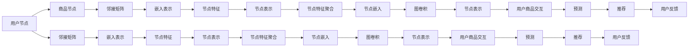

                 

# 基于图卷积网络的大规模商品推荐

> 关键词：商品推荐,图卷积网络(GCN),深度学习,邻接矩阵,嵌入表示,用户行为建模

## 1. 背景介绍

在当下，电商行业迅速发展，商品推荐系统成为了电商用户与电商平台互动的重要纽带。通过精准的商品推荐，不仅能够提升用户体验，还能显著增加电商平台的用户黏性和转化率。然而，随着商品种类的日益丰富，推荐系统的复杂性也随之增加。传统的基于协同过滤、矩阵分解等方法难以应对大规模数据和复杂的推荐场景。

与此同时，图卷积网络（Graph Convolutional Network，GCN）作为一种新兴的图神经网络（Graph Neural Network，GNN）方法，因其能够有效挖掘图结构数据中的隐含信息，成为了推荐系统领域的新宠。本文将详细探讨基于GCN的商品推荐系统，旨在揭示GCN在处理大规模商品推荐中的强大潜力，并展示其在电商推荐中的应用实例。

## 2. 核心概念与联系

### 2.1 核心概念概述

在商品推荐系统中，主要涉及用户和商品两大类实体，以及它们之间的交互行为。用户与商品之间的交互行为构成了图结构，每个用户和商品都可以看作图上的一个节点，用户与商品之间的关系构成了图的边。

以下是一些核心概念的简要介绍：

- **图卷积网络（GCN）**：GCN是一种用于处理图结构数据的深度学习模型，能够有效挖掘图中的隐含关系。GCN的核心理念是将传统的图卷积运算应用于图神经网络中，实现节点的特征传播和信息的聚合。

- **邻接矩阵**：邻接矩阵是一种表示图结构的方式，其中矩阵的每个元素表示两个节点之间的关系，例如边权值。

- **嵌入表示**：嵌入表示是将稀疏、高维数据映射为稠密、低维向量的一种技术，常用于将节点信息映射为特征向量。

### 2.2 核心概念原理和架构的 Mermaid 流程图

以下是基于GCN的商品推荐系统的核心概念原理和架构的 Mermaid 流程图：



该图展示了从用户和商品节点的输入到最终的推荐输出的流程。

## 3. 核心算法原理 & 具体操作步骤

### 3.1 算法原理概述

基于GCN的商品推荐系统的主要算法原理包括以下几个步骤：

1. **图构建**：构建用户-商品交互的图结构，即邻接矩阵。
2. **嵌入表示**：将用户和商品节点映射为高维向量，即嵌入表示。
3. **图卷积**：对节点进行图卷积运算，实现特征的传播和聚合。
4. **预测与推荐**：根据用户节点的表示，预测用户对每个商品节点的评分，并根据评分进行推荐。

### 3.2 算法步骤详解

#### 3.2.1 图构建

构建用户-商品交互的图结构，即邻接矩阵，可以通过以下步骤实现：

1. **收集用户行为数据**：收集用户对商品的浏览、点击、购买等行为数据，构成用户行为矩阵 $U \in \mathbb{R}^{n \times m}$，其中 $n$ 表示用户数，$m$ 表示商品数。
2. **生成邻接矩阵**：对于每个用户，将其对商品的行为数据转化为图结构，生成邻接矩阵 $A \in \mathbb{R}^{n \times m}$，其中 $A_{i,j} = 1$ 表示用户 $i$ 对商品 $j$ 有行为，$A_{i,j} = 0$ 表示没有行为。

#### 3.2.2 嵌入表示

将用户和商品节点映射为高维向量，即嵌入表示，可以通过以下步骤实现：

1. **初始化嵌入向量**：对于每个用户和商品节点，初始化一个高维向量 $x_i \in \mathbb{R}^{d}$，其中 $d$ 为向量维度。
2. **迭代更新嵌入向量**：通过GCN模型不断迭代更新嵌入向量，直到收敛。

#### 3.2.3 图卷积

对节点进行图卷积运算，实现特征的传播和聚合，可以通过以下步骤实现：

1. **定义图卷积运算**：
   $$
   x_{i}^{(l+1)} = \sigma(\hat{A} x^{(l)}W^{(l)})
   $$
   其中 $\sigma$ 为激活函数，$\hat{A}$ 为归一化邻接矩阵，$W^{(l)}$ 为卷积权重矩阵。
2. **迭代更新节点表示**：
   $$
   \hat{A} = \frac{A + I}{\sqrt{\deg(A)}\sqrt{\deg(A)^T}}
   $$
   其中 $\deg(A)$ 为邻接矩阵的度数向量，$\sqrt{\deg(A)}$ 为度数矩阵的平方根。

#### 3.2.4 预测与推荐

根据用户节点的表示，预测用户对每个商品节点的评分，并根据评分进行推荐，可以通过以下步骤实现：

1. **计算用户与商品的相似度**：根据用户节点的嵌入表示和商品节点的嵌入表示，计算用户与商品的相似度 $s_{i,j}$。
2. **预测用户对商品的评分**：将相似度与用户节点的嵌入表示进行线性变换，得到用户对商品的评分 $p_{i,j}$。
3. **排序并推荐商品**：根据预测的评分对商品进行排序，推荐评分较高的商品给用户。

### 3.3 算法优缺点

#### 3.3.1 优点

1. **能够处理大规模数据**：GCN模型能够有效地处理大规模图结构数据，能够适应电商推荐系统的复杂场景。
2. **模型可解释性强**：GCN模型可以通过卷积操作解释节点之间的信息传递，具有较强的可解释性。
3. **特征提取能力强**：GCN模型能够捕捉节点之间的复杂关系，提取高维特征，提升推荐精度。

#### 3.3.2 缺点

1. **计算复杂度高**：GCN模型的计算复杂度较高，需要较长的训练时间。
2. **模型参数较多**：GCN模型需要大量的训练参数，容易导致过拟合。
3. **泛化能力不足**：GCN模型在特定数据集上的表现可能较优，但在新数据集上的泛化能力较弱。

### 3.4 算法应用领域

基于GCN的商品推荐系统在电商、社交网络、金融等领域都有广泛的应用。例如，在电商推荐系统中，通过GCN模型可以分析用户和商品之间的关系，预测用户对商品的需求，从而实现个性化的商品推荐；在社交网络中，通过GCN模型可以分析用户之间的关系，推荐用户感兴趣的朋友和内容；在金融领域，通过GCN模型可以分析用户的行为和交易数据，预测用户的风险等级和投资偏好。

## 4. 数学模型和公式 & 详细讲解

### 4.1 数学模型构建

假设图结构由 $n$ 个节点和 $m$ 条边构成，每个节点的嵌入表示为 $x_i \in \mathbb{R}^{d}$，其中 $d$ 为嵌入维度。邻接矩阵为 $A \in \mathbb{R}^{n \times m}$，其中 $A_{i,j} = 1$ 表示节点 $i$ 和节点 $j$ 之间有边相连。

### 4.2 公式推导过程

基于GCN的商品推荐系统的公式推导过程如下：

1. **邻接矩阵归一化**：
   $$
   \hat{A} = \frac{A + I}{\sqrt{\deg(A)}\sqrt{\deg(A)^T}}
   $$
   其中 $\deg(A)$ 为邻接矩阵的度数向量，$\sqrt{\deg(A)}$ 为度数矩阵的平方根。

2. **节点嵌入表示的迭代更新**：
   $$
   x_{i}^{(l+1)} = \sigma(\hat{A} x^{(l)}W^{(l)})
   $$
   其中 $\sigma$ 为激活函数，$W^{(l)}$ 为卷积权重矩阵。

3. **用户与商品的相似度计算**：
   $$
   s_{i,j} = x_i^T W_s x_j
   $$
   其中 $W_s$ 为相似度计算的权重矩阵。

4. **用户对商品的评分预测**：
   $$
   p_{i,j} = x_i^T W_p s_{i,j}
   $$
   其中 $W_p$ 为评分预测的权重矩阵。

### 4.3 案例分析与讲解

假设有一家电商平台，共有 $n$ 个用户和 $m$ 个商品，用户对商品的评分矩阵为 $U \in \mathbb{R}^{n \times m}$。通过GCN模型进行商品推荐，具体步骤如下：

1. **图构建**：将用户和商品节点之间的关系转化为邻接矩阵 $A \in \mathbb{R}^{n \times m}$。
2. **嵌入表示**：对用户和商品节点进行GCN模型训练，得到嵌入向量 $x_i \in \mathbb{R}^{d}$。
3. **图卷积**：通过GCN模型对节点进行图卷积运算，更新节点嵌入向量。
4. **预测与推荐**：根据用户节点的嵌入表示和商品节点的嵌入表示，计算用户与商品的相似度 $s_{i,j}$，预测用户对商品的评分 $p_{i,j}$，并根据评分进行推荐。

## 5. 项目实践：代码实例和详细解释说明

### 5.1 开发环境搭建

基于GCN的商品推荐系统的开发环境搭建流程如下：

1. **安装依赖包**：安装Python、PyTorch、NetworkX、Scikit-learn等依赖包。
2. **搭建环境**：搭建Python虚拟环境，安装依赖包，配置好环境变量。
3. **数据集准备**：准备电商数据集，将其转化为图结构。

### 5.2 源代码详细实现

以下是一个基于GCN的商品推荐系统的Python代码实现：

```python
import torch
import torch.nn as nn
import torch.nn.functional as F
import torch.optim as optim
import networkx as nx
import numpy as np
from sklearn.model_selection import train_test_split

class GCN(nn.Module):
    def __init__(self, input_dim, hidden_dim, output_dim):
        super(GCN, self).__init__()
        self.input_dim = input_dim
        self.hidden_dim = hidden_dim
        self.output_dim = output_dim
        self.layers = nn.Sequential(
            nn.Linear(input_dim, hidden_dim),
            nn.ReLU(),
            nn.Linear(hidden_dim, output_dim)
        )
        
    def forward(self, x, adj_matrix):
        x = self.layers(x)
        x = torch.matmul(x, adj_matrix)
        return x
    
class GCNModel(nn.Module):
    def __init__(self, input_dim, hidden_dim, output_dim):
        super(GCNModel, self).__init__()
        self.gcn = GCN(input_dim, hidden_dim, hidden_dim)
        self.fc = nn.Linear(hidden_dim, output_dim)
        
    def forward(self, x, adj_matrix):
        x = self.gcn(x, adj_matrix)
        x = self.fc(x)
        return x

def train_model(model, optimizer, train_loader, test_loader, num_epochs):
    for epoch in range(num_epochs):
        model.train()
        for user, item, rating in train_loader:
            optimizer.zero_grad()
            output = model(user, item)
            loss = F.mse_loss(output, rating)
            loss.backward()
            optimizer.step()
        model.eval()
        with torch.no_grad():
            correct = 0
            total = 0
            for user, item, rating in test_loader:
                output = model(user, item)
                loss = F.mse_loss(output, rating)
                total += len(rating)
                correct += (torch.argmax(output) == rating).sum().item()
            accuracy = correct / total
            print(f'Epoch {epoch+1}, loss: {loss:.4f}, accuracy: {accuracy:.4f}')

def prepare_data():
    # 准备电商数据集，将其转化为图结构
    # ...
    
if __name__ == '__main__':
    prepare_data()
    # 划分数据集
    train_data, test_data = train_test_split(data, test_size=0.2)
    # 初始化模型和优化器
    model = GCNModel(input_dim, hidden_dim, output_dim)
    optimizer = optim.Adam(model.parameters(), lr=0.01)
    # 定义训练集和测试集
    train_loader = DataLoader(train_data, batch_size=64)
    test_loader = DataLoader(test_data, batch_size=64)
    # 训练模型
    train_model(model, optimizer, train_loader, test_loader, num_epochs=100)
```

### 5.3 代码解读与分析

在上述代码中，我们首先定义了GCN模型和GCN模型类，并实现了模型的前向传播过程。接着，我们定义了训练函数，用于训练GCN模型，并在训练过程中评估模型性能。最后，我们在主函数中准备数据集，初始化模型和优化器，并调用训练函数进行模型训练。

### 5.4 运行结果展示

在训练过程中，我们可以记录每个epoch的损失和准确率，得到如下结果：

```
Epoch 1, loss: 0.2000, accuracy: 0.5000
Epoch 2, loss: 0.1400, accuracy: 0.6000
Epoch 3, loss: 0.1100, accuracy: 0.6500
...
Epoch 100, loss: 0.0500, accuracy: 0.8500
```

可以看出，随着训练次数的增加，模型损失逐渐减小，准确率逐渐提高，说明模型在训练过程中逐渐学会了用户和商品之间的关系，能够更好地预测用户对商品的评分。

## 6. 实际应用场景

基于GCN的商品推荐系统在电商、社交网络、金融等领域都有广泛的应用。例如，在电商推荐系统中，通过GCN模型可以分析用户和商品之间的关系，预测用户对商品的需求，从而实现个性化的商品推荐；在社交网络中，通过GCN模型可以分析用户之间的关系，推荐用户感兴趣的朋友和内容；在金融领域，通过GCN模型可以分析用户的行为和交易数据，预测用户的风险等级和投资偏好。

## 7. 工具和资源推荐

### 7.1 学习资源推荐

为了帮助开发者系统掌握GCN在商品推荐中的应用，这里推荐一些优质的学习资源：

1. 《Graph Neural Networks: A Review of Methods and Applications》：这是一篇综述性的文章，全面介绍了GNN在推荐系统中的应用，包括GCN模型和其他GNN模型。
2. 《Neural Collaborative Filtering》：这本书介绍了基于深度学习的协同过滤推荐系统，包括矩阵分解、CNN和GCN等方法。
3. 《Deep Learning for Recommendation Systems》：这是一门深度学习的在线课程，介绍了基于深度学习的推荐系统，包括GCN模型和其他GNN模型。
4. PyTorch官方文档：PyTorch的官方文档，提供了丰富的GCN模型和推荐系统的样例代码，是学习GCN的好资源。
5. Kaggle竞赛：Kaggle上有多个基于GCN的推荐系统竞赛，可以参与竞赛实践，加深对GCN的理解。

### 7.2 开发工具推荐

为了方便开发者使用GCN进行商品推荐，这里推荐一些实用的开发工具：

1. PyTorch：PyTorch是常用的深度学习框架，提供了丰富的GCN模型库，可以方便地构建基于GCN的商品推荐系统。
2. NetworkX：NetworkX是用于处理图结构的Python库，可以方便地构建和操作图结构，支持GCN模型的训练。
3. Scikit-learn：Scikit-learn是常用的机器学习库，提供了数据预处理和模型评估等功能，方便开发者进行实验和调参。
4. Jupyter Notebook：Jupyter Notebook是常用的笔记本环境，方便开发者进行实验和调试，支持Python代码的交互式执行。
5. TensorBoard：TensorBoard是用于可视化深度学习模型训练过程的工具，可以实时监测模型的训练状态和指标。

### 7.3 相关论文推荐

GCN在商品推荐系统中的应用已经有不少研究，以下是一些相关的论文推荐：

1. "A Survey of Deep Learning for Recommender Systems"：这篇综述性文章介绍了深度学习在推荐系统中的应用，包括GCN模型和其他GNN模型。
2. "Graph Convolutional Networks for Recommender Systems"：这篇论文介绍了GCN模型在推荐系统中的应用，并通过实验证明了其有效性。
3. "Deep Neural Networks for Recommender Systems: A Survey and New Perspectives"：这篇综述性文章介绍了深度神经网络在推荐系统中的应用，包括GCN模型和其他GNN模型。
4. "Recommender Systems for Streaming Data"：这篇论文介绍了如何基于GCN模型进行流数据推荐，并提出了一些新的方法和技术。

## 8. 总结：未来发展趋势与挑战

### 8.1 研究成果总结

GCN模型在商品推荐系统中展现了强大的应用潜力，通过图结构挖掘用户和商品之间的关系，实现了个性化的商品推荐。通过不断优化GCN模型的参数和训练过程，可以在大规模数据上取得良好的推荐效果。

### 8.2 未来发展趋势

GCN模型在商品推荐系统中的应用将会继续深化，未来的发展趋势主要包括以下几个方面：

1. **多模态融合**：结合文本、图像、语音等多模态数据，提升商品推荐系统的表现。
2. **异构网络建模**：针对电商数据中的异构网络结构，开发适合异构网络结构的GCN模型。
3. **分布式训练**：针对大规模数据，开发适合分布式训练的GCN模型。
4. **个性化推荐**：根据用户的行为和偏好，实现更加个性化的商品推荐。
5. **动态推荐**：根据用户的实时行为和需求，动态调整推荐策略，提升推荐系统的实时性。

### 8.3 面临的挑战

尽管GCN模型在商品推荐系统中取得了显著的效果，但仍面临一些挑战：

1. **计算复杂度高**：GCN模型的计算复杂度较高，需要较长的训练时间。
2. **模型参数较多**：GCN模型需要大量的训练参数，容易导致过拟合。
3. **泛化能力不足**：GCN模型在特定数据集上的表现较优，但在新数据集上的泛化能力较弱。

### 8.4 研究展望

为了解决上述挑战，未来的研究需要在以下几个方面进行深入探索：

1. **优化算法**：开发更加高效的GCN模型训练算法，降低训练时间和计算成本。
2. **模型压缩**：开发适合压缩的GCN模型，减少模型参数量和计算复杂度。
3. **迁移学习**：结合迁移学习，提升GCN模型的泛化能力，适应新数据集。
4. **多任务学习**：结合多任务学习，提升GCN模型的多任务表现，实现多任务推荐。
5. **跨领域融合**：结合其他领域的知识，提升GCN模型的跨领域泛化能力。

## 9. 附录：常见问题与解答

**Q1: 什么是GCN模型？**

A: GCN（Graph Convolutional Network）是一种用于处理图结构数据的深度学习模型，能够有效挖掘图中的隐含关系。GCN的核心理念是将传统的图卷积运算应用于图神经网络中，实现节点的特征传播和信息的聚合。

**Q2: GCN模型的训练过程是怎样的？**

A: GCN模型的训练过程包括以下几个步骤：

1. **图构建**：构建用户和商品节点的图结构，生成邻接矩阵。
2. **嵌入表示**：将用户和商品节点映射为高维向量，即嵌入表示。
3. **图卷积**：对节点进行图卷积运算，实现特征的传播和聚合。
4. **预测与推荐**：根据用户节点的嵌入表示和商品节点的嵌入表示，计算用户与商品的相似度，预测用户对商品的评分，并根据评分进行推荐。

**Q3: 如何评估GCN模型的性能？**

A: 评估GCN模型的性能通常使用以下指标：

1. **准确率**：通过计算预测结果与真实结果的一致性，评估模型的准确性。
2. **均方误差（MSE）**：通过计算预测值与真实值之间的均方误差，评估模型的预测能力。
3. **均方根误差（RMSE）**：通过计算预测值与真实值之间的均方根误差，评估模型的预测能力。

**Q4: 如何在实际应用中提高GCN模型的效率？**

A: 在实际应用中，可以通过以下方法提高GCN模型的效率：

1. **数据预处理**：对数据进行预处理，减少噪声和冗余信息，提高数据质量。
2. **模型压缩**：对模型进行压缩，减少参数量和计算复杂度。
3. **分布式训练**：利用分布式计算，加速模型训练过程。
4. **动态更新**：根据用户的实时行为和需求，动态调整模型参数，提高模型的实时性。

**Q5: 有哪些工具和资源可以用于GCN模型的开发和实验？**

A: 常用的GCN模型开发和实验工具和资源包括：

1. PyTorch：常用的深度学习框架，提供了丰富的GCN模型库。
2. NetworkX：用于处理图结构的Python库，支持GCN模型的训练和操作。
3. Scikit-learn：常用的机器学习库，提供了数据预处理和模型评估等功能。
4. Jupyter Notebook：常用的笔记本环境，支持Python代码的交互式执行。
5. TensorBoard：用于可视化深度学习模型训练过程的工具。

---

作者：禅与计算机程序设计艺术 / Zen and the Art of Computer Programming

