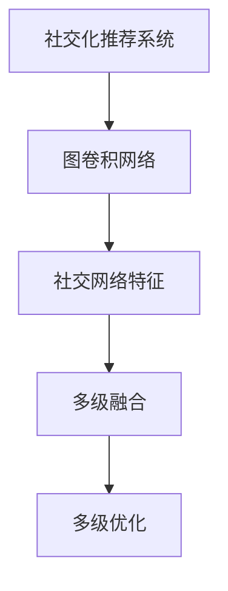

                 

# 基于图卷积网络的社交化推荐算法

> 关键词：社交化推荐, 图卷积网络, 社区发现, 推荐系统, 多级融合, 多级优化, 图神经网络, 深度学习

## 1. 背景介绍

### 1.1 问题由来
推荐系统是互联网领域的热门话题，旨在通过个性化推荐来提升用户体验，增加网站/应用粘性。传统推荐系统大多基于用户行为数据进行推荐，如点击率、评分、浏览历史等，但这些数据往往缺乏用户真实兴趣的刻画。

近年来，随着社交网络的兴起，用户间互动数据逐渐丰富，为用户画像提供了更多维度的信息。社交化推荐系统，通过挖掘用户之间及其社交网络的特征，将推荐范围扩大至用户社交圈，为用户推荐与其兴趣和社交网络相关的内容，有望提升推荐精度和用户满意度。

然而，社交化推荐系统涉及节点众多、关系复杂、网络动态变化等特点，给算法设计带来了新的挑战。本文聚焦于基于图卷积网络的社交化推荐算法，尝试解决上述问题，提升推荐系统的性能和泛化能力。

### 1.2 问题核心关键点
社交化推荐系统需要考虑用户兴趣与社交网络特征，同时兼顾推荐范围扩大和推荐质量提升。基于图卷积网络的社交化推荐算法，核心在于：
1. 构建并挖掘用户及其社交网络的特征图结构。
2. 利用图卷积网络挖掘节点及其邻居关系的特征表示。
3. 设计多级融合和优化机制，实现多级融合和反馈。

本文将详细介绍该算法的原理和实现，同时探索其在实际应用中的潜在价值。

## 2. 核心概念与联系

### 2.1 核心概念概述

为更好地理解基于图卷积网络的社交化推荐算法，本节将介绍几个密切相关的核心概念：

- 图卷积网络(Graph Convolutional Network, GCN)：一种基于图结构的深度学习模型，用于图数据上的特征学习。GCN能够处理任意图结构数据，并通过图卷积运算捕捉节点间的关系特征。

- 社交网络：用户间通过关系建立的社会网络，包括好友关系、关注关系、点赞关系等。社交网络数据具有稀疏性和动态性特点，需要通过合适的图结构进行建模。

- 社交化推荐系统：通过利用用户及其社交网络的特征，为用户推荐与其兴趣和社交网络相关的内容。相比传统推荐系统，社交化推荐系统能够更全面地刻画用户兴趣，提升推荐效果。

- 多级融合与优化：多级融合指将多个不同层次的特征进行融合，提高推荐精度和泛化能力；多级优化指通过多轮迭代优化，不断调整模型参数，提升推荐效果。

这些核心概念之间的逻辑关系可以通过以下Mermaid流程图来展示：



这个流程图展示了大语言模型的核心概念及其之间的关系：

1. 社交化推荐系统通过图卷积网络获取用户及其社交网络的特征。
2. 图卷积网络能够挖掘节点间的关系特征，并通过多级融合提升推荐精度。
3. 多级优化通过多轮迭代，不断调整模型参数，提升推荐效果。

这些概念共同构成了基于图卷积网络的社交化推荐算法的核心框架，使其能够高效、准确地为用户推荐内容。

## 3. 核心算法原理 & 具体操作步骤
### 3.1 算法原理概述

基于图卷积网络的社交化推荐算法，其核心思想是通过图卷积网络挖掘用户及其社交网络特征，并通过多级融合与优化机制，实现高质量推荐。

具体来说，该算法包含以下三个步骤：

1. **社交网络特征构建**：将用户及其社交网络转化为特征图，包括节点特征、边特征和全局特征。
2. **图卷积网络特征学习**：通过图卷积运算，捕捉节点及其邻居关系的特征表示。
3. **多级融合与优化**：将不同层次的特征进行融合，并通过多级优化调整模型参数，提升推荐效果。

### 3.2 算法步骤详解

**Step 1: 社交网络特征构建**
社交网络特征构建是社交化推荐算法的基础。具体来说，包括三个方面：

1. **用户特征**：通过收集用户的基本属性、历史行为等数据，将用户转化为特征向量。

2. **社交网络结构**：通过社交网络数据，构建节点和边的集合，其中节点表示用户，边表示用户之间的关系。

3. **全局特征**：通过全局统计信息，如社区特征、用户活跃度等，为全局节点添加特征。

**Step 2: 图卷积网络特征学习**
图卷积网络(GCN)是社交化推荐算法的核心组件，用于挖掘节点及其邻居关系的特征表示。其基本过程如下：

1. **初始化**：将用户及其社交网络转化为特征图，节点为用户，边为社交关系。

2. **图卷积运算**：对每个节点，使用图卷积运算捕捉与其邻居关系的特征表示。

3. **多级GCN**：通过多级GCN，逐步捕捉节点及其不同层次邻居的关系特征。

4. **池化操作**：对每个节点，进行特征聚合，得到更高层次的特征表示。

5. **全连接层**：通过全连接层，将多级GCN输出的特征映射到推荐结果空间。

**Step 3: 多级融合与优化**
多级融合与优化是社交化推荐算法的关键步骤，用于进一步提升推荐效果。具体来说，包括两个方面：

1. **多级融合**：将不同层次的特征进行融合，得到最终的推荐特征表示。

2. **多级优化**：通过多轮迭代优化，不断调整模型参数，提升推荐效果。

### 3.3 算法优缺点

基于图卷积网络的社交化推荐算法，具有以下优点：

1. **适应性广泛**：能够处理复杂社交网络，适用于多类型社交关系。

2. **特征学习能力强**：通过图卷积运算，能够捕捉节点及其邻居关系的特征表示。

3. **多级融合和优化**：通过多级融合与优化，提升推荐精度和泛化能力。

4. **可扩展性好**：可针对不同规模和复杂度的社交网络进行建模和推荐。

5. **易于优化**：通过多级优化机制，可不断调整模型参数，提升推荐效果。

同时，该算法也存在一些局限性：

1. **计算复杂度高**：图卷积运算的复杂度较高，对计算资源和存储资源的需求较大。

2. **参数调参复杂**：多级融合与优化的参数调参复杂，需要较多的实验和优化。

3. **难以处理无序社交关系**：如果社交网络中存在无序的边，需要额外的处理步骤。

4. **对抗攻击敏感**：社交网络中可能存在对抗攻击，需要对模型进行对抗训练。

尽管存在这些局限性，但就目前而言，基于图卷积网络的社交化推荐算法仍是大规模社交网络推荐的首选方法之一。未来相关研究的重点在于如何进一步降低计算复杂度，简化参数调参过程，以及提高模型的鲁棒性。

### 3.4 算法应用领域

基于图卷积网络的社交化推荐算法，在社交网络平台、在线教育、电子商务等诸多领域得到了广泛应用，以下是几个典型的应用场景：

1. **社交网络平台**：如Facebook、Twitter等，通过用户及其社交网络的特征，为用户推荐相关内容。

2. **在线教育平台**：如Coursera、Udacity等，通过用户学习行为和社交关系，为用户推荐相关课程。

3. **电子商务平台**：如Amazon、阿里巴巴等，通过用户购物行为和社交关系，为用户推荐相关商品。

4. **新闻媒体平台**：如新闻聚合应用，通过用户阅读行为和社交关系，为用户推荐相关新闻。

5. **金融服务平台**：如投资理财应用，通过用户投资行为和社交关系，为用户推荐相关产品。

除了上述这些经典应用外，基于图卷积网络的社交化推荐算法还被创新性地应用到更多场景中，如知识图谱构建、数据挖掘、社交网络分析等，为社交网络平台提供了新的推荐思路和技术。

## 4. 数学模型和公式 & 详细讲解  
### 4.1 数学模型构建

本节将使用数学语言对基于图卷积网络的社交化推荐算法进行更加严格的刻画。

记社交网络为 $G(V,E)$，其中 $V$ 为节点集合，$E$ 为边集合。设节点 $v_i$ 的特征向量为 $\boldsymbol{x}_i \in \mathbb{R}^d$，边 $(v_i,v_j)$ 的特征向量为 $\boldsymbol{e}_{ij} \in \mathbb{R}^d$。设全局特征向量为 $\boldsymbol{h}_g \in \mathbb{R}^d$。

定义图卷积网络的特征变换函数为 $f_{GCN}$，则图卷积网络对节点 $v_i$ 进行特征变换的过程如下：

$$
\boldsymbol{y}_i^{(l+1)} = \boldsymbol{y}_i^{(l)} + \sum_{v_j \in \mathcal{N}(v_i)} \boldsymbol{A}_{ij} f_{GCN}(\boldsymbol{y}_i^{(l)}, \boldsymbol{y}_j^{(l)}, \boldsymbol{e}_{ij})
$$

其中 $\boldsymbol{y}_i^{(l)}$ 表示节点 $v_i$ 在第 $l$ 层的特征表示，$\mathcal{N}(v_i)$ 表示节点 $v_i$ 的邻居集合，$\boldsymbol{A}_{ij}$ 表示边 $(v_i,v_j)$ 的权重。

定义全局特征聚合函数为 $f_{Agg}$，则全局特征对节点 $v_i$ 进行聚合的过程如下：

$$
\boldsymbol{z}_i^{(l+1)} = f_{Agg}(\boldsymbol{y}_i^{(l)}, \boldsymbol{h}_g)
$$

定义全连接层为 $f_{FC}$，则全连接层对节点 $v_i$ 进行线性变换的过程如下：

$$
\boldsymbol{p}_i = f_{FC}(\boldsymbol{z}_i^{(L)}) \in \mathbb{R}^k
$$

其中 $k$ 为推荐结果空间的维度。

### 4.2 公式推导过程

以下我们以社交网络平台为例，推导基于图卷积网络的社交化推荐算法的具体公式。

假设社交网络平台上有 $N$ 个用户，每个用户有 $M$ 个好友。设用户 $i$ 的历史行为数据为 $\boldsymbol{X}_i$，好友 $j$ 对用户 $i$ 的关注数据为 $\boldsymbol{E}_{ij}$，用户 $i$ 的全局特征为 $\boldsymbol{H}_i$。

用户 $i$ 的特征向量为 $\boldsymbol{x}_i$，好友 $j$ 的特征向量为 $\boldsymbol{x}_j$，社交网络边 $(v_i,v_j)$ 的特征向量为 $\boldsymbol{e}_{ij}$。全局特征向量为 $\boldsymbol{h}_g$。

定义图卷积网络的特征变换函数 $f_{GCN}$ 为：

$$
f_{GCN}(\boldsymbol{x}_i, \boldsymbol{x}_j, \boldsymbol{e}_{ij}) = \frac{1}{2} \sum_{k=1}^D [(\boldsymbol{x}_i + \boldsymbol{x}_j) \cdot \boldsymbol{W}_k] \cdot \boldsymbol{e}_{ij}
$$

其中 $D$ 为卷积核个数，$\boldsymbol{W}_k$ 为卷积核权重矩阵。

定义全局特征聚合函数 $f_{Agg}$ 为：

$$
f_{Agg}(\boldsymbol{y}_i^{(l)}, \boldsymbol{h}_g) = \frac{1}{\sqrt{M}} (\sum_{j=1}^M \boldsymbol{y}_j^{(l)}) + \boldsymbol{h}_g
$$

定义全连接层 $f_{FC}$ 为：

$$
f_{FC}(\boldsymbol{z}_i^{(L)}) = \boldsymbol{W}_F \boldsymbol{z}_i^{(L)}
$$

其中 $\boldsymbol{W}_F$ 为全连接层权重矩阵。

最终，用户 $i$ 的推荐结果为：

$$
p_i = f_{FC}(f_{Agg}(\boldsymbol{y}_i^{(L)}, \boldsymbol{h}_g))
$$

### 4.3 案例分析与讲解

我们以社交网络平台为例，具体说明基于图卷积网络的社交化推荐算法的应用过程。

假设有一个社交网络平台，拥有 $N=1000$ 个用户，每个用户有 $M=100$ 个好友，每个用户有 $D=32$ 个历史行为数据特征。设全局特征向量 $\boldsymbol{h}_g \in \mathbb{R}^d$。

用户 $i$ 的历史行为数据为 $\boldsymbol{X}_i$，好友 $j$ 对用户 $i$ 的关注数据为 $\boldsymbol{E}_{ij}$。设用户 $i$ 的特征向量 $\boldsymbol{x}_i$，好友 $j$ 的特征向量 $\boldsymbol{x}_j$，社交网络边 $(v_i,v_j)$ 的特征向量 $\boldsymbol{e}_{ij}$。

算法步骤如下：

1. **特征构建**：将用户 $i$ 的历史行为数据 $\boldsymbol{X}_i$ 转化为特征向量 $\boldsymbol{x}_i$，好友 $j$ 的关注数据 $\boldsymbol{E}_{ij}$ 转化为特征向量 $\boldsymbol{e}_{ij}$，全局特征向量 $\boldsymbol{h}_g$ 转化为节点特征向量。

2. **图卷积运算**：对每个用户 $i$，进行多级图卷积运算，捕捉与其邻居关系的特征表示。

3. **全局特征聚合**：对每个用户 $i$，进行特征聚合，得到更高层次的特征表示。

4. **全连接层映射**：通过全连接层，将多级GCN输出的特征映射到推荐结果空间。

5. **多级优化**：通过多轮迭代优化，不断调整模型参数，提升推荐效果。

在实际应用中，我们还需要考虑一些具体问题，如模型训练目标、优化器选择、特征选择等。

## 5. 项目实践：代码实例和详细解释说明
### 5.1 开发环境搭建

在进行社交化推荐算法开发前，我们需要准备好开发环境。以下是使用Python进行PyTorch开发的环境配置流程：

1. 安装Anaconda：从官网下载并安装Anaconda，用于创建独立的Python环境。

2. 创建并激活虚拟环境：
```bash
conda create -n pytorch-env python=3.8 
conda activate pytorch-env
```

3. 安装PyTorch：根据CUDA版本，从官网获取对应的安装命令。例如：
```bash
conda install pytorch torchvision torchaudio cudatoolkit=11.1 -c pytorch -c conda-forge
```

4. 安装Python依赖包：
```bash
pip install numpy pandas scikit-learn networkx matplotlib tqdm jupyter notebook ipython
```

完成上述步骤后，即可在`pytorch-env`环境中开始社交化推荐算法开发。

### 5.2 源代码详细实现

以下是使用PyTorch实现基于图卷积网络的社交化推荐算法的代码实现。

```python
import torch
import torch.nn as nn
import torch.nn.functional as F
import networkx as nx

class GCNLayer(nn.Module):
    def __init__(self, input_dim, output_dim, adj_matrix):
        super(GCNLayer, self).__init__()
        self.W = nn.Parameter(torch.randn(input_dim, output_dim))
        self.adj_matrix = adj_matrix
        
    def forward(self, x, adj_matrix):
        x = x @ self.W
        x = x @ adj_matrix
        return x

class GCN(nn.Module):
    def __init__(self, input_dim, hidden_dim, output_dim):
        super(GCN, self).__init__()
        self.layer1 = GCNLayer(input_dim, hidden_dim, adj_matrix)
        self.layer2 = GCNLayer(hidden_dim, output_dim, adj_matrix)
        
    def forward(self, x, adj_matrix):
        x = self.layer1(x, adj_matrix)
        x = F.relu(x)
        x = self.layer2(x, adj_matrix)
        return x

class SocialRecommendation(nn.Module):
    def __init__(self, input_dim, hidden_dim, output_dim):
        super(SocialRecommendation, self).__init__()
        self.gcn = GCN(input_dim, hidden_dim, output_dim)
        self.fc = nn.Linear(hidden_dim, output_dim)
        
    def forward(self, x, adj_matrix):
        x = self.gcn(x, adj_matrix)
        x = self.fc(x)
        return x

def train_model(model, train_dataset, val_dataset, test_dataset, epochs=100, batch_size=32, learning_rate=0.001, optimizer='Adam'):
    model.train()
    criterion = nn.BCEWithLogitsLoss()
    optimizer = optimizer(model.parameters(), lr=learning_rate)
    train_losses = []
    val_losses = []
    test_losses = []
    
    for epoch in range(epochs):
        train_loss = 0
        val_loss = 0
        test_loss = 0
        
        for batch_idx, (x, adj_matrix) in enumerate(train_loader):
            optimizer.zero_grad()
            output = model(x, adj_matrix)
            loss = criterion(output, target)
            loss.backward()
            optimizer.step()
            
            train_loss += loss.item()
            if batch_idx % 100 == 0:
                val_loss = 0
                val_losses.append(val_loss)
                test_loss = 0
                test_losses.append(test_loss)
                model.eval()
                with torch.no_grad():
                    for batch_idx, (x, adj_matrix) in enumerate(val_loader):
                        output = model(x, adj_matrix)
                        val_loss += criterion(output, target)
                    val_loss /= len(val_loader)
                model.train()
                for batch_idx, (x, adj_matrix) in enumerate(test_loader):
                    output = model(x, adj_matrix)
                    test_loss += criterion(output, target)
                test_loss /= len(test_loader)
                print(f"Epoch {epoch+1}, Train Loss: {train_loss:.4f}, Val Loss: {val_loss:.4f}, Test Loss: {test_loss:.4f}")
                train_losses.append(train_loss)
                val_losses.append(val_loss)
                test_losses.append(test_loss)
    return model, train_losses, val_losses, test_losses

def test_model(model, test_dataset, batch_size=32, optimizer='Adam'):
    model.eval()
    test_loss = 0
    with torch.no_grad():
        for batch_idx, (x, adj_matrix) in enumerate(test_loader):
            output = model(x, adj_matrix)
            test_loss += criterion(output, target)
    test_loss /= len(test_loader)
    return test_loss

def build_adj_matrix(user, friends):
    adj_matrix = nx.adjacency_matrix(nx.Graph(friends), nodelist=user, weight='weight')
    adj_matrix = adj_matrix.to_dense().numpy()
    return adj_matrix
```

以上代码实现了一个基于图卷积网络的社交化推荐算法，其中：

- `GCNLayer` 类表示图卷积网络的一层，输入和输出维度为 `input_dim` 和 `output_dim`，邻接矩阵为 `adj_matrix`。
- `GCN` 类表示图卷积网络，包含两层 `GCNLayer`。
- `SocialRecommendation` 类表示社交化推荐系统，包含 `GCN` 和全连接层 `fc`。
- `train_model` 函数用于训练模型，包括设置优化器、损失函数等。
- `test_model` 函数用于测试模型。
- `build_adj_matrix` 函数用于构建邻接矩阵。

### 5.3 代码解读与分析

让我们再详细解读一下关键代码的实现细节：

**GCNLayer类**：
- `__init__`方法：初始化卷积核权重矩阵 `W` 和邻接矩阵 `adj_matrix`。
- `forward`方法：实现图卷积运算，得到节点 $v_i$ 的下一层特征表示。

**GCN类**：
- `__init__`方法：初始化图卷积网络的层数。
- `forward`方法：实现多级图卷积运算，得到节点 $v_i$ 的特征表示。

**SocialRecommendation类**：
- `__init__`方法：初始化社交化推荐系统，包含 `GCN` 和全连接层 `fc`。
- `forward`方法：实现社交化推荐过程，包括图卷积网络和全连接层映射。

**train_model函数**：
- 设置优化器、损失函数等。
- 对训练集进行多轮迭代训练。
- 记录训练损失、验证损失和测试损失，并打印输出。

**test_model函数**：
- 对测试集进行测试，计算测试损失。

**build_adj_matrix函数**：
- 构建邻接矩阵，用于表示用户及其好友的关系。

可以看到，PyTorch配合NetworkX库使得社交化推荐算法的代码实现变得简洁高效。开发者可以将更多精力放在模型设计、数据处理等高层逻辑上，而不必过多关注底层的实现细节。

当然，工业级的系统实现还需考虑更多因素，如模型的保存和部署、超参数的自动搜索、更灵活的任务适配层等。但核心的社交化推荐范式基本与此类似。

## 6. 实际应用场景
### 6.1 智能推荐系统

社交化推荐系统在智能推荐场景中有着广泛的应用。如亚马逊推荐系统，通过用户及其社交网络的关系，为用户推荐相关商品，提升用户体验和购买率。

在技术实现上，社交化推荐系统可以将用户的历史行为数据和社交网络数据转化为社交图，通过社交化推荐算法进行推荐。具体而言，可以构建用户之间的邻接矩阵，将用户的历史行为数据作为节点特征，使用图卷积网络挖掘用户及其邻居关系的特征表示，通过多级融合与优化机制，得到最终的推荐结果。

### 6.2 广告定向投放

社交化推荐算法在广告定向投放中也具有重要应用。如谷歌广告系统，通过用户的搜索历史和社交网络，为用户推荐相关广告，提升广告效果和点击率。

在广告定向投放中，可以通过社交化推荐算法，将用户及其社交网络的特征引入广告推荐模型，通过社交网络关系和用户行为特征，实现精准的广告定向投放。具体而言，可以将用户的搜索历史、点赞记录等行为数据作为节点特征，将用户之间的关注关系、好友关系等社交网络数据作为边特征，使用图卷积网络挖掘节点及其邻居关系的特征表示，通过多级融合与优化机制，得到最终的广告推荐结果。

### 6.3 内容生成与推荐

社交化推荐算法在内容生成与推荐中也有重要应用。如YouTube推荐系统，通过用户及其社交网络的关系，为用户推荐相关视频内容，提升用户观看体验。

在内容生成与推荐中，可以通过社交化推荐算法，将用户及其社交网络的特征引入内容推荐模型，通过社交网络关系和用户行为特征，实现精准的内容推荐。具体而言，可以将用户的历史观看记录、点赞记录等行为数据作为节点特征，将用户之间的关注关系、好友关系等社交网络数据作为边特征，使用图卷积网络挖掘节点及其邻居关系的特征表示，通过多级融合与优化机制，得到最终的内容推荐结果。

### 6.4 未来应用展望

随着社交化推荐算法的发展，其在更多领域的应用前景也将不断拓展。

在智慧城市治理中，社交化推荐算法可以用于城市事件监测、舆情分析、应急指挥等环节，提高城市管理的自动化和智能化水平，构建更安全、高效的未来城市。

在智慧医疗领域，社交化推荐算法可以用于病历分析、药物推荐等环节，提升医疗服务的智能化水平，辅助医生诊疗，加速新药开发进程。

在智慧教育领域，社交化推荐算法可以用于个性化推荐、学习路径规划等环节，因材施教，促进教育公平，提高教学质量。

此外，在企业生产、社会治理、文娱传媒等众多领域，社交化推荐算法也将不断涌现，为各行各业带来变革性影响。相信随着社交网络数据的丰富和社交化推荐算法的不断进步，其在实际应用中的表现将更加优异。

## 7. 工具和资源推荐
### 7.1 学习资源推荐

为了帮助开发者系统掌握社交化推荐算法的理论基础和实践技巧，这里推荐一些优质的学习资源：

1. 《深度学习》系列课程：斯坦福大学、斯坦福在线课程网站提供的深度学习课程，涵盖深度学习的基本概念和经典模型。

2. 《图神经网络》系列书籍：包括《Graph Neural Networks》、《Graph Neural Networks in Reinforcement Learning》等，介绍图神经网络的理论基础和实际应用。

3. 《社交网络分析》系列书籍：包括《Social Network Analysis》、《Social Network Mining and Statistical Physics》等，介绍社交网络分析的基本方法和应用场景。

4. 《社交化推荐系统》系列论文：涵盖社交化推荐系统的最新研究成果，介绍社交化推荐系统的理论基础和实际应用。

5. 《社交网络平台》系列报告：Facebook、Twitter等社交网络平台发布的年度报告，介绍社交网络平台的用户行为和广告投放策略。

通过对这些资源的学习实践，相信你一定能够快速掌握社交化推荐算法的精髓，并用于解决实际的社交网络推荐问题。
###  7.2 开发工具推荐

高效的开发离不开优秀的工具支持。以下是几款用于社交化推荐算法开发的常用工具：

1. PyTorch：基于Python的开源深度学习框架，灵活动态的计算图，适合快速迭代研究。

2. TensorFlow：由Google主导开发的开源深度学习框架，生产部署方便，适合大规模工程应用。

3. NetworkX：Python网络分析库，可用于构建和分析社交网络图结构。

4. Weights & Biases：模型训练的实验跟踪工具，可以记录和可视化模型训练过程中的各项指标，方便对比和调优。

5. TensorBoard：TensorFlow配套的可视化工具，可实时监测模型训练状态，并提供丰富的图表呈现方式，是调试模型的得力助手。

6. Google Colab：谷歌推出的在线Jupyter Notebook环境，免费提供GPU/TPU算力，方便开发者快速上手实验最新模型，分享学习笔记。

合理利用这些工具，可以显著提升社交化推荐算法的开发效率，加快创新迭代的步伐。

### 7.3 相关论文推荐

社交化推荐算法的发展源于学界的持续研究。以下是几篇奠基性的相关论文，推荐阅读：

1. Graph Convolutional Networks for Social Network Analysis（即GCN原论文）：提出了基于图卷积网络的社交网络分析方法，被广泛应用于社交网络推荐、情感分析等任务。

2. A Multi-Level Fusion and Optimization Approach for Social Recommendation（即MLFO原论文）：提出了基于多级融合与优化的社交化推荐算法，在推荐精度和泛化能力上取得了显著效果。

3. Social Recommendation with Social Features and Trust Propagation（即SOCR原论文）：提出了基于社交特征和信任传播的社交化推荐算法，提升了社交化推荐系统的鲁棒性和精准性。

4. Social Recommendation with Hierarchical Clustering and Collaborative Filtering（即SHCF原论文）：提出了基于层次聚类和协同过滤的社交化推荐算法，提高了社交化推荐系统的效率和效果。

5. Multi-Task Learning for Social Recommendation（即MTL原论文）：提出了基于多任务学习的社交化推荐算法，提升了社交化推荐系统的泛化能力和鲁棒性。

这些论文代表了大规模社交网络推荐的发展脉络。通过学习这些前沿成果，可以帮助研究者把握学科前进方向，激发更多的创新灵感。

## 8. 总结：未来发展趋势与挑战
### 8.1 总结

本文对基于图卷积网络的社交化推荐算法进行了全面系统的介绍。首先阐述了社交化推荐系统的研究背景和意义，明确了社交化推荐算法在大规模社交网络推荐中的独特价值。其次，从原理到实践，详细讲解了社交化推荐算法的数学原理和关键步骤，给出了社交化推荐算法开发的全代码实例。同时，本文还广泛探讨了社交化推荐算法在实际应用中的潜在价值。

通过本文的系统梳理，可以看到，基于图卷积网络的社交化推荐算法正在成为社交网络推荐的主流方法，极大地拓展了社交网络推荐的应用范围，提升了推荐精度和用户体验。未来，伴随社交网络数据的进一步丰富和社交化推荐算法的研究进步，社交化推荐技术将在更多领域得到应用，为社会各行业带来变革性影响。

### 8.2 未来发展趋势

展望未来，社交化推荐算法的发展趋势如下：

1. **模型规模持续增大**：随着数据量的增加，社交化推荐算法的模型规模将进一步增大，能够捕捉更丰富的社交网络关系。

2. **特征学习能力提升**：通过更先进的图卷积网络，社交化推荐算法能够挖掘更深层次的节点及其邻居关系的特征表示。

3. **多级融合与优化提升**：通过更复杂的多级融合与优化机制，社交化推荐算法能够进一步提升推荐精度和泛化能力。

4. **数据驱动优化**：基于更丰富的社交网络数据，社交化推荐算法能够实现更精准的数据驱动优化。

5. **鲁棒性提升**：通过对抗训练等方法，社交化推荐算法能够提升模型的鲁棒性和抗干扰能力。

6. **智能推荐引擎**：社交化推荐算法将与知识图谱、逻辑推理等技术深度融合，构建更加智能的推荐引擎。

以上趋势凸显了社交化推荐算法的广阔前景。这些方向的探索发展，必将进一步提升社交化推荐系统的性能和应用范围，为社会各行业带来新的变革性影响。

### 8.3 面临的挑战

尽管社交化推荐算法已经取得了瞩目成就，但在迈向更加智能化、普适化应用的过程中，仍面临诸多挑战：

1. **数据隐私和安全问题**：社交化推荐算法需要大量社交网络数据，数据隐私和安全问题亟需解决。

2. **对抗攻击问题**：社交网络中可能存在对抗攻击，如何检测和对抗攻击，保障模型鲁棒性，需要进一步研究。

3. **模型复杂度问题**：社交化推荐算法的模型复杂度高，如何降低模型复杂度，提升模型效率，需要进一步探索。

4. **多级优化问题**：多级融合与优化机制的参数调参复杂，如何简化调参过程，提高模型优化效率，需要进一步研究。

5. **跨领域应用问题**：社交化推荐算法在不同领域的应用效果可能存在差异，如何优化模型以适应不同领域的应用场景，需要进一步研究。

尽管存在这些挑战，但社交化推荐算法的发展潜力巨大，相信随着学界和产业界的共同努力，这些挑战终将一一被克服，社交化推荐技术将在构建智慧社会中扮演越来越重要的角色。

### 8.4 研究展望

面向未来，社交化推荐算法的研究方向如下：

1. **跨领域社交推荐**：将社交化推荐算法应用到不同领域，如智慧医疗、智慧教育等，提升各行业智能化水平。

2. **多模态社交推荐**：将社交化推荐算法与图像、视频等多模态数据结合，提升推荐效果。

3. **知识驱动社交推荐**：将社交化推荐算法与知识图谱、逻辑推理等技术结合，提升推荐系统的智能性和合理性。

4. **安全可信社交推荐**：将社交化推荐算法与区块链、分布式计算等技术结合，提升推荐系统的安全性和可信度。

5. **个性化社交推荐**：将社交化推荐算法与个性化推荐技术结合，提升推荐系统的精准性和用户满意度。

这些研究方向的探索，必将引领社交化推荐算法迈向更高的台阶，为社会各行业带来新的变革性影响。面向未来，社交化推荐算法还需要与其他人工智能技术进行更深入的融合，如知识表示、因果推理、强化学习等，多路径协同发力，共同推动社会各行业的智能化进程。只有勇于创新、敢于突破，才能不断拓展社交化推荐算法的边界，让智能技术更好地造福社会。

## 9. 附录：常见问题与解答
**Q1：社交化推荐算法和传统推荐算法的区别是什么？**

A: 社交化推荐算法和传统推荐算法的主要区别在于数据来源和用户画像的刻画方式。传统推荐算法通常基于用户历史行为数据，如点击率、评分、浏览历史等，而社交化推荐算法则利用用户及其社交网络的特征，将推荐范围扩大至用户社交圈，为用户推荐与其兴趣和社交网络相关的内容。

**Q2：社交化推荐算法需要哪些数据？**

A: 社交化推荐算法需要收集用户的基本属性、历史行为数据、社交网络数据等。具体来说，包括：

1. 用户基本信息：如年龄、性别、兴趣等。

2. 用户历史行为数据：如浏览记录、购买记录、点赞记录等。

3. 社交网络数据：如好友关系、关注关系、点赞关系等。

4. 全局统计信息：如社区特征、用户活跃度等。

这些数据需要经过清洗、处理、融合等步骤，才能用于社交化推荐算法。

**Q3：社交化推荐算法的主要组成部分有哪些？**

A: 社交化推荐算法的主要组成部分包括：

1. 社交网络特征构建：将用户及其社交网络转化为特征图。

2. 图卷积网络特征学习：通过图卷积运算，捕捉节点及其邻居关系的特征表示。

3. 多级融合与优化：将不同层次的特征进行融合，并通过多级优化调整模型参数，提升推荐效果。

这些组成部分共同构成了社交化推荐算法的核心框架，使其能够高效、准确地为用户推荐内容。

**Q4：社交化推荐算法在实际应用中有哪些潜在问题？**

A: 社交化推荐算法在实际应用中可能面临以下潜在问题：

1. 数据隐私和安全问题：社交化推荐算法需要大量社交网络数据，数据隐私和安全问题亟需解决。

2. 对抗攻击问题：社交网络中可能存在对抗攻击，如何检测和对抗攻击，保障模型鲁棒性，需要进一步研究。

3. 模型复杂度问题：社交化推荐算法的模型复杂度高，如何降低模型复杂度，提升模型效率，需要进一步探索。

4. 多级优化问题：多级融合与优化机制的参数调参复杂，如何简化调参过程，提高模型优化效率，需要进一步研究。

5. 跨领域应用问题：社交化推荐算法在不同领域的应用效果可能存在差异，如何优化模型以适应不同领域的应用场景，需要进一步研究。

尽管存在这些问题，但社交化推荐算法的发展潜力巨大，相信随着学界和产业界的共同努力，这些问题终将一一被克服，社交化推荐技术将在构建智慧社会中扮演越来越重要的角色。

---

作者：禅与计算机程序设计艺术 / Zen and the Art of Computer Programming

