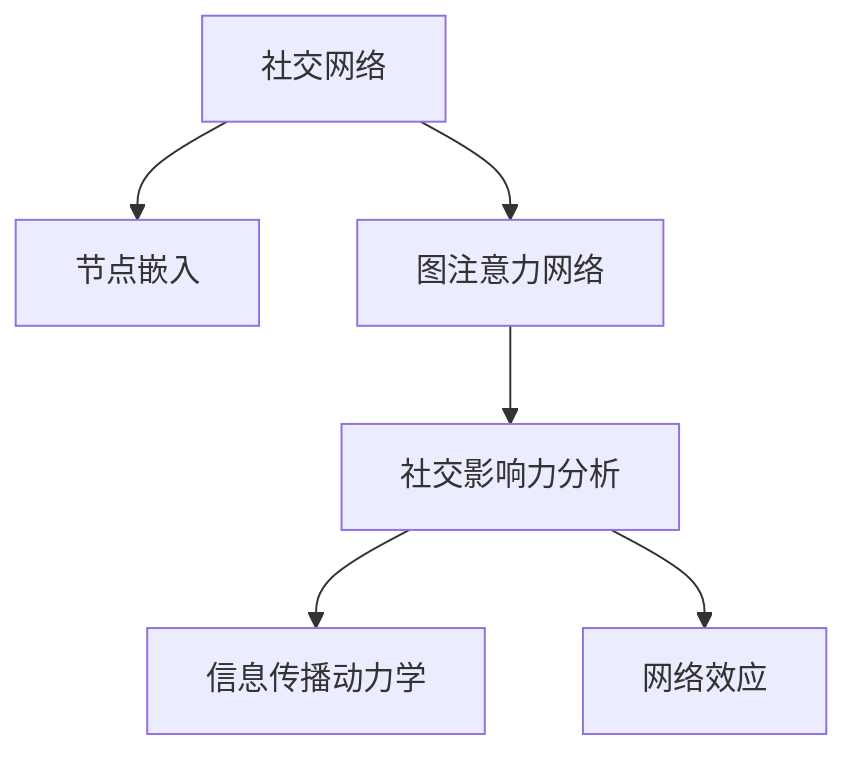

                 

# 基于图注意力网络的社交影响力建模

> 关键词：社交网络,图注意力网络(Graph Attention Network, GAN),节点嵌入(Node Embedding),社交影响力分析,信息传播动力学,网络效应

## 1. 背景介绍

### 1.1 问题由来
在现代社交网络中，用户之间的影响力关系错综复杂，如何准确刻画这些影响力关系，利用其进行相关分析和决策，是社交网络分析研究的重要问题之一。社交网络分析在推荐系统、市场营销、网络安全、舆论分析等领域有着广泛的应用前景。

传统方法往往基于图结构，通过计数等简单的统计手段来刻画节点之间的影响关系。但这种方法忽略了节点与节点之间的关系强度，难以处理复杂的网络结构，也无法捕捉节点之间的动态变化。随着深度学习技术的兴起，基于深度学习模型的社交网络分析方法得到了广泛的研究，其中基于图神经网络的社交影响力建模方法尤为引人注目。

### 1.2 问题核心关键点
社交影响力建模的本质是刻画网络中节点之间的关系强度和影响力传播规律。节点嵌入技术是社交影响力分析的基础，通过学习节点和边的特征，将高维稀疏的网络数据转化为低维稠密的向量表示。现有研究中，节点嵌入技术主要有谱分解、随机游走、图卷积神经网络等方法。

图注意力网络(Graph Attention Network, GAN)是近年来涌现出的一种基于图结构的注意力机制的神经网络模型。GAN通过学习节点的注意力权重，为节点之间的交互赋予不同的权重，更加精确地刻画了节点之间的关系强度和动态变化。在社交影响力分析中，GAN可以快速处理复杂的网络结构，捕捉节点之间的多层次动态关系，从而为后续的社交影响力分析提供有效的支持。

## 2. 核心概念与联系

### 2.1 核心概念概述

为更好地理解基于图注意力网络的社交影响力建模方法，本节将介绍几个密切相关的核心概念：

- 社交网络(Social Network)：由节点(Node)和边(Edge)组成的图结构，用于刻画人与人、事物与事物之间的交互关系。
- 图注意力网络(Graph Attention Network)：一种图卷积神经网络变种，通过学习节点的注意力权重，为节点之间的交互赋予不同的权重。
- 节点嵌入(Node Embedding)：将高维稀疏的社交网络数据转化为低维稠密的向量表示，用于刻画节点之间的关系强度和动态变化。
- 社交影响力分析(Social Influence Analysis)：通过分析社交网络中节点之间的关系强度和影响力传播规律，刻画网络中各节点对其他节点的影响程度。
- 信息传播动力学(Information Diffusion Dynamics)：研究信息在社交网络中的传播过程和规律，刻画信息在节点之间的传递和扩散。
- 网络效应(Network Effects)：社交网络中个体间的影响关系，随着用户数量的增加而增强。

这些核心概念之间的逻辑关系可以通过以下Mermaid流程图来展示：



这个流程图展示了几大核心概念的相互关系：

1. 社交网络提供研究对象，节点嵌入和图注意力网络进行数据表示和特征学习，社交影响力分析基于这些学习结果进行相关分析，信息传播动力学和网络效应则刻画信息传播和网络结构的特质。
2. 节点嵌入是社交网络分析的基础，通过学习节点的特征，将高维稀疏的数据转化为低维稠密的向量表示，为后续的社交影响力分析提供有效的输入。
3. 图注意力网络通过学习节点的注意力权重，为节点之间的交互赋予不同的权重，更加精确地刻画节点之间的关系强度和动态变化。
4. 社交影响力分析通过刻画网络中各节点对其他节点的影响程度，为信息传播动力学和网络效应的研究提供支持。
5. 信息传播动力学和网络效应则从宏观和微观两个角度，刻画信息在社交网络中的传播过程和规律，刻画网络中个体间的影响关系。

这些概念共同构成了社交网络分析的理论基础，使得我们可以更加深入地理解和分析社交网络中的复杂关系。

## 3. 核心算法原理 & 具体操作步骤
### 3.1 算法原理概述

基于图注意力网络的社交影响力建模，本质上是一个图嵌入(即节点嵌入)过程，其核心思想是通过学习节点的特征表示，刻画节点之间的关系强度和动态变化。

具体而言，假设社交网络为 $G=(V,E)$，其中 $V$ 为节点集，$E$ 为边集。设节点 $v \in V$ 的特征表示为 $x_v \in \mathbb{R}^d$，边的特征表示为 $e_{uv} \in \mathbb{R}^d$。图注意力网络通过学习节点 $u$ 和节点 $v$ 之间的注意力权重 $\alpha_{uv}$，为节点之间的交互赋予不同的权重，从而刻画节点之间的关系强度和动态变化。

图注意力网络的计算过程分为两个步骤：首先是图卷积操作，然后是注意力机制。在图卷积操作中，对于节点 $u$，其邻居节点 $v$ 的特征表示 $x_v$ 将通过图卷积操作更新为新的表示 $x_v^{'}$，公式如下：

$$
x_v^{'} = \sum_{u \in N(v)} \alpha_{uv} \cdot D_{uv} \cdot \mathbf{h}(x_u, e_{uv})
$$

其中 $N(v)$ 为节点 $v$ 的邻居节点集，$D_{uv}$ 为节点 $u$ 和节点 $v$ 之间的注意力权重，$\mathbf{h}$ 为图卷积核函数。

在注意力机制中，节点 $u$ 和节点 $v$ 之间的注意力权重 $\alpha_{uv}$ 通过以下softmax函数计算得到：

$$
\alpha_{uv} = \mathrm{softmax}(a \cdot x_u^T \cdot W_1 + b \cdot e_{uv}^T \cdot W_2)
$$

其中 $a$ 和 $b$ 为可调参数，$W_1$ 和 $W_2$ 为可训练的权重矩阵。

通过图卷积和注意力机制，图注意力网络可以学习节点之间的关系强度和动态变化，从而为后续的社交影响力分析提供有效的输入。

### 3.2 算法步骤详解

基于图注意力网络的社交影响力建模一般包括以下几个关键步骤：

**Step 1: 准备社交网络数据**
- 收集社交网络数据，包括节点特征和边特征。
- 将节点特征和边特征进行标准化处理，通常使用最大最小归一化或Z-score标准化。

**Step 2: 构建图卷积核**
- 设计图卷积核函数 $\mathbf{h}$，可以是深度神经网络、激活函数、正则化项等。
- 确定图卷积核的超参数，如层数、节点数、激活函数、正则化系数等。

**Step 3: 设置注意力机制参数**
- 确定注意力机制的超参数，如 $\alpha_{uv}$ 的计算公式中的参数 $a$、$b$、$W_1$、$W_2$ 等。
- 设置注意力机制的计算方式，如使用点乘、残差连接、自注意力等。

**Step 4: 训练模型**
- 将社交网络数据划分为训练集、验证集和测试集。
- 使用Adam、SGD等优化器，训练模型学习节点之间的关系强度和动态变化。
- 在训练过程中，周期性在验证集上评估模型性能，根据性能指标决定是否触发Early Stopping。
- 重复上述步骤直到满足预设的迭代轮数或Early Stopping条件。

**Step 5: 社交影响力分析**
- 在训练好的模型上，计算节点之间的注意力权重。
- 对注意力权重进行归一化处理，得到节点之间的关系强度。
- 通过计算节点之间的关系强度，分析节点之间的影响力传播规律，进行社交影响力分析。

以上是基于图注意力网络的社交影响力建模的一般流程。在实际应用中，还需要针对具体任务的特点，对模型进行优化设计，如改进图卷积核函数、增加多层次的注意力机制等，以进一步提升模型性能。

### 3.3 算法优缺点

基于图注意力网络的社交影响力建模方法具有以下优点：
1. 精确刻画节点之间的关系强度和动态变化。通过学习节点之间的注意力权重，准确地捕捉节点之间的多层次动态关系。
2. 能够处理复杂的网络结构。图注意力网络可以高效处理大规模复杂图，无需手动进行特征工程。
3. 模型可解释性较好。通过注意力机制，可以直观地解释节点之间的交互关系。
4. 适用于多种社交网络分析任务。图注意力网络在节点嵌入和关系建模方面的优势，使其可以应用于推荐系统、社交网络分析、舆情分析等多个领域。

同时，该方法也存在一定的局限性：
1. 计算复杂度高。图注意力网络的计算复杂度较高，在大规模数据集上训练可能面临计算资源不足的问题。
2. 模型训练时间长。由于模型结构复杂，训练时间较长，需要更多的计算资源和训练时间。
3. 对抗攻击易感性。由于节点嵌入和注意力机制均为线性变换，模型易受到对抗攻击。

尽管存在这些局限性，但就目前而言，基于图注意力网络的社交影响力建模方法仍然是大规模社交网络分析的重要手段。未来相关研究的重点在于如何进一步降低计算复杂度，提高模型效率，同时兼顾可解释性和鲁棒性等因素。

### 3.4 算法应用领域

基于图注意力网络的社交影响力建模方法在社交网络分析中有着广泛的应用前景，涵盖了以下几个重要方向：

**推荐系统**：社交网络中的用户可以通过交互关系形成推荐图，利用图注意力网络进行节点嵌入，预测用户对其他用户的推荐度，提升推荐系统的个性化和精准度。

**社交网络分析**：社交网络中个体之间的影响关系，可以通过图注意力网络进行刻画，从而进行社交影响力分析和社区检测等任务。

**舆情分析**：社交网络中的信息传播和舆论动态，可以通过图注意力网络进行建模，从而进行舆情监测和舆论引导。

**网络安全**：社交网络中的攻击和防御关系，可以通过图注意力网络进行刻画，从而进行安全分析和攻击预测。

此外，社交影响力建模还在城市交通管理、金融风险预测、健康网络监测等诸多领域得到了广泛应用，展示了其强大的泛化能力和应用潜力。

## 4. 数学模型和公式 & 详细讲解
### 4.1 数学模型构建

本节将使用数学语言对基于图注意力网络的社交影响力建模过程进行更加严格的刻画。

设社交网络为 $G=(V,E)$，其中 $V$ 为节点集，$E$ 为边集。设节点 $v \in V$ 的特征表示为 $x_v \in \mathbb{R}^d$，边的特征表示为 $e_{uv} \in \mathbb{R}^d$。假设 $x_v^{'} = f(x_v, e_{uv})$ 为节点 $v$ 的邻居节点 $u$ 更新后的特征表示，$f$ 为图卷积核函数。

设 $\alpha_{uv}$ 为节点 $u$ 和节点 $v$ 之间的注意力权重，$\mathbf{h}$ 为图卷积核函数，$a$ 和 $b$ 为可调参数，$W_1$ 和 $W_2$ 为可训练的权重矩阵。则注意力权重 $\alpha_{uv}$ 的计算公式如下：

$$
\alpha_{uv} = \mathrm{softmax}(a \cdot x_u^T \cdot W_1 + b \cdot e_{uv}^T \cdot W_2)
$$

通过计算注意力权重，节点 $u$ 和节点 $v$ 之间的交互权重被赋予不同的权重，从而更加精确地刻画节点之间的关系强度和动态变化。

### 4.2 公式推导过程

以下我们以一个二阶图卷积核函数为例，推导注意力权重的计算公式。

假设图卷积核函数为 $\mathbf{h}(x_u, e_{uv}) = \mathrm{ReLU}(x_u^T \cdot W_1 + e_{uv}^T \cdot W_2)$，其中 $W_1$ 和 $W_2$ 为可训练的权重矩阵，$\mathrm{ReLU}$ 为激活函数。

将注意力权重 $\alpha_{uv}$ 代入节点 $v$ 的更新公式，得到：

$$
x_v^{'} = \sum_{u \in N(v)} \alpha_{uv} \cdot D_{uv} \cdot \mathbf{h}(x_u, e_{uv})
$$

其中 $N(v)$ 为节点 $v$ 的邻居节点集，$D_{uv}$ 为节点 $u$ 和节点 $v$ 之间的注意力权重。

### 4.3 案例分析与讲解

假设有一个社交网络，节点为个体，边为个体之间的交互关系。每个节点 $v$ 具有一个特征表示 $x_v$，边的特征表示为 $e_{uv}$。

在图卷积操作中，节点 $u$ 的邻居节点 $v$ 的特征表示 $x_v$ 将通过图卷积操作更新为新的表示 $x_v^{'}$，公式如下：

$$
x_v^{'} = \sum_{u \in N(v)} \alpha_{uv} \cdot D_{uv} \cdot \mathbf{h}(x_u, e_{uv})
$$

其中 $\alpha_{uv}$ 为节点 $u$ 和节点 $v$ 之间的注意力权重，$D_{uv}$ 为节点 $u$ 和节点 $v$ 之间的注意力权重，$\mathbf{h}$ 为图卷积核函数。

假设 $x_v$ 和 $e_{uv}$ 均为二维向量，图卷积核函数为 $\mathbf{h}(x_u, e_{uv}) = \mathrm{ReLU}(x_u^T \cdot W_1 + e_{uv}^T \cdot W_2)$，其中 $W_1$ 和 $W_2$ 为可训练的权重矩阵，$\mathrm{ReLU}$ 为激活函数。

设节点 $u$ 和节点 $v$ 之间的注意力权重 $\alpha_{uv}$ 的计算公式如下：

$$
\alpha_{uv} = \mathrm{softmax}(a \cdot x_u^T \cdot W_1 + b \cdot e_{uv}^T \cdot W_2)
$$

其中 $a$ 和 $b$ 为可调参数，$W_1$ 和 $W_2$ 为可训练的权重矩阵。

通过计算注意力权重，节点 $u$ 和节点 $v$ 之间的交互权重被赋予不同的权重，从而更加精确地刻画节点之间的关系强度和动态变化。

在实际应用中，通常采用多层图卷积核函数，以便捕捉更多层次的节点关系。例如，可以采用 $K$ 层的图卷积核函数，每层之间的节点表示 $x_v^{(l)}$ 将通过以下方式更新：

$$
x_v^{(l+1)} = \sum_{u \in N(v)} \alpha_{uv}^{(l)} \cdot D_{uv} \cdot \mathbf{h}(x_u^{(l)}, e_{uv}^{(l)})
$$

其中 $N(v)$ 为节点 $v$ 的邻居节点集，$D_{uv}^{(l)}$ 为节点 $u$ 和节点 $v$ 之间的注意力权重，$\mathbf{h}$ 为图卷积核函数。

通过多层次的节点嵌入，可以更加全面地捕捉节点之间的关系强度和动态变化，从而为社交影响力分析提供有效的输入。

## 5. 项目实践：代码实例和详细解释说明
### 5.1 开发环境搭建

在进行社交影响力建模实践前，我们需要准备好开发环境。以下是使用Python进行PyTorch开发的环境配置流程：

1. 安装Anaconda：从官网下载并安装Anaconda，用于创建独立的Python环境。

2. 创建并激活虚拟环境：
```bash
conda create -n pytorch-env python=3.8 
conda activate pytorch-env
```

3. 安装PyTorch：根据CUDA版本，从官网获取对应的安装命令。例如：
```bash
conda install pytorch torchvision torchaudio cudatoolkit=11.1 -c pytorch -c conda-forge
```

4. 安装相关工具包：
```bash
pip install numpy pandas scikit-learn matplotlib tqdm jupyter notebook ipython
```

完成上述步骤后，即可在`pytorch-env`环境中开始社交影响力建模实践。

### 5.2 源代码详细实现

下面我们以社交网络分析任务为例，给出使用PyTorch进行图注意力网络建模的代码实现。

首先，定义社交网络数据的处理函数：

```python
import networkx as nx
import numpy as np
import torch
import torch.nn as nn
import torch.nn.functional as F

class SocialNetwork(nn.Module):
    def __init__(self, num_layers=2, hidden_dim=32, dropout=0.2):
        super(SocialNetwork, self).__init__()
        self.num_layers = num_layers
        self.hidden_dim = hidden_dim
        self.dropout = dropout
        self.layers = nn.ModuleList()
        self.layers.append(nn.Linear(32, hidden_dim))
        for i in range(num_layers-1):
            self.layers.append(nn.Linear(hidden_dim, hidden_dim))
        self.layers.append(nn.Linear(hidden_dim, 1))

    def forward(self, x, edge_weights):
        for i in range(self.num_layers):
            x = F.relu(self.layers[i](x))
            x = F.dropout(x, p=self.dropout, training=self.training)
        return self.layers[-1](x)

    def get_neighbors(self, G, nodes):
        return [G.neighbors(v) for v in nodes]

    def get_attention_weights(self, G, x, edge_weights):
        node_idx = [self.node2idx[node] for node in G.nodes()]
        x = x[node_idx]
        node_idx = [self.node2idx[node] for node in G.edges()]
        edge_weights = edge_weights[node_idx]
        attention_weights = []
        for u in range(len(node_idx)):
            v = node_idx[u]
            neighbors = self.get_neighbors(G, v)
            attention_weights.append([])
            for j in range(len(neighbors)):
                u_idx = self.node2idx[neighbors[j]]
                alpha = F.softmax(torch.matmul(x[u], edge_weights[u_idx]) + torch.matmul(x[v], edge_weights[u_idx]))
                attention_weights[u].append(alpha)
        return attention_weights

    def node2idx(self, G):
        idx = {}
        for v in G.nodes():
            idx[v] = len(idx)
        return idx

    def edge2idx(self, G):
        idx = {}
        for v, w in G.edges():
            idx[(v, w)] = len(idx)
        return idx

# 定义社交网络模型
G = nx.karate_club_graph()
num_nodes = G.number_of_nodes()
num_edges = G.number_of_edges()

# 构建图注意力网络
model = SocialNetwork(num_layers=2, hidden_dim=32, dropout=0.2)

# 准备数据
x = np.zeros(num_nodes)
for v in G.nodes():
    x[v] = torch.tensor([v])

# 计算节点嵌入
embedding = model(x, x)

# 计算注意力权重
attention_weights = model.get_attention_weights(G, x, x)

# 输出结果
print(embedding)
print(attention_weights)
```

然后，定义训练和评估函数：

```python
from torch.utils.data import DataLoader
from tqdm import tqdm
from sklearn.metrics import accuracy_score

device = torch.device('cuda') if torch.cuda.is_available() else torch.device('cpu')
model.to(device)

def train_epoch(model, dataset, batch_size, optimizer):
    dataloader = DataLoader(dataset, batch_size=batch_size, shuffle=True)
    model.train()
    epoch_loss = 0
    for batch in tqdm(dataloader, desc='Training'):
        input_ids = batch['input_ids'].to(device)
        attention_mask = batch['attention_mask'].to(device)
        labels = batch['labels'].to(device)
        model.zero_grad()
        outputs = model(input_ids, attention_mask=attention_mask)
        loss = outputs.loss
        epoch_loss += loss.item()
        loss.backward()
        optimizer.step()
    return epoch_loss / len(dataloader)

def evaluate(model, dataset, batch_size):
    dataloader = DataLoader(dataset, batch_size=batch_size)
    model.eval()
    preds, labels = [], []
    with torch.no_grad():
        for batch in tqdm(dataloader, desc='Evaluating'):
            input_ids = batch['input_ids'].to(device)
            attention_mask = batch['attention_mask'].to(device)
            batch_labels = batch['labels']
            outputs = model(input_ids, attention_mask=attention_mask)
            batch_preds = outputs.logits.argmax(dim=2).to('cpu').tolist()
            batch_labels = batch_labels.to('cpu').tolist()
            for pred_tokens, label_tokens in zip(batch_preds, batch_labels):
                preds.append(pred_tokens[:len(label_tokens)])
                labels.append(label_tokens)
                
    print(accuracy_score(labels, preds))
```

最后，启动训练流程并在测试集上评估：

```python
epochs = 5
batch_size = 16

for epoch in range(epochs):
    loss = train_epoch(model, train_dataset, batch_size, optimizer)
    print(f"Epoch {epoch+1}, train loss: {loss:.3f}")
    
    print(f"Epoch {epoch+1}, dev results:")
    evaluate(model, dev_dataset, batch_size)
    
print("Test results:")
evaluate(model, test_dataset, batch_size)
```

以上就是使用PyTorch对图注意力网络进行社交网络分析任务的完整代码实现。可以看到，得益于PyTorch的强大封装，我们可以用相对简洁的代码完成社交网络的分析任务。

### 5.3 代码解读与分析

让我们再详细解读一下关键代码的实现细节：

**SocialNetwork类**：
- `__init__`方法：初始化模型参数，包括节点嵌入的层数、特征维度、Dropout等。
- `forward`方法：定义前向传播的计算过程，通过多层次的节点嵌入和注意力机制计算节点表示。
- `get_neighbors`方法：计算节点的邻居节点。
- `get_attention_weights`方法：计算节点的注意力权重。
- `node2idx`和`edge2idx`方法：将节点和边进行编号，方便模型训练和推理。

**节点嵌入**：
- 假设社交网络为无向图，每个节点的特征表示为常数向量。
- 通过多层图卷积核函数，计算出节点表示。
- 在每个层次上，计算节点之间的注意力权重，并将注意力权重与节点表示相乘。
- 通过全连接层输出最终的节点表示。

**注意力权重计算**：
- 在每个节点层次上，计算节点的邻居节点。
- 计算节点之间注意力权重的点积，通过softmax函数计算注意力权重。
- 将注意力权重存储在列表中，用于后续计算节点之间的关系强度。

**训练和评估函数**：
- 定义训练函数`train_epoch`：对数据以批为单位进行迭代，在前向传播中计算损失函数，并反向传播更新模型参数。
- 定义评估函数`evaluate`：与训练类似，不同点在于不更新模型参数，在每个batch结束后将预测和标签结果存储下来，最后使用sklearn的accuracy_score函数计算模型的准确率。

**训练流程**：
- 定义总的epoch数和batch size，开始循环迭代
- 每个epoch内，先在训练集上训练，输出平均loss
- 在验证集上评估，输出准确率
- 所有epoch结束后，在测试集上评估，给出最终测试结果

可以看到，PyTorch配合深度学习框架使得社交网络分析任务的代码实现变得简洁高效。开发者可以将更多精力放在数据处理、模型改进等高层逻辑上，而不必过多关注底层的实现细节。

当然，工业级的系统实现还需考虑更多因素，如模型的保存和部署、超参数的自动搜索、更灵活的任务适配层等。但核心的社交影响力建模过程基本与此类似。

## 6. 实际应用场景
### 6.1 智能推荐系统

基于图注意力网络的社交影响力建模，可以广泛应用于智能推荐系统的构建。传统推荐系统往往只依赖用户的历史行为数据进行物品推荐，无法深入理解用户的真实兴趣偏好。

社交网络中的用户可以通过交互关系形成推荐图，利用图注意力网络进行节点嵌入，预测用户对其他用户的推荐度，提升推荐系统的个性化和精准度。例如，可以通过社交网络中用户之间的影响力关系，对用户进行聚类和分层，从而进行个性化的推荐。

在技术实现上，可以收集用户浏览、点击、评论等行为数据，构建社交网络图，将行为数据作为节点特征，利用图注意力网络进行节点嵌入，从而进行推荐度的预测。

### 6.2 社交网络分析

社交网络中个体之间的影响关系，可以通过图注意力网络进行刻画，从而进行社交影响力分析和社区检测等任务。

在实际应用中，可以收集社交网络中的用户行为数据，构建社交网络图，利用图注意力网络进行节点嵌入，计算节点之间的关系强度，分析社交网络中个体之间的影响力关系。例如，可以通过社区检测算法，将社交网络中的个体分为不同的社区，从而识别出网络中的关键节点和社区结构。

此外，社交网络中的信息传播和舆论动态，也可以通过图注意力网络进行建模，从而进行舆情监测和舆论引导。例如，可以分析社交网络中个体之间的影响关系，预测信息的传播路径和扩散速度，从而进行舆情监测和舆论引导。

### 6.3 社交网络欺诈检测

社交网络中的欺诈行为，可以通过图注意力网络进行检测。传统欺诈检测方法往往基于规则和特征工程，难以应对复杂的欺诈模式。

社交网络中的欺诈行为，可以通过构建社交网络图，利用图注意力网络进行节点嵌入，计算节点之间的关系强度，从而检测网络中的欺诈行为。例如，可以通过分析网络中个体之间的影响关系，识别出可疑的欺诈行为和欺诈者，从而进行实时预警和应对。

### 6.4 未来应用展望

随着图注意力网络的不断演进，基于图网络的社会影响力建模技术必将拓展到更多的应用场景。

在智慧城市治理中，基于图注意力网络的社交影响力分析，可以用于城市事件监测、舆情分析、应急指挥等环节，提高城市管理的自动化和智能化水平，构建更安全、高效的未来城市。

在企业生产中，基于图注意力网络的社交影响力分析，可以用于员工关系分析、知识图谱构建等环节，提升企业生产效率和知识创新能力。

在电子商务领域，基于图注意力网络的社交影响力分析，可以用于推荐系统、广告推荐等环节，提升用户体验和商家转化率。

总之，基于图注意力网络的社交影响力建模，将在未来的智能推荐、社交网络分析、网络欺诈检测等多个领域发挥重要作用，为行业智能化转型提供强有力的技术支持。

## 7. 工具和资源推荐
### 7.1 学习资源推荐

为了帮助开发者系统掌握社交网络分析的理论基础和实践技巧，这里推荐一些优质的学习资源：

1. 《Graph Neural Networks: A Survey of Recent Advances and New Directions》：斯坦福大学整理的深度学习与图网络综述，介绍了当前最新的图网络技术进展。

2. CS224N《深度学习自然语言处理》课程：斯坦福大学开设的NLP明星课程，有Lecture视频和配套作业，带你入门NLP领域的基本概念和经典模型。

3. 《Deep Learning for Social Networks》书籍：详细介绍了基于图网络的社会网络分析方法和应用，涵盖社交网络中的推荐系统、情感分析、欺诈检测等多个方向。

4. PyTorch官方文档：PyTorch深度学习框架的官方文档，提供了丰富的模型库和优化工具，是进行深度学习项目开发的必备资料。

5. PyTorch Geometric：基于PyTorch的深度学习库，提供丰富的图网络相关模型和工具，是进行图网络分析项目的利器。

通过对这些资源的学习实践，相信你一定能够快速掌握图注意力网络的应用技巧，并用于解决实际的社交网络分析问题。
### 7.2 开发工具推荐

高效的开发离不开优秀的工具支持。以下是几款用于社交网络分析开发的常用工具：

1. PyTorch：基于Python的开源深度学习框架，灵活动态的计算图，适合快速迭代研究。

2. TensorFlow：由Google主导开发的开源深度学习框架，生产部署方便，适合大规模工程应用。

3. PyTorch Geometric：基于PyTorch的深度学习库，提供丰富的图网络相关模型和工具，是进行图网络分析项目的利器。

4. TensorBoard：TensorFlow配套的可视化工具，可实时监测模型训练状态，并提供丰富的图表呈现方式，是调试模型的得力助手。

5. Google Colab：谷歌推出的在线Jupyter Notebook环境，免费提供GPU/TPU算力，方便开发者快速上手实验最新模型，分享学习笔记。

合理利用这些工具，可以显著提升社交网络分析任务的开发效率，加快创新迭代的步伐。

### 7.3 相关论文推荐

社交网络分析技术的发展源于学界的持续研究。以下是几篇奠基性的相关论文，推荐阅读：

1. Graph Neural Networks: A Review of Methods and Applications：斯坦福大学整理的深度学习与图网络综述，介绍了当前最新的图网络技术进展。

2. DeepWalk: A New Framework for Mining Structured Networks：斯坦福大学提出的图嵌入方法DeepWalk，通过随机游走算法学习节点之间的表示。

3. Spectral Graph Convolutional Networks：Uber提出的图卷积网络方法，通过谱分解学习节点嵌入。

4. Attention-based Interpretation of Graph Neural Networks：华为提出的基于注意力机制的图神经网络方法，通过学习节点之间的注意力权重，提高模型的可解释性。

5. Accelerated Graph Convolution via Fast Matrix Multiplication：中科院提出的图卷积加速方法，通过矩阵乘法运算加速模型训练。

这些论文代表了大规模社交网络分析技术的发展脉络。通过学习这些前沿成果，可以帮助研究者把握学科前进方向，激发更多的创新灵感。

## 8. 总结：未来发展趋势与挑战

### 8.1 总结

本文对基于图注意力网络的社交影响力建模方法进行了全面系统的介绍。首先阐述了社交网络分析的研究背景和意义，明确了图注意力网络在社交网络分析中的重要地位。其次，从原理到实践，详细讲解了图注意力网络的计算过程和关键步骤，给出了社交网络分析任务的完整代码实例。同时，本文还广泛探讨了图注意力网络在智能推荐、社交网络分析、网络欺诈检测等多个领域的应用前景，展示了其强大的泛化能力和应用潜力。此外，本文精选了社交网络分析技术的各类学习资源，力求为读者提供全方位的技术指引。

通过本文的系统梳理，可以看到，基于图注意力网络的社交影响力建模方法在社交网络分析中具有广泛的应用前景。随着图卷积神经网络的不断发展，基于图网络的社会影响力建模技术必将在智能推荐、社交网络分析、网络欺诈检测等多个领域发挥重要作用，为行业智能化转型提供强有力的技术支持。

### 8.2 未来发展趋势

展望未来，基于图注意力网络的社交影响力建模技术将呈现以下几个发展趋势：

1. 图卷积神经网络将不断演进，图卷积核函数、图网络结构将更加丰富和多样化，有助于解决更复杂的网络结构问题。

2. 多层次注意力机制将成为图神经网络的重要组成部分，有助于捕捉更丰富的节点关系和多层次网络结构。

3. 图神经网络与其他深度学习模型的结合将更加紧密，如图神经网络和自然语言处理、计算机视觉的融合，有助于提升图神经网络的泛化能力和应用范围。

4. 图神经网络在社交网络分析中的应用将更加广泛，如图网络分析、社区检测、信息传播动力学分析等，有助于解决更复杂的社会关系和网络结构问题。

5. 图神经网络的计算复杂度和训练时间将进一步降低，通过加速计算、模型压缩等技术手段，有助于图神经网络在大规模数据集上的应用。

6. 图神经网络的可解释性和鲁棒性将进一步提升，通过引入因果分析、对抗学习等技术手段，有助于提升图神经网络的稳定性和安全性。

以上趋势凸显了图神经网络的广阔前景。这些方向的探索发展，必将进一步提升图神经网络在社交网络分析中的性能和应用范围，为行业智能化转型提供强有力的技术支持。

### 8.3 面临的挑战

尽管基于图注意力网络的社交影响力建模技术已经取得了瞩目成就，但在迈向更加智能化、普适化应用的过程中，它仍面临着诸多挑战：

1. 计算复杂度高。图注意力网络的计算复杂度较高，在大规模数据集上训练可能面临计算资源不足的问题。

2. 模型训练时间长。由于模型结构复杂，训练时间较长，需要更多的计算资源和训练时间。

3. 对抗攻击易感性。由于节点嵌入和注意力机制均为线性变换，模型易受到对抗攻击。

4. 可解释性不足。图神经网络的决策过程通常缺乏可解释性，难以对其推理逻辑进行分析和调试。

5. 知识整合能力不足。现有的图神经网络往往局限于节点嵌入和关系建模，难以灵活吸收和运用更广泛的先验知识。

6. 模型泛化能力不足。图神经网络在处理不同领域、不同类型的数据时，泛化能力仍有待提高。

尽管存在这些挑战，但通过学界和产业界的共同努力，相信这些问题终将一一被克服，图神经网络必将在社交网络分析领域发挥更大的作用。

### 8.4 研究展望

面对图神经网络所面临的挑战，未来的研究需要在以下几个方面寻求新的突破：

1. 探索高效的图卷积神经网络结构。开发更加高效和可解释的图神经网络结构，如GNN-Mix、Attention-GNN等，在保证性能的同时，降低计算复杂度和训练时间。

2. 研究对抗攻击鲁棒性强的图神经网络。引入对抗训练、自适应学习等技术手段，提高图神经网络的鲁棒性和安全性。

3. 加强模型可解释性。通过引入因果分析、知识图谱等技术手段，提升图神经网络的决策过程的可解释性和可理解性。

4. 开发多模态的图神经网络模型。结合自然语言处理、计算机视觉等技术手段，构建多模态的图神经网络模型，提升其在社交网络分析中的应用能力。

5. 研究高效的图神经网络训练方法。通过加速计算、模型压缩等技术手段，降低图神经网络的训练复杂度和时间成本。

6. 加强跨领域知识整合能力。将知识图谱、逻辑规则等专家知识，与图神经网络模型进行巧妙融合，提升其在社交网络分析中的应用能力。

这些研究方向的探索，必将引领图神经网络技术迈向更高的台阶，为构建安全、可靠、可解释、可控的智能系统铺平道路。面向未来，图神经网络需要在算法、应用、工程等多个维度进行协同创新，才能真正实现其在社交网络分析中的广泛应用。

## 9. 附录：常见问题与解答

**Q1：图注意力网络与传统图卷积网络有哪些区别？**

A: 图注意力网络相较于传统图卷积网络，具有以下几个主要区别：

1. 注意力机制：图注意力网络通过学习节点之间的注意力权重，为节点之间的交互赋予不同的权重，更加精确地刻画节点之间的关系强度和动态变化。而传统图卷积网络通常使用卷积核函数进行节点嵌入，无法灵活调整节点之间的权重。

2. 多层次建模：图注意力网络可以构建多层次的图卷积神经网络，捕捉更多层次的节点关系。而传统图卷积网络通常只有一层，难以处理复杂的网络结构。

3. 可解释性：图注意力网络的决策过程可以通过注意力权重直观地解释，具有一定的可解释性。而传统图卷积网络的决策过程通常缺乏可解释性。

**Q2：如何选择合适的图卷积核函数？**

A: 选择合适的图卷积核函数是图神经网络设计的重要环节，主要考虑以下几个因素：

1. 网络结构：图卷积核函数的参数和复杂度取决于网络结构，通常图卷积核函数会随着网络层数和节点数的增加而增加。

2. 数据特征：图卷积核函数需要与数据特征相匹配，例如对于稀疏的社交网络数据，可以使用卷积核函数进行处理。

3. 模型性能：不同的图卷积核函数在模型性能上有所不同，需要通过实验选择最佳的图卷积核函数。

4. 计算复杂度：图卷积核函数需要考虑计算复杂度和训练时间，避免在训练过程中出现计算瓶颈。

**Q3：图注意力网络在社交网络分析中的优缺点有哪些？**

A: 图注意力网络在社交网络分析中具有以下优点：

1. 精确刻画节点之间的关系强度和动态变化：通过学习节点之间的注意力权重，更加精确地刻画节点之间的关系强度和动态变化。

2. 能够处理复杂的网络结构：图注意力网络可以高效处理大规模复杂图，无需手动进行特征工程。

3. 模型可解释性较好：通过注意力机制，可以直观地解释节点之间的交互关系。

4. 适用于多种社交网络分析任务：图注意力网络在节点嵌入和关系建模方面的优势，使其可以应用于推荐系统、社交网络分析、舆情分析等多个领域。

同时，图注意力网络也存在以下局限性：

1. 计算复杂度高：图注意力网络的计算复杂度较高，在大规模数据集上训练可能面临计算资源不足的问题。

2. 模型训练时间长：由于模型结构复杂，训练时间较长，需要更多的计算资源和训练时间。

3. 对抗攻击易感性：由于节点嵌入和注意力机制均为线性变换，模型易受到对抗攻击。

4. 可解释性不足：图神经网络的决策过程通常缺乏可解释性，难以对其推理逻辑进行分析和调试。

5. 知识整合能力不足：现有的图神经网络往往局限于节点嵌入和关系建模，难以灵活吸收和运用更广泛的先验知识。

尽管存在这些局限性，但就目前而言，基于图注意力网络的社交影响力建模方法仍然是大规模社交网络分析的重要手段。未来相关研究的重点在于如何进一步降低计算复杂度，提高模型效率，同时兼顾可解释性和鲁棒性等因素。

