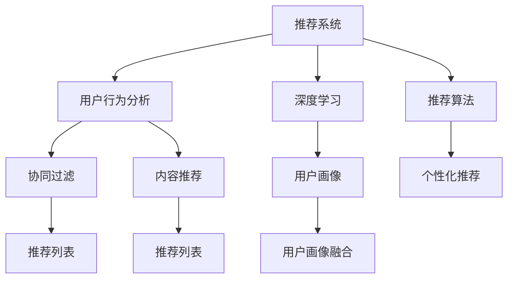

                 

# 基于大模型的推荐系统用户行为理解

> 关键词：
- 推荐系统
- 用户行为分析
- 深度学习
- 用户画像
- 自然语言处理(NLP)
- 协同过滤
- 内容推荐

## 1. 背景介绍

### 1.1 问题由来
在信息时代，互联网平台积累了海量的用户行为数据。如何通过这些数据，精准、高效地为用户推荐符合其兴趣和需求的内容，成为各大互联网公司面临的重要挑战。传统基于协同过滤和内容推荐的推荐系统在处理大规模数据时，计算开销大、推荐效果单一，难以满足用户多样化的需求。

近年来，基于深度学习的推荐系统逐渐成为研究热点。通过预训练语言模型和大规模数据，推荐系统在个性化推荐、新闻推荐、商品推荐等方面取得了显著的效果。本文旨在介绍基于大模型的推荐系统，如何通过对用户行为的深入理解，生成个性化的推荐内容。

## 2. 核心概念与联系

### 2.1 核心概念概述

为更好地理解基于大模型的推荐系统，本节将介绍几个关键概念及其之间的联系：

- **推荐系统(Recommender System)**：利用用户和物品的交互数据，为用户推荐物品的系统。推荐系统广泛应用于电商、社交、视频、新闻等众多领域，提升用户体验和平台粘性。

- **用户行为分析(Users Behavior Analysis)**：通过分析用户行为数据，了解用户兴趣偏好、行为模式，帮助推荐系统生成个性化推荐。

- **深度学习(Deep Learning)**：一类基于多层神经网络的机器学习方法，可以自动学习特征表示，提取高层次的抽象特征。

- **用户画像(User Profile)**：对用户进行多维度的特征描述，帮助推荐系统对用户进行精准定位。

- **自然语言处理(NLP)**：涉及计算机如何理解、分析、生成自然语言的技术。NLP在推荐系统中的应用，包括文本分析、情感分析、实体识别等，帮助系统更好地理解用户的语义信息。

- **协同过滤(Collaborative Filtering)**：基于用户对物品的评分数据，进行相似性匹配，为其他用户推荐相似物品。

- **内容推荐(Content-based Recommendation)**：根据物品的特征，匹配用户兴趣，推荐相关物品。

这些核心概念通过深度学习和大规模数据驱动，紧密相连，共同构成基于大模型的推荐系统框架。

### 2.2 核心概念原理和架构的 Mermaid 流程图(Mermaid 流程节点中不要有括号、逗号等特殊字符)



通过这个流程图，可以直观地看到基于大模型的推荐系统的工作流程：

1. 用户行为数据被收集和分析。
2. 利用深度学习，生成用户画像。
3. 结合协同过滤和内容推荐，生成推荐列表。
4. 通过推荐算法，实现个性化推荐。

## 3. 核心算法原理 & 具体操作步骤

### 3.1 算法原理概述

基于大模型的推荐系统核心原理如下：

1. **数据收集与预处理**：收集用户的历史行为数据，如浏览、点击、评分、评论等。
2. **用户画像构建**：利用深度学习技术，生成用户的多维度特征表示，形成用户画像。
3. **协同过滤与内容推荐**：将用户画像与物品特征进行匹配，生成推荐列表。
4. **个性化推荐**：通过推荐算法，对用户画像进行优化，生成个性化推荐结果。

深度学习和大模型作为核心的技术手段，通过用户行为数据的自监督预训练，能够自动学习到用户兴趣、物品属性、上下文信息等，从而生成高质量的用户画像和推荐列表。

### 3.2 算法步骤详解

以下是基于大模型的推荐系统的详细步骤：

**Step 1: 数据收集与预处理**

- 收集用户的历史行为数据，如浏览记录、点击次数、评分、评论等。
- 对数据进行清洗和处理，去除噪声和异常值。
- 将用户-物品互动数据转换为稀疏矩阵格式。

**Step 2: 用户画像构建**

- 选择预训练语言模型（如BERT、GPT等），作为用户画像的构建基础。
- 对用户行为数据进行编码，形成文本表示。
- 使用预训练模型对文本表示进行预训练，学习到用户兴趣和行为模式。
- 使用多任务学习、序列模型等技术，生成用户画像。

**Step 3: 协同过滤与内容推荐**

- 基于用户画像和物品特征，计算相似度。
- 选择协同过滤或内容推荐算法，生成推荐列表。
- 对推荐列表进行优化，如排序、去重、平衡等。

**Step 4: 个性化推荐**

- 使用深度学习模型，对用户画像和推荐列表进行优化。
- 结合用户实时行为数据，动态更新推荐结果。
- 利用在线学习算法，提升推荐系统的长期效果。

### 3.3 算法优缺点

基于大模型的推荐系统具有以下优点：

1. **精准性**：通过深度学习技术，自动学习用户兴趣和物品特征，生成高质量的用户画像。
2. **适应性**：利用多任务学习等技术，生成多维度的用户画像，提升推荐系统的适应性。
3. **可扩展性**：大模型可以高效地扩展到各种任务，如电商推荐、社交推荐等。

同时，该方法也存在一些局限：

1. **计算资源消耗大**：大模型需要大量的计算资源进行预训练和微调。
2. **数据隐私问题**：用户行为数据可能涉及隐私，需要严格的隐私保护措施。
3. **推荐结果解释性差**：推荐模型通常被认为是"黑盒"，难以解释推荐逻辑。
4. **冷启动问题**：新用户或新物品的推荐效果不佳，需要更多的用户行为数据进行训练。

尽管存在这些局限，但就目前而言，基于深度学习的推荐系统仍是最主流的研究方向，且在实际应用中取得了显著的效果。

### 3.4 算法应用领域

基于大模型的推荐系统在电商、社交、新闻、视频等多个领域得到了广泛应用，例如：

- 电商推荐：如淘宝、京东等电商平台，通过推荐系统提高用户购买转化率。
- 社交推荐：如微博、微信等社交平台，为用户推荐好友和内容。
- 新闻推荐：如今日头条、网易新闻等，根据用户阅读偏好推荐新闻文章。
- 视频推荐：如抖音、YouTube等，根据用户观看历史推荐视频内容。

除了这些经典应用外，推荐系统还在更多场景中得到创新性的应用，如个性化广告、智能问答、智能助手等，为互联网平台带来全新的商业价值。

## 4. 数学模型和公式 & 详细讲解 & 举例说明（备注：数学公式请使用latex格式，latex嵌入文中独立段落使用 $$，段落内使用 $)
### 4.1 数学模型构建

本节将使用数学语言对基于大模型的推荐系统进行更加严格的刻画。

记用户历史行为数据为 $U=\{(x_i, y_i)\}_{i=1}^N$，其中 $x_i$ 表示用户历史行为，$y_i$ 表示用户对物品的评分或互动次数。定义用户画像表示为 $p_u \in \mathbb{R}^d$，物品特征表示为 $p_i \in \mathbb{R}^d$。

推荐系统的目标是通过学习用户画像和物品特征，最大化用户对推荐结果的满意度。假设推荐系统输出的推荐列表为 $R$，则推荐系统可以表示为：

$$
\max_{R} \sum_{(u,i) \in U} f(p_u, p_i, R)
$$

其中 $f$ 为满意度函数，可以定义为：

$$
f(p_u, p_i, R) = \log \sigma(\langle p_u, p_i \rangle) \cdot r + (1-\log(1-\sigma(\langle p_u, p_i \rangle))) \cdot (1-r)
$$

$\sigma$ 为sigmoid函数，$r$ 为推荐物品的实际评分，$\langle \cdot, \cdot \rangle$ 为向量的点积。

### 4.2 公式推导过程

上述满意度函数可以进一步展开：

$$
f(p_u, p_i, R) = \log \sigma(\langle p_u, p_i \rangle) \cdot r + (1-\log(1-\sigma(\langle p_u, p_i \rangle))) \cdot (1-r)
$$

$$
= \log \sigma(\langle p_u, p_i \rangle) \cdot r + \log(1 - \sigma(\langle p_u, p_i \rangle)) \cdot (1-r)
$$

$$
= \log [\sigma(\langle p_u, p_i \rangle) (1 - \sigma(\langle p_u, p_i \rangle))] \cdot (1-r)
$$

$$
= -\log [\sigma(\langle p_u, p_i \rangle) + (1-\sigma(\langle p_u, p_i \rangle))]
$$

将满意度函数带入推荐系统目标函数：

$$
\max_{R} \sum_{(u,i) \in U} f(p_u, p_i, R) = \max_{R} \sum_{(u,i) \in U} \left[-\log [\sigma(\langle p_u, p_i \rangle) + (1-\sigma(\langle p_u, p_i \rangle))] \right]
$$

通过最大化上述目标函数，可以生成推荐列表 $R$，使得用户对推荐结果的满意度最大化。

### 4.3 案例分析与讲解

以电商平台商品推荐为例，进行详细的案例分析：

假设用户 $u$ 对商品 $i$ 的评分是 $r_{ui}$，利用大模型训练用户画像 $p_u$ 和商品特征 $p_i$，将用户画像和商品特征进行相似度计算：

$$
\langle p_u, p_i \rangle = \sum_{j=1}^d p_{uj} p_{ij}
$$

相似度 $s_{ui} = \sigma(\langle p_u, p_i \rangle)$ 表示用户对商品的兴趣程度，$\sigma$ 为sigmoid函数，输出值介于0和1之间，越接近1表示用户对商品越感兴趣。

根据相似度计算推荐列表：

$$
R = \{j | \sigma(\langle p_u, p_j \rangle) \geq \theta \}
$$

其中 $\theta$ 为预设阈值，通常设置为0.5。

对推荐列表 $R$ 进行排序和去重，得到最终的推荐结果。

## 5. 项目实践：代码实例和详细解释说明
### 5.1 开发环境搭建

在进行推荐系统实践前，我们需要准备好开发环境。以下是使用Python进行PyTorch开发的环境配置流程：

1. 安装Anaconda：从官网下载并安装Anaconda，用于创建独立的Python环境。

2. 创建并激活虚拟环境：
```bash
conda create -n pytorch-env python=3.8 
conda activate pytorch-env
```

3. 安装PyTorch：根据CUDA版本，从官网获取对应的安装命令。例如：
```bash
conda install pytorch torchvision torchaudio cudatoolkit=11.1 -c pytorch -c conda-forge
```

4. 安装Transformers库：
```bash
pip install transformers
```

5. 安装各类工具包：
```bash
pip install numpy pandas scikit-learn matplotlib tqdm jupyter notebook ipython
```

完成上述步骤后，即可在`pytorch-env`环境中开始推荐系统开发。

### 5.2 源代码详细实现

这里我们以电商商品推荐系统为例，给出使用Transformers库对预训练模型进行推荐系统开发的PyTorch代码实现。

首先，定义推荐系统的用户画像构建函数：

```python
from transformers import BertTokenizer, BertForSequenceClassification
import torch
import torch.nn.functional as F

def create_user_profile(user_behavior, model_path):
    tokenizer = BertTokenizer.from_pretrained(model_path)
    user_profile = []
    for behavior in user_behavior:
        tokenized_input = tokenizer(behavior, return_tensors='pt', padding=True, truncation=True)
        user_profile.append(tokenized_input)
    return user_profile

# 用户历史行为
user_behavior = ['item1, 5', 'item2, 4', 'item3, 3', 'item4, 1', 'item5, 2']

# 预训练模型路径
model_path = 'bert-base-uncased'

# 构建用户画像
user_profile = create_user_profile(user_behavior, model_path)
```

然后，定义推荐系统的推荐函数：

```python
def recommend(user_profile, item_profile, model_path):
    # 加载预训练模型
    model = BertForSequenceClassification.from_pretrained(model_path)
    # 定义相似度计算函数
    def similarity(user_profile, item_profile):
        user_tokens = user_profile[0]['input_ids']
        item_tokens = item_profile[0]['input_ids']
        user_seq_len = user_profile[0]['attention_mask'][0]
        item_seq_len = item_profile[0]['attention_mask'][0]
        user_tokens = user_tokens[1:-1]
        item_tokens = item_tokens[1:-1]
        # 使用预训练模型计算相似度
        with torch.no_grad():
            user_tokens = torch.tensor(user_tokens, dtype=torch.long).unsqueeze(0)
            item_tokens = torch.tensor(item_tokens, dtype=torch.long).unsqueeze(0)
            user_seq_len = torch.tensor(user_seq_len, dtype=torch.long).unsqueeze(0)
            item_seq_len = torch.tensor(item_seq_len, dtype=torch.long).unsqueeze(0)
            user_profile = {'input_ids': user_tokens, 'attention_mask': user_seq_len}
            item_profile = {'input_ids': item_tokens, 'attention_mask': item_seq_len}
            outputs = model(user_profile, item_profile)
            return outputs.logits.squeeze(0)

    # 计算推荐列表
    recommend_list = []
    for i in range(len(item_profile)):
        similarity_score = similarity(user_profile, item_profile[i])
        if similarity_score >= 0.5:
            recommend_list.append(item_profile[i])
    return recommend_list
```

最后，启动推荐流程并在推荐结果上进行评估：

```python
# 商品历史行为
item_behavior = ['item1, 4', 'item2, 2', 'item3, 5', 'item4, 1', 'item5, 3']

# 构建商品画像
item_profile = create_user_profile(item_behavior, model_path)

# 推荐商品
recommend_list = recommend(user_profile, item_profile, model_path)

# 评估推荐效果
print('推荐列表：', recommend_list)
```

以上就是使用PyTorch对预训练模型进行电商商品推荐系统的完整代码实现。可以看到，借助Transformers库的封装能力，推荐系统的开发变得简洁高效。

### 5.3 代码解读与分析

让我们再详细解读一下关键代码的实现细节：

**create_user_profile函数**：
- 定义了用户画像的构建函数，将用户历史行为转换为模型可接受的格式。
- 使用BertTokenizer将用户行为文本转换为token ids和注意力掩码，用于模型输入。

**recommend函数**：
- 加载预训练模型 BertForSequenceClassification，用于计算用户画像与物品画像的相似度。
- 定义相似度计算函数 similarity，使用预训练模型计算用户画像与物品画像的相似度。
- 根据相似度筛选推荐列表，返回推荐的商品画像。

**推荐流程**：
- 定义用户历史行为和商品历史行为，构建用户画像和商品画像。
- 调用推荐函数 recommend，生成推荐列表。
- 打印推荐列表。

## 6. 实际应用场景
### 6.1 智能推荐系统

智能推荐系统是电商、社交、新闻等众多互联网应用的核心功能，通过深度学习和大模型的融合，推荐系统能够提供更加精准、个性化的推荐结果。

在电商推荐场景中，智能推荐系统可以根据用户浏览、点击、购买等历史行为，生成个性化商品推荐。例如，用户浏览了某品牌的衣服，智能推荐系统可以生成该品牌其他商品的推荐列表，提高用户的购买转化率。

在社交推荐场景中，智能推荐系统可以根据用户的好友关系、兴趣偏好、发布内容等数据，生成个性化的好友和内容推荐，提升用户粘性和活跃度。例如，用户关注了某位明星，智能推荐系统可以生成该明星的最新动态和相关内容推荐。

在新闻推荐场景中，智能推荐系统可以根据用户的阅读历史、浏览偏好、评论内容等数据，生成个性化的新闻文章推荐。例如，用户经常阅读财经类文章，智能推荐系统可以生成更多财经类文章推荐，提升用户阅读体验。

### 6.2 广告推荐系统

广告推荐系统是互联网广告领域的重要组成部分，通过深度学习和大模型的融合，广告推荐系统能够更精准地匹配用户需求和广告内容。

在广告推荐场景中，智能推荐系统可以根据用户的搜索历史、浏览行为、点击记录等数据，生成个性化的广告推荐。例如，用户搜索了某旅游目的地，智能推荐系统可以生成该目的地的相关旅游广告推荐，提升广告点击率和转化率。

广告推荐系统还结合用户画像和上下文信息，优化广告投放策略。例如，根据用户的地理位置、时间、设备等特征，智能推荐系统可以动态调整广告展示内容，提升广告效果。

### 6.3 内容推荐系统

内容推荐系统是视频、音乐、书籍等媒体平台的重要功能，通过深度学习和大模型的融合，内容推荐系统能够提供更加个性化、多样化的推荐内容。

在视频推荐场景中，智能推荐系统可以根据用户的历史观看记录、评分、评论等数据，生成个性化的视频推荐。例如，用户喜欢观看科幻类电影，智能推荐系统可以生成更多科幻类电影的推荐列表，提升用户观看体验。

在音乐推荐场景中，智能推荐系统可以根据用户的听歌历史、评分、收藏等数据，生成个性化的音乐推荐。例如，用户喜欢听摇滚乐，智能推荐系统可以生成更多摇滚乐的推荐列表，提升用户听歌体验。

在书籍推荐场景中，智能推荐系统可以根据用户的阅读历史、评分、评论等数据，生成个性化的书籍推荐。例如，用户喜欢阅读科幻类书籍，智能推荐系统可以生成更多科幻类书籍的推荐列表，提升用户阅读体验。

## 7. 工具和资源推荐
### 7.1 学习资源推荐

为了帮助开发者系统掌握基于大模型的推荐系统，这里推荐一些优质的学习资源：

1. 《深度学习推荐系统》课程：由深度学习专家讲授，涵盖推荐系统的发展历史、理论基础、算法设计等。
2. 《Recommender Systems》书籍：深度介绍推荐系统的工作原理、优化策略、评估指标等。
3. 《TensorFlow for Deep Learning》书籍：讲解如何使用TensorFlow进行深度学习项目开发，包括推荐系统在内的各种应用场景。
4. 《HuggingFace Blog》：包含大量深度学习和大模型的应用案例，推荐系统是其中的重要主题。
5. 《Kaggle》：推荐系统相关的数据集和竞赛，提供丰富的实战经验。

通过对这些资源的学习实践，相信你一定能够快速掌握基于大模型的推荐系统，并用于解决实际的推荐问题。

### 7.2 开发工具推荐

高效的开发离不开优秀的工具支持。以下是几款用于基于大模型推荐系统开发的常用工具：

1. PyTorch：基于Python的开源深度学习框架，灵活动态的计算图，适合快速迭代研究。大部分预训练语言模型都有PyTorch版本的实现。

2. TensorFlow：由Google主导开发的开源深度学习框架，生产部署方便，适合大规模工程应用。同样有丰富的预训练语言模型资源。

3. Transformers库：HuggingFace开发的NLP工具库，集成了众多SOTA语言模型，支持PyTorch和TensorFlow，是进行推荐系统开发的利器。

4. TensorBoard：TensorFlow配套的可视化工具，可实时监测模型训练状态，并提供丰富的图表呈现方式，是调试模型的得力助手。

5. Weights & Biases：模型训练的实验跟踪工具，可以记录和可视化模型训练过程中的各项指标，方便对比和调优。

6. Jupyter Notebook：开源的Jupyter Notebook环境，方便开发者快速迭代实验，记录学习笔记。

合理利用这些工具，可以显著提升推荐系统开发的效率，加快创新迭代的步伐。

### 7.3 相关论文推荐

基于大模型的推荐系统是一个快速发展的领域，以下是几篇奠基性的相关论文，推荐阅读：

1. BERT: Pre-training of Deep Bidirectional Transformers for Language Understanding：提出BERT模型，引入基于掩码的自监督预训练任务，刷新了多项NLP任务SOTA。

2. Attention is All You Need：提出Transformer结构，开启了NLP领域的预训练大模型时代。

3. Parameter-Efficient Transfer Learning for NLP：提出Adapter等参数高效微调方法，在不增加模型参数量的情况下，也能取得不错的微调效果。

4. Learning Deep Architectures for Recommender Systems with Missing Data：提出基于矩阵分解的协同过滤方法，解决推荐系统中的冷启动问题。

5. Multi-Task Learning for Automatic Personalized News Recommendation：提出多任务学习在推荐系统中的应用，提升推荐系统的综合性能。

这些论文代表了大模型推荐系统的发展脉络。通过学习这些前沿成果，可以帮助研究者把握学科前进方向，激发更多的创新灵感。

## 8. 总结：未来发展趋势与挑战

### 8.1 总结

本文对基于大模型的推荐系统进行了全面系统的介绍。首先阐述了推荐系统的研究背景和意义，明确了深度学习和大模型在推荐系统中的应用价值。其次，从原理到实践，详细讲解了推荐系统的核心算法，给出了推荐系统开发的完整代码实例。同时，本文还广泛探讨了推荐系统在电商、社交、新闻等多个领域的应用前景，展示了深度学习和大模型在推荐系统中的强大潜力。最后，本文精选了推荐系统的各类学习资源，力求为读者提供全方位的技术指引。

通过本文的系统梳理，可以看到，基于大模型的推荐系统正在成为推荐系统研究的重要方向，极大地拓展了推荐系统的应用边界，提高了推荐系统的精准度和个性化程度。未来，伴随深度学习和大模型的持续演进，推荐系统必将在更多领域得到应用，为互联网平台带来新的商业价值。

### 8.2 未来发展趋势

展望未来，基于大模型的推荐系统将呈现以下几个发展趋势：

1. **个性化推荐**：通过深度学习技术，生成更加精准的用户画像和推荐列表，提升个性化推荐的效果。

2. **实时推荐**：结合用户实时行为数据，动态更新推荐列表，提升推荐系统的时效性和适应性。

3. **跨域推荐**：将推荐系统扩展到多个领域，如电商、社交、视频等，实现多场景下的无缝推荐。

4. **多模态推荐**：结合文本、图像、语音等多模态数据，提升推荐系统的全面性和准确性。

5. **可解释性**：通过引入因果分析等方法，增强推荐系统的可解释性，提高用户的信任度和满意度。

6. **安全与隐私**：在推荐系统中加入隐私保护机制，确保用户数据的安全性，提升系统的可信度和可靠性。

7. **联邦学习**：通过联邦学习等技术，提升推荐系统的跨平台性能和数据利用率。

以上趋势凸显了基于大模型的推荐系统的广阔前景，这些方向的探索发展，必将进一步提升推荐系统的性能和应用范围，为互联网平台带来新的商业价值。

### 8.3 面临的挑战

尽管基于大模型的推荐系统已经取得了显著效果，但在迈向更加智能化、普适化应用的过程中，仍面临诸多挑战：

1. **计算资源消耗大**：大模型需要大量的计算资源进行预训练和微调，推荐系统的高效实现需要持续优化计算资源的使用。

2. **数据隐私问题**：用户行为数据涉及隐私，需要严格的隐私保护措施，确保数据安全。

3. **推荐结果解释性差**：推荐模型通常被认为是"黑盒"，难以解释推荐逻辑，降低用户信任度。

4. **冷启动问题**：新用户或新物品的推荐效果不佳，需要更多的用户行为数据进行训练。

5. **系统鲁棒性不足**：推荐系统面对域外数据时，泛化性能有限，可能存在过拟合风险。

6. **用户适应性**：用户对推荐系统的适应性不同，部分用户可能对推荐结果不满意，需要进行个性化的调优。

尽管存在这些挑战，但基于大模型的推荐系统仍是最为主流的研究方向，且在实际应用中取得了显著的效果。未来，相关研究仍需继续深化和优化，以应对各种实际问题。

### 8.4 研究展望

面对基于大模型的推荐系统所面临的挑战，未来的研究需要在以下几个方面寻求新的突破：

1. **优化推荐算法**：进一步优化推荐算法，提升推荐系统的精准度和个性化程度。

2. **改进模型结构**：设计更加高效、可解释的推荐模型，提升推荐系统的鲁棒性和适应性。

3. **提升可解释性**：通过引入因果分析、知识图谱等方法，增强推荐系统的可解释性，提升用户的信任度和满意度。

4. **融合多模态数据**：结合文本、图像、语音等多模态数据，提升推荐系统的全面性和准确性。

5. **优化数据隐私保护**：引入联邦学习等技术，保护用户数据的隐私，提升推荐系统的可信度和可靠性。

6. **优化实时推荐**：结合用户实时行为数据，动态更新推荐列表，提升推荐系统的时效性和适应性。

7. **优化计算资源使用**：采用模型压缩、梯度压缩等技术，优化推荐系统的计算资源使用，提升系统的效率和可扩展性。

这些研究方向的探索，必将引领推荐系统技术迈向更高的台阶，为构建更加智能、精准、可信的推荐系统提供新的思路。面向未来，基于大模型的推荐系统仍需与其他人工智能技术进行更深入的融合，如知识表示、因果推理、强化学习等，共同推动推荐系统技术的进步。只有勇于创新、敢于突破，才能不断拓展推荐系统的边界，让推荐系统更好地服务于人类社会。

## 9. 附录：常见问题与解答

**Q1：推荐系统是否可以处理大规模数据？**

A: 推荐系统可以处理大规模数据，但需要高效的算法和优化技术支持。通过分布式计算和大规模数据分片等技术，可以有效提升推荐系统的计算效率。

**Q2：推荐系统是否存在数据冷启动问题？**

A: 推荐系统确实存在冷启动问题，即新用户或新物品的推荐效果不佳。可以通过结合多任务学习、协同过滤等技术，解决冷启动问题。

**Q3：推荐系统如何平衡个性化和多样性？**

A: 推荐系统需要在个性化和多样性之间进行平衡。可以通过设置推荐阈值、引入多任务学习等技术，提升推荐的多样性。

**Q4：推荐系统如何保护用户隐私？**

A: 推荐系统在数据收集和使用过程中，需要严格遵守隐私保护法规，如GDPR、CCPA等。可以通过数据匿名化、差分隐私等技术，保护用户隐私。

**Q5：推荐系统是否可以动态更新推荐模型？**

A: 推荐系统可以动态更新推荐模型，但需要高效的在线学习算法和优化技术支持。通过实时学习用户行为数据，动态更新推荐模型，提升推荐效果。

总之，推荐系统在深度学习和大模型技术的支持下，正在不断创新和突破。未来，伴随技术不断演进，推荐系统必将在更多领域得到应用，为互联网平台带来新的商业价值。通过本文的系统梳理，相信读者可以更全面地掌握基于大模型的推荐系统，并用于解决实际的推荐问题。

---

作者：禅与计算机程序设计艺术 / Zen and the Art of Computer Programming

