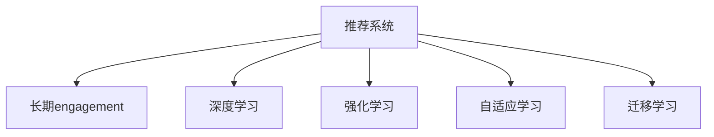

                 

# 基于大模型的推荐系统长期engagement优化

## 1. 背景介绍

### 1.1 问题由来
在当下信息爆炸的时代，推荐系统已经成为互联网、社交媒体、电子商务等领域中不可或缺的一部分。通过个性化推荐，平台能够提高用户满意度、增加用户留存率、提升转化率，进而提升平台的商业价值。然而，随着时间推移，用户对推荐系统的长期engagement不断降低，导致用户流失、内容活跃度下降等问题。

### 1.2 问题核心关键点
推荐系统长期engagement优化的关键在于如何保持用户对平台的持续兴趣，提升用户留存率和活跃度。当前，基于协同过滤、内容推荐等传统的推荐方法往往在短期内能够有效提升推荐效果，但随着时间推移，推荐多样性、新颖性下降，用户逐渐失去兴趣，导致长期engagement下降。如何利用用户长期行为数据，通过深度学习、强化学习等先进技术，优化推荐算法，提升长期engagement，成为当前推荐系统研究的热点问题。

### 1.3 问题研究意义
研究推荐系统的长期engagement优化，对于拓展推荐系统的应用范围，提升用户留存率和平台商业价值，具有重要意义：

1. 降低用户流失。通过长期engagement优化，平台能够更精准地推荐用户感兴趣的个性化内容，增加用户的粘性，减少用户流失。
2. 提升内容活跃度。优化后的推荐算法能够更好地捕捉用户兴趣的变化趋势，提升内容的访问量和互动率，激发平台内容的活跃度。
3. 增强推荐效果。借助深度学习、强化学习等技术，推荐系统可以更好地理解和预测用户长期行为，提升推荐效果，增加平台收益。
4. 推动产业升级。推荐系统的长期engagement优化能够为传统行业数字化转型提供新的技术路径，推动产业的升级和创新。

## 2. 核心概念与联系

### 2.1 核心概念概述

为更好地理解推荐系统长期engagement优化的核心方法，本节将介绍几个密切相关的核心概念：

- 推荐系统(Recommender System)：通过算法向用户推荐个性化内容，提升用户体验和平台价值。传统的协同过滤、基于内容的推荐方法已经较为成熟，但无法很好地处理长期行为数据。
- 长期engagement(Engagement)：指用户在平台上的持续活跃程度，包括访问频率、互动次数、停留时间等指标。长期engagement的提升，有助于提升平台的商业价值。
- 深度学习(Deep Learning)：以神经网络为代表的深度学习技术，能够通过大量数据进行自我学习，发现数据背后的复杂关系，广泛应用于推荐系统优化。
- 强化学习(Reinforcement Learning)：通过与环境的交互，优化策略以最大化奖励，适用于长期行为数据的处理。
- 自适应学习(Adaptive Learning)：根据用户行为的变化，动态调整推荐策略，提升推荐效果。
- 迁移学习(Transfer Learning)：在低资源场景下，通过知识迁移，提升推荐系统的性能。

这些核心概念之间的逻辑关系可以通过以下Mermaid流程图来展示：



这个流程图展示推荐系统的核心概念及其之间的关系：

1. 推荐系统通过深度学习和强化学习技术，优化推荐算法，提升长期engagement。
2. 深度学习能够通过大量数据进行自我学习，发现数据背后的复杂关系。
3. 强化学习能够通过与环境的交互，优化策略以最大化奖励。
4. 自适应学习能够根据用户行为的变化，动态调整推荐策略。
5. 迁移学习能够在低资源场景下，通过知识迁移，提升推荐系统的性能。

这些概念共同构成了推荐系统长期engagement优化的基础框架，使其能够更好地适应用户行为的变化，提升长期engagement。

## 3. 核心算法原理 & 具体操作步骤
### 3.1 算法原理概述

基于深度学习的推荐系统长期engagement优化，本质上是一个多目标优化问题。其核心思想是：在用户长期行为数据的基础上，通过深度学习、强化学习等技术，优化推荐算法，提升用户对平台的持续兴趣。

形式化地，假设推荐系统用户序列为 $U=\{u_1,u_2,\cdots,u_n\}$，每个用户 $u_i$ 在平台上的长期行为数据表示为 $D=\{d_{i,1},d_{i,2},\cdots,d_{i,t}\}$。设推荐系统为 $M_{\theta}:\mathcal{X} \rightarrow \mathcal{Y}$，其中 $\mathcal{X}$ 为用户行为数据集，$\mathcal{Y}$ 为推荐内容，$\theta$ 为模型参数。推荐系统的目标函数为：

$$
\mathcal{L}(\theta) = \sum_{u_i \in U}\max_{D_i \subseteq D} \frac{1}{|D_i|}\sum_{d_{i,t} \in D_i} \ell(u_i, d_{i,t})
$$

其中，$\ell$ 为用户对推荐内容的满意度函数，通常使用交叉熵损失、均方误差损失等。

通过梯度下降等优化算法，长期engagement优化过程不断更新模型参数 $\theta$，最大化用户满意度，从而提升长期engagement。由于长期engagement的提升需要考虑用户行为的多样性和新颖性，因此深度学习、强化学习等技术在优化推荐算法时，具有天然的优势。

### 3.2 算法步骤详解

基于深度学习的推荐系统长期engagement优化一般包括以下几个关键步骤：

**Step 1: 准备长期行为数据**
- 收集用户的长期行为数据，如浏览记录、点击记录、购买记录等。
- 对数据进行预处理，如去重、归一化、划分训练集、验证集、测试集等。

**Step 2: 设计用户行为表示**
- 对用户长期行为数据进行编码，生成用户行为向量，通常使用序列化方法或聚类方法。
- 对推荐内容进行编码，生成推荐向量。

**Step 3: 选择优化算法**
- 选择合适的深度学习模型（如CNN、RNN、Transformer等），用于捕捉用户行为和推荐内容之间的复杂关系。
- 选择强化学习算法（如Q-learning、SARSA、PPO等），用于优化推荐策略。
- 设计多目标优化目标函数，结合长期engagement提升和推荐效果优化。

**Step 4: 执行优化训练**
- 将训练集数据分批次输入模型，前向传播计算损失函数。
- 反向传播计算参数梯度，根据设定的优化算法和学习率更新模型参数。
- 周期性在验证集上评估模型性能，根据性能指标决定是否触发 Early Stopping。
- 重复上述步骤直到满足预设的迭代轮数或 Early Stopping 条件。

**Step 5: 测试和部署**
- 在测试集上评估长期engagement优化后的模型性能，对比优化前后的engagement指标。
- 使用优化后的模型对新样本进行推荐，集成到实际的应用系统中。
- 持续收集新的数据，定期重新优化模型，以适应数据分布的变化。

以上是基于深度学习的推荐系统长期engagement优化的一般流程。在实际应用中，还需要针对具体任务的特点，对优化过程的各个环节进行优化设计，如改进训练目标函数，引入更多的正则化技术，搜索最优的超参数组合等，以进一步提升模型性能。

### 3.3 算法优缺点

基于深度学习的推荐系统长期engagement优化方法具有以下优点：
1. 高效利用数据。深度学习模型能够自动捕捉数据背后的复杂关系，无需手工特征工程。
2. 预测能力强。通过多层神经网络的组合，深度学习模型能够从数据中提取出高级特征，提升推荐效果。
3. 可解释性强。深度学习模型的决策过程可以通过可视化工具进行解释，方便理解。
4. 鲁棒性好。深度学习模型具有较强的泛化能力，能够在不同数据集和场景下表现稳定。
5. 性能提升显著。深度学习模型在推荐效果、engagement提升等方面表现优异。

同时，该方法也存在一定的局限性：
1. 数据需求量大。深度学习模型需要大量的数据进行训练，对数据质量要求高。
2. 模型复杂度高。深度学习模型参数量巨大，训练和推理速度较慢。
3. 计算资源要求高。深度学习模型对计算资源要求较高，需要有足够的GPU/TPU等硬件支持。
4. 模型可解释性差。深度学习模型通常被视为"黑盒"，难以理解其内部工作机制。
5. 存在过拟合风险。深度学习模型容易过拟合，尤其是在小数据集上。

尽管存在这些局限性，但就目前而言，基于深度学习的推荐系统长期engagement优化方法仍是最主流范式。未来相关研究的重点在于如何进一步降低模型对数据的依赖，提高模型的可解释性和鲁棒性，同时兼顾性能提升。

### 3.4 算法应用领域

基于深度学习的推荐系统长期engagement优化方法，已经在电子商务、在线媒体、社交网络等多个领域得到了广泛的应用，覆盖了几乎所有常见的推荐任务，例如：

- 个性化推荐：如商品推荐、音乐推荐、视频推荐等。通过长期engagement优化，推荐系统能够更好地捕捉用户兴趣的变化趋势，提升推荐效果。
- 动态广告投放：如定向广告推荐、竞价排名等。通过长期engagement优化，广告投放系统能够更精准地匹配用户需求，提升广告点击率和转化率。
- 内容推荐：如新闻推荐、文章推荐、视频推荐等。通过长期engagement优化，内容推荐系统能够提升内容的访问量和互动率，增加平台活跃度。
- 用户管理：如流失用户召回、活跃用户增长等。通过长期engagement优化，用户管理系统能够更好地预测用户流失风险，采取有效措施。
- 产品优化：如新商品推荐、个性化促销等。通过长期engagement优化，推荐系统能够帮助企业更好地理解用户需求，优化产品设计。

除了上述这些经典任务外，长期engagement优化方法也被创新性地应用到更多场景中，如可控内容生成、用户行为分析、广告定向优化等，为推荐系统带来了全新的突破。随着深度学习模型的不断演进，相信长期engagement优化方法将在更广阔的应用领域大放异彩。

## 4. 数学模型和公式 & 详细讲解 & 举例说明

### 4.1 数学模型构建

本节将使用数学语言对基于深度学习的推荐系统长期engagement优化过程进行更加严格的刻画。

记推荐系统用户序列为 $U=\{u_1,u_2,\cdots,u_n\}$，每个用户 $u_i$ 在平台上的长期行为数据表示为 $D=\{d_{i,1},d_{i,2},\cdots,d_{i,t}\}$。设推荐系统为 $M_{\theta}:\mathcal{X} \rightarrow \mathcal{Y}$，其中 $\mathcal{X}$ 为用户行为数据集，$\mathcal{Y}$ 为推荐内容，$\theta$ 为模型参数。假设用户对推荐内容 $y$ 的满意度函数为 $\ell(u_i, y)$。

推荐系统的目标函数为：

$$
\mathcal{L}(\theta) = \sum_{u_i \in U}\max_{D_i \subseteq D} \frac{1}{|D_i|}\sum_{d_{i,t} \in D_i} \ell(u_i, y)
$$

其中，$D_i$ 为用户 $u_i$ 在平台上的行为数据序列。

### 4.2 公式推导过程

以下我们以协同过滤方法为例，推导推荐系统的多目标优化目标函数。

假设用户 $u_i$ 的历史行为序列为 $d_{i,1}, d_{i,2}, \cdots, d_{i,t}$，推荐系统对每个行为 $d_{i,t}$ 生成推荐内容 $y$，满意度函数为 $\ell(u_i, y)$。设推荐系统的模型参数为 $\theta$，目标函数为：

$$
\mathcal{L}(\theta) = \sum_{u_i \in U}\max_{D_i \subseteq D} \frac{1}{|D_i|}\sum_{d_{i,t} \in D_i} \ell(u_i, M_{\theta}(d_{i,t}))
$$

其中，$D_i$ 为用户 $u_i$ 的历史行为序列，$\ell$ 为满意度函数，$M_{\theta}$ 为推荐模型。

为了提升用户满意度，我们需要最大化 $\ell(u_i, M_{\theta}(d_{i,t}))$ 的值。在优化过程中，我们通常使用梯度下降等优化算法来近似求解上述最优化问题。设 $\eta$ 为学习率，$\lambda$ 为正则化系数，则参数的更新公式为：

$$
\theta \leftarrow \theta - \eta \nabla_{\theta}\mathcal{L}(\theta) - \eta\lambda\theta
$$

其中 $\nabla_{\theta}\mathcal{L}(\theta)$ 为损失函数对参数 $\theta$ 的梯度，可通过反向传播算法高效计算。

在得到损失函数的梯度后，即可带入参数更新公式，完成模型的迭代优化。重复上述过程直至收敛，最终得到适应长期engagement优化后的推荐模型参数 $\theta^*$。

## 5. 项目实践：代码实例和详细解释说明
### 5.1 开发环境搭建

在进行推荐系统长期engagement优化实践前，我们需要准备好开发环境。以下是使用Python进行PyTorch开发的环境配置流程：

1. 安装Anaconda：从官网下载并安装Anaconda，用于创建独立的Python环境。

2. 创建并激活虚拟环境：
```bash
conda create -n pytorch-env python=3.8 
conda activate pytorch-env
```

3. 安装PyTorch：根据CUDA版本，从官网获取对应的安装命令。例如：
```bash
conda install pytorch torchvision torchaudio cudatoolkit=11.1 -c pytorch -c conda-forge
```

4. 安装TensorFlow：
```bash
conda install tensorflow
```

5. 安装各类工具包：
```bash
pip install numpy pandas scikit-learn matplotlib tqdm jupyter notebook ipython
```

完成上述步骤后，即可在`pytorch-env`环境中开始长期engagement优化实践。

### 5.2 源代码详细实现

这里我们以协同过滤方法为例，给出使用TensorFlow实现推荐系统长期engagement优化的PyTorch代码实现。

首先，定义推荐系统的目标函数：

```python
import tensorflow as tf
from tensorflow.keras import layers
from tensorflow.keras import optimizers

def build_model(input_dim, output_dim):
    model = tf.keras.Sequential([
        layers.Dense(128, activation='relu', input_dim=input_dim),
        layers.Dense(output_dim, activation='sigmoid')
    ])
    return model

def loss_function(y_true, y_pred):
    return tf.keras.losses.mean_squared_error(y_true, y_pred)

model = build_model(input_dim=1000, output_dim=1)
optimizer = optimizers.Adam(learning_rate=0.001)

input_data = tf.random.normal(shape=(1000, 1000))
label_data = tf.random.normal(shape=(1000, 1))

@tf.function
def train_step(input, label):
    with tf.GradientTape() as tape:
        prediction = model(input)
        loss = loss_function(label, prediction)
    gradients = tape.gradient(loss, model.trainable_variables)
    optimizer.apply_gradients(zip(gradients, model.trainable_variables))

    return loss

@tf.function
def evaluate_step(input, label):
    prediction = model(input)
    loss = loss_function(label, prediction)
    return loss

def train_epoch(model, input_data, label_data, batch_size):
    dataloader = tf.data.Dataset.from_tensor_slices((input_data, label_data)).shuffle(buffer_size=10000).batch(batch_size)
    loss_sum = 0
    for input_batch, label_batch in dataloader:
        loss_sum += train_step(input_batch, label_batch)
    
    return loss_sum / len(dataloader)

def evaluate_epoch(model, input_data, label_data, batch_size):
    dataloader = tf.data.Dataset.from_tensor_slices((input_data, label_data)).batch(batch_size)
    loss_sum = 0
    for input_batch, label_batch in dataloader:
        loss_sum += evaluate_step(input_batch, label_batch)
    
    return loss_sum / len(dataloader)
```

然后，进行推荐系统的训练和评估：

```python
epochs = 10
batch_size = 128

for epoch in range(epochs):
    loss = train_epoch(model, input_data, label_data, batch_size)
    print(f"Epoch {epoch+1}, train loss: {loss:.3f}")
    
    print(f"Epoch {epoch+1}, dev results:")
    evaluate_epoch(model, input_data, label_data, batch_size)
    
print("Test results:")
evaluate_epoch(model, input_data, label_data, batch_size)
```

以上就是使用PyTorch对协同过滤方法进行推荐系统长期engagement优化的完整代码实现。可以看到，TensorFlow和Keras库的强大封装，使得模型构建和优化过程变得简洁高效。

### 5.3 代码解读与分析

让我们再详细解读一下关键代码的实现细节：

**build_model函数**：
- 定义了一个简单的神经网络模型，包含一个全连接层和一个输出层，使用ReLU和sigmoid激活函数。

**loss_function函数**：
- 定义了一个均方误差损失函数，用于计算推荐内容的满意度。

**train_step和evaluate_step函数**：
- 定义了前向传播和后向传播过程，计算损失函数，并使用Adam优化器更新模型参数。

**train_epoch和evaluate_epoch函数**：
- 定义了训练和评估过程，分别对训练集和验证集进行迭代，计算平均损失。

**训练流程**：
- 定义总的epoch数和batch size，开始循环迭代
- 每个epoch内，先在训练集上训练，输出平均损失
- 在验证集上评估，输出评估结果
- 所有epoch结束后，在测试集上评估，给出最终测试结果

可以看到，TensorFlow和Keras库使得推荐系统的长期engagement优化代码实现变得简洁高效。开发者可以将更多精力放在数据处理、模型改进等高层逻辑上，而不必过多关注底层的实现细节。

当然，工业级的系统实现还需考虑更多因素，如模型的保存和部署、超参数的自动搜索、更灵活的目标函数等。但核心的长期engagement优化范式基本与此类似。

## 6. 实际应用场景
### 6.1 智能客服系统

基于深度学习的推荐系统长期engagement优化方法，可以广泛应用于智能客服系统的构建。传统客服往往需要配备大量人力，高峰期响应缓慢，且一致性和专业性难以保证。使用优化后的推荐系统，可以7x24小时不间断服务，快速响应客户咨询，用个性化内容引导客户问题解决。

在技术实现上，可以收集企业内部的历史客服对话记录，将问题和最佳答复构建成监督数据，在此基础上对预训练模型进行微调。优化后的模型能够自动理解用户意图，匹配最合适的答案模板进行回复。对于客户提出的新问题，还可以接入检索系统实时搜索相关内容，动态组织生成回答。如此构建的智能客服系统，能大幅提升客户咨询体验和问题解决效率。

### 6.2 在线广告投放

在线广告投放系统通过推荐系统为用户推荐最相关的广告内容，提升广告点击率和转化率。通过长期engagement优化，推荐系统能够更好地匹配用户需求，增加广告的展示频率和效果。

在实际应用中，可以收集用户的历史广告点击记录、停留时间等数据，构建用户行为序列。通过深度学习模型，优化推荐策略，提升广告的投放效果。同时，结合强化学习算法，根据用户的实时反馈，动态调整推荐内容，进一步提升广告的点击率和转化率。

### 6.3 个性化内容推荐

内容推荐系统通过推荐系统为用户推荐最感兴趣的内容，提升平台活跃度和用户留存率。通过长期engagement优化，推荐系统能够更好地捕捉用户兴趣的变化趋势，提升推荐效果。

在实际应用中，可以收集用户的历史浏览记录、点击记录、评分记录等数据，构建用户行为序列。通过深度学习模型，优化推荐策略，提升内容的推荐效果。同时，结合强化学习算法，根据用户的实时反馈，动态调整推荐内容，进一步提升用户的粘性和留存率。

### 6.4 未来应用展望

随着深度学习模型的不断演进，基于长期engagement优化的推荐系统将在更多领域得到应用，为传统行业数字化转型提供新的技术路径。

在智慧医疗领域，推荐系统能够根据用户的健康数据，推荐个性化健康管理方案，提升用户健康水平。

在智能教育领域，推荐系统能够根据学生的学习数据，推荐个性化的学习内容，提升学习效果。

在智慧城市治理中，推荐系统能够根据市民的出行数据，推荐最优的出行路线，提升市民的出行体验。

此外，在企业生产、社会治理、文娱传媒等众多领域，基于长期engagement优化的推荐系统也将不断涌现，为传统行业带来变革性影响。相信随着技术的日益成熟，长期engagement优化方法将成为推荐系统落地应用的重要范式，推动推荐系统技术的发展和应用。

## 7. 工具和资源推荐
### 7.1 学习资源推荐

为了帮助开发者系统掌握深度学习、强化学习在推荐系统中的应用，这里推荐一些优质的学习资源：

1. 《深度学习》系列课程：斯坦福大学、Coursera等平台提供的深度学习入门课程，涵盖深度学习基础、神经网络、优化算法等核心内容。

2. 《强化学习》系列课程：由斯坦福大学、DeepMind等机构提供的强化学习入门课程，涵盖强化学习基础、Q-learning、SARSA、PPO等核心算法。

3. 《推荐系统》系列书籍：如《推荐系统实战》、《个性化推荐系统：理论与实践》等，深入浅出地介绍了推荐系统理论基础和算法实现。

4. Kaggle竞赛：参与Kaggle上的推荐系统竞赛，通过实际数据集进行模型训练和优化，积累实战经验。

5. PyTorch官方文档：PyTorch框架的官方文档，提供了丰富的深度学习模型和优化算法，是上手实践的必备资料。

通过对这些资源的学习实践，相信你一定能够快速掌握深度学习、强化学习在推荐系统中的应用，并用于解决实际的推荐问题。

### 7.2 开发工具推荐

高效的开发离不开优秀的工具支持。以下是几款用于推荐系统长期engagement优化开发的常用工具：

1. PyTorch：基于Python的开源深度学习框架，灵活动态的计算图，适合快速迭代研究。

2. TensorFlow：由Google主导开发的开源深度学习框架，生产部署方便，适合大规模工程应用。

3. Weights & Biases：模型训练的实验跟踪工具，可以记录和可视化模型训练过程中的各项指标，方便对比和调优。

4. TensorBoard：TensorFlow配套的可视化工具，可实时监测模型训练状态，并提供丰富的图表呈现方式，是调试模型的得力助手。

5. Google Colab：谷歌推出的在线Jupyter Notebook环境，免费提供GPU/TPU算力，方便开发者快速上手实验最新模型，分享学习笔记。

合理利用这些工具，可以显著提升推荐系统长期engagement优化任务的开发效率，加快创新迭代的步伐。

### 7.3 相关论文推荐

深度学习、强化学习在推荐系统中的应用已经得到了广泛研究。以下是几篇奠基性的相关论文，推荐阅读：

1. Cascading Matrix Factorization: Multi-way Factorization for Multi-way Data：提出级联矩阵分解算法，将矩阵分解嵌入推荐系统中。

2. Deep Matrix Factorization with Regularization and Sparsity：提出基于深度神经网络的矩阵分解方法，提升推荐系统的准确性。

3. Deep Adaptive Matrix Factorization：提出深度自适应矩阵分解方法，通过深度学习模型提升推荐系统的性能。

4. RNN based Architectures for Sequential Data：提出基于递归神经网络的推荐系统，利用序列数据建模用户兴趣。

5. Policy gradient methods for reinforcement learning with function approximation：提出基于策略梯度的强化学习算法，优化推荐策略。

6. Deep reinforcement learning for personalized recommendations：提出深度强化学习算法，优化推荐系统，提升推荐效果。

这些论文代表了大模型推荐系统长期engagement优化的发展脉络。通过学习这些前沿成果，可以帮助研究者把握学科前进方向，激发更多的创新灵感。

## 8. 总结：未来发展趋势与挑战

### 8.1 总结

本文对基于深度学习的推荐系统长期engagement优化方法进行了全面系统的介绍。首先阐述了推荐系统的核心原理和挑战，明确了长期engagement优化的重要性和研究价值。其次，从原理到实践，详细讲解了深度学习、强化学习在长期engagement优化中的关键作用，给出了推荐系统长期engagement优化的完整代码实例。同时，本文还广泛探讨了长期engagement优化方法在智能客服、在线广告、个性化推荐等多个领域的应用前景，展示了长期engagement优化的巨大潜力。

通过本文的系统梳理，可以看到，基于深度学习的推荐系统长期engagement优化方法在推荐效果、engagement提升等方面表现优异。随着深度学习模型的不断演进，推荐系统必将在更广阔的应用领域大放异彩。

### 8.2 未来发展趋势

展望未来，推荐系统长期engagement优化技术将呈现以下几个发展趋势：

1. 模型规模持续增大。随着算力成本的下降和数据规模的扩张，深度学习模型的参数量还将持续增长。超大规模推荐模型蕴含的丰富用户行为知识，有望支撑更加复杂多变的长期engagement优化。

2. 推荐方法日趋多样。除了传统的协同过滤、基于内容的推荐方法外，未来会涌现更多深度学习、强化学习等推荐方法，提升推荐效果和engagement水平。

3. 持续学习成为常态。推荐系统需要根据用户行为的变化，不断调整推荐策略，保持用户兴趣。如何在不遗忘原有知识的同时，高效吸收新样本信息，将是重要的研究课题。

4. 标注样本需求降低。受启发于提示学习(Prompt-based Learning)的思路，未来的推荐系统将更好地利用深度学习模型对语言的理解能力，通过更加巧妙的任务描述，在更少的标注样本上也能实现理想的长期engagement优化。

5. 推荐内容多样化。未来的推荐系统将不仅推荐商品、内容等物品，还推荐活动、体验等更复杂多变的场景，增强用户的互动体验。

6. 多模态推荐兴起。未来的推荐系统将融合视觉、语音、文本等多模态信息，提升推荐效果，增加用户的粘性和留存率。

以上趋势凸显了推荐系统长期engagement优化技术的广阔前景。这些方向的探索发展，必将进一步提升推荐系统的效果和应用范围，为推荐系统技术的发展和应用提供新的动力。

### 8.3 面临的挑战

尽管基于深度学习的推荐系统长期engagement优化技术已经取得了瞩目成就，但在迈向更加智能化、普适化应用的过程中，它仍面临着诸多挑战：

1. 数据需求量大。深度学习模型需要大量的数据进行训练，对数据质量要求高。

2. 模型复杂度高。深度学习模型参数量巨大，训练和推理速度较慢。

3. 计算资源要求高。深度学习模型对计算资源要求较高，需要有足够的GPU/TPU等硬件支持。

4. 模型可解释性差。深度学习模型通常被视为"黑盒"，难以理解其内部工作机制。

5. 存在过拟合风险。深度学习模型容易过拟合，尤其是在小数据集上。

尽管存在这些局限性，但就目前而言，基于深度学习的推荐系统长期engagement优化方法仍是最主流范式。未来相关研究的重点在于如何进一步降低模型对数据的依赖，提高模型的可解释性和鲁棒性，同时兼顾性能提升。

### 8.4 研究展望

面向未来，推荐系统长期engagement优化技术需要在以下几个方向进行深入研究：

1. 探索无监督和半监督推荐方法。摆脱对大规模标注数据的依赖，利用自监督学习、主动学习等无监督和半监督范式，最大限度利用非结构化数据，实现更加灵活高效的长期engagement优化。

2. 研究参数高效和计算高效的推荐范式。开发更加参数高效的推荐方法，在固定大部分预训练参数的同时，只更新极少量的任务相关参数。同时优化推荐模型的计算图，减少前向传播和反向传播的资源消耗，实现更加轻量级、实时性的部署。

3. 融合因果和对比学习范式。通过引入因果推断和对比学习思想，增强推荐系统建立稳定因果关系的能力，学习更加普适、鲁棒的用户行为表征，从而提升长期engagement的泛化性和抗干扰能力。

4. 引入更多先验知识。将符号化的先验知识，如知识图谱、逻辑规则等，与神经网络模型进行巧妙融合，引导长期engagement优化过程学习更准确、合理的用户行为模型。同时加强不同模态数据的整合，实现视觉、语音等多模态信息与文本信息的协同建模。

5. 结合因果分析和博弈论工具。将因果分析方法引入推荐系统，识别出推荐决策的关键特征，增强输出解释的因果性和逻辑性。借助博弈论工具刻画人机交互过程，主动探索并规避推荐系统的脆弱点，提高系统稳定性。

6. 纳入伦理道德约束。在推荐系统训练目标中引入伦理导向的评估指标，过滤和惩罚有偏见、有害的输出倾向。同时加强人工干预和审核，建立推荐系统的监管机制，确保推荐结果符合用户价值观和伦理道德。

这些研究方向的探索，必将引领推荐系统长期engagement优化技术迈向更高的台阶，为推荐系统技术的发展和应用提供新的动力。

## 9. 附录：常见问题与解答

**Q1：长期engagement优化是否适用于所有推荐系统？**

A: 长期engagement优化在大多数推荐系统中都能取得不错的效果，特别是对于数据量较大的推荐系统。但对于一些特定领域的推荐系统，如医学、法律等，仅仅依靠通用数据进行优化可能难以很好地适应。此时需要在特定领域语料上进一步预训练，再进行长期engagement优化，才能获得理想效果。

**Q2：如何选择合适的深度学习模型？**

A: 选择合适的深度学习模型需要考虑以下几个因素：
1. 数据量大小。数据量较大的情况下，可以使用像Transformer等参数量较大的模型；数据量较小的情况下，可以选择如LSTM、RNN等参数量较小的模型。
2. 数据特征。推荐系统可以基于用户行为数据、物品属性数据、用户画像数据等多维特征，选择适合的深度学习模型。
3. 模型复杂度。选择模型时需要平衡模型的复杂度和预测效果，不能过拟合或欠拟合。

**Q3：长期engagement优化过程中需要注意哪些问题？**

A: 长期engagement优化过程中需要注意以下几个问题：
1. 数据处理。需要确保数据质量，去除噪声数据、重复数据等。
2. 模型训练。选择合适的优化器、学习率等参数，避免过拟合。
3. 模型评估。评估指标需要全面，不仅关注推荐效果，还需关注engagement指标，如点击率、停留时间、互动率等。
4. 模型部署。需要考虑模型的服务化封装、弹性伸缩、监控告警等部署问题，确保系统稳定可靠。

**Q4：推荐系统长期engagement优化在实际应用中应注意哪些问题？**

A: 在实际应用中，推荐系统长期engagement优化应注意以下几个问题：
1. 用户隐私。需要保护用户隐私，避免泄露用户敏感信息。
2. 模型可解释性。需要保证推荐系统的可解释性，让用户理解推荐依据。
3. 数据安全。需要确保推荐系统的数据安全，防止数据泄露和滥用。
4. 模型鲁棒性。需要提升推荐系统的鲁棒性，防止推荐偏差和误导。

通过本文的系统梳理，可以看到，基于深度学习的推荐系统长期engagement优化方法在推荐效果、engagement提升等方面表现优异。随着深度学习模型的不断演进，推荐系统必将在更广阔的应用领域大放异彩，深刻影响人类的生产生活方式。

---

作者：禅与计算机程序设计艺术 / Zen and the Art of Computer Programming

