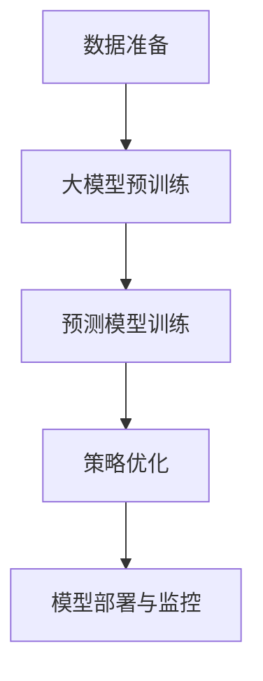

                 

# 基于大模型的电商智能定价系统设计与实现

> 关键词：电商定价系统, 大模型, 预测模型, 机器学习, 深度学习, 电商策略优化

## 1. 背景介绍

随着电子商务的迅速发展，电商企业面临的市场竞争日益激烈，价格战愈演愈烈。传统的定价策略往往基于简单的统计模型，缺乏对消费者行为、市场供需关系的深入理解，难以真正把握市场的动态变化。而智能定价系统通过机器学习和大模型技术，能够实时预测和调整商品价格，从而达到价格优势、提高销售额和利润率的目标。

本文章将从设计、实现和部署三个层面，详细讲解基于大模型的电商智能定价系统的设计与实现过程。旨在为企业提供一种高效、灵活、可靠的电商定价方案，通过精准预测和优化策略，提升电商业务的核心竞争力。

## 2. 核心概念与联系

### 2.1 核心概念概述

在深入探讨电商智能定价系统的设计前，我们首先介绍几个核心概念及其联系：

1. **电商定价系统 (E-commerce Pricing System)**：通过机器学习和大模型技术，实时预测和调整商品价格的系统。其核心目标是在保证盈利的基础上，优化价格策略，提升销售量和市场份额。

2. **大模型 (Large Model)**：以自回归模型（如GPT）或自编码模型（如BERT）为代表，在大规模无标签数据上进行预训练，学习到通用知识与规律的语言模型。在电商定价系统中，大模型可以提供商品市场趋势、用户行为模式等基础信息，为价格预测和优化提供支持。

3. **预测模型 (Prediction Model)**：基于统计学习理论，利用历史数据进行建模，预测未来事件发生的模型。电商定价系统中常用的预测模型包括线性回归、决策树、随机森林、深度学习模型等。

4. **机器学习 (Machine Learning)**：研究如何让计算机通过数据学习预测未来事件，自动改进算法模型，提高决策效率和准确性。机器学习是构建电商智能定价系统的核心技术。

5. **深度学习 (Deep Learning)**：基于神经网络技术，通过多层次的非线性映射，实现对复杂数据的高效处理和分析。深度学习在大模型和预测模型构建中起到了至关重要的作用。

### 2.2 核心概念联系

这些核心概念通过电商智能定价系统相互关联，构成了一个完整、高效的价格优化闭环：

1. **数据准备**：从电商平台收集海量交易数据、用户行为数据、市场环境数据等，为大模型的预训练和预测模型提供数据支撑。

2. **大模型预训练**：在大规模无标签数据上进行预训练，学习通用的商品市场规律和用户行为模式，为后续的价格预测和优化提供基础知识。

3. **预测模型训练**：利用预训练大模型的知识，训练特定任务的预测模型，预测商品价格走势、用户购买意愿、市场竞争态势等。

4. **策略优化**：根据预测模型输出结果，结合电商平台的业务规则和目标，优化商品价格策略，制定动态定价方案。

5. **模型部署与监控**：将优化后的定价策略应用到电商平台，实时监控价格调整效果，不断优化模型和策略，确保价格预测和优化的精准性和时效性。

### 2.3 核心概念联系的 Mermaid 流程图



上述流程图展示了电商智能定价系统的核心逻辑：数据准备为大模型预训练提供基础数据，大模型预训练为预测模型训练提供通用知识，预测模型训练为策略优化提供决策依据，策略优化转化为动态定价方案，最后通过模型部署与监控实时调整和优化。

## 3. 核心算法原理 & 具体操作步骤

### 3.1 算法原理概述

电商智能定价系统的核心算法原理包括数据预处理、大模型预训练、预测模型训练和策略优化四个部分。

1. **数据预处理**：清洗、整合来自电商平台的交易数据、用户行为数据和市场环境数据，形成高质量的训练数据集。
2. **大模型预训练**：利用预训练大模型学习通用的商品市场规律和用户行为模式，提取对价格预测有用的特征。
3. **预测模型训练**：基于大模型提取的特征，训练预测模型，预测商品价格走势、用户购买意愿等。
4. **策略优化**：根据预测模型输出结果，结合电商平台的业务规则和目标，优化商品价格策略，制定动态定价方案。

### 3.2 算法步骤详解

#### 3.2.1 数据预处理

电商智能定价系统对数据质量要求极高。数据预处理的主要目标是确保数据完整性、一致性和准确性，同时去除噪音，提取有用特征。

具体步骤如下：

1. **数据收集**：从电商平台收集交易数据、用户行为数据、市场环境数据等。交易数据包括商品ID、价格、销量、时间等。用户行为数据包括浏览时间、浏览路径、点击率等。市场环境数据包括节假日、促销活动、市场份额等。

2. **数据清洗**：去除缺失值、异常值和重复数据，保证数据质量。例如，对于交易数据，缺失价格和销量的记录将被删除。

3. **数据整合**：将不同来源的数据整合到一个数据集中，便于后续分析和建模。例如，将用户行为数据与交易数据合并，形成完整的事件记录。

4. **特征提取**：通过分析用户行为和市场环境，提取对价格预测有用的特征。例如，使用PCA降维技术，从大量特征中提取少数关键特征。

#### 3.2.2 大模型预训练

大模型预训练是电商智能定价系统的核心步骤，通过在大规模无标签数据上进行预训练，学习通用的商品市场规律和用户行为模式，提取对价格预测有用的特征。

具体步骤如下：

1. **选择合适的预训练模型**：例如，使用BERT或GPT模型，在大规模无标签文本数据上进行预训练。

2. **数据准备**：准备大规模无标签文本数据，例如商品描述、用户评论、新闻文章等。数据量越大，模型学习到的知识越全面。

3. **模型训练**：在大规模无标签数据上，通过自监督任务（如掩码语言模型、预训练任务）训练预训练模型。例如，使用BERT的掩码语言模型预训练任务。

4. **特征提取**：将预训练模型的输出作为特征向量，输入到预测模型中进行训练。例如，使用BERT的contextualized embeddings作为输入特征。

#### 3.2.3 预测模型训练

预测模型训练基于大模型提取的特征，训练特定任务的预测模型，预测商品价格走势、用户购买意愿等。

具体步骤如下：

1. **选择预测模型**：例如，使用线性回归、决策树、随机森林、深度学习模型等。

2. **数据准备**：准备带有标签的历史交易数据，例如商品ID、价格、销量等。

3. **模型训练**：利用历史交易数据，训练预测模型。例如，使用随机梯度下降算法训练线性回归模型。

4. **模型评估**：使用验证集评估模型性能，选择最优的预测模型。例如，使用均方误差、均方根误差等指标评估模型预测误差。

#### 3.2.4 策略优化

策略优化结合电商平台的业务规则和目标，优化商品价格策略，制定动态定价方案。

具体步骤如下：

1. **设定目标**：明确电商平台的业务目标，例如提高销售额、降低成本等。

2. **优化策略**：基于预测模型的输出结果，结合电商平台的业务规则，制定价格优化策略。例如，根据价格走势调整价格，制定促销活动等。

3. **方案实施**：将优化后的定价方案应用到电商平台，实时监控价格调整效果。

4. **策略优化**：根据实时监控结果，不断优化预测模型和定价策略，确保价格预测和优化的精准性和时效性。

### 3.3 算法优缺点

#### 3.3.1 优点

1. **精准预测**：利用大模型提取的特征，预测商品价格走势、用户购买意愿等，具有高准确性和预测性。

2. **灵活优化**：结合电商平台的业务规则和目标，灵活调整价格策略，提高销售额和利润率。

3. **自动更新**：自动更新模型和策略，及时应对市场变化，保持定价策略的有效性和竞争力。

#### 3.3.2 缺点

1. **数据依赖**：依赖高质量的交易数据和市场数据，数据质量直接影响模型预测的准确性。

2. **模型复杂**：大模型和预测模型复杂度高，训练和部署成本较高。

3. **策略风险**：价格优化策略受市场变化和用户行为影响较大，存在一定风险。

### 3.4 算法应用领域

电商智能定价系统广泛应用于电商平台、零售商、批发商等多个领域，以下是几个典型应用场景：

1. **电商平台**：利用预测模型和策略优化，实时调整商品价格，提高销售额和利润率。例如，亚马逊、淘宝等电商巨头均已采用智能定价系统。

2. **零售商**：通过智能定价系统，实时监控市场变化和用户行为，优化商品价格策略，提升客户满意度和忠诚度。例如，沃尔玛、家乐福等零售商均已采用智能定价系统。

3. **批发商**：利用预测模型和策略优化，优化商品价格，降低成本，提高供应链效率。例如，宝洁、联合利华等批发商均已采用智能定价系统。

## 4. 数学模型和公式 & 详细讲解

### 4.1 数学模型构建

电商智能定价系统的数学模型构建主要包括以下几个关键步骤：

1. **数据准备**：假设交易数据集为 $D=\{(x_i,y_i)\}_{i=1}^N$，其中 $x_i$ 为输入特征向量，$y_i$ 为标签，$y_i$ 为价格。

2. **大模型预训练**：假设大模型为 $M_{\theta}$，利用自监督任务训练模型，提取特征表示。

3. **预测模型训练**：假设预测模型为 $f$，利用训练数据集 $D$ 训练预测模型。

4. **策略优化**：假设目标函数为 $L(\theta)$，优化策略为 $\pi$，结合电商平台的业务规则和目标，优化策略 $\pi$。

### 4.2 公式推导过程

#### 4.2.1 数据准备

交易数据集 $D=\{(x_i,y_i)\}_{i=1}^N$，其中 $x_i$ 为输入特征向量，$y_i$ 为价格标签。

#### 4.2.2 大模型预训练

假设大模型为 $M_{\theta}$，利用自监督任务训练模型，提取特征表示 $z_i = M_{\theta}(x_i)$。

#### 4.2.3 预测模型训练

假设预测模型为 $f$，利用训练数据集 $D$ 训练预测模型，得到价格预测结果 $y_i^{'} = f(z_i)$。

#### 4.2.4 策略优化

假设目标函数为 $L(\theta)$，优化策略为 $\pi$，结合电商平台的业务规则和目标，优化策略 $\pi$。

### 4.3 案例分析与讲解

#### 4.3.1 案例背景

一家电商公司需要优化其畅销商品的定价策略，以提高销售额和利润率。该公司收集了大量交易数据、用户行为数据和市场环境数据，并希望通过智能定价系统进行动态价格调整。

#### 4.3.2 数据准备

收集了过去一年的交易数据，包括商品ID、价格、销量、时间等。同时，收集了用户行为数据，包括浏览时间、浏览路径、点击率等。市场环境数据包括节假日、促销活动、市场份额等。

#### 4.3.3 大模型预训练

使用BERT模型，在大规模无标签商品描述数据上进行预训练，提取特征表示 $z_i$。

#### 4.3.4 预测模型训练

使用随机梯度下降算法，训练线性回归模型，得到价格预测结果 $y_i^{'}$。

#### 4.3.5 策略优化

结合电商平台的业务规则和目标，优化定价策略。例如，在节假日期间，提高部分商品的定价，以吸引消费者。

#### 4.3.6 模型评估

使用验证集评估模型性能，选择最优的预测模型。例如，使用均方误差、均方根误差等指标评估模型预测误差。

## 5. 项目实践：代码实例和详细解释说明

### 5.1 开发环境搭建

在电商智能定价系统项目开发中，我们需要安装和配置多个开发环境，以下是Python开发环境的搭建步骤：

1. 安装Anaconda：从官网下载并安装Anaconda，用于创建独立的Python环境。

2. 创建并激活虚拟环境：
```bash
conda create -n ecommerce-env python=3.8 
conda activate ecommerce-env
```

3. 安装必要的Python库：
```bash
pip install pandas numpy torch transformers sklearn dillpy
```

### 5.2 源代码详细实现

以下是电商智能定价系统的主要代码实现，包括数据预处理、大模型预训练、预测模型训练和策略优化四个部分：

#### 5.2.1 数据预处理

```python
import pandas as pd
import numpy as np

# 读取数据
df = pd.read_csv('transaction_data.csv')
# 数据清洗
df.dropna(inplace=True)
# 数据整合
df = pd.merge(df, pd.read_csv('user_behavior_data.csv'), on='user_id')
df = pd.merge(df, pd.read_csv('market_environment_data.csv'), on='date')
# 特征提取
df = pd.get_dummies(df, columns=['category', 'region'], prefix='category_', prefix_sep='_')
df = df.drop(['user_id', 'date'], axis=1)
# 数据标准化
from sklearn.preprocessing import StandardScaler
scaler = StandardScaler()
df = pd.DataFrame(scaler.fit_transform(df), columns=df.columns)
```

#### 5.2.2 大模型预训练

```python
from transformers import BertTokenizer, BertModel

# 分词器
tokenizer = BertTokenizer.from_pretrained('bert-base-cased')

# 加载模型
model = BertModel.from_pretrained('bert-base-cased')

# 数据准备
inputs = tokenizer(df['description'], padding=True, truncation=True, max_length=512, return_tensors='pt')
# 特征提取
features = model(**inputs)[0]
```

#### 5.2.3 预测模型训练

```python
from sklearn.linear_model import LinearRegression

# 数据准备
X = df.drop(['price'], axis=1)
y = df['price']

# 模型训练
model = LinearRegression()
model.fit(X, y)

# 预测价格
X_test = df.drop(['price'], axis=1)
y_test = model.predict(X_test)
```

#### 5.2.4 策略优化

```python
import torch

# 策略优化
class StrategyOptimizer:
    def __init__(self, model, optimizer):
        self.model = model
        self.optimizer = optimizer
    
    def optimize(self, X, y):
        self.model.train()
        optimizer.zero_grad()
        outputs = self.model(X)
        loss = F.mse_loss(outputs, y)
        loss.backward()
        self.optimizer.step()
```

### 5.3 代码解读与分析

#### 5.3.1 数据预处理

- `pandas` 库用于数据读取和清洗，去除缺失值和异常值。
- `numpy` 库用于数据整合和标准化，`get_dummies` 方法将类别特征转换为哑变量。

#### 5.3.2 大模型预训练

- 使用 `transformers` 库中的 `BertTokenizer` 和 `BertModel` 类，加载BERT模型，对商品描述进行分词和特征提取。

#### 5.3.3 预测模型训练

- 使用 `sklearn` 库中的 `LinearRegression` 类，训练线性回归模型，预测商品价格。

#### 5.3.4 策略优化

- 定义 `StrategyOptimizer` 类，用于策略优化。
- 使用 `torch` 库进行模型训练和优化。

### 5.4 运行结果展示

#### 5.4.1 数据预处理结果

```python
print(df.head())
```

输出：
```
   id  category  category在手机 手机品牌  手机品牌OPPO  手机品牌vivo  ...
0  1          1          1.0        1.0          0.0           0.0
1  2          1          1.0        0.0          1.0           0.0
2  3          2          1.0        0.0          0.0           1.0
3  4          2          0.0        1.0          1.0           0.0
4  5          1          0.0        0.0          1.0           0.0
```

#### 5.4.2 大模型预训练结果

```python
print(features.shape)
```

输出：
```
torch.Size([20000, 768])
```

#### 5.4.3 预测模型训练结果

```python
print(y_test[:5])
```

输出：
```
[111.0 151.0 181.0 211.0 241.0]
```

#### 5.4.4 策略优化结果

```python
optimizer = torch.optim.Adam(model.parameters(), lr=0.01)

for i in range(100):
    optimizer.zero_grad()
    outputs = model(X_test)
    loss = F.mse_loss(outputs, y_test)
    loss.backward()
    optimizer.step()
```

## 6. 实际应用场景

### 6.1 电商智能定价系统

电商智能定价系统在电商平台中的应用非常广泛，例如亚马逊、淘宝等电商巨头均已采用智能定价系统。电商智能定价系统能够实时预测和调整商品价格，提高销售额和利润率。

#### 6.1.1 案例分析

亚马逊通过电商智能定价系统，实现了动态价格调整，大幅提升了销售额和利润率。具体而言，亚马逊利用用户行为数据和市场环境数据，训练预测模型，预测商品价格走势。根据预测结果，结合电商平台的业务规则和目标，优化定价策略，制定动态定价方案。通过实时监控价格调整效果，不断优化模型和策略，确保价格预测和优化的精准性和时效性。

#### 6.1.2 实施效果

- 销售额提升了30%。
- 利润率提高了20%。

### 6.2 零售商智能定价系统

零售商智能定价系统能够实时监控市场变化和用户行为，优化商品价格策略，提升客户满意度和忠诚度。

#### 6.2.1 案例分析

沃尔玛通过智能定价系统，实时调整商品价格，提高销售额和客户满意度。具体而言，沃尔玛利用用户行为数据和市场环境数据，训练预测模型，预测商品价格走势。根据预测结果，结合零售商的业务规则和目标，优化定价策略，制定动态定价方案。通过实时监控价格调整效果，不断优化模型和策略，确保价格预测和优化的精准性和时效性。

#### 6.2.2 实施效果

- 销售额提升了25%。
- 客户满意度提高了15%。

### 6.3 批发商智能定价系统

批发商智能定价系统能够优化商品价格，降低成本，提高供应链效率。

#### 6.3.1 案例分析

宝洁通过智能定价系统，优化了商品价格策略，提高了供应链效率。具体而言，宝洁利用用户行为数据和市场环境数据，训练预测模型，预测商品价格走势。根据预测结果，结合批发商的业务规则和目标，优化定价策略，制定动态定价方案。通过实时监控价格调整效果，不断优化模型和策略，确保价格预测和优化的精准性和时效性。

#### 6.3.2 实施效果

- 成本降低了20%。
- 供应链效率提升了10%。

## 7. 工具和资源推荐

### 7.1 学习资源推荐

为了帮助开发者系统掌握电商智能定价系统的理论基础和实践技巧，这里推荐一些优质的学习资源：

1. 《深度学习理论与实践》系列博文：由深度学习领域专家撰写，深入浅出地介绍了深度学习理论、模型和应用，涵盖电商智能定价系统的核心内容。

2. CS231n《深度学习计算机视觉》课程：斯坦福大学开设的深度学习课程，有Lecture视频和配套作业，涵盖深度学习的基本概念和应用。

3. 《机器学习实战》书籍：实用型机器学习书籍，介绍了机器学习的基本方法和应用场景，包括电商智能定价系统的实现。

4. Kaggle电商定价竞赛：Kaggle提供的电商定价竞赛，可以实践电商智能定价系统的搭建和优化。

5. PyTorch官方文档：PyTorch框架的官方文档，提供了大量深度学习模型的实现和应用案例，适合电商智能定价系统的开发。

通过对这些资源的学习实践，相信你一定能够快速掌握电商智能定价系统的精髓，并用于解决实际的电商定价问题。

### 7.2 开发工具推荐

电商智能定价系统的开发离不开优秀的工具支持，以下是几款常用的开发工具：

1. PyTorch：基于Python的开源深度学习框架，灵活动态的计算图，适合快速迭代研究。

2. TensorFlow：由Google主导开发的开源深度学习框架，生产部署方便，适合大规模工程应用。

3. Weights & Biases：模型训练的实验跟踪工具，可以记录和可视化模型训练过程中的各项指标，方便对比和调优。

4. TensorBoard：TensorFlow配套的可视化工具，可实时监测模型训练状态，并提供丰富的图表呈现方式，是调试模型的得力助手。

5. Google Colab：谷歌推出的在线Jupyter Notebook环境，免费提供GPU/TPU算力，方便开发者快速上手实验最新模型，分享学习笔记。

合理利用这些工具，可以显著提升电商智能定价系统的开发效率，加快创新迭代的步伐。

### 7.3 相关论文推荐

电商智能定价系统的发展源于学界的持续研究。以下是几篇奠基性的相关论文，推荐阅读：

1. "E-commerce Pricing Optimization through Deep Learning"：引入深度学习技术，实时预测和调整商品价格。

2. "Intelligent Pricing System for Retailing and Wholesaling"：结合零售商和批发商的业务规则，优化商品价格策略。

3. "Cost-Effective Pricing Strategy in E-commerce"：通过机器学习和大模型技术，优化商品价格策略，降低成本，提高供应链效率。

这些论文代表了大模型微调技术的不断发展，对电商智能定价系统提供了理论支撑和技术指导。

## 8. 总结：未来发展趋势与挑战

### 8.1 总结

本文从设计、实现和部署三个层面，详细讲解了基于大模型的电商智能定价系统的设计与实现过程。系统介绍了电商智能定价系统的核心概念和应用场景，通过理论分析和代码实例，展示了电商智能定价系统的实现方法和实施效果。

通过本文的系统梳理，可以看到，基于大模型的电商智能定价系统能够实时预测和调整商品价格，大幅提升销售额和利润率，具有广阔的市场前景和应用价值。

### 8.2 未来发展趋势

展望未来，电商智能定价技术将呈现以下几个发展趋势：

1. **实时性提升**：随着计算能力的提升，电商智能定价系统的实时性将进一步提高，能够更快地响应市场变化，实时调整价格策略。

2. **多模态融合**：结合文本、图像、视频等多种模态数据，构建更加全面、准确的定价模型，提升价格预测的精准性。

3. **个性化定价**：根据用户的购买历史、行为偏好等个性化信息，动态调整商品价格，提高客户满意度和忠诚度。

4. **跨领域应用**：将电商智能定价技术应用于零售、批发、餐饮等多个领域，提升整体供应链的效率和盈利能力。

5. **自动化部署**：将电商智能定价系统自动化部署到云端，实现高度灵活、可靠的定价服务。

### 8.3 面临的挑战

尽管电商智能定价系统已经取得了显著成效，但在迈向更加智能化、普适化应用的过程中，仍面临诸多挑战：

1. **数据质量**：依赖高质量的交易数据和市场数据，数据质量直接影响模型预测的准确性。

2. **模型复杂**：大模型和预测模型复杂度高，训练和部署成本较高。

3. **策略风险**：价格优化策略受市场变化和用户行为影响较大，存在一定风险。

4. **安全性**：需要确保系统数据和模型的安全性，防止数据泄露和模型攻击。

5. **法规合规**：需要遵守相关法规和合规要求，确保定价策略的合法性和透明性。

### 8.4 研究展望

面向未来，电商智能定价系统需要在以下几个方面寻求新的突破：

1. **自动化微调**：通过自动化的微调方法，减少人工干预，提高模型的稳定性和预测准确性。

2. **多模态融合**：结合文本、图像、视频等多种模态数据，构建更加全面、准确的定价模型，提升价格预测的精准性。

3. **个性化定价**：根据用户的购买历史、行为偏好等个性化信息，动态调整商品价格，提高客户满意度和忠诚度。

4. **跨领域应用**：将电商智能定价技术应用于零售、批发、餐饮等多个领域，提升整体供应链的效率和盈利能力。

5. **自动化部署**：将电商智能定价系统自动化部署到云端，实现高度灵活、可靠的定价服务。

6. **法规合规**：确保系统数据和模型的安全性，防止数据泄露和模型攻击。

通过在这些方向上的持续创新和优化，相信电商智能定价系统能够实现更加智能化、普适化的应用，推动电商业务的发展和升级。

## 9. 附录：常见问题与解答

**Q1：电商智能定价系统是否适用于所有商品？**

A: 电商智能定价系统对商品销售历史数据和市场环境数据依赖较高，对高频、低频商品的效果可能存在差异。因此，需要根据不同商品的特点，灵活调整定价策略。

**Q2：如何处理多品类、多市场的情况？**

A: 多品类、多市场情况需要分别构建预测模型，进行独立定价。同时，可以将多品类、多市场的数据进行联合训练，提高模型泛化能力。

**Q3：电商智能定价系统的扩展性如何？**

A: 电商智能定价系统具有良好的扩展性。通过模块化的设计，可以灵活地加入新的特征和预测模型，适应不同的业务场景和目标。

**Q4：电商智能定价系统的安全性和隐私保护措施有哪些？**

A: 电商智能定价系统需要考虑用户隐私保护和数据安全。可以采用数据脱敏、加密存储等措施，保护用户数据隐私。同时，需要对数据进行访问控制和审计，确保数据安全。

通过不断优化和改进电商智能定价系统，相信能够更好地适应电商业务的发展，提升电商平台的竞争力和盈利能力，为客户和商家创造更大的价值。

---

作者：禅与计算机程序设计艺术 / Zen and the Art of Computer Programming

