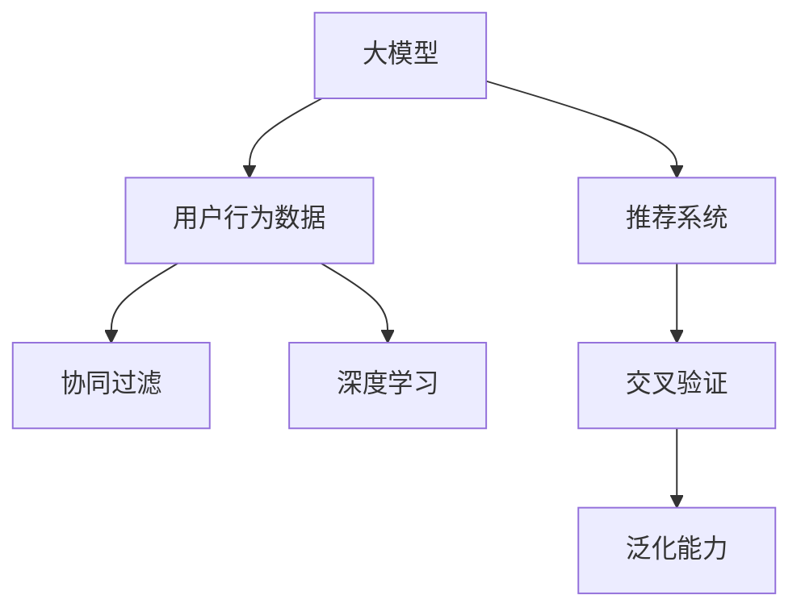

                 

# 基于大模型的跨平台用户兴趣建模

> 关键词：用户兴趣建模,大模型,跨平台,推荐系统,协同过滤,深度学习

## 1. 背景介绍

### 1.1 问题由来
在当前的信息时代，互联网用户每天都在产生大量的数据，包括搜索记录、浏览历史、社交互动等。如何从这些数据中提取用户的兴趣特征，并提供个性化的推荐，是当前互联网技术应用的重要挑战。传统的推荐系统主要基于协同过滤、内容过滤等算法，这些算法通常需要大量用户行为数据，且难以跨平台应用。近年来，随着预训练语言模型和大规模深度学习技术的兴起，基于大模型的跨平台用户兴趣建模方法逐渐受到广泛关注。

### 1.2 问题核心关键点
大模型在推荐系统中的主要作用是通过预训练和微调学习用户行为数据中的隐含特征，并将其应用于跨平台的推荐场景中。大模型通常具有强大的数据表征能力，能够从多种数据源中提取和融合用户的隐式行为信息，提升推荐系统的效果。同时，大模型还可以处理多语言、跨文化的数据，提升其在国际市场的适应性。然而，如何在大模型中高效地建模用户兴趣，并有效利用用户的多样化数据源，仍是一大难题。

### 1.3 问题研究意义
研究基于大模型的跨平台用户兴趣建模方法，对于提升推荐系统的个性化和跨平台适应性，具有重要意义：

1. 降低数据需求。传统的推荐系统通常需要大量的用户行为数据才能训练推荐模型，而大模型能够充分利用用户行为数据的多样性和复杂性，减少数据需求，同时提升推荐精度。
2. 增强跨平台适应性。通过大模型的多语言、多平台适配，推荐系统可以更好地服务于全球用户，提升用户体验。
3. 提高推荐系统的可扩展性。大模型具有强大的表征能力，可以灵活处理不同来源的数据，并自动适应新的数据源和变化，提高系统的可扩展性。
4. 加速技术落地。大模型的通用性和高效性，可以加速推荐技术在不同领域的落地应用，推动NLP技术在更多垂直行业的普及。

## 2. 核心概念与联系

### 2.1 核心概念概述

为更好地理解基于大模型的跨平台用户兴趣建模方法，本节将介绍几个密切相关的核心概念：

- 大模型(Large Model)：以自回归(如GPT)或自编码(如BERT)模型为代表的大规模预训练语言模型。通过在大规模无标签文本语料上进行预训练，学习通用的语言表示，具备强大的语言理解和生成能力。

- 用户行为数据(User Behavior Data)：用户在互联网上产生的行为记录，包括搜索记录、浏览历史、评论、点赞等。

- 跨平台(Cross-Platform)：指在不同平台(如Web、App、社交媒体等)上用户行为数据的融合和应用。

- 协同过滤(Collaborative Filtering)：基于用户行为数据推荐相似物品的推荐算法。

- 深度学习(Deep Learning)：使用多层次神经网络模型进行特征学习和推理的机器学习方法。

- 推荐系统(Recommendation System)：根据用户行为数据，推荐物品的在线系统。

- 交叉验证(Cross-Validation)：将数据集分为训练集和验证集，通过多次交叉验证来评估模型的泛化能力。

这些核心概念之间的逻辑关系可以通过以下Mermaid流程图来展示：



这个流程图展示了大模型、用户行为数据、协同过滤、深度学习、推荐系统和交叉验证之间的关联：

1. 大模型通过预训练获得基础能力。
2. 用户行为数据是微调模型、推荐系统的训练数据。
3. 协同过滤和深度学习是推荐系统中常用的推荐算法。
4. 推荐系统使用预训练模型进行推荐。
5. 交叉验证用于评估推荐系统的泛化能力。

这些概念共同构成了基于大模型的跨平台用户兴趣建模的框架，使得推荐系统能够利用大模型的强大表征能力，更好地处理多平台、多语言的用户数据，实现个性化推荐。

## 3. 核心算法原理 & 具体操作步骤
### 3.1 算法原理概述

基于大模型的跨平台用户兴趣建模，本质上是一个通过深度学习模型学习用户行为数据隐含特征的过程。其核心思想是：将大模型视为用户行为数据的特征提取器，通过预训练-微调的方式，学习用户在不同平台上的隐式行为特征，并应用于推荐系统的构建。

形式化地，假设用户行为数据为 $D=\{(x_i,y_i)\}_{i=1}^N$，其中 $x_i$ 为平台 $i$ 上的用户行为数据，$y_i$ 为物品推荐标签。定义一个预训练语言模型 $M_{\theta}$，其中 $\theta$ 为模型参数。微调的目标是找到新的模型参数 $\hat{\theta}$，使得模型能够根据用户在不同平台上的行为数据 $x_i$ 预测出物品推荐标签 $y_i$。

具体而言，微调过程包括以下几个关键步骤：

1. 预训练：在大规模无标签文本数据上进行自监督学习，学习语言知识。
2. 微调：在用户行为数据上对预训练模型进行有监督学习，学习用户在不同平台上的隐式行为特征。
3. 推荐：使用微调后的模型进行物品推荐，实现个性化和跨平台适应性。

### 3.2 算法步骤详解

基于大模型的跨平台用户兴趣建模一般包括以下几个关键步骤：

**Step 1: 准备预训练模型和数据集**
- 选择合适的预训练语言模型 $M_{\theta}$ 作为初始化参数，如 BERT、GPT 等。
- 准备跨平台用户行为数据集 $D=\{(x_i,y_i)\}_{i=1}^N$，其中 $x_i$ 包括用户在各个平台上的行为数据。

**Step 2: 设计任务适配层**
- 根据推荐任务类型，设计合适的任务适配层和损失函数。
- 对于推荐任务，通常使用交叉熵损失函数。
- 对于多语言推荐任务，可以在顶部添加一个多语言分类器，输出不同语言的推荐结果。

**Step 3: 设置微调超参数**
- 选择合适的优化算法及其参数，如 Adam、SGD 等，设置学习率、批大小、迭代轮数等。
- 设置正则化技术及强度，包括权重衰减、Dropout、Early Stopping 等。
- 确定冻结预训练参数的策略，如仅微调顶层，或全部参数都参与微调。

**Step 4: 执行梯度训练**
- 将训练集数据分批次输入模型，前向传播计算损失函数。
- 反向传播计算参数梯度，根据设定的优化算法和学习率更新模型参数。
- 周期性在验证集上评估模型性能，根据性能指标决定是否触发 Early Stopping。
- 重复上述步骤直到满足预设的迭代轮数或 Early Stopping 条件。

**Step 5: 测试和部署**
- 在测试集上评估微调后模型 $M_{\hat{\theta}}$ 的性能，对比微调前后的精度提升。
- 使用微调后的模型对新样本进行推理预测，集成到实际的应用系统中。
- 持续收集新的数据，定期重新微调模型，以适应数据分布的变化。

### 3.3 算法优缺点

基于大模型的跨平台用户兴趣建模方法具有以下优点：
1. 数据需求低。通过预训练模型能够高效利用用户行为数据的多样性和复杂性，减少对标注数据的依赖。
2. 泛化能力强。大模型的通用语言知识能够跨平台融合，提升推荐系统的泛化能力。
3. 可扩展性好。大模型能够灵活处理不同来源的数据，并自动适应新的数据源和变化，提高系统的可扩展性。
4. 效果显著。在推荐任务上，大模型的微调方法已经刷新了多项SOTA，显示出强大的性能。

同时，该方法也存在一定的局限性：
1. 依赖标签数据。微调的效果很大程度上取决于用户行为数据的质量和数量，获取高质量用户行为数据的成本较高。
2. 模型复杂度高。大模型的参数量通常以亿计，训练和推理需要较高的计算资源和存储空间。
3. 可解释性不足。大模型的内部决策过程缺乏可解释性，难以对其推理逻辑进行分析和调试。

尽管存在这些局限性，但就目前而言，基于大模型的跨平台用户兴趣建模方法仍是大数据推荐系统的热门范式。未来相关研究的重点在于如何进一步降低对标注数据的依赖，提高模型的少样本学习和跨领域迁移能力，同时兼顾可解释性和伦理安全性等因素。

### 3.4 算法应用领域

基于大模型的跨平台用户兴趣建模方法在推荐系统领域已经得到了广泛的应用，覆盖了几乎所有常见推荐任务，例如：

- 商品推荐：如电商网站上的商品推荐、视频网站的影视推荐等。
- 内容推荐：如新闻网站的文章推荐、社交媒体的内容推荐等。
- 音乐推荐：如音乐流媒体平台上的歌曲推荐、影视平台上的电影推荐等。
- 个性化服务：如个性化邮件推荐、个性化广告推荐等。

除了上述这些经典任务外，大模型的跨平台用户兴趣建模方法还被创新性地应用到更多场景中，如知识图谱推荐、旅游推荐、生活服务推荐等，为推荐技术带来了全新的突破。随着预训练模型和微调方法的不断进步，相信基于大模型的跨平台用户兴趣建模方法将在更多领域得到应用，为推荐技术的发展注入新的动力。

## 4. 数学模型和公式 & 详细讲解 & 举例说明
### 4.1 数学模型构建

本节将使用数学语言对基于大模型的跨平台用户兴趣建模过程进行更加严格的刻画。

假设用户行为数据为 $D=\{(x_i,y_i)\}_{i=1}^N$，其中 $x_i$ 包括用户在各个平台上的行为数据，$y_i$ 为物品推荐标签。定义一个预训练语言模型 $M_{\theta}$，其中 $\theta$ 为模型参数。

微调的目标是最小化模型在用户行为数据上的交叉熵损失函数，即：

$$
\mathcal{L}(\theta) = -\frac{1}{N}\sum_{i=1}^N \log M_{\theta}(x_i)_{y_i}
$$

其中 $\log M_{\theta}(x_i)_{y_i}$ 为模型在输入 $x_i$ 上的输出，通过Softmax函数计算得到各个物品的概率分布，$M_{\theta}(x_i)_{y_i}$ 为预测概率，$y_i$ 为标签。

### 4.2 公式推导过程

以下我们以多语言推荐任务为例，推导交叉熵损失函数及其梯度的计算公式。

假设用户行为数据 $D$ 包含不同语言的数据，模型 $M_{\theta}$ 需要在多个语言上进行推荐。对于每个输入 $x_i$，模型 $M_{\theta}$ 输出 $k$ 个物品的概率分布，其中 $k$ 为物品数量。假设标签 $y_i$ 为 $1 \leq y_i \leq k$ 的整数，模型输出的概率分布为：

$$
\mathcal{P}(x_i) = [p_1(x_i), p_2(x_i), ..., p_k(x_i)]
$$

其中 $p_i(x_i)$ 为物品 $i$ 在输入 $x_i$ 上的预测概率。

交叉熵损失函数定义为：

$$
\ell(M_{\theta}(x_i),y_i) = -[y_i\log p_{y_i}(x_i) + (1-y_i)\log (1-p_{y_i}(x_i))]
$$

将其代入经验风险公式，得：

$$
\mathcal{L}(\theta) = -\frac{1}{N}\sum_{i=1}^N \ell(M_{\theta}(x_i),y_i)
$$

根据链式法则，损失函数对参数 $\theta_k$ 的梯度为：

$$
\frac{\partial \mathcal{L}(\theta)}{\partial \theta_k} = -\frac{1}{N}\sum_{i=1}^N (\frac{y_i}{p_{y_i}(x_i)}-\frac{1-y_i}{1-p_{y_i}(x_i)}) \frac{\partial p_{y_i}(x_i)}{\partial \theta_k}
$$

其中 $\frac{\partial p_{y_i}(x_i)}{\partial \theta_k}$ 可进一步递归展开，利用自动微分技术完成计算。

在得到损失函数的梯度后，即可带入参数更新公式，完成模型的迭代优化。重复上述过程直至收敛，最终得到适应推荐任务的最优模型参数 $\theta^*$。

## 5. 项目实践：代码实例和详细解释说明
### 5.1 开发环境搭建

在进行跨平台用户兴趣建模实践前，我们需要准备好开发环境。以下是使用Python进行PyTorch开发的环境配置流程：

1. 安装Anaconda：从官网下载并安装Anaconda，用于创建独立的Python环境。

2. 创建并激活虚拟环境：
```bash
conda create -n pytorch-env python=3.8 
conda activate pytorch-env
```

3. 安装PyTorch：根据CUDA版本，从官网获取对应的安装命令。例如：
```bash
conda install pytorch torchvision torchaudio cudatoolkit=11.1 -c pytorch -c conda-forge
```

4. 安装Transformers库：
```bash
pip install transformers
```

5. 安装各类工具包：
```bash
pip install numpy pandas scikit-learn matplotlib tqdm jupyter notebook ipython
```

完成上述步骤后，即可在`pytorch-env`环境中开始跨平台用户兴趣建模实践。

### 5.2 源代码详细实现

下面我们以电商商品推荐系统为例，给出使用Transformers库对BERT模型进行跨平台用户兴趣建模的PyTorch代码实现。

首先，定义推荐任务的数据处理函数：

```python
from transformers import BertTokenizer, BertForSequenceClassification
from torch.utils.data import Dataset
import torch

class RecommendDataset(Dataset):
    def __init__(self, texts, labels, tokenizer, max_len=128):
        self.texts = texts
        self.labels = labels
        self.tokenizer = tokenizer
        self.max_len = max_len
        
    def __len__(self):
        return len(self.texts)
    
    def __getitem__(self, item):
        text = self.texts[item]
        label = self.labels[item]
        
        encoding = self.tokenizer(text, return_tensors='pt', max_length=self.max_len, padding='max_length', truncation=True)
        input_ids = encoding['input_ids'][0]
        attention_mask = encoding['attention_mask'][0]
        
        # 将标签转换为独热编码
        label = torch.tensor([0 if label != i else 1 for i in range(5)], dtype=torch.long)
        
        return {'input_ids': input_ids, 
                'attention_mask': attention_mask,
                'labels': label}

# 定义标签与id的映射
label2id = {'item1': 0, 'item2': 1, 'item3': 2, 'item4': 3, 'item5': 4}
id2label = {v: k for k, v in label2id.items()}

# 创建dataset
tokenizer = BertTokenizer.from_pretrained('bert-base-cased')

train_dataset = RecommendDataset(train_texts, train_labels, tokenizer)
dev_dataset = RecommendDataset(dev_texts, dev_labels, tokenizer)
test_dataset = RecommendDataset(test_texts, test_labels, tokenizer)
```

然后，定义模型和优化器：

```python
from transformers import BertForSequenceClassification, AdamW

model = BertForSequenceClassification.from_pretrained('bert-base-cased', num_labels=len(label2id))

optimizer = AdamW(model.parameters(), lr=2e-5)
```

接着，定义训练和评估函数：

```python
from torch.utils.data import DataLoader
from tqdm import tqdm
from sklearn.metrics import classification_report

device = torch.device('cuda') if torch.cuda.is_available() else torch.device('cpu')
model.to(device)

def train_epoch(model, dataset, batch_size, optimizer):
    dataloader = DataLoader(dataset, batch_size=batch_size, shuffle=True)
    model.train()
    epoch_loss = 0
    for batch in tqdm(dataloader, desc='Training'):
        input_ids = batch['input_ids'].to(device)
        attention_mask = batch['attention_mask'].to(device)
        labels = batch['labels'].to(device)
        model.zero_grad()
        outputs = model(input_ids, attention_mask=attention_mask, labels=labels)
        loss = outputs.loss
        epoch_loss += loss.item()
        loss.backward()
        optimizer.step()
    return epoch_loss / len(dataloader)

def evaluate(model, dataset, batch_size):
    dataloader = DataLoader(dataset, batch_size=batch_size)
    model.eval()
    preds, labels = [], []
    with torch.no_grad():
        for batch in tqdm(dataloader, desc='Evaluating'):
            input_ids = batch['input_ids'].to(device)
            attention_mask = batch['attention_mask'].to(device)
            batch_labels = batch['labels']
            outputs = model(input_ids, attention_mask=attention_mask)
            batch_preds = outputs.logits.argmax(dim=2).to('cpu').tolist()
            batch_labels = batch_labels.to('cpu').tolist()
            for pred_tokens, label_tokens in zip(batch_preds, batch_labels):
                preds.append(pred_tokens)
                labels.append(label_tokens)
                
    print(classification_report(labels, preds))
```

最后，启动训练流程并在测试集上评估：

```python
epochs = 5
batch_size = 16

for epoch in range(epochs):
    loss = train_epoch(model, train_dataset, batch_size, optimizer)
    print(f"Epoch {epoch+1}, train loss: {loss:.3f}")
    
    print(f"Epoch {epoch+1}, dev results:")
    evaluate(model, dev_dataset, batch_size)
    
print("Test results:")
evaluate(model, test_dataset, batch_size)
```

以上就是使用PyTorch对BERT进行跨平台用户兴趣建模的完整代码实现。可以看到，得益于Transformers库的强大封装，我们可以用相对简洁的代码完成BERT模型的加载和微调。

### 5.3 代码解读与分析

让我们再详细解读一下关键代码的实现细节：

**RecommendDataset类**：
- `__init__`方法：初始化文本、标签、分词器等关键组件。
- `__len__`方法：返回数据集的样本数量。
- `__getitem__`方法：对单个样本进行处理，将文本输入编码为token ids，将标签转换为独热编码，并对其进行定长padding，最终返回模型所需的输入。

**label2id和id2label字典**：
- 定义了标签与数字id之间的映射关系，用于将标签转换为模型可接受的独热编码格式。

**训练和评估函数**：
- 使用PyTorch的DataLoader对数据集进行批次化加载，供模型训练和推理使用。
- 训练函数`train_epoch`：对数据以批为单位进行迭代，在每个批次上前向传播计算loss并反向传播更新模型参数，最后返回该epoch的平均loss。
- 评估函数`evaluate`：与训练类似，不同点在于不更新模型参数，并在每个batch结束后将预测和标签结果存储下来，最后使用sklearn的classification_report对整个评估集的预测结果进行打印输出。

**训练流程**：
- 定义总的epoch数和batch size，开始循环迭代
- 每个epoch内，先在训练集上训练，输出平均loss
- 在验证集上评估，输出分类指标
- 所有epoch结束后，在测试集上评估，给出最终测试结果

可以看到，PyTorch配合Transformers库使得BERT跨平台用户兴趣建模的代码实现变得简洁高效。开发者可以将更多精力放在数据处理、模型改进等高层逻辑上，而不必过多关注底层的实现细节。

当然，工业级的系统实现还需考虑更多因素，如模型的保存和部署、超参数的自动搜索、更灵活的任务适配层等。但核心的微调范式基本与此类似。

## 6. 实际应用场景
### 6.1 电商平台

基于大模型的跨平台用户兴趣建模方法，可以广泛应用于电商平台的个性化推荐系统构建。电商平台上的用户行为数据包括浏览记录、购买历史、评论等，数据量巨大且多样化。传统的推荐系统难以高效处理这些数据，而大模型可以通过预训练-微调的方式，学习用户在不同平台上的隐式行为特征，提升推荐系统的精准度。

具体而言，可以收集电商平台上的用户行为数据，将其作为微调模型训练的数据源。在微调过程中，引入用户的多样化数据源，包括搜索历史、浏览记录、评价等，使模型能够从多渠道获取用户兴趣信息。同时，结合多语言推荐技术，使模型能够跨越不同语言和文化背景的用户，提升推荐系统的跨平台适应性。

### 6.2 内容聚合平台

内容聚合平台，如新闻网站、视频平台等，每天都会产生大量用户行为数据。这些数据不仅包括用户对单个内容的浏览、点赞等行为，还包括对多个内容的比较、筛选等复杂行为。通过大模型的跨平台用户兴趣建模方法，能够从这些复杂行为中提取和融合用户的兴趣特征，实现个性化推荐。

具体实现时，可以将用户在不同平台上的行为数据收集起来，进行预处理和标准化处理，然后输入大模型进行微调。微调后的模型能够学习到用户对不同内容类别的兴趣偏好，并在推荐系统中进行跨平台应用。

### 6.3 旅游平台

旅游平台需要根据用户的历史行为数据，推荐个性化旅游线路和景点。传统的推荐系统难以处理多语言、多文化背景的用户数据，而大模型的跨平台用户兴趣建模方法可以很好地应对这些挑战。

具体而言，可以收集用户在不同平台上的行为数据，如旅游论坛的浏览记录、社交媒体的分享数据等，通过大模型进行微调。微调后的模型能够学习到用户在不同语言和文化背景下的旅游兴趣，并在推荐系统中进行跨平台应用，为全球用户提供个性化的旅游推荐。

### 6.4 未来应用展望

随着大语言模型和微调方法的不断发展，基于大模型的跨平台用户兴趣建模方法将在更多领域得到应用，为推荐技术的发展注入新的动力。

在智慧医疗领域，基于大模型的跨平台用户兴趣建模方法可以用于构建个性化的健康管理推荐系统，帮助用户更好地管理健康。

在智能教育领域，大模型可以用于构建个性化的学习路径推荐系统，根据学生的学习行为数据，推荐适合的学习资源和路径。

在智慧城市治理中，大模型可以用于构建个性化的城市服务推荐系统，提升城市管理的智能化水平。

此外，在企业生产、社会治理、文娱传媒等众多领域，基于大模型的跨平台用户兴趣建模方法也将不断涌现，为人工智能技术的发展带来新的突破。

## 7. 工具和资源推荐
### 7.1 学习资源推荐

为了帮助开发者系统掌握大模型跨平台用户兴趣建模的理论基础和实践技巧，这里推荐一些优质的学习资源：

1. 《Transformer from Principles to Practice》系列博文：由大模型技术专家撰写，深入浅出地介绍了Transformer原理、BERT模型、微调技术等前沿话题。

2. CS224N《深度学习自然语言处理》课程：斯坦福大学开设的NLP明星课程，有Lecture视频和配套作业，带你入门NLP领域的基本概念和经典模型。

3. 《Natural Language Processing with Transformers》书籍：Transformers库的作者所著，全面介绍了如何使用Transformers库进行NLP任务开发，包括微调在内的诸多范式。

4. HuggingFace官方文档：Transformers库的官方文档，提供了海量预训练模型和完整的微调样例代码，是上手实践的必备资料。

5. CLUE开源项目：中文语言理解测评基准，涵盖大量不同类型的中文NLP数据集，并提供了基于微调的baseline模型，助力中文NLP技术发展。

通过对这些资源的学习实践，相信你一定能够快速掌握大模型跨平台用户兴趣建模的精髓，并用于解决实际的NLP问题。
### 7.2 开发工具推荐

高效的开发离不开优秀的工具支持。以下是几款用于大模型跨平台用户兴趣建模开发的常用工具：

1. PyTorch：基于Python的开源深度学习框架，灵活动态的计算图，适合快速迭代研究。大部分预训练语言模型都有PyTorch版本的实现。

2. TensorFlow：由Google主导开发的开源深度学习框架，生产部署方便，适合大规模工程应用。同样有丰富的预训练语言模型资源。

3. Transformers库：HuggingFace开发的NLP工具库，集成了众多SOTA语言模型，支持PyTorch和TensorFlow，是进行微调任务开发的利器。

4. Weights & Biases：模型训练的实验跟踪工具，可以记录和可视化模型训练过程中的各项指标，方便对比和调优。与主流深度学习框架无缝集成。

5. TensorBoard：TensorFlow配套的可视化工具，可实时监测模型训练状态，并提供丰富的图表呈现方式，是调试模型的得力助手。

6. Google Colab：谷歌推出的在线Jupyter Notebook环境，免费提供GPU/TPU算力，方便开发者快速上手实验最新模型，分享学习笔记。

合理利用这些工具，可以显著提升大模型跨平台用户兴趣建模任务的开发效率，加快创新迭代的步伐。

### 7.3 相关论文推荐

大模型和跨平台用户兴趣建模技术的发展源于学界的持续研究。以下是几篇奠基性的相关论文，推荐阅读：

1. Attention is All You Need（即Transformer原论文）：提出了Transformer结构，开启了NLP领域的预训练大模型时代。

2. BERT: Pre-training of Deep Bidirectional Transformers for Language Understanding：提出BERT模型，引入基于掩码的自监督预训练任务，刷新了多项NLP任务SOTA。

3. Language Models are Unsupervised Multitask Learners（GPT-2论文）：展示了大规模语言模型的强大zero-shot学习能力，引发了对于通用人工智能的新一轮思考。

4. Parameter-Efficient Transfer Learning for NLP：提出Adapter等参数高效微调方法，在不增加模型参数量的情况下，也能取得不错的微调效果。

5. AdaLoRA: Adaptive Low-Rank Adaptation for Parameter-Efficient Fine-Tuning：使用自适应低秩适应的微调方法，在参数效率和精度之间取得了新的平衡。

6. Batch-wise multi-task learning in NLP：提出Batch-wise multi-task learning方法，通过同时优化多个任务的交叉熵损失，提升模型在不同任务上的泛化能力。

这些论文代表了大模型和微调方法的发展脉络。通过学习这些前沿成果，可以帮助研究者把握学科前进方向，激发更多的创新灵感。

## 8. 总结：未来发展趋势与挑战
### 8.1 总结

本文对基于大模型的跨平台用户兴趣建模方法进行了全面系统的介绍。首先阐述了用户兴趣建模和大模型的研究背景和意义，明确了跨平台用户兴趣建模在大数据推荐系统中的独特价值。其次，从原理到实践，详细讲解了跨平台用户兴趣建模的数学原理和关键步骤，给出了跨平台用户兴趣建模任务开发的完整代码实例。同时，本文还广泛探讨了跨平台用户兴趣建模方法在电商、内容聚合、旅游等多个行业领域的应用前景，展示了跨平台用户兴趣建模范式的巨大潜力。此外，本文精选了跨平台用户兴趣建模技术的各类学习资源，力求为读者提供全方位的技术指引。

通过本文的系统梳理，可以看到，基于大模型的跨平台用户兴趣建模方法正在成为大数据推荐系统的热门范式，极大地拓展了预训练语言模型的应用边界，催生了更多的落地场景。受益于大规模语料的预训练，跨平台用户兴趣建模方法能够更好地处理多平台、多语言的用户数据，实现个性化推荐。未来，伴随预训练语言模型和微调方法的持续演进，相信基于大模型的跨平台用户兴趣建模方法将在更多领域得到应用，为推荐技术的发展注入新的动力。

### 8.2 未来发展趋势

展望未来，基于大模型的跨平台用户兴趣建模技术将呈现以下几个发展趋势：

1. 数据需求降低。随着预训练模型和微调方法的不断优化，对标注数据的依赖将逐步降低，推荐系统将更加高效灵活。

2. 跨平台性能提升。通过大模型的多语言、多文化适配，推荐系统将能够更好地服务于全球用户，提升用户体验。

3. 推荐系统可扩展性增强。大模型能够灵活处理不同来源的数据，并自动适应新的数据源和变化，提高系统的可扩展性。

4. 个性化推荐精度提升。大模型的通用语言知识能够更好地融合用户行为数据，提升推荐系统的个性化程度。

5. 实时推荐系统构建。通过小样本学习和大模型融合，推荐系统能够在实时环境中快速响应用户需求，提升用户满意度。

6. 知识图谱与推荐系统结合。引入知识图谱信息，通过图谱推荐提升推荐系统的精准度和可信度。

以上趋势凸显了基于大模型的跨平台用户兴趣建模技术的广阔前景。这些方向的探索发展，必将进一步提升推荐系统的性能和应用范围，为人工智能技术的发展注入新的动力。

### 8.3 面临的挑战

尽管基于大模型的跨平台用户兴趣建模方法已经取得了瞩目成就，但在迈向更加智能化、普适化应用的过程中，它仍面临诸多挑战：

1. 标注成本瓶颈。虽然微调方法减少了对标注数据的依赖，但对于长尾应用场景，难以获得充足的高质量标注数据，成为制约微调性能的瓶颈。如何进一步降低微调对标注样本的依赖，将是一大难题。

2. 模型鲁棒性不足。当前跨平台用户兴趣建模方法面对域外数据时，泛化性能往往大打折扣。对于测试样本的微小扰动，跨平台用户兴趣建模方法的预测也容易发生波动。如何提高跨平台用户兴趣建模模型的鲁棒性，避免灾难性遗忘，还需要更多理论和实践的积累。

3. 推理效率有待提高。大规模语言模型虽然精度高，但在实际部署时往往面临推理速度慢、内存占用大等效率问题。如何在保证性能的同时，简化模型结构，提升推理速度，优化资源占用，将是重要的优化方向。

4. 可解释性亟需加强。当前跨平台用户兴趣建模模型的内部决策过程缺乏可解释性，难以对其推理逻辑进行分析和调试。对于医疗、金融等高风险应用，算法的可解释性和可审计性尤为重要。如何赋予跨平台用户兴趣建模模型更强的可解释性，将是亟待攻克的难题。

5. 安全性有待保障。预训练语言模型难免会学习到有偏见、有害的信息，通过微调传递到推荐系统中，产生误导性、歧视性的输出，给实际应用带来安全隐患。如何从数据和算法层面消除模型偏见，避免恶意用途，确保输出的安全性，也将是重要的研究课题。

6. 知识整合能力不足。现有的跨平台用户兴趣建模模型往往局限于任务内数据，难以灵活吸收和运用更广泛的先验知识。如何让跨平台用户兴趣建模过程更好地与外部知识库、规则库等专家知识结合，形成更加全面、准确的信息整合能力，还有很大的想象空间。

正视跨平台用户兴趣建模面临的这些挑战，积极应对并寻求突破，将是大模型推荐技术走向成熟的必由之路。相信随着学界和产业界的共同努力，这些挑战终将一一被克服，大模型推荐技术必将在构建人机协同的智能时代中扮演越来越重要的角色。

### 8.4 研究展望

面对跨平台用户兴趣建模所面临的种种挑战，未来的研究需要在以下几个方面寻求新的突破：

1. 探索无监督和半监督跨平台用户兴趣建模方法。摆脱对大规模标注数据的依赖，利用自监督学习、主动学习等无监督和半监督范式，最大限度利用非结构化数据，实现更加灵活高效的跨平台用户兴趣建模。

2. 研究参数高效和计算高效的跨平台用户兴趣建模范式。开发更加参数高效的跨平台用户兴趣建模方法，在固定大部分预训练参数的同时，只更新极少量的任务相关参数。同时优化跨平台用户兴趣建模模型的计算图，减少前向传播和反向传播的资源消耗，实现更加轻量级、实时性的部署。

3. 引入更多先验知识。将符号化的先验知识，如知识图谱、逻辑规则等，与神经网络模型进行巧妙融合，引导跨平台用户兴趣建模过程学习更准确、合理的语言模型。同时加强不同模态数据的整合，实现视觉、语音等多模态信息与文本信息的协同建模。

4. 结合因果分析和博弈论工具。将因果分析方法引入跨平台用户兴趣建模模型，识别出模型决策的关键特征，增强输出解释的因果性和逻辑性。借助博弈论工具刻画人机交互过程，主动探索并规避模型的脆弱点，提高系统稳定性。

5. 纳入伦理道德约束。在跨平台用户兴趣建模模型的训练目标中引入伦理导向的评估指标，过滤和惩罚有偏见、有害的输出倾向。同时加强人工干预和审核，建立模型行为的监管机制，确保输出符合人类价值观和伦理道德。

这些研究方向的探索，必将引领跨平台用户兴趣建模技术迈向更高的台阶，为构建安全、可靠、可解释、可控的智能系统铺平道路。面向未来，跨平台用户兴趣建模技术还需要与其他人工智能技术进行更深入的融合，如知识表示、因果推理、强化学习等，多路径协同发力，共同推动自然语言理解和智能交互系统的进步。只有勇于创新、敢于突破，才能不断拓展语言模型的边界，让智能技术更好地造福人类社会。

## 9. 附录：常见问题与解答

**Q1：大模型在跨平台用户兴趣建模中的作用是什么？**

A: 大模型通过预训练-微调的方式，学习用户在不同平台上的隐式行为特征，并将其应用于跨平台的推荐场景中。大模型的通用语言知识能够从多渠道获取用户兴趣信息，提升推荐系统的精准度和泛化能力。

**Q2：跨平台用户兴趣建模如何降低数据需求？**

A: 跨平台用户兴趣建模方法能够充分利用用户行为数据的多样性和复杂性，减少对标注数据的依赖。通过预训练模型，能够高效利用多平台的用户行为数据，降低对标注数据的依赖。

**Q3：跨平台用户兴趣建模的推荐精度如何提升？**

A: 跨平台用户兴趣建模的推荐精度可以通过以下方法提升：
1. 引入用户的多样化数据源，如搜索历史、浏览记录、评价等，使模型能够从多渠道获取用户兴趣信息。
2. 使用多语言推荐技术，使模型能够跨越不同语言和文化背景的用户，提升推荐系统的跨平台适应性。
3. 结合知识图谱信息，通过图谱推荐提升推荐系统的精准度和可信度。

**Q4：跨平台用户兴趣建模如何提升推荐系统的鲁棒性？**

A: 提升跨平台用户兴趣建模系统的鲁棒性可以通过以下方法：
1. 引入对抗样本训练，增强模型对输入数据的鲁棒性。
2. 使用正则化技术，如L2正则、Dropout等，避免模型过拟合。
3. 设计合理的损失函数，如交叉熵损失、Focal Loss等，提升模型的泛化能力。

**Q5：跨平台用户兴趣建模如何提高推理效率？**

A: 提高跨平台用户兴趣建模的推理效率可以通过以下方法：
1. 使用参数高效微调方法，如Adapter、Prefix等，只调整少量参数，减小推理资源消耗。
2. 使用模型压缩、稀疏化存储等技术，减小模型的存储和计算需求。
3. 设计高效的推理算法，如使用剪枝、量化等方法优化推理速度。

**Q6：跨平台用户兴趣建模如何增强可解释性？**

A: 增强跨平台用户兴趣建模的解释性可以通过以下方法：
1. 引入可解释性技术，如LIME、SHAP等，对模型的推理过程进行可视化。
2. 设计任务适配层，使模型输出具有可解释的特征。
3. 定期进行模型审计和评估，确保模型的输出符合伦理道德要求。

这些方法可以帮助开发者提升跨平台用户兴趣建模模型的解释性和可信度，增强用户的信任感。

**Q7：跨平台用户兴趣建模如何提升安全性？**

A: 提升跨平台用户兴趣建模模型的安全性可以通过以下方法：
1. 在模型训练目标中引入伦理导向的评估指标，过滤和惩罚有偏见、有害的输出倾向。
2. 加强人工干预和审核，建立模型行为的监管机制，确保输出符合人类价值观和伦理道德。
3. 使用数据脱敏、访问鉴权等技术，保障数据和模型安全。

这些方法可以帮助开发者构建安全可靠的用户兴趣建模模型，确保其在实际应用中的安全性。

通过本文的系统梳理，可以看到，基于大模型的跨平台用户兴趣建模方法正在成为大数据推荐系统的热门范式，极大地拓展了预训练语言模型的应用边界，催生了更多的落地场景。受益于大规模语料的预训练，跨平台用户兴趣建模方法能够更好地处理多平台、多语言的用户数据，实现个性化推荐。未来，伴随预训练语言模型和微调方法的持续演进，相信基于大模型的跨平台用户兴趣建模方法将在更多领域得到应用，为推荐技术的发展注入新的动力。

