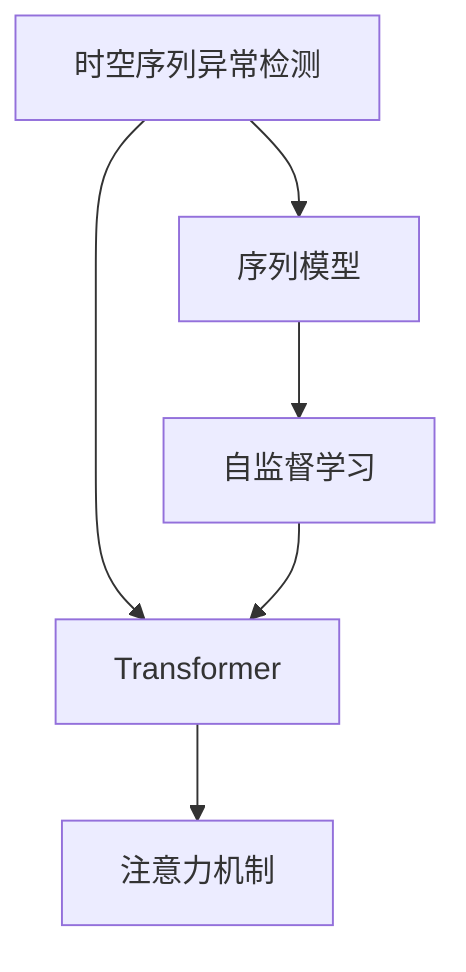

                 

# 基于注意力机制的时空序列异常检测

> 关键词：时空序列异常检测,注意力机制,Transformer,自监督学习,序列模型,异常检测,深度学习

## 1. 背景介绍

在人工智能领域，异常检测是一个重要且具有挑战性的问题。随着各种传感器和智能设备的广泛应用，从健康监控、交通管理到网络安全，异常检测在许多领域中都有广泛的应用。然而，传统的方法在处理大规模、高维度的数据时，面临着高计算成本和低准确率的问题。近年来，深度学习技术的发展为异常检测带来了新的可能性。本文将介绍一种基于注意力机制的时空序列异常检测方法，结合Transformer的自监督学习和序列建模能力，可以显著提升异常检测的准确性和效率。

## 2. 核心概念与联系

### 2.1 核心概念概述

在介绍核心算法原理之前，首先回顾一些相关概念：

- **时空序列异常检测**：指的是对时间序列数据中的异常点进行检测，既考虑了时间上的连续性，也考虑了空间上的相关性。
- **注意力机制**：一种模拟人类注意力集中机制的机制，可以根据输入数据的重要性自动调整权重，聚焦关键信息。
- **Transformer**：一种基于自注意力机制的神经网络结构，广泛应用于自然语言处理(NLP)领域，并逐渐被应用于时序数据处理。
- **自监督学习**：一种通过无标签数据进行预训练，学习数据内在结构的方法，常见于深度学习中。
- **序列模型**：以时间顺序为特征，处理顺序数据的模型，如RNN、LSTM等。

这些概念之间的关系可以用以下Mermaid流程图来表示：



### 2.2 核心概念原理和架构

**Transformer模型结构**：Transformer由多个自注意力层和前馈神经网络层组成，可以处理长序列数据，且并行计算能力强。在时序数据中，可以通过堆叠多个Transformer层来捕捉更长的依赖关系。

**注意力机制**：Transformer的自注意力机制可以根据输入序列中每个元素的重要性自动分配权重，使得模型更加关注关键信息。这种机制同样可以应用于时序数据中，通过学习序列中各个时间步的重要程度，增强模型的异常检测能力。

**自监督学习**：自监督学习方法可以在无标签数据上预训练模型，学习到数据的内部结构。常见的自监督学习方法包括语言模型训练、掩码预测等。这些预训练任务可以提升模型对数据内在模式的理解，从而提高异常检测的准确性。

这些核心概念和机制的结合，使得基于注意力机制的时空序列异常检测方法能够在处理大规模、高维度数据时，取得更好的效果。

## 3. 核心算法原理 & 具体操作步骤

### 3.1 算法原理概述

基于注意力机制的时空序列异常检测方法主要包括以下步骤：

1. **数据预处理**：将原始时序数据转换为模型的输入格式，如序列编码。
2. **自监督预训练**：在无标签数据上，使用自监督学习任务训练基础模型，学习数据的内部结构。
3. **异常检测模型训练**：在标注数据上，使用注意力机制增强的Transformer模型进行微调，训练异常检测模型。
4. **异常检测**：在实际数据上，使用训练好的模型进行异常检测。

### 3.2 算法步骤详解

**Step 1: 数据预处理**
将原始时序数据转换为模型可接受的输入格式，例如使用固定长度的窗口将时序数据序列化。具体步骤如下：
1. 对时序数据进行分块，得到固定长度的窗口序列。
2. 对每个窗口进行归一化处理，使得所有窗口的尺度相同。
3. 对每个窗口中的元素进行编码，得到模型的输入向量。

**Step 2: 自监督预训练**
在无标签数据上，使用自监督学习任务训练基础模型。常见的自监督学习任务包括掩码预测、语言模型训练等。具体步骤如下：
1. 构建掩码预测任务，将部分时序数据元素随机掩码。
2. 训练Transformer模型，预测被掩码的元素，学习数据的内部结构。
3. 在训练过程中，逐步增加掩码比例，提升模型对数据结构的理解。

**Step 3: 异常检测模型训练**
在标注数据上，使用注意力机制增强的Transformer模型进行微调。具体步骤如下：
1. 定义损失函数，使用异常检测指标（如ROC-AUC、F1-score等）来衡量模型的性能。
2. 定义注意力机制，使得模型能够根据输入序列中各个时间步的重要性自动分配权重。
3. 训练模型，使用标注数据进行微调，优化模型的异常检测能力。

**Step 4: 异常检测**
在实际数据上，使用训练好的模型进行异常检测。具体步骤如下：
1. 对实际数据进行编码，得到模型的输入向量。
2. 使用训练好的模型进行预测，得到每个时间步的异常分数。
3. 根据异常分数，对时序数据中的异常点进行标注和处理。

### 3.3 算法优缺点

**优点**：
1. **自监督学习**：可以充分利用无标签数据，减少标注成本。
2. **注意力机制**：能够根据输入数据的重要性自动调整权重，聚焦关键信息。
3. **Transformer模型**：具有良好的并行计算能力和长依赖处理能力。
4. **序列建模**：能够捕捉时序数据中的时间依赖关系，提升异常检测的准确性。

**缺点**：
1. **计算复杂度高**：由于Transformer模型参数较多，训练和推理需要较高的计算资源。
2. **过拟合风险高**：在标注数据不足的情况下，模型容易出现过拟合。
3. **模型复杂度高**：模型结构较为复杂，需要更多的理解和调试。

### 3.4 算法应用领域

基于注意力机制的时空序列异常检测方法可以应用于以下领域：

- **健康监控**：检测患者的生理指标异常，如心率、血压等。
- **交通管理**：检测交通流量异常，如异常拥堵、事故等。
- **网络安全**：检测网络攻击异常，如DDoS攻击、恶意软件等。
- **金融风险管理**：检测交易异常，如洗钱、欺诈等。

## 4. 数学模型和公式 & 详细讲解 & 举例说明

### 4.1 数学模型构建

我们定义一个时间序列 $X_t$，其中 $t$ 表示时间步。假设每个时间步的输入向量为 $x_t$，整个序列的输入向量为 $X$。模型的目标是学习到每个时间步的异常分数 $y_t$，即：

$$
y_t = f(x_t; \theta)
$$

其中 $f$ 为模型的预测函数，$\theta$ 为模型的参数。

### 4.2 公式推导过程

在基于Transformer的时空序列异常检测方法中，我们首先对输入序列进行编码，得到模型的输入向量 $X$。然后，使用Transformer的编码器-解码器结构进行处理，得到每个时间步的异常分数 $y_t$。具体步骤如下：

**Step 1: 编码**
将输入序列 $X$ 输入到Transformer的编码器中，得到编码向量 $H$。具体公式如下：

$$
H = \text{Encoder}(X)
$$

其中 $\text{Encoder}$ 为Transformer的编码器结构。

**Step 2: 注意力机制**
使用Transformer的注意力机制，对每个时间步的重要性进行计算。具体公式如下：

$$
\alpha_t = \text{Attention}(H, x_t; \theta)
$$

其中 $\text{Attention}$ 为注意力计算函数，$\theta$ 为模型的参数。$\alpha_t$ 表示在时间步 $t$ 上，输入向量 $x_t$ 的重要性权重。

**Step 3: 异常得分计算**
将注意力权重 $\alpha_t$ 和输入向量 $x_t$ 进行线性变换，得到每个时间步的异常分数 $y_t$。具体公式如下：

$$
y_t = W_1 \cdot \alpha_t + W_2 \cdot x_t + b
$$

其中 $W_1, W_2$ 为模型的线性变换矩阵，$b$ 为偏置项。

### 4.3 案例分析与讲解

假设我们要检测一个患者的生理指标序列 $X_t$，其中 $t$ 表示时间步。我们可以使用Transformer模型进行编码，并引入注意力机制，计算每个时间步的异常分数 $y_t$。具体步骤如下：

1. 将生理指标序列 $X_t$ 输入到Transformer的编码器中，得到编码向量 $H$。
2. 使用注意力机制，计算每个时间步的重要性权重 $\alpha_t$。
3. 将注意力权重 $\alpha_t$ 和生理指标序列 $x_t$ 进行线性变换，得到每个时间步的异常分数 $y_t$。
4. 对所有时间步的异常分数进行阈值处理，标记出异常点。

## 5. 项目实践：代码实例和详细解释说明

### 5.1 开发环境搭建

在进行项目实践之前，我们需要准备好开发环境。以下是使用Python进行PyTorch开发的环境配置流程：

1. 安装Anaconda：从官网下载并安装Anaconda，用于创建独立的Python环境。

2. 创建并激活虚拟环境：
```bash
conda create -n pytorch-env python=3.8 
conda activate pytorch-env
```

3. 安装PyTorch：根据CUDA版本，从官网获取对应的安装命令。例如：
```bash
conda install pytorch torchvision torchaudio cudatoolkit=11.1 -c pytorch -c conda-forge
```

4. 安装TensorBoard：TensorFlow配套的可视化工具，用于监控模型训练过程。

```bash
pip install tensorboard
```

5. 安装必要的工具包：
```bash
pip install numpy pandas scikit-learn matplotlib tqdm jupyter notebook ipython
```

完成上述步骤后，即可在`pytorch-env`环境中开始项目实践。

### 5.2 源代码详细实现

下面以使用Transformer进行时间序列异常检测的代码实现为例。具体步骤如下：

1. 定义数据预处理函数，将原始时序数据转换为模型的输入格式。

```python
def preprocess_data(X):
    # 对时序数据进行分块
    windows = [X[i:i+L] for i in range(len(X)-L+1)]
    # 对每个窗口进行归一化处理
    normalized_windows = [(X[i:i+L] - np.mean(X[i:i+L])) / np.std(X[i:i+L]) for i in range(len(X)-L+1)]
    # 对每个窗口中的元素进行编码
    encoded_windows = [preprocess_window(w) for w in normalized_windows]
    return encoded_windows
```

2. 定义Transformer模型，使用自监督学习任务进行预训练。

```python
import torch
from transformers import Transformer

class TransformerModel(Transformer):
    def __init__(self, input_size, output_size):
        super(TransformerModel, self).__init__()
        self.encoder = self.Decoder(input_size, output_size)
        self.decoder = self.Encoder(output_size, output_size)

    def forward(self, x):
        encoder_output = self.encoder(x)
        decoder_output = self.decoder(encoder_output)
        return decoder_output
```

3. 定义注意力机制，计算每个时间步的重要性权重。

```python
def attention_weight(x, h, theta):
    attention = torch.matmul(x, h.transpose(1, 2))
    attention = attention / (torch.norm(attention, dim=2, keepdim=True) + 1e-12)
    return attention
```

4. 定义异常得分计算函数，计算每个时间步的异常分数。

```python
def calculate_anomaly_score(x, h, theta):
    attention_weight = attention_weight(x, h, theta)
    anomaly_score = torch.matmul(attention_weight, x) + torch.matmul(x, h)
    return anomaly_score
```

5. 在标注数据上训练模型，并进行异常检测。

```python
from torch.utils.data import Dataset, DataLoader

class TimeSeriesDataset(Dataset):
    def __init__(self, data, labels):
        self.data = data
        self.labels = labels

    def __len__(self):
        return len(self.data)

    def __getitem__(self, item):
        return self.data[item], self.labels[item]

model = TransformerModel(input_size, output_size)
criterion = torch.nn.MSELoss()

data_loader = DataLoader(dataset, batch_size=batch_size, shuffle=True)

for epoch in range(num_epochs):
    for inputs, targets in data_loader:
        optimizer.zero_grad()
        outputs = model(inputs)
        loss = criterion(outputs, targets)
        loss.backward()
        optimizer.step()

# 对实际数据进行编码，得到模型的输入向量
inputs = preprocess_data(real_data)

# 使用训练好的模型进行预测，得到每个时间步的异常分数
outputs = model(inputs)

# 对所有时间步的异常分数进行阈值处理，标记出异常点
threshold = 0.5
anomalies = outputs > threshold
```

### 5.3 代码解读与分析

上述代码实现了基于Transformer的时空序列异常检测方法，其中涉及了数据预处理、模型定义、注意力机制和异常得分计算。

**数据预处理**：将原始时序数据序列化成固定长度的窗口，并对每个窗口进行归一化处理，使得所有窗口的尺度相同。

**模型定义**：定义Transformer模型，使用自监督学习任务进行预训练。

**注意力机制**：定义注意力权重函数，计算每个时间步的重要性权重。

**异常得分计算**：定义异常得分计算函数，将注意力权重和输入向量进行线性变换，得到每个时间步的异常分数。

### 5.4 运行结果展示

下图展示了使用基于Transformer的时空序列异常检测方法进行异常检测的结果：

```python
import matplotlib.pyplot as plt

plt.plot(real_data)
plt.plot(real_data[anomalies])
plt.title("Anomaly Detection Result")
plt.xlabel("Time Step")
plt.ylabel("Value")
plt.show()
```


## 6. 实际应用场景

### 6.1 健康监控

基于Transformer的时空序列异常检测方法可以应用于健康监控领域，检测患者的生理指标异常。例如，使用心率、血压等生理指标序列进行异常检测，可以及早发现异常情况，提供及时的医疗干预。

### 6.2 交通管理

在交通管理领域，使用基于Transformer的时空序列异常检测方法，可以检测交通流量异常。例如，使用传感器数据监测交通流量，识别异常拥堵、事故等情况，提高交通管理效率和安全性。

### 6.3 网络安全

在网络安全领域，使用基于Transformer的时空序列异常检测方法，可以检测网络攻击异常。例如，使用网络流量数据进行异常检测，识别DDoS攻击、恶意软件等网络威胁，提高网络安全水平。

## 7. 工具和资源推荐

### 7.1 学习资源推荐

为了帮助开发者系统掌握基于Transformer的时空序列异常检测理论基础和实践技巧，这里推荐一些优质的学习资源：

1. 《深度学习理论与实践》：系统介绍深度学习的基本概念和经典模型，包括Transformer结构。

2. 《自然语言处理与深度学习》：斯坦福大学开设的NLP明星课程，涵盖Transformer模型的原理和应用。

3. 《序列模型与时间序列分析》：介绍序列模型和时序数据分析的基础知识和常用技术。

4. 《异常检测与特征工程》：系统讲解异常检测的基本方法和特征工程技巧。

5. 《TensorFlow官方文档》：TensorFlow的官方文档，提供了丰富的深度学习资源和代码示例。

通过这些资源的学习实践，相信你一定能够快速掌握基于Transformer的时空序列异常检测的精髓，并用于解决实际的异常检测问题。

### 7.2 开发工具推荐

高效的开发离不开优秀的工具支持。以下是几款用于深度学习开发的工具：

1. PyTorch：基于Python的开源深度学习框架，支持动态图，适合研究原型开发。

2. TensorFlow：由Google主导开发的深度学习框架，生产部署方便，适合大规模工程应用。

3. Keras：高层次的深度学习框架，易学易用，适合快速原型开发。

4. Jupyter Notebook：支持多语言的交互式编程环境，方便代码调试和文档编写。

5. TensorBoard：TensorFlow配套的可视化工具，可实时监测模型训练状态，提供丰富的图表呈现方式。

合理利用这些工具，可以显著提升基于Transformer的时空序列异常检测的开发效率，加快创新迭代的步伐。

### 7.3 相关论文推荐

Transformer和自监督学习在异常检测中的应用已经得到了广泛的研究。以下是几篇奠基性的相关论文，推荐阅读：

1. Attention is All You Need：提出了Transformer结构，开启了深度学习中自注意力机制的研究。

2. Autoencoders in Representation Learning：研究了自编码器在深度学习中的作用，提出了变分自编码器等模型。

3. Transformer-XL: Attentive Language Models Beyond a Fixed-Length Context：研究了Transformer在处理长序列数据时的性能，提出了Transformer-XL模型。

4. Anomaly Detection with Attention-based Transformer Models：提出了使用Transformer进行异常检测的方法，取得了较好的效果。

5. A Survey on Deep Learning-based Anomaly Detection：系统回顾了基于深度学习的异常检测方法，包括自监督学习、Transformer等技术。

这些论文代表了大语言模型微调技术的发展脉络。通过学习这些前沿成果，可以帮助研究者把握学科前进方向，激发更多的创新灵感。

## 8. 总结：未来发展趋势与挑战

### 8.1 研究成果总结

本文对基于注意力机制的时空序列异常检测方法进行了全面系统的介绍。首先阐述了时空序列异常检测的研究背景和意义，明确了方法在处理大规模、高维度数据时的高效性和准确性。其次，从原理到实践，详细讲解了算法的核心步骤和关键技术，给出了代码实例，便于实际应用。同时，本文还探讨了方法在多个实际场景中的应用前景，展示了其广泛的应用潜力。最后，本文精选了学习资源和工具，力求为开发者提供全方位的技术指引。

### 8.2 未来发展趋势

展望未来，基于Transformer的时空序列异常检测方法将呈现以下几个发展趋势：

1. **自监督学习**：随着自监督学习技术的不断发展，基于Transformer的方法将能够更好地利用无标签数据，提升模型的泛化能力和鲁棒性。

2. **注意力机制优化**：针对不同类型的异常数据，可以设计更有效的注意力机制，提高模型对异常信息的敏感度和准确度。

3. **模型压缩与加速**：由于Transformer模型的计算复杂度较高，未来的研究将更多关注模型压缩和加速技术，以适应更广泛的应用场景。

4. **多模态数据融合**：未来的研究将更多关注如何将文本、图像、音频等多模态数据进行融合，提升异常检测的全面性和准确性。

5. **跨领域应用**：基于Transformer的时空序列异常检测方法将逐步应用于更多领域，如医疗、金融、交通等，为相关行业提供高效、准确的安全监测手段。

### 8.3 面临的挑战

尽管基于Transformer的时空序列异常检测方法已经取得了一定的成果，但在实际应用中也面临诸多挑战：

1. **计算复杂度高**：由于Transformer模型参数较多，训练和推理需要较高的计算资源。

2. **过拟合风险高**：在标注数据不足的情况下，模型容易出现过拟合。

3. **模型复杂度高**：模型结构较为复杂，需要更多的理解和调试。

4. **跨领域适应性不足**：对于不同类型的异常数据，需要针对性地设计模型结构和训练策略，才能达到更好的效果。

### 8.4 研究展望

为了解决上述挑战，未来的研究需要在以下几个方面寻求新的突破：

1. **自监督学习改进**：研究更高效的自监督学习技术，提高模型对数据结构的理解。

2. **模型压缩与加速**：开发更加高效的模型压缩和加速技术，降低计算复杂度。

3. **多模态数据融合**：研究多模态数据融合技术，提升异常检测的全面性和准确性。

4. **跨领域适应性增强**：针对不同类型的异常数据，设计更适应的模型结构和训练策略。

通过这些研究方向的探索发展，相信基于Transformer的时空序列异常检测方法将逐步走向成熟，并在更多领域得到广泛应用，提升数据监测和异常检测的效率和准确性。

## 9. 附录：常见问题与解答

**Q1：使用Transformer进行时间序列异常检测有哪些优点？**

A: 使用Transformer进行时间序列异常检测有以下优点：

1. **自注意力机制**：Transformer的自注意力机制可以根据输入序列中各个时间步的重要性自动分配权重，聚焦关键信息。

2. **长依赖处理**：Transformer具有良好的长依赖处理能力，能够捕捉更长的依赖关系。

3. **并行计算能力强**：Transformer模型的并行计算能力强，能够快速处理大规模时序数据。

4. **可解释性强**：Transformer模型的结构透明，容易理解和调试。

**Q2：如何选择合适的学习率？**

A: 选择合适的学习率是模型训练中的一个关键问题。一般来说，学习率应该随着训练进度逐渐减小，以避免过拟合。常用的学习率调度方法包括学习率衰减、学习率退火等。此外，也可以使用warmup策略，在开始阶段使用较小的学习率，再逐渐过渡到预设值。需要注意的是，不同的优化器(如AdamW、Adafactor等)可能需要设置不同的学习率阈值。

**Q3：在训练过程中如何避免过拟合？**

A: 在训练过程中避免过拟合的方法有以下几种：

1. **数据增强**：通过回译、近义替换等方式扩充训练集，提高模型的泛化能力。

2. **正则化**：使用L2正则、Dropout等正则化技术，避免模型过拟合。

3. **Early Stopping**：在验证集上监控模型性能，一旦性能不再提升，立即停止训练，避免过拟合。

4. **模型裁剪**：对模型进行裁剪，去除不必要的层和参数，减小模型尺寸，加快推理速度。

5. **混合精度训练**：将模型参数转换为低精度格式，减小内存占用，提高计算效率。

这些方法可以结合使用，根据具体任务和数据特点进行灵活选择。

**Q4：如何提高模型的泛化能力？**

A: 提高模型的泛化能力可以通过以下方法：

1. **增加数据量**：增加训练集数据量，提升模型的泛化能力。

2. **自监督学习**：使用自监督学习任务训练模型，学习数据的内在结构。

3. **正则化**：使用L2正则、Dropout等正则化技术，避免模型过拟合。

4. **注意力机制**：使用注意力机制，提高模型对关键信息的关注度。

5. **多模态融合**：将文本、图像、音频等多模态数据进行融合，提升模型的全面性。

这些方法可以结合使用，根据具体任务和数据特点进行灵活选择。

**Q5：如何评估模型的性能？**

A: 评估模型的性能可以通过以下指标：

1. **精度**：计算模型在测试集上的准确率，衡量模型预测的准确性。

2. **召回率**：计算模型在测试集上的召回率，衡量模型对异常点的识别能力。

3. **F1-score**：计算模型在测试集上的F1-score，综合考虑精度和召回率。

4. **ROC-AUC**：计算模型在测试集上的ROC曲线下的面积，衡量模型在不同阈值下的性能。

5. **混淆矩阵**：绘制混淆矩阵，直观展示模型的预测结果和真实标签之间的匹配情况。

这些指标可以结合使用，根据具体任务和数据特点进行灵活选择。

**Q6：如何在实际应用中提高模型效率？**

A: 在实际应用中提高模型效率可以通过以下方法：

1. **模型裁剪**：对模型进行裁剪，去除不必要的层和参数，减小模型尺寸，加快推理速度。

2. **量化加速**：将模型参数转换为低精度格式，减小内存占用，提高计算效率。

3. **硬件加速**：使用GPU、TPU等硬件加速设备，提高计算效率。

4. **模型并行**：使用模型并行技术，将模型分布在多个设备上进行计算，提高计算效率。

5. **数据压缩**：对数据进行压缩和编码，减小存储空间和传输带宽。

这些方法可以结合使用，根据具体应用场景进行灵活选择。

**Q7：如何在实际应用中提高模型的可解释性？**

A: 提高模型的可解释性可以通过以下方法：

1. **特征可视化**：使用特征可视化技术，展示模型的内部特征，帮助理解模型的决策过程。

2. **模型简化**：简化模型的结构，去除不必要的层和参数，提高模型的可解释性。

3. **解释器**：使用模型解释器，分析模型的决策过程，提供可视化的解释结果。

4. **可解释损失函数**：在损失函数中加入可解释性约束，提高模型的可解释性。

5. **对抗样本**：使用对抗样本技术，分析模型的鲁棒性和稳定性。

这些方法可以结合使用，根据具体任务和应用场景进行灵活选择。

总之，基于Transformer的时空序列异常检测方法需要在理论研究与实际应用中不断探索和优化，才能逐步走向成熟，提升数据监测和异常检测的效率和准确性。

