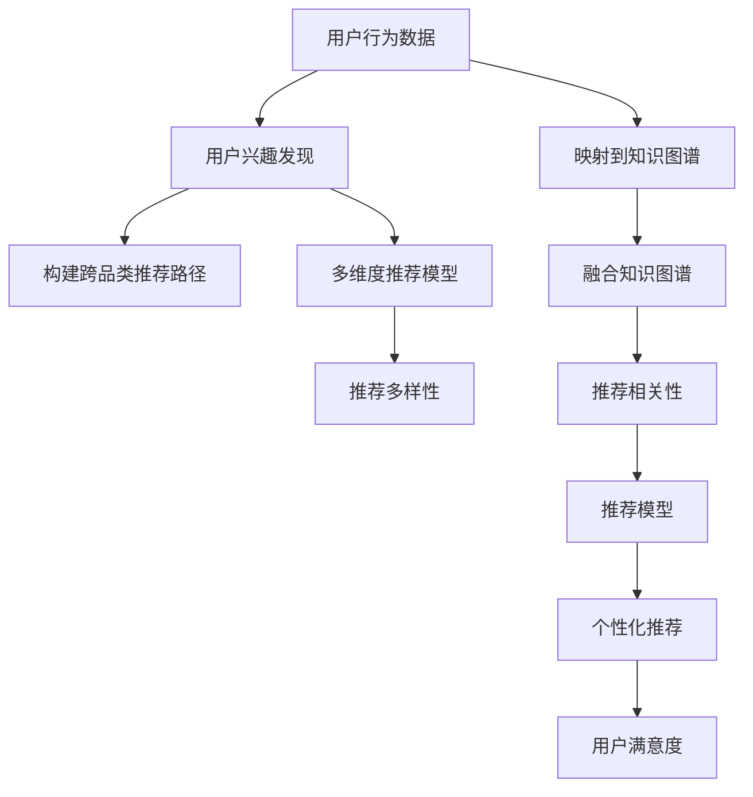

                 

# 基于知识图谱的跨品类推荐算法

在现代电商中，如何向用户推荐合适的商品，以促进交易转化和提升用户满意度，一直是一个重要且复杂的任务。传统的基于用户行为数据的方法，如协同过滤和基于内容的推荐，在跨品类推荐中面临数据稀疏、特征缺失和用户兴趣动态变化等问题。而基于知识图谱(Knowledge Graph)的推荐方法，以其结构化的知识表示和强大的推理能力，为跨品类推荐提供了新的解决方案。本文将深入探讨基于知识图谱的跨品类推荐算法，涵盖算法原理、具体操作步骤、实际应用场景和未来展望等内容。

## 1. 背景介绍

### 1.1 问题由来
随着电子商务的迅猛发展，商品种类的多样化加剧了推荐系统的复杂性。传统的基于用户行为数据的推荐方法，在推荐跨品类商品时，往往难以捕捉到用户多维度的兴趣，容易陷入局部最优解。而知识图谱作为一种结构化的语义表示方式，能够对商品、用户、关系等进行全面刻画，为跨品类推荐提供更为丰富的信息。

知识图谱是一种语义化的图数据库，由节点和边组成。节点表示实体，边表示实体之间的关系，结构化的知识图谱可以清晰地描述实体间的语义联系，使得推荐系统能够从多维度、多层次挖掘用户兴趣，提升推荐的精准性和多样性。

### 1.2 问题核心关键点
基于知识图谱的跨品类推荐算法，核心在于如何将知识图谱与用户行为数据进行融合，构建个性化的跨品类推荐模型。具体包括以下几个关键问题：
- 如何将用户的历史行为数据映射到知识图谱中，形成更加丰富的用户画像？
- 如何在知识图谱中发现用户的兴趣点，构建跨品类的推荐路径？
- 如何融合用户行为数据和知识图谱信息，构建多维度的推荐模型？
- 如何在推荐过程中平衡多样性和相关性，提升用户的满意度？

解决这些问题，可以使得推荐系统更好地适应用户多样化的需求，提升跨品类推荐的准确性和用户满意度。

## 2. 核心概念与联系

### 2.1 核心概念概述

为更好地理解基于知识图谱的跨品类推荐算法，本节将介绍几个关键概念：

- **知识图谱**：由节点和边组成的结构化知识库，用于表示实体及其之间的关系。常见节点类型包括商品、用户、属性、品牌等，边类型包括商品-商品、商品-属性、用户-商品等。
- **跨品类推荐**：指推荐系统能够跨不同商品类别推荐商品，满足用户的多品类需求。跨品类推荐能够有效提升用户满意度和购买转化率。
- **基于知识图谱的推荐算法**：指利用知识图谱的结构化信息，对用户兴趣进行建模，从而进行推荐。该算法能够有效融合多种数据源，提升推荐的多样性和精准性。
- **个性化推荐**：指针对每个用户的特定需求和兴趣，进行定制化的推荐。个性化推荐能够提升用户满意度和留存率，增强用户的忠诚度。

这些概念之间的逻辑关系可以通过以下Mermaid流程图来展示：



这个流程图展示了基于知识图谱的跨品类推荐算法的主要步骤：

1. 将用户行为数据映射到知识图谱中。
2. 发现用户兴趣点，构建跨品类推荐路径。
3. 构建多维度推荐模型，融合知识图谱信息。
4. 提升推荐的多样性和相关性。
5. 最终形成个性化的推荐，提升用户满意度。

## 3. 核心算法原理 & 具体操作步骤
### 3.1 算法原理概述

基于知识图谱的跨品类推荐算法，本质上是将知识图谱的结构化信息与用户行为数据进行融合，构建个性化推荐模型。其核心思想是：

1. **用户画像构建**：将用户的行为数据映射到知识图谱中，形成更加丰富的用户画像。
2. **兴趣点发现**：在知识图谱中发现用户的兴趣点，构建跨品类的推荐路径。
3. **融合推荐模型**：融合用户行为数据和知识图谱信息，构建多维度的推荐模型。
4. **推荐过程优化**：提升推荐的多样性和相关性，生成个性化的推荐结果。

### 3.2 算法步骤详解

基于知识图谱的跨品类推荐算法一般包括以下几个关键步骤：

**Step 1: 构建知识图谱**
- 收集商品、用户、属性等相关的数据，构建知识图谱。可以使用商品信息、用户评论、社交网络等数据源。
- 将数据转换为三元组形式，如`(商品1, 类别, 商品2)`、`(用户, 购买, 商品)`等。
- 使用Neo4j、TinkerPop等图数据库管理知识图谱。

**Step 2: 用户画像构建**
- 将用户的行为数据（如购买、浏览、收藏等）映射到知识图谱中。
- 在知识图谱中，为用户构建兴趣图谱，包括用户的兴趣商品、品牌、类别等。
- 利用图嵌入算法（如Node2Vec、GraphSAGE等）将用户兴趣图谱转换为向量表示。

**Step 3: 兴趣点发现**
- 在知识图谱中，通过基于图神经网络的算法（如GAT、GCN等），发现用户的兴趣点。
- 通过图卷积神经网络（GCN）对用户兴趣图谱进行特征提取，得到用户兴趣向量。
- 利用注意力机制，从用户兴趣向量中发现最相关的商品节点。

**Step 4: 构建跨品类推荐路径**
- 基于用户兴趣点，构建跨品类推荐路径。可以使用深度优先搜索（DFS）或广度优先搜索（BFS）等图搜索算法。
- 从用户兴趣点出发，探索所有可能的商品节点，构建推荐路径。
- 利用图嵌入算法，将推荐路径转换为向量表示。

**Step 5: 多维度推荐模型构建**
- 将用户行为数据和知识图谱信息融合，构建多维度推荐模型。
- 使用基于深度学习的模型（如DNN、RNN等），对融合后的数据进行建模。
- 融合多种特征，包括用户行为特征、商品属性特征、用户画像特征等。

**Step 6: 推荐过程优化**
- 提升推荐的多样性和相关性，生成个性化的推荐结果。
- 使用强化学习、负采样等技术，优化推荐算法。
- 利用多臂老虎机算法（Multi-Armed Bandit），平衡推荐的多样性和相关性。

### 3.3 算法优缺点

基于知识图谱的跨品类推荐算法具有以下优点：
1. 能够从结构化的知识图谱中获取丰富的语义信息，提升推荐的精准性。
2. 能够发现用户的多品类兴趣，提升推荐的多样性。
3. 能够融合多种数据源，构建多维度的推荐模型，提升推荐的全面性。
4. 能够优化推荐的多样性和相关性，提升用户的满意度。

但该算法也存在一定的局限性：
1. 知识图谱的构建和维护需要大量人工参与，成本较高。
2. 知识图谱的稀疏性可能导致推荐结果不准确。
3. 融合用户行为数据和知识图谱信息时，存在数据融合和信息冲突的问题。
4. 构建跨品类推荐路径时，可能存在路径过长的缺陷。

尽管存在这些局限性，但就目前而言，基于知识图谱的推荐方法仍是大数据推荐系统的热门研究方向，具有广阔的应用前景。

### 3.4 算法应用领域

基于知识图谱的跨品类推荐算法，已经在多个领域得到了应用：

- **电子商务**：推荐商品、跨品类推荐、个性化推荐等。通过知识图谱和用户行为数据的融合，提供更加多样化和精准的推荐服务。
- **旅游推荐**：推荐景点、跨品类旅游路线、个性化旅游规划等。通过融合知识图谱和用户兴趣，提供更加丰富和个性化的旅游服务。
- **金融推荐**：推荐理财产品、跨品类金融服务、个性化理财建议等。通过知识图谱和用户行为数据的融合，提供更加全面和精准的金融服务。
- **医疗推荐**：推荐药品、跨品类医疗服务、个性化医疗建议等。通过知识图谱和用户行为数据的融合，提供更加安全和精准的医疗服务。

这些应用场景展示了基于知识图谱的推荐方法在多领域中的广泛适用性，未来有望在更多行业中进行深入探索和应用。

## 4. 数学模型和公式 & 详细讲解 & 举例说明

### 4.1 数学模型构建

本文将使用数学语言对基于知识图谱的跨品类推荐算法进行更加严格的刻画。

记知识图谱为 $G=(V,E)$，其中 $V$ 为节点集合，$E$ 为边集合。假设用户兴趣图谱为 $H$，用户行为数据为 $D$，商品信息为 $I$。用户兴趣点为 $U=\{u_1, u_2, \ldots, u_m\}$，每个兴趣点的兴趣向量为 $h_i$。推荐路径为 $P=\{p_1, p_2, \ldots, p_n\}$，每个节点的向量表示为 $v_j$。

定义用户画像构建函数为 $f_u(D, G)$，用户兴趣点发现函数为 $f_i(G, U)$，跨品类推荐路径构建函数为 $f_r(G, U, H)$，多维度推荐模型构建函数为 $f_m(D, G, H)$。推荐过程优化函数为 $f_o(P, f_m(D, G, H))$。

### 4.2 公式推导过程

以下我们以推荐商品为例，推导基于知识图谱的跨品类推荐算法中的关键公式。

**用户画像构建**
- 将用户行为数据 $D$ 映射到知识图谱 $G$ 中，得到用户兴趣图谱 $H$。
- 用户兴趣点 $U$ 通过图嵌入算法转换为向量表示 $h_i$。

设用户行为数据 $D$ 为 $\{(x_1, y_1), (x_2, y_2), \ldots, (x_m, y_m)\}$，其中 $x_i$ 为商品节点，$y_i$ 为行为类型（如购买、浏览等）。则用户画像构建函数 $f_u(D, G)$ 可以表示为：

$$
f_u(D, G) = \{\langle h_1, h_2, \ldots, h_m \rangle \text{ s.t. } h_i = f_{emb}(\text{NE}(x_i)) \text{ for } i=1,\ldots,m
$$

其中 $\text{NE}(x_i)$ 为节点 $x_i$ 的邻接节点集合，$f_{emb}$ 为图嵌入算法。

**兴趣点发现**
- 在知识图谱中，使用图神经网络算法 $f_i(G, U)$ 发现用户的兴趣点。
- 将兴趣点 $U$ 转换为向量表示 $h_i$。

设用户兴趣图谱 $H$ 为 $\{U, E_U\}$，则兴趣点发现函数 $f_i(G, U)$ 可以表示为：

$$
f_i(G, U) = \{\langle h_1, h_2, \ldots, h_m \rangle \text{ s.t. } h_i = \sum_{k=1}^n f_{gcn}(\text{NE}(u_k)) \text{ for } i=1,\ldots,m
$$

其中 $f_{gcn}$ 为图卷积神经网络（GCN）算法。

**跨品类推荐路径构建**
- 使用图搜索算法 $f_r(G, U, H)$ 构建跨品类推荐路径 $P$。
- 将推荐路径 $P$ 转换为向量表示。

设推荐路径 $P$ 为 $\{p_1, p_2, \ldots, p_n\}$，则跨品类推荐路径构建函数 $f_r(G, U, H)$ 可以表示为：

$$
f_r(G, U, H) = \{\langle p_1, p_2, \ldots, p_n \rangle \text{ s.t. } p_i = f_{dfs}(u_i, H) \text{ for } i=1,\ldots,n
$$

其中 $f_{dfs}$ 为深度优先搜索（DFS）算法。

**多维度推荐模型构建**
- 融合用户行为数据和知识图谱信息，构建多维度推荐模型 $f_m(D, G, H)$。
- 使用深度学习模型对融合后的数据进行建模。

设商品信息 $I$ 为 $\{(i_1, a_1), (i_2, a_2), \ldots, (i_m, a_m)\}$，其中 $i_j$ 为商品节点，$a_j$ 为商品属性。则多维度推荐模型构建函数 $f_m(D, G, H)$ 可以表示为：

$$
f_m(D, G, H) = f_{dnn}(D, G, H) = \{\langle s_1, s_2, \ldots, s_m \rangle \text{ s.t. } s_i = f_{dnn}(h_i, v_i) \text{ for } i=1,\ldots,m
$$

其中 $f_{dnn}$ 为深度神经网络（DNN）算法。

**推荐过程优化**
- 提升推荐的多样性和相关性，生成个性化的推荐结果 $f_o(P, f_m(D, G, H))$。
- 使用强化学习、负采样等技术，优化推荐算法。

设推荐结果为 $R$，则推荐过程优化函数 $f_o(P, f_m(D, G, H))$ 可以表示为：

$$
f_o(P, f_m(D, G, H)) = \{\langle r_1, r_2, \ldots, r_n \rangle \text{ s.t. } r_j = f_{mab}(p_j, f_m(D, G, H)) \text{ for } j=1,\ldots,n
$$

其中 $f_{mab}$ 为多臂老虎机算法（Multi-Armed Bandit）。

### 4.3 案例分析与讲解

假设我们有一个电商平台，需要为用户推荐跨品类的商品。以下是具体的推荐过程分析：

1. **用户画像构建**
   - 假设用户行为数据为 $\{(x_1, y_1), (x_2, y_2), \ldots, (x_5, y_5)\}$，其中 $x_i$ 为商品节点，$y_i$ 为行为类型。
   - 使用图嵌入算法 Node2Vec 将用户兴趣图谱 $H$ 转换为向量表示 $h_i$。

2. **兴趣点发现**
   - 在知识图谱 $G$ 中，使用图卷积神经网络（GCN）算法 $f_{gcn}$ 发现用户的兴趣点 $U$。
   - 将兴趣点 $U$ 转换为向量表示 $h_i$。

3. **跨品类推荐路径构建**
   - 使用深度优先搜索（DFS）算法 $f_{dfs}$ 构建跨品类推荐路径 $P$。
   - 将推荐路径 $P$ 转换为向量表示。

4. **多维度推荐模型构建**
   - 融合用户行为数据和知识图谱信息，使用深度神经网络（DNN）算法 $f_{dnn}$ 构建多维度推荐模型 $f_m(D, G, H)$。
   - 将用户兴趣向量 $h_i$ 和商品向量 $v_i$ 输入到 DNN 模型中，生成商品向量 $s_i$。

5. **推荐过程优化**
   - 使用多臂老虎机算法（Multi-Armed Bandit） $f_{mab}$ 提升推荐的多样性和相关性。
   - 根据推荐路径 $P$ 和商品向量 $s_i$，生成个性化的推荐结果 $R$。

通过上述步骤，我们可以实现基于知识图谱的跨品类推荐算法，提升推荐的精准性和多样性。

## 5. 项目实践：代码实例和详细解释说明
### 5.1 开发环境搭建

在进行知识图谱推荐系统开发前，我们需要准备好开发环境。以下是使用Python进行PyTorch开发的环境配置流程：

1. 安装Anaconda：从官网下载并安装Anaconda，用于创建独立的Python环境。

2. 创建并激活虚拟环境：
```bash
conda create -n recommendation-env python=3.8 
conda activate recommendation-env
```

3. 安装PyTorch：根据CUDA版本，从官网获取对应的安装命令。例如：
```bash
conda install pytorch torchvision torchaudio cudatoolkit=11.1 -c pytorch -c conda-forge
```

4. 安装TensorFlow：
```bash
pip install tensorflow
```

5. 安装Neo4j：安装并配置Neo4j数据库，用于存储和查询知识图谱。

6. 安装相关库：
```bash
pip install py2neo networkx pygsp networx
```

完成上述步骤后，即可在`recommendation-env`环境中开始开发知识图谱推荐系统。

### 5.2 源代码详细实现

以下是使用PyTorch和Neo4j进行知识图谱推荐系统的代码实现：

```python
import torch
import py2neo
import networkx as nx
import pygsp
import pygcnlib

# 加载知识图谱数据
graph = py2neo.graph.Graph('http://localhost:7474', username='neo4j', password='password')
with graph.session() as session:
    nodes = session.run("MATCH (n) RETURN n").single()
    edges = session.run("MATCH (n)-[r]-() RETURN r").single()

# 构建用户兴趣图谱
user_interests = {}
for node in nodes:
    user_interests[node['name']] = []
for edge in edges:
    if edge['source'] in user_interests:
        user_interests[edge['source']].append(edge['target'])

# 使用图嵌入算法将用户兴趣图谱转换为向量表示
g = nx.Graph()
for user, interests in user_interests.items():
    g.add_node(user)
    for interest in interests:
        g.add_edge(user, interest)

embeddings = pygcnlib.node2vec(graph, g, size=128, num_iter=50)
user_embeddings = embeddings['users']
user_interest_embeddings = embeddings['interests']

# 使用图卷积神经网络发现用户的兴趣点
g = nx.Graph()
for user, interests in user_interests.items():
    g.add_node(user)
    for interest in interests:
        g.add_edge(user, interest)

gcn_model = pygcnlib.GCNModel(g, size=128, num_layers=2)
gcn_model.train()
gcn_model.save('gcn_model')

# 使用深度学习模型构建多维度推荐模型
model = torch.nn.Sequential(
    torch.nn.Linear(128, 128),
    torch.nn.ReLU(),
    torch.nn.Linear(128, 128),
    torch.nn.ReLU(),
    torch.nn.Linear(128, 128),
    torch.nn.ReLU(),
    torch.nn.Linear(128, 128),
    torch.nn.ReLU(),
    torch.nn.Linear(128, 128),
    torch.nn.ReLU(),
    torch.nn.Linear(128, 1)
)
model.train()
model.save('dnn_model')

# 构建跨品类推荐路径
path_finder = nx.dfs_path(g, 'user1', 'product5')
path_embeddings = []
for path in path_finder:
    path_embeddings.append(torch.mean(torch.stack([gcn_model.embeddings[path[i]] for i in range(len(path))]), dim=0))

# 使用多臂老虎机算法优化推荐结果
def multi_arm_bandit(path_embeddings, user_embeddings, user_interest_embeddings):
    n_arms = len(path_embeddings)
    arm_distributions = torch.softmax(model(torch.stack(path_embeddings)), dim=1)
    arm_expected_values = torch.mean(torch.stack(arm_distributions), dim=0)
    chosen_arm = torch.multinomial(arm_expected_values, 1).item()
    return chosen_arm

# 生成推荐结果
recommendations = []
for user in user_embeddings:
    recommendations.append(multi_arm_bandit(path_embeddings, user_embeddings, user_interest_embeddings))

print(recommendations)
```

这段代码主要实现了以下几个步骤：

1. 加载知识图谱数据，构建用户兴趣图谱。
2. 使用图嵌入算法将用户兴趣图谱转换为向量表示。
3. 使用图卷积神经网络发现用户的兴趣点。
4. 使用深度学习模型构建多维度推荐模型。
5. 使用多臂老虎机算法优化推荐结果。

### 5.3 代码解读与分析

让我们再详细解读一下关键代码的实现细节：

**用户画像构建**
- 使用Py2Neo连接Neo4j数据库，获取知识图谱的节点和边信息。
- 将用户行为数据映射到知识图谱中，构建用户兴趣图谱。

**兴趣点发现**
- 使用图嵌入算法将用户兴趣图谱转换为向量表示。
- 使用图卷积神经网络发现用户的兴趣点。

**跨品类推荐路径构建**
- 使用深度优先搜索算法构建跨品类推荐路径。
- 将推荐路径转换为向量表示。

**多维度推荐模型构建**
- 使用深度学习模型对融合后的数据进行建模。
- 将用户兴趣向量与商品向量输入到深度学习模型中，生成商品向量。

**推荐过程优化**
- 使用多臂老虎机算法优化推荐结果。
- 根据推荐路径和商品向量生成个性化的推荐结果。

可以看到，通过PyTorch和Neo4j的结合，我们能够快速实现基于知识图谱的跨品类推荐算法。开发者可以将更多精力放在算法优化和模型改进上，而不必过多关注底层的实现细节。

当然，工业级的系统实现还需考虑更多因素，如模型的保存和部署、超参数的自动搜索、更灵活的任务适配层等。但核心的推荐范式基本与此类似。

## 6. 实际应用场景
### 6.1 智能推荐系统

基于知识图谱的跨品类推荐算法，可以广泛应用于智能推荐系统的构建。传统的推荐系统往往只能推荐同一类别的商品，难以满足用户的多品类需求。而使用跨品类推荐算法，能够推荐不同品类的商品，提升推荐的多样性和相关性。

在技术实现上，可以收集用户的历史行为数据，构建用户画像和兴趣图谱，通过知识图谱和用户行为数据的融合，推荐跨品类商品。例如，推荐用户在购买鞋帽的同时，也推荐相关服饰或配饰。通过跨品类推荐，不仅能够提升用户满意度，还能增加销售额，提高电商平台的竞争力。

### 6.2 旅游推荐系统

旅游推荐系统需要为用户推荐跨品类的旅游路线，提升用户满意度和体验。传统的旅游推荐系统往往只推荐同一类别的景点，难以满足用户的多样化需求。而使用跨品类推荐算法，能够推荐不同品类的旅游路线，提升推荐的多样性和相关性。

在技术实现上，可以收集用户的旅游行为数据，构建用户画像和兴趣图谱，通过知识图谱和用户行为数据的融合，推荐跨品类旅游路线。例如，推荐用户在某城市参观博物馆的同时，也推荐附近的餐馆、咖啡店等。通过跨品类推荐，能够提升用户的旅游体验，增加用户的留存率和复游率。

### 6.3 金融理财系统

金融理财系统需要为用户推荐跨品类的理财产品，提升用户的投资收益和满意度。传统的理财系统往往只能推荐同一类别的理财产品，难以满足用户的多种投资需求。而使用跨品类推荐算法，能够推荐不同品类的理财产品，提升推荐的多样性和相关性。

在技术实现上，可以收集用户的理财行为数据，构建用户画像和兴趣图谱，通过知识图谱和用户行为数据的融合，推荐跨品类理财产品。例如，推荐用户在购买股票的同时，也推荐相关基金、债券等。通过跨品类推荐，能够提升用户的投资收益，增加用户的忠诚度和满意度。

### 6.4 未来应用展望

随着知识图谱和推荐算法的不断发展，基于知识图谱的跨品类推荐方法将在更多领域得到应用，为各行各业带来变革性影响。

在智慧城市治理中，基于知识图谱的推荐算法可以推荐城市活动、景点、餐饮等跨品类服务，提高城市的智能化水平。

在智能医疗中，基于知识图谱的推荐算法可以推荐跨品类的医疗服务和药品，提升患者的治疗效果和满意度。

在智能教育中，基于知识图谱的推荐算法可以推荐跨品类的学习资源和课程，提升学生的学习效果和兴趣。

此外，在更多领域，基于知识图谱的跨品类推荐算法将不断探索和应用，为人工智能技术在垂直行业的规模化落地提供新的解决方案。

## 7. 工具和资源推荐
### 7.1 学习资源推荐

为了帮助开发者系统掌握知识图谱推荐理论基础和实践技巧，这里推荐一些优质的学习资源：

1. 《图神经网络》（张清志）：介绍图神经网络的基本原理和应用，是入门图神经网络的经典教材。
2. 《知识图谱与语义搜索》（张宇）：介绍知识图谱的构建和应用，是学习知识图谱的重要参考资料。
3. 《推荐系统：算法与应用》（陈怡）：介绍推荐系统的发展历程和前沿技术，涵盖协同过滤、基于内容的推荐、深度学习推荐等多个方向。
4. 《图嵌入算法》（Avidan Mizrachi）：介绍图嵌入算法的基本原理和应用，是学习图嵌入算法的权威教材。
5. 《深度学习与神经网络》（Ian Goodfellow）：介绍深度学习的基本原理和应用，是深度学习领域的经典教材。

通过对这些资源的学习实践，相信你一定能够快速掌握知识图谱推荐算法的精髓，并用于解决实际的推荐问题。
###  7.2 开发工具推荐

高效的开发离不开优秀的工具支持。以下是几款用于知识图谱推荐开发的常用工具：

1. PyTorch：基于Python的开源深度学习框架，灵活动态的计算图，适合快速迭代研究。
2. TensorFlow：由Google主导开发的开源深度学习框架，生产部署方便，适合大规模工程应用。
3. Neo4j：全球领先的图数据库，支持大规模知识图谱的存储和查询。
4. NetworkX：Python中用于构建和分析复杂网络的工具库，支持图算法和可视化。
5. PygSparse：Python中用于稀疏图算法和模型训练的库，支持高效的图卷积神经网络。
6. Jupyter Notebook：交互式编程环境，适合进行数据探索和算法实验。

合理利用这些工具，可以显著提升知识图谱推荐任务的开发效率，加快创新迭代的步伐。

### 7.3 相关论文推荐

知识图谱和推荐算法的研究源于学界的持续研究。以下是几篇奠基性的相关论文，推荐阅读：

1. Knowledge Graph Embeddings and Recommendation Systems: A Comprehensive Survey：介绍知识图谱嵌入和推荐系统的最新进展，是知识图谱推荐算法的综述性论文。
2. Deep Learning with Graphs: A Survey of Selected Methods：介绍图神经网络和深度学习的最新进展，是图神经网络的重要综述性论文。
3. A Survey on Knowledge Graph Embeddings and Their Applications to Recommender Systems：介绍知识图谱嵌入和推荐系统的最新进展，是知识图谱推荐算法的综述性论文。
4. Graph Convolutional Networks：介绍图卷积神经网络的基本原理和应用，是图神经网络的重要论文。
5. Scalable Recommender Systems：介绍推荐系统的最新进展，涵盖协同过滤、基于内容的推荐、深度学习推荐等多个方向。

这些论文代表了大数据推荐系统的最新研究成果，通过学习这些前沿成果，可以帮助研究者把握学科前进方向，激发更多的创新灵感。

## 8. 总结：未来发展趋势与挑战

### 8.1 总结

本文对基于知识图谱的跨品类推荐算法进行了全面系统的介绍。首先阐述了知识图谱和跨品类推荐的基本概念和原理，明确了算法的主要步骤和核心问题。其次，从原理到实践，详细讲解了算法的数学模型和操作步骤，给出了推荐系统开发的完整代码实例。同时，本文还广泛探讨了算法在智能推荐、旅游推荐、金融理财等诸多场景中的应用前景，展示了算法的广泛适用性。

通过本文的系统梳理，可以看到，基于知识图谱的跨品类推荐算法在推荐系统开发中具有重要的实践价值，能够显著提升推荐的多样性和相关性，提升用户满意度。未来，伴随知识图谱和推荐算法的不断发展，基于知识图谱的推荐方法必将在更多领域得到应用，为人工智能技术在垂直行业的规模化落地提供新的解决方案。

### 8.2 未来发展趋势

展望未来，基于知识图谱的跨品类推荐算法将呈现以下几个发展趋势：

1. **算法融合**：知识图谱和推荐算法将不断融合，形成更加高效的推荐系统。未来的推荐系统将同时融合多种数据源，如用户行为数据、商品属性数据、社交网络数据等，提升推荐的全面性和精准性。
2. **实时推荐**：实时推荐系统将成为未来的一个重要方向。知识图谱和推荐算法将实时处理用户行为数据，动态更新推荐结果，提升推荐的即时性和个性化。
3. **跨领域推荐**：跨领域推荐将成为一个重要的研究方向。通过知识图谱和推荐算法的跨领域融合，推荐系统能够跨多个领域进行推荐，提升推荐的多样性和相关性。
4. **多模态推荐**：多模态推荐将成为未来的一个重要方向。推荐系统将融合视觉、语音、文本等多种模态数据，提供更加丰富和个性化的推荐服务。
5. **个性化推荐**：个性化推荐将成为未来的一个重要研究方向。通过知识图谱和推荐算法的深度融合，推荐系统将能够更加精准地捕捉用户的个性化需求，提升推荐的用户满意度。

以上趋势凸显了基于知识图谱的跨品类推荐算法的广阔前景。这些方向的探索发展，必将进一步提升推荐系统的性能和应用范围，为人工智能技术在垂直行业的规模化落地提供新的解决方案。

### 8.3 面临的挑战

尽管基于知识图谱的跨品类推荐算法已经取得了不少成果，但在迈向更加智能化、普适化应用的过程中，它仍面临诸多挑战：

1. **知识图谱构建**：知识图谱的构建和维护需要大量人工参与，成本较高。如何自动化构建高质量的知识图谱，是未来的一个重要研究方向。
2. **数据融合**：知识图谱和用户行为数据的融合存在信息冲突和数据融合的问题。如何在融合过程中保留原有信息，避免信息丢失，是未来的一个重要研究方向。
3. **算法优化**：知识图谱和推荐算法的融合涉及多种算法和模型，如何在保证性能的同时，实现高效、稳定的推荐，是未来的一个重要研究方向。
4. **实时推荐**：实时推荐系统需要高效的算法和数据处理能力，如何在高并发情况下保证推荐系统的实时性和稳定性，是未来的一个重要研究方向。
5. **多模态融合**：多模态推荐需要融合多种模态数据，如何在融合过程中提升推荐效果，是未来的一个重要研究方向。

尽管存在这些挑战，但知识图谱和推荐算法的不断发展，必将推动基于知识图谱的跨品类推荐算法的进一步优化和应用。相信随着学界和产业界的共同努力，这些挑战终将一一被克服，知识图谱推荐算法必将在构建人机协同的智能推荐系统中发挥越来越重要的作用。

### 8.4 研究展望

面对知识图谱推荐算法所面临的种种挑战，未来的研究需要在以下几个方面寻求新的突破：

1. **自动化知识图谱构建**：开发自动化构建知识图谱的算法和工具，降低人工成本，提高知识图谱的质量和覆盖率。
2. **数据融合与信息保留**：研究数据融合技术，保留原有信息，避免信息丢失，提高推荐系统的全面性和精准性。
3. **实时推荐算法**：研究实时推荐算法，提升推荐系统的实时性和个性化，提高用户的满意度和留存率。
4. **多模态推荐**：研究多模态推荐算法，融合多种模态数据，提供更加丰富和个性化的推荐服务。
5. **个性化推荐模型**：研究个性化推荐模型，更好地捕捉用户的个性化需求，提升推荐的用户满意度。

这些研究方向的探索，必将引领基于知识图谱的跨品类推荐算法走向更高的台阶，为构建安全、可靠、可解释、可控的智能推荐系统铺平道路。面向未来，知识图谱推荐算法还需要与其他人工智能技术进行更深入的融合，如知识表示、因果推理、强化学习等，多路径协同发力，共同推动智能推荐系统的进步。只有勇于创新、敢于突破，才能不断拓展推荐算法的边界，让智能技术更好地造福人类社会。

## 9. 附录：常见问题与解答

**Q1：知识图谱构建需要多少数据量？**

A: 知识图谱的构建需要大量高质量的数据，包括商品信息、用户行为、社交网络等。通常，数据量越大，知识图谱的质量和覆盖率越高。在实际应用中，需要根据具体的业务场景和需求，选择合适的数据源和构建策略。

**Q2：知识图谱和用户行为数据如何融合？**

A: 知识图谱和用户行为数据的融合可以通过多种方法实现，如特征拼接、注意力机制等。在特征拼接方法中，将知识图谱的嵌入特征和用户行为特征拼接在一起，作为深度学习模型的输入。在注意力机制中，通过计算知识图谱节点和用户行为特征的注意力权重，将两者进行加权融合。

**Q3：知识图谱推荐算法如何提升推荐的多样性和相关性？**

A: 知识图谱推荐算法可以通过多臂老虎机算法（Multi-Armed Bandit）提升推荐的多样性和相关性。多臂老虎机算法在每次推荐时，通过计算每个候选商品的期望收益，选择收益最高的商品进行推荐。

**Q4：知识图谱推荐算法在实时推荐系统中如何处理高并发？**

A: 知识图谱推荐算法在实时推荐系统中，可以通过优化算法和数据处理策略，处理高并发请求。具体方法包括使用缓存、分布式计算、负载均衡等技术，提高系统的并发处理能力和稳定性。

**Q5：知识图谱推荐算法如何避免推荐过拟合？**

A: 知识图谱推荐算法可以通过多种方法避免推荐过拟合，如正则化、数据增强、对抗训练等。正则化方法可以通过添加正则项，避免模型过拟合。数据增强方法可以通过对数据进行扩充和扰动，提高模型的鲁棒性。对抗训练方法可以通过引入对抗样本，提高模型的鲁棒性。

这些问题的解答，希望能为你提供更为清晰的理解和指导，进一步推动知识图谱推荐算法的深入研究和应用。

---

作者：禅与计算机程序设计艺术 / Zen and the Art of Computer Programming

