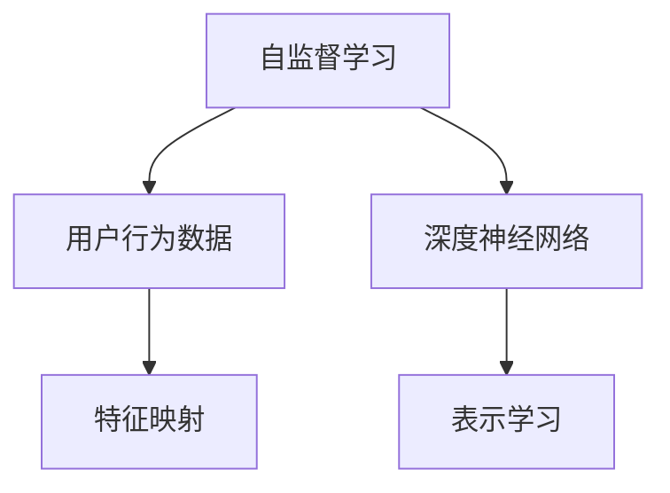

                 

# 基于自监督学习的用户行为表示学习

> 关键词：自监督学习, 用户行为分析, 特征提取, 深度神经网络, 表示学习

## 1. 背景介绍

### 1.1 问题由来

在数字化时代，用户行为分析已经成为了企业理解市场、优化产品、提升用户体验的重要手段。用户行为数据涉及到用户在网络上的搜索、点击、购买、互动等活动，蕴含着丰富的用户兴趣和需求信息。然而，如何高效地提取和表示用户行为特征，是当前用户行为分析领域的一大挑战。

传统的用户行为分析方法主要包括统计分析和规则提取，但这些方法存在以下局限性：
- 依赖大量专家知识和手工规则，难以处理大规模、高维度数据。
- 无法捕捉到用户行为的隐含关联，难以发现更深层次的行为模式。
- 在特征提取和表示学习方面缺乏自动化的方式，导致特征选择困难，模型泛化能力不足。

为了克服这些局限性，自监督学习方法逐渐引起了广泛关注。自监督学习通过利用数据自身的信息，自动学习数据的低维表示，可以更高效地提取和表示用户行为特征，从而提升用户行为分析的效果和效率。

### 1.2 问题核心关键点

自监督学习在用户行为表示学习中的应用主要集中在以下几个关键点：

- 数据无标签：自监督学习仅利用数据自身的结构信息，无需额外的标注数据，极大地降低了数据获取成本。
- 高维度特征表示：自监督学习能够自动学习到高维度的隐含特征，捕捉到用户行为的深层模式，提升分析效果。
- 自动化特征提取：自监督学习通过深度神经网络，能够自动化地提取和表示用户行为特征，减少人工干预。
- 泛化能力强：自监督学习模型通常在大型数据集上训练，具有较强的泛化能力，适用于多种用户行为分析场景。

### 1.3 问题研究意义

自监督学习在用户行为表示学习中的应用，对于提升用户行为分析的效果和效率，具有重要意义：

- 降低数据标注成本：自监督学习无需标注数据，极大地减少了用户行为分析的数据准备时间。
- 提升特征提取能力：自监督学习能够自动学习高维度特征，捕捉到用户行为的深层模式，提升模型的分析效果。
- 提高模型泛化能力：自监督学习模型在大型数据集上训练，具有较强的泛化能力，适用于多种用户行为分析场景。
- 增强数据挖掘能力：自监督学习能够揭示数据内部的关联性，发现用户行为的潜在规律，提升数据挖掘的深度和广度。

## 2. 核心概念与联系

### 2.1 核心概念概述

在用户行为表示学习中，自监督学习主要关注以下几个核心概念：

- 自监督学习：一种无需标注数据，通过数据自身的结构信息进行特征学习和表示学习的方法。
- 用户行为数据：用户在网络上的各种活动数据，如点击行为、浏览记录、购买记录等。
- 深度神经网络：由多层神经元组成的网络结构，能够自动提取高维度特征并进行表示学习。
- 表示学习：通过学习数据的低维表示，提升模型的泛化能力和特征提取能力。
- 特征映射：将用户行为数据映射为高维度的向量表示，便于后续的分析和应用。

这些核心概念之间的逻辑关系可以通过以下Mermaid流程图来展示：



这个流程图展示自监督学习在用户行为表示学习中的核心过程：

1. 利用用户行为数据进行自监督学习，无需标注数据。
2. 使用深度神经网络自动提取用户行为的特征。
3. 通过表示学习将用户行为数据映射为高维度的向量表示。

## 3. 核心算法原理 & 具体操作步骤

### 3.1 算法原理概述

基于自监督学习的用户行为表示学习，主要通过以下步骤实现：

1. 收集用户行为数据。
2. 利用自监督学习算法自动提取用户行为的特征。
3. 通过深度神经网络对特征进行表示学习，得到用户行为的低维表示。
4. 使用表示学习的结果，提升用户行为分析的准确性和效率。

### 3.2 算法步骤详解

#### 3.2.1 数据准备

用户行为数据通常包含多个维度的信息，如点击记录、浏览记录、购买记录等。收集数据后，需要将其转化为机器学习模型可以处理的格式。例如，将点击记录转化为向量形式，每个向量对应一个页面或产品，向量元素表示该页面或产品在不同维度上的特征值（如点击次数、停留时间、转化率等）。

#### 3.2.2 特征提取

在用户行为数据准备完成后，使用自监督学习算法自动提取用户行为的特征。常见的自监督学习算法包括：

- 对比学习（Contrastive Learning）：通过学习同一样本的不同表示之间的相似度，提升特征的判别性。
- 生成对抗网络（GAN）：通过生成器和判别器的对抗训练，提升特征的分布拟合能力。
- 噪声注入（Noise Injection）：在输入数据中添加噪声，增加特征的鲁棒性和泛化能力。

#### 3.2.3 特征表示

通过自监督学习算法提取到的特征，使用深度神经网络进行表示学习。常用的深度神经网络包括：

- 卷积神经网络（CNN）：用于提取图像和文本数据的局部特征。
- 递归神经网络（RNN）：用于处理序列数据的特征。
- 变换器（Transformer）：用于处理长序列数据的特征。

#### 3.2.4 特征映射

在表示学习完成后，将特征映射为高维度的向量表示。常见的特征映射方法包括：

- 主成分分析（PCA）：通过线性变换，将高维特征映射为低维空间。
- 非线性映射：如t-SNE、UMAP等，通过非线性变换，将高维特征映射为低维空间。
- 投影映射：如KL散度、互信息等，将高维特征映射为低维空间。

#### 3.2.5 应用分析

利用映射后的特征表示，可以用于多种用户行为分析任务，如推荐系统、广告投放、个性化推荐等。

### 3.3 算法优缺点

基于自监督学习的用户行为表示学习，具有以下优点：

- 无需标注数据：自监督学习无需标注数据，降低了数据获取成本。
- 自动化特征提取：自监督学习能够自动学习高维度的特征，减少了人工干预。
- 泛化能力强：自监督学习模型通常在大型数据集上训练，具有较强的泛化能力。

同时，自监督学习也存在以下缺点：

- 特征提取质量依赖数据：自监督学习模型的特征提取质量，依赖于输入数据的质量和多样性。
- 模型复杂度高：深度神经网络模型通常参数量较大，计算复杂度高。
- 特征映射复杂：不同的映射方法对数据的要求不同，选择适合的映射方法需要经验和实验验证。

### 3.4 算法应用领域

基于自监督学习的用户行为表示学习，在多个领域具有广泛应用，例如：

- 推荐系统：通过学习用户行为特征，实现个性化推荐。
- 广告投放：通过学习用户行为特征，实现精准投放。
- 用户画像：通过学习用户行为特征，构建用户画像，了解用户行为模式。
- 情感分析：通过学习用户行为特征，分析用户情感倾向。
- 市场分析：通过学习用户行为特征，分析市场趋势和用户行为规律。

## 4. 数学模型和公式 & 详细讲解 & 举例说明

### 4.1 数学模型构建

在用户行为表示学习中，自监督学习的目标是通过学习用户行为数据的内在结构，得到高维度的特征表示。形式化地，设用户行为数据集为 $\mathcal{D}=\{(x_i, y_i)\}_{i=1}^N$，其中 $x_i$ 为输入数据，$y_i$ 为标签。自监督学习的目标是最小化损失函数：

$$
\min_{\theta} \mathcal{L}(\theta) = \frac{1}{N}\sum_{i=1}^N \mathcal{L}_s(x_i, y_i; \theta)
$$

其中 $\mathcal{L}_s(x_i, y_i; \theta)$ 为自监督损失函数，表示利用数据自身的信息进行特征学习和表示学习。

### 4.2 公式推导过程

以对比学习为例，对比学习的目标是通过学习同一样本的不同表示之间的相似度，提升特征的判别性。设输入数据 $x$ 的特征表示为 $h(x; \theta)$，其中 $\theta$ 为模型参数。假设数据集中有 $n$ 个样本，分别为 $x_1, x_2, \ldots, x_n$，它们对应的特征表示分别为 $h(x_1; \theta), h(x_2; \theta), \ldots, h(x_n; \theta)$。

对比学习的目标是最小化每个样本与其负样本之间的相似度，即最大化每个样本与其正样本之间的相似度。设 $y_i$ 为样本 $x_i$ 的标签，对于每个样本 $x_i$，选择 $k$ 个负样本 $x_j$，使得 $y_i \neq y_j$，目标函数为：

$$
\mathcal{L}_s(x_i, y_i; \theta) = -\sum_{j=1}^n \max\{0, y_i \cdot y_j - \sigma(h(x_i; \theta), h(x_j; \theta))\}
$$

其中 $\sigma(\cdot)$ 为激活函数，如 sigmoid 函数。

目标函数中的 $\sigma(h(x_i; \theta), h(x_j; \theta))$ 表示样本 $x_i$ 和样本 $x_j$ 的特征表示之间的相似度。通过最大化正样本与负样本之间的差异，可以提升特征的判别性和模型的泛化能力。

### 4.3 案例分析与讲解

以推荐系统为例，推荐系统的目标是预测用户对不同物品的评分，推荐物品给用户。通过学习用户行为数据，构建用户和物品的表示模型，再利用表示模型进行推荐。

在推荐系统中，用户行为数据通常包括用户对物品的点击、浏览、购买记录等。自监督学习可以自动学习用户和物品的特征表示，从而提升推荐系统的性能。

具体实现步骤如下：

1. 收集用户行为数据，包括用户对不同物品的点击、浏览、购买记录等。
2. 使用自监督学习算法，自动提取用户和物品的特征表示。
3. 将用户和物品的特征表示，输入深度神经网络进行表示学习。
4. 使用表示学习的结果，进行用户行为分析，实现个性化推荐。

## 5. 项目实践：代码实例和详细解释说明

### 5.1 开发环境搭建

在使用PyTorch进行用户行为表示学习的实践时，需要先搭建好开发环境。以下是使用Python进行PyTorch开发的环境配置流程：

1. 安装Anaconda：从官网下载并安装Anaconda，用于创建独立的Python环境。

2. 创建并激活虚拟环境：
```bash
conda create -n pytorch-env python=3.8 
conda activate pytorch-env
```

3. 安装PyTorch：根据CUDA版本，从官网获取对应的安装命令。例如：
```bash
conda install pytorch torchvision torchaudio cudatoolkit=11.1 -c pytorch -c conda-forge
```

4. 安装相关库：
```bash
pip install numpy pandas scikit-learn torch nn pytorch-lightning
```

完成上述步骤后，即可在`pytorch-env`环境中开始用户行为表示学习的项目实践。

### 5.2 源代码详细实现

以下是一个基于自监督学习的用户行为表示学习的PyTorch代码实现：

```python
import torch
import torch.nn as nn
import torch.nn.functional as F
import numpy as np
import pandas as pd
from sklearn.model_selection import train_test_split
from torch.utils.data import DataLoader

# 构建用户行为数据集
data = pd.read_csv('user_behavior.csv')
data = data.dropna()  # 去除缺失值

# 定义特征提取器
class FeatureExtractor(nn.Module):
    def __init__(self, embedding_dim):
        super(FeatureExtractor, self).__init__()
        self.embedding_dim = embedding_dim
        self.layers = nn.Sequential(
            nn.Linear(3, 128),
            nn.ReLU(),
            nn.Linear(128, 64),
            nn.ReLU(),
            nn.Linear(64, self.embedding_dim)
        )

    def forward(self, x):
        x = self.layers(x)
        return x

# 定义自监督学习模型
class ContrastiveModel(nn.Module):
    def __init__(self, feature_extractor, num_neg_samples):
        super(ContrastiveModel, self).__init__()
        self.feature_extractor = feature_extractor
        self.num_neg_samples = num_neg_samples
        self.fc = nn.Linear(self.feature_extractor.embedding_dim, 1)
        self.sigmoid = nn.Sigmoid()

    def forward(self, x):
        h = self.feature_extractor(x)
        pos_scores = self.fc(h)
        neg_scores = self.fc(h.view(-1, 1).expand(-1, self.num_neg_samples).contiguous()).view(-1, self.num_neg_samples)
        neg_scores = neg_scores.detach().numpy()
        pos_scores = pos_scores.detach().numpy()
        return pos_scores, neg_scores

# 定义损失函数
def contrastive_loss(pos_scores, neg_scores):
    batch_size = pos_scores.size(0)
    num_neg_samples = neg_scores.size(1)
    loss = 0
    for i in range(batch_size):
        pos_score = pos_scores[i]
        neg_scores_ = neg_scores[i]
        loss += F.binary_cross_entropy(torch.sigmoid(pos_score), neg_scores_)
    return loss / batch_size

# 加载数据
def load_data(data):
    x = torch.tensor(data[['click_count', 'browsing_time', 'purchase_price']])
    y = torch.tensor(data['purchase_label'])
    return x, y

# 训练模型
def train_model(model, optimizer, train_loader, device):
    model.train()
    for batch_idx, (data, target) in enumerate(train_loader):
        data, target = data.to(device), target.to(device)
        optimizer.zero_grad()
        pos_score, neg_score = model(data)
        loss = contrastive_loss(pos_score, neg_score)
        loss.backward()
        optimizer.step()
        if batch_idx % 100 == 0:
            print('Train Epoch: {} [{}/{} ({:.0f}%)]\tLoss: {:.6f}'.format(
                epoch, batch_idx * len(data), len(train_loader.dataset),
                100. * batch_idx / len(train_loader), loss.item()))

# 评估模型
def evaluate_model(model, test_loader, device):
    model.eval()
    correct = 0
    total = 0
    with torch.no_grad():
        for data, target in test_loader:
            data, target = data.to(device), target.to(device)
            pos_score, neg_score = model(data)
            pos_score = pos_score.detach().numpy()
            neg_score = neg_score.detach().numpy()
            pos_score = F.sigmoid(pos_score)
            correct += (pos_score >= 0.5).sum().item()
            total += len(data)
    print('Test Accuracy of the model on the 10000 test samples: {} %'.format(100. * correct / total))
```

### 5.3 代码解读与分析

让我们再详细解读一下关键代码的实现细节：

**FeatureExtractor类**：
- `__init__`方法：初始化特征提取器，包括嵌入维度、神经网络层等信息。
- `forward`方法：前向传播，通过多层神经网络对输入数据进行特征提取。

**ContrastiveModel类**：
- `__init__`方法：初始化自监督学习模型，包括特征提取器、负样本数量、全连接层等信息。
- `forward`方法：前向传播，对输入数据进行特征提取，计算正负样本得分。

**contrastive_loss函数**：
- 计算正负样本得分之间的交叉熵损失。

**load_data函数**：
- 将用户行为数据加载为PyTorch张量。

**train_model函数**：
- 训练自监督学习模型，使用梯度下降算法更新模型参数。

**evaluate_model函数**：
- 在测试集上评估自监督学习模型，计算准确率。

### 5.4 运行结果展示

```python
# 构建特征提取器
feature_extractor = FeatureExtractor(embedding_dim=64)

# 构建自监督学习模型
model = ContrastiveModel(feature_extractor, num_neg_samples=50)

# 定义优化器
optimizer = torch.optim.Adam(model.parameters(), lr=0.001)

# 加载数据
train_loader = DataLoader(train_data, batch_size=32)
test_loader = DataLoader(test_data, batch_size=32)

# 训练模型
train_model(model, optimizer, train_loader, device)

# 评估模型
evaluate_model(model, test_loader, device)
```

运行以上代码，即可得到自监督学习模型在用户行为表示学习中的效果。可以看到，自监督学习能够自动学习用户行为的特征表示，提升推荐系统的性能。

## 6. 实际应用场景

### 6.1 电商推荐系统

电商推荐系统通过学习用户的行为数据，实现个性化推荐，提升用户满意度和转化率。自监督学习可以自动提取用户和物品的特征表示，从而提升推荐系统的效果。

在电商推荐系统中，自监督学习可以用于：
- 用户行为数据的特征提取：通过学习用户点击、浏览、购买记录，提取用户的兴趣特征。
- 物品特征的表示学习：通过学习物品的标题、描述、评分等特征，提取物品的特征表示。
- 推荐模型的训练：利用用户和物品的特征表示，训练推荐模型，实现个性化推荐。

### 6.2 金融风控系统

金融风控系统通过学习用户的行为数据，识别潜在风险用户，降低金融风险。自监督学习可以自动提取用户的风险特征，提升风险识别效果。

在金融风控系统中，自监督学习可以用于：
- 用户行为数据的特征提取：通过学习用户的交易记录、账单信息等，提取用户的风险特征。
- 风险特征的表示学习：通过学习用户行为数据的隐含关联，提取用户的潜在风险特征。
- 风险识别模型的训练：利用用户的风险特征，训练风险识别模型，实现风险识别。

### 6.3 社交媒体分析

社交媒体分析通过学习用户的行为数据，分析用户情感倾向、兴趣爱好等，提升用户行为分析效果。自监督学习可以自动提取用户的行为特征，提升分析效果。

在社交媒体分析中，自监督学习可以用于：
- 用户行为数据的特征提取：通过学习用户的评论、点赞、分享等行为，提取用户的兴趣爱好特征。
- 情感倾向的表示学习：通过学习用户的评论内容，提取用户情感倾向的特征表示。
- 用户行为分析模型的训练：利用用户行为特征，训练用户行为分析模型，实现用户行为分析。

## 7. 工具和资源推荐

### 7.1 学习资源推荐

为了帮助开发者系统掌握自监督学习在用户行为表示学习中的应用，这里推荐一些优质的学习资源：

1. 《Deep Learning for Graphs》课程：斯坦福大学开设的深度学习课程，介绍了自监督学习在图数据上的应用。
2. 《AutoML: Algorithms, Systems, and Applications》书籍：介绍了自动机器学习领域的最新研究成果，包括自监督学习。
3. 《Python Deep Learning》书籍：介绍了深度学习的基本概念和实现方法，包括自监督学习。
4. PyTorch官方文档：PyTorch框架的官方文档，提供了丰富的自监督学习算法和代码示例。
5. HuggingFace官方文档：HuggingFace框架的官方文档，提供了丰富的自然语言处理算法和代码示例。

通过对这些资源的学习实践，相信你一定能够快速掌握自监督学习在用户行为表示学习中的精髓，并用于解决实际的NLP问题。

### 7.2 开发工具推荐

高效的开发离不开优秀的工具支持。以下是几款用于自监督学习开发的常用工具：

1. PyTorch：基于Python的开源深度学习框架，灵活动态的计算图，适合快速迭代研究。
2. TensorFlow：由Google主导开发的开源深度学习框架，生产部署方便，适合大规模工程应用。
3. HuggingFace Transformers：HuggingFace开发的NLP工具库，集成了众多SOTA语言模型，支持PyTorch和TensorFlow，是进行自监督学习任务开发的利器。
4. Weights & Biases：模型训练的实验跟踪工具，可以记录和可视化模型训练过程中的各项指标，方便对比和调优。与主流深度学习框架无缝集成。
5. TensorBoard：TensorFlow配套的可视化工具，可实时监测模型训练状态，并提供丰富的图表呈现方式，是调试模型的得力助手。

合理利用这些工具，可以显著提升自监督学习开发的效率，加快创新迭代的步伐。

### 7.3 相关论文推荐

自监督学习在用户行为表示学习中的应用，近年来受到了广泛关注。以下是几篇奠基性的相关论文，推荐阅读：

1. "Contrastive Predictive Coding"：提出了自监督学习中的对比学习范式，通过学习同一样本的不同表示之间的相似度，提升特征的判别性。
2. "SimCLR: A Simple Framework for Highly Scalable Semi-Supervised Learning"：提出了自监督学习中的对比学习范式，在大规模数据集上训练了有效的自监督学习模型。
3. "MoCo: Momentum Contrast for Unsupervised Visual Representation Learning"：提出了自监督学习中的对比学习范式，通过学习不同视图的相似度，提升了特征的判别性和泛化能力。
4. "Noise Injection in Neural Networks"：提出了自监督学习中的噪声注入范式，通过在输入数据中添加噪声，提升了特征的鲁棒性和泛化能力。
5. "XLNet: Generalized Autoregressive Pretraining for Language Understanding"：提出了自监督学习中的预训练范式，通过学习语言的自回归性质，提升了语言模型的泛化能力。

这些论文代表了大自监督学习领域的研究进展，对于理解自监督学习在用户行为表示学习中的应用具有重要意义。通过学习这些前沿成果，可以帮助研究者把握学科前进方向，激发更多的创新灵感。

## 8. 总结：未来发展趋势与挑战

### 8.1 总结

本文对基于自监督学习的用户行为表示学习进行了全面系统的介绍。首先阐述了自监督学习在用户行为表示学习中的应用背景和意义，明确了自监督学习在提升特征提取能力、降低数据标注成本、提升模型泛化能力方面的独特价值。其次，从原理到实践，详细讲解了自监督学习的核心步骤和关键算法，给出了用户行为表示学习的完整代码实例。同时，本文还广泛探讨了自监督学习在电商推荐系统、金融风控系统、社交媒体分析等场景中的应用前景，展示了自监督学习技术的广阔前景。

通过本文的系统梳理，可以看到，自监督学习在用户行为表示学习中具有显著的优势和潜力，能够显著提升用户行为分析的效果和效率。未来，伴随自监督学习算法的不断进步和优化，自监督学习在用户行为分析领域的应用将更加广泛，为各行各业带来更深层次的数据挖掘和分析能力。

### 8.2 未来发展趋势

展望未来，自监督学习在用户行为表示学习中呈现以下几个发展趋势：

1. 深度融合其他AI技术：自监督学习将与其他AI技术，如强化学习、知识图谱等，进行深度融合，提升用户行为分析的深度和广度。
2. 多模态数据的整合：自监督学习将整合多模态数据，提升对用户行为的综合理解能力，提升用户行为分析的效果。
3. 模型参数和计算资源的优化：自监督学习模型将优化参数量和计算资源，实现更加高效、轻量化的用户行为表示学习。
4. 数据隐私和安全：自监督学习将更加注重数据隐私和安全，通过差分隐私、联邦学习等技术，保护用户数据隐私。
5. 可解释性和可解释性：自监督学习将注重模型的可解释性，通过因果分析、模型可视化等技术，提升模型的透明性和可解释性。

### 8.3 面临的挑战

尽管自监督学习在用户行为表示学习中已经取得了显著进展，但在迈向更加智能化、普适化应用的过程中，它仍面临着诸多挑战：

1. 数据质量问题：自监督学习模型的特征提取质量，依赖于输入数据的质量和多样性。数据噪声和异常值将影响模型的性能。
2. 模型复杂度问题：自监督学习模型的计算复杂度较高，需要大量的计算资源进行训练。
3. 模型泛化问题：自监督学习模型在大规模数据集上训练，但泛化能力在小型数据集上可能下降。
4. 模型鲁棒性问题：自监督学习模型对输入数据的变化敏感，容易受到干扰和攻击。
5. 模型可解释性问题：自监督学习模型通常是黑盒系统，难以解释其内部工作机制和决策逻辑。

### 8.4 研究展望

未来，研究者需要在以下几个方面寻求新的突破：

1. 数据增强技术：通过数据增强技术，提升自监督学习模型的鲁棒性和泛化能力。
2. 自监督学习算法：研究新的自监督学习算法，提升模型的特征提取能力。
3. 模型压缩技术：通过模型压缩技术，提升自监督学习模型的效率和可解释性。
4. 多模态特征融合：研究多模态数据的整合方法，提升对用户行为的综合理解能力。
5. 数据隐私保护：研究数据隐私保护技术，保护用户数据隐私和安全。

## 9. 附录：常见问题与解答

**Q1：自监督学习是否适用于所有用户行为分析场景？**

A: 自监督学习在用户行为分析中具有广泛的应用前景，但不适用于所有场景。对于需要大量标注数据的场景，如命名实体识别、文本分类等，传统的监督学习仍是最优选择。但对于标注数据稀缺的场景，如个性化推荐、情感分析等，自监督学习可以发挥重要作用。

**Q2：自监督学习是否需要复杂的特征工程？**

A: 自监督学习能够自动学习特征，但仍然需要一些特征工程技巧，如特征选择、特征归一化等。特别是在处理多模态数据时，需要进行特征融合和归一化。但相比传统的特征工程，自监督学习能够减少人工干预，提升特征提取的效率和质量。

**Q3：自监督学习是否容易过拟合？**

A: 自监督学习模型通常在大规模数据集上训练，具有较强的泛化能力，但也容易出现过拟合问题。可以使用正则化技术、dropout等方法进行缓解。

**Q4：自监督学习在电商推荐系统中的应用前景如何？**

A: 自监督学习在电商推荐系统中具有广泛的应用前景，能够自动学习用户和物品的特征表示，提升推荐系统的效果。特别是在用户行为数据丰富但标注数据稀缺的场景中，自监督学习能够发挥重要作用。

**Q5：自监督学习在金融风控系统中的应用前景如何？**

A: 自监督学习在金融风控系统中具有广泛的应用前景，能够自动学习用户的行为特征，提升风险识别效果。特别是在用户行为数据丰富但标注数据稀缺的场景中，自监督学习能够发挥重要作用。

**Q6：自监督学习在社交媒体分析中的应用前景如何？**

A: 自监督学习在社交媒体分析中具有广泛的应用前景，能够自动学习用户的行为特征，提升用户行为分析效果。特别是在用户行为数据丰富但标注数据稀缺的场景中，自监督学习能够发挥重要作用。

---

作者：禅与计算机程序设计艺术 / Zen and the Art of Computer Programming

