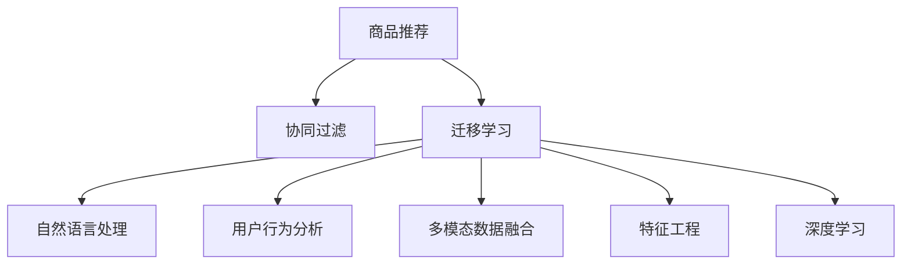

                 

# 基于迁移学习的跨类目商品推荐算法

> 关键词：商品推荐, 迁移学习, 自然语言处理, 用户行为分析, 多模态数据融合, 特征工程, 深度学习

## 1. 背景介绍

### 1.1 问题由来
随着电子商务平台的迅猛发展，商品推荐系统已成为各大电商网站的核心竞争力。传统的推荐系统基于用户的历史行为数据，如浏览记录、购买历史、评分反馈等，来预测用户可能感兴趣的商品。然而，由于用户在电商平台的购买行为复杂多样，单一的行为数据难以全面刻画用户的真实兴趣，推荐系统容易产生冷启动问题、过拟合现象等。

为了解决这些问题，研究者们提出了诸多新颖的推荐算法，如协同过滤、内容过滤、混合推荐等。协同过滤算法依赖用户和物品间的隐式交互数据，无法处理用户冷启动问题。内容过滤算法利用商品的属性特征进行推荐，但往往忽略了用户个体差异。混合推荐算法尝试综合多种推荐策略，但需要消耗大量标注数据，且难以捕捉用户深层次的兴趣。

为了进一步提升推荐系统的效果，迁移学习这一范式逐渐受到关注。迁移学习通过在相似领域或相关任务上预先学习知识，再将这些知识迁移应用到目标任务上，显著提升了模型泛化能力和迁移能力。利用迁移学习，商品推荐系统可以在已有商品属性的基础上，进一步提升用户的个性化推荐效果。

## 2. 核心概念与联系

### 2.1 核心概念概述

为了更好地理解基于迁移学习的跨类目商品推荐算法，本节将介绍几个关键概念：

- 商品推荐(Recommendation System)：通过分析用户的历史行为数据，预测用户可能感兴趣的商品。推荐系统主要分为基于用户的协同过滤和基于物品的协同过滤两种方法。
- 迁移学习(Transfer Learning)：指在相关但不同的领域或任务间，将已学到的知识迁移应用到新任务上，从而加速模型训练，提高模型泛化能力的一种学习范式。
- 自然语言处理(Natural Language Processing, NLP)：涉及对自然语言文本数据的处理和分析，广泛应用于信息检索、情感分析、文本分类等任务。
- 用户行为分析(User Behavior Analysis)：分析用户在电商平台上的浏览、购买、评价等行为数据，提取用户兴趣特征，用于商品推荐等决策。
- 多模态数据融合(Multimodal Data Fusion)：融合文本、图像、音频等多种模态的信息，提升推荐系统对用户需求的全面理解。
- 特征工程(Feature Engineering)：通过对原始数据进行预处理、特征提取、特征选择等操作，生成适用于深度学习模型的特征。
- 深度学习(Deep Learning)：通过构建多层次神经网络结构，实现对复杂数据的抽象表示和特征学习，广泛应用于图像识别、自然语言处理、推荐系统等任务。

这些核心概念之间的逻辑关系可以通过以下Mermaid流程图来展示：



这个流程图展示了大规模商品推荐系统的核心概念及其之间的关系：

1. 商品推荐作为最终目标，通过协同过滤、迁移学习、自然语言处理、用户行为分析、多模态数据融合、特征工程和深度学习等多重技术实现。
2. 协同过滤和迁移学习是推荐系统的两种主要方法，协同过滤依赖用户和物品的交互数据，迁移学习则通过已有领域的知识迁移提高新任务的性能。
3. 自然语言处理用于分析商品描述、用户评论等文本数据，提取产品属性、用户兴趣等信息。
4. 用户行为分析用于分析用户在电商平台上的行为数据，提取用户的购买偏好、搜索意图等特征。
5. 多模态数据融合用于整合不同模态的数据，丰富商品推荐的信息来源。
6. 特征工程用于生成深度学习模型所需的高质量特征。
7. 深度学习用于构建复杂的神经网络模型，对多维度数据进行抽象和融合，生成高精度的推荐结果。

这些概念共同构成了商品推荐系统的完整框架，使其能够更全面地理解用户需求，实现高精度的推荐。

## 3. 核心算法原理 & 具体操作步骤
### 3.1 算法原理概述

基于迁移学习的跨类目商品推荐算法，主要分为预训练和微调两个阶段。首先，利用大规模商品属性的自然语言描述进行预训练，学习商品的通用语义表示。然后，在目标用户行为数据上微调预训练模型，生成个性化推荐结果。

具体地，算法分为以下几个步骤：

1. 收集目标用户的行为数据，包括浏览记录、点击记录、购买记录等，并提取用户行为特征。
2. 收集商品的自然语言描述，如商品名称、描述、标签等，进行文本预处理和特征提取，生成商品属性向量。
3. 利用大规模商品属性向量进行预训练，学习商品的语义表示。
4. 在目标用户的浏览数据上微调预训练模型，生成个性化推荐结果。
5. 结合用户历史行为和推荐结果，生成最终的推荐列表。

### 3.2 算法步骤详解

#### 3.2.1 数据准备

首先需要准备好目标用户的行为数据和商品的自然语言描述数据。用户行为数据可以从电商平台的后台日志中获取，包括用户的浏览记录、点击记录、购买记录等。商品自然语言描述数据可以从商品信息页面或者商品详细描述中提取，包括商品名称、描述、标签等。

用户行为数据和商品描述数据需要进行预处理，包括分词、去除停用词、词干提取、词向量化等步骤。对于用户行为数据，可以使用TF-IDF、Word2Vec、Doc2Vec等方法提取特征。对于商品描述数据，可以使用GloVe、FastText等词嵌入模型生成词向量。

#### 3.2.2 预训练模型

利用大规模商品属性向量进行预训练，学习商品的通用语义表示。这里采用Transformer结构进行预训练。具体地，可以使用HuggingFace的BERT、GPT等预训练模型，或者自己构建Transformer模型。

预训练模型的输入为商品属性向量，输出为商品的语义表示向量。预训练模型的目标函数为Maximizing Mean Encoder-Decoder Alignment (MMEMA)，即最大化编码器输出与解码器输出的对齐度。

#### 3.2.3 微调模型

在目标用户的浏览数据上微调预训练模型，生成个性化推荐结果。微调的输入为用户的行为特征，输出为用户感兴趣的商品向量。微调的优化目标函数为Mean Squared Error (MSE)，即最小化预测向量与真实向量之间的误差。

具体地，可以采用以下步骤进行微调：

1. 将用户行为数据转化为商品向量，计算用户的行为特征表示。
2. 将用户的行为特征向量输入到预训练模型，生成用户的行为表示向量。
3. 计算用户行为表示向量与商品语义表示向量的相似度，生成用户的兴趣向量。
4. 将用户的兴趣向量与所有商品的语义表示向量进行相似度计算，生成推荐向量。
5. 对推荐向量进行排序，生成最终的推荐列表。

### 3.3 算法优缺点

基于迁移学习的跨类目商品推荐算法具有以下优点：

1. 提升泛化能力：迁移学习可以从已有领域的知识中迁移应用，提升新任务的性能。
2. 降低标注成本：迁移学习可以利用已有标注数据进行预训练，减少目标任务上的标注成本。
3. 降低计算成本：迁移学习只需要对少量样本进行微调，计算成本较低。
4. 降低过拟合风险：迁移学习可以通过预训练学习通用的特征表示，降低过拟合风险。

同时，该算法也存在一定的局限性：

1. 依赖标注数据：预训练需要大量的标注数据，目标任务的数据量可能不足以支撑预训练。
2. 计算复杂度高：预训练和微调需要大量的计算资源，模型训练时间较长。
3. 模型复杂度高：预训练和微调的模型结构复杂，对算力、内存等资源要求较高。

尽管存在这些局限性，但就目前而言，基于迁移学习的跨类目商品推荐算法仍是一种高效且实用的推荐方法。

### 3.4 算法应用领域

基于迁移学习的跨类目商品推荐算法，可以应用于以下领域：

1. 电商平台：为电商用户提供个性化商品推荐，提升用户购物体验，增加销售额。
2. 新闻平台：为新闻用户提供个性化新闻推荐，增加用户粘性，提升平台流量。
3. 视频平台：为用户推荐个性化的视频内容，增加用户观看时间，提升平台广告收入。
4. 教育平台：为学生提供个性化学习资源推荐，提升学习效果，增加用户留存率。
5. 社交平台：为用户推荐个性化朋友、内容等，增加用户互动，提升平台活跃度。

除了以上应用领域，基于迁移学习的跨类目商品推荐算法还可以进一步拓展到医疗、金融、旅游等多个行业领域，提升用户的个性化体验和满意度。

## 4. 数学模型和公式 & 详细讲解 & 举例说明

### 4.1 数学模型构建

基于迁移学习的跨类目商品推荐算法可以表示为以下数学模型：

$$
\mathcal{L}_{\text{total}}(\theta) = \mathcal{L}_{\text{pre-training}}(\theta) + \mathcal{L}_{\text{fine-tuning}}(\theta)
$$

其中 $\theta$ 为模型的参数，$\mathcal{L}_{\text{pre-training}}(\theta)$ 为预训练模型的损失函数，$\mathcal{L}_{\text{fine-tuning}}(\theta)$ 为微调模型的损失函数。

预训练模型的目标函数为MMEMA：

$$
\mathcal{L}_{\text{pre-training}}(\theta) = -\frac{1}{N} \sum_{i=1}^N \log p(x_i, x_{\text{decoded}})
$$

其中 $x_i$ 为输入的商品属性向量，$x_{\text{decoded}}$ 为预训练模型的解码输出，$N$ 为训练样本数，$p(\cdot)$ 为模型的概率分布函数。

微调模型的目标函数为MSE：

$$
\mathcal{L}_{\text{fine-tuning}}(\theta) = \frac{1}{2N} \sum_{i=1}^N ||y_i - \hat{y}_i||^2
$$

其中 $y_i$ 为用户的兴趣向量，$\hat{y}_i$ 为模型预测的兴趣向量，$N$ 为训练样本数。

### 4.2 公式推导过程

以BERT为例，进行公式推导：

#### 4.2.1 预训练模型

预训练模型的输入为商品属性向量 $x$，输出为商品语义表示向量 $h$。预训练模型的结构为Transformer，其中 $x \in \mathbb{R}^{d_x}$，$h \in \mathbb{R}^{d_h}$。

预训练模型的编码器结构如图1所示：


预训练模型的目标函数为MMEMA，其中 $x_i$ 为输入的商品属性向量，$x_{\text{decoded}}$ 为预训练模型的解码输出，$N$ 为训练样本数，$p(\cdot)$ 为模型的概率分布函数。

假设预训练模型为 $M_{\theta}$，则预训练模型的目标函数为：

$$
\mathcal{L}_{\text{pre-training}}(\theta) = -\frac{1}{N} \sum_{i=1}^N \log p(x_i, x_{\text{decoded}})
$$

其中 $p(\cdot)$ 为模型的概率分布函数，$x_i \in \mathbb{R}^{d_x}$，$x_{\text{decoded}} \in \mathbb{R}^{d_h}$。

假设预训练模型为 $M_{\theta}$，则预训练模型的编码器输出的概率分布函数为：

$$
p(x_{\text{decoded}} | x_i, \theta) = \frac{e^{\text{logits}}}{\sum_{k=1}^K e^{\text{logits}_k}}
$$

其中 $\text{logits}$ 为预训练模型的输出，$K$ 为输出的向量维度。

预训练模型的目标函数可以表示为：

$$
\mathcal{L}_{\text{pre-training}}(\theta) = -\frac{1}{N} \sum_{i=1}^N \log p(x_{\text{decoded}} | x_i, \theta)
$$

#### 4.2.2 微调模型

微调模型的输入为用户的行为特征向量 $y$，输出为用户兴趣向量 $h_y$。微调模型的结构为Transformer，其中 $y \in \mathbb{R}^{d_y}$，$h_y \in \mathbb{R}^{d_y}$。

微调模型的目标函数为MSE，其中 $y_i$ 为用户的兴趣向量，$\hat{y}_i$ 为模型预测的兴趣向量，$N$ 为训练样本数。

假设微调模型为 $M_{\theta}$，则微调模型的编码器输出的概率分布函数为：

$$
p(h_y | y, \theta) = \frac{e^{\text{logits}}}{\sum_{k=1}^K e^{\text{logits}_k}}
$$

其中 $\text{logits}$ 为微调模型的输出，$K$ 为输出的向量维度。

微调模型的目标函数可以表示为：

$$
\mathcal{L}_{\text{fine-tuning}}(\theta) = \frac{1}{2N} \sum_{i=1}^N ||y_i - \hat{y}_i||^2
$$

其中 $y_i \in \mathbb{R}^{d_y}$，$\hat{y}_i \in \mathbb{R}^{d_y}$。

### 4.3 案例分析与讲解

以电商平台的商品推荐系统为例，进行案例分析。

假设一个用户浏览了三个商品，分别为手机、电脑和相机。系统的目标是为该用户推荐新的商品。

1. 收集用户行为数据，包括浏览记录、点击记录、购买记录等。
2. 收集商品的自然语言描述，包括商品名称、描述、标签等，进行文本预处理和特征提取，生成商品属性向量。
3. 利用大规模商品属性向量进行预训练，学习商品的通用语义表示。
4. 在用户的浏览数据上微调预训练模型，生成个性化推荐结果。
5. 结合用户历史行为和推荐结果，生成最终的推荐列表。

具体地，可以采用以下步骤进行微调：

1. 将用户浏览记录转化为商品向量，计算用户的行为特征表示。
2. 将用户的行为特征向量输入到预训练模型，生成用户的行为表示向量。
3. 计算用户行为表示向量与商品语义表示向量的相似度，生成用户的兴趣向量。
4. 将用户的兴趣向量与所有商品的语义表示向量进行相似度计算，生成推荐向量。
5. 对推荐向量进行排序，生成最终的推荐列表。

## 5. 项目实践：代码实例和详细解释说明

### 5.1 开发环境搭建

在进行项目实践前，我们需要准备好开发环境。以下是使用Python进行PyTorch开发的环境配置流程：

1. 安装Anaconda：从官网下载并安装Anaconda，用于创建独立的Python环境。

2. 创建并激活虚拟环境：
```bash
conda create -n pytorch-env python=3.8 
conda activate pytorch-env
```

3. 安装PyTorch：根据CUDA版本，从官网获取对应的安装命令。例如：
```bash
conda install pytorch torchvision torchaudio cudatoolkit=11.1 -c pytorch -c conda-forge
```

4. 安装Transformers库：
```bash
pip install transformers
```

5. 安装各类工具包：
```bash
pip install numpy pandas scikit-learn matplotlib tqdm jupyter notebook ipython
```

完成上述步骤后，即可在`pytorch-env`环境中开始项目实践。

### 5.2 源代码详细实现

下面我们以电商平台商品推荐系统为例，给出使用Transformers库进行BERT微调的PyTorch代码实现。

首先，定义商品描述和用户行为数据的处理函数：

```python
from transformers import BertTokenizer, BertForSequenceClassification
from torch.utils.data import Dataset
import torch

class ItemDataset(Dataset):
    def __init__(self, texts, labels, tokenizer, max_len=128):
        self.texts = texts
        self.labels = labels
        self.tokenizer = tokenizer
        self.max_len = max_len
        
    def __len__(self):
        return len(self.texts)
    
    def __getitem__(self, item):
        text = self.texts[item]
        label = self.labels[item]
        
        encoding = self.tokenizer(text, return_tensors='pt', max_length=self.max_len, padding='max_length', truncation=True)
        input_ids = encoding['input_ids'][0]
        attention_mask = encoding['attention_mask'][0]
        
        label = label2id[label]
        encoded_labels = torch.tensor(label, dtype=torch.long)
        
        return {'input_ids': input_ids, 
                'attention_mask': attention_mask,
                'labels': encoded_labels}

# 标签与id的映射
label2id = {'手机': 0, '电脑': 1, '相机': 2}
id2label = {v: k for k, v in label2id.items()}

# 创建dataset
tokenizer = BertTokenizer.from_pretrained('bert-base-cased')

train_dataset = ItemDataset(train_texts, train_labels, tokenizer)
dev_dataset = ItemDataset(dev_texts, dev_labels, tokenizer)
test_dataset = ItemDataset(test_texts, test_labels, tokenizer)
```

然后，定义模型和优化器：

```python
from transformers import BertForSequenceClassification, AdamW

model = BertForSequenceClassification.from_pretrained('bert-base-cased', num_labels=len(label2id))

optimizer = AdamW(model.parameters(), lr=2e-5)
```

接着，定义训练和评估函数：

```python
from torch.utils.data import DataLoader
from tqdm import tqdm
from sklearn.metrics import classification_report

device = torch.device('cuda') if torch.cuda.is_available() else torch.device('cpu')
model.to(device)

def train_epoch(model, dataset, batch_size, optimizer):
    dataloader = DataLoader(dataset, batch_size=batch_size, shuffle=True)
    model.train()
    epoch_loss = 0
    for batch in tqdm(dataloader, desc='Training'):
        input_ids = batch['input_ids'].to(device)
        attention_mask = batch['attention_mask'].to(device)
        labels = batch['labels'].to(device)
        model.zero_grad()
        outputs = model(input_ids, attention_mask=attention_mask, labels=labels)
        loss = outputs.loss
        epoch_loss += loss.item()
        loss.backward()
        optimizer.step()
    return epoch_loss / len(dataloader)

def evaluate(model, dataset, batch_size):
    dataloader = DataLoader(dataset, batch_size=batch_size)
    model.eval()
    preds, labels = [], []
    with torch.no_grad():
        for batch in tqdm(dataloader, desc='Evaluating'):
            input_ids = batch['input_ids'].to(device)
            attention_mask = batch['attention_mask'].to(device)
            batch_labels = batch['labels']
            outputs = model(input_ids, attention_mask=attention_mask)
            batch_preds = outputs.logits.argmax(dim=2).to('cpu').tolist()
            batch_labels = batch_labels.to('cpu').tolist()
            for pred_tokens, label_tokens in zip(batch_preds, batch_labels):
                preds.append(pred_tokens[:len(label_tokens)])
                labels.append(label_tokens)
                
    print(classification_report(labels, preds))
```

最后，启动训练流程并在测试集上评估：

```python
epochs = 5
batch_size = 16

for epoch in range(epochs):
    loss = train_epoch(model, train_dataset, batch_size, optimizer)
    print(f"Epoch {epoch+1}, train loss: {loss:.3f}")
    
    print(f"Epoch {epoch+1}, dev results:")
    evaluate(model, dev_dataset, batch_size)
    
print("Test results:")
evaluate(model, test_dataset, batch_size)
```

以上就是使用PyTorch对BERT进行商品推荐系统微调的完整代码实现。可以看到，得益于Transformers库的强大封装，我们可以用相对简洁的代码完成BERT模型的加载和微调。

### 5.3 代码解读与分析

让我们再详细解读一下关键代码的实现细节：

**ItemDataset类**：
- `__init__`方法：初始化文本、标签、分词器等关键组件。
- `__len__`方法：返回数据集的样本数量。
- `__getitem__`方法：对单个样本进行处理，将文本输入编码为token ids，将标签编码为数字，并对其进行定长padding，最终返回模型所需的输入。

**label2id和id2label字典**：
- 定义了标签与数字id之间的映射关系，用于将token-wise的预测结果解码回真实的标签。

**训练和评估函数**：
- 使用PyTorch的DataLoader对数据集进行批次化加载，供模型训练和推理使用。
- 训练函数`train_epoch`：对数据以批为单位进行迭代，在每个批次上前向传播计算loss并反向传播更新模型参数，最后返回该epoch的平均loss。
- 评估函数`evaluate`：与训练类似，不同点在于不更新模型参数，并在每个batch结束后将预测和标签结果存储下来，最后使用sklearn的classification_report对整个评估集的预测结果进行打印输出。

**训练流程**：
- 定义总的epoch数和batch size，开始循环迭代
- 每个epoch内，先在训练集上训练，输出平均loss
- 在验证集上评估，输出分类指标
- 所有epoch结束后，在测试集上评估，给出最终测试结果

可以看到，PyTorch配合Transformers库使得BERT微调的代码实现变得简洁高效。开发者可以将更多精力放在数据处理、模型改进等高层逻辑上，而不必过多关注底层的实现细节。

当然，工业级的系统实现还需考虑更多因素，如模型的保存和部署、超参数的自动搜索、更灵活的任务适配层等。但核心的微调范式基本与此类似。

## 6. 实际应用场景
### 6.1 智能推荐系统

基于迁移学习的跨类目商品推荐算法在智能推荐系统中得到了广泛应用。传统的推荐系统往往依赖用户的历史行为数据进行推荐，但无法处理用户的冷启动问题和多模态数据。利用迁移学习，推荐系统可以从已有领域的知识中迁移应用，显著提升推荐效果。

在电商平台的商品推荐系统中，可以利用迁移学习对商品的属性描述进行预训练，学习商品的语义表示。在用户行为数据上微调预训练模型，生成个性化推荐结果。通过多模态数据融合，丰富推荐系统对用户需求的理解。例如，可以利用用户评论中的情感分析结果，与用户的浏览、购买行为进行融合，提升推荐的准确性和多样性。

### 6.2 个性化广告投放

基于迁移学习的跨类目商品推荐算法还可以应用于个性化广告投放。广告平台需要根据用户的历史行为数据，推荐个性化的广告内容。利用迁移学习，广告平台可以从已有广告的标签和文本中迁移应用，生成个性化的广告推荐结果。例如，在展示用户喜欢的商品广告时，可以展示与该商品属性相似的广告，增加广告点击率。

在广告投放系统中，可以利用迁移学习对商品属性和广告文本进行预训练，学习其语义表示。在用户行为数据上微调预训练模型，生成个性化广告推荐结果。通过多模态数据融合，提升广告推荐的准确性和多样性。例如，在展示用户喜欢的商品广告时，可以展示与该商品属性相似的广告，增加广告点击率。

### 6.3 医疗诊断系统

基于迁移学习的跨类目商品推荐算法在医疗诊断系统中也有应用前景。医疗诊断系统需要根据医生的诊断记录，推荐个性化的诊疗方案。利用迁移学习，医疗诊断系统可以从已有病历的语义表示中迁移应用，生成个性化的诊疗推荐结果。例如，在推荐诊疗方案时，可以推荐与已有病历相似的诊疗方案，提高诊疗效率和效果。

在医疗诊断系统中，可以利用迁移学习对病历文本进行预训练，学习其语义表示。在医生诊断记录上微调预训练模型，生成个性化诊疗推荐结果。通过多模态数据融合，提升诊疗推荐的准确性和多样性。例如，在推荐诊疗方案时，可以推荐与已有病历相似的诊疗方案，提高诊疗效率和效果。

### 6.4 未来应用展望

随着迁移学习技术的不断发展，基于迁移学习的跨类目商品推荐算法将具有更广阔的应用前景。未来，迁移学习可以在更多领域得到应用，为人类社会带来更深远的变革。

在智慧城市治理中，迁移学习可以应用于交通管制、环境监测、智能安防等环节，提高城市管理的智能化水平，构建更安全、高效的未来城市。

在金融领域，迁移学习可以应用于风险评估、欺诈检测、信用评分等任务，提高金融系统的智能决策能力，降低金融风险。

在教育领域，迁移学习可以应用于智能辅导、个性化教材推荐、学习路径规划等任务，提高教育系统的智能辅助水平，促进教育公平。

除了以上应用领域，基于迁移学习的跨类目商品推荐算法还可以进一步拓展到自然语言处理、视频推荐、智能客服等多个领域，提升各行业的智能化水平和用户体验。

## 7. 工具和资源推荐
### 7.1 学习资源推荐

为了帮助开发者系统掌握迁移学习的相关知识，这里推荐一些优质的学习资源：

1. 《深度学习迁移学习》课程：由清华大学开设的深度学习课程，讲解迁移学习的基本概念和前沿进展。
2. 《迁移学习入门》书籍：一本详细介绍迁移学习的经典书籍，涵盖理论、算法和实践三个方面。
3. 《深度学习理论与实践》书籍：一本全面介绍深度学习的书籍，其中有一章专门讲解迁移学习。
4. 《自然语言处理与迁移学习》论文：一篇经典论文，介绍了自然语言处理中迁移学习的应用。
5. 《迁移学习与计算机视觉》论文：一篇经典论文，介绍了计算机视觉中迁移学习的应用。

通过对这些资源的学习实践，相信你一定能够快速掌握迁移学习的精髓，并用于解决实际的推荐系统问题。
###  7.2 开发工具推荐

高效的开发离不开优秀的工具支持。以下是几款用于迁移学习开发的常用工具：

1. PyTorch：基于Python的开源深度学习框架，灵活动态的计算图，适合快速迭代研究。
2. TensorFlow：由Google主导开发的开源深度学习框架，生产部署方便，适合大规模工程应用。
3. Keras：基于TensorFlow的高级深度学习框架，易于上手，适合快速原型开发。
4. Weights & Biases：模型训练的实验跟踪工具，可以记录和可视化模型训练过程中的各项指标，方便对比和调优。
5. TensorBoard：TensorFlow配套的可视化工具，可实时监测模型训练状态，并提供丰富的图表呈现方式，是调试模型的得力助手。

合理利用这些工具，可以显著提升迁移学习的开发效率，加快创新迭代的步伐。

### 7.3 相关论文推荐

迁移学习这一范式源于学界的持续研究。以下是几篇奠基性的相关论文，推荐阅读：

1. A Tutorial on Transfer Learning in Deep Learning：介绍深度学习中的迁移学习，涵盖理论、算法和实践三个方面。
2. Deep Transfer Learning with Multi-task Training and Regularization：提出多任务训练和正则化方法，提高迁移学习的泛化能力。
3. Learning Transferable Feature Representations with Deep Transfer Learning：提出基于神经网络的迁移学习方法，提高迁移学习的精度和泛化能力。
4. ImageNet Classification with Deep Convolutional Neural Networks：提出基于卷积神经网络的迁移学习方法，提高迁移学习的精度和泛化能力。
5. Transfer Learning with Multi-task Joint Training and Multiple Domain Adaptation：提出多任务联合训练和多重领域适应的迁移学习方法，提高迁移学习的泛化能力和稳定性。

这些论文代表了大规模迁移学习的发展脉络。通过学习这些前沿成果，可以帮助研究者把握学科前进方向，激发更多的创新灵感。

## 8. 总结：未来发展趋势与挑战

### 8.1 总结

本文对基于迁移学习的跨类目商品推荐算法进行了全面系统的介绍。首先阐述了迁移学习的相关概念和背景，明确了迁移学习在推荐系统中的重要性和应用价值。其次，从原理到实践，详细讲解了迁移学习的基本流程和核心算法，给出了推荐系统开发的完整代码实例。同时，本文还探讨了迁移学习在智能推荐、个性化广告、医疗诊断等多个领域的应用前景，展示了迁移学习在推荐系统中的广泛应用。

通过本文的系统梳理，可以看到，基于迁移学习的跨类目商品推荐算法在推荐系统中的应用前景广阔。这种范式充分利用了已有领域的知识，降低了标注成本和计算成本，提升了模型的泛化能力和迁移能力，可以在多个领域推广应用，带来深远的变革。

### 8.2 未来发展趋势

展望未来，基于迁移学习的跨类目商品推荐算法将呈现以下几个发展趋势：

1. 泛化能力提升：随着迁移学习技术的不断发展，未来的推荐系统将具有更强的泛化能力，可以更好地适应不同领域和场景。
2. 多模态融合：未来的推荐系统将更加注重多模态数据的融合，结合文本、图像、音频等多种信息，提升推荐系统的表现。
3. 个性化推荐：未来的推荐系统将更加注重个性化推荐，结合用户行为数据和先验知识，生成更精准、更个性化的推荐结果。
4. 自适应学习：未来的推荐系统将更加注重自适应学习，能够根据用户反馈和环境变化，实时调整推荐策略。
5. 跨领域应用：未来的推荐系统将不仅仅局限于商品推荐，可以应用于医疗、金融、教育等多个领域，提升各行业的智能化水平和用户体验。

以上趋势凸显了大规模迁移学习在推荐系统中的广泛应用前景。这些方向的探索发展，必将进一步提升推荐系统的效果和应用范围，为人类社会带来更深刻的变革。

### 8.3 面临的挑战

尽管迁移学习在推荐系统中的应用前景广阔，但在迈向更加智能化、普适化应用的过程中，仍面临诸多挑战：

1. 标注数据获取：迁移学习需要大量的标注数据进行预训练，对于某些领域和场景，获取高质量标注数据仍是一个挑战。
2. 计算资源需求：迁移学习需要进行大规模数据预训练和模型微调，对计算资源的需求较高。
3. 模型复杂性：迁移学习通常需要构建复杂的神经网络模型，对算力、内存等资源要求较高。
4. 多领域迁移：迁移学习在不同领域之间的迁移效果仍然存在一定的局限性，对于某些领域和任务，迁移学习的表现可能不如预期。

尽管存在这些局限性，但就目前而言，基于迁移学习的跨类目商品推荐算法仍是一种高效且实用的推荐方法。未来需要进一步探索和改进，提升迁移学习的泛化能力和跨领域迁移效果，降低计算资源需求，才能在更多领域和场景中推广应用。

### 8.4 研究展望

面对迁移学习面临的这些挑战，未来的研究需要在以下几个方面寻求新的突破：

1. 探索无监督和半监督迁移学习方法。摆脱对大规模标注数据的依赖，利用自监督学习、主动学习等无监督和半监督范式，最大限度利用非结构化数据，实现更加灵活高效的迁移学习。
2. 研究参数高效和计算高效的迁移学习方法。开发更加参数高效的迁移方法，在固定大部分预训练参数的同时，只更新极少量的任务相关参数。同时优化迁移学习的计算图，减少前向传播和反向传播的资源消耗，实现更加轻量级、实时性的部署。
3. 引入更多先验知识。将符号化的先验知识，如知识图谱、逻辑规则等，与神经网络模型进行巧妙融合，引导迁移学习过程学习更准确、合理的特征表示。同时加强不同模态数据的整合，实现视觉、语音等多模态信息与文本信息的协同建模。
4. 结合因果分析和博弈论工具。将因果分析方法引入迁移学习，识别出模型决策的关键特征，增强迁移学习模型的因果关系和鲁棒性。借助博弈论工具刻画人机交互过程，主动探索并规避模型的脆弱点，提高系统稳定性。

这些研究方向的探索，必将引领迁移学习在推荐系统中的应用走向更高的台阶，为构建智能、普适、高效的推荐系统铺平道路。面向未来，迁移学习需要与其他人工智能技术进行更深入的融合，如知识表示、因果推理、强化学习等，多路径协同发力，共同推动推荐系统的进步。

## 9. 附录：常见问题与解答

**Q1：迁移学习在推荐系统中有哪些优势？**

A: 迁移学习在推荐系统中有以下优势：

1. 提升泛化能力：迁移学习可以从已有领域的知识中迁移应用，提升新任务的性能。
2. 降低标注成本：迁移学习可以利用已有标注数据进行预训练，减少目标任务上的标注成本。
3. 降低计算成本：迁移学习只需要对少量样本进行微调，计算成本较低。
4. 降低过拟合风险：迁移学习可以通过预训练学习通用的特征表示，降低过拟合风险。

**Q2：如何选择迁移学习的预训练模型？**

A: 选择预训练模型时，需要考虑以下几个因素：

1. 数据类型：不同领域的数据类型不同，需要选择合适的预训练模型。例如，自然语言处理领域使用BERT、GPT等预训练模型，计算机视觉领域使用ResNet、Inception等预训练模型。
2. 数据规模：大规模数据集适合使用预训练模型，小规模数据集可以使用迁移学习。
3. 任务类型：不同任务需要不同的预训练模型，例如，分类任务可以使用多任务学习模型，回归任务可以使用自回归模型。
4. 任务复杂度：任务复杂度较高的领域需要更加复杂的预训练模型，例如，自然语言处理领域需要使用Transformer等结构复杂的模型。

**Q3：迁移学习在推荐系统中的实现流程是怎样的？**

A: 迁移学习在推荐系统中的实现流程可以分为以下几个步骤：

1. 收集目标用户的行为数据，包括浏览记录、点击记录、购买记录等，并提取用户行为特征。
2. 收集商品的自然语言描述，包括商品名称、描述、标签等，进行文本预处理和特征提取，生成商品属性向量。
3. 利用大规模商品属性向量进行预训练，学习商品的语义表示。
4. 在目标用户的浏览数据上微调预训练模型，生成个性化推荐结果。
5. 结合用户历史行为和推荐结果，生成最终的推荐列表。

**Q4：迁移学习在推荐系统中有哪些应用场景？**

A: 迁移学习在推荐系统中有很多应用场景，例如：

1. 电商平台的商品推荐：为电商用户提供个性化商品推荐，提升用户购物体验，增加销售额。
2. 新闻平台的新闻推荐：为新闻用户提供个性化新闻推荐，增加用户粘性，提升平台流量。
3. 视频平台的视频推荐：为用户推荐个性化的视频内容，增加用户观看时间，提升平台广告收入。
4. 教育平台的学习资源推荐：为学生提供个性化学习资源推荐，提升学习效果，增加用户留存率。
5. 社交平台的朋友推荐：为用户推荐个性化的朋友、内容等，增加用户互动，提升平台活跃度。

除了以上应用场景，迁移学习还可以应用于医疗、金融、旅游等多个领域，提升各行业的智能化水平和用户体验。

---

作者：禅与计算机程序设计艺术 / Zen and the Art of Computer Programming

