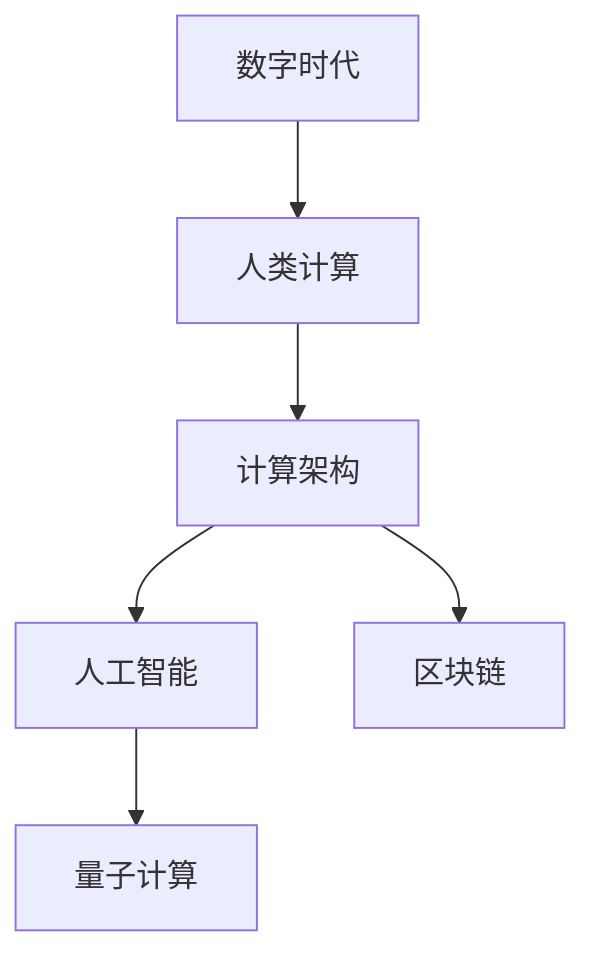

                 

# 塑造数字时代的未来：人类计算的关键作用

> 关键词：数字时代,人类计算,计算架构,人工智能,量子计算,区块链

## 1. 背景介绍

### 1.1 问题由来

随着信息技术迅猛发展，数字时代正以不可逆转的趋势塑造着现代社会。从电商、金融、教育到医疗、交通、能源，几乎每个行业都已深度融合了数字技术，推动着社会进步和产业变革。这种数字化转型不仅改变着人们的生活方式，也提出了新的计算需求。如何有效地构建和利用计算基础设施，成为当下研究与实践的热点。

### 1.2 问题核心关键点

在数字时代，计算不仅仅是传统意义上处理数据和执行程序的过程，更是一种推动社会进步和技术创新的核心能力。人类计算的关键作用体现在：

1. **技术创新引擎**：计算为人工智能(AI)、大数据分析、云计算等前沿技术的发展提供了必要的硬件和算法支撑，加速了技术创新和应用落地。
2. **社会治理基石**：政府和企业通过计算优化资源配置、提高管理效率，推动社会治理体系和治理能力现代化。
3. **经济增长引擎**：计算产业已成为推动经济增长的重要力量，催生了信息通信技术(ICT)等战略性新兴产业，对GDP贡献显著。
4. **信息安全屏障**：计算能力的安全与否，直接关系到国家安全、企业竞争和个人隐私保护。
5. **文化传承桥梁**：计算技术通过数字文化遗产的数字化保存和虚拟现实技术的应用，传承和弘扬人类文化遗产。

### 1.3 问题研究意义

探讨人类计算的关键作用，对理解数字时代的技术基础、社会变革和经济影响具有重要意义。它不仅有助于提升社会各界对计算技术的认知和重视，也助于科学规划和优化计算资源，推动信息技术深度融入社会生产生活。

## 2. 核心概念与联系

### 2.1 核心概念概述

为更好地理解人类计算在数字时代的角色和应用，本节将介绍几个关键概念：

- **数字时代**：指数字技术广泛应用、信息无处不在的时代，以数字化、网络化、智能化为特征。
- **人类计算**：指以人类为主体的计算活动，包括数据处理、程序执行、算法优化等，是推动社会进步的核心动力。
- **计算架构**：指支撑计算活动的底层技术框架，包括传统冯诺依曼架构、分布式计算、量子计算等。
- **人工智能**：指通过算法和数据训练机器模拟人类智能的领域，涵盖机器学习、深度学习等技术。
- **量子计算**：利用量子力学的原理进行信息处理的计算方式，具有高效并行计算、高效搜索和模拟等优势。
- **区块链**：一种分布式账本技术，通过去中心化、加密、共识机制等特性，实现数据安全、透明和信任。

这些概念之间的逻辑关系可以通过以下Mermaid流程图来展示：



这个流程图展示了一系列概念之间的联系：数字时代的计算活动主要以人类计算为主，人类计算活动依托于各种计算架构，其中人工智能、量子计算、区块链等技术是推动计算发展的关键技术。

## 3. 核心算法原理 & 具体操作步骤
### 3.1 算法原理概述

人类计算的核心算法原理主要包括：

- **数据处理算法**：用于高效存储、传输和处理海量数据，如哈希算法、数据压缩算法等。
- **程序执行算法**：用于高效运行各类软件程序，如编译优化算法、多线程并行算法等。
- **算法优化算法**：用于提升算法的效率和性能，如动态规划、遗传算法等。

这些算法原理共同构成了人类计算的底层基础，通过不断优化和创新，推动了信息技术的应用和发展。

### 3.2 算法步骤详解

人类计算的具体操作步骤如下：

**Step 1: 数据收集与预处理**

- 收集来自不同源的数据，确保数据质量和安全。
- 对数据进行清洗、去重、归一化等预处理，以提高数据可用性。

**Step 2: 算法设计与实现**

- 根据需求选择合适的算法模型，如机器学习模型、神经网络模型等。
- 设计和实现算法，利用各种编程语言和框架，如Python、TensorFlow等。

**Step 3: 算法优化与调试**

- 对算法进行优化，如参数调优、模型剪枝、量化等。
- 对算法进行调试，确保算法正确性和效率。

**Step 4: 算法部署与运行**

- 将优化后的算法部署到计算平台，如云计算、边缘计算等。
- 在实际应用场景中运行算法，监控性能和反馈数据。

**Step 5: 算法迭代与升级**

- 根据反馈数据和业务需求，对算法进行迭代和升级。
- 持续改进算法，保持其高效性和适应性。

### 3.3 算法优缺点

人类计算的算法具有以下优点：

- **灵活性高**：算法可以针对不同应用场景进行定制，适应性强。
- **扩展性强**：随着数据和计算资源增长，算法可以不断扩展和优化。
- **创新性强**：算法是推动技术创新和应用落地的关键，如深度学习、量子计算等。

同时，也存在以下局限性：

- **计算复杂度高**：处理大规模数据和复杂计算时，算法效率较低。
- **资源消耗大**：算法运行需要大量计算资源，如高性能计算集群、GPU等。
- **稳定性差**：算法在复杂环境下容易出现错误，需要严格测试和验证。

### 3.4 算法应用领域

人类计算的算法广泛应用于以下几个领域：

- **人工智能与机器学习**：如深度学习、图像识别、自然语言处理等。
- **大数据分析**：如数据挖掘、聚类、分类等。
- **云计算与分布式计算**：如云平台搭建、分布式存储、任务调度等。
- **物联网与边缘计算**：如设备通信、数据采集、边缘处理等。
- **信息安全**：如加密算法、安全协议等。
- **区块链与分布式账本**：如智能合约、共识算法等。

## 4. 数学模型和公式 & 详细讲解 & 举例说明

### 4.1 数学模型构建

基于人类计算的核心算法，我们可以构建多个数学模型，用于描述和优化计算过程。这里以深度学习模型为例，构建一个简单的神经网络模型：

$$
M(x)=W^1 \cdot x + b^1
$$

$$
y = \sigma(M(x))
$$

$$
M^1(y) = W^2 \cdot y + b^2
$$

其中 $W$ 和 $b$ 为模型的权重和偏置，$x$ 为输入数据，$y$ 为输出结果，$\sigma$ 为激活函数。

### 4.2 公式推导过程

以单层神经网络为例，推导其前向传播的计算公式：

假设输入数据 $x_i$，神经网络的输出为 $y_i$，权重矩阵为 $W$，偏置向量为 $b$。根据上述模型，前向传播的计算公式为：

$$
y_i = \sigma(W \cdot x_i + b)
$$

其中 $\sigma$ 为激活函数，通常采用 sigmoid、ReLU 等。

### 4.3 案例分析与讲解

以图像识别为例，推导卷积神经网络(CNN)的前向传播过程。

假设输入为一张 $28\times28$ 的灰度图像，卷积核大小为 $3\times3$，步幅为 1，padding 为 1。则卷积操作的结果为：

$$
y_{i,j} = \sum_{k=0}^{2} \sum_{l=0}^{2} W_{k,l} \cdot x_{i+k,j+l} + b
$$

其中 $x_{i,j}$ 表示图像在 $(i,j)$ 位置的像素值。

卷积操作后，通过激活函数得到特征图。重复多次卷积、池化操作后，得到最终的全连接层输出，经过 Softmax 激活函数得到分类结果。

## 5. 项目实践：代码实例和详细解释说明
### 5.1 开发环境搭建

在进行人类计算项目实践前，我们需要准备好开发环境。以下是使用Python进行深度学习开发的常见环境配置：

1. 安装Anaconda：从官网下载并安装Anaconda，用于创建独立的Python环境。

2. 创建并激活虚拟环境：
```bash
conda create -n pytorch-env python=3.8 
conda activate pytorch-env
```

3. 安装PyTorch：根据CUDA版本，从官网获取对应的安装命令。例如：
```bash
conda install pytorch torchvision torchaudio cudatoolkit=11.1 -c pytorch -c conda-forge
```

4. 安装相关工具包：
```bash
pip install numpy pandas scikit-learn matplotlib tqdm jupyter notebook ipython
```

完成上述步骤后，即可在`pytorch-env`环境中开始实践。

### 5.2 源代码详细实现

下面我们以图像识别为例，给出使用PyTorch进行卷积神经网络(CNN)模型微调的PyTorch代码实现。

首先，定义CNN模型：

```python
import torch
import torch.nn as nn
import torch.optim as optim
from torch.utils.data import DataLoader
from torchvision import datasets, transforms

class Net(nn.Module):
    def __init__(self):
        super(Net, self).__init__()
        self.conv1 = nn.Conv2d(1, 32, 3, 1)
        self.conv2 = nn.Conv2d(32, 64, 3, 1)
        self.dropout1 = nn.Dropout2d(0.25)
        self.dropout2 = nn.Dropout2d(0.5)
        self.fc1 = nn.Linear(9216, 128)
        self.fc2 = nn.Linear(128, 10)

    def forward(self, x):
        x = self.conv1(x)
        x = nn.functional.relu(x)
        x = self.conv2(x)
        x = nn.functional.relu(x)
        x = nn.functional.max_pool2d(x, 2)
        x = self.dropout1(x)
        x = torch.flatten(x, 1)
        x = self.fc1(x)
        x = nn.functional.relu(x)
        x = self.dropout2(x)
        x = self.fc2(x)
        output = nn.functional.softmax(x, dim=1)
        return output
```

然后，准备数据集并进行数据增强：

```python
transform = transforms.Compose([
    transforms.ToTensor(),
    transforms.Normalize((0.5, 0.5, 0.5), (0.5, 0.5, 0.5))
])

trainset = datasets.MNIST('mnist_data/', train=True, download=True, transform=transform)
trainloader = DataLoader(trainset, batch_size=64, shuffle=True)

testset = datasets.MNIST('mnist_data/', train=False, download=True, transform=transform)
testloader = DataLoader(testset, batch_size=64, shuffle=False)
```

接着，定义损失函数和优化器：

```python
model = Net()
criterion = nn.CrossEntropyLoss()
optimizer = optim.SGD(model.parameters(), lr=0.001, momentum=0.9)
```

最后，进行模型训练和评估：

```python
for epoch in range(10):
    running_loss = 0.0
    for i, data in enumerate(trainloader, 0):
        inputs, labels = data
        optimizer.zero_grad()
        outputs = model(inputs)
        loss = criterion(outputs, labels)
        loss.backward()
        optimizer.step()

        running_loss += loss.item()
        if i % 2000 == 1999:    # 每2000个小批量数据，打印一次loss
            print('[%d, %5d] loss: %.3f' % (epoch + 1, i + 1, running_loss / 2000))
            running_loss = 0.0

print('Finished Training')
```

以上就是使用PyTorch进行图像识别任务微调的完整代码实现。可以看到，得益于深度学习框架的强大封装，我们可以用相对简洁的代码完成模型的设计和微调。

### 5.3 代码解读与分析

让我们再详细解读一下关键代码的实现细节：

**Net类**：
- `__init__`方法：定义模型的结构，包括卷积层、激活函数、池化层、Dropout层和全连接层。
- `forward`方法：定义模型的前向传播过程，通过多次卷积、激活、池化等操作，将输入数据转换成模型输出。

**数据集准备**：
- 使用torchvision库获取MNIST数据集，并使用数据增强技术将图像标准化和归一化。
- 通过DataLoader对数据集进行分批次加载，用于模型训练和推理。

**损失函数和优化器**：
- 使用CrossEntropyLoss作为分类任务的损失函数。
- 使用SGD优化器，设置学习率为0.001，动量为0.9，以加速模型训练。

**训练过程**：
- 在每个epoch内，对训练集进行迭代，计算损失并反向传播更新模型参数。
- 每2000个小批量数据输出一次loss，以便监控训练进度。
- 训练完成后，输出"Finished Training"提示信息。

可以看到，PyTorch提供了方便的API和框架，使得深度学习模型的设计和微调过程变得简洁高效。

当然，工业级的系统实现还需考虑更多因素，如模型的保存和部署、超参数的自动搜索、更灵活的任务适配层等。但核心的微调范式基本与此类似。

## 6. 实际应用场景
### 6.1 智慧城市治理

智慧城市治理是近年来城市管理的重要趋势。通过计算技术，城市可以实时监测交通流量、空气质量、环境噪音等数据，实现精细化管理和资源优化。

例如，利用计算技术构建城市实时数据监控系统，通过物联网设备采集各类数据，利用大数据分析预测城市运行状态，采用区块链技术确保数据真实可靠。智慧城市管理不仅提升了城市治理效率，还增强了市民的参与感和满意度。

### 6.2 智能制造

在制造业中，智能制造是未来发展的重要方向。通过计算技术，制造过程可以实现高度自动化和智能化，提高生产效率和产品质量。

例如，利用计算技术构建智能制造平台，通过物联网设备采集生产数据，利用大数据分析优化生产流程，采用机器人自动化执行制造任务。智能制造不仅提升了生产效率，还减少了资源浪费和环境污染。

### 6.3 智能医疗

智能医疗是提高医疗服务质量和效率的重要途径。通过计算技术，医疗数据可以进行高效存储、分析和处理，实现精准医疗和个性化治疗。

例如，利用计算技术构建智能医疗系统，通过物联网设备采集患者数据，利用大数据分析预测疾病风险，采用机器学习算法优化治疗方案。智能医疗不仅提高了医疗服务质量，还减少了误诊和医疗资源浪费。

### 6.4 未来应用展望

随着计算技术的不断进步，未来人类计算将应用于更多领域，带来更多的变革：

- **智能交通**：利用计算技术实现智能交通管理，提高交通效率和安全性。
- **智能农业**：利用计算技术实现精准农业，提高农业生产效率和产品质量。
- **智能教育**：利用计算技术实现个性化教育，提高教育质量和效率。
- **智能金融**：利用计算技术实现金融风险管理，提高金融服务效率和安全性。
- **智能物流**：利用计算技术实现智能物流管理，提高物流效率和准确性。

## 7. 工具和资源推荐
### 7.1 学习资源推荐

为了帮助开发者系统掌握人类计算的理论基础和实践技巧，这里推荐一些优质的学习资源：

1. **《计算机体系结构》系列书籍**：系统介绍计算机硬件和架构，是理解人类计算基础的重要资料。
2. **Deep Learning Specialization课程**：由Andrew Ng教授主讲的深度学习课程，涵盖深度学习基础和实践。
3. **《机器学习实战》书籍**：涵盖机器学习基础和实践，通过实际项目案例进行讲解。
4. **Coursera和Udacity平台**：提供大量计算机科学和数据科学的在线课程，覆盖从入门到高级的内容。
5. **GitHub开源项目**：GitHub上有大量计算项目的代码和文档，可以方便学习实践。

通过对这些资源的学习实践，相信你一定能够快速掌握人类计算的精髓，并用于解决实际的计算问题。

### 7.2 开发工具推荐

高效的开发离不开优秀的工具支持。以下是几款用于人类计算开发的常用工具：

1. **PyTorch**：基于Python的开源深度学习框架，灵活动态的计算图，适合快速迭代研究。大部分深度学习模型都有PyTorch版本的实现。
2. **TensorFlow**：由Google主导开发的开源深度学习框架，生产部署方便，适合大规模工程应用。
3. **Jupyter Notebook**：支持Python和其他编程语言，提供交互式编程环境，方便实验和分享。
4. **Visual Studio Code**：提供强大的代码编辑、调试和自动补全功能，适合快速开发和部署。
5. **Anaconda Navigator**：可视化环境管理工具，方便创建和切换Python虚拟环境。

合理利用这些工具，可以显著提升人类计算任务的开发效率，加快创新迭代的步伐。

### 7.3 相关论文推荐

人类计算的发展源于学界的持续研究。以下是几篇奠基性的相关论文，推荐阅读：

1. **A Framework for Distributed Machine Learning in Smart Cities**：探讨智能城市治理中的计算需求和架构。
2. **Energy-Efficient Deep Learning for Smart Manufacturing**：研究智能制造中计算资源优化方法。
3. **AI and Machine Learning in Smart Healthcare**：讨论智能医疗中的计算技术和应用。
4. **Quantum Computing and Its Implications for the Future of AI**：研究量子计算对人工智能发展的影响。
5. **Blockchain in Smart City Management**：探讨区块链技术在智能城市治理中的应用。

这些论文代表了大计算发展的趋势和方向，有助于理解人类计算在不同领域的应用和技术创新。

## 8. 总结：未来发展趋势与挑战
### 8.1 研究成果总结

本文对人类计算在数字时代的作用进行了全面系统的介绍。首先阐述了数字时代的发展背景和计算技术的核心作用，明确了计算在推动社会进步、经济增长、文化传承等方面的重要意义。其次，从原理到实践，详细讲解了人类计算的核心算法和操作步骤，给出了具体的代码实例。同时，本文还广泛探讨了人类计算在智能城市、智能制造、智能医疗等多个行业领域的应用前景，展示了计算技术的巨大潜力。

通过本文的系统梳理，可以看到，人类计算技术正在成为数字时代的重要支柱，极大地推动了社会生产力和技术创新。未来，伴随计算能力的持续提升和跨领域应用的不断拓展，计算技术必将在更多领域发挥关键作用，为人类社会带来更多福祉。

### 8.2 未来发展趋势

展望未来，人类计算技术将呈现以下几个发展趋势：

1. **计算能力持续增强**：随着芯片和硬件技术的进步，计算能力将不断提升，实现更加高效和智能的计算任务。
2. **跨领域应用拓展**：计算技术将在更多领域得到应用，推动社会进步和经济增长。
3. **边缘计算和物联网**：利用边缘计算和物联网技术，实现数据实时处理和智能决策。
4. **云计算和分布式计算**：云计算和分布式计算将提供更加灵活和高效的计算资源，支持大规模数据处理。
5. **量子计算**：量子计算将成为未来计算的重要方向，解决当前计算难以处理的复杂问题。
6. **人工智能与计算融合**：人工智能与计算技术的深度融合，将催生更多创新应用。

### 8.3 面临的挑战

尽管人类计算技术已经取得了瞩目成就，但在迈向更加智能化、普适化应用的过程中，它仍面临着诸多挑战：

1. **计算资源瓶颈**：计算任务的复杂度和数据量不断增长，对计算资源提出了更高要求。如何高效利用计算资源，提升计算效率，将是重要课题。
2. **数据隐私与安全**：计算过程中涉及大量敏感数据，如何确保数据安全和个人隐私保护，是当前亟待解决的问题。
3. **计算性能与成本**：大规模计算任务需要高昂的计算资源，如何在提升计算性能的同时，控制成本，需要平衡多方面的因素。
4. **计算标准化与互操作性**：计算技术与不同领域的应用场景结合，需要解决计算标准化和互操作性问题。
5. **计算伦理与社会责任**：计算技术的应用涉及伦理和社会责任，需要科学规划和规范。

### 8.4 研究展望

面对人类计算所面临的挑战，未来的研究需要在以下几个方面寻求新的突破：

1. **计算架构创新**：探索新的计算架构和技术，如量子计算、分布式计算等，提升计算效率和灵活性。
2. **计算资源优化**：研究计算资源的优化方法和工具，如并行计算、云计算等，提升计算资源的利用效率。
3. **数据隐私保护**：研究数据隐私保护技术和算法，确保计算过程中数据的安全性。
4. **计算伦理规范**：制定计算伦理规范，确保计算技术的科学应用和伦理责任。

这些研究方向的探索，必将引领人类计算技术迈向更高的台阶，为构建安全、可靠、高效的智能系统铺平道路。面向未来，人类计算技术还需要与其他前沿技术进行更深入的融合，如人工智能、物联网、区块链等，多路径协同发力，共同推动信息技术进步。只有勇于创新、敢于突破，才能不断拓展计算技术的边界，让智能技术更好地服务于人类社会。

## 9. 附录：常见问题与解答

**Q1：计算架构是否适用于所有应用场景？**

A: 计算架构是一种通用的技术框架，适用于多种应用场景。但在某些特定领域，如医疗、金融、交通等，可能需要针对具体需求进行架构优化和定制。

**Q2：如何选择合适的计算架构？**

A: 选择合适的计算架构需要考虑多个因素，包括应用场景、数据量、计算复杂度等。一般建议从简单到复杂，逐步探索和优化计算架构。

**Q3：计算架构的优化有哪些方法？**

A: 计算架构的优化方法包括：并行计算、分布式计算、异构计算、内存优化等。不同架构的优化重点和实现方式各异。

**Q4：如何平衡计算性能和成本？**

A: 平衡计算性能和成本的方法包括：使用云计算平台、优化算法和数据结构、应用混合精度计算等。通过科学规划和优化，可以在保证性能的同时，控制计算成本。

**Q5：如何确保计算任务的稳定性？**

A: 确保计算任务稳定性的方法包括：使用容错机制、数据备份、故障检测等。合理设计和优化计算架构，可以有效减少计算任务的出错概率。

---

作者：禅与计算机程序设计艺术 / Zen and the Art of Computer Programming

