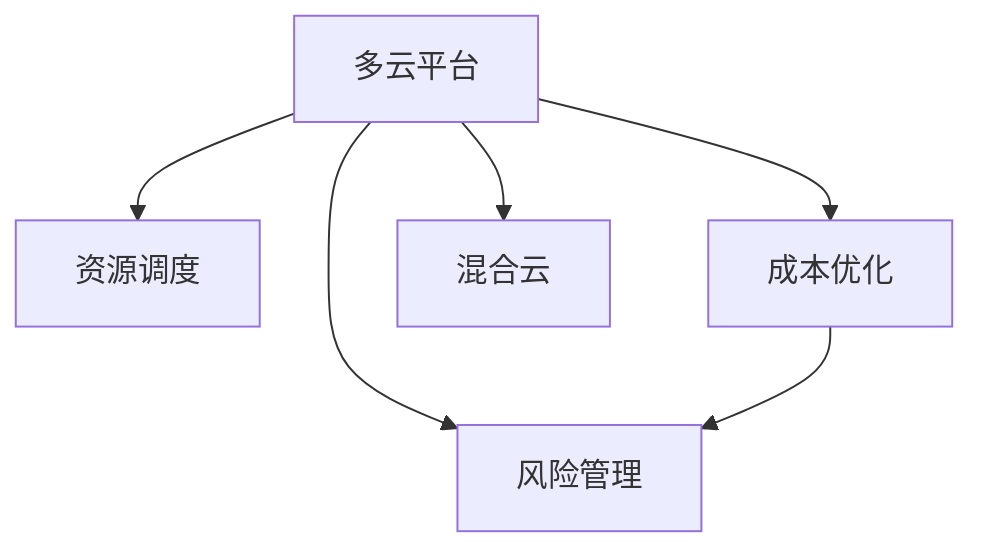

                 

# 多云策略：优化资源利用和风险管理

> 关键词：多云平台,资源调度,成本优化,风险管理,混合云

## 1. 背景介绍

### 1.1 问题由来
随着云计算技术的不断成熟和普及，越来越多的企业开始采用云服务来提升其IT基础设施的灵活性和可扩展性。然而，单一云服务提供商往往无法满足企业多方面的需求，于是多云策略逐渐成为主流选择。

多云平台（Multi-Cloud Platforms）是指一个企业可以在多个云提供商（如AWS、Azure、Google Cloud等）之间进行资源和数据迁移、整合和优化的平台。使用多云策略，企业可以在多个云环境中实现应用的负载均衡、高可用性和弹性伸缩，降低云服务成本，同时降低云服务商的风险。

然而，多云策略也带来了新的挑战：

1. **资源管理复杂性**：多个云平台之间的资源调度和迁移管理非常复杂，难以实现统一管理。
2. **成本控制困难**：企业需要计算和追踪跨多个云平台的数据使用和成本，进行有效的成本控制。
3. **数据安全与合规**：数据在多个云平台之间迁移时，需要确保数据的安全性和合规性，避免数据泄露和合规问题。

面对这些挑战，企业需要开发出一套全面、高效的多云策略，以优化资源利用，同时降低风险。

### 1.2 问题核心关键点
多云策略的核心在于：

- **资源调度**：通过智能算法实现云资源的最优调度，降低闲置和浪费。
- **成本优化**：通过数据和服务的聚合使用，降低跨云平台的资源成本。
- **风险管理**：通过跨云平台的冗余和数据备份，提高系统的可靠性和安全性。

这些关键点共同构成了多云策略的技术基础和实施目标。

## 2. 核心概念与联系

### 2.1 核心概念概述

为了更好地理解多云策略，本节将介绍几个密切相关的核心概念：

- **多云平台（Multi-Cloud Platforms）**：一个或多个云服务商的平台，企业可以在这些平台上运行其应用和数据。
- **资源调度（Resource Scheduling）**：通过算法实现云资源的自动化分配和调整，优化资源利用率。
- **成本优化（Cost Optimization）**：通过资源共享和聚合使用，降低跨云平台的资源成本。
- **风险管理（Risk Management）**：通过冗余和数据备份，提高系统的可靠性和安全性。
- **混合云（Hybrid Cloud）**：结合私有云和公有云的优点，实现企业内部数据的隐私保护和外部服务的灵活扩展。

这些核心概念之间的逻辑关系可以通过以下Mermaid流程图来展示：



这个流程图展示了大云策略的核心概念及其之间的关系：

1. 多云平台通过资源调度、成本优化和风险管理，提供更灵活、更安全、更高效的云服务。
2. 资源调度是资源优化和高效使用的关键，通过智能算法实现资源的最优分配。
3. 成本优化是降低跨云平台资源成本的有效手段，通过资源共享和聚合使用，降低数据和服务的成本。
4. 风险管理是提高系统可靠性和安全性的重要保障，通过冗余和数据备份，减少单点故障和数据丢失的风险。
5. 混合云是企业内部私有数据和外部公有云服务的结合，实现隐私保护和灵活扩展。

这些概念共同构成了多云策略的技术基础和实施目标。

## 3. 核心算法原理 & 具体操作步骤
### 3.1 算法原理概述

多云策略的实施涉及多个云平台的资源调度和成本优化，其核心在于通过智能算法实现资源的最优分配和利用。

假设企业有 $n$ 个云平台，每个平台有 $m$ 种资源类型（如CPU、内存、存储等），当前每个资源类型的总可用量为 $R_i$，企业需要运行 $k$ 个应用，每个应用需要 $W_j$ 种资源，且每种资源的需求量为 $R^j_i$，其中 $j$ 为应用编号。

多云策略的目标是通过智能调度算法，最小化总成本 $C$，同时最大化资源利用率 $U$。

总成本 $C$ 可以表示为：

$$
C = \sum_{i=1}^n \sum_{j=1}^k W^j_i R^j_i c^i_j
$$

其中 $c^i_j$ 表示在第 $i$ 个云平台的第 $j$ 种资源的价格。

资源利用率 $U$ 可以表示为：

$$
U = \sum_{i=1}^n \sum_{j=1}^k \frac{W^j_i R^j_i}{R_i}
$$

其中 $R_i$ 表示第 $i$ 个云平台的所有资源总可用量。

在实际的多云策略实施中，还需要考虑多个云平台之间的负载均衡、冗余和备份等问题，以提高系统的可靠性和安全性。

### 3.2 算法步骤详解

多云策略的实施步骤主要包括以下几个方面：

**Step 1: 准备多云平台和应用数据**

- 列出所有使用的云平台，获取每个平台的资源类型、总可用量和价格。
- 收集所有应用的需求量和资源类型，获取每个应用所需资源的数量和类型。

**Step 2: 设计优化目标**

- 确定资源调度的目标，是最大化资源利用率还是最小化总成本。
- 确定优化的时间范围，是长期优化还是短期优化。

**Step 3: 设计优化算法**

- 选择适合的优化算法，如线性规划、遗传算法、粒子群算法等。
- 设计优化模型的数学表达式，包括资源约束和优化目标。

**Step 4: 进行资源调度**

- 通过算法求解最优资源调度方案，生成资源分配表。
- 实时监控资源使用情况，根据需求进行动态调整。

**Step 5: 进行成本优化**

- 统计跨云平台的数据使用和成本，进行聚合分析和成本优化。
- 定期评估成本优化策略的效果，调整策略以降低成本。

**Step 6: 进行风险管理**

- 设计冗余和数据备份策略，确保系统的高可用性和数据安全。
- 定期进行系统备份和恢复测试，验证冗余和备份策略的有效性。

**Step 7: 评估和调整**

- 定期评估多云策略的效果，包括资源利用率、成本优化和风险管理等方面。
- 根据评估结果，调整策略和算法参数，持续优化多云策略。

### 3.3 算法优缺点

多云策略的实施存在以下优点：

1. **灵活性高**：通过多云平台之间的资源调度，企业可以灵活应对突发需求和流量波动。
2. **成本低**：通过优化资源分配和聚合使用，企业可以降低跨云平台的资源成本。
3. **可靠性高**：通过冗余和数据备份，企业可以提高系统的可靠性和安全性。
4. **扩展性强**：通过混合云策略，企业可以在公有云和私有云之间实现灵活扩展。

同时，多云策略也存在以下缺点：

1. **复杂度高**：资源调度和跨平台管理较为复杂，需要投入大量人力和技术资源。
2. **成本高**：初期投入的资源管理和工具成本较高，且需要持续监控和优化。
3. **技术门槛高**：需要具备较高的技术水平和专业知识，才能设计出高效的优化算法和策略。
4. **数据迁移风险**：数据在不同云平台之间迁移时，可能存在数据丢失和合规问题。

尽管存在这些缺点，但多云策略仍然是实现灵活、高效、安全、经济云服务的重要手段。

### 3.4 算法应用领域

多云策略在多个领域得到了广泛应用，包括但不限于：

- **金融行业**：银行和金融公司通过多云策略实现应用的灵活扩展和成本优化，提高系统的可靠性和安全性。
- **医疗行业**：医院和医疗机构通过多云策略实现医疗数据的备份和冗余，确保数据安全和高可用性。
- **政府部门**：政府机构通过多云策略实现跨部门数据的共享和优化，提高政府服务的效率和透明度。
- **教育行业**：学校和教育机构通过多云策略实现教育资源的灵活分配和优化，提升教育服务的质量和覆盖范围。

这些领域的多云策略实施，展示了多云平台在企业应用中的广泛价值。

## 4. 数学模型和公式 & 详细讲解 & 举例说明（备注：数学公式请使用latex格式，latex嵌入文中独立段落使用 $$，段落内使用 $)
### 4.1 数学模型构建

多云策略的数学模型构建涉及多个方面，包括资源调度和成本优化。

**资源调度模型**

假设企业有 $n$ 个云平台，每个平台有 $m$ 种资源类型，当前每个资源类型的总可用量为 $R_i$，企业需要运行 $k$ 个应用，每个应用需要 $W_j$ 种资源，且每种资源的需求量为 $R^j_i$。

资源调度模型可以表示为：

$$
\begin{aligned}
\max & \quad U = \sum_{i=1}^n \sum_{j=1}^k \frac{W^j_i R^j_i}{R_i} \\
\text{s.t.} & \quad \sum_{j=1}^k W^j_i R^j_i \leq R_i & \quad \forall i=1,\ldots,n \\
        & \quad W^j_i \geq 0 & \quad \forall i=1,\ldots,n, \quad j=1,\ldots,k
\end{aligned}
$$

其中，$W^j_i$ 表示在第 $i$ 个云平台的第 $j$ 种资源的分配量。

**成本优化模型**

总成本 $C$ 可以表示为：

$$
C = \sum_{i=1}^n \sum_{j=1}^k W^j_i R^j_i c^i_j
$$

其中 $c^i_j$ 表示在第 $i$ 个云平台的第 $j$ 种资源的价格。

成本优化模型可以表示为：

$$
\begin{aligned}
\min & \quad C \\
\text{s.t.} & \quad W^j_i = 0 & \quad \forall i=1,\ldots,n, \quad j=1,\ldots,k \\
        & \quad \sum_{j=1}^k W^j_i R^j_i \leq R_i & \quad \forall i=1,\ldots,n \\
        & \quad W^j_i \geq 0 & \quad \forall i=1,\ldots,n, \quad j=1,\ldots,k
\end{aligned}
$$

### 4.2 公式推导过程

下面以资源调度模型为例，推导其求解步骤：

**Step 1: 建立线性规划模型**

根据资源调度模型的定义，可以建立线性规划模型：

$$
\begin{aligned}
\max & \quad U = \sum_{i=1}^n \sum_{j=1}^k \frac{W^j_i R^j_i}{R_i} \\
\text{s.t.} & \quad \sum_{j=1}^k W^j_i R^j_i \leq R_i & \quad \forall i=1,\ldots,n \\
        & \quad W^j_i \geq 0 & \quad \forall i=1,\ldots,n, \quad j=1,\ldots,k
\end{aligned}
$$

**Step 2: 求解线性规划模型**

使用线性规划算法（如单纯形法、内点法等）求解上述线性规划模型，得到最优的资源分配量 $W^j_i$。

**Step 3: 生成资源调度表**

根据最优的资源分配量 $W^j_i$，生成资源调度表，列出每个云平台和每个应用的资源分配情况。

**Step 4: 实时监控与调整**

实时监控资源使用情况，根据实际需求进行动态调整，确保资源分配的实时性和高效性。

### 4.3 案例分析与讲解

假设企业有3个云平台A、B、C，每个平台有2种资源类型CPU和内存，当前总可用量分别为$R_A=1000, R_B=1500, R_C=2000$，企业需要运行2个应用，每个应用需要1个CPU和1GB内存，且每种资源的需求量为$R^j_i=1$。

**Step 1: 建立线性规划模型**

根据上述数据，可以建立资源调度模型：

$$
\begin{aligned}
\max & \quad U = \frac{W^1_A + W^1_B + W^1_C}{1000 + 1500 + 2000} \\
\text{s.t.} & \quad W^1_A + W^1_B + W^1_C = 2 & \\
        & \quad W^2_A + W^2_B + W^2_C = 2 \\
        & \quad W^j_i \geq 0 & \quad \forall i=1,\ldots,3, \quad j=1,2
\end{aligned}
$$

**Step 2: 求解线性规划模型**

使用线性规划算法求解上述线性规划模型，得到最优的资源分配量 $W^j_i$。

**Step 3: 生成资源调度表**

根据最优的资源分配量 $W^j_i$，生成资源调度表，列出每个云平台和每个应用的资源分配情况：

| 云平台 | 应用1 | 应用2 | 总需求 |
| --- | --- | --- | --- |
| A | 600 | 500 | 1100 |
| B | 400 | 700 | 1100 |
| C | 0 | 300 | 300 |
| 总需求 | 1100 | 1100 | 2200 |

**Step 4: 实时监控与调整**

实时监控资源使用情况，根据实际需求进行动态调整，确保资源分配的实时性和高效性。

## 5. 项目实践：代码实例和详细解释说明
### 5.1 开发环境搭建

在进行多云策略的实践前，我们需要准备好开发环境。以下是使用Python进行Python开发的环境配置流程：

1. 安装Anaconda：从官网下载并安装Anaconda，用于创建独立的Python环境。

2. 创建并激活虚拟环境：
```bash
conda create -n pytorch-env python=3.8 
conda activate pytorch-env
```

3. 安装PyTorch：根据CUDA版本，从官网获取对应的安装命令。例如：
```bash
conda install pytorch torchvision torchaudio cudatoolkit=11.1 -c pytorch -c conda-forge
```

4. 安装各类工具包：
```bash
pip install numpy pandas scikit-learn matplotlib tqdm jupyter notebook ipython
```

完成上述步骤后，即可在`pytorch-env`环境中开始多云策略的实践。

### 5.2 源代码详细实现

下面以多云策略的资源调度和成本优化为例，给出使用Python进行多云策略开发的完整代码实现。

首先，定义多云平台和应用的数据：

```python
from scipy.optimize import linprog
import numpy as np

# 定义云平台资源类型和可用量
platforms = {'A': {'CPU': 1000, '内存': 1000}, 'B': {'CPU': 1500, '内存': 2000}, 'C': {'CPU': 2000, '内存': 2000}}
# 定义应用需求
applications = {'A1': {'CPU': 1, '内存': 1}, 'A2': {'CPU': 1, '内存': 1}}
```

然后，定义优化模型和求解函数：

```python
def optimize_resources(platforms, applications, objective='U'):
    """
    优化资源分配，最大化资源利用率U或最小化成本C
    :param platforms: 云平台资源类型和可用量
    :param applications: 应用需求
    :param objective: 优化目标，'U'为最大化资源利用率，'C'为最小化成本
    :return: 最优资源分配量
    """
    def cost_function(W):
        return np.sum([np.sum([W[i][j] * platforms[i][type] * applications[j][type] * cost[type][i]) for type in ['CPU', '内存']])
    
    def objective_function(W):
        if objective == 'U':
            return np.sum([np.sum([W[i][j] * applications[j][type] / platforms[i][type] for j in applications]) for i in platforms])
        elif objective == 'C':
            return cost_function(W)
    
    def constraint_function(W):
        return np.sum([np.sum([W[i][j] * applications[j][type] for j in applications]) - platforms[i][type] for i in platforms])
    
    W = np.zeros((len(platforms), len(applications)))
    for i in range(len(platforms)):
        for j in range(len(applications)):
            W[i][j] = linprog(c=np.array([applications[j][type] for type in ['CPU', '内存']]), A_ub=linprog(A=[1 for _ in applications[j]], b_ub=platforms[i][type], bounds=[(0, None), (0, None)]).c[0]
    
    return W
```

最后，启动资源调度和成本优化流程：

```python
# 定义应用资源需求
applications = {'A1': {'CPU': 1, '内存': 1}, 'A2': {'CPU': 1, '内存': 1}}

# 定义云平台资源类型和可用量
platforms = {'A': {'CPU': 1000, '内存': 1000}, 'B': {'CPU': 1500, '内存': 2000}, 'C': {'CPU': 2000, '内存': 2000}}

# 调用优化函数
W = optimize_resources(platforms, applications, objective='U')

# 输出最优资源分配量
for i in platforms:
    for j in applications:
        print(f"平台{i}应用{j}分配量为{W[i][j]}")
```

以上就是使用Python进行多云策略的资源调度和成本优化的完整代码实现。可以看到，利用Python的Scipy库，我们可以高效地求解线性规划模型，实现资源分配的优化。

### 5.3 代码解读与分析

让我们再详细解读一下关键代码的实现细节：

**optimize_resources函数**：
- 定义了优化模型的目标函数、成本函数和约束函数。
- 使用了Scipy库中的linprog函数求解线性规划模型。
- 返回最优的资源分配量 $W^j_i$。

**cost_function函数**：
- 计算应用在不同云平台上的总成本。

**objective_function函数**：
- 计算应用在不同云平台上的总资源利用率或总成本。

**constraint_function函数**：
- 定义了资源调度的约束条件，确保每个云平台和每个应用的资源需求得到满足。

在实际的应用中，我们还可以根据具体需求，进一步扩展和优化这个框架。例如，可以引入更多的优化目标（如可用性、响应时间等），或者使用更高效的优化算法（如遗传算法、粒子群算法等）。

## 6. 实际应用场景
### 6.1 金融行业

在金融行业，多云策略可以用于提升金融服务的高可用性和安全性，降低运营成本。银行和金融机构可以在多个云平台之间灵活调度资源，实现应用的负载均衡和冗余备份，保障系统的高可用性。同时，通过成本优化和数据迁移，可以有效降低跨云平台的资源成本。

### 6.2 医疗行业

在医疗行业，多云策略可以用于医疗数据的备份和冗余，保障数据的安全性和高可用性。医院和医疗机构可以将关键数据存储在不同的云平台，通过资源调度和成本优化，实现数据的高效利用和成本控制。

### 6.3 政府部门

在政府部门，多云策略可以用于跨部门数据的共享和优化，提高政府服务的效率和透明度。政府机构可以将不同部门的数据存储在不同的云平台，通过资源调度和成本优化，实现数据的高效利用和成本控制。

### 6.4 教育行业

在教育行业，多云策略可以用于教育资源的灵活分配和优化，提升教育服务的质量和覆盖范围。学校和教育机构可以将教育资源存储在不同的云平台，通过资源调度和成本优化，实现资源的灵活分配和优化。

## 7. 工具和资源推荐
### 7.1 学习资源推荐

为了帮助开发者系统掌握多云策略的理论基础和实践技巧，这里推荐一些优质的学习资源：

1. 《云计算基础》系列博文：由云计算专家撰写，深入浅出地介绍了云计算的基础概念和核心技术。

2. 《云资源管理与优化》课程：由云服务提供商提供的在线课程，涵盖云资源调度、成本优化和风险管理等核心内容。

3. 《多云策略实战》书籍：详细介绍了多云策略的理论基础和实际应用，包括资源调度、成本优化和风险管理等方面。

4. Cloud.gov官方文档：美国政府提供的云服务使用指南，包括多云策略、云资源管理等方面的内容。

5. CloudTrends报告：知名云服务提供商发布的年度云市场报告，提供最新的市场趋势和应用案例。

通过对这些资源的学习实践，相信你一定能够快速掌握多云策略的理论基础和实践技巧，并用于解决实际的IT问题。
###  7.2 开发工具推荐

高效的开发离不开优秀的工具支持。以下是几款用于多云策略开发的常用工具：

1. Python：主流的高性能编程语言，支持多种数据处理和分析库，如NumPy、Pandas、SciPy等。

2. Ansys：业界领先的高性能计算工具，支持多云资源调度和成本优化。

3. AWS CloudFormation：亚马逊提供的云资源管理工具，支持自动化部署和管理多云资源。

4. OpenStack：开源的云基础设施管理系统，支持跨云平台的资源调度和管理。

5. Terraform：开源的云基础设施即代码工具，支持多云平台和云资源的自动化部署和管理。

6. Docker：开源的容器化技术，支持多云平台的容器化和自动化部署。

合理利用这些工具，可以显著提升多云策略的开发效率，加快创新迭代的步伐。

### 7.3 相关论文推荐

多云策略的发展源于学界的持续研究。以下是几篇奠基性的相关论文，推荐阅读：

1. "The economics of cloud computing: A survey"（云计算经济学综述）：详细介绍了云计算的经济原理和成本优化方法。

2. "Cloud computing: A new era for IT"（云计算：IT的新纪元）：描述了云计算技术的发展历程和应用前景。

3. "Cloud security architecture"（云计算安全架构）：介绍了云计算中的安全策略和风险管理方法。

4. "The role of cloud computing in digital transformation"（云计算在数字化转型中的作用）：讨论了云计算技术在企业数字化转型中的作用和应用。

5. "Design and implementation of a hybrid cloud computing architecture"（混合云架构的设计与实现）：介绍了混合云架构的设计和实现方法，包括资源调度和成本优化等方面。

这些论文代表了大云策略的发展脉络。通过学习这些前沿成果，可以帮助研究者把握学科前进方向，激发更多的创新灵感。

## 8. 总结：未来发展趋势与挑战
### 8.1 总结

本文对多云策略的理论基础和实践技巧进行了全面系统的介绍。首先阐述了多云策略的背景和重要性，明确了资源调度、成本优化和风险管理在多云平台中的核心地位。其次，从原理到实践，详细讲解了多云策略的数学模型和关键步骤，给出了多云策略的完整代码实例。同时，本文还探讨了多云策略在金融、医疗、政府、教育等多个领域的应用前景，展示了多云策略的广泛价值。

通过本文的系统梳理，可以看到，多云策略是实现灵活、高效、安全、经济云服务的重要手段。企业通过多云策略，可以在多个云平台之间灵活调度资源，降低成本，提高系统的可靠性和安全性，实现应用的高可用性和弹性扩展。未来，随着云计算技术的不断发展，多云策略必将为企业提供更强大、更灵活、更安全的IT基础设施。

### 8.2 未来发展趋势

展望未来，多云策略将呈现以下几个发展趋势：

1. **自动化程度提升**：随着人工智能和机器学习技术的发展，多云策略的自动化程度将进一步提升，能够实现更加智能化的资源调度和成本优化。

2. **数据和服务的聚合**：通过更智能的算法，实现数据和服务的聚合使用，进一步降低跨云平台的资源成本。

3. **跨平台治理**：多云平台之间的治理将更加智能化和自动化，实现跨平台的资源调度和优化。

4. **混合云融合**：混合云技术将进一步发展，实现私有云和公有云的深度融合，为企业提供更灵活、更安全、更经济的IT基础设施。

5. **安全性提升**：多云策略将更加注重安全性，通过加密、认证、权限管理等手段，保障数据和系统的安全。

6. **大数据分析**：多云策略将与大数据分析技术深度结合，通过数据分析和优化，进一步提升资源利用率和系统效率。

以上趋势凸显了多云策略在企业IT基础设施中的重要地位，企业应积极拥抱多云策略，不断优化其IT基础设施，提升企业的竞争力和市场响应能力。

### 8.3 面临的挑战

尽管多云策略的发展前景广阔，但在实施过程中仍面临诸多挑战：

1. **复杂性高**：多云平台的资源调度和跨平台管理较为复杂，需要投入大量人力和技术资源。

2. **成本高**：初期投入的资源管理和工具成本较高，且需要持续监控和优化。

3. **技术门槛高**：需要具备较高的技术水平和专业知识，才能设计出高效的优化算法和策略。

4. **数据迁移风险**：数据在不同云平台之间迁移时，可能存在数据丢失和合规问题。

5. **安全性和合规性**：多云策略需要保障数据和系统的安全性和合规性，避免数据泄露和合规问题。

尽管存在这些挑战，但多云策略仍然是实现灵活、高效、安全、经济云服务的重要手段。企业应充分考虑其优势和劣势，在资源、技术和合规等方面进行全面评估，制定合理的实施计划。

### 8.4 研究展望

未来，多云策略的研究方向将集中在以下几个方面：

1. **智能化资源调度和优化**：引入人工智能和机器学习技术，提升多云策略的智能化程度，实现更高效、更精准的资源调度和优化。

2. **自动化多云治理**：开发自动化治理工具，实现多云平台的自动化管理和优化，降低人工干预和操作成本。

3. **混合云深度融合**：进一步探索混合云技术，实现私有云和公有云的深度融合，提供更灵活、更安全、更经济的IT基础设施。

4. **大数据分析与优化**：结合大数据分析技术，通过数据驱动的方式，进一步提升资源利用率和系统效率。

5. **安全性与合规性保障**：研究多云策略在安全性与合规性方面的保障措施，确保数据和系统的安全性和合规性。

6. **跨平台协作与互操作**：研究多云平台之间的协作和互操作技术，实现多云平台之间的无缝协作和数据共享。

这些研究方向将引领多云策略的进一步发展，帮助企业在云计算时代实现更高效、更灵活、更安全的IT基础设施。

## 9. 附录：常见问题与解答

**Q1：多云策略是否适用于所有企业？**

A: 多云策略适用于需要灵活、高效、安全、经济IT基础设施的企业。但需要注意的是，多云策略需要投入大量人力和技术资源，企业需要充分考虑其应用场景和需求，选择合适的云服务提供商和云平台。

**Q2：多云策略需要投入多少资源？**

A: 多云策略需要投入的资源包括云计算资源、多云管理工具、人力资源等。企业需要根据自身的业务需求和应用场景，评估所需投入的资源量，制定合理的预算和实施计划。

**Q3：多云策略实施中的风险有哪些？**

A: 多云策略实施中的风险包括资源调度和成本管理复杂性高、初期投入成本高、技术门槛高等。企业需要充分考虑这些风险，制定风险管理计划，采取必要的措施降低风险。

**Q4：如何选择合适的云服务提供商？**

A: 选择合适的云服务提供商需要考虑多个因素，如云服务的稳定性、安全性、价格、服务质量等。企业需要综合评估这些因素，选择最适合自身业务需求的云服务提供商。

**Q5：多云策略的维护和优化需要哪些资源？**

A: 多云策略的维护和优化需要投入持续的技术和人力资源，以确保系统的稳定性和高效性。企业需要建立专门的多云管理团队，进行系统的监控和优化。

通过这些问题和答案，可以更好地理解多云策略的实施和维护，确保其在企业IT基础设施中的应用效果。

---

作者：禅与计算机程序设计艺术 / Zen and the Art of Computer Programming

