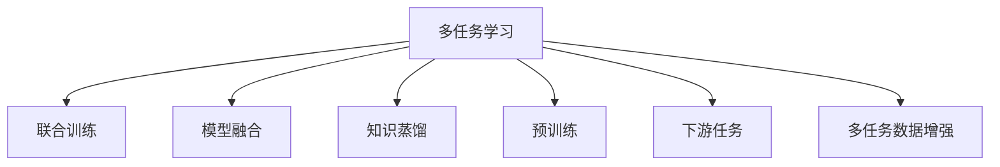

                 

# 多任务学习在NLP中的应用

> 关键词：多任务学习,自然语言处理,NLP任务,联合训练,模型融合,知识蒸馏

## 1. 背景介绍

### 1.1 问题由来
近年来，随着深度学习技术的发展，自然语言处理(NLP)领域取得了巨大进步，特别是在序列建模、文本分类、机器翻译等任务上，模型性能有了显著提升。然而，这些模型通常是针对单一任务设计的，往往无法充分利用模型中的潜在知识，无法兼顾多个任务。为此，多任务学习(MTL)技术应运而生，通过联合训练多个相关任务，将模型在多任务上的知识进行复用，提升整体性能。

多任务学习在NLP中的应用主要包括文本分类、命名实体识别、情感分析、问答系统、机器翻译等多个任务。这些任务虽然数据形式不同，但都涉及到语言理解和生成，可以共享预训练知识。通过多任务学习，NLP模型可以更好地利用预训练知识，提高模型泛化能力，提升任务精度。

### 1.2 问题核心关键点
多任务学习在NLP中的应用核心关键点包括：

1. **多任务目标函数构建**：如何设计合理的联合损失函数，使得模型能够同时学习多个任务的知识。
2. **模型结构设计**：如何设计通用的模型架构，使得模型能够同时处理不同任务的输入和输出。
3. **模型融合方法**：如何融合不同任务的模型输出，获得更好的多任务性能。
4. **数据增强策略**：如何利用多任务数据的关联性，设计数据增强策略，提高模型泛化能力。
5. **模型蒸馏技术**：如何通过知识蒸馏技术，将单一任务的模型知识迁移到其他任务上。

这些关键点决定了多任务学习在NLP中的应用效果，需要深入研究。

### 1.3 问题研究意义
多任务学习在NLP中的应用对于提升模型的泛化能力、减少对标注数据的依赖、降低开发成本、加速模型训练等方面具有重要意义。通过多任务学习，NLP模型能够更好地适应新任务，减少从头开发新模型的需求，加速模型迭代和优化。此外，多任务学习还能够提升模型在复杂任务上的表现，提高模型对多样性数据的适应性，增强模型的鲁棒性。

## 2. 核心概念与联系

### 2.1 核心概念概述

为更好地理解多任务学习在NLP中的应用，本节将介绍几个密切相关的核心概念：

- **多任务学习**：指在一个模型中，同时训练多个相关任务，使得模型能够学习多个任务的共同特征。多任务学习可以共享参数，减少计算资源，提高模型的泛化能力。

- **联合训练**：指将多个相关任务的数据联合起来，共同训练模型。通过共享模型参数，优化多个任务的性能。

- **模型融合**：指将多个独立训练的模型输出进行融合，获得更优的多任务性能。模型融合方法包括简单平均、加权平均、堆叠等。

- **知识蒸馏**：指将单一任务的模型知识迁移到其他任务上，帮助模型更快地学习新任务。知识蒸馏方法包括教师-学生网络、特征映射网络等。

- **预训练**：指在大规模无标签文本语料上，通过自监督学习任务训练通用语言模型的过程。预训练使得模型学习到通用的语言知识，可以用于多任务学习。

- **下游任务**：指在预训练模型基础上，进一步微调或训练特定任务的过程。下游任务可以是分类、匹配、生成等，具有明确的监督信号。

- **多任务数据增强**：指通过数据变换、对抗训练等手段，增加数据多样性，提高模型泛化能力。

这些核心概念之间的逻辑关系可以通过以下Mermaid流程图来展示：



这个流程图展示了一个多任务学习模型的各个组成部分及其之间的关系：

1. 多任务学习模型通过联合训练学习多个任务，共享参数。
2. 模型融合将多个任务的输出进行组合，获得更优的多任务性能。
3. 知识蒸馏将单一任务的模型知识迁移到其他任务上，提升新任务的性能。
4. 预训练学习通用的语言知识，为多任务学习提供基础。
5. 下游任务是模型在特定任务上的微调或训练过程。
6. 多任务数据增强提升模型泛化能力，避免过拟合。

这些概念共同构成了多任务学习在NLP中的应用框架，使其能够更好地利用预训练知识，提升模型性能。

## 3. 核心算法原理 & 具体操作步骤
### 3.1 算法原理概述

多任务学习在NLP中的应用，本质上是一个联合学习过程。其核心思想是：将多个NLP任务联合起来，共享模型参数，通过联合训练提升模型在多个任务上的性能。

形式化地，假设模型 $M_{\theta}$ 包含 $T$ 个任务 $T_1, T_2, ..., T_T$，分别在训练集 $D_1, D_2, ..., D_T$ 上进行联合训练。多任务目标函数 $\mathcal{L}(\theta)$ 定义为：

$$
\mathcal{L}(\theta) = \sum_{t=1}^T \mathcal{L}_t(M_{\theta}, D_t)
$$

其中 $\mathcal{L}_t$ 为第 $t$ 个任务的损失函数，$D_t$ 为第 $t$ 个任务的标注数据集。多任务学习目标是最小化联合损失函数 $\mathcal{L}(\theta)$，使得模型能够同时优化多个任务。

### 3.2 算法步骤详解

多任务学习在NLP中的应用一般包括以下几个关键步骤：

**Step 1: 设计多任务目标函数**
- 根据任务类型，设计多任务目标函数 $\mathcal{L}(\theta)$，将其作为模型训练的目标。
- 对于分类任务，通常使用交叉熵损失。
- 对于序列标注任务，可以使用序列交叉熵损失或BCEwithlogits损失。
- 对于生成任务，可以使用BLEU、ROUGE等评估指标。

**Step 2: 构建模型结构**
- 设计通用的模型架构，能够同时处理多个任务的输入和输出。
- 常用的模型架构包括Transformer、BiLSTM、GRU等。
- 对于多任务学习，可以使用并行网络、级联网络、联合网络等不同架构。

**Step 3: 联合训练**
- 在训练过程中，将多个任务的数据联合起来，共同训练模型。
- 对于并行网络，每个任务使用单独的损失函数进行优化。
- 对于级联网络，先训练底层任务，再将其输出作为上层任务的输入。
- 对于联合网络，使用联合损失函数进行优化。

**Step 4: 模型融合**
- 对不同任务的模型输出进行融合，获得更好的多任务性能。
- 常见的融合方法包括简单平均、加权平均、堆叠等。
- 融合方法的选择应根据具体任务进行优化，以获得更好的效果。

**Step 5: 数据增强**
- 设计多任务数据增强策略，提高模型泛化能力。
- 可以通过回译、对抗训练、噪声注入等方式，丰富数据多样性。
- 数据增强应考虑不同任务间的关联性，避免引入噪声。

**Step 6: 模型评估与部署**
- 在测试集上评估模型性能，对比多任务学习前后的效果。
- 使用融合后的模型进行任务推理，部署到实际应用系统中。
- 定期收集新数据，更新模型参数，保持模型性能。

以上是多任务学习在NLP中的应用的一般流程。在实际应用中，还需要针对具体任务的特点，对各个环节进行优化设计，如改进多任务目标函数，引入更多的数据增强技术，搜索最优的融合方法等，以进一步提升模型性能。

### 3.3 算法优缺点

多任务学习在NLP中的应用具有以下优点：
1. 提升泛化能力。通过联合训练多个相关任务，共享预训练知识，提升模型在多个任务上的泛化能力。
2. 减少标注数据需求。多任务学习可以充分利用数据中的潜在关联，减少对标注数据的依赖。
3. 加速模型训练。多任务学习可以并行训练多个任务，加速模型迭代和优化。
4. 提升模型性能。多任务学习可以提高模型在复杂任务上的表现，提升任务精度。

同时，该方法也存在一定的局限性：
1. 模型结构复杂。多任务学习需要设计复杂的模型结构，增加模型复杂度。
2. 数据分布差异。不同任务的数据分布可能存在较大差异，导致多任务学习效果不佳。
3. 任务相关性。多任务学习的效果依赖于任务之间的相关性，若任务之间相关性较弱，多任务学习的效果可能不理想。
4. 模型过度拟合。多任务学习需要处理多个任务，增加了过拟合的风险。

尽管存在这些局限性，但就目前而言，多任务学习仍是NLP领域的重要研究范式，适用于各种NLP任务，特别是对于数据量较小的任务，多任务学习能显著提升模型性能。未来相关研究的重点在于如何进一步降低多任务学习的复杂度，提高模型的泛化能力，同时兼顾可解释性和伦理安全性等因素。

### 3.4 算法应用领域

多任务学习在NLP领域已经得到了广泛的应用，覆盖了几乎所有常见任务，例如：

- 文本分类：如情感分析、主题分类、意图识别等。通过多任务学习，模型可以同时学习多个分类任务的共性特征。
- 命名实体识别：识别文本中的人名、地名、机构名等特定实体。多任务学习可以共享预训练的知识，提升实体识别的准确性。
- 关系抽取：从文本中抽取实体之间的语义关系。多任务学习可以学习多种关系抽取任务的共同特征。
- 问答系统：对自然语言问题给出答案。通过多任务学习，模型可以同时学习多个问答任务的语义特征。
- 机器翻译：将源语言文本翻译成目标语言。多任务学习可以共享预训练的知识，提升翻译的准确性。
- 文本摘要：将长文本压缩成简短摘要。通过多任务学习，模型可以同时学习摘要任务和其他文本处理任务的共同特征。
- 对话系统：使机器能够与人自然对话。通过多任务学习，模型可以同时学习对话任务和其他文本处理任务的共同特征。

除了上述这些经典任务外，多任务学习还被创新性地应用到更多场景中，如可控文本生成、常识推理、代码生成、数据增强等，为NLP技术带来了全新的突破。随着预训练模型和多任务学习方法的不断进步，相信NLP技术将在更广阔的应用领域大放异彩。

## 4. 数学模型和公式 & 详细讲解  
### 4.1 数学模型构建

本节将使用数学语言对多任务学习在NLP中的应用进行更加严格的刻画。

记多任务模型为 $M_{\theta}$，其中 $\theta$ 为模型参数。假设多任务学习包含 $T$ 个任务 $T_1, T_2, ..., T_T$，其训练集分别为 $D_1, D_2, ..., D_T$，模型在 $t$ 任务上的损失函数为 $\mathcal{L}_t$。

定义多任务目标函数 $\mathcal{L}(\theta)$ 为：

$$
\mathcal{L}(\theta) = \sum_{t=1}^T \mathcal{L}_t(M_{\theta}, D_t)
$$

在多任务学习中，目标是最小化多任务目标函数 $\mathcal{L}(\theta)$，即：

$$
\theta^* = \mathop{\arg\min}_{\theta} \mathcal{L}(\theta)
$$

通过梯度下降等优化算法，多任务学习过程不断更新模型参数 $\theta$，最小化联合损失函数 $\mathcal{L}(\theta)$，使得模型输出逼近真实标签。

### 4.2 公式推导过程

以下我们以二分类和多分类任务为例，推导多任务学习目标函数的梯度计算公式。

假设模型 $M_{\theta}$ 在输入 $x$ 上的输出为 $\hat{y}=M_{\theta}(x) \in [0,1]$，表示样本属于正类的概率。真实标签 $y \in \{0,1\}$。则二分类交叉熵损失函数定义为：

$$
\ell(M_{\theta}(x),y) = -[y\log \hat{y} + (1-y)\log (1-\hat{y})]
$$

对于多分类任务，使用交叉熵损失函数：

$$
\ell(M_{\theta}(x),y) = -\sum_{i=1}^C y_i\log \hat{y_i}
$$

其中 $C$ 为类别数。

将多任务损失函数进行展开，得：

$$
\mathcal{L}(\theta) = -\sum_{t=1}^T \frac{1}{N_t}\sum_{i=1}^{N_t} \ell(M_{\theta}(x_i),y_i)
$$

其中 $N_t$ 为第 $t$ 个任务的样本数。

根据链式法则，多任务学习目标函数对参数 $\theta_k$ 的梯度为：

$$
\frac{\partial \mathcal{L}(\theta)}{\partial \theta_k} = -\sum_{t=1}^T \frac{1}{N_t}\sum_{i=1}^{N_t} (\frac{y_i}{\hat{y_i}}-\frac{1-y_i}{1-\hat{y_i}}) \frac{\partial M_{\theta}(x_i)}{\partial \theta_k}
$$

其中 $\frac{\partial M_{\theta}(x_i)}{\partial \theta_k}$ 可进一步递归展开，利用自动微分技术完成计算。

在得到多任务损失函数的梯度后，即可带入参数更新公式，完成模型的迭代优化。重复上述过程直至收敛，最终得到适应多个任务的最优模型参数 $\theta^*$。

## 5. 项目实践：代码实例和详细解释说明
### 5.1 开发环境搭建

在进行多任务学习实践前，我们需要准备好开发环境。以下是使用Python进行PyTorch开发的环境配置流程：

1. 安装Anaconda：从官网下载并安装Anaconda，用于创建独立的Python环境。

2. 创建并激活虚拟环境：
```bash
conda create -n pytorch-env python=3.8 
conda activate pytorch-env
```

3. 安装PyTorch：根据CUDA版本，从官网获取对应的安装命令。例如：
```bash
conda install pytorch torchvision torchaudio cudatoolkit=11.1 -c pytorch -c conda-forge
```

4. 安装Transformers库：
```bash
pip install transformers
```

5. 安装各类工具包：
```bash
pip install numpy pandas scikit-learn matplotlib tqdm jupyter notebook ipython
```

完成上述步骤后，即可在`pytorch-env`环境中开始多任务学习实践。

### 5.2 源代码详细实现

下面我以命名实体识别(NER)和多分类情感分析为例，给出使用Transformers库对BERT模型进行多任务学习的PyTorch代码实现。

首先，定义多任务数据处理函数：

```python
from transformers import BertTokenizer
from torch.utils.data import Dataset
import torch

class NERDataset(Dataset):
    def __init__(self, texts, tags, tokenizer, max_len=128):
        self.texts = texts
        self.tags = tags
        self.tokenizer = tokenizer
        self.max_len = max_len
        
    def __len__(self):
        return len(self.texts)
    
    def __getitem__(self, item):
        text = self.texts[item]
        tags = self.tags[item]
        
        encoding = self.tokenizer(text, return_tensors='pt', max_length=self.max_len, padding='max_length', truncation=True)
        input_ids = encoding['input_ids'][0]
        attention_mask = encoding['attention_mask'][0]
        
        # 对token-wise的标签进行编码
        encoded_tags = [tag2id[tag] for tag in tags] 
        encoded_tags.extend([tag2id['O']] * (self.max_len - len(encoded_tags)))
        labels = torch.tensor(encoded_tags, dtype=torch.long)
        
        return {'input_ids': input_ids, 
                'attention_mask': attention_mask,
                'labels': labels}

# 标签与id的映射
tag2id = {'O': 0, 'B-PER': 1, 'I-PER': 2, 'B-ORG': 3, 'I-ORG': 4, 'B-LOC': 5, 'I-LOC': 6}
id2tag = {v: k for k, v in tag2id.items()}

# 创建dataset
tokenizer = BertTokenizer.from_pretrained('bert-base-cased')

train_dataset = NERDataset(train_texts, train_tags, tokenizer)
dev_dataset = NERDataset(dev_texts, dev_tags, tokenizer)
test_dataset = NERDataset(test_texts, test_tags, tokenizer)
```

然后，定义模型和优化器：

```python
from transformers import BertForTokenClassification, AdamW

model = BertForTokenClassification.from_pretrained('bert-base-cased', num_labels=len(tag2id))
criterion = torch.nn.CrossEntropyLoss()

optimizer = AdamW(model.parameters(), lr=2e-5)
```

接着，定义训练和评估函数：

```python
from torch.utils.data import DataLoader
from tqdm import tqdm
from sklearn.metrics import classification_report

device = torch.device('cuda') if torch.cuda.is_available() else torch.device('cpu')
model.to(device)

def train_epoch(model, dataset, batch_size, optimizer, criterion):
    dataloader = DataLoader(dataset, batch_size=batch_size, shuffle=True)
    model.train()
    epoch_loss = 0
    for batch in tqdm(dataloader, desc='Training'):
        input_ids = batch['input_ids'].to(device)
        attention_mask = batch['attention_mask'].to(device)
        labels = batch['labels'].to(device)
        model.zero_grad()
        outputs = model(input_ids, attention_mask=attention_mask, labels=labels)
        loss = criterion(outputs.logits, labels)
        epoch_loss += loss.item()
        loss.backward()
        optimizer.step()
    return epoch_loss / len(dataloader)

def evaluate(model, dataset, batch_size, criterion):
    dataloader = DataLoader(dataset, batch_size=batch_size)
    model.eval()
    preds, labels = [], []
    with torch.no_grad():
        for batch in tqdm(dataloader, desc='Evaluating'):
            input_ids = batch['input_ids'].to(device)
            attention_mask = batch['attention_mask'].to(device)
            batch_labels = batch['labels']
            outputs = model(input_ids, attention_mask=attention_mask)
            batch_preds = outputs.logits.argmax(dim=2).to('cpu').tolist()
            batch_labels = batch_labels.to('cpu').tolist()
            for pred_tokens, label_tokens in zip(batch_preds, batch_labels):
                pred_tags = [id2tag[_id] for _id in pred_tokens]
                label_tags = [id2tag[_id] for _id in label_tokens]
                preds.append(pred_tags[:len(label_tokens)])
                labels.append(label_tags)
                
    print(classification_report(labels, preds))
```

最后，启动训练流程并在测试集上评估：

```python
epochs = 5
batch_size = 16

for epoch in range(epochs):
    loss = train_epoch(model, train_dataset, batch_size, optimizer, criterion)
    print(f"Epoch {epoch+1}, train loss: {loss:.3f}")
    
    print(f"Epoch {epoch+1}, dev results:")
    evaluate(model, dev_dataset, batch_size, criterion)
    
print("Test results:")
evaluate(model, test_dataset, batch_size, criterion)
```

以上就是使用PyTorch对BERT进行命名实体识别和多分类情感分析任务的多任务学习的完整代码实现。可以看到，得益于Transformers库的强大封装，我们可以用相对简洁的代码完成BERT模型的加载和多任务训练。

### 5.3 代码解读与分析

让我们再详细解读一下关键代码的实现细节：

**NERDataset类**：
- `__init__`方法：初始化文本、标签、分词器等关键组件。
- `__len__`方法：返回数据集的样本数量。
- `__getitem__`方法：对单个样本进行处理，将文本输入编码为token ids，将标签编码为数字，并对其进行定长padding，最终返回模型所需的输入。

**tag2id和id2tag字典**：
- 定义了标签与数字id之间的映射关系，用于将token-wise的预测结果解码回真实的标签。

**训练和评估函数**：
- 使用PyTorch的DataLoader对数据集进行批次化加载，供模型训练和推理使用。
- 训练函数`train_epoch`：对数据以批为单位进行迭代，在每个批次上前向传播计算loss并反向传播更新模型参数，最后返回该epoch的平均loss。
- 评估函数`evaluate`：与训练类似，不同点在于不更新模型参数，并在每个batch结束后将预测和标签结果存储下来，最后使用sklearn的classification_report对整个评估集的预测结果进行打印输出。

**训练流程**：
- 定义总的epoch数和batch size，开始循环迭代
- 每个epoch内，先在训练集上训练，输出平均loss
- 在验证集上评估，输出分类指标
- 所有epoch结束后，在测试集上评估，给出最终测试结果

可以看到，PyTorch配合Transformers库使得多任务学习的代码实现变得简洁高效。开发者可以将更多精力放在数据处理、模型改进等高层逻辑上，而不必过多关注底层的实现细节。

当然，工业级的系统实现还需考虑更多因素，如模型的保存和部署、超参数的自动搜索、更灵活的任务适配层等。但核心的多任务学习范式基本与此类似。

## 6. 实际应用场景
### 6.1 智能客服系统

基于多任务学习的多任务对话技术，可以广泛应用于智能客服系统的构建。传统客服往往需要配备大量人力，高峰期响应缓慢，且一致性和专业性难以保证。通过多任务学习，模型可以同时学习多个相关任务，如问答、情感分析、意图识别等，提供7x24小时不间断服务，快速响应客户咨询，用自然流畅的语言解答各类常见问题。

在技术实现上，可以收集企业内部的历史客服对话记录，将问题和最佳答复构建成监督数据，在此基础上对预训练对话模型进行多任务学习。多任务学习后的对话模型能够自动理解用户意图，匹配最合适的答案模板进行回复。对于客户提出的新问题，还可以接入检索系统实时搜索相关内容，动态组织生成回答。如此构建的智能客服系统，能大幅提升客户咨询体验和问题解决效率。

### 6.2 金融舆情监测

金融机构需要实时监测市场舆论动向，以便及时应对负面信息传播，规避金融风险。传统的人工监测方式成本高、效率低，难以应对网络时代海量信息爆发的挑战。通过多任务学习，文本分类和情感分析技术，为金融舆情监测提供了新的解决方案。

具体而言，可以收集金融领域相关的新闻、报道、评论等文本数据，并对其进行主题标注和情感标注。在此基础上对预训练语言模型进行多任务学习，使其能够自动判断文本属于何种主题，情感倾向是正面、中性还是负面。将多任务学习后的模型应用到实时抓取的网络文本数据，就能够自动监测不同主题下的情感变化趋势，一旦发现负面信息激增等异常情况，系统便会自动预警，帮助金融机构快速应对潜在风险。

### 6.3 个性化推荐系统

当前的推荐系统往往只依赖用户的历史行为数据进行物品推荐，无法深入理解用户的真实兴趣偏好。通过多任务学习，个性化推荐系统可以更好地挖掘用户行为背后的语义信息，从而提供更精准、多样的推荐内容。

在实践中，可以收集用户浏览、点击、评论、分享等行为数据，提取和用户交互的物品标题、描述、标签等文本内容。将文本内容作为模型输入，用户的后续行为（如是否点击、购买等）作为监督信号，在此基础上进行多任务学习。多任务学习后的模型能够从文本内容中准确把握用户的兴趣点。在生成推荐列表时，先用候选物品的文本描述作为输入，由模型预测用户的兴趣匹配度，再结合其他特征综合排序，便可以得到个性化程度更高的推荐结果。

### 6.4 未来应用展望

随着多任务学习方法和模型的不断进步，基于多任务学习的多任务模型将在更多领域得到应用，为传统行业带来变革性影响。

在智慧医疗领域，基于多任务学习的多任务问答、病历分析、药物研发等应用将提升医疗服务的智能化水平，辅助医生诊疗，加速新药开发进程。

在智能教育领域，多任务学习可应用于作业批改、学情分析、知识推荐等方面，因材施教，促进教育公平，提高教学质量。

在智慧城市治理中，多任务学习可用于城市事件监测、舆情分析、应急指挥等环节，提高城市管理的自动化和智能化水平，构建更安全、高效的未来城市。

此外，在企业生产、社会治理、文娱传媒等众多领域，基于多任务学习的多任务模型也将不断涌现，为经济社会发展注入新的动力。相信随着技术的日益成熟，多任务学习范式将成为人工智能落地应用的重要范式，推动人工智能技术在垂直行业的规模化落地。总之，多任务学习需要开发者根据具体任务，不断迭代和优化模型、数据和算法，方能得到理想的效果。

## 7. 工具和资源推荐
### 7.1 学习资源推荐

为了帮助开发者系统掌握多任务学习在NLP中的应用，这里推荐一些优质的学习资源：

1. 《多任务学习在NLP中的应用》系列博文：由大模型技术专家撰写，深入浅出地介绍了多任务学习原理、模型构建、训练策略等前沿话题。

2. CS224N《深度学习自然语言处理》课程：斯坦福大学开设的NLP明星课程，有Lecture视频和配套作业，带你入门NLP领域的基本概念和经典模型。

3. 《Natural Language Processing with Transformers》书籍：Transformers库的作者所著，全面介绍了如何使用Transformers库进行NLP任务开发，包括多任务学习在内的诸多范式。

4. HuggingFace官方文档：Transformers库的官方文档，提供了海量预训练模型和多任务学习样例代码，是上手实践的必备资料。

5. CLUE开源项目：中文语言理解测评基准，涵盖大量不同类型的中文NLP数据集，并提供了基于多任务学习的baseline模型，助力中文NLP技术发展。

通过对这些资源的学习实践，相信你一定能够快速掌握多任务学习在NLP中的应用精髓，并用于解决实际的NLP问题。
###  7.2 开发工具推荐

高效的开发离不开优秀的工具支持。以下是几款用于多任务学习开发的常用工具：

1. PyTorch：基于Python的开源深度学习框架，灵活动态的计算图，适合快速迭代研究。大部分预训练语言模型都有PyTorch版本的实现。

2. TensorFlow：由Google主导开发的开源深度学习框架，生产部署方便，适合大规模工程应用。同样有丰富的预训练语言模型资源。

3. Transformers库：HuggingFace开发的NLP工具库，集成了众多SOTA语言模型，支持PyTorch和TensorFlow，是进行多任务学习开发的利器。

4. Weights & Biases：模型训练的实验跟踪工具，可以记录和可视化模型训练过程中的各项指标，方便对比和调优。与主流深度学习框架无缝集成。

5. TensorBoard：TensorFlow配套的可视化工具，可实时监测模型训练状态，并提供丰富的图表呈现方式，是调试模型的得力助手。

6. Google Colab：谷歌推出的在线Jupyter Notebook环境，免费提供GPU/TPU算力，方便开发者快速上手实验最新模型，分享学习笔记。

合理利用这些工具，可以显著提升多任务学习任务的开发效率，加快创新迭代的步伐。

### 7.3 相关论文推荐

多任务学习在NLP中的应用源于学界的持续研究。以下是几篇奠基性的相关论文，推荐阅读：

1. Learning Multiple Tasks with Multi-Task Loss Functions（多任务损失函数）：提出了多任务学习的基本框架，通过共享模型参数，优化多个任务的性能。

2. Sequence to Sequence Learning with Neural Networks：提出了序列到序列的学习范式，为多任务学习提供了重要的技术基础。

3. Multitask Learning via Denoising Feature Alignment（多任务学习通过去噪特征对齐）：提出了一种基于特征对齐的多任务学习框架，提高了多任务学习的效果。

4. Fine-Grained Multitask Learning for Sentiment Analysis（细粒度多任务学习在情感分析中的应用）：提出了一种基于多任务学习的多情感分类方法，显著提升了情感分析的精度。

5. Multitask CTC for End-to-End Speech Recognition（多任务CTC用于端到端的语音识别）：提出了多任务CTC方法，将语音识别和文本生成任务联合训练，提升了语音识别的准确性。

这些论文代表了大模型多任务学习的应用脉络。通过学习这些前沿成果，可以帮助研究者把握学科前进方向，激发更多的创新灵感。

## 8. 总结：未来发展趋势与挑战
### 8.1 总结

本文对多任务学习在NLP中的应用进行了全面系统的介绍。首先阐述了多任务学习在NLP领域的背景和意义，明确了多任务学习在提升模型泛化能力、减少标注数据需求、加速模型训练等方面的独特价值。其次，从原理到实践，详细讲解了多任务学习的数学原理和关键步骤，给出了多任务任务开发的完整代码实例。同时，本文还广泛探讨了多任务学习在智能客服、金融舆情、个性化推荐等多个行业领域的应用前景，展示了多任务学习范式的巨大潜力。此外，本文精选了多任务学习的各类学习资源，力求为读者提供全方位的技术指引。

通过本文的系统梳理，可以看到，多任务学习在NLP中的应用效果显著，特别是在复杂任务和数据量较小的任务上，多任务学习可以显著提升模型性能。多任务学习将大模型预训练的知识充分利用，提高了模型的泛化能力和适应性，推动了NLP技术的产业化进程。未来，伴随预训练模型和多任务学习方法的不断进步，相信NLP技术将在更广阔的应用领域大放异彩，深刻影响人类的生产生活方式。

### 8.2 未来发展趋势

展望未来，多任务学习在NLP中的应用将呈现以下几个发展趋势：

1. 模型规模持续增大。随着算力成本的下降和数据规模的扩张，多任务学习模型的参数量还将持续增长。超大规模语言模型蕴含的丰富语言知识，有望支撑更加复杂多变的NLP任务。

2. 多任务目标函数优化。多任务学习目标函数的优化方法将不断进步，引入更多约束条件，如层级约束、模块化约束等，提升模型性能。

3. 多任务数据增强。多任务学习的数据增强策略将更加多样化，引入更多数据变换和对抗训练技术，提高模型泛化能力。

4. 多任务模型融合。多任务学习模型融合方法将更加灵活，引入更多融合策略，如特征融合、后融合等，提高多任务性能。

5. 多任务知识蒸馏。多任务学习中的知识蒸馏技术将不断进步，引入更多蒸馏方法，提升新任务的性能。

6. 多任务联合训练。多任务学习将与预训练、微调等技术深度结合，形成更加强大的NLP模型。

以上趋势凸显了多任务学习在NLP中的应用前景。这些方向的探索发展，必将进一步提升多任务学习的性能和应用范围，为NLP技术带来新的突破。

### 8.3 面临的挑战

尽管多任务学习在NLP中的应用取得了瞩目成就，但在迈向更加智能化、普适化应用的过程中，它仍面临着诸多挑战：

1. 模型复杂度高。多任务学习需要设计复杂的模型结构，增加了模型复杂度。

2. 数据分布差异。不同任务的数据分布可能存在较大差异，导致多任务学习效果不佳。

3. 任务相关性弱。多任务学习的效果依赖于任务之间的相关性，若任务之间相关性较弱，多任务学习的效果可能不理想。

4. 过拟合风险。多任务学习需要处理多个任务，增加了过拟合的风险。

5. 资源消耗高。多任务学习需要处理大量数据，计算资源消耗大，对硬件设备要求较高。

尽管存在这些挑战，但就目前而言，多任务学习仍是NLP领域的重要研究范式，适用于各种NLP任务，特别是对于数据量较小的任务，多任务学习能显著提升模型性能。未来相关研究的重点在于如何进一步降低多任务学习的复杂度，提高模型的泛化能力，同时兼顾可解释性和伦理安全性等因素。

### 8.4 研究展望

面对多任务学习在NLP应用中面临的挑战，未来的研究需要在以下几个方面寻求新的突破：

1. 探索无监督和多模态多任务学习。摆脱对大规模标注数据的依赖，利用自监督学习、多模态数据等技术，最大化利用数据资源，实现更加灵活高效的多任务学习。

2. 研究联合训练、微调和蒸馏的结合方法。将联合训练、微调和知识蒸馏等技术结合，形成更加全面、灵活的多任务学习范式。

3. 融合因果推理和强化学习。将因果推理和强化学习思想引入多任务学习，增强模型建立稳定因果关系的能力，提升模型泛化性和鲁棒性。

4. 纳入伦理道德约束。在多任务学习中引入伦理导向的评估指标，过滤和惩罚有偏见、有害的输出倾向，确保模型行为符合人类价值观和伦理道德。

这些研究方向的探索，必将引领多任务学习在NLP中的应用走向更高的台阶，为构建安全、可靠、可解释、可控的智能系统铺平道路。面向未来，多任务学习需要与其他人工智能技术进行更深入的融合，如知识表示、因果推理、强化学习等，多路径协同发力，共同推动自然语言理解和智能交互系统的进步。只有勇于创新、敢于突破，才能不断拓展多任务学习在NLP中的边界，让智能技术更好地造福人类社会。

## 9. 附录：常见问题与解答
----------------------------------------------------------------

**Q1：多任务学习和多任务微调有何区别？**

A: 多任务学习和多任务微调是两种不同的范式。多任务学习是指在一个模型中，同时训练多个相关任务，共享模型参数。而多任务微调是在预训练模型基础上，进一步微调模型以适应多个任务。多任务学习更加注重模型泛化能力的提升，而多任务微调更加注重模型在特定任务上的性能优化。

**Q2：多任务学习是否适用于所有NLP任务？**

A: 多任务学习在大多数NLP任务上都能取得不错的效果，特别是对于数据量较小的任务，多任务学习可以显著提升模型性能。但对于一些特定领域的任务，如医学、法律等，仅仅依靠通用语料预训练的模型可能难以很好地适应。此时需要在特定领域语料上进一步预训练，再进行多任务学习。

**Q3：如何选择合适的多任务目标函数？**

A: 多任务目标函数的选择应根据具体任务进行优化。常见的多任务目标函数包括交叉熵损失、Focal Loss、Hinge Loss等。多任务目标函数的设计应考虑不同任务之间的相关性，避免引入过多噪声。

**Q4：多任务学习中的融合方法有哪些？**

A: 常见的多任务学习融合方法包括简单平均、加权平均、堆叠等。简单平均适用于简单任务，加权平均适用于任务重要性差异较大的情况，堆叠适用于复杂任务的融合。融合方法的选择应根据具体任务进行优化。

**Q5：多任务学习如何提高模型泛化能力？**

A: 多任务学习可以通过数据增强、对抗训练、模型蒸馏等技术，提高模型的泛化能力。数据增强可以通过回译、对抗训练等方式丰富训练集多样性。模型蒸馏可以通过教师-学生网络等方式，将单一任务的模型知识迁移到其他任务上，提高新任务的性能。

这些问题的回答，希望能为你提供更深入的认识，进一步理解多任务学习在NLP中的应用。

---

作者：禅与计算机程序设计艺术 / Zen and the Art of Computer Programming

