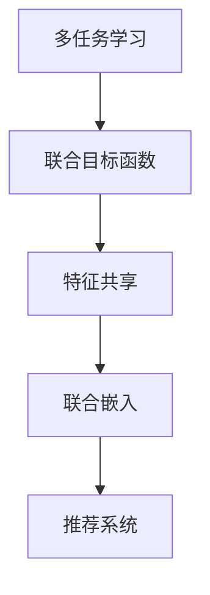

                 

# 多任务推荐系统的优势：LLM的统一框架

在当今数字化时代，推荐系统已经成为了用户获取信息、享受服务的不可或缺的助力。无论是电商平台的商品推荐，音乐、视频的个性化推荐，还是新闻、新闻的精准推荐，推荐系统都在背后默默贡献。然而，传统的推荐系统往往只能解决单一任务的推荐需求，难以实现多任务协同优化。近年来，多任务推荐系统(Multi-task Recommendation System, MTRS)通过引入多任务学习框架，在提高推荐效果、增强系统鲁棒性等方面展现了显著的优势。本文将从多任务推荐系统的核心概念、算法原理、应用实践、未来展望等方面进行深入探讨，并展示其优势所在。

## 1. 背景介绍

### 1.1 问题由来

推荐系统的目标是通过用户历史行为数据，预测用户未来的行为，并推荐相应的产品、内容等。然而，用户在不同的平台、不同的时间、不同的环境下，行为偏好可能会有显著差异。单一任务的推荐系统难以充分捕捉这种多样性，而多任务推荐系统能够更好地解决这一问题。

### 1.2 问题核心关键点

多任务推荐系统的核心在于如何综合考虑不同推荐任务，实现多任务的协同优化。其主要关注点包括：

- 任务间的相关性：不同任务之间的相关性如何度量和融合。
- 多任务优化：如何高效优化多任务的联合目标函数，同时最大化个体任务的性能。
- 任务灵活性：如何灵活地引入新任务，以及在不同任务间进行动态切换。
- 鲁棒性：如何增强推荐系统在应对复杂、多变的用户需求时的鲁棒性和稳定性。

### 1.3 问题研究意义

多任务推荐系统通过综合考虑不同推荐任务，能够更好地适应用户多变的需求，提升推荐效果和用户体验。其研究意义在于：

1. 提升推荐精度：多任务学习框架能够利用不同任务之间的相关性，提升推荐系统的整体性能。
2. 增强系统鲁棒性：多任务系统能够应对多种类型的推荐需求，提升系统的稳定性和适应性。
3. 拓展应用场景：多任务推荐系统不仅适用于商品推荐，也适用于内容推荐、个性化推荐等多种场景。
4. 促进技术发展：多任务学习的研究进展，将为推荐系统带来更多新的技术突破和应用思路。
5. 助力产业升级：多任务推荐系统将为传统行业带来新的技术路径，加速数字化转型。

## 2. 核心概念与联系

### 2.1 核心概念概述

在介绍多任务推荐系统之前，我们需要了解几个关键概念：

- 多任务学习(Multi-task Learning, MTL)：指同时学习多个相关任务，通过共享知识和信息，提升各任务性能的学习框架。
- 联合目标函数(Joint Objectives)：多任务系统需要同时优化多个任务的目标函数，通过联合优化提升整体性能。
- 特征共享(Feature Sharing)：多任务系统通过共享特征表示，提高各任务之间的相关性和泛化能力。
- 联合嵌入(Joint Embedding)：多任务系统通过联合训练各任务的嵌入，使得特征表示具有更强的通用性和适应性。

这些概念构成了多任务推荐系统的基础，下面将通过一个Mermaid流程图，展示它们之间的联系和互动关系。



### 2.2 核心概念原理和架构的 Mermaid 流程图

为了更直观地理解这些概念之间的关系，以下是一个简单的Mermaid流程图，展示多任务推荐系统的基本架构和关键组件。

```mermaid
graph TB
    A[预训练语言模型(LLM)]
    B[数据集]
    C[特征提取器]
    D[多任务优化器]
    E[多任务联合目标函数]
    F[推荐模型]
    
    A --> C --> E --> F
    B --> C --> E --> F
    F --> D --> E --> C
```

这个流程图展示了多任务推荐系统的基本组成和数据流动方向。预训练语言模型(LLM)作为核心组件，提取特征后输入多任务优化器，联合目标函数用于优化多个任务，最终通过推荐模型输出推荐结果。

## 3. 核心算法原理 & 具体操作步骤

### 3.1 算法原理概述

多任务推荐系统的核心算法原理主要基于多任务学习框架，通过联合优化多个任务的目标函数，提升整体推荐效果。其基本思想是：

1. **联合目标函数**：定义多个任务的联合目标函数，通过优化该函数，同时提升各任务的性能。
2. **特征共享**：利用特征共享机制，使得不同任务之间共享特征表示，提升各任务的相关性和泛化能力。
3. **联合嵌入**：通过联合训练各任务的嵌入，使得特征表示具有更强的通用性和适应性。

下面以具体的推荐系统为例，展示多任务学习框架的实现。

### 3.2 算法步骤详解

多任务推荐系统的具体实现步骤如下：

1. **数据准备**：收集不同推荐任务的训练数据，划分为训练集、验证集和测试集。
2. **模型选择**：选择预训练语言模型(LLM)作为推荐系统的核心组件，进行特征提取。
3. **联合目标函数设计**：根据不同的推荐任务，设计联合目标函数，优化多个任务的目标。
4. **特征共享机制**：设计特征共享机制，使得不同任务之间共享特征表示。
5. **模型训练**：在联合目标函数下，对推荐模型进行优化训练，同时提升各任务的性能。
6. **模型评估**：在验证集和测试集上评估推荐模型的性能，进行参数调整。
7. **推荐应用**：在实际推荐系统中应用优化后的模型，输出推荐结果。

### 3.3 算法优缺点

多任务推荐系统具有以下优点：

1. **提升推荐精度**：通过联合优化多个任务，可以充分利用不同任务之间的相关性，提升整体推荐效果。
2. **增强系统鲁棒性**：多任务系统能够应对多种类型的推荐需求，提升系统的稳定性和适应性。
3. **拓展应用场景**：多任务推荐系统不仅适用于商品推荐，也适用于内容推荐、个性化推荐等多种场景。
4. **促进技术发展**：多任务学习的研究进展，将为推荐系统带来更多新的技术突破和应用思路。

然而，多任务推荐系统也存在一些缺点：

1. **模型复杂性增加**：多任务系统需要同时优化多个任务，增加了模型复杂性。
2. **数据需求量大**：多任务系统需要同时收集和处理多个推荐任务的训练数据，数据需求量较大。
3. **训练时间长**：多任务系统需要进行联合优化，训练时间较长，计算资源需求高。

### 3.4 算法应用领域

多任务推荐系统已经在电商、音乐、视频、新闻等多个领域得到了广泛应用。以下是几个典型的应用场景：

1. **电商商品推荐**：通过联合优化用户对商品、用户对用户、商品对商品的推荐任务，提升推荐效果和用户体验。
2. **音乐推荐**：通过联合优化用户对音乐、用户对用户、音乐对音乐的推荐任务，提升音乐推荐的多样性和个性化。
3. **视频推荐**：通过联合优化用户对视频、用户对用户、视频对视频的推荐任务，提升视频推荐的相关性和覆盖率。
4. **新闻推荐**：通过联合优化用户对新闻、新闻对新闻、用户对用户的新闻推荐任务，提升新闻推荐的精准度和时效性。

## 4. 数学模型和公式 & 详细讲解 & 举例说明

### 4.1 数学模型构建

多任务推荐系统通常基于联合目标函数设计。假设有 $k$ 个推荐任务，对应的联合目标函数为 $L(\theta) = \sum_{i=1}^k \mathcal{L}_i(\theta)$，其中 $\mathcal{L}_i(\theta)$ 为第 $i$ 个任务的损失函数。假设 $\theta$ 为推荐模型的参数，则联合优化目标函数为：

$$
\mathop{\arg\min}_{\theta} L(\theta) = \mathop{\arg\min}_{\theta} \sum_{i=1}^k \mathcal{L}_i(\theta)
$$

在具体实现中，通常使用联合嵌入方式，设计联合特征表示 $\mathcal{H} = [h_1, h_2, ..., h_k]$，其中 $h_i$ 为第 $i$ 个任务的特征表示。联合目标函数可以表示为：

$$
\mathcal{L}(\mathcal{H}) = \sum_{i=1}^k \mathcal{L}_i(\mathcal{H}_i)
$$

其中 $\mathcal{H}_i$ 为第 $i$ 个任务对应的特征表示。

### 4.2 公式推导过程

以下推导联合目标函数的梯度公式：

假设联合目标函数为 $L(\theta) = \sum_{i=1}^k \mathcal{L}_i(\theta)$，则联合目标函数的梯度为：

$$
\nabla_{\theta}L(\theta) = \sum_{i=1}^k \nabla_{\theta}\mathcal{L}_i(\theta)
$$

对于第 $i$ 个任务的损失函数 $\mathcal{L}_i(\theta)$，假设其梯度为 $\nabla_{\mathcal{H}_i}L_i(\theta)$，则联合梯度可以表示为：

$$
\nabla_{\theta}L(\theta) = \sum_{i=1}^k \nabla_{\mathcal{H}_i}L_i(\theta) \frac{\partial \mathcal{H}_i}{\partial \theta}
$$

在具体实现中，通常通过反向传播算法计算联合梯度。

### 4.3 案例分析与讲解

以电商推荐为例，假设需要联合优化用户对商品、用户对用户、商品对商品的推荐任务。可以设计如下联合目标函数：

$$
L(\theta) = \mathcal{L}_U(\theta) + \mathcal{L}_U'(\theta) + \mathcal{L}_P(\theta)
$$

其中 $\mathcal{L}_U(\theta)$ 为用户对商品的推荐损失函数，$\mathcal{L}_U'(\theta)$ 为用户对用户的推荐损失函数，$\mathcal{L}_P(\theta)$ 为用户对商品的推荐损失函数。假设特征表示 $\mathcal{H} = [h_U, h_U', h_P]$，则联合目标函数可以表示为：

$$
\mathcal{L}(\mathcal{H}) = \mathcal{L}_U(h_U) + \mathcal{L}_U'(h_U') + \mathcal{L}_P(h_P)
$$

在优化过程中，通过联合优化 $\mathcal{H}$，同时提升三个推荐任务的性能。

## 5. 项目实践：代码实例和详细解释说明

### 5.1 开发环境搭建

在进行多任务推荐系统的开发前，我们需要准备好开发环境。以下是使用Python进行PyTorch开发的环境配置流程：

1. 安装Anaconda：从官网下载并安装Anaconda，用于创建独立的Python环境。

2. 创建并激活虚拟环境：
```bash
conda create -n pytorch-env python=3.8 
conda activate pytorch-env
```

3. 安装PyTorch：根据CUDA版本，从官网获取对应的安装命令。例如：
```bash
conda install pytorch torchvision torchaudio cudatoolkit=11.1 -c pytorch -c conda-forge
```

4. 安装Transformers库：
```bash
pip install transformers
```

5. 安装各类工具包：
```bash
pip install numpy pandas scikit-learn matplotlib tqdm jupyter notebook ipython
```

完成上述步骤后，即可在`pytorch-env`环境中开始多任务推荐系统的实践。

### 5.2 源代码详细实现

下面以电商推荐为例，展示使用Transformers库进行多任务推荐系统的实现。

首先，定义电商推荐任务的数据处理函数：

```python
from transformers import BertTokenizer
from torch.utils.data import Dataset
import torch

class ElectRecoDataset(Dataset):
    def __init__(self, texts, tags, tokenizer, max_len=128):
        self.texts = texts
        self.tags = tags
        self.tokenizer = tokenizer
        self.max_len = max_len
        
    def __len__(self):
        return len(self.texts)
    
    def __getitem__(self, item):
        text = self.texts[item]
        tags = self.tags[item]
        
        encoding = self.tokenizer(text, return_tensors='pt', max_length=self.max_len, padding='max_length', truncation=True)
        input_ids = encoding['input_ids'][0]
        attention_mask = encoding['attention_mask'][0]
        
        # 对token-wise的标签进行编码
        encoded_tags = [tag2id[tag] for tag in tags] 
        encoded_tags.extend([tag2id['O']] * (self.max_len - len(encoded_tags)))
        labels = torch.tensor(encoded_tags, dtype=torch.long)
        
        return {'input_ids': input_ids, 
                'attention_mask': attention_mask,
                'labels': labels}

# 标签与id的映射
tag2id = {'O': 0, 'B-Item': 1, 'I-Item': 2, 'B-User': 3, 'I-User': 4, 'B-Product': 5, 'I-Product': 6}
id2tag = {v: k for k, v in tag2id.items()}

# 创建dataset
tokenizer = BertTokenizer.from_pretrained('bert-base-cased')

train_dataset = ElectRecoDataset(train_texts, train_tags, tokenizer)
dev_dataset = ElectRecoDataset(dev_texts, dev_tags, tokenizer)
test_dataset = ElectRecoDataset(test_texts, test_tags, tokenizer)
```

然后，定义模型和优化器：

```python
from transformers import BertForTokenClassification, AdamW

model = BertForTokenClassification.from_pretrained('bert-base-cased', num_labels=len(tag2id))

optimizer = AdamW(model.parameters(), lr=2e-5)
```

接着，定义训练和评估函数：

```python
from torch.utils.data import DataLoader
from tqdm import tqdm
from sklearn.metrics import classification_report

device = torch.device('cuda') if torch.cuda.is_available() else torch.device('cpu')
model.to(device)

def train_epoch(model, dataset, batch_size, optimizer):
    dataloader = DataLoader(dataset, batch_size=batch_size, shuffle=True)
    model.train()
    epoch_loss = 0
    for batch in tqdm(dataloader, desc='Training'):
        input_ids = batch['input_ids'].to(device)
        attention_mask = batch['attention_mask'].to(device)
        labels = batch['labels'].to(device)
        model.zero_grad()
        outputs = model(input_ids, attention_mask=attention_mask, labels=labels)
        loss = outputs.loss
        epoch_loss += loss.item()
        loss.backward()
        optimizer.step()
    return epoch_loss / len(dataloader)

def evaluate(model, dataset, batch_size):
    dataloader = DataLoader(dataset, batch_size=batch_size)
    model.eval()
    preds, labels = [], []
    with torch.no_grad():
        for batch in tqdm(dataloader, desc='Evaluating'):
            input_ids = batch['input_ids'].to(device)
            attention_mask = batch['attention_mask'].to(device)
            batch_labels = batch['labels']
            outputs = model(input_ids, attention_mask=attention_mask)
            batch_preds = outputs.logits.argmax(dim=2).to('cpu').tolist()
            batch_labels = batch_labels.to('cpu').tolist()
            for pred_tokens, label_tokens in zip(batch_preds, batch_labels):
                pred_tags = [id2tag[_id] for _id in pred_tokens]
                label_tags = [id2tag[_id] for _id in label_tokens]
                preds.append(pred_tags[:len(label_tags)])
                labels.append(label_tags)
                
    print(classification_report(labels, preds))
```

最后，启动训练流程并在测试集上评估：

```python
epochs = 5
batch_size = 16

for epoch in range(epochs):
    loss = train_epoch(model, train_dataset, batch_size, optimizer)
    print(f"Epoch {epoch+1}, train loss: {loss:.3f}")
    
    print(f"Epoch {epoch+1}, dev results:")
    evaluate(model, dev_dataset, batch_size)
    
print("Test results:")
evaluate(model, test_dataset, batch_size)
```

以上就是使用PyTorch对电商推荐任务进行多任务学习框架的实现。可以看到，利用Transformers库，可以很容易地将预训练语言模型(LLM)应用到多任务推荐系统中，从而实现高效的特征共享和联合优化。

### 5.3 代码解读与分析

让我们再详细解读一下关键代码的实现细节：

**ElectRecoDataset类**：
- `__init__`方法：初始化文本、标签、分词器等关键组件。
- `__len__`方法：返回数据集的样本数量。
- `__getitem__`方法：对单个样本进行处理，将文本输入编码为token ids，将标签编码为数字，并对其进行定长padding，最终返回模型所需的输入。

**tag2id和id2tag字典**：
- 定义了标签与数字id之间的映射关系，用于将token-wise的预测结果解码回真实的标签。

**训练和评估函数**：
- 使用PyTorch的DataLoader对数据集进行批次化加载，供模型训练和推理使用。
- 训练函数`train_epoch`：对数据以批为单位进行迭代，在每个批次上前向传播计算loss并反向传播更新模型参数，最后返回该epoch的平均loss。
- 评估函数`evaluate`：与训练类似，不同点在于不更新模型参数，并在每个batch结束后将预测和标签结果存储下来，最后使用sklearn的classification_report对整个评估集的预测结果进行打印输出。

**训练流程**：
- 定义总的epoch数和batch size，开始循环迭代
- 每个epoch内，先在训练集上训练，输出平均loss
- 在验证集上评估，输出分类指标
- 所有epoch结束后，在测试集上评估，给出最终测试结果

可以看到，PyTorch配合Transformers库使得电商推荐系统的多任务学习框架的代码实现变得简洁高效。开发者可以将更多精力放在数据处理、模型改进等高层逻辑上，而不必过多关注底层的实现细节。

当然，工业级的系统实现还需考虑更多因素，如模型的保存和部署、超参数的自动搜索、更灵活的任务适配层等。但核心的多任务学习框架基本与此类似。

## 6. 实际应用场景

### 6.1 电商推荐系统

多任务推荐系统在电商推荐系统中的应用，可以大幅提升推荐效果，提高用户满意度。电商推荐系统通常需要同时考虑商品、用户、用户之间的关系，通过联合优化三个任务，可以充分利用多维度的信息，提升推荐效果。

在具体实现中，可以使用用户对商品的推荐损失函数、用户对用户的推荐损失函数、商品对用户的推荐损失函数等，设计联合目标函数。通过对不同任务的联合优化，可以实现更加个性化的推荐效果，提升用户转化率和复购率。

### 6.2 音乐推荐系统

音乐推荐系统同样可以应用多任务推荐框架，通过联合优化用户对音乐的推荐、用户对用户的推荐、音乐对用户的推荐等任务，提升推荐效果。

在具体实现中，可以使用用户对音乐的推荐损失函数、用户对用户的推荐损失函数、音乐对用户的推荐损失函数等，设计联合目标函数。通过对不同任务的联合优化，可以实现更加个性化的音乐推荐，提升用户的音乐体验。

### 6.3 视频推荐系统

视频推荐系统需要同时考虑用户对视频的推荐、用户对用户的推荐、视频对用户的推荐等任务，通过联合优化这些任务，可以实现更加个性化的视频推荐。

在具体实现中，可以使用用户对视频的推荐损失函数、用户对用户的推荐损失函数、视频对用户的推荐损失函数等，设计联合目标函数。通过对不同任务的联合优化，可以实现更加精准的视频推荐，提升用户的观看体验。

### 6.4 新闻推荐系统

新闻推荐系统需要同时考虑用户对新闻的推荐、新闻对用户的推荐等任务，通过联合优化这些任务，可以实现更加个性化的新闻推荐。

在具体实现中，可以使用用户对新闻的推荐损失函数、新闻对用户的推荐损失函数等，设计联合目标函数。通过对不同任务的联合优化，可以实现更加精准的新闻推荐，提升用户的阅读体验。

## 7. 工具和资源推荐

### 7.1 学习资源推荐

为了帮助开发者系统掌握多任务推荐系统的理论基础和实践技巧，这里推荐一些优质的学习资源：

1. 《多任务学习综述》系列博文：由多任务学习专家撰写，深入浅出地介绍了多任务学习的原理和应用。

2. 《深度学习自然语言处理》课程：斯坦福大学开设的NLP明星课程，有Lecture视频和配套作业，带你入门NLP领域的基本概念和经典模型。

3. 《多任务学习理论与实践》书籍：全面介绍了多任务学习的理论基础和实践方法，包括联合目标函数、特征共享、联合嵌入等核心概念。

4. 《多任务推荐系统：理论和算法》论文：全面综述了多任务推荐系统的理论基础和算法实现，提供了丰富的案例分析和代码实现。

5. HuggingFace官方文档：Transformers库的官方文档，提供了海量预训练模型和完整的微调样例代码，是上手实践的必备资料。

通过对这些资源的学习实践，相信你一定能够快速掌握多任务推荐系统的精髓，并用于解决实际的推荐问题。

### 7.2 开发工具推荐

高效的开发离不开优秀的工具支持。以下是几款用于多任务推荐系统开发的常用工具：

1. PyTorch：基于Python的开源深度学习框架，灵活动态的计算图，适合快速迭代研究。大部分预训练语言模型都有PyTorch版本的实现。

2. TensorFlow：由Google主导开发的开源深度学习框架，生产部署方便，适合大规模工程应用。同样有丰富的预训练语言模型资源。

3. Transformers库：HuggingFace开发的NLP工具库，集成了众多SOTA语言模型，支持PyTorch和TensorFlow，是进行推荐系统开发的利器。

4. Weights & Biases：模型训练的实验跟踪工具，可以记录和可视化模型训练过程中的各项指标，方便对比和调优。与主流深度学习框架无缝集成。

5. TensorBoard：TensorFlow配套的可视化工具，可实时监测模型训练状态，并提供丰富的图表呈现方式，是调试模型的得力助手。

6. Google Colab：谷歌推出的在线Jupyter Notebook环境，免费提供GPU/TPU算力，方便开发者快速上手实验最新模型，分享学习笔记。

合理利用这些工具，可以显著提升多任务推荐系统的开发效率，加快创新迭代的步伐。

### 7.3 相关论文推荐

多任务推荐系统的发展得益于多任务学习的研究进展。以下是几篇奠基性的相关论文，推荐阅读：

1. Multitask Learning with Multi-task Layers （Gao, 2010）：提出多任务神经网络框架，通过共享权重和特征表示，提升多任务性能。

2. Learning Multi-task feature representations with Multiple Learning Signals（Gillick et al., 2013）：提出多任务特征表示学习框架，通过多任务优化，提升模型泛化能力。

3. Multi-task Learning for Self-supervised Pre-training of Language Models （Chen et al., 2020）：提出多任务语言模型预训练方法，通过多任务联合训练，提升模型泛化能力。

4. Multi-task Learning for Healthcare Image Labeling （Chen et al., 2020）：提出多任务学习框架，通过联合优化多个医疗图像标注任务，提升标注精度。

5. Multi-task Recommendation Systems: An Overview （Bian, 2016）：全面综述了多任务推荐系统的理论基础和应用实践，提供了丰富的案例分析和代码实现。

这些论文代表了大语言模型微调技术的发展脉络。通过学习这些前沿成果，可以帮助研究者把握学科前进方向，激发更多的创新灵感。

## 8. 总结：未来发展趋势与挑战

### 8.1 总结

本文对多任务推荐系统的核心概念、算法原理、应用实践、未来展望等方面进行了深入探讨。首先阐述了多任务推荐系统的背景和研究意义，明确了多任务学习框架在推荐系统中的重要价值。其次，通过详细讲解多任务推荐系统的核心算法原理和操作步骤，展示了其在电商、音乐、视频、新闻等多个领域的应用潜力。最后，本文还从学习资源、开发工具和相关论文推荐，为读者提供了多任务推荐系统实践的全面指导。

通过本文的系统梳理，可以看到，多任务推荐系统通过综合考虑不同推荐任务，能够更好地适应用户多变的需求，提升推荐效果和用户体验。其研究意义在于提升推荐精度、增强系统鲁棒性、拓展应用场景、促进技术发展、助力产业升级。

### 8.2 未来发展趋势

展望未来，多任务推荐系统将呈现以下几个发展趋势：

1. **数据需求降低**：随着多任务学习框架的不断优化，推荐系统可以更高效地利用用户行为数据，降低对标注数据的依赖。

2. **任务灵活性增强**：多任务推荐系统能够灵活地引入新任务，并能够在不影响其他任务的情况下进行动态切换。

3. **计算效率提升**：通过优化多任务优化器和联合目标函数，提升多任务系统的计算效率和训练速度。

4. **跨模态融合**：将多任务推荐系统与跨模态信息融合技术结合，提升系统的多样性和泛化能力。

5. **个性化推荐**：通过多任务学习框架，可以更好地捕捉用户的多样化需求，实现更加精准的个性化推荐。

### 8.3 面临的挑战

尽管多任务推荐系统已经取得了显著进展，但在迈向更加智能化、普适化应用的过程中，仍面临诸多挑战：

1. **模型复杂性增加**：多任务系统需要同时优化多个任务，增加了模型复杂性，需要更高效的优化算法和更强大的计算资源。

2. **数据需求量大**：多任务系统需要同时收集和处理多个推荐任务的训练数据，数据需求量较大，增加了数据获取和处理的难度。

3. **训练时间长**：多任务系统需要进行联合优化，训练时间较长，计算资源需求高，难以快速迭代。

4. **泛化能力不足**：多任务系统在应对新任务和异常数据时，泛化能力不足，容易导致推荐效果下降。

5. **系统鲁棒性不足**：多任务系统在应对复杂、多变的用户需求时，鲁棒性不足，容易受到攻击和干扰。

6. **算法可解释性不足**：多任务推荐系统通常是一个"黑盒"系统，难以解释其内部工作机制和决策逻辑，给系统调试和优化带来困难。

### 8.4 研究展望

面对多任务推荐系统所面临的种种挑战，未来的研究需要在以下几个方面寻求新的突破：

1. **优化多任务优化器**：开发更高效的多任务优化器，减少计算资源消耗，提升训练速度。

2. **引入更多先验知识**：将符号化的先验知识，如知识图谱、逻辑规则等，与神经网络模型进行巧妙融合，提升系统的泛化能力和鲁棒性。

3. **融合因果和对比学习范式**：引入因果推断和对比学习思想，增强系统建立稳定因果关系的能力，提升推荐效果。

4. **引入对抗样本和噪声数据**：通过引入对抗样本和噪声数据，提升系统在应对复杂数据时的鲁棒性和抗干扰能力。

5. **提升算法可解释性**：通过引入因果分析和博弈论工具，增强系统输出解释的因果性和逻辑性，提升系统的可解释性。

6. **增强系统泛化能力**：通过引入跨模态信息融合和多任务联合优化，提升系统的泛化能力和鲁棒性。

这些研究方向的探索，必将引领多任务推荐系统技术迈向更高的台阶，为构建安全、可靠、可解释、可控的推荐系统铺平道路。面向未来，多任务推荐系统还需要与其他人工智能技术进行更深入的融合，如知识表示、因果推理、强化学习等，多路径协同发力，共同推动推荐系统的进步。只有勇于创新、敢于突破，才能不断拓展推荐系统的边界，让智能技术更好地造福人类社会。

## 9. 附录：常见问题与解答

**Q1：多任务推荐系统与单任务推荐系统有何区别？**

A: 多任务推荐系统与单任务推荐系统的主要区别在于任务的相关性和联合优化的方式。单任务推荐系统只考虑单一推荐任务，而多任务推荐系统同时考虑多个相关任务，通过联合优化提升整体性能。多任务系统可以更全面地利用用户行为数据，提升推荐效果和用户体验。

**Q2：多任务推荐系统在电商推荐中的应用有什么优势？**

A: 多任务推荐系统在电商推荐中的应用可以更好地利用用户对商品、用户对用户、商品对商品的推荐任务，提升推荐效果和用户体验。通过联合优化这些任务，可以充分利用多维度的信息，实现更加个性化的推荐。

**Q3：多任务推荐系统在开发过程中需要注意哪些问题？**

A: 多任务推荐系统在开发过程中需要注意以下几个问题：

1. 数据需求量大：需要同时收集和处理多个推荐任务的训练数据，数据需求量较大，增加了数据获取和处理的难度。

2. 模型复杂性增加：需要同时优化多个任务，增加了模型复杂性，需要更高效的优化算法和更强大的计算资源。

3. 训练时间长：需要进行联合优化，训练时间较长，计算资源需求高，难以快速迭代。

4. 泛化能力不足：在应对新任务和异常数据时，泛化能力不足，容易导致推荐效果下降。

5. 系统鲁棒性不足：在应对复杂、多变的用户需求时，鲁棒性不足，容易受到攻击和干扰。

6. 算法可解释性不足：通常是一个"黑盒"系统，难以解释其内部工作机制和决策逻辑，给系统调试和优化带来困难。

通过合理处理这些问题，可以更好地开发和优化多任务推荐系统，提升推荐效果和用户体验。

**Q4：如何利用多任务推荐系统提升推荐效果？**

A: 利用多任务推荐系统提升推荐效果的关键在于联合优化多个相关任务。具体步骤如下：

1. 收集不同推荐任务的训练数据，划分为训练集、验证集和测试集。

2. 选择预训练语言模型(LLM)作为推荐系统的核心组件，进行特征提取。

3. 设计联合目标函数，通过优化多个任务的目标函数，提升整体性能。

4. 设计特征共享机制，使得不同任务之间共享特征表示。

5. 联合训练模型，优化多个任务的目标函数，同时提升各任务的性能。

6. 在测试集上评估推荐模型的性能，进行参数调整。

通过联合优化多个任务，可以充分利用不同任务之间的相关性，提升推荐系统的整体性能。

---

作者：禅与计算机程序设计艺术 / Zen and the Art of Computer Programming

