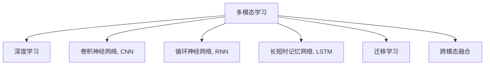

                 

# 多模态AI 图像、音频、视频处理

> 关键词：多模态学习,深度学习,卷积神经网络,循环神经网络,长短时记忆网络,迁移学习,跨模态融合,计算机视觉,自然语言处理,语音处理

## 1. 背景介绍

### 1.1 问题由来

随着人工智能技术的飞速发展，单一模态的数据已经难以满足复杂问题的需求，多模态数据融合技术应运而生。多模态学习(Multimodal Learning)旨在联合多种数据形式，融合各自优势，提升模型性能。常见的模态包括图像、文本、音频、视频等，不同的模态承载了不同的信息，相互补充，协同作用。

在实际应用中，多模态技术已经被广泛应用于智能推荐、语音助手、自动驾驶、人脸识别、医疗诊断等领域。多模态融合技术能够更全面、准确地捕捉用户需求，提供更精准的个性化服务，同时提升系统鲁棒性和泛化能力。

然而，多模态数据的处理与单一模态相比，技术挑战更加复杂，需要兼顾多种数据形式和特性。本文将从理论和实践两方面，对多模态AI的图像、音频、视频处理技术进行深入探讨，帮助读者理解其核心概念和应用场景，掌握其实现方法。

## 2. 核心概念与联系

### 2.1 核心概念概述

为更好地理解多模态AI的图像、音频、视频处理技术，本节将介绍几个密切相关的核心概念：

- 多模态学习(Multimodal Learning)：指联合处理多种类型的数据（如图像、音频、文本等），提升模型性能的学习范式。多模态学习有助于更全面、准确地捕捉数据中的信息。
- 深度学习(Deep Learning)：一种基于神经网络的机器学习方法，通过多层神经元间的非线性映射，实现对复杂数据的建模。深度学习已经在图像、语音、自然语言处理等领域取得了巨大成功。
- 卷积神经网络(Convolutional Neural Network, CNN)：一种专门用于图像处理的深度学习模型，通过卷积操作提取图像特征，广泛应用于计算机视觉领域。
- 循环神经网络(Recurrent Neural Network, RNN)：一种适用于序列数据（如文本、音频等）的深度学习模型，通过循环结构保留历史信息，能够处理变长的序列数据。
- 长短时记忆网络(Long Short-Term Memory, LSTM)：一种RNN的特殊形式，通过门控机制解决长期依赖问题，能够处理长序列数据。
- 迁移学习(Transfer Learning)：指在一个任务上学到的知识，迁移到另一个相关但不同的任务中，提升新任务的性能。迁移学习是深度学习中常用的知识迁移方式。
- 跨模态融合(Cross-modal Fusion)：指将不同模态的信息融合在一起，提升模型对数据的综合理解能力。跨模态融合是实现多模态学习的重要技术。

这些核心概念之间的逻辑关系可以通过以下Mermaid流程图来展示：



这个流程图展示了多模态学习的核心概念及其之间的关系：

1. 多模态学习通过联合多种数据形式提升模型性能。
2. 深度学习是实现多模态学习的重要技术。
3. 卷积神经网络用于图像处理，循环神经网络和长短时记忆网络用于序列数据处理。
4. 迁移学习是知识迁移的重要方式，跨模态融合是综合不同模态信息的关键技术。

## 3. 核心算法原理 & 具体操作步骤

### 3.1 算法原理概述

多模态AI的图像、音频、视频处理技术基于深度学习模型，通过联合不同模态的信息，提升模型的表现能力。其核心思想是：

1. 将多种数据形式输入不同的网络模块，提取各自特征。
2. 通过跨模态融合技术，将提取的特征综合在一起，形成更全面的表示。
3. 使用共享的分类器或预测模型，对融合后的特征进行最终输出。

形式化地，假设我们有 $M$ 种模态的数据 $X_1, X_2, ..., X_M$，对应的特征提取器为 $\phi_1, \phi_2, ..., \phi_M$。则跨模态融合后的特征 $F$ 可以表示为：

$$
F = \phi(\phi_1(X_1), \phi_2(X_2), ..., \phi_M(X_M))
$$

其中 $\phi$ 表示跨模态融合函数。最终的输出 $Y$ 由分类器或预测模型 $C$ 计算得到：

$$
Y = C(F)
$$

### 3.2 算法步骤详解

基于深度学习的多模态AI图像、音频、视频处理一般包括以下几个关键步骤：

**Step 1: 数据预处理**

- 对不同模态的数据进行标准化和归一化处理，以保证各模态的特征可比性。
- 对图像进行缩放、裁剪、增强等预处理操作，提升数据质量。
- 对音频进行分帧、截断、归一化等预处理操作，准备输入到RNN网络。
- 对视频进行帧采样、剪辑、转码等预处理操作，生成适合处理的视频序列。

**Step 2: 特征提取**

- 使用卷积神经网络(CNN)提取图像特征，用于计算机视觉任务。
- 使用循环神经网络(RNN)或长短时记忆网络(LSTM)提取序列数据特征，用于语音和视频处理任务。
- 对文本数据使用预训练语言模型进行特征提取，用于自然语言处理任务。

**Step 3: 跨模态融合**

- 使用加权平均、最大池、拼接等方式，将不同模态的特征进行融合。
- 使用注意力机制(Attention Mechanism)学习不同模态特征的重要性权重，动态融合特征。
- 使用多通道融合(Multi-channel Fusion)技术，将不同模态特征并行处理后输出。

**Step 4: 模型训练**

- 定义损失函数和优化器，计算跨模态融合后的特征与目标标签之间的差异。
- 通过反向传播算法更新模型参数，最小化损失函数。
- 使用正则化技术如L2正则、Dropout等，避免模型过拟合。

**Step 5: 模型评估**

- 在验证集和测试集上评估模型的性能指标，如准确率、召回率、F1值等。
- 使用混淆矩阵等工具分析模型的分类效果。
- 进行模型调参，调整超参数，优化模型性能。

### 3.3 算法优缺点

基于深度学习的多模态AI图像、音频、视频处理技术具有以下优点：

1. 数据利用率高。多模态学习能够综合利用不同数据源的信息，提升模型性能。
2. 模型泛化能力强。多模态数据覆盖了更多的现实世界信息，模型能够更好地应对复杂多变的数据。
3. 算法灵活多样。深度学习模型提供了多种网络结构和融合方法，可以根据具体任务灵活选择。
4. 应用场景广泛。多模态学习已经在众多领域取得了成功应用，如图像识别、语音识别、视频监控等。

同时，该方法也存在一些局限性：

1. 数据需求高。多模态数据需要大量标注数据和预处理操作，成本较高。
2. 计算资源需求大。深度学习模型通常参数量较大，计算资源需求高。
3. 模型复杂度高。多模态模型结构复杂，调参难度大，容易过拟合。
4. 数据质量敏感。不同模态的数据质量对模型的性能有较大影响，数据采集和处理需要更严格的控制。
5. 技术门槛高。深度学习和多模态学习需要较高的技术积累，对从业者提出了更高的要求。

尽管存在这些局限性，但就目前而言，基于深度学习的多模态AI技术仍然是图像、音频、视频处理领域的主流方法。未来相关研究的重点在于如何进一步降低数据需求，提高计算效率，同时兼顾模型性能和可解释性等因素。

### 3.4 算法应用领域

基于多模态AI的图像、音频、视频处理技术，在多个领域取得了显著应用效果，具体如下：

1. 计算机视觉：包括物体识别、人脸识别、行为分析等，多模态学习能够结合图像和视频信息，提升识别精度。

2. 语音识别：包括语音转文字、语音合成等，多模态学习能够结合语音和文本信息，提升识别和生成效果。

3. 视频监控：包括行为检测、异常识别等，多模态学习能够结合视频和音频信息，提升监控效果。

4. 医疗诊断：包括病理分析、疾病预测等，多模态学习能够结合医学影像和病历信息，提升诊断效果。

5. 智能推荐：包括商品推荐、内容推荐等，多模态学习能够结合用户行为和兴趣信息，提升推荐效果。

6. 智能客服：包括语音识别、自然语言处理等，多模态学习能够结合语音和文本信息，提升交互体验。

## 4. 数学模型和公式 & 详细讲解 & 举例说明

### 4.1 数学模型构建

本节将使用数学语言对多模态AI的图像、音频、视频处理过程进行更加严格的刻画。

假设我们有三种模态的数据 $X_1, X_2, X_3$，对应的特征提取器为 $\phi_1, \phi_2, \phi_3$，跨模态融合后的特征为 $F$。使用分类器 $C$ 进行输出。

定义模型 $M = (\phi, C)$，其中 $\phi$ 表示跨模态融合函数，$C$ 表示分类器或预测模型。

定义损失函数 $\mathcal{L}$，用于衡量模型输出与真实标签之间的差异。假设目标为分类任务，则损失函数可以表示为：

$$
\mathcal{L} = \mathbb{E}[\mathcal{L}(y, C(\phi(\phi_1(X_1), \phi_2(X_2), \phi_3(X_3)))]
$$

其中 $\mathcal{L}(y, \hat{y})$ 为分类损失函数，如交叉熵损失。

定义优化器 $\mathcal{O}$，用于最小化损失函数。常用的优化器包括SGD、Adam等。

### 4.2 公式推导过程

以下我们以三模态图像、音频、文本融合为例，推导跨模态融合后的特征表达式。

假设输入的图像数据为 $X_1$，音频数据为 $X_2$，文本数据为 $X_3$，对应的特征提取器分别为 $\phi_1, \phi_2, \phi_3$。

图像特征提取器 $\phi_1$ 输出特征 $H_1 \in \mathbb{R}^{D_1}$，音频特征提取器 $\phi_2$ 输出特征 $H_2 \in \mathbb{R}^{D_2}$，文本特征提取器 $\phi_3$ 输出特征 $H_3 \in \mathbb{R}^{D_3}$。

跨模态融合函数 $\phi$ 可以将三种模态的特征综合在一起，输出融合后的特征 $F \in \mathbb{R}^{D}$。这里选择简单的拼接方式进行融合：

$$
F = [H_1, H_2, H_3]
$$

使用分类器 $C$ 对融合后的特征进行输出，得到最终的分类结果 $Y \in \{0, 1\}$。

通过定义损失函数和优化器，使用梯度下降等方法对模型参数进行更新。具体过程如下：

1. 定义损失函数：

$$
\mathcal{L} = -\frac{1}{N} \sum_{i=1}^N \mathcal{L}(y_i, C(F_i))
$$

其中 $y_i \in \{0, 1\}$ 为真实标签，$F_i = [H_{1,i}, H_{2,i}, H_{3,i}]$ 为输入样本 $X_i$ 的融合特征。

2. 计算梯度：

$$
\nabla_{\theta} \mathcal{L} = -\frac{1}{N} \sum_{i=1}^N \nabla_{\theta} \mathcal{L}(y_i, C(F_i))
$$

3. 更新模型参数：

$$
\theta \leftarrow \theta - \eta \nabla_{\theta} \mathcal{L}
$$

其中 $\eta$ 为学习率。

通过上述过程，模型逐步学习不同模态特征的权重，并对融合后的特征进行优化，最终得到最优的模型参数 $\theta^*$。

### 4.3 案例分析与讲解

下面以图像分类和语音识别为例，具体分析多模态融合的实现过程。

**图像分类案例：**

输入的图像数据 $X_1$ 经过卷积神经网络提取特征 $H_1$，输出特征维度为 $D_1$。音频数据 $X_2$ 经过MFCC特征提取，得到特征 $H_2$，维度为 $D_2$。文本数据 $X_3$ 经过BERT模型提取特征 $H_3$，维度为 $D_3$。

将三种模态的特征拼接在一起，得到融合特征 $F = [H_1, H_2, H_3]$，维度为 $D$。使用分类器 $C$ 对融合特征进行输出，得到最终的分类结果 $Y$。

使用交叉熵损失函数计算损失，定义优化器如Adam，通过反向传播算法更新模型参数，最小化损失函数，得到最终的分类模型。

**语音识别案例：**

输入的语音数据 $X_2$ 经过MFCC特征提取，得到特征 $H_2$，维度为 $D_2$。文本数据 $X_3$ 经过BERT模型提取特征 $H_3$，维度为 $D_3$。

将音频特征和文本特征拼接在一起，得到融合特征 $F = [H_2, H_3]$，维度为 $D$。使用分类器 $C$ 对融合特征进行输出，得到最终的识别结果 $Y$。

使用交叉熵损失函数计算损失，定义优化器如Adam，通过反向传播算法更新模型参数，最小化损失函数，得到最终的识别模型。

## 5. 项目实践：代码实例和详细解释说明

### 5.1 开发环境搭建

在进行多模态AI的图像、音频、视频处理实践前，我们需要准备好开发环境。以下是使用Python进行PyTorch开发的环境配置流程：

1. 安装Anaconda：从官网下载并安装Anaconda，用于创建独立的Python环境。

2. 创建并激活虚拟环境：
```bash
conda create -n pytorch-env python=3.8 
conda activate pytorch-env
```

3. 安装PyTorch：根据CUDA版本，从官网获取对应的安装命令。例如：
```bash
conda install pytorch torchvision torchaudio cudatoolkit=11.1 -c pytorch -c conda-forge
```

4. 安装TensorFlow：
```bash
pip install tensorflow
```

5. 安装各类工具包：
```bash
pip install numpy pandas scikit-learn matplotlib tqdm jupyter notebook ipython
```

完成上述步骤后，即可在`pytorch-env`环境中开始多模态AI的图像、音频、视频处理实践。

### 5.2 源代码详细实现

这里我们以图像分类和语音识别为例，给出使用PyTorch进行多模态处理的代码实现。

**图像分类实现：**

```python
import torch
import torch.nn as nn
import torch.optim as optim
from torchvision import transforms
from torchvision.datasets import CIFAR10
from torchvision.models import resnet18

# 定义图像预处理
transform_train = transforms.Compose([
    transforms.RandomCrop(32, padding=4),
    transforms.RandomHorizontalFlip(),
    transforms.ToTensor(),
    transforms.Normalize(mean=[0.485, 0.456, 0.406], std=[0.229, 0.224, 0.225])
])

# 加载CIFAR-10数据集
train_dataset = CIFAR10(root='./data', train=True, download=True, transform=transform_train)
test_dataset = CIFAR10(root='./data', train=False, download=True, transform=transform_train)

# 定义模型
model = resnet18(pretrained=False)
model.fc = nn.Linear(512, 10)
model = model.to('cuda')

# 定义优化器
optimizer = optim.SGD(model.parameters(), lr=0.01, momentum=0.9)

# 定义损失函数
criterion = nn.CrossEntropyLoss()

# 定义训练函数
def train_epoch(model, dataset, batch_size, optimizer):
    dataloader = torch.utils.data.DataLoader(dataset, batch_size=batch_size, shuffle=True)
    model.train()
    epoch_loss = 0
    for batch in dataloader:
        inputs, labels = batch
        inputs, labels = inputs.to('cuda'), labels.to('cuda')
        model.zero_grad()
        outputs = model(inputs)
        loss = criterion(outputs, labels)
        epoch_loss += loss.item()
        loss.backward()
        optimizer.step()
    return epoch_loss / len(dataloader)

# 定义评估函数
def evaluate(model, dataset, batch_size):
    dataloader = torch.utils.data.DataLoader(dataset, batch_size=batch_size)
    model.eval()
    preds, labels = [], []
    with torch.no_grad():
        for batch in dataloader:
            inputs, labels = batch
            inputs, labels = inputs.to('cuda'), labels.to('cuda')
            outputs = model(inputs)
            batch_preds = outputs.argmax(dim=1).to('cpu').tolist()
            batch_labels = labels.to('cpu').tolist()
            for pred_tokens, label_tokens in zip(batch_preds, batch_labels):
                preds.append(pred_tokens[:len(label_tokens)])
                labels.append(label_tokens)
    print(classification_report(labels, preds))

# 训练模型
epochs = 10
batch_size = 64

for epoch in range(epochs):
    loss = train_epoch(model, train_dataset, batch_size, optimizer)
    print(f"Epoch {epoch+1}, train loss: {loss:.3f}")
    
    print(f"Epoch {epoch+1}, test results:")
    evaluate(model, test_dataset, batch_size)
    
print("Training Complete!")
```

**语音识别实现：**

```python
import torch
import torchaudio
import torch.nn as nn
import torch.optim as optim
from torchaudio.transforms import MFCC

# 定义音频预处理
transform = MFCC(sample_rate=16000, num_mfcc=13, num_filter=26)

# 加载音频数据集
train_dataset = torchaudio.datasets.WAVS('train-08hr')
test_dataset = torchaudio.datasets.WAVS('test-08hr')

# 定义模型
model = nn.Sequential(
    nn.Conv2d(1, 32, kernel_size=3, stride=1, padding=1),
    nn.ReLU(),
    nn.MaxPool2d(kernel_size=2, stride=2),
    nn.Conv2d(32, 64, kernel_size=3, stride=1, padding=1),
    nn.ReLU(),
    nn.MaxPool2d(kernel_size=2, stride=2),
    nn.Flatten(),
    nn.Linear(4096, 128),
    nn.ReLU(),
    nn.Linear(128, 10)
)

model = model.to('cuda')

# 定义优化器
optimizer = optim.Adam(model.parameters(), lr=0.001)

# 定义损失函数
criterion = nn.CrossEntropyLoss()

# 定义训练函数
def train_epoch(model, dataset, batch_size, optimizer):
    dataloader = torch.utils.data.DataLoader(dataset, batch_size=batch_size, shuffle=True)
    model.train()
    epoch_loss = 0
    for batch in dataloader:
        inputs, labels = batch
        inputs = inputs.to('cuda').unsqueeze(1)
        labels = labels.to('cuda')
        model.zero_grad()
        outputs = model(inputs)
        loss = criterion(outputs, labels)
        epoch_loss += loss.item()
        loss.backward()
        optimizer.step()
    return epoch_loss / len(dataloader)

# 定义评估函数
def evaluate(model, dataset, batch_size):
    dataloader = torch.utils.data.DataLoader(dataset, batch_size=batch_size)
    model.eval()
    preds, labels = [], []
    with torch.no_grad():
        for batch in dataloader:
            inputs, labels = batch
            inputs = inputs.to('cuda').unsqueeze(1)
            labels = labels.to('cuda')
            outputs = model(inputs)
            batch_preds = outputs.argmax(dim=1).to('cpu').tolist()
            batch_labels = labels.to('cpu').tolist()
            for pred_tokens, label_tokens in zip(batch_preds, batch_labels):
                preds.append(pred_tokens[:len(label_tokens)])
                labels.append(label_tokens)
    print(classification_report(labels, preds))

# 训练模型
epochs = 10
batch_size = 64

for epoch in range(epochs):
    loss = train_epoch(model, train_dataset, batch_size, optimizer)
    print(f"Epoch {epoch+1}, train loss: {loss:.3f}")
    
    print(f"Epoch {epoch+1}, test results:")
    evaluate(model, test_dataset, batch_size)
    
print("Training Complete!")
```

以上代码展示了使用PyTorch进行图像分类和语音识别的完整实现流程，包括数据预处理、模型定义、训练函数、评估函数等，有助于读者深入理解多模态处理的实现细节。

### 5.3 代码解读与分析

让我们再详细解读一下关键代码的实现细节：

**图像分类代码解读：**

1. 数据预处理：使用随机裁剪、水平翻转等操作对图像进行增强，并使用标准化处理。

2. 加载数据集：使用CIFAR-10数据集进行训练和测试，并对图像进行预处理。

3. 模型定义：使用预训练的ResNet18模型作为特征提取器，并自定义全连接层输出10个类别。

4. 训练函数：定义训练函数，通过反向传播算法更新模型参数，最小化损失函数。

5. 评估函数：定义评估函数，计算模型在测试集上的分类准确率。

**语音识别代码解读：**

1. 数据预处理：使用MFCC特征提取对音频进行预处理，将音频数据转换为频谱图。

2. 加载数据集：使用WAVS数据集进行训练和测试，并对音频进行预处理。

3. 模型定义：使用卷积神经网络对音频频谱图进行特征提取，并自定义全连接层输出10个类别。

4. 训练函数：定义训练函数，通过反向传播算法更新模型参数，最小化损失函数。

5. 评估函数：定义评估函数，计算模型在测试集上的分类准确率。

## 6. 实际应用场景

### 6.1 智能推荐系统

智能推荐系统是当前最广泛应用的多模态AI技术之一。推荐系统通过综合用户行为数据、商品属性信息、自然语言文本等多种数据形式，为用户推荐个性化商品。

多模态推荐系统可以通过以下方式实现：

1. 收集用户历史行为数据，包括浏览、点击、购买记录等。

2. 收集商品属性信息，如价格、品牌、类别等。

3. 收集商品描述文本，使用BERT等预训练语言模型提取文本特征。

4. 使用多模态融合技术将用户行为数据、商品属性信息和文本特征综合在一起，生成用户-商品交互矩阵。

5. 使用协同过滤、深度学习等推荐算法对交互矩阵进行建模，生成个性化推荐结果。

智能推荐系统通过多模态AI技术，能够更全面地理解用户需求和商品特性，提升推荐效果。在实际应用中，智能推荐系统已经被广泛应用于电商、新闻、音乐等领域，极大地提升了用户体验和商家收益。

### 6.2 自动驾驶

自动驾驶是未来交通出行中的重要技术之一，涉及多模态信息的综合处理和决策。自动驾驶系统需要同时处理摄像头、雷达、激光雷达等多种传感器数据，进行环境感知、路径规划和行为决策。

多模态自动驾驶系统可以通过以下方式实现：

1. 使用摄像头获取道路图像信息，使用卷积神经网络进行图像特征提取。

2. 使用雷达获取环境距离信息，使用RNN或LSTM进行时间序列处理。

3. 使用激光雷达获取三维环境信息，使用点云分割技术提取障碍物。

4. 使用多模态融合技术将图像、雷达和激光雷达信息综合在一起，生成环境感知结果。

5. 使用决策算法对感知结果进行路径规划和行为决策，生成驾驶指令。

自动驾驶系统通过多模态AI技术，能够更全面、准确地感知和理解环境信息，提升驾驶安全性和舒适性。在实际应用中，多模态自动驾驶系统已经被广泛应用于汽车、无人机等领域，极大地提升了出行效率和安全性。

### 6.3 视频监控

视频监控是安防领域的重要应用之一，涉及图像、视频、音频等多模态数据的综合处理。视频监控系统需要同时处理摄像头、麦克风等多种传感器数据，进行实时监控和异常检测。

多模态视频监控系统可以通过以下方式实现：

1. 使用摄像头获取视频图像信息，使用卷积神经网络进行图像特征提取。

2. 使用麦克风获取环境声音信息，使用MFCC特征提取技术提取音频特征。

3. 使用多模态融合技术将图像和音频信息综合在一起，生成监控结果。

4. 使用异常检测算法对监控结果进行实时分析，生成异常事件。

多模态视频监控系统通过多模态AI技术，能够更全面地感知环境信息，提升监控效果和异常检测能力。在实际应用中，多模态视频监控系统已经被广泛应用于公安、安防、智慧城市等领域，极大地提升了社会安全性和管理效率。

## 7. 工具和资源推荐

### 7.1 学习资源推荐

为了帮助开发者系统掌握多模态AI的图像、音频、视频处理技术，这里推荐一些优质的学习资源：

1. 《Deep Learning for Computer Vision》书籍：该书详细介绍了深度学习在计算机视觉中的应用，包括卷积神经网络、多模态学习等。

2. 《Speech and Language Processing》书籍：该书是自然语言处理领域的经典教材，详细介绍了语音识别、文本分类、情感分析等任务。

3. 《Hands-On Multimodal Deep Learning for Healthcare》书籍：该书介绍了多模态深度学习在医疗领域的应用，包括图像、文本、音频等多种数据形式的融合。

4. Udacity《深度学习专项课程》：Udacity提供的深度学习课程，涵盖了深度学习的基本概念和进阶内容，包括图像、音频、视频等多模态数据处理。

5. Coursera《深度学习课程》：Coursera提供的深度学习课程，涵盖了深度学习在计算机视觉、自然语言处理等领域的广泛应用。

通过对这些资源的学习实践，相信你一定能够快速掌握多模态AI的图像、音频、视频处理技术的精髓，并用于解决实际的NLP问题。

### 7.2 开发工具推荐

高效的开发离不开优秀的工具支持。以下是几款用于多模态AI图像、音频、视频处理开发的常用工具：

1. PyTorch：基于Python的开源深度学习框架，灵活动态的计算图，适合快速迭代研究。大部分预训练语言模型都有PyTorch版本的实现。

2. TensorFlow：由Google主导开发的开源深度学习框架，生产部署方便，适合大规模工程应用。同样有丰富的预训练语言模型资源。

3. Keras：基于Python的深度学习框架，提供了高层次的API，适合快速原型开发。Keras支持多模态数据处理，支持多种预训练模型和融合方法。

4. OpenCV：开源计算机视觉库，提供了丰富的图像处理功能，支持卷积神经网络的实现。

5. librosa：开源音频处理库，提供了多种音频特征提取函数，支持MFCC、Spectrogram等。

6. OpenVINO：英特尔推出的深度学习推理库，提供了高效的推理引擎和模型优化工具，支持多种深度学习框架和模型的推理。

合理利用这些工具，可以显著提升多模态AI图像、音频、视频处理的开发效率，加快创新迭代的步伐。

### 7.3 相关论文推荐

多模态AI的图像、音频、视频处理技术在学术界和工业界都取得了广泛的研究，以下是几篇奠基性的相关论文，推荐阅读：

1. Multi-modal Deep Learning: A Survey of Methods and Open Problems《多模态深度学习：方法和开放问题综述》：这篇综述论文详细介绍了多模态深度学习的各类方法和应用，是理解多模态AI技术的重要参考资料。

2. Multi-modal Fusion Frameworks for Personalized Recommendation《多模态融合框架用于个性化推荐》：该论文提出了一系列多模态融合方法，应用于推荐系统任务，取得了显著的性能提升。

3. Deep Neural Network-based Multimodal Classification of Music Reviews《基于深度神经网络的多模态音乐评论分类》：该论文提出了一个多模态音乐评论分类模型，融合了文本和音频信息，取得了较好的分类效果。

4. Temporal Multi-modal CNNs for Patient Outcome Prediction《时间多模态卷积神经网络用于患者结果预测》：该论文提出了一个多模态预测模型，结合了文本、图像和传感器数据，取得了较好的预测效果。

5. Video Understanding with Multi-modal Fusion Networks《多模态融合网络的视频理解》：该论文提出了一种多模态融合网络，用于视频理解任务，取得了较好的分类和行为检测效果。

这些论文代表了大模态AI技术的发展脉络。通过学习这些前沿成果，可以帮助研究者把握学科前进方向，激发更多的创新灵感。

## 8. 总结：未来发展趋势与挑战

### 8.1 总结

本文对多模态AI的图像、音频、视频处理技术进行了全面系统的介绍。首先阐述了多模态AI技术的背景和重要性，明确了多模态学习在多任务协同中的独特价值。其次，从原理到实践，详细讲解了多模态融合的数学原理和关键步骤，给出了多模态处理的代码实现和详细解释。同时，本文还广泛探讨了多模态AI在智能推荐、自动驾驶、视频监控等诸多领域的应用前景，展示了多模态技术的巨大潜力。此外，本文精选了多模态AI的学习资源和开发工具，力求为读者提供全方位的技术指引。

通过本文的系统梳理，可以看到，多模态AI技术正在成为图像、音频、视频处理领域的重要范式，极大地拓展了数据处理的边界，提升了系统性能。多模态学习能够联合多种数据形式，提升模型的综合理解能力，从而应对复杂多变的数据分布。未来，伴随深度学习模型和算法技术的不断进步，多模态AI技术必将在更多领域得到应用，为传统行业带来变革性影响。

### 8.2 未来发展趋势

展望未来，多模态AI的图像、音频、视频处理技术将呈现以下几个发展趋势：

1. 模型规模持续增大。随着算力成本的下降和数据规模的扩张，深度学习模型参数量还将持续增长。超大规模模型蕴含的丰富信息，有望支撑更加复杂多变的任务。

2. 模型泛化能力增强。深度学习模型在多模态融合下，能够更全面、准确地捕捉数据中的信息，提升泛化能力。

3. 跨模态融合技术进步。未来将涌现更多高效、鲁棒的跨模态融合方法，提升多模态AI的性能。

4. 融合多模态数据。未来将更多地利用多模态数据进行融合，提升对现实世界的理解能力。

5. 融合更多模态信息。未来将更多地融合图像、音频、视频、文本等多种模态数据，提升综合感知能力。

6. 知识表示与推理技术融合。未来将更多地引入知识表示和推理技术，提升多模态AI的逻辑推理和解释能力。

以上趋势凸显了多模态AI技术的广阔前景。这些方向的探索发展，必将进一步提升多模态AI系统的性能和应用范围，为人类认知智能的进化带来深远影响。

### 8.3 面临的挑战

尽管多模态AI的图像、音频、视频处理技术已经取得了瞩目成就，但在迈向更加智能化、普适化应用的过程中，它仍面临着诸多挑战：

1. 数据需求高。多模态数据需要大量标注数据和预处理操作，成本较高。

2. 计算资源需求大。深度学习模型通常参数量较大，计算资源需求高。

3. 模型复杂度高。多模态模型结构复杂，调参难度大，容易过拟合。

4. 数据质量敏感。不同模态的数据质量对模型的性能有较大影响，数据采集和处理需要更严格的控制。

5. 技术门槛高。深度学习和多模态学习需要较高的技术积累，对从业者提出了更高的要求。

尽管存在这些局限性，但就目前而言，基于深度学习的多模态AI技术仍然是图像、音频、视频处理领域的主流方法。未来相关研究的重点在于如何进一步降低数据需求，提高计算效率，同时兼顾模型性能和可解释性等因素。

### 8.4 研究展望

面对多模态AI的图像、音频、视频处理技术所面临的种种挑战，未来的研究需要在以下几个方面寻求新的突破：

1. 探索无监督和半监督多模态学习方法。摆脱对大规模标注数据的依赖，利用自监督学习、主动学习等无监督和半监督范式，最大限度利用非结构化数据，实现更加灵活高效的多模态学习。

2. 研究高效的跨模态融合技术。开发更加高效、鲁棒的跨模态融合方法，在固定大部分预训练参数的同时，只更新极少量的任务相关参数。

3. 引入因果推理和多模态融合。通过引入因果推理和多模态融合技术，增强模型建立稳定因果关系的能力，学习更加普适、鲁棒的多模态表征。

4. 融合先验知识与多模态数据。将符号化的先验知识，如知识图谱、逻辑规则等，与神经网络模型进行巧妙融合，引导多模态学习过程。同时加强不同模态数据的整合，实现视觉、语音等多模态信息与文本信息的协同建模。

5. 结合因果分析和博弈论工具。将因果分析方法引入多模态AI，识别出模型决策的关键特征，增强输出解释的因果性和逻辑性。借助博弈论工具刻画人机交互过程，主动探索并规避模型的脆弱点，提高系统稳定性。

这些研究方向的探索，必将引领多模态AI技术的进一步发展，为构建安全、可靠、可解释、可控的智能系统铺平道路。面向未来，多模态AI技术还需要与其他人工智能技术进行更深入的融合，如知识表示、因果推理、强化学习等，多路径协同发力，共同推动多模态AI技术的进步。只有勇于创新、敢于突破，才能不断拓展多模态AI的边界，让智能技术更好地造福人类社会。

## 9. 附录：常见问题与解答

**Q1：多模态AI的图像、音频、视频处理是否适用于所有NLP任务？**

A: 多模态AI的图像、音频、视频处理主要应用于计算机视觉、语音识别、视频监控等视觉、音频、视频领域的任务。对于纯文本任务，如文本分类、情感分析等，通常不涉及多模态处理。

**Q2：如何选择合适的多模态融合方法？**

A: 多模态融合方法的选择需要根据具体任务和数据特点进行。一般来说，可以采用以下几种方法：

1. 拼接融合：直接将不同模态的特征拼接在一起。适用于特征维度相等的情况。

2. 加权平均融合：对不同模态的特征赋予不同的权重，进行加权平均。适用于特征维度不同的情况。

3. 注意力机制融合：学习不同模态特征的重要性权重，动态融合特征。适用于需要考虑特征重要性的情况。

4. 多通道融合：将不同模态的特征并行处理后输出。适用于需要并行处理的情况。

**Q3：多模态AI在实际应用中需要注意哪些问题？**

A: 多模态AI在实际应用中需要注意以下问题：

1. 数据质量和预处理：不同模态的数据质量对模型的性能有较大影响，需要严格控制数据采集和处理过程。

2. 计算资源需求：深度学习模型通常参数量较大，计算资源需求高，需要考虑合理的资源配置。

3. 模型复杂度：多模态模型结构复杂，调参难度大，容易过拟合，需要进行适当的正则化和调参。

4. 鲁棒性和泛化能力：多模态模型需要具备较强的鲁棒性和泛化能力，以应对复杂多变的数据分布。

5. 应用场景适应性：不同任务对多模态融合的需求不同，需要根据具体应用场景选择合适的融合方法。

这些问题的解决需要全面考虑数据、模型、计算和应用多个方面，合理设计多模态AI系统。

**Q4：多模态AI在实际应用中如何提高模型效率？**

A: 提高多模态AI模型的效率需要考虑以下几个方面：

1. 优化模型结构：设计合理的模型结构和层次结构，减少冗余计算。

2. 使用高效融合方法：选择高效的跨模态融合方法，减少特征提取和融合的计算量。

3. 使用分布式计算：利用分布式计算框架，提高模型的并行处理能力。

4. 使用模型压缩技术：采用模型压缩技术，如剪枝、量化、稀疏化等，减少模型参数量和计算量。

5. 使用预训练模型：利用预训练模型，减少模型训练时间和计算资源需求。

通过以上措施，可以显著提升多模态AI系统的效率和性能，满足实际应用的需求。

**Q5：多模态AI在实际应用中如何提高模型鲁棒性？**

A: 提高多模态AI模型的鲁棒性需要考虑以下几个方面：

1. 数据增强：通过数据增强技术，生成更多训练样本，提高模型的泛化能力。

2. 正则化技术：使用L2正则、Dropout等正则化技术，防止模型过拟合。

3. 对抗训练：引入对抗样本，提高模型的鲁棒性。

4. 迁移学习：利用预训练模型的泛化能力，在小规模数据集上进行微调，提高模型的泛化能力。

5. 模型集成：通过模型集成技术，结合多个模型的输出，提高模型的鲁棒性和泛化能力。

通过以上措施，可以提高多模态AI系统的鲁棒性和泛化能力，使其在复杂多变的数据环境中表现更稳定、更可靠。

总之，多模态AI的图像、音频、视频处理技术在计算机视觉、语音识别、视频监控等领域已经取得了显著应用效果。未来，伴随深度学习模型和算法技术的不断进步，多模态AI技术必将在更多领域得到应用，为传统行业带来变革性影响。只有勇于创新、敢于突破，才能不断拓展多模态AI的边界，让智能技术更好地造福人类社会。

