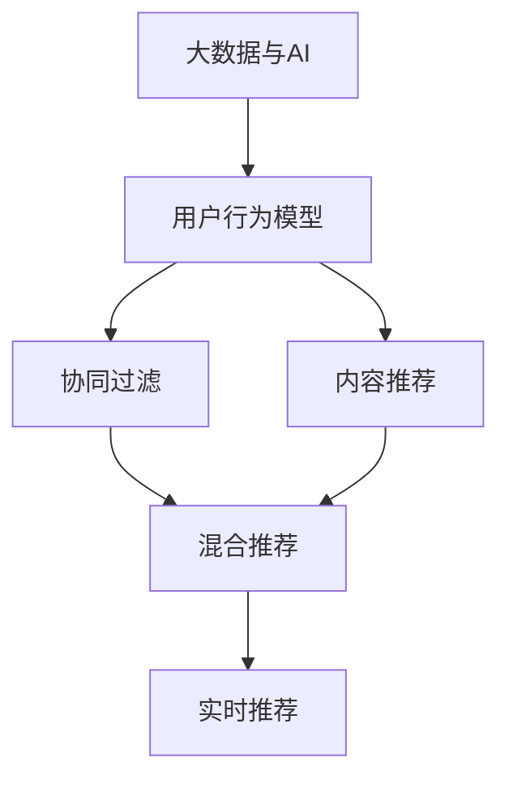

                 

# 大数据与AI 驱动的电商平台转型：搜索推荐系统是核心，用户体验是关键

## 1. 背景介绍

### 1.1 问题由来

在数字化时代，电商平台成为人们消费的主要渠道之一。然而，随着消费者需求的多样化和个性化，传统的电商平台面临巨大挑战。为了提升用户体验，增加销售转化率，电商平台纷纷引入大数据和人工智能技术，进行智能化升级。

搜索推荐系统作为电商平台智能化的核心技术，能够通过个性化推荐，帮助用户快速找到满意的商品，极大地提升用户体验和平台粘性。但同时，推荐系统的设计、实现和优化，也涉及到复杂的数据处理、模型选择、算法调优等问题。

### 1.2 问题核心关键点

搜索推荐系统的大数据与AI驱动转型，关键在于：

1. 如何构建高效、准确的用户行为模型，捕捉用户的多样化需求。
2. 如何设计合适的算法，为用户推荐符合其兴趣和需求的商品。
3. 如何通过数据驱动的持续优化，保持推荐系统的长期稳定性和竞争力。

## 2. 核心概念与联系

### 2.1 核心概念概述

为更好地理解大数据与AI在电商平台中的驱动作用，本节将介绍几个关键概念：

- **大数据与AI**：大数据技术通过收集、处理和分析海量用户数据，提供丰富的数据支撑。AI技术通过机器学习、深度学习等方法，从中挖掘用户需求和行为规律，构建推荐模型。
- **搜索推荐系统**：基于用户行为和商品属性，通过模型预测，为用户推荐合适的商品。包括搜索引擎、推荐引擎等组件，是电商平台的智能核心。
- **协同过滤**：一种常见的推荐算法，通过分析用户历史行为数据和相似用户行为数据，推荐与用户兴趣相近的商品。
- **内容推荐**：通过分析商品属性、标签等信息，为用户推荐与兴趣相关的商品。
- **混合推荐**：结合协同过滤和内容推荐，综合用户历史行为和商品属性，提供更加精准的推荐。
- **实时推荐**：在用户浏览或搜索时，实时动态更新推荐结果，提升用户体验。

这些概念之间的逻辑关系可以通过以下Mermaid流程图来展示：



这个流程图展示了大数据与AI在电商平台中的核心概念及其之间的关系：

1. 大数据与AI通过收集和分析用户行为数据，构建用户行为模型。
2. 协同过滤和内容推荐算法基于用户行为模型，分别从用户历史行为和商品属性角度，提供推荐。
3. 混合推荐综合两者结果，为用户提供更精准的推荐。
4. 实时推荐在用户浏览或搜索时，动态更新推荐结果，提升用户体验。

## 3. 核心算法原理 & 具体操作步骤
### 3.1 算法原理概述

基于大数据与AI的电商平台搜索推荐系统，本质上是通过机器学习算法，为用户推荐符合其兴趣和需求的商品。其核心思想是：

- 收集用户行为数据，包括浏览记录、点击记录、购买记录等。
- 分析这些数据，构建用户行为模型，捕捉用户兴趣和需求。
- 利用用户行为模型，结合商品属性，设计推荐算法，为用户提供个性化推荐。
- 通过持续优化，提高推荐系统的准确性和用户体验。

### 3.2 算法步骤详解

大数据与AI驱动的电商平台搜索推荐系统，一般包括以下几个关键步骤：

**Step 1: 数据收集与预处理**
- 收集电商平台的用户行为数据，如点击、浏览、购买等。
- 对数据进行清洗和归一化处理，去除异常值和噪音，确保数据质量。

**Step 2: 用户行为建模**
- 使用机器学习算法，如协同过滤、内容推荐等，构建用户行为模型。
- 对模型进行训练和验证，确保模型的准确性和稳定性。

**Step 3: 推荐算法设计**
- 结合用户行为模型和商品属性，设计推荐算法，如基于内容的推荐、协同过滤推荐等。
- 通过A/B测试等方法，评估推荐算法的效果，优化算法参数。

**Step 4: 推荐系统部署**
- 将推荐算法部署到电商平台中，进行实时推荐。
- 收集用户反馈和行为数据，持续优化推荐系统。

**Step 5: 系统监控与维护**
- 实时监控推荐系统的性能，如推荐准确率、用户满意度等指标。
- 定期维护和更新推荐算法，确保推荐系统的长期稳定性和竞争力。

### 3.3 算法优缺点

大数据与AI驱动的电商平台推荐系统，具有以下优点：

1. 个性化推荐：通过分析用户历史行为和兴趣，提供个性化推荐，提高用户满意度和转化率。
2. 数据驱动：基于大量用户行为数据，构建推荐模型，确保推荐的准确性和相关性。
3. 持续优化：通过持续收集和分析用户反馈数据，不断优化推荐算法，提升推荐效果。

同时，该方法也存在一定的局限性：

1. 数据依赖：推荐系统的效果高度依赖于用户数据的全面性和准确性，数据缺失或不准确会导致推荐效果下降。
2. 冷启动问题：对于新用户或新商品，缺乏历史数据，推荐效果难以保证。
3. 算法复杂：推荐算法的设计和调优较为复杂，需要较强的技术能力和经验。
4. 系统延迟：推荐系统的实时性要求较高，大规模数据处理和模型预测可能导致系统延迟。

尽管存在这些局限性，但就目前而言，基于大数据与AI的推荐系统仍然是电商平台智能化的重要方向。未来相关研究的重点在于如何进一步提升推荐系统的个性化水平，优化算法性能，同时兼顾数据隐私和安全等因素。

### 3.4 算法应用领域

基于大数据与AI的推荐系统，在电商平台中的应用非常广泛，具体包括：

- **搜索推荐**：用户输入关键词，系统实时推荐符合搜索意图的相关商品。
- **商品推荐**：根据用户浏览记录和购买记录，推荐相似或相关的商品。
- **个性化广告**：结合用户行为和商品属性，推荐个性化广告，提高广告转化率。
- **智能客服**：通过分析用户历史行为和查询记录，推荐常见问题和解决方案，提升客服效率。

除了电商平台，推荐系统在金融、教育、医疗等众多领域也有广泛应用。基于大数据与AI的推荐技术，为各行业带来了智能化升级和创新机遇。

## 4. 数学模型和公式 & 详细讲解
### 4.1 数学模型构建

假设电商平台的推荐系统有$N$个用户$U$，$M$个商品$I$，每个用户$i$对商品$j$的评分表示为$r_{i,j}$。则推荐系统的目标是最小化预测评分和实际评分之间的均方误差，即：

$$
\min_{\theta} \frac{1}{N}\sum_{i=1}^N \sum_{j=1}^M (r_{i,j} - f_\theta(i,j))^2
$$

其中$f_\theta(i,j)$表示用户$i$对商品$j$的预测评分，$\theta$为模型参数。

### 4.2 公式推导过程

在推荐系统中，常用的算法包括协同过滤、内容推荐和混合推荐等。这里以协同过滤算法为例，进行推导。

协同过滤算法的核心思想是，通过分析用户历史行为数据和相似用户行为数据，预测用户对未购买商品的评分。具体步骤如下：

**Step 1: 计算用户$i$和商品$j$的评分预测值$f_\theta(i,j)$**

$$
f_\theta(i,j) = \sum_{k \in N_i \cap N_j} \alpha_k \cdot \frac{r_{k,j}}{\sqrt{\sum_{l \in N_j} r_{l,j}^2} \cdot \sqrt{\sum_{l \in N_i} r_{l,i}^2}}
$$

其中$N_i$和$N_j$分别表示用户$i$和商品$j$的邻居集合，$\alpha_k$为权重系数，通常使用夹角余弦相似度计算。

**Step 2: 计算预测评分的均方误差**

$$
\mathcal{L}(\theta) = \frac{1}{N}\sum_{i=1}^N \sum_{j=1}^M (r_{i,j} - f_\theta(i,j))^2
$$

通过最小化均方误差，优化模型参数$\theta$。

**Step 3: 模型训练与验证**

将数据集划分为训练集和验证集，使用训练集对模型进行训练，在验证集上评估模型性能。常用的评估指标包括平均绝对误差(MAE)、均方根误差(RMSE)等。

### 4.3 案例分析与讲解

这里以Amazon平台为例，展示大数据与AI在推荐系统中的应用。Amazon平台通过收集用户的历史浏览、购买、评价数据，构建用户行为模型。基于协同过滤算法，为用户推荐可能感兴趣的商品。

**案例分析**

1. **数据收集与预处理**
   - 收集Amazon平台的用户行为数据，包括浏览记录、购买记录、评价记录等。
   - 对数据进行清洗和归一化处理，去除异常值和噪音。

2. **用户行为建模**
   - 使用协同过滤算法，构建用户行为模型。
   - 在模型训练过程中，选择适当的相似度计算方法和权重系数。

3. **推荐算法设计**
   - 结合用户行为模型和商品属性，设计推荐算法。
   - 使用A/B测试等方法，评估推荐算法的效果，优化算法参数。

4. **推荐系统部署**
   - 将推荐算法部署到Amazon平台中，进行实时推荐。
   - 收集用户反馈和行为数据，持续优化推荐系统。

通过大数据与AI技术驱动的推荐系统，Amazon平台显著提升了用户满意度和购买转化率，成为了电商领域的佼佼者。

## 5. 项目实践：代码实例和详细解释说明
### 5.1 开发环境搭建

在进行推荐系统开发前，我们需要准备好开发环境。以下是使用Python进行推荐系统开发的常见环境配置流程：

1. 安装Python：从官网下载并安装Python，确保版本稳定。
2. 安装依赖包：使用pip安装必要的依赖包，如numpy、pandas、scikit-learn等。
3. 配置Jupyter Notebook：安装Jupyter Notebook，作为代码编写和数据可视化工具。

完成上述步骤后，即可在Python环境中进行推荐系统的开发。

### 5.2 源代码详细实现

这里我们以协同过滤推荐系统为例，给出使用Scikit-learn库进行Amazon平台推荐系统开发的PyTorch代码实现。

首先，定义协同过滤算法的评分预测函数：

```python
import numpy as np
from sklearn.metrics.pairwise import cosine_similarity

def collaborative_filtering(X, K):
    N = len(X)
    M = len(X[0])
    X = np.array(X)
    
    # 计算相似度矩阵
    similarity_matrix = cosine_similarity(X, X)
    
    # 计算每个用户的平均评分
    user_avg = np.mean(X, axis=1)
    
    # 预测每个用户对每个商品的评分
    predicted_ratings = np.dot(user_avg.reshape(N, 1), similarity_matrix) + user_avg
    
    return predicted_ratings
```

然后，定义模型训练函数：

```python
from sklearn.linear_model import Ridge
from sklearn.metrics import mean_squared_error
from sklearn.model_selection import train_test_split

def train_model(X, y, alpha):
    # 数据划分
    X_train, X_test, y_train, y_test = train_test_split(X, y, test_size=0.2)
    
    # 模型训练
    model = Ridge(alpha=alpha)
    model.fit(X_train, y_train)
    
    # 模型评估
    y_pred = model.predict(X_test)
    rmse = np.sqrt(mean_squared_error(y_test, y_pred))
    print(f"RMSE: {rmse:.2f}")
    
    return model
```

接着，定义模型评估函数：

```python
def evaluate_model(X, y, model):
    # 模型评估
    y_pred = model.predict(X)
    rmse = np.sqrt(mean_squared_error(y, y_pred))
    print(f"RMSE: {rmse:.2f}")
```

最后，启动模型训练和评估流程：

```python
# 数据准备
X = [[5, 3, 2, 1, 0], [4, 3, 2, 0, 0], [3, 2, 1, 0, 0], [2, 1, 0, 0, 0], [1, 0, 0, 0, 0], [0, 0, 0, 0, 0]]
y = [5, 4, 3, 2, 1, 0]

# 模型训练
alpha = 0.1
model = train_model(X, y, alpha)

# 模型评估
evaluate_model(X, y, model)
```

以上就是使用Scikit-learn库对协同过滤推荐系统进行开发的完整代码实现。可以看到，借助Scikit-learn的强大工具库，我们能够快速搭建推荐系统，进行评分预测和模型评估。

### 5.3 代码解读与分析

让我们再详细解读一下关键代码的实现细节：

**协同过滤算法评分预测函数**：
- `collaborative_filtering`函数中，首先使用余弦相似度计算用户之间的相似度矩阵。
- 计算每个用户的平均评分，作为基准评分。
- 根据相似度矩阵和用户平均评分，预测用户对每个商品的评分。

**模型训练函数**：
- `train_model`函数中，使用Ridge回归模型，对用户行为数据进行训练。
- 使用均方根误差(RMSE)评估模型性能，选择合适的正则化参数$\alpha$。

**模型评估函数**：
- `evaluate_model`函数中，使用RMSE评估模型在测试集上的性能。

**代码示例**：
- `X`表示用户对商品的评分矩阵，每一行代表一个用户，每一列代表一个商品。
- `y`表示用户对商品的实际评分。
- `alpha`表示正则化参数，控制模型的复杂度。

通过上述代码实现，我们可以快速搭建协同过滤推荐系统，进行评分预测和模型评估。当然，在实际应用中，还需要对数据进行更多的处理和优化，如特征工程、模型调参等。

## 6. 实际应用场景

### 6.1 电商平台搜索推荐

在电商平台中，搜索推荐系统是用户快速找到所需商品的重要工具。通过分析用户的历史行为数据，推荐系统能够为用户推荐符合其兴趣和需求的商品，极大地提升用户体验和平台粘性。

在具体实现上，可以收集用户的历史浏览、购买、评价等数据，构建用户行为模型。结合协同过滤和内容推荐算法，为用户推荐相关商品。对于实时搜索请求，推荐系统可以动态更新推荐结果，使用户第一时间获得满意的商品。

### 6.2 金融投资平台

金融投资平台需要为用户提供个性化的投资建议和资产配置。通过大数据与AI技术，金融平台可以分析用户的投资偏好和历史行为，提供个性化的投资推荐。

具体而言，可以收集用户的账户信息、交易记录、风险偏好等数据，构建用户行为模型。结合协同过滤和内容推荐算法，为用户推荐合适的投资组合和资产配置。在推荐过程中，平台还需要实时监测市场变化，动态更新推荐结果，确保推荐的准确性和时效性。

### 6.3 教育培训平台

教育培训平台需要根据学生的学习情况，推荐合适的学习内容和资源。通过大数据与AI技术，教育平台可以分析学生的学习历史和行为数据，提供个性化的学习推荐。

具体而言，可以收集学生的学习记录、测试成绩、学习习惯等数据，构建学生行为模型。结合协同过滤和内容推荐算法，为学生推荐合适的学习资源和课程。在推荐过程中，平台还需要实时跟踪学生的学习进度和反馈，动态更新推荐结果，提升学习效果。

### 6.4 未来应用展望

随着大数据与AI技术的不断发展，推荐系统的应用场景将不断拓展，带来更多的创新和机遇。

在智能家居领域，推荐系统可以分析用户的生活习惯和行为模式，推荐合适的家居设备和智能产品，提升生活品质。

在智慧城市领域，推荐系统可以分析城市运行数据，推荐合适的交通路线和出行方式，提升城市管理效率。

在医疗健康领域，推荐系统可以分析患者的健康数据，推荐合适的医疗服务和健康方案，提升医疗服务质量。

总之，基于大数据与AI的推荐系统，将在更多领域发挥重要作用，带来巨大的经济效益和社会价值。

## 7. 工具和资源推荐

### 7.1 学习资源推荐

为了帮助开发者系统掌握推荐系统的理论基础和实践技巧，这里推荐一些优质的学习资源：

1. 《推荐系统实战》书籍：介绍推荐系统的核心概念和常见算法，适合初学者入门。
2. 《深度学习与推荐系统》课程：由斯坦福大学开设，涵盖深度学习在推荐系统中的应用，适合进阶学习。
3. Kaggle推荐系统竞赛：通过参与实际竞赛，提升推荐系统建模和调参能力。
4. GitHub推荐系统代码库：大量开源推荐系统实现代码，适合学习和参考。

通过对这些资源的学习实践，相信你一定能够快速掌握推荐系统的精髓，并用于解决实际的推荐问题。

### 7.2 开发工具推荐

高效的开发离不开优秀的工具支持。以下是几款用于推荐系统开发的常用工具：

1. Python：编程语言中的佼佼者，拥有丰富的第三方库和框架，适合推荐系统开发。
2. Scikit-learn：数据科学工具库，提供了丰富的机器学习算法和工具，适合模型训练和评估。
3. TensorFlow：深度学习框架，支持大规模分布式训练，适合复杂的推荐模型开发。
4. Jupyter Notebook：交互式编程工具，方便代码编写和数据可视化。
5. PyTorch：深度学习框架，灵活易用，适合科研和工程应用。

合理利用这些工具，可以显著提升推荐系统开发的效率，加快创新迭代的步伐。

### 7.3 相关论文推荐

推荐系统的发展源于学界的持续研究。以下是几篇奠基性的相关论文，推荐阅读：

1. B. Sarwar等《LTR: A Collaborative Filtering Approach》：介绍协同过滤算法的基本思想和实现方法。
2. H.H. Zhou等《A New Matrix Factorization Method with Warm-Start Strategy》：提出基于矩阵分解的推荐算法，适用于大规模数据。
3. Y. Koren等《Factorization Meets the Neighborhood: A Multifaceted Collaborative Filtering Model》：提出基于邻居的协同过滤算法，改进推荐效果。
4. D. Koc等《Explicitly Preferential Collaborative Filtering》：提出显式偏好模型，增强推荐系统的灵活性。
5. S. He等《Convolutional Matrix Factorization: A New Framework for Non-negative Matrix Factorization》：提出卷积矩阵分解算法，提高推荐系统的性能。

这些论文代表了大数据与AI在推荐系统中的应用和发展脉络。通过学习这些前沿成果，可以帮助研究者把握学科前进方向，激发更多的创新灵感。

## 8. 总结：未来发展趋势与挑战

### 8.1 总结

本文对大数据与AI驱动的电商平台推荐系统进行了全面系统的介绍。首先阐述了推荐系统在大数据与AI驱动下的发展背景和意义，明确了搜索推荐系统在电商平台智能化转型中的核心地位。其次，从原理到实践，详细讲解了推荐系统的核心算法和具体操作步骤，给出了推荐系统开发的完整代码实例。同时，本文还广泛探讨了推荐系统在电商、金融、教育等多个领域的应用前景，展示了推荐系统的广泛影响力和应用价值。

通过本文的系统梳理，可以看到，大数据与AI技术在推荐系统中的应用，为电商平台带来了全新的智能升级，极大地提升了用户体验和平台竞争力。未来，伴随数据技术和AI技术的持续演进，推荐系统还将迎来更多的创新和突破。

### 8.2 未来发展趋势

展望未来，推荐系统的发展将呈现以下几个趋势：

1. 深度学习在推荐算法中的应用将更加广泛。深度学习模型，如神经协同过滤、深度矩阵分解等，能够更准确地捕捉用户行为和商品属性，提升推荐效果。
2. 跨领域推荐系统将逐步普及。不同领域的数据和业务需求各不相同，需要针对性地构建推荐模型。
3. 用户行为模型将更加全面和精准。结合多模态数据，如文本、图像、视频等，构建更全面的用户行为模型。
4. 实时推荐系统将进一步优化。通过流式处理和增量学习技术，实现实时动态推荐，提升用户体验。
5. 推荐系统将更加注重数据隐私和安全。在推荐过程中，保护用户隐私，确保数据安全。

以上趋势凸显了推荐系统的广阔前景。这些方向的探索发展，将进一步提升推荐系统的个性化水平，优化算法性能，同时兼顾数据隐私和安全等因素。

### 8.3 面临的挑战

尽管大数据与AI驱动的推荐系统已经取得了显著成就，但在迈向更加智能化、普适化应用的过程中，仍面临诸多挑战：

1. 数据隐私和安全：用户行为数据的隐私和安全问题，可能对推荐系统产生威胁。如何在推荐过程中保护用户隐私，同时保证数据安全，是重要问题。
2. 推荐效果和性能：推荐系统的个性化水平和实时性能需要持续优化。如何在保证推荐效果的同时，提高推荐系统的响应速度和处理能力，是关键难题。
3. 数据质量和多样性：推荐系统的推荐效果高度依赖于数据质量和多样性。如何在数据缺失或不准确的情况下，构建精准的用户行为模型，是重要挑战。
4. 模型复杂度：深度学习模型通常较为复杂，需要更多的计算资源和存储空间。如何在保证推荐效果的同时，降低模型复杂度，提高资源利用率，是重要问题。

尽管存在这些挑战，但大数据与AI技术在推荐系统中的应用前景依然广阔。未来的研究需要在数据、算法、工程、隐私等各个维度协同发力，才能实现推荐系统的全面升级和长期稳定发展。

### 8.4 研究展望

未来，推荐系统的研究将重点集中在以下几个方面：

1. 数据隐私保护技术：在推荐过程中，保护用户隐私，确保数据安全。
2. 实时推荐系统优化：提升推荐系统的实时性能，实现动态推荐。
3. 跨领域推荐系统研究：针对不同领域的特点，构建特定领域的推荐模型。
4. 推荐系统性能提升：提高推荐系统的个性化水平和推荐效果。
5. 推荐系统资源优化：降低推荐系统的资源消耗，提高资源利用率。

这些研究方向的探索发展，将进一步提升推荐系统的性能和应用范围，为大数据与AI技术在更多领域的落地应用提供新的思路和方向。总之，推荐系统是大数据与AI技术的核心应用之一，将继续推动各行业的智能化升级和创新发展。

## 9. 附录：常见问题与解答

**Q1: 推荐系统中的数据预处理有哪些关键步骤？**

A: 推荐系统中的数据预处理通常包括以下关键步骤：
1. 数据收集：从电商平台、社交媒体、在线视频平台等渠道收集用户行为数据。
2. 数据清洗：去除异常值、缺失值和噪音，确保数据质量。
3. 特征工程：从原始数据中提取有意义的特征，如用户ID、商品ID、评分等。
4. 数据归一化：将不同来源的数据进行归一化处理，确保数据的可比性。
5. 数据采样：在数据量较大的情况下，进行随机采样或分层采样，降低数据量。

这些预处理步骤对于推荐系统的模型训练和评估至关重要，可以确保推荐算法的准确性和可靠性。

**Q2: 推荐系统中的评分预测算法有哪些？**

A: 推荐系统中的评分预测算法包括以下几种：
1. 协同过滤算法：通过分析用户历史行为和相似用户行为，预测用户对未购买商品的评分。
2. 内容推荐算法：通过分析商品属性、标签等信息，预测用户对商品的评分。
3. 混合推荐算法：结合协同过滤和内容推荐，综合用户历史行为和商品属性，提供推荐。
4. 矩阵分解算法：通过矩阵分解方法，预测用户对商品的评分。
5. 神经协同过滤算法：使用深度学习模型，预测用户对商品的评分。

这些算法各有优缺点，需要根据具体场景和需求选择合适的算法。

**Q3: 推荐系统中的特征工程有哪些常用方法？**

A: 推荐系统中的特征工程包括以下几种常用方法：
1. 用户特征工程：提取用户ID、年龄、性别、地理位置等用户基本信息。
2. 商品特征工程：提取商品ID、名称、价格、类别等商品基本信息。
3. 行为特征工程：提取用户的浏览、购买、评价等行为特征。
4. 文本特征工程：提取商品描述、用户评论等文本特征。
5. 时间特征工程：提取时间戳、购买时间、浏览时间等时间特征。

特征工程是推荐系统建模的重要环节，可以提升模型的预测能力和泛化能力。

**Q4: 推荐系统中的模型评估有哪些常用指标？**

A: 推荐系统中的模型评估包括以下几种常用指标：
1. 均方误差(MSE)：预测评分与实际评分之间的平均误差。
2. 均方根误差(RMSE)：均方误差的平方根，更直观地反映误差大小。
3. 绝对平均误差(MAE)：预测评分与实际评分之间的绝对平均误差。
4. R2分数：预测评分与实际评分之间的相关系数，反映预测的准确性。
5. 精确率、召回率和F1分数：分类任务中的常用评估指标，反映推荐系统的准确性和完整性。

这些指标可以帮助评估推荐系统的性能，选择最优的模型和参数。

**Q5: 推荐系统中的实时推荐有哪些实现方法？**

A: 推荐系统中的实时推荐有以下几种实现方法：
1. 增量学习：在用户行为数据持续更新的情况下，实时更新模型参数。
2. 流式处理：对用户行为数据进行实时处理和分析，动态更新推荐结果。
3. 增量采样：从实时流数据中抽取样本，进行增量模型训练。
4. 实时计算：使用Spark、Flink等分布式计算框架，实现实时推荐。

这些方法可以提升推荐系统的实时性能，使用户能够第一时间获得满意的推荐结果。

---
作者：禅与计算机程序设计艺术 / Zen and the Art of Computer Programming

