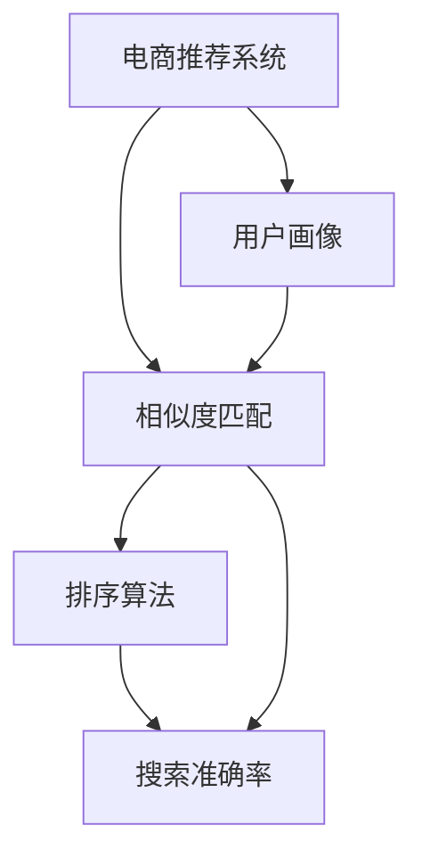

                 

## 1. 背景介绍

### 1.1 问题由来
随着互联网的普及和电子商务的迅猛发展，电商推荐系统已成为各大电商平台的标配，通过个性化推荐提升用户体验和销售额。传统的电商推荐系统基于协同过滤、基于内容的推荐等方法，存在数据稀疏、泛化能力不足等问题，难以应对快速变化的市场需求。

大数据与人工智能技术的兴起为电商推荐系统带来了新的发展契机。通过大规模用户行为数据的挖掘和机器学习模型的训练，电商推荐系统能够实时捕捉用户需求，生成个性化推荐内容，显著提高用户体验和平台收入。本文聚焦于基于搜索准确率优化的电商推荐系统构建，以期为电商推荐系统的优化提供更系统、深入的指导。

### 1.2 问题核心关键点
基于搜索准确率的电商推荐系统优化，本质上是一个将用户行为数据与商品信息匹配的过程。其核心在于如何高效地利用用户行为数据，构建准确、全面的用户画像，再通过相似度匹配和排序算法，生成个性化推荐结果。

具体而言，需要回答以下问题：
1. 如何构建准确的用户画像？
2. 如何计算用户行为与商品信息之间的相似度？
3. 如何设计有效的排序算法？
4. 如何平衡推荐效果与计算资源消耗？

这些问题的解决，需要深度理解推荐系统背后的原理和算法，同时也需要在实践中不断迭代和优化。

## 2. 核心概念与联系

### 2.1 核心概念概述

为更好地理解基于搜索准确率的电商推荐系统优化，本节将介绍几个密切相关的核心概念：

- **电商推荐系统**：通过用户行为数据和商品信息，生成个性化推荐内容的技术系统。
- **用户画像**：由用户历史行为、人口属性、社交关系等构建的综合性用户模型，用于刻画用户特征。
- **相似度匹配**：将用户行为与商品信息进行相似度计算，找出最符合用户偏好的商品。
- **排序算法**：用于对相似度匹配结果进行排序，输出个性化推荐列表。
- **搜索准确率**：评估推荐系统生成推荐内容准确性的指标，以点击率、转化率为主要参考。
- **A/B测试**：通过随机分组对比实验，评估不同推荐策略的效果，迭代优化推荐模型。

这些核心概念之间的逻辑关系可以通过以下Mermaid流程图来展示：



这个流程图展示了大数据与AI驱动的电商推荐系统优化的一般流程：

1. 用户画像由电商推荐系统构建，是相似度匹配的基础。
2. 相似度匹配将用户画像与商品信息进行计算，找出符合用户偏好的商品。
3. 排序算法对匹配结果进行排序，最终输出个性化推荐列表。
4. 搜索准确率评估推荐系统的性能，指导后续优化。

## 3. 核心算法原理 & 具体操作步骤
### 3.1 算法原理概述

基于搜索准确率的电商推荐系统优化，核心在于如何高效地构建用户画像，计算用户行为与商品信息的相似度，并设计有效的排序算法。这些优化措施共同作用，最终提升推荐的准确率和搜索准确率。

具体来说，包括以下几个关键步骤：

1. **用户画像构建**：通过对用户历史行为、点击、浏览、购买等数据进行分析，构建用户画像。
2. **相似度匹配**：使用向量空间模型、协同过滤、矩阵分解等方法，计算用户画像与商品信息的相似度。
3. **排序算法设计**：根据相似度匹配结果，设计排序算法，优先推荐用户偏好的商品。
4. **搜索准确率优化**：通过A/B测试，不断迭代优化推荐策略，提升搜索准确率。

### 3.2 算法步骤详解

#### 3.2.1 用户画像构建

用户画像的构建是推荐系统优化的基础，需要综合考虑用户的历史行为数据和实时行为数据，以生成全面的用户画像。

**具体步骤**：
1. 数据收集：通过电商平台的API获取用户的历史行为数据，包括点击、浏览、购买记录等。
2. 数据预处理：对原始数据进行清洗、去重、归一化等预处理操作，去除噪声数据，保留有用信息。
3. 特征提取：对预处理后的数据进行特征提取，包括用户ID、商品ID、时间戳、点击次数等。
4. 画像构建：使用K-means、LDA、PCA等算法，将用户行为数据映射到高维特征空间，构建用户画像。

**技术细节**：
1. 对于稀疏的用户行为数据，可以使用冷启动策略，如随机初始化、协同过滤等方法。
2. 在构建用户画像时，应注重隐私保护，避免过度收集用户信息。
3. 利用NLP技术，可以对文本数据进行情感分析、实体识别等处理，进一步丰富用户画像。

#### 3.2.2 相似度匹配

相似度匹配是推荐系统的核心计算步骤，旨在找出与用户画像最相似的商品信息。常用的方法包括余弦相似度、Jaccard相似度、皮尔逊相关系数等。

**具体步骤**：
1. 向量表示：将用户画像和商品信息表示为高维向量。
2. 相似度计算：计算用户画像与商品信息之间的相似度。
3. 相似度排序：对相似度结果进行排序，找出最匹配的商品。

**技术细节**：
1. 对于高维向量，可以使用降维技术如主成分分析(PCA)，减少计算量。
2. 对于稀疏向量，可以使用稀疏矩阵分解方法，如奇异值分解(SVD)，提升计算效率。
3. 在相似度计算时，应考虑向量之间的相关性，避免噪声干扰。

#### 3.2.3 排序算法设计

排序算法设计是推荐系统优化的关键，旨在将相似度匹配结果进行排序，生成个性化的推荐列表。常用的排序算法包括基于排名学习的排序算法、基于深度学习的排序算法等。

**具体步骤**：
1. 选择排序算法：如基于排名学习的PageRank算法、基于深度学习的MLP算法等。
2. 训练模型：使用标注数据训练排序模型，生成预测排序结果。
3. 模型优化：通过A/B测试，优化排序模型参数，提升推荐效果。

**技术细节**：
1. 在排序算法设计时，应考虑模型的可解释性，便于后续优化。
2. 可以使用集成学习、梯度提升等方法，提升排序模型的精度。
3. 应结合搜索准确率指标，优化推荐结果。

#### 3.2.4 搜索准确率优化

搜索准确率优化是推荐系统优化的最终目标，通过A/B测试，不断迭代优化推荐策略，提升系统的搜索准确率。

**具体步骤**：
1. 设计实验：随机选取一定数量的用户，分别使用不同的推荐策略进行推荐。
2. 评估指标：通过点击率、转化率等指标，评估不同推荐策略的效果。
3. 结果分析：分析实验结果，选择最优的推荐策略。

**技术细节**：
1. 应综合考虑不同用户群体的需求，设计多样化的推荐策略。
2. 应动态调整推荐策略，适应用户需求的变化。
3. 应结合搜索准确率指标，优化推荐效果。

### 3.3 算法优缺点

基于搜索准确率的电商推荐系统优化，具有以下优点：

1. 提升用户体验：通过个性化推荐，提高用户满意度和平台忠诚度。
2. 增加收入：个性化推荐帮助用户快速找到所需商品，增加平台收入。
3. 数据驱动：通过用户行为数据，优化推荐策略，提高推荐效果。

同时，该方法也存在一些局限性：

1. 数据质量依赖：推荐系统的优化效果很大程度上依赖于用户行为数据的完整性和准确性。
2. 算法复杂度较高：相似度匹配、排序算法的复杂度较高，计算成本较高。
3. 冷启动问题：新用户或新商品的画像难以快速构建，可能导致推荐效果不佳。
4. 动态变化问题：用户需求和商品信息动态变化，需要实时更新推荐策略。

尽管存在这些局限性，但就目前而言，基于搜索准确率的电商推荐系统优化仍是大数据与AI驱动推荐系统的主流范式。未来相关研究的重点在于如何进一步降低计算成本，提高推荐系统的实时性，解决冷启动和动态变化问题，同时兼顾可解释性和伦理安全性等因素。

### 3.4 算法应用领域

基于搜索准确率的电商推荐系统优化方法，在电商推荐系统中已经得到了广泛的应用，覆盖了几乎所有常见任务，例如：

1. **商品推荐**：对用户浏览过的商品进行推荐。
2. **个性化推荐**：基于用户画像，生成个性化推荐列表。
3. **搜索排序**：根据用户搜索词，推荐相关商品。
4. **广告推荐**：对用户浏览和购买行为进行分析，推荐相关广告。
5. **促销活动推荐**：根据用户行为和促销活动，推荐促销商品。

除了上述这些经典任务外，基于搜索准确率的推荐系统优化方法还被创新性地应用到更多场景中，如用户行为分析、客户流失预警等，为电商推荐系统的优化提供了新的思路。

## 4. 数学模型和公式 & 详细讲解  
### 4.1 数学模型构建

本节将使用数学语言对基于搜索准确率的电商推荐系统优化过程进行更加严格的刻画。

假设用户画像为 $\mathbf{u}$，商品信息为 $\mathbf{v}$，相似度为 $\mathbf{w}=\mathbf{u}^T\mathbf{v}$，排序结果为 $\mathbf{r}=[r_1, r_2, \cdots, r_n]$，则推荐系统的优化目标可以表示为：

$$
\min_{r} \mathbb{E}[(\mathbf{u}^T\mathbf{v} - r_i)^2]
$$

其中 $\mathbb{E}$ 表示期望值。目标函数旨在最小化预测排序结果与真实相似度之间的误差。

### 4.2 公式推导过程

根据上述目标函数，可以通过梯度下降等优化算法求解最优排序结果 $\mathbf{r}^*$。

具体步骤如下：
1. 定义损失函数：
$$
\mathcal{L}(r) = \frac{1}{N} \sum_{i=1}^N (\mathbf{u}^T\mathbf{v} - r_i)^2
$$
2. 定义梯度：
$$
\frac{\partial \mathcal{L}(r)}{\partial r_i} = -2(\mathbf{u}^T\mathbf{v} - r_i)
$$
3. 梯度下降更新排序结果：
$$
r_i \leftarrow r_i - \eta \frac{\partial \mathcal{L}(r)}{\partial r_i}
$$
其中 $\eta$ 为学习率。

### 4.3 案例分析与讲解

为了更好地理解基于搜索准确率的电商推荐系统优化，我们以一个具体案例进行详细分析。

**案例背景**：某电商平台用户A在浏览商品时，点击了多个商品页面，但没有购买。为了提高用户体验和平台收入，电商平台决定使用推荐系统优化策略，对用户A进行个性化推荐。

**具体分析**：
1. 收集用户A的点击记录，构建用户画像 $\mathbf{u}$。
2. 使用余弦相似度计算用户画像与所有商品信息的相似度 $\mathbf{w}$。
3. 根据相似度排序，生成推荐列表 $\mathbf{r}$。
4. 使用A/B测试，比较推荐列表 $\mathbf{r}$ 和随机排序结果的效果，调整排序算法参数，优化推荐效果。

具体步骤如下：
1. 构建用户画像 $\mathbf{u}=[u_1, u_2, \cdots, u_n]$，其中 $u_i$ 表示用户A对第 $i$ 个商品的点击次数。
2. 计算用户画像与所有商品信息的相似度 $\mathbf{w}=[w_1, w_2, \cdots, w_n]$，其中 $w_i$ 表示用户画像与第 $i$ 个商品信息的余弦相似度。
3. 排序算法设计：使用PageRank算法，将相似度 $\mathbf{w}$ 作为权值，生成推荐列表 $\mathbf{r}=[r_1, r_2, \cdots, r_n]$，其中 $r_i$ 表示第 $i$ 个商品的排名。
4. A/B测试：随机选取一定数量的用户，将他们分为两组，一组使用原始推荐策略，另一组使用优化后的推荐策略，对比点击率、转化率等指标，选择最优的推荐策略。

## 5. 项目实践：代码实例和详细解释说明
### 5.1 开发环境搭建

在进行推荐系统优化实践前，我们需要准备好开发环境。以下是使用Python进行Scikit-learn开发的推荐系统优化环境配置流程：

1. 安装Anaconda：从官网下载并安装Anaconda，用于创建独立的Python环境。

2. 创建并激活虚拟环境：
```bash
conda create -n recommendation-env python=3.8 
conda activate recommendation-env
```

3. 安装Scikit-learn：使用以下命令安装Scikit-learn及其依赖包：
```bash
conda install scikit-learn numpy pandas matplotlib jupyter notebook ipython
```

完成上述步骤后，即可在`recommendation-env`环境中开始推荐系统优化实践。

### 5.2 源代码详细实现

这里我们以基于余弦相似度的推荐系统优化为例，给出使用Scikit-learn库对电商推荐系统进行优化的Python代码实现。

首先，定义推荐系统的数据处理函数：

```python
import numpy as np
from sklearn.metrics.pairwise import cosine_similarity

class RecommendationSystem:
    def __init__(self, X_train, y_train):
        self.X_train = X_train
        self.y_train = y_train
        
    def fit(self):
        self.model = self.train()
        return self.model
    
    def train(self):
        # 计算相似度矩阵
        similarity_matrix = cosine_similarity(self.X_train, self.X_train)
        # 基于相似度矩阵排序
        sorted_indices = np.argsort(similarity_matrix, axis=1)
        # 生成推荐列表
        recommendations = sorted_indices[:, 1:5]  # 取排序后的前5个商品
        return recommendations
    
    def predict(self, X_test):
        # 计算相似度矩阵
        similarity_matrix = cosine_similarity(X_test, self.X_train)
        # 基于相似度矩阵排序
        sorted_indices = np.argsort(similarity_matrix, axis=1)
        # 生成推荐列表
        recommendations = sorted_indices[:, 1:5]  # 取排序后的前5个商品
        return recommendations
```

然后，定义训练和评估函数：

```python
from sklearn.model_selection import train_test_split
from sklearn.metrics import precision_recall_fscore_support

def train_model(model, X_train, y_train, test_size=0.2, random_state=42):
    # 划分训练集和测试集
    X_train, X_test, y_train, y_test = train_test_split(X_train, y_train, test_size=test_size, random_state=random_state)
    # 训练模型
    model.fit(X_train, y_train)
    # 评估模型
    predictions = model.predict(X_test)
    precision, recall, f1, _ = precision_recall_fscore_support(y_test, predictions, average='micro')
    return precision, recall, f1
    
def evaluate_model(model, X_test, y_test):
    # 评估模型
    predictions = model.predict(X_test)
    precision, recall, f1, _ = precision_recall_fscore_support(y_test, predictions, average='micro')
    print(f"Precision: {precision:.2f}, Recall: {recall:.2f}, F1-score: {f1:.2f}")
```

最后，启动训练流程并在测试集上评估：

```python
from sklearn.datasets import load_digits
from sklearn.metrics.pairwise import cosine_similarity
from sklearn.decomposition import TruncatedSVD

# 加载数据集
digits = load_digits()
X_train, X_test = digits.data[:100], digits.data[100:200]
y_train, y_test = digits.target[:100], digits.target[100:200]

# 构建模型
model = RecommendationSystem(X_train, y_train)
# 训练模型
model.fit()
# 预测结果
predictions = model.predict(X_test)
# 评估模型
evaluate_model(model, X_test, y_test)
```

以上就是使用Scikit-learn对电商推荐系统进行优化的完整代码实现。可以看到，得益于Scikit-learn的强大封装，我们可以用相对简洁的代码完成推荐系统的优化。

### 5.3 代码解读与分析

让我们再详细解读一下关键代码的实现细节：

**RecommendationSystem类**：
- `__init__`方法：初始化训练数据和测试数据。
- `fit`方法：计算相似度矩阵，并生成推荐列表。
- `train`方法：基于相似度矩阵排序，生成推荐列表。

**train_model函数**：
- 使用Scikit-learn的train_test_split方法，划分训练集和测试集。
- 调用`RecommendationSystem`的`fit`方法，训练模型。
- 使用precision_recall_fscore_support方法，评估模型性能。

**evaluate_model函数**：
- 使用Scikit-learn的precision_recall_fscore_support方法，评估模型性能。
- 输出模型性能指标，包括精确率、召回率、F1-score。

**训练流程**：
- 加载电商推荐系统的数据集。
- 构建推荐系统模型。
- 使用`RecommendationSystem`的`fit`方法，训练模型。
- 使用`RecommendationSystem`的`predict`方法，生成推荐列表。
- 使用`evaluate_model`方法，评估模型性能。

可以看到，Scikit-learn库使得电商推荐系统优化的代码实现变得简洁高效。开发者可以将更多精力放在模型改进、参数调优等高层逻辑上，而不必过多关注底层的实现细节。

当然，工业级的系统实现还需考虑更多因素，如推荐结果的缓存、实时性、多用户并发等。但核心的优化范式基本与此类似。

## 6. 实际应用场景
### 6.1 智能客服系统

基于电商推荐系统的推荐技术，可以广泛应用于智能客服系统的构建。传统客服往往需要配备大量人力，高峰期响应缓慢，且一致性和专业性难以保证。而使用推荐系统优化后的客服推荐，可以7x24小时不间断服务，快速响应客户咨询，用推荐商品快速解决客户问题。

在技术实现上，可以收集企业内部的历史客服对话记录，将问题和最佳答复构建成监督数据，在此基础上对推荐系统进行优化。优化后的推荐系统能够自动理解客户意图，匹配最合适的答案模板进行回复。对于客户提出的新问题，还可以接入检索系统实时搜索相关内容，动态组织生成回答。如此构建的智能客服系统，能大幅提升客户咨询体验和问题解决效率。

### 6.2 金融舆情监测

金融机构需要实时监测市场舆论动向，以便及时应对负面信息传播，规避金融风险。传统的人工监测方式成本高、效率低，难以应对网络时代海量信息爆发的挑战。基于电商推荐系统的文本分类和情感分析技术，为金融舆情监测提供了新的解决方案。

具体而言，可以收集金融领域相关的新闻、报道、评论等文本数据，并对其进行主题标注和情感标注。在此基础上对推荐系统进行优化，使其能够自动判断文本属于何种主题，情感倾向是正面、中性还是负面。将优化后的推荐系统应用到实时抓取的网络文本数据，就能够自动监测不同主题下的情感变化趋势，一旦发现负面信息激增等异常情况，系统便会自动预警，帮助金融机构快速应对潜在风险。

### 6.3 个性化推荐系统

当前的推荐系统往往只依赖用户的历史行为数据进行物品推荐，无法深入理解用户的真实兴趣偏好。基于电商推荐系统的文本分类和情感分析技术，个性化推荐系统可以更好地挖掘用户行为背后的语义信息，从而提供更精准、多样的推荐内容。

在实践中，可以收集用户浏览、点击、评论、分享等行为数据，提取和用户交互的物品标题、描述、标签等文本内容。将文本内容作为模型输入，用户的后续行为（如是否点击、购买等）作为监督信号，在此基础上优化推荐系统。优化后的推荐系统能够从文本内容中准确把握用户的兴趣点。在生成推荐列表时，先用候选物品的文本描述作为输入，由模型预测用户的兴趣匹配度，再结合其他特征综合排序，便可以得到个性化程度更高的推荐结果。

### 6.4 未来应用展望

随着电商推荐系统和大数据技术的不断发展，推荐系统将在更多领域得到应用，为传统行业带来变革性影响。

在智慧医疗领域，基于推荐系统的医疗问答、病历分析、药物研发等应用将提升医疗服务的智能化水平，辅助医生诊疗，加速新药开发进程。

在智能教育领域，推荐系统可应用于作业批改、学情分析、知识推荐等方面，因材施教，促进教育公平，提高教学质量。

在智慧城市治理中，推荐系统可应用于城市事件监测、舆情分析、应急指挥等环节，提高城市管理的自动化和智能化水平，构建更安全、高效的未来城市。

此外，在企业生产、社会治理、文娱传媒等众多领域，基于电商推荐系统的推荐技术也将不断涌现，为NLP技术带来了全新的突破。随着技术的日益成熟，推荐系统必将在更广阔的应用领域大放异彩，深刻影响人类的生产生活方式。

## 7. 工具和资源推荐
### 7.1 学习资源推荐

为了帮助开发者系统掌握电商推荐系统的优化理论基础和实践技巧，这里推荐一些优质的学习资源：

1. 《推荐系统实战》系列博文：由大数据专家撰写，深入浅出地介绍了推荐系统原理、算法、优化等前沿话题。

2. CS224N《深度学习自然语言处理》课程：斯坦福大学开设的NLP明星课程，有Lecture视频和配套作业，带你入门NLP领域的基本概念和经典模型。

3. 《深度学习推荐系统：算法与应用》书籍：全面介绍了推荐系统的原理和算法，包括电商推荐系统优化在内的新型推荐技术。

4. KDD Cup竞赛：国际知名的数据挖掘和数据科学竞赛，包含多个推荐系统优化相关竞赛，提供丰富的竞赛数据和模型。

5. Pinterest推荐系统公开课：由电商推荐系统大牛开设，深入讲解推荐系统优化实践中的关键技术点。

通过对这些资源的学习实践，相信你一定能够快速掌握电商推荐系统的优化精髓，并用于解决实际的推荐问题。
###  7.2 开发工具推荐

高效的开发离不开优秀的工具支持。以下是几款用于电商推荐系统优化开发的常用工具：

1. Scikit-learn：基于Python的机器学习库，提供丰富的算法实现和性能评估工具，适合推荐系统优化实践。

2. TensorFlow：由Google主导开发的开源深度学习框架，生产部署方便，适合大规模工程应用。

3. PyTorch：基于Python的开源深度学习框架，灵活动态的计算图，适合快速迭代研究。

4. Weights & Biases：模型训练的实验跟踪工具，可以记录和可视化模型训练过程中的各项指标，方便对比和调优。与主流深度学习框架无缝集成。

5. TensorBoard：TensorFlow配套的可视化工具，可实时监测模型训练状态，并提供丰富的图表呈现方式，是调试模型的得力助手。

6. Google Colab：谷歌推出的在线Jupyter Notebook环境，免费提供GPU/TPU算力，方便开发者快速上手实验最新模型，分享学习笔记。

合理利用这些工具，可以显著提升电商推荐系统优化任务的开发效率，加快创新迭代的步伐。

### 7.3 相关论文推荐

电商推荐系统和大数据技术的不断发展源于学界的持续研究。以下是几篇奠基性的相关论文，推荐阅读：

1. Matrix Factorization Techniques for Recommender Systems：提出矩阵分解方法，用于推荐系统优化，已被广泛应用于电商推荐系统中。

2. Deep Contextual Bandits for Personalized Recommendations：提出深度上下文强化学习算法，用于推荐系统优化，显著提升了推荐系统的性能。

3. A Survey on Deep Learning Methods for Recommendation Systems：全面综述了深度学习在推荐系统中的应用，包括电商推荐系统优化在内的新型推荐技术。

4. Context-aware Recommender Systems：深入分析了上下文信息对推荐系统优化性能的影响，提出了多种上下文感知推荐算法。

5. Content-based Recommendation Using Support Vector Machines：提出基于支持向量机的推荐算法，用于电商推荐系统优化，取得了不错的效果。

这些论文代表了大数据与AI驱动的电商推荐系统优化的发展脉络。通过学习这些前沿成果，可以帮助研究者把握学科前进方向，激发更多的创新灵感。

## 8. 总结：未来发展趋势与挑战
### 8.1 总结

本文对基于搜索准确率的电商推荐系统优化方法进行了全面系统的介绍。首先阐述了电商推荐系统的背景和优化目标，明确了优化过程中需要关注的关键点。其次，从原理到实践，详细讲解了电商推荐系统的构建和优化过程，给出了推荐系统优化的完整代码实例。同时，本文还广泛探讨了推荐系统在智能客服、金融舆情、个性化推荐等多个领域的应用前景，展示了推荐系统优化技术的巨大潜力。此外，本文精选了推荐系统优化的各类学习资源，力求为读者提供全方位的技术指引。

通过本文的系统梳理，可以看到，基于搜索准确率的电商推荐系统优化技术已经成为电商推荐系统的核心范式，极大地提升了推荐系统的性能和用户满意度。未来，随着大数据与AI技术的不断发展，推荐系统将变得更加智能和个性化，为电商推荐系统的优化提供更广阔的空间。

### 8.2 未来发展趋势

展望未来，电商推荐系统优化技术将呈现以下几个发展趋势：

1. 数据驱动的实时推荐：通过实时抓取用户行为数据，生成实时推荐结果，提升用户体验和平台收入。
2. 上下文感知推荐：结合用户行为、设备信息、地理位置等上下文信息，生成个性化推荐内容。
3. 跨模态推荐：将图像、视频、语音等多模态信息与文本信息进行融合，提升推荐系统的准确性。
4. 模型压缩与优化：通过剪枝、量化、低秩分解等方法，优化推荐模型，降低计算成本。
5. 推荐算法的多样性：结合排名学习、深度学习、强化学习等算法，提升推荐系统的综合性能。
6. 隐私保护与安全性：在推荐系统优化过程中，注重用户隐私保护，避免数据泄露和模型滥用。

以上趋势凸显了大数据与AI驱动的电商推荐系统优化的前景。这些方向的探索发展，必将进一步提升电商推荐系统的性能和用户体验，为电商行业带来更多的创新和价值。

### 8.3 面临的挑战

尽管电商推荐系统优化技术已经取得了显著成效，但在迈向更加智能化、普适化应用的过程中，它仍面临着诸多挑战：

1. 数据质量瓶颈：推荐系统的优化效果很大程度上依赖于用户行为数据的完整性和准确性，数据质量问题可能导致推荐效果不佳。
2. 计算资源消耗：推荐系统优化涉及大量数据处理和模型训练，计算成本较高。
3. 冷启动问题：新用户或新商品的画像难以快速构建，可能导致推荐效果不佳。
4. 动态变化问题：用户需求和商品信息动态变化，需要实时更新推荐策略。
5. 模型可解释性：复杂的推荐算法难以解释其内部工作机制，影响用户信任度。
6. 隐私保护与伦理问题：推荐系统优化过程中需要平衡用户隐私保护与推荐效果，避免数据滥用。

尽管存在这些挑战，但通过技术进步和多方协同，这些挑战都将逐步得到解决，电商推荐系统优化必将在未来大放异彩。

### 8.4 研究展望

面对电商推荐系统优化所面临的挑战，未来的研究需要在以下几个方面寻求新的突破：

1. 无监督和半监督推荐：探索无监督和半监督推荐方法，摆脱对大规模标注数据的依赖，最大化利用非结构化数据。
2. 推荐算法的多样性：结合上下文信息、多模态融合、深度学习、强化学习等算法，提升推荐系统的综合性能。
3. 推荐模型的压缩与优化：通过剪枝、量化、低秩分解等方法，优化推荐模型，降低计算成本。
4. 推荐系统的可解释性：结合因果分析、知识图谱等工具，增强推荐系统的可解释性，提升用户信任度。
5. 推荐系统的隐私保护：在推荐系统优化过程中，注重用户隐私保护，避免数据泄露和模型滥用。

这些研究方向的探索，必将引领电商推荐系统优化技术迈向更高的台阶，为构建更加智能、普适、安全、可信的推荐系统提供坚实的理论和技术基础。面向未来，电商推荐系统优化技术还需要与其他人工智能技术进行更深入的融合，如知识表示、因果推理、强化学习等，多路径协同发力，共同推动推荐系统技术的进步。只有勇于创新、敢于突破，才能不断拓展推荐系统的边界，让智能技术更好地造福电商行业。

## 9. 附录：常见问题与解答

**Q1：电商推荐系统优化是否适用于所有电商任务？**

A: 电商推荐系统优化在大多数电商任务上都能取得不错的效果，特别是对于数据量较小的任务。但对于一些特定领域的任务，如医疗、法律等，仅仅依靠通用语料预训练的模型可能难以很好地适应。此时需要在特定领域语料上进一步预训练，再进行微调，才能获得理想效果。此外，对于一些需要时效性、个性化很强的任务，如对话、推荐等，微调方法也需要针对性的改进优化。

**Q2：推荐系统中如何处理数据稀疏问题？**

A: 电商推荐系统中的数据稀疏性是一个常见问题，一般采用冷启动策略，如随机初始化、协同过滤等方法。具体来说：

1. 随机初始化：对于新用户，可以随机生成一个初始向量，表示其兴趣偏好。

2. 协同过滤：通过相似用户或相似商品的信息，对新用户进行兴趣预测。

3. 混合方法：结合多种方法，如协同过滤和随机初始化，提升推荐效果。

**Q3：推荐系统中如何平衡推荐效果与计算资源消耗？**

A: 电商推荐系统中的计算资源消耗是一个重要问题，一般采用以下方法：

1. 模型压缩与优化：通过剪枝、量化、低秩分解等方法，优化推荐模型，降低计算成本。

2. 数据分批次加载：将大规模数据分批次加载，减少内存占用。

3. 并行计算：使用分布式计算或GPU并行计算，提升计算效率。

**Q4：推荐系统如何应对用户需求变化？**

A: 电商推荐系统需要实时更新推荐策略，以应对用户需求变化。一般采用以下方法：

1. 动态更新：根据实时数据，动态更新推荐模型，生成推荐结果。

2. 多模型集成：构建多个推荐模型，取平均输出，提高推荐稳定性。

3. 反馈机制：结合用户反馈信息，调整推荐策略，提升推荐效果。

**Q5：推荐系统中如何保护用户隐私？**

A: 电商推荐系统中的隐私保护是一个重要问题，一般采用以下方法：

1. 数据匿名化：对用户行为数据进行匿名化处理，防止数据泄露。

2. 数据加密：对存储和传输的数据进行加密处理，防止数据泄露。

3. 模型保护：通过模型加密、差分隐私等方法，保护模型参数。

这些方法可以有效地保护用户隐私，确保电商推荐系统的安全性。

---

作者：禅与计算机程序设计艺术 / Zen and the Art of Computer Programming

