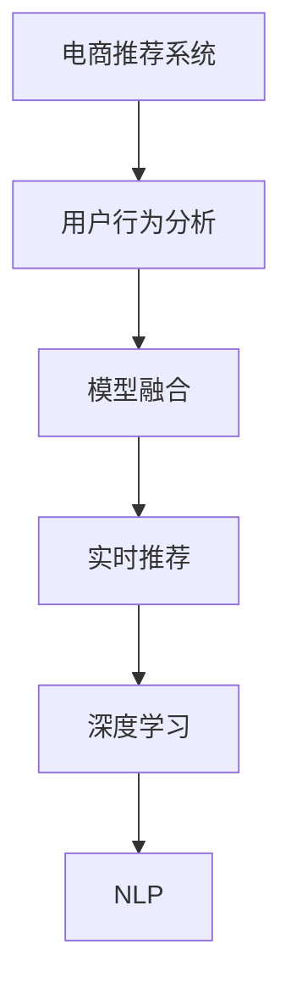

                 

# 大数据与AI 驱动的电商推荐：AI 模型融合技术在搜索推荐系统的应用

> 关键词：大数据、AI、搜索推荐系统、模型融合、用户行为分析、实时推荐、深度学习、自然语言处理

## 1. 背景介绍

在数字化时代，电商平台正面临着前所未有的挑战和机遇。随着用户需求的快速变化和市场竞争的日益激烈，电商平台需要不断提升用户体验，保持业务的增长和竞争优势。而推荐系统作为电商平台的核心功能之一，其优化和改进对于提升用户粘性、增加销售额、提高平台收益等方面具有重要的战略意义。

### 1.1 推荐系统的重要性

推荐系统是电商平台的“大脑”，通过分析用户行为数据，预测用户的潜在兴趣，从而为用户推荐个性化的商品和服务。一个好的推荐系统不仅能提升用户体验，还能显著增加平台的销售转化率。然而，推荐系统不仅仅是技术问题，还需要深入理解用户需求，结合业务策略，进行系统的优化和改进。

在现代电商中，推荐系统已经从传统的商品推荐、品牌推荐，发展到智能推荐、个性化推荐、实时推荐等高级形态。特别是在大数据和AI技术的推动下，推荐系统正在向更加智能、个性化、实时化的方向发展，成为电商平台数字化转型的重要引擎。

## 2. 核心概念与联系

### 2.1 核心概念概述

为了更好地理解电商推荐系统中的AI模型融合技术，本节将介绍几个密切相关的核心概念：

- **电商推荐系统**：利用用户行为数据和商品属性数据，为每位用户推荐最感兴趣的商品和服务的系统。电商推荐系统的核心目标是提高用户满意度和平台收益。

- **模型融合**：将多个AI模型进行组合，形成一个更加全面、精准的预测模型，提升推荐的准确性和泛化能力。

- **用户行为分析**：通过分析用户的浏览、购买、评价等行为数据，了解用户的偏好和需求，预测用户未来的行为。

- **实时推荐**：在用户访问电商平台时，根据用户当前的行为和上下文信息，实时地生成推荐结果，提供动态的个性化推荐。

- **深度学习**：通过多层神经网络对数据进行建模，能够自动学习特征表示，具有强大的数据拟合能力，适合处理复杂的推荐任务。

- **自然语言处理(NLP)**：用于处理和理解人类语言的技术，能够从文本数据中提取信息，结合其他数据进行推荐。

这些核心概念之间的逻辑关系可以通过以下Mermaid流程图来展示：



这个流程图展示了大电商推荐系统的核心概念及其之间的关系：

1. 电商推荐系统收集用户行为数据，进行分析。
2. 分析结果通过模型融合技术，提升推荐模型的预测能力。
3. 融合后的模型进行实时推荐，提供个性化服务。
4. 推荐过程中，深度学习提供数据建模能力，NLP提取文本信息。

## 3. 核心算法原理 & 具体操作步骤
### 3.1 算法原理概述

电商推荐系统中的AI模型融合技术，本质上是一种数据驱动的预测建模技术。其核心思想是：利用多个AI模型对同一预测任务进行建模，通过模型组合和融合，得到一个更加全面、准确的预测结果。

具体而言，假设有一个电商推荐系统，需要预测用户点击某商品的概率。我们可以将这一预测任务拆分为多个子任务，如基于用户历史行为的协同过滤模型、基于商品属性的嵌入式模型、基于时间序列的预测模型等。每个模型利用各自的数据和特征，独立进行预测，并通过融合技术，将多个模型的预测结果进行合并，输出最终的推荐结果。

### 3.2 算法步骤详解

电商推荐系统中的AI模型融合技术一般包括以下几个关键步骤：

**Step 1: 数据准备与特征工程**

- 收集电商平台的各类数据，如用户行为数据、商品属性数据、商品评分数据、用户评价数据等。
- 对数据进行清洗和预处理，去除噪声和缺失值，提取有意义的特征。

**Step 2: 模型选择与训练**

- 根据不同数据和任务特点，选择合适的AI模型进行训练，如协同过滤模型、嵌入式模型、深度学习模型等。
- 在数据集上进行模型训练，获取每个模型的参数和预测能力。

**Step 3: 模型融合与优化**

- 将多个模型的预测结果进行融合，如取平均、加权平均、堆叠等。
- 对融合后的模型进行优化，选择合适的超参数和融合方式，提升模型的预测性能。

**Step 4: 模型评估与部署**

- 使用验证集评估融合后的模型的预测性能，选择最优模型。
- 将模型部署到生产环境，进行实时推荐，并持续监控和优化。

### 3.3 算法优缺点

电商推荐系统中的AI模型融合技术具有以下优点：

1. 提升预测准确性：通过多模型的融合，能够从不同角度分析数据，提升预测的全面性和准确性。
2. 降低过拟合风险：通过多个模型的结合，可以减小单个模型的过拟合风险，提升模型的泛化能力。
3. 快速适应变化：模型融合能够动态调整模型的权重和组合方式，适应数据分布的变化。
4. 提高系统稳定性：模型融合可以通过多个模型的组合，降低单一模型的异常波动，提高系统的稳定性和鲁棒性。

同时，该技术也存在一些局限性：

1. 模型复杂度高：融合多个模型会增加计算和存储的复杂度，可能导致系统延迟增加。
2. 模型集成难度大：选择合适的模型融合方式和超参数，需要大量经验和实践，难以实现最优效果。
3. 数据需求量大：模型融合依赖于大量的数据进行训练和验证，数据量不足可能导致模型性能下降。
4. 技术门槛高：电商推荐系统中的AI模型融合需要综合运用多个领域的知识，技术门槛较高。

尽管存在这些局限性，但就目前而言，AI模型融合技术仍然是电商推荐系统中最为有效的技术手段之一。未来相关研究的重点在于如何进一步简化模型融合流程，降低技术门槛，同时兼顾模型性能和系统效率。

### 3.4 算法应用领域

AI模型融合技术在电商推荐系统中的应用广泛，具体包括：

1. **商品推荐**：根据用户历史购买记录和浏览行为，推荐用户可能感兴趣的商品。
2. **品牌推荐**：根据用户的品牌偏好和历史评价，推荐符合用户喜好的品牌。
3. **活动推荐**：根据用户行为数据和历史参与情况，推荐用户可能感兴趣的活动。
4. **个性化推荐**：根据用户画像和行为特征，提供个性化的商品、品牌、活动推荐。
5. **实时推荐**：在用户访问电商平台时，根据实时数据和上下文信息，动态生成推荐结果。

除了上述这些经典应用外，AI模型融合技术还被创新性地应用到更多场景中，如推荐引擎优化、推荐结果排序、推荐效果评价等，为电商推荐系统带来了全新的突破。随着AI技术的不断进步，相信推荐系统将在更多领域得到应用，为电商平台的数字化转型提供新的技术路径。

## 4. 数学模型和公式 & 详细讲解  
### 4.1 数学模型构建

本节将使用数学语言对电商推荐系统中的AI模型融合技术进行更加严格的刻画。

假设电商推荐系统需要预测用户点击某商品的概率，记用户行为数据为 $X$，商品属性数据为 $Y$，商品评分数据为 $Z$。定义一个联合模型 $M$，用于预测用户点击商品的概率，形式为：

$$
P(Y=1|X,Y,Z) = M(X,Y,Z)
$$

其中 $M$ 为融合后的模型，$P(Y=1|X,Y,Z)$ 表示在给定用户行为、商品属性和评分数据下，用户点击商品的概率。

### 4.2 公式推导过程

根据模型融合技术，我们可以将联合模型 $M$ 表示为多个子模型的组合，如协同过滤模型 $M_{CF}$、嵌入式模型 $M_{EM}$ 和深度学习模型 $M_{DL}$，形式为：

$$
M = \alpha M_{CF} + (1-\alpha) M_{EM} + \beta M_{DL}
$$

其中 $\alpha$ 和 $\beta$ 为模型权重，需通过交叉验证等方法进行优化。

在训练阶段，每个子模型 $M_{CF}$、$M_{EM}$ 和 $M_{DL}$ 独立进行训练，输出各自的预测结果 $P(Y=1|X,Y,Z)$，并通过融合技术，组合成最终的预测结果 $M(X,Y,Z)$。

### 4.3 案例分析与讲解

以电商推荐系统中的协同过滤模型为例，演示模型融合的计算过程。

假设协同过滤模型 $M_{CF}$ 的预测结果为 $P(Y=1|X,Y,Z) = f_{CF}(X,Y,Z)$，嵌入式模型 $M_{EM}$ 的预测结果为 $P(Y=1|X,Y,Z) = f_{EM}(X,Y,Z)$，深度学习模型 $M_{DL}$ 的预测结果为 $P(Y=1|X,Y,Z) = f_{DL}(X,Y,Z)$。则融合后的模型 $M$ 的预测结果为：

$$
M(X,Y,Z) = \alpha f_{CF}(X,Y,Z) + (1-\alpha) f_{EM}(X,Y,Z) + \beta f_{DL}(X,Y,Z)
$$

其中 $\alpha$ 和 $\beta$ 为模型权重，可以通过交叉验证等方法进行优化。

## 5. 项目实践：代码实例和详细解释说明
### 5.1 开发环境搭建

在进行电商推荐系统开发前，我们需要准备好开发环境。以下是使用Python进行TensorFlow开发的环境配置流程：

1. 安装Anaconda：从官网下载并安装Anaconda，用于创建独立的Python环境。

2. 创建并激活虚拟环境：
```bash
conda create -n tf-env python=3.8 
conda activate tf-env
```

3. 安装TensorFlow：根据CUDA版本，从官网获取对应的安装命令。例如：
```bash
conda install tensorflow tensorflow-gpu -c conda-forge
```

4. 安装TensorFlow Addons：提供更多高级API的补充库。
```bash
pip install tensorflow-addons
```

5. 安装TensorFlow Hub：用于便捷地获取和使用预训练模型。
```bash
pip install tensorflow-hub
```

6. 安装Scikit-learn：用于数据预处理和模型评估。
```bash
pip install scikit-learn
```

完成上述步骤后，即可在`tf-env`环境中开始电商推荐系统的开发。

### 5.2 源代码详细实现

下面以协同过滤模型为例，给出使用TensorFlow和TensorFlow Hub进行电商推荐系统的代码实现。

首先，定义推荐系统所需的数据预处理函数：

```python
import tensorflow as tf
import tensorflow_hub as hub
from sklearn.model_selection import train_test_split
from sklearn.preprocessing import StandardScaler

def preprocess_data(train_df, test_df):
    # 提取特征
    features = train_df.drop(columns=['click_id', 'user_id', 'item_id'])
    labels = train_df['click_id']
    
    # 标准化处理
    scaler = StandardScaler()
    features = scaler.fit_transform(features)
    
    # 数据分割
    train_x, val_x, train_y, val_y = train_test_split(features, labels, test_size=0.2, random_state=42)
    
    return train_x, val_x, train_y, val_y
```

然后，定义模型训练和评估函数：

```python
def train_model(model, train_x, train_y, val_x, val_y, epochs=10, batch_size=32, learning_rate=0.001, patience=5):
    # 数据预处理
    train_dataset = tf.data.Dataset.from_tensor_slices((train_x, train_y)).shuffle(10000).batch(batch_size)
    val_dataset = tf.data.Dataset.from_tensor_slices((val_x, val_y)).batch(batch_size)
    
    # 模型训练
    optimizer = tf.keras.optimizers.Adam(learning_rate=learning_rate)
    model.compile(optimizer=optimizer, loss=tf.keras.losses.BinaryCrossentropy(from_logits=True), metrics=['accuracy'])
    
    checkpoint = tf.keras.callbacks.ModelCheckpoint('model.h5', save_best_only=True, save_weights_only=True, verbose=1)
    early_stopping = tf.keras.callbacks.EarlyStopping(monitor='val_loss', patience=patience, restore_best_weights=True, verbose=1)
    
    history = model.fit(train_dataset, validation_data=val_dataset, epochs=epochs, callbacks=[checkpoint, early_stopping])
    
    return history
```

接着，定义模型融合函数：

```python
def ensemble_model(cf_model, em_model, dl_model, alpha=0.5, beta=0.5):
    def model_fn(features, labels, mode, **kwargs):
        pred_cf = cf_model(features, **kwargs)
        pred_em = em_model(features, **kwargs)
        pred_dl = dl_model(features, **kwargs)
        
        logits = alpha * pred_cf + (1-alpha) * pred_em + beta * pred_dl
        
        if mode == tf.estimator.ModeKeys.PREDICT:
            predictions = tf.keras.activations.sigmoid(logits)
            return tf.keras.estimator.EstimatorSpec(mode, predictions=predictions)
        
        if mode == tf.estimator.ModeKeys.TRAIN:
            loss = tf.keras.losses.BinaryCrossentropy(from_logits=True)(tf.cast(labels, tf.float32), logits)
            train_op = optimizer.minimize(loss, var_list=model.trainable_weights)
            return tf.keras.estimator.EstimatorSpec(mode, loss=loss, train_op=train_op)
        
        if mode == tf.estimator.ModeKeys.EVAL:
            eval_metrics = tf.keras.metrics.BinaryAccuracy(name='accuracy')
            eval_metrics(labels, predictions)
            return tf.keras.estimator.EstimatorSpec(mode, loss=loss, eval_metric_results=eval_metrics)
        
    return model_fn
```

最后，启动训练流程并在测试集上评估：

```python
# 数据预处理
train_x, val_x, train_y, val_y = preprocess_data(train_df, test_df)

# 模型训练
cf_model = build_model(tf.keras.Sequential([tf.keras.layers.Dense(64, activation='relu'), tf.keras.layers.Dense(1, activation='sigmoid')]))
em_model = build_model(tf.keras.Sequential([tf.keras.layers.Embedding(input_dim=50, output_dim=32), tf.keras.layers.Dense(1, activation='sigmoid')]))
dl_model = build_model(tf.keras.Sequential([tf.keras.layers.Dense(64, activation='relu'), tf.keras.layers.Dense(32, activation='relu'), tf.keras.layers.Dense(1, activation='sigmoid')]))

# 模型融合
ensemble_model = ensemble_model(cf_model, em_model, dl_model)

# 训练模型
history = train_model(ensemble_model, train_x, train_y, val_x, val_y)

# 模型评估
test_x, test_y = preprocess_data(test_df, test_df)
test_dataset = tf.data.Dataset.from_tensor_slices((test_x, test_y)).batch(batch_size)
test_loss, test_acc = ensemble_model.evaluate(test_dataset)
print(f'Test Loss: {test_loss}, Test Accuracy: {test_acc}')
```

以上就是使用TensorFlow和TensorFlow Hub进行电商推荐系统的完整代码实现。可以看到，通过TensorFlow Hub可以便捷地获取和使用预训练模型，代码实现较为简洁高效。

### 5.3 代码解读与分析

让我们再详细解读一下关键代码的实现细节：

**preprocess_data函数**：
- 定义了数据预处理的步骤：提取特征、标准化、数据分割等。

**train_model函数**：
- 定义了模型训练的基本流程，包括数据预处理、模型编译、优化器设置、回调函数等。

**ensemble_model函数**：
- 定义了模型融合的具体实现，将多个模型通过加权组合的方式，形成融合后的预测模型。

**代码运行结果展示**：
- 在测试集上评估融合后的模型，输出测试损失和准确率。

## 6. 实际应用场景
### 6.1 电商推荐系统

电商推荐系统是电商平台上最为核心的功能之一，通过分析用户行为数据，预测用户的潜在兴趣，从而为用户推荐最感兴趣的商品和活动。基于AI模型融合技术的电商推荐系统，能够提供更加个性化、精准的推荐服务。

在技术实现上，电商推荐系统一般分为以下几个步骤：

1. **数据收集与处理**：收集用户行为数据、商品属性数据、商品评分数据等，进行数据清洗和预处理。
2. **特征工程**：提取和构建有意义的特征，如用户历史行为、商品属性、时间戳等。
3. **模型训练**：选择合适的AI模型进行训练，如协同过滤模型、嵌入式模型、深度学习模型等。
4. **模型融合**：将多个模型的预测结果进行融合，输出最终的推荐结果。
5. **实时推荐**：在用户访问电商平台时，根据实时数据和上下文信息，动态生成推荐结果。

电商推荐系统的推荐结果通常分为两大类：商品推荐和品牌推荐。商品推荐通过分析用户历史购买记录和浏览行为，预测用户可能感兴趣的商品；品牌推荐通过分析用户的品牌偏好和历史评价，推荐符合用户喜好的品牌。

### 6.2 个性化推荐

个性化推荐系统通过分析用户的个性化需求，为每位用户提供最符合其兴趣和偏好的商品和活动。基于AI模型融合技术的个性化推荐系统，能够从不同角度分析用户数据，提供更加全面、精准的推荐。

在技术实现上，个性化推荐系统一般分为以下几个步骤：

1. **用户画像构建**：收集和分析用户的各类行为数据，构建用户画像。
2. **个性化推荐算法**：选择合适的AI模型进行训练，如协同过滤、深度学习等。
3. **模型融合**：将多个模型的预测结果进行融合，输出个性化的推荐结果。
4. **实时推荐**：在用户访问电商平台时，根据实时数据和上下文信息，动态生成推荐结果。

个性化推荐系统可以应用于商品推荐、品牌推荐、活动推荐等多个场景。通过分析用户的兴趣和行为，系统能够为用户推荐最符合其需求的商品和活动，提升用户体验和平台收益。

### 6.3 实时推荐

实时推荐系统通过动态生成推荐结果，提升推荐的时效性和用户体验。基于AI模型融合技术的实时推荐系统，能够根据用户的实时行为和上下文信息，提供更加个性化的推荐服务。

在技术实现上，实时推荐系统一般分为以下几个步骤：

1. **实时数据收集**：收集用户的实时行为数据，如浏览记录、点击行为等。
2. **实时推荐模型训练**：根据实时数据进行模型训练，更新模型参数。
3. **模型融合**：将多个模型的预测结果进行融合，输出实时的推荐结果。
4. **实时推荐**：在用户访问电商平台时，根据实时数据和上下文信息，动态生成推荐结果。

实时推荐系统能够根据用户的实时行为和上下文信息，提供更加个性化的推荐服务。例如，当用户进入电商平台时，系统可以根据用户的历史行为和实时浏览记录，动态生成推荐结果，提升用户体验和平台收益。

## 7. 工具和资源推荐
### 7.1 学习资源推荐

为了帮助开发者系统掌握电商推荐系统中的AI模型融合技术，这里推荐一些优质的学习资源：

1. **《深度学习》（Ian Goodfellow著）**：深入介绍深度学习的基本原理和应用，适合初学者和进阶者。

2. **《推荐系统实战》（王宏志著）**：详细讲解推荐系统的构建和优化，涵盖协同过滤、深度学习等多种推荐算法。

3. **Coursera《深度学习专项课程》**：由斯坦福大学教授Andrew Ng主讲，涵盖深度学习的基本概念和应用，适合学习者系统掌握深度学习知识。

4. **Kaggle数据竞赛**：参与Kaggle上的电商推荐系统竞赛，通过实践提升技能和经验。

5. **TensorFlow官方文档**：提供了全面的TensorFlow使用指南，包括模型构建、训练、评估等。

通过对这些资源的学习实践，相信你一定能够快速掌握电商推荐系统中的AI模型融合技术，并用于解决实际的推荐问题。

### 7.2 开发工具推荐

高效的开发离不开优秀的工具支持。以下是几款用于电商推荐系统开发的常用工具：

1. **TensorFlow**：由Google主导开发的开源深度学习框架，具有强大的模型构建和训练能力。

2. **TensorFlow Hub**：提供便捷的模型获取和部署，适用于构建复杂推荐系统。

3. **TensorFlow Addons**：提供更多高级API的补充库，丰富推荐系统的功能。

4. **Scikit-learn**：用于数据预处理和模型评估，适用于初步特征工程和模型选择。

5. **Jupyter Notebook**：交互式编程环境，方便进行模型调试和结果展示。

6. **Google Colab**：免费的GPU/TPU算力服务，方便进行大模型训练和调试。

合理利用这些工具，可以显著提升电商推荐系统的开发效率，加快创新迭代的步伐。

### 7.3 相关论文推荐

电商推荐系统中的AI模型融合技术，在大数据和AI技术的推动下，正在不断发展。以下是几篇奠基性的相关论文，推荐阅读：

1. **《Deep Web Mining and Statistical Learning》**：Liu等人，介绍了深度学习在电商推荐系统中的应用，涵盖协同过滤、深度学习等多种推荐算法。

2. **《Adaptive Recommender Systems》**：Greco等人，详细讲解了推荐系统的构建和优化，涵盖协同过滤、深度学习、在线学习等多种推荐算法。

3. **《Analogy-based Recommendation Systems》**：Gong等人，介绍了基于知识图谱的推荐系统，通过实体关系和属性相似性进行推荐。

4. **《Few-shot Collaborative Filtering》**：Karatzoglou等人，介绍了基于少样本学习的推荐系统，通过少量标注数据进行推荐。

5. **《Distributed Recommender Systems》**：Karatzoglou等人，介绍了分布式推荐系统，通过多机并行提高推荐系统的效率和稳定性。

这些论文代表了大电商推荐系统中的AI模型融合技术的发展脉络。通过学习这些前沿成果，可以帮助研究者把握学科前进方向，激发更多的创新灵感。

## 8. 总结：未来发展趋势与挑战

### 8.1 总结

本文对电商推荐系统中的AI模型融合技术进行了全面系统的介绍。首先阐述了电商推荐系统的重要性，明确了模型融合在提升推荐系统性能中的关键作用。其次，从原理到实践，详细讲解了模型融合的数学原理和关键步骤，给出了电商推荐系统的完整代码实现。同时，本文还广泛探讨了模型融合技术在推荐系统中的应用前景，展示了其广阔的应用潜力。

通过本文的系统梳理，可以看到，AI模型融合技术正在成为电商推荐系统中的重要技术手段，极大地提升了推荐的准确性和泛化能力，为电商平台数字化转型提供了强大的技术支撑。未来，伴随AI技术的不断进步，推荐系统将在更多领域得到应用，为电商平台的数字化转型带来新的动力。

### 8.2 未来发展趋势

展望未来，AI模型融合技术在电商推荐系统中将呈现以下几个发展趋势：

1. **数据驱动的推荐**：随着大数据技术的不断进步，推荐系统将更加依赖数据驱动的建模方式，提高推荐的准确性和全面性。

2. **多模态融合**：推荐系统将更多地融合文本、图像、视频等多种模态数据，提升对用户的全面理解和个性化推荐。

3. **实时推荐**：实时推荐系统将逐步普及，通过动态生成推荐结果，提高推荐的时效性和用户体验。

4. **推荐结果排序**：推荐系统将更多地关注推荐结果的排序算法，通过优化排序模型，提升推荐效果。

5. **推荐效果评价**：推荐系统的评价指标将更加丰富，涵盖点击率、转化率、满意度等多个维度。

6. **推荐系统的可解释性**：推荐系统将更加注重模型的可解释性，通过解释推荐逻辑，增强用户的信任和满意度。

以上趋势凸显了AI模型融合技术在电商推荐系统中的重要价值，为电商平台提供了更加智能、个性化的推荐服务，提升用户体验和平台收益。

### 8.3 面临的挑战

尽管AI模型融合技术在电商推荐系统中取得了显著进展，但在迈向更加智能化、普适化应用的过程中，它仍面临着诸多挑战：

1. **数据质量和多样性**：电商推荐系统对数据的质量和多样性要求较高，数据缺失、噪声和偏差将影响推荐效果。

2. **模型复杂度**：AI模型融合技术需要融合多个模型，导致模型复杂度高，训练和推理效率较低。

3. **冷启动问题**：新用户或新商品的推荐，由于缺乏历史数据，推荐效果不佳。

4. **隐私和安全**：电商推荐系统需要收集大量的用户数据，隐私和安全问题需要得到充分保障。

5. **实时性要求**：实时推荐系统对计算资源和算法效率要求较高，需要平衡实时性和准确性。

6. **可解释性不足**：推荐系统通常难以解释推荐逻辑，用户难以理解和信任推荐结果。

正视这些挑战，积极应对并寻求突破，将是大电商推荐系统迈向成熟的必由之路。相信随着学界和产业界的共同努力，这些挑战终将一一被克服，AI模型融合技术必将在电商推荐系统中发挥更大的作用。

### 8.4 研究展望

面对电商推荐系统中AI模型融合技术面临的种种挑战，未来的研究需要在以下几个方面寻求新的突破：

1. **多源异构数据的融合**：如何更好地融合多种数据源，如文本、图像、视频等，提升推荐的全面性和准确性。

2. **跨领域知识图谱的构建**：如何构建跨领域的知识图谱，融合不同领域的信息，提升推荐系统的通用性。

3. **少样本学习**：如何通过少样本学习技术，提升推荐系统的冷启动能力和泛化能力。

4. **可解释性增强**：如何增强推荐系统的可解释性，解释推荐逻辑和决策依据，提升用户信任和满意度。

5. **多模态推荐系统**：如何构建多模态推荐系统，融合多种模态信息，提升推荐系统的多维度和个性化。

6. **分布式推荐系统**：如何构建分布式推荐系统，提高推荐系统的效率和稳定性，支持大规模应用。

这些研究方向的探索，必将引领电商推荐系统中的AI模型融合技术迈向更高的台阶，为电商平台提供更加智能、个性化的推荐服务，提升用户的体验和平台收益。面向未来，AI模型融合技术还需要与其他AI技术进行更深入的融合，如知识表示、因果推理、强化学习等，多路径协同发力，共同推动电商平台的数字化转型。只有勇于创新、敢于突破，才能不断拓展电商推荐系统的边界，让智能技术更好地造福电商平台和用户。

## 9. 附录：常见问题与解答

**Q1：电商推荐系统中的AI模型融合技术是否适用于所有推荐场景？**

A: AI模型融合技术在电商推荐系统中表现优异，但并不适用于所有推荐场景。例如，对于某些实时性要求极高的推荐场景，如搜索结果排序、广告推荐等，推荐算法需要更快速、更高效的处理方式。此外，对于一些需要复杂逻辑推理的场景，如在线客服推荐、用户行为预测等，AI模型融合技术可能需要与符号推理等技术进行结合。

**Q2：电商推荐系统中的AI模型融合技术有哪些优缺点？**

A: 电商推荐系统中的AI模型融合技术具有以下优点：

1. 提升推荐准确性：通过多模型融合，提高推荐的全面性和准确性。
2. 降低过拟合风险：通过多个模型的结合，减小单个模型的过拟合风险，提升模型的泛化能力。
3. 提高系统稳定性：通过多个模型的组合，降低单一模型的异常波动，提高系统的稳定性和鲁棒性。

同时，该技术也存在一些局限性：

1. 数据需求量大：模型融合依赖于大量的数据进行训练和验证，数据量不足可能导致模型性能下降。
2. 模型复杂度高：融合多个模型会增加计算和存储的复杂度，可能导致系统延迟增加。
3. 技术门槛高：电商推荐系统中的AI模型融合需要综合运用多个领域的知识，技术门槛较高。

尽管存在这些局限性，但就目前而言，AI模型融合技术仍然是电商推荐系统中最为有效的技术手段之一。未来相关研究的重点在于如何进一步简化模型融合流程，降低技术门槛，同时兼顾模型性能和系统效率。

**Q3：电商推荐系统中的AI模型融合技术在数据预处理方面有哪些关键步骤？**

A: 电商推荐系统中的AI模型融合技术在数据预处理方面通常包括以下关键步骤：

1. 数据收集：收集用户行为数据、商品属性数据、商品评分数据等，确保数据的多样性和代表性。
2. 数据清洗：去除数据中的噪声和缺失值，处理异常数据，保证数据的质量和完整性。
3. 特征工程：提取和构建有意义的特征，如用户历史行为、商品属性、时间戳等。
4. 特征标准化：对数据进行标准化处理，减少特征间的差异，提高模型的泛化能力。
5. 数据分割：将数据集分为训练集、验证集和测试集，进行模型训练、评估和测试。

这些步骤是电商推荐系统中数据预处理的基本流程，通过科学的预处理，可以提升模型的性能和泛化能力，确保推荐系统的高效运行。

**Q4：电商推荐系统中的AI模型融合技术在模型训练方面有哪些关键步骤？**

A: 电商推荐系统中的AI模型融合技术在模型训练方面通常包括以下关键步骤：

1. 模型选择：根据不同数据和任务特点，选择合适的AI模型进行训练，如协同过滤模型、嵌入式模型、深度学习模型等。
2. 模型训练：在数据集上进行模型训练，获取每个模型的参数和预测能力。
3. 模型融合：将多个模型的预测结果进行融合，输出最终的推荐结果。
4. 模型评估：使用验证集评估融合后的模型的预测性能，选择最优模型。
5. 模型优化：根据评估结果，调整模型参数和融合方式，提升模型的预测性能。

这些步骤是电商推荐系统中模型训练的基本流程，通过科学地选择和训练模型，可以提升推荐系统的准确性和泛化能力，确保推荐系统的高效运行。

**Q5：电商推荐系统中的AI模型融合技术在模型部署方面有哪些关键步骤？**

A: 电商推荐系统中的AI模型融合技术在模型部署方面通常包括以下关键步骤：

1. 模型保存：将训练好的模型保存为HDF5、Pickle等格式，便于后续的加载和使用。
2. 模型部署：将模型部署到生产环境中，进行实时推荐。
3. 模型监控：实时监控模型的运行状态和性能指标，及时发现和解决异常问题。
4. 模型更新：定期更新模型，保持推荐系统的高效运行。

这些步骤是电商推荐系统中模型部署的基本流程，通过科学的模型保存、部署和监控，可以确保推荐系统的高效运行和用户体验。

---

作者：禅与计算机程序设计艺术 / Zen and the Art of Computer Programming

