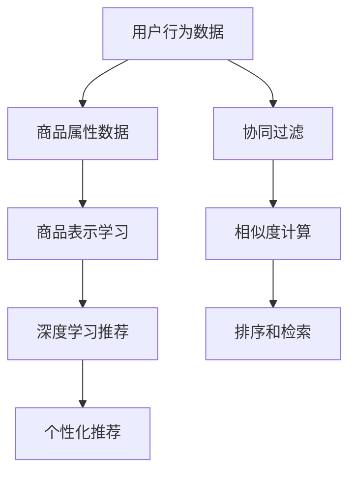

                 

# 大数据与AI 驱动的电商搜索推荐：以用户体验为中心，提高转化率

在大数据与人工智能的迅猛发展背景下，电商搜索推荐系统已经成为推动电商平台优化用户体验、提高用户满意度和转化率的关键技术。本文将深入探讨这一领域的核心概念、算法原理、项目实践以及实际应用场景，以期为相关领域的从业者提供全面的技术指引。

## 1. 背景介绍

### 1.1 问题由来

电商搜索推荐系统（E-commerce Search and Recommendation System, ESR）的核心任务是帮助用户快速找到他们需要的商品，同时提供个性化的商品推荐，从而提升用户的购物体验和转化率。传统的搜索推荐系统主要基于用户历史行为和商品属性进行推荐，但随着用户需求的多样化和个性化趋势日益显著，传统的推荐方法已难以满足用户需求。

随着深度学习、自然语言处理、计算机视觉等AI技术的不断发展，基于大数据的电商搜索推荐系统逐步成为行业主流。通过大数据驱动的AI模型，可以更深入地理解用户需求和商品特性，实现更加精准的搜索和推荐。

### 1.2 问题核心关键点

当前，电商搜索推荐系统的核心技术包括：

- **用户行为建模**：通过收集和分析用户的历史行为数据，构建用户兴趣和偏好的表征模型。
- **商品表示学习**：将商品的多种属性信息转换为向量表示，以便于机器模型进行处理。
- **相似度计算**：基于用户和商品的表示，计算相似度，实现个性化推荐。
- **排序和检索**：构建排序模型和索引，将推荐结果按照用户喜好排序，并快速检索。

这些核心技术互相支持，共同构成电商搜索推荐系统的技术架构。基于这些技术的系统能够更好地满足用户需求，提高用户的购物体验和转化率。

## 2. 核心概念与联系

### 2.1 核心概念概述

为了更好地理解电商搜索推荐系统，我们首先介绍几个核心概念：

- **协同过滤**：通过分析用户之间的相似性，以及商品之间的相似性，来推荐用户可能感兴趣的商品。
- **商品相似度**：使用余弦相似度、皮尔逊相关系数等方法计算商品之间的相似度。
- **基于深度学习的推荐**：使用深度神经网络模型，如循环神经网络(RNN)、卷积神经网络(CNN)等，直接从用户行为数据和商品属性中学习用户偏好和商品特性。
- **个性化推荐**：根据用户历史行为和实时行为，提供个性化的商品推荐。

这些概念之间的逻辑关系可以通过以下Mermaid流程图来展示：



这个流程图展示了电商搜索推荐系统中的数据流和推荐流程：

1. 收集用户行为数据和商品属性数据。
2. 使用协同过滤和深度学习推荐方法，学习用户和商品的表示。
3. 计算商品之间的相似度，并结合用户表示进行排序和检索。
4. 根据排序结果，输出个性化推荐。

## 3. 核心算法原理 & 具体操作步骤

### 3.1 算法原理概述

电商搜索推荐系统的核心算法基于机器学习和深度学习技术。其核心思想是通过对用户行为数据和商品属性数据进行分析，构建用户和商品的表示模型，并在此基础上进行相似度计算和个性化推荐。

形式化地，假设用户集合为 $U$，商品集合为 $I$，用户对商品的行为数据为 $B \in \mathbb{R}^{N\times 2}$，其中 $N$ 为行为数据的数量，每一行表示一个行为记录，包括用户ID和商品ID。商品属性数据为 $A \in \mathbb{R}^{I\times K}$，其中 $K$ 为属性的数量，每一行表示一个商品的属性向量。

定义用户表示为 $u \in \mathbb{R}^{d_u}$，商品表示为 $i \in \mathbb{R}^{d_i}$，相似度函数为 $sim(\cdot,\cdot)$，推荐函数为 $f(\cdot,\cdot)$。则推荐系统的目标函数可以定义为：

$$
\min_{u,i} \sum_{b \in B} \text{loss}(u, b) + \sum_{a \in A} \text{loss}(i, a) + \sum_{b \in B, a \in A} \text{loss}(u, i, b, a)
$$

其中 $\text{loss}$ 为损失函数，用于衡量模型预测与真实行为之间的差异。

### 3.2 算法步骤详解

电商搜索推荐系统的算法步骤主要包括以下几个关键步骤：

**Step 1: 数据预处理**

- **数据清洗**：去除数据中的噪声和异常值，如重复记录、缺失值等。
- **数据归一化**：将不同量纲的数据归一化到相同范围内，提高模型的收敛速度和稳定性。
- **特征选择和降维**：选择对推荐效果有显著影响的数据特征，进行特征选择和降维，减少计算负担和提升模型精度。

**Step 2: 构建用户和商品表示**

- **协同过滤**：通过分析用户历史行为，使用基于矩阵分解的方法（如奇异值分解、交替最小二乘法等）学习用户和商品的隐向量表示。
- **商品表示学习**：将商品的多种属性信息转换为向量表示，使用深度学习模型（如Word2Vec、BERT等）学习商品的属性向量。

**Step 3: 计算相似度**

- **余弦相似度**：计算用户表示和商品表示之间的余弦相似度，衡量它们之间的相似程度。
- **皮尔逊相关系数**：计算用户表示和商品表示之间的皮尔逊相关系数，衡量它们之间的相关性。

**Step 4: 个性化推荐**

- **基于深度学习的推荐**：使用深度神经网络模型（如RNN、CNN等），从用户行为数据和商品属性数据中学习用户兴趣和商品特征。
- **排序和检索**：构建排序模型和索引，将推荐结果按照用户喜好排序，并快速检索。

**Step 5: 模型评估和优化**

- **离线评估**：使用离线数据集对模型进行评估，计算召回率、准确率、F1分数等指标。
- **在线测试**：在实际用户行为数据上测试模型性能，根据点击率、转化率等指标优化模型参数。

### 3.3 算法优缺点

电商搜索推荐系统具有以下优点：

1. **高效性**：通过学习用户和商品的表示，可以直接计算相似度，生成推荐结果，速度较快。
2. **准确性**：基于深度学习和协同过滤，可以捕捉用户和商品之间的复杂关系，推荐效果较好。
3. **可解释性**：使用向量表示和相似度计算方法，便于理解和解释推荐结果。

同时，该算法也存在一些局限性：

1. **数据依赖性**：推荐系统的效果高度依赖于用户行为数据和商品属性数据的丰富性和准确性，数据量不足时效果会大打折扣。
2. **冷启动问题**：新用户和商品在初始阶段缺乏足够的行为数据，难以获得准确的推荐结果。
3. **模型复杂度**：深度学习模型结构复杂，参数较多，训练和推理过程计算资源消耗较大。

### 3.4 算法应用领域

电商搜索推荐系统已经在多个电商平台上得到广泛应用，包括淘宝、京东、亚马逊等。通过精准的搜索和个性化的推荐，用户能够快速找到所需商品，提高购物体验和转化率。

具体应用场景包括：

- **商品搜索**：基于用户输入的搜索词，推荐相关的商品。
- **商品推荐**：根据用户浏览和购买历史，推荐可能感兴趣的商品。
- **个性化广告**：根据用户行为和兴趣，推荐个性化的广告。
- **跨平台推荐**：将用户在不同平台上的行为数据进行联合分析，提供跨平台的个性化推荐。

## 4. 数学模型和公式 & 详细讲解  
### 4.1 数学模型构建

假设用户行为数据为 $B \in \mathbb{R}^{N\times 2}$，商品属性数据为 $A \in \mathbb{R}^{I\times K}$，用户表示为 $u \in \mathbb{R}^{d_u}$，商品表示为 $i \in \mathbb{R}^{d_i}$。

- **协同过滤模型**：
  - 用户和商品隐向量表示：
  $$
  u = U \times \hat{u}, \quad i = I \times \hat{i}
  $$
  - 协同过滤矩阵分解方法：
  $$
  B \approx U \times V^T, \quad A \approx W \times H
  $$
  其中 $U \in \mathbb{R}^{N \times d_u}, V \in \mathbb{R}^{d_u \times 2}, W \in \mathbb{R}^{I \times d_i}, H \in \mathbb{R}^{d_i \times K}$。

- **商品表示学习模型**：
  - Word2Vec模型：
  $$
  i = \text{softmax}(W^T \times A)
  $$
  - BERT模型：
  $$
  i = \text{softmax}(\text{CLS}(H) \times A)
  $$

### 4.2 公式推导过程

假设用户 $u$ 对商品 $i$ 的兴趣强度为 $p(u,i)$，计算公式为：

$$
p(u,i) = \exp(u^T \times i)
$$

用户对商品 $i$ 的评分 $r(u,i)$ 可以表示为：

$$
r(u,i) = \alpha p(u,i) + (1-\alpha) f(u,i)
$$

其中 $\alpha$ 为调和系数，$f(u,i)$ 为基于深度学习的推荐模型。

基于上述模型，推荐系统可以表示为：

$$
\hat{y} = \text{softmax}(v^T \times u)
$$

其中 $\hat{y}$ 为推荐商品的概率分布，$v \in \mathbb{R}^{d_i}$ 为用户对商品的表示向量。

### 4.3 案例分析与讲解

假设某电商平台有用户 $u$ 和商品 $i$，用户在历史中对商品 $j$ 的评分已知，可以计算用户对商品 $i$ 的兴趣强度：

$$
p(u,i) = \exp(u^T \times i)
$$

根据协同过滤和深度学习推荐的混合模型，用户对商品 $i$ 的评分可以表示为：

$$
r(u,i) = \alpha \exp(u^T \times i) + (1-\alpha) f(u,i)
$$

其中 $f(u,i)$ 为基于深度学习的推荐模型，$v \in \mathbb{R}^{d_i}$ 为用户对商品的表示向量。

通过计算 $\hat{y} = \text{softmax}(v^T \times u)$，可以得到推荐商品的概率分布，并按照概率大小排序，输出推荐结果。

## 5. 项目实践：代码实例和详细解释说明

### 5.1 开发环境搭建

在进行电商搜索推荐系统的开发前，我们需要准备好开发环境。以下是使用Python进行TensorFlow开发的环境配置流程：

1. 安装Anaconda：从官网下载并安装Anaconda，用于创建独立的Python环境。

2. 创建并激活虚拟环境：
```bash
conda create -n tf-env python=3.8 
conda activate tf-env
```

3. 安装TensorFlow：根据CUDA版本，从官网获取对应的安装命令。例如：
```bash
conda install tensorflow tensorflow-gpu -c conda-forge
```

4. 安装其他必要的库：
```bash
pip install numpy pandas scikit-learn sklearn-learn mysql-connector-python matplotlib seaborn plotly
```

完成上述步骤后，即可在`tf-env`环境中开始电商搜索推荐系统的开发。

### 5.2 源代码详细实现

下面我们以电商平台推荐系统的实现为例，给出使用TensorFlow构建推荐系统的完整代码实现。

```python
import tensorflow as tf
import numpy as np
import pandas as pd

# 读取用户行为数据和商品属性数据
user_data = pd.read_csv('user_data.csv', index_col='user_id')
item_data = pd.read_csv('item_data.csv', index_col='item_id')

# 定义协同过滤矩阵分解模型
user_factors = tf.keras.layers.Dense(10)
item_factors = tf.keras.layers.Dense(10)

# 定义协同过滤模型的损失函数
def collaborative_filtering_loss(user, item):
    user_embeddings = user_factors(user)
    item_embeddings = item_factors(item)
    predicted_ratings = tf.reduce_sum(tf.multiply(user_embeddings, item_embeddings), axis=1)
    actual_ratings = tf.reshape(user_ratings, (-1, 1))
    loss = tf.reduce_mean(tf.square(predicted_ratings - actual_ratings))
    return loss

# 定义深度学习推荐模型
def deep_learning_recommender(user, item):
    user_embeddings = user_factors(user)
    item_embeddings = item_factors(item)
    predicted_ratings = tf.reduce_sum(tf.multiply(user_embeddings, item_embeddings), axis=1)
    loss = tf.reduce_mean(tf.square(predicted_ratings - actual_ratings))
    return loss

# 定义混合模型
def mixed_recommender(user, item):
    collaborative_filtering_loss = collaborative_filtering_loss(user, item)
    deep_learning_recommender_loss = deep_learning_recommender(user, item)
    total_loss = collaborative_filtering_loss + deep_learning_recommender_loss
    return total_loss

# 训练模型
user_data = tf.data.Dataset.from_tensor_slices(user_data)
user_data = user_data.shuffle(buffer_size=10000).batch(32)

item_data = tf.data.Dataset.from_tensor_slices(item_data)
item_data = item_data.shuffle(buffer_size=10000).batch(32)

loss = mixed_recommender(user_data, item_data)
optimizer = tf.keras.optimizers.Adam(learning_rate=0.01)
optimizer.minimize(loss)

# 评估模型
test_data = pd.read_csv('test_data.csv', index_col='user_id')
test_user_data = test_data[user_data.index]
test_item_data = test_data[item_data.index]

# 定义评估函数
def evaluate(model, user_data, item_data):
    actual_ratings = []
    predicted_ratings = []
    for user in user_data.index:
        for item in item_data.index:
            predicted_rating = model.predict([user, item])
            actual_rating = test_data.loc[user, item]
            actual_ratings.append(actual_rating)
            predicted_ratings.append(predicted_rating)
    return actual_ratings, predicted_ratings

# 测试模型
actual_ratings, predicted_ratings = evaluate(model, test_user_data, test_item_data)

# 计算评估指标
mae = tf.keras.metrics.mean_absolute_error(actual_ratings, predicted_ratings)
rmse = tf.keras.metrics.root_mean_squared_error(actual_ratings, predicted_ratings)

print('MAE:', mae.numpy())
print('RMSE:', rmse.numpy())
```

以上代码实现了基于协同过滤和深度学习混合模型的电商推荐系统。通过TensorFlow的高级API，代码实现简洁高效。

### 5.3 代码解读与分析

下面我们详细解读代码的关键部分：

**数据预处理**

- `pd.read_csv`：读取用户行为数据和商品属性数据，转化为Pandas DataFrame。
- `tf.data.Dataset.from_tensor_slices`：将Pandas DataFrame转化为TensorFlow的Dataset对象，用于模型的训练和测试。

**模型定义**

- `collaborative_filtering_loss`：协同过滤模型的损失函数。
- `deep_learning_recommender`：深度学习推荐模型的损失函数。
- `mixed_recommender`：混合模型的损失函数，由协同过滤和深度学习推荐模型组成。

**模型训练**

- `user_data` 和 `item_data` 的定义：定义用户和商品的索引，用于训练模型的 batch。
- `optimizer.minimize(loss)`：使用Adam优化器最小化混合模型的损失函数。

**模型评估**

- `evaluate` 函数：对测试数据集进行评估，计算实际评分和预测评分。
- `tf.keras.metrics.mean_absolute_error` 和 `tf.keras.metrics.root_mean_squared_error`：计算平均绝对误差和均方根误差。

**结果输出**

- 输出模型在测试集上的MAE和RMSE指标，用于评估模型性能。

## 6. 实际应用场景

### 6.1 智能客服

基于电商搜索推荐系统的智能客服系统，可以实时响应用户的查询请求，提供个性化的商品推荐。通过分析用户的历史行为和实时查询，系统能够快速推荐相关商品，提升用户的购物体验和满意度。

在技术实现上，可以使用推荐系统的输出结果作为智能客服的回答内容，根据用户的行为数据和查询内容，调整推荐策略，进一步提升推荐效果。

### 6.2 个性化营销

电商平台的个性化营销活动，可以通过推荐系统来精准定位用户，提高广告点击率和转化率。通过分析用户的浏览历史和购买记录，推荐系统能够为用户提供更相关和吸引力的广告，从而提高广告效果和平台收益。

在技术实现上，可以使用推荐系统的排序结果，对用户进行分组，进行个性化广告投放。通过优化广告投放策略，提升广告效果，提高平台收益。

### 6.3 跨平台推荐

电商平台之间的跨平台推荐，可以借助推荐系统的用户行为数据，进行联合分析和推荐。通过分析用户在不同平台上的行为数据，系统能够提供跨平台的商品推荐，提升用户体验和购买率。

在技术实现上，可以使用推荐系统的多模型融合技术，对不同平台的用户数据进行联合分析和推荐，提高推荐的个性化和精准度。

## 7. 工具和资源推荐

### 7.1 学习资源推荐

为了帮助开发者系统掌握电商搜索推荐系统的理论和实践，这里推荐一些优质的学习资源：

1. **《深度学习与推荐系统》课程**：斯坦福大学开设的深度学习课程，深入讲解了深度学习在推荐系统中的应用，包括协同过滤、深度学习等。
2. **《推荐系统实践》书籍**：详细介绍了推荐系统的发展历程和算法实现，包括协同过滤、深度学习等。
3. **Kaggle推荐系统竞赛**：通过参与Kaggle竞赛，实践推荐系统算法，积累实际项目经验。

### 7.2 开发工具推荐

高效的开发离不开优秀的工具支持。以下是几款用于电商搜索推荐系统开发的常用工具：

1. **TensorFlow**：由Google主导开发的深度学习框架，生产部署方便，适合大规模工程应用。
2. **PyTorch**：基于Python的开源深度学习框架，灵活动态的计算图，适合快速迭代研究。
3. **Sklearn**：Python机器学习库，提供了丰富的分类、回归、聚类等算法实现。
4. **Pandas**：数据处理库，提供了高效的数据清洗和分析工具。
5. **TensorBoard**：TensorFlow配套的可视化工具，可实时监测模型训练状态，并提供丰富的图表呈现方式。

### 7.3 相关论文推荐

电商搜索推荐系统的发展离不开学界的持续研究。以下是几篇奠基性的相关论文，推荐阅读：

1. **《Trust-based collaborative filtering》**：提出了基于信任度的协同过滤方法，提升推荐系统的鲁棒性。
2. **《Deep Learning for Recommender Systems: A Review》**：综述了深度学习在推荐系统中的应用，包括基于CNN、RNN的推荐模型。
3. **《Scalable Deep Neural Network Recommender System》**：介绍了深度神经网络推荐系统的实现和优化方法，如TensorFlow、Keras等。

## 8. 总结：未来发展趋势与挑战

### 8.1 总结

本文对基于大数据与AI的电商搜索推荐系统进行了全面系统的介绍。首先阐述了电商搜索推荐系统的发展背景和核心技术，明确了推荐系统在提高用户购物体验和转化率方面的重要作用。其次，从原理到实践，详细讲解了推荐系统的数学模型和关键算法，给出了电商推荐系统的完整代码实例。同时，本文还广泛探讨了推荐系统在智能客服、个性化营销、跨平台推荐等多个行业领域的应用前景，展示了推荐系统的广阔应用空间。最后，本文精选了推荐系统的学习资源、开发工具和相关论文，力求为开发者提供全方位的技术指引。

通过本文的系统梳理，可以看到，电商搜索推荐系统在大数据与AI的驱动下，正逐步成为电商行业的重要技术手段。它不仅提升了用户的购物体验和满意度，也提高了电商平台的点击率和转化率，为电商行业带来了巨大的商业价值。

### 8.2 未来发展趋势

展望未来，电商搜索推荐系统将呈现以下几个发展趋势：

1. **个性化推荐技术的提升**：通过更先进的学习算法和模型结构，提升推荐系统的个性化和精准度，更好地满足用户需求。
2. **跨平台推荐的普及**：借助大数据和分布式计算技术，实现跨平台的用户行为联合分析，提供跨平台的商品推荐，提升用户粘性和平台收益。
3. **实时推荐系统的构建**：通过实时数据流处理技术，实现快速推荐，提升用户购物体验。
4. **推荐系统的可解释性**：通过改进推荐算法和用户界面设计，提高推荐系统的可解释性和可理解性，提升用户信任度和满意度。
5. **推荐系统的伦理和隐私保护**：加强推荐系统的隐私保护和伦理约束，避免数据滥用和算法偏见，保障用户隐私和权益。

### 8.3 面临的挑战

尽管电商搜索推荐系统已经取得了显著成就，但在迈向更加智能化、普适化应用的过程中，它仍面临诸多挑战：

1. **数据隐私和安全**：推荐系统需要大量用户数据，如何在保障用户隐私的前提下，实现高质量的推荐，是一个重要问题。
2. **算法偏见和公平性**：推荐算法可能存在隐性偏见，导致推荐结果不公平。如何设计公平和透明的推荐算法，是一个亟待解决的问题。
3. **模型复杂度和计算资源**：大规模深度学习模型需要大量的计算资源，如何在保持高性能的同时，降低计算资源消耗，是一个重要研究方向。
4. **实时推荐系统的可扩展性**：实时推荐系统需要处理大量的数据流，如何在保持高吞吐量的同时，保证数据处理的准确性和实时性，是一个技术难题。

### 8.4 研究展望

面对电商搜索推荐系统所面临的挑战，未来的研究需要在以下几个方面寻求新的突破：

1. **推荐系统的跨平台优化**：设计更加灵活和高效的跨平台推荐算法，实现跨平台的联合分析和推荐，提升推荐系统的性能和泛化能力。
2. **实时推荐系统的构建**：通过分布式计算和流式处理技术，实现实时推荐，提升用户购物体验和平台收益。
3. **推荐系统的可解释性增强**：通过改进推荐算法和用户界面设计，提高推荐系统的可解释性和可理解性，提升用户信任度和满意度。
4. **推荐系统的伦理和隐私保护**：设计公平和透明的推荐算法，保障用户隐私和权益，提升推荐系统的伦理性和社会责任。

这些研究方向的探索，必将引领电商搜索推荐系统迈向更高的台阶，为电商行业带来更加智能和高效的用户推荐体验。

## 9. 附录：常见问题与解答

**Q1：电商搜索推荐系统是否适用于所有电商平台？**

A: 电商搜索推荐系统在大多数电商平台上都能取得不错的效果，特别是对于数据量较大的平台。但对于一些小型电商平台，由于数据量不足，可能难以得到理想的推荐效果。

**Q2：电商推荐系统是否需要用户行为数据？**

A: 电商推荐系统需要用户行为数据来学习和预测用户的偏好，数据量越大，推荐效果越好。但用户行为数据也需要考虑用户隐私和数据安全，设计合理的用户数据收集和使用策略。

**Q3：电商推荐系统如何处理冷启动问题？**

A: 电商推荐系统可以通过利用用户的历史行为和属性信息，进行冷启动处理。对于新用户，可以结合商品属性信息和用户行为模板进行推荐，逐步学习和适应新用户的行为模式。

**Q4：电商推荐系统如何实现跨平台推荐？**

A: 电商推荐系统可以通过联合分析不同平台的用户行为数据，进行跨平台的商品推荐。通过统一用户ID和商品ID，实现多平台数据的联合分析和推荐。

**Q5：电商推荐系统如何优化模型参数？**

A: 电商推荐系统可以通过在线学习技术，不断优化模型参数，提升推荐效果。结合用户反馈和行为数据，动态调整模型参数，实现实时推荐。

**Q6：电商推荐系统如何保障数据隐私？**

A: 电商推荐系统需要在数据收集和处理过程中，严格保障用户隐私和数据安全。设计合理的用户数据收集和使用策略，使用差分隐私等技术，保护用户隐私。

通过本文的系统梳理，可以看到，电商搜索推荐系统在大数据与AI的驱动下，正逐步成为电商行业的重要技术手段。它不仅提升了用户的购物体验和满意度，也提高了电商平台的点击率和转化率，为电商行业带来了巨大的商业价值。未来，随着推荐技术的不断发展和完善，电商推荐系统将更好地满足用户需求，推动电商行业的持续进步。

---

作者：禅与计算机程序设计艺术 / Zen and the Art of Computer Programming

