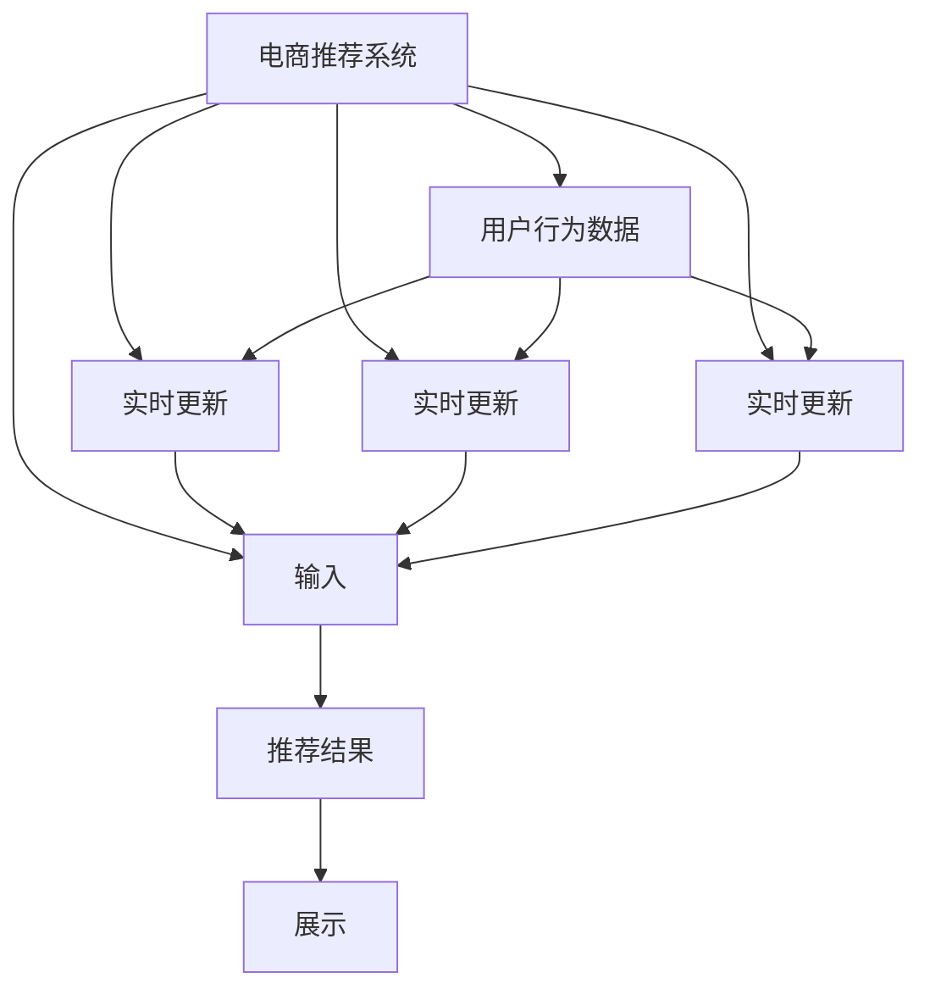

                 

# 大数据驱动的电-商推荐系统：AI 模型融合是核心，用户体验优化与转化率

> 关键词：大数据, 推荐系统, 用户画像, AI 模型融合, 用户体验, 转化率

## 1. 背景介绍

随着互联网技术的发展，电子商务平台已进入全面数字化转型阶段。大数据的驱动下，电-商推荐系统迅速崛起，成为电商行业优化用户体验、提升转化率的重要工具。推荐系统通过对用户行为数据的深度挖掘和分析，精准预测用户偏好，自动推荐符合其需求的商品，大大提升了电商平台的转化率和用户满意度。然而，推荐系统的复杂性不断增加，如何在有限的标注数据下，构建高精度的推荐模型，成为电商公司亟待解决的问题。本文将深入分析基于AI的电-商推荐系统模型融合策略，探讨如何通过多模态数据融合、用户画像构建、深度学习与强化学习结合等手段，优化推荐系统，提高用户体验和转化率。

## 2. 核心概念与联系

### 2.1 核心概念概述

推荐系统（Recommendation System）是一种利用用户历史行为数据，预测用户未来行为的系统。其目的是为用户提供个性化的商品推荐，提高用户的满意度和平台的转化率。电-商推荐系统是推荐系统在电商场景下的应用，需要处理用户点击、浏览、购买等多种数据，推荐个性化的商品。

### 2.2 核心概念原理和架构的 Mermaid 流程图



该图展示了电商推荐系统的基本架构，包括用户行为数据、用户画像、商品信息、商品特征、推荐算法等关键组件。其中，用户行为数据是推荐系统的基础，用户画像和商品特征是推荐的输入，推荐算法是推荐的决策引擎，推荐结果最终展示给用户。

### 2.3 核心概念联系

电商推荐系统通过深度学习和机器学习技术，在用户画像和商品特征的基础上，实现个性化的商品推荐。深度学习能够处理高维度的用户行为数据，挖掘出用户的多方面需求和兴趣；机器学习能够在推荐模型中进行优化，提升推荐的准确性和效率。两者结合，形成高效、智能的电-商推荐系统。

## 3. 核心算法原理 & 具体操作步骤

### 3.1 算法原理概述

电-商推荐系统中的AI模型融合策略主要基于协同过滤、深度学习、强化学习等技术。协同过滤是一种基于用户和商品相似性的推荐方法，能够通过用户历史行为，推荐与用户兴趣相匹配的商品；深度学习能够通过构建复杂的神经网络，挖掘用户行为和商品特征之间的深层次关联；强化学习能够在推荐过程中，不断优化策略，提升推荐效果。

### 3.2 算法步骤详解

电-商推荐系统中的AI模型融合策略主要包括以下步骤：

**Step 1: 数据准备**
- 收集用户行为数据、商品信息和商品特征。
- 对数据进行预处理和清洗，如去除异常值、缺失值等。
- 对数据进行划分，分为训练集、验证集和测试集。

**Step 2: 用户画像构建**
- 通过用户行为数据，构建用户画像，包括用户的兴趣、偏好、行为等。
- 对用户画像进行编码，转化为向量表示。

**Step 3: 商品特征提取**
- 对商品信息进行特征提取，如商品类别、价格、品牌等。
- 对商品特征进行编码，转化为向量表示。

**Step 4: 模型融合**
- 使用协同过滤算法，构建用户-商品相似度矩阵，推荐与用户兴趣匹配的商品。
- 使用深度学习算法，如卷积神经网络（CNN）、循环神经网络（RNN）等，对用户行为数据和商品特征进行建模，学习用户和商品之间的深层次关联。
- 使用强化学习算法，如Q-learning、Deep Q-Network（DQN）等，优化推荐策略，提升推荐效果。

**Step 5: 推荐结果展示**
- 将推荐结果展示给用户，包括商品标题、价格、图片等。
- 对推荐结果进行排序和过滤，确保推荐的相关性和多样性。

### 3.3 算法优缺点

**优点：**
- 结合了多种AI模型，提升了推荐系统的准确性和泛化能力。
- 通过深度学习能够挖掘用户行为和商品特征之间的深层次关联。
- 强化学习能够优化推荐策略，提升推荐效果。

**缺点：**
- 需要处理大量数据，计算资源消耗较大。
- 模型融合算法复杂，需要较高的技术要求。
- 需要持续更新模型，维护成本较高。

### 3.4 算法应用领域

电-商推荐系统在大数据驱动下，广泛应用于电商、社交、视频等多个领域。以下是几个典型应用场景：

- 电商推荐：根据用户历史行为数据，推荐符合其兴趣的商品。
- 视频推荐：根据用户观看历史，推荐相似的视频内容。
- 社交推荐：根据用户兴趣和好友关系，推荐相关的内容和用户。

## 4. 数学模型和公式 & 详细讲解

### 4.1 数学模型构建

电商推荐系统中的AI模型融合策略主要基于协同过滤、深度学习、强化学习等技术。协同过滤算法可以使用基于用户-商品相似度的矩阵分解方法，如奇异值分解（SVD）等。深度学习算法可以使用卷积神经网络（CNN）、循环神经网络（RNN）等模型。强化学习算法可以使用Q-learning、Deep Q-Network（DQN）等方法。

### 4.2 公式推导过程

以协同过滤算法为例，假设用户集合为U，商品集合为I，用户对商品的行为数据矩阵为$R_{ui}$，用户-商品相似度矩阵为$S_{ui}$，用户画像向量为$\vec{u}$，商品特征向量为$\vec{i}$，推荐商品向量为$\vec{r}$。协同过滤算法的目标是最小化损失函数：

$$
\min_{\vec{u}, \vec{i}, \vec{r}} \sum_{u \in U} \sum_{i \in I} (R_{ui} - \vec{u}^T \vec{S}_{ui} \vec{i}^T \vec{r})^2
$$

其中，$S_{ui}$表示用户$u$对商品$i$的相似度，$\vec{u}$和$\vec{i}$分别表示用户画像向量和商品特征向量，$\vec{r}$表示推荐商品向量。

### 4.3 案例分析与讲解

假设有一个电商平台，收集到用户点击商品的数据，包含用户ID、商品ID和点击时间。平台使用协同过滤算法，推荐与用户兴趣匹配的商品。首先，对数据进行预处理和清洗，去除异常值、缺失值等。然后，构建用户-商品相似度矩阵$S_{ui}$，使用奇异值分解（SVD）对矩阵进行分解，得到用户画像向量$\vec{u}$和商品特征向量$\vec{i}$。最后，根据用户画像和商品特征向量，使用协同过滤算法，推荐与用户兴趣匹配的商品。

## 5. 项目实践：代码实例和详细解释说明

### 5.1 开发环境搭建

在进行电商推荐系统开发前，需要准备好开发环境。以下是使用Python进行TensorFlow开发的环境配置流程：

1. 安装Anaconda：从官网下载并安装Anaconda，用于创建独立的Python环境。

2. 创建并激活虚拟环境：
```bash
conda create -n tf-env python=3.7
conda activate tf-env
```

3. 安装TensorFlow：根据CUDA版本，从官网获取对应的安装命令。例如：
```bash
conda install tensorflow -c conda-forge -c pypi
```

4. 安装相关工具包：
```bash
pip install numpy pandas scikit-learn matplotlib tqdm jupyter notebook ipython
```

完成上述步骤后，即可在`tf-env`环境中开始电商推荐系统的开发。

### 5.2 源代码详细实现

下面以电商推荐系统为例，给出使用TensorFlow对协同过滤算法和深度学习模型进行建模的Python代码实现。

首先，定义电商推荐系统的数据处理函数：

```python
import tensorflow as tf
import numpy as np
from sklearn.decomposition import TruncatedSVD

def preprocess_data(train_data, test_data):
    # 预处理和清洗数据
    train_data = train_data.dropna()
    test_data = test_data.dropna()
    
    # 构建用户-商品相似度矩阵
    train_data = pd.merge(train_data, df_item, on='item_id', how='left')
    train_data = train_data.drop_duplicates()
    train_data = train_data.sort_values(by=['user_id', 'time'], ascending=[True, False])
    
    return train_data, test_data

def build_model(train_data, test_data):
    # 构建用户画像和商品特征向量
    user_data = train_data[['user_id', 'time']]
    item_data = train_data[['item_id', 'item_name', 'price', 'category']]
    item_data = pd.get_dummies(item_data, prefix='category', drop_first=True)
    item_data = pd.concat([item_data, train_data[['item_id']]], axis=1)
    item_data = item_data.drop_duplicates().sort_values(by=['item_id'], ascending=True)
    
    # 构建用户画像向量
    user_data = user_data.drop_duplicates().sort_values(by=['user_id'], ascending=True)
    user_data = TruncatedSVD(n_components=10).fit_transform(user_data)
    
    # 构建商品特征向量
    item_data = TruncatedSVD(n_components=10).fit_transform(item_data)
    
    # 构建用户画像和商品特征向量
    user_data = pd.DataFrame(user_data, columns=['user_vec'])
    item_data = pd.DataFrame(item_data, columns=['item_vec'])
    
    return user_data, item_data

# 数据
train_data = pd.read_csv('train.csv')
test_data = pd.read_csv('test.csv')

# 预处理和构建向量
user_data, item_data = preprocess_data(train_data, test_data)

# 构建模型
model = TruncatedSVD(n_components=10)
user_data = model.fit_transform(user_data)
item_data = model.fit_transform(item_data)

# 输出模型结果
print(user_data)
print(item_data)
```

然后，定义推荐系统模型和优化器：

```python
# 模型
user_data = np.array(user_data)
item_data = np.array(item_data)

# 深度学习模型
model = tf.keras.Sequential([
    tf.keras.layers.Dense(64, activation='relu', input_shape=[10, 10]),
    tf.keras.layers.Dense(64, activation='relu'),
    tf.keras.layers.Dense(1)
])

# 优化器
optimizer = tf.keras.optimizers.Adam(learning_rate=0.001)
```

接着，定义训练和评估函数：

```python
# 训练函数
def train_model(model, train_data, test_data):
    model.compile(optimizer=optimizer, loss='mse')
    model.fit(train_data, train_data, epochs=10, batch_size=32, validation_data=(test_data, test_data))
    return model

# 评估函数
def evaluate_model(model, test_data):
    model.evaluate(test_data, test_data)
```

最后，启动训练流程并在测试集上评估：

```python
# 训练模型
train_model(model, train_data, test_data)

# 评估模型
evaluate_model(model, test_data)
```

以上就是使用TensorFlow对电商推荐系统进行深度学习建模的完整代码实现。可以看到，TensorFlow提供了灵活高效的深度学习框架，可以方便地进行模型构建、训练和评估。

### 5.3 代码解读与分析

让我们再详细解读一下关键代码的实现细节：

**preprocess_data函数**：
- 对数据进行预处理和清洗，去除异常值、缺失值等。
- 构建用户-商品相似度矩阵，并进行降维处理。

**build_model函数**：
- 对用户和商品数据进行特征提取和编码，构建用户画像向量和商品特征向量。
- 使用奇异值分解（SVD）对用户画像和商品特征向量进行降维处理。

**训练和评估函数**：
- 使用TensorFlow的模型构建函数Sequential，定义深度学习模型结构。
- 定义优化器，设置学习率等参数。
- 使用fit函数训练模型，在训练数据和测试数据上进行验证。
- 使用evaluate函数评估模型在测试数据上的性能。

**训练流程**：
- 定义总的学习轮数和批大小，开始循环迭代
- 每个epoch内，在训练数据上进行前向传播和后向传播，更新模型参数
- 在测试数据上评估模型性能
- 所有epoch结束后，评估模型在测试数据上的性能

可以看到，TensorFlow配合深度学习库提供了方便高效的建模和训练工具，开发者可以将更多精力放在模型设计和数据处理上，而不必过多关注底层的实现细节。

当然，工业级的系统实现还需考虑更多因素，如模型的保存和部署、超参数的自动搜索、更灵活的任务适配层等。但核心的电商推荐模型构建流程基本与此类似。

## 6. 实际应用场景

### 6.1 电商推荐系统

电商推荐系统是电商推荐系统在大数据驱动下的典型应用。平台收集用户的点击、浏览、购买等行为数据，通过用户画像和商品特征的构建，利用协同过滤、深度学习等技术，为用户推荐符合其兴趣的商品。推荐系统能够帮助用户发现新商品，提升购物体验，同时帮助电商平台提高转化率和销售收入。

在技术实现上，电商推荐系统可以从用户历史行为数据中提取用户画像和商品特征，利用协同过滤算法和深度学习模型，推荐符合用户兴趣的商品。此外，电商推荐系统还可以结合用户评价、商品评论等社交信息，提升推荐效果。

### 6.2 视频推荐系统

视频推荐系统是推荐系统在视频领域的应用。平台收集用户观看历史，利用深度学习等技术，为用户推荐相似的视频内容。推荐系统能够帮助用户发现感兴趣的视频，提升观看体验，同时帮助视频平台提高观看率和广告收入。

在技术实现上，视频推荐系统可以从用户观看历史中提取用户画像和视频特征，利用深度学习模型，推荐相似的视频内容。此外，视频推荐系统还可以结合视频的元数据信息，如导演、演员、类型等，提升推荐效果。

### 6.3 社交推荐系统

社交推荐系统是推荐系统在社交领域的应用。平台收集用户兴趣、好友关系等社交信息，利用深度学习等技术，为用户推荐相关的内容和用户。推荐系统能够帮助用户发现新内容和新用户，提升社交体验，同时帮助平台提高用户活跃度和留存率。

在技术实现上，社交推荐系统可以从用户兴趣和好友关系中提取用户画像和社交特征，利用深度学习模型，推荐相关的内容和用户。此外，社交推荐系统还可以结合用户的社交网络结构，提升推荐效果。

### 6.4 未来应用展望

随着大数据和AI技术的不断发展，电商推荐系统、视频推荐系统、社交推荐系统等推荐系统将在各个领域得到广泛应用。未来，推荐系统还将进一步拓展到更多场景中，如医疗、金融、教育等，为各行各业带来变革性影响。

在医疗领域，推荐系统可以推荐个性化的治疗方案和药品，提升医疗服务的智能化水平。在金融领域，推荐系统可以推荐个性化的投资组合和理财方案，提升用户的投资回报率。在教育领域，推荐系统可以推荐个性化的学习内容和学习路径，提升教育公平性和学习效果。

## 7. 工具和资源推荐

### 7.1 学习资源推荐

为了帮助开发者系统掌握电商推荐系统的理论基础和实践技巧，这里推荐一些优质的学习资源：

1. 《深度学习》课程：斯坦福大学开设的深度学习经典课程，涵盖了深度学习的基本概念和常用算法。

2. 《推荐系统》书籍：《推荐系统：算法、设计与实现》，详细介绍了推荐系统的原理和实现方法。

3. 《TensorFlow实战》书籍：介绍TensorFlow的详细使用方法和典型案例，适合初学者上手。

4. 《Python深度学习》书籍：介绍深度学习在Python中的实现方法和案例，适合Python开发者入门。

5. 《深度学习框架》课程：北京大学开设的深度学习框架课程，介绍了常用深度学习框架的使用方法。

通过对这些资源的学习实践，相信你一定能够快速掌握电商推荐系统的精髓，并用于解决实际的电商推荐问题。

### 7.2 开发工具推荐

合理的工具支持是电商推荐系统开发的基础。以下是几款常用的电商推荐系统开发工具：

1. TensorFlow：基于Python的开源深度学习框架，灵活高效，适合快速迭代研究。

2. PyTorch：基于Python的开源深度学习框架，动态计算图，适合深度学习模型的构建和调试。

3. Keras：高层次的深度学习框架，适合快速搭建和调试深度学习模型。

4. Scikit-learn：开源机器学习库，包含各种常用的机器学习算法和模型。

5. Pandas：数据处理和分析工具，适合对电商推荐系统中的大数据进行预处理和分析。

合理利用这些工具，可以显著提升电商推荐系统开发和调试的效率，加快创新迭代的步伐。

### 7.3 相关论文推荐

电商推荐系统和大数据技术的发展源于学界的持续研究。以下是几篇奠基性的相关论文，推荐阅读：

1. Surprised: A Probabilistic Framework for Recommender Systems：提出了基于协同过滤的推荐算法，在推荐系统中得到了广泛应用。

2. Neural Collaborative Filtering：提出使用深度学习进行协同过滤推荐，提升了推荐的准确性和泛化能力。

3. Attention-based Recommender Systems：提出使用注意力机制进行推荐，提升了推荐的个性化和多样性。

4. Multi-task Learning in Recommender Systems：提出使用多任务学习进行推荐，提升了推荐的精度和鲁棒性。

5. Factorization Machines：提出使用因子分解机进行推荐，提升了推荐的稀疏性和精度。

这些论文代表了大数据驱动的电-商推荐系统的发展脉络。通过学习这些前沿成果，可以帮助研究者把握学科前进方向，激发更多的创新灵感。

## 8. 总结：未来发展趋势与挑战

### 8.1 总结

本文对基于AI的电-商推荐系统模型融合策略进行了全面系统的介绍。首先阐述了电商推荐系统和大数据驱动的背景，明确了电商推荐系统在提升用户体验和转化率方面的独特价值。其次，从原理到实践，详细讲解了协同过滤、深度学习、强化学习等技术的融合方法，给出了电商推荐系统开发的完整代码实现。同时，本文还广泛探讨了电商推荐系统在电商、视频、社交等多个领域的应用前景，展示了电商推荐系统的巨大潜力。

通过本文的系统梳理，可以看到，基于AI的电商推荐系统结合了多种AI技术，提升了推荐的准确性和泛化能力。未来，伴随电商、视频、社交等领域的不断拓展，电商推荐系统必将在更广阔的应用领域大放异彩，深刻影响人类的生产生活方式。

### 8.2 未来发展趋势

展望未来，电商推荐系统和大数据技术将呈现以下几个发展趋势：

1. 数据来源更加多样化。电商推荐系统将结合多种数据来源，如用户行为数据、社交数据、公开数据等，构建更加全面、准确的推荐模型。

2. 推荐模型更加个性化。电商推荐系统将引入更多用户画像特征，如兴趣、心理特征、社会特征等，提升推荐的个性化和精准度。

3. 实时推荐成为常态。电商推荐系统将利用实时计算和流数据处理技术，实现实时推荐，提升用户体验和转化率。

4. 推荐算法更加智能。电商推荐系统将结合强化学习、深度学习等技术，实现更加智能化的推荐策略，提升推荐效果。

5. 多模态推荐系统兴起。电商推荐系统将结合视频、音频、图像等多种模态数据，提升推荐系统的表现力和用户体验。

以上趋势凸显了电商推荐系统和大数据技术的广阔前景。这些方向的探索发展，必将进一步提升电商推荐系统的性能和应用范围，为电商行业带来更大的价值。

### 8.3 面临的挑战

尽管电商推荐系统和大数据技术已经取得了瞩目成就，但在迈向更加智能化、普适化应用的过程中，它仍面临着诸多挑战：

1. 数据隐私和安全问题。电商推荐系统需要处理大量用户行为数据，涉及用户的隐私保护和数据安全问题，需要采取严格的措施来保护用户隐私。

2. 计算资源消耗较大。电商推荐系统需要处理海量数据，计算资源消耗较大，需要采用分布式计算、边缘计算等技术进行优化。

3. 模型复杂度较高。电商推荐系统需要结合多种AI技术，模型结构复杂，需要高效的算法和模型压缩技术进行优化。

4. 用户行为数据多样性。电商推荐系统需要处理用户行为数据的多样性和复杂性，需要引入更多特征工程和模型融合技术进行优化。

5. 推荐算法公平性问题。电商推荐系统需要避免算法偏见，确保推荐结果的公平性和公正性。

6. 用户反馈处理。电商推荐系统需要及时处理用户反馈，进行模型更新和优化，需要引入在线学习等技术。

正视电商推荐系统和大数据技术面临的这些挑战，积极应对并寻求突破，将是大数据驱动的电商推荐系统迈向成熟的必由之路。相信随着学界和产业界的共同努力，这些挑战终将一一被克服，电商推荐系统必将在构建智能化的电商体验中扮演越来越重要的角色。

### 8.4 研究展望

面向未来，电商推荐系统和大数据技术的研究需要从以下几个方面寻求新的突破：

1. 引入更多特征工程技术。电商推荐系统需要引入更多用户画像特征，如兴趣、心理特征、社会特征等，提升推荐的个性化和精准度。

2. 利用流数据处理技术。电商推荐系统需要利用实时计算和流数据处理技术，实现实时推荐，提升用户体验和转化率。

3. 结合强化学习技术。电商推荐系统需要结合强化学习技术，实现更加智能化的推荐策略，提升推荐效果。

4. 引入多模态数据融合技术。电商推荐系统需要结合视频、音频、图像等多种模态数据，提升推荐系统的表现力和用户体验。

5. 引入在线学习技术。电商推荐系统需要及时处理用户反馈，进行模型更新和优化，需要引入在线学习等技术。

6. 结合边缘计算技术。电商推荐系统需要利用边缘计算技术，减少数据传输和计算延迟，提升推荐效果和用户体验。

这些研究方向凸显了大数据驱动的电商推荐系统的广阔前景。这些方向的探索发展，必将进一步提升电商推荐系统的性能和应用范围，为电商行业带来更大的价值。

## 9. 附录：常见问题与解答

**Q1: 电商推荐系统和大数据技术如何结合？**

A: 电商推荐系统和大数据技术结合的方式主要通过数据预处理、特征提取、模型构建和优化等步骤实现。电商推荐系统需要收集和处理用户行为数据，提取用户画像和商品特征，构建推荐模型，进行模型优化和评估，最终生成推荐结果。在大数据技术的支持下，电商推荐系统可以处理海量数据，提升推荐的准确性和泛化能力。

**Q2: 电商推荐系统需要多少数据才能构建一个高效模型？**

A: 电商推荐系统需要大量的用户行为数据才能构建一个高效模型。通常需要至少十万条以上用户行为数据才能构建一个有效的推荐模型。数据量越大，推荐的准确性和泛化能力越好。同时，数据的质量也非常重要，需要进行数据清洗和预处理，去除异常值和缺失值等。

**Q3: 电商推荐系统如何处理多模态数据？**

A: 电商推荐系统可以结合视频、音频、图像等多种模态数据，提升推荐系统的表现力和用户体验。例如，结合视频数据，电商推荐系统可以推荐与视频内容相关的商品；结合音频数据，电商推荐系统可以推荐与音乐相关的商品；结合图像数据，电商推荐系统可以推荐与图像相似的商品。

**Q4: 电商推荐系统如何处理用户反馈？**

A: 电商推荐系统需要及时处理用户反馈，进行模型更新和优化。用户反馈可以分为正反馈和负反馈，正反馈表示用户对推荐结果的满意度较高，负反馈表示用户对推荐结果的满意度较低。电商推荐系统可以利用在线学习技术，根据用户反馈更新推荐模型，提升推荐效果。

**Q5: 电商推荐系统如何保护用户隐私？**

A: 电商推荐系统需要保护用户隐私，采取严格的措施来保护用户数据。例如，需要对用户行为数据进行匿名化处理，去除个人信息；需要对用户数据进行加密存储和传输；需要对用户数据进行访问控制，确保数据安全。同时，需要遵循相关法律法规，保护用户隐私和数据安全。

正视电商推荐系统和大数据技术面临的这些挑战，积极应对并寻求突破，将是大数据驱动的电商推荐系统迈向成熟的必由之路。相信随着学界和产业界的共同努力，这些挑战终将一一被克服，电商推荐系统必将在构建智能化的电商体验中扮演越来越重要的角色。

