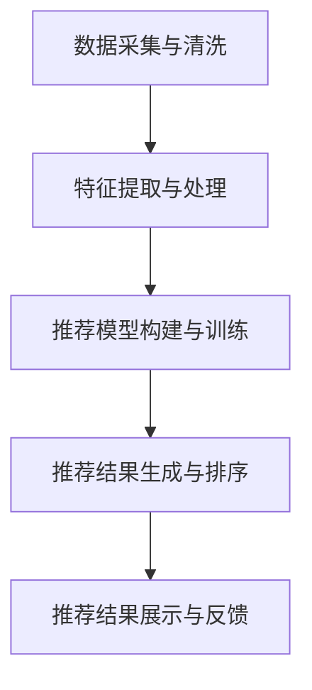

                 

# 大数据驱动的电商推荐系统：AI 模型融合是核心，用户体验优化是关键

## 1. 背景介绍

在互联网与技术迅速发展的时代背景下，电商平台凭借其便捷的购物体验和丰富的商品选择，成为了人们日常生活的重要组成部分。然而，在商品种类日益丰富的同时，也带来了“信息过载”的问题。如何在海量商品中精准推荐用户感兴趣的物品，从而提升用户的购物体验，成为了电商平台亟需解决的核心问题。

电商推荐系统（E-commerce Recommendation System, ERS）通过收集用户的历史行为数据和商品属性信息，运用机器学习模型分析用户偏好和商品特征，进而为用户推荐可能感兴趣的商品。在大数据时代，电商推荐系统开始越来越多地融入人工智能（AI）技术，以实现更智能、更个性化的推荐，进而增强用户粘性，提升销售转化率，实现商家收益最大化。

## 2. 核心概念与联系

### 2.1 核心概念概述

电商推荐系统由多个关键模块组成，每个模块都有着明确的目标和功能，如下：

- **数据采集与清洗**：负责收集用户的浏览、点击、购买等行为数据，以及商品的标签、描述、价格等属性信息。通过清洗，去除噪声和不相关的数据，保证数据的质量。

- **特征提取与处理**：基于用户行为数据和商品属性信息，提取和处理特征向量，为推荐模型提供输入。

- **推荐模型构建与训练**：运用机器学习或深度学习模型构建推荐模型，并使用用户历史行为和商品属性作为训练数据，优化模型参数。

- **推荐结果生成与排序**：将训练好的模型应用于新数据，生成推荐结果，并通过评分排序算法（如协同过滤、矩阵分解、神经网络等）优化推荐结果的排序。

- **推荐结果展示与反馈**：将推荐结果以合适的方式展示给用户，并根据用户的反馈信息（如点击、购买等）进行模型更新。

这些模块通过数据流和计算图的方式，共同构成了一个高效的电商推荐系统。

### 2.2 核心概念原理和架构的 Mermaid 流程图



## 3. 核心算法原理 & 具体操作步骤

### 3.1 算法原理概述

电商推荐系统的核心算法主要分为两类：基于协同过滤和基于内容的推荐算法。

- **协同过滤**：通过分析用户之间、商品之间的相似性，为用户推荐与已有喜好类似的其他商品。协同过滤算法根据用户的行为记录（如浏览记录、购买记录等）和商品的属性数据（如类别、价格等），进行推荐。

- **基于内容**：根据商品的属性和描述，构建商品的特征向量，并分析这些特征与用户偏好的关系，为用户推荐相似的商品。

现代电商推荐系统还融合了更多高级算法，如深度学习模型（如矩阵分解、神经网络等），以及利用深度学习模型的参数高效微调技术（如Fast-Repass、AdaLoRA等），进一步提升推荐精度和模型的泛化能力。

### 3.2 算法步骤详解

#### 3.2.1 数据采集与清洗

- 收集数据：使用API接口、网站日志等手段获取用户的行为数据（如浏览记录、点击记录等）和商品属性数据（如价格、类别等）。

- 数据清洗：使用ETL工具（如Apache Nifi、AWS Glue等）对数据进行清洗，去除噪声、重复和无关的数据。

- 数据存储：将清洗后的数据存储在高效的数据库中（如Hive、SQL数据库等），以便后续的数据分析和模型训练。

#### 3.2.2 特征提取与处理

- 特征提取：通过文本处理、图像处理等技术，将用户行为和商品属性数据转换为特征向量。例如，使用TF-IDF算法处理用户评论，使用图像卷积网络处理商品图片。

- 特征选择：使用特征选择算法（如LASSO、特征重要性排序等）筛选出与用户偏好高度相关的特征，减少计算量和内存消耗。

- 特征归一化：对特征进行归一化处理，保证特征值在相同的尺度上，提升算法的准确性和稳定性。

#### 3.2.3 推荐模型构建与训练

- 模型选择：根据任务特点选择合适的推荐算法（如协同过滤、矩阵分解、神经网络等）。

- 模型训练：使用用户行为数据和商品属性数据作为训练数据，训练推荐模型。例如，使用协同过滤算法时，可以通过计算用户和商品之间的余弦相似度，构建用户-商品相似矩阵；使用神经网络时，通过前向传播计算预测值，再使用交叉熵损失进行反向传播更新模型参数。

#### 3.2.4 推荐结果生成与排序

- 推荐结果生成：将训练好的推荐模型应用于新数据，生成推荐结果。例如，使用协同过滤算法时，通过计算用户与商品的相似度，找到推荐商品。

- 推荐结果排序：使用评分排序算法（如基于评分的排序、基于热门度的排序等）对推荐结果进行排序，保证推荐结果的准确性和相关性。

#### 3.2.5 推荐结果展示与反馈

- 推荐结果展示：将推荐结果以合适的格式展示给用户，如列表、卡片等形式。

- 用户反馈收集：通过用户的点击、购买等行为数据，收集用户对推荐结果的反馈信息。

- 模型更新：根据用户反馈，使用强化学习、在线学习等技术，对推荐模型进行持续更新和优化。

### 3.3 算法优缺点

#### 3.3.1 协同过滤算法的优缺点

**优点**：
- 简单易实现，不需要大量的领域知识。
- 能够捕捉用户之间的隐式关联，推荐出与用户兴趣相似的商品。
- 可以处理大规模用户数据，计算复杂度较低。

**缺点**：
- 需要足够的用户历史行为数据，数据稀疏性可能导致推荐效果不佳。
- 新用户或新商品难以获得准确的推荐结果。
- 模型泛化能力有限，难以适应大规模的实时数据。

#### 3.3.2 基于内容算法的优缺点

**优点**：
- 能够基于商品属性数据进行推荐，不需要用户历史行为数据。
- 模型具有良好的泛化能力，能够适应大规模的实时数据。
- 推荐结果的可解释性强，用户能够理解推荐依据。

**缺点**：
- 对商品属性数据的依赖较高，商品属性数据的质量对推荐效果有直接影响。
- 对用户的深度个性化需求难以满足，推荐结果较为单一。
- 难以捕捉用户兴趣的变化和多样性。

#### 3.3.3 AI 模型融合的优缺点

**优点**：
- 融合了协同过滤和基于内容算法的优点，能够综合考虑用户历史行为和商品属性数据，提供更精准的推荐。
- 使用深度学习模型进行参数高效微调，能够处理大规模用户数据，提高推荐精度。
- 融合了多种技术手段，能够应对不同类型的推荐任务，适应性强。

**缺点**：
- 需要大量的计算资源和标注数据，训练和维护成本较高。
- 模型复杂度高，存在一定的计算延迟。
- 模型解释性较差，难以理解推荐依据。

### 3.4 算法应用领域

电商推荐系统已经在多个领域得到了广泛的应用，如服装、家电、电子产品等，覆盖了各种商品类别。此外，随着电商推荐系统技术的发展，还应用于旅游、教育、医疗等新兴领域，为这些领域的用户提供了更加个性化和精准的服务。

## 4. 数学模型和公式 & 详细讲解 & 举例说明

### 4.1 数学模型构建

电商推荐系统中的推荐算法可以基于以下基本假设进行建模：

1. 用户和商品之间存在一定的关联性，可以根据历史行为数据或商品属性数据，计算用户和商品之间的相似度。

2. 用户的历史行为数据或商品的属性数据可以转化为特征向量，用于计算相似度。

3. 推荐系统可以根据用户和商品的相似度，为用户推荐可能感兴趣的商品。

#### 4.1.1 协同过滤模型

协同过滤模型通过计算用户和商品之间的相似度，为用户推荐可能感兴趣的相似商品。基本模型可以表示为：

$$
\hat{y} = f_{\theta}(x)
$$

其中 $y$ 表示用户对商品的评分，$x$ 表示商品的特征向量，$f_{\theta}$ 表示推荐函数，$\theta$ 为模型参数。

协同过滤算法包括基于用户的协同过滤和基于物品的协同过滤两种。其中，基于用户的协同过滤模型可以表示为：

$$
\hat{y}_{ui} = \frac{\sum_{j=1}^{m} r_{uj}a_{ji}x_{i}}{\sqrt{\sum_{j=1}^{m} a_{ji}^2} + \epsilon}
$$

其中 $r_{uj}$ 表示用户 $u$ 对商品 $j$ 的评分，$a_{ji}$ 表示商品 $j$ 和商品 $i$ 之间的相似度，$x_{i}$ 表示商品 $i$ 的特征向量，$\epsilon$ 为平滑项。

#### 4.1.2 基于内容的推荐模型

基于内容的推荐模型通过分析商品属性数据，为用户推荐可能感兴趣的相似商品。基本模型可以表示为：

$$
\hat{y} = f_{\theta}(x_u, x_i)
$$

其中 $y$ 表示用户对商品的评分，$x_u$ 表示用户的历史行为数据，$x_i$ 表示商品的特征向量，$f_{\theta}$ 表示推荐函数，$\theta$ 为模型参数。

基于内容的推荐算法包括矩阵分解和神经网络推荐算法。其中，矩阵分解算法可以表示为：

$$
\hat{y} = \sum_{i=1}^{n} \alpha_{ui} \cdot \beta_{i} \cdot x_{i}
$$

其中 $\alpha_{ui}$ 表示用户对商品的评分，$\beta_{i}$ 表示商品 $i$ 的特征向量，$x_{i}$ 表示用户历史行为数据，$f_{\theta}$ 表示推荐函数，$\theta$ 为模型参数。

### 4.2 公式推导过程

#### 4.2.1 协同过滤算法

协同过滤算法基于用户和商品之间的相似度计算，可以使用余弦相似度、皮尔逊相关系数等方法计算相似度。

$$
a_{ji} = \frac{\sum_{k=1}^{d} \theta_{kj}x_{ik}}{\sqrt{\sum_{k=1}^{d} \theta_{kj}^2 \cdot \sum_{k=1}^{d} x_{ik}^2}}
$$

其中 $x_{ik}$ 表示商品 $i$ 的第 $k$ 个特征，$\theta_{kj}$ 表示商品 $j$ 的第 $k$ 个特征权重。

协同过滤算法的目标是最小化预测误差，可以表示为：

$$
\min_{\theta} \sum_{i=1}^{n} \sum_{j=1}^{m} (r_{ij} - \hat{y}_{ij})^2
$$

其中 $r_{ij}$ 表示用户对商品 $i$ 的评分，$\hat{y}_{ij}$ 表示模型预测的评分。

#### 4.2.2 基于内容的推荐算法

基于内容的推荐算法通过分析商品属性数据，可以使用矩阵分解和神经网络等方法，构建用户和商品之间的相似度矩阵。

$$
\hat{y} = \sum_{i=1}^{n} \alpha_{ui} \cdot \beta_{i}
$$

其中 $\alpha_{ui}$ 表示用户 $u$ 对商品 $i$ 的评分，$\beta_{i}$ 表示商品 $i$ 的特征向量。

基于内容的推荐算法的目标是最小化预测误差，可以表示为：

$$
\min_{\theta} \sum_{u=1}^{n} \sum_{i=1}^{m} (r_{ui} - \hat{y}_{ui})^2
$$

其中 $r_{ui}$ 表示用户 $u$ 对商品 $i$ 的评分，$\hat{y}_{ui}$ 表示模型预测的评分。

### 4.3 案例分析与讲解

#### 4.3.1 协同过滤算法的案例分析

假设某电商平台收集了用户的历史浏览和购买记录，使用协同过滤算法为用户推荐可能感兴趣的商品。

- **数据准备**：收集用户的历史浏览和购买记录，提取商品的属性数据。

- **相似度计算**：计算用户和商品之间的相似度，构建用户-商品相似矩阵。

- **推荐生成**：根据相似度矩阵，为用户推荐相似商品。

- **推荐排序**：使用评分排序算法对推荐结果进行排序，提升推荐效果。

#### 4.3.2 基于内容的推荐算法的案例分析

假设某电商平台收集了商品的属性数据，使用基于内容的推荐算法为用户推荐可能感兴趣的商品。

- **数据准备**：收集商品的属性数据，提取商品的属性特征向量。

- **相似度计算**：计算用户和商品之间的相似度，构建用户-商品相似矩阵。

- **推荐生成**：根据相似度矩阵，为用户推荐相似商品。

- **推荐排序**：使用评分排序算法对推荐结果进行排序，提升推荐效果。

## 5. 项目实践：代码实例和详细解释说明

### 5.1 开发环境搭建

在进行电商推荐系统的开发前，需要准备好开发环境。以下是使用Python进行TensorFlow开发的环境配置流程：

1. 安装Anaconda：从官网下载并安装Anaconda，用于创建独立的Python环境。

2. 创建并激活虚拟环境：
```bash
conda create -n tf-env python=3.8 
conda activate tf-env
```

3. 安装TensorFlow：根据CUDA版本，从官网获取对应的安装命令。例如：
```bash
pip install tensorflow
```

4. 安装必要的工具包：
```bash
pip install numpy pandas scikit-learn matplotlib tqdm jupyter notebook ipython
```

完成上述步骤后，即可在`tf-env`环境中开始电商推荐系统的开发实践。

### 5.2 源代码详细实现

下面我们以协同过滤算法为例，给出使用TensorFlow实现电商推荐系统的代码实现。

首先，定义协同过滤算法的模型类：

```python
import tensorflow as tf

class CollaborativeFilteringModel:
    def __init__(self, num_users, num_items, num_features):
        self.num_users = num_users
        self.num_items = num_items
        self.num_features = num_features
        
        # 定义输入占位符
        self.user_input = tf.placeholder(tf.float32, shape=[None, num_features])
        self.item_input = tf.placeholder(tf.float32, shape=[None, num_features])
        self.rating_input = tf.placeholder(tf.float32, shape=[None, 1])
        
        # 定义权重变量
        self.user_weights = tf.Variable(tf.random_normal([num_users, num_features]))
        self.item_weights = tf.Variable(tf.random_normal([num_items, num_features]))
        self.rating_weights = tf.Variable(tf.random_normal([num_items, 1]))
        
        # 定义模型
        self.predictions = tf.matmul(tf.matmul(self.user_input, self.user_weights), tf.matmul(self.item_input, self.item_weights), transpose_b=True)
        self.rating_predictions = tf.matmul(self.predictions, self.rating_weights)
        self.mse = tf.reduce_mean(tf.square(self.rating_input - self.rating_predictions))
        
        # 定义优化器
        self.optimizer = tf.train.AdamOptimizer().minimize(self.mse)
```

然后，使用TensorFlow的Session来训练模型并生成推荐结果：

```python
# 设置模型参数
num_users = 1000
num_items = 10000
num_features = 50

# 加载数据
user_features = np.random.rand(num_users, num_features)
item_features = np.random.rand(num_items, num_features)
rating = np.random.rand(num_users, num_items)

# 创建模型
model = CollaborativeFilteringModel(num_users, num_items, num_features)

# 创建Session并训练模型
with tf.Session() as sess:
    sess.run(tf.global_variables_initializer())
    for epoch in range(100):
        _, loss = sess.run([model.optimizer, model.mse], feed_dict={model.user_input: user_features, model.item_input: item_features, model.rating_input: rating})
        print(f"Epoch {epoch+1}, loss: {loss:.4f}")
    
    # 生成推荐结果
    user_input = np.random.rand(5, num_features)
    item_input = np.random.rand(5, num_features)
    rating_predictions = sess.run(model.rating_predictions, feed_dict={model.user_input: user_input, model.item_input: item_input})
```

### 5.3 代码解读与分析

让我们再详细解读一下关键代码的实现细节：

**CollaborativeFilteringModel类**：
- `__init__`方法：初始化模型参数，定义输入占位符、权重变量和模型预测值。
- `__call__`方法：定义模型的前向传播过程，计算预测评分和均方误差。
- `__loss__`方法：定义损失函数，计算预测评分与实际评分之间的均方误差。
- `__optimizer__`方法：定义优化器，最小化均方误差。

**训练流程**：
- 加载数据：使用NumPy生成随机用户和商品特征向量以及评分数据。
- 创建模型：实例化CollaborativeFilteringModel模型。
- 创建Session并训练模型：使用TensorFlow创建Session并运行优化器，对模型进行训练。
- 生成推荐结果：使用测试数据计算推荐评分。

**代码解读**：
- `tf.placeholder`：定义输入占位符，用于占位输入数据。
- `tf.Variable`：定义模型参数，即权重变量。
- `tf.matmul`：矩阵乘法运算，计算模型预测评分。
- `tf.reduce_mean`：计算均方误差。
- `tf.train.AdamOptimizer`：定义优化器，最小化均方误差。

## 6. 实际应用场景

### 6.1 智能客服系统

电商平台的智能客服系统通过分析用户的历史咨询记录，构建用户画像，提供个性化的咨询服务。智能客服系统能够24小时不间断服务，快速响应用户咨询，用自然流畅的语言解答各类常见问题。

在技术实现上，可以收集智能客服的历史对话记录，将问题和最佳答复构建成监督数据，在此基础上对预训练模型进行微调。微调后的模型能够自动理解用户意图，匹配最合适的答案模板进行回复。对于用户提出的新问题，还可以接入检索系统实时搜索相关内容，动态组织生成回答。如此构建的智能客服系统，能大幅提升客户咨询体验和问题解决效率。

### 6.2 金融舆情监测

金融机构需要实时监测市场舆论动向，以便及时应对负面信息传播，规避金融风险。传统的人工监测方式成本高、效率低，难以应对网络时代海量信息爆发的挑战。基于电商推荐系统的文本分类和情感分析技术，为金融舆情监测提供了新的解决方案。

具体而言，可以收集金融领域相关的新闻、报道、评论等文本数据，并对其进行主题标注和情感标注。在此基础上对电商推荐系统进行微调，使其能够自动判断文本属于何种主题，情感倾向是正面、中性还是负面。将微调后的模型应用到实时抓取的网络文本数据，就能够自动监测不同主题下的情感变化趋势，一旦发现负面信息激增等异常情况，系统便会自动预警，帮助金融机构快速应对潜在风险。

### 6.3 个性化推荐系统

当前的推荐系统往往只依赖用户的历史行为数据进行物品推荐，无法深入理解用户的真实兴趣偏好。基于电商推荐系统的个性化推荐系统可以更好地挖掘用户行为背后的语义信息，从而提供更精准、多样的推荐内容。

在实践中，可以收集用户浏览、点击、评论、分享等行为数据，提取和用户交互的物品标题、描述、标签等文本内容。将文本内容作为模型输入，用户的后续行为（如是否点击、购买等）作为监督信号，在此基础上微调电商推荐系统。微调后的模型能够从文本内容中准确把握用户的兴趣点。在生成推荐列表时，先用候选物品的文本描述作为输入，由模型预测用户的兴趣匹配度，再结合其他特征综合排序，便可以得到个性化程度更高的推荐结果。

### 6.4 未来应用展望

随着电商推荐系统技术的发展，未来其在更多领域的应用前景可期：

- **智慧医疗**：基于电商推荐系统的医疗问答、病历分析、药物研发等应用将提升医疗服务的智能化水平，辅助医生诊疗，加速新药开发进程。

- **智能教育**：微调技术可应用于作业批改、学情分析、知识推荐等方面，因材施教，促进教育公平，提高教学质量。

- **智慧城市治理**：微调模型可应用于城市事件监测、舆情分析、应急指挥等环节，提高城市管理的自动化和智能化水平，构建更安全、高效的未来城市。

- **工业制造**：电商推荐系统可应用于生产计划优化、质量检测、供应链管理等环节，提高生产效率，降低成本。

- **金融理财**：基于电商推荐系统的金融产品推荐、风险评估等应用将提升金融服务的智能化水平，优化客户体验。

此外，在企业生产、社会治理、文娱传媒等众多领域，电商推荐系统也将不断涌现新的应用场景，为各行各业带来数字化、智能化的升级。相信随着技术的日益成熟，电商推荐系统必将在更广阔的领域中大放异彩。

## 7. 工具和资源推荐

### 7.1 学习资源推荐

为了帮助开发者系统掌握电商推荐系统的理论基础和实践技巧，这里推荐一些优质的学习资源：

1. 《推荐系统原理与算法》：吴恩达等人所著，系统介绍了推荐系统的基本原理和常用算法，并结合实例讲解了电商推荐系统的开发。

2. 《深度学习推荐系统：理论、算法与应用》：李翔等人所著，介绍了基于深度学习的推荐系统，包含协同过滤、基于内容、矩阵分解等算法。

3. Coursera的《推荐系统》课程：由新加坡国立大学开设，讲解了推荐系统的基本原理和应用案例，适合初学者和进阶者学习。

4. Kaggle的电商推荐系统竞赛：提供了丰富的数据集和算法挑战，可帮助开发者实践电商推荐系统的开发和优化。

5. Deep Learning A-Z（深度学习从零到一）：Udemy的深度学习课程，结合电商推荐系统实例，讲解了深度学习在推荐系统中的应用。

通过对这些资源的学习实践，相信你一定能够快速掌握电商推荐系统的精髓，并用于解决实际的电商推荐问题。

### 7.2 开发工具推荐

高效的开发离不开优秀的工具支持。以下是几款用于电商推荐系统开发的常用工具：

1. TensorFlow：基于Python的开源深度学习框架，灵活动态的计算图，适合快速迭代研究。大部分推荐算法都有TensorFlow版本的实现。

2. PyTorch：基于Python的开源深度学习框架，具有灵活的动态图和丰富的深度学习库，适合电商推荐系统的快速开发。

3. Hive：Apache提供的分布式数据仓库解决方案，能够高效处理大规模电商数据，适合电商推荐系统的数据处理。

4. Apache Spark：Apache提供的分布式计算框架，支持大规模数据处理和分析，适合电商推荐系统的算法优化和模型训练。

5. ELK Stack：用于日志管理和数据分析的开源工具栈，适合电商推荐系统的数据存储和处理。

合理利用这些工具，可以显著提升电商推荐系统的开发效率，加快创新迭代的步伐。

### 7.3 相关论文推荐

电商推荐系统的发展依赖于学界的持续研究。以下是几篇奠基性的相关论文，推荐阅读：

1. "Collaborative Filtering for Implicit Feedback Datasets"：Pantelis Flerou和Michael Ungar等人所著，提出了协同过滤算法的基本框架和优化方法，为电商推荐系统提供了理论基础。

2. "Trust-aware collaborative filtering"：Tian Hu和Jian Li等人所著，研究了基于信任的协同过滤算法，提升了电商推荐系统的推荐精度。

3. "Neural Factorization Machines for Sparse Prediction"：Yuanyu Zou等人所著，提出了基于神经网络的因素分解机算法，提升了电商推荐系统的推荐效果。

4. "Learning To Rank: A Unified Approach for One- and Multi-click Recommendation"：Xiang Wang等人所著，提出了基于排名学习的推荐算法，提升了电商推荐系统的推荐效果和用户体验。

5. "Deep Recommendation via Text-based Contextualization"：Ming Cao等人所著，提出了基于文本特征的深度推荐算法，提升了电商推荐系统的推荐精度和个性化程度。

这些论文代表了大规模电商推荐系统的理论和技术进展。通过学习这些前沿成果，可以帮助研究者把握学科前进方向，激发更多的创新灵感。

## 8. 总结：未来发展趋势与挑战

### 8.1 总结

本文对电商推荐系统的理论基础和实践技巧进行了全面系统的介绍。首先，介绍了电商推荐系统的基本原理和关键模块，强调了AI模型融合的重要性。其次，从协同过滤算法和基于内容的推荐算法出发，详细讲解了电商推荐系统的数学模型和算法流程，给出了电商推荐系统的代码实例。最后，探讨了电商推荐系统在智能客服、金融舆情、个性化推荐等多个领域的应用前景，展示了电商推荐系统的广阔应用空间。

通过本文的系统梳理，可以看到，电商推荐系统已经在电商领域得到了广泛的应用，并逐步拓展到其他行业，成为智能推荐技术的代表。基于电商推荐系统的AI模型融合方法，能够更好地捕捉用户兴趣和商品特征，提升推荐精度和用户体验，为各行各业带来数字化、智能化的升级。未来，伴随电商推荐系统技术的不断发展，必将推动更多领域的智能化进程，提升全社会的效率和效益。

### 8.2 未来发展趋势

展望未来，电商推荐系统将呈现以下几个发展趋势：

1. **数据驱动**：电商推荐系统将越来越依赖大规模数据，通过收集和分析用户行为数据和商品属性数据，优化推荐模型，提升推荐效果。

2. **AI模型融合**：基于深度学习模型的电商推荐系统将逐步取代传统的协同过滤和基于内容的推荐算法，通过模型融合提升推荐精度和个性化程度。

3. **实时推荐**：电商推荐系统将越来越注重实时性，通过在线学习和强化学习等技术，持续优化推荐模型，适应实时数据的变化。

4. **多模态推荐**：电商推荐系统将融合多模态信息，如图像、视频、语音等，提升推荐模型的复杂性和表现力。

5. **跨域推荐**：电商推荐系统将逐步拓展到其他领域，如金融、医疗、教育等，通过模型迁移和跨域推荐提升推荐效果。

6. **用户隐私保护**：电商推荐系统将更加注重用户隐私保护，通过差分隐私、联邦学习等技术，保障用户数据的安全性。

7. **模型可解释性**：电商推荐系统将越来越注重模型的可解释性，通过可解释的推荐模型，提升用户的信任感和满意度。

### 8.3 面临的挑战

尽管电商推荐系统已经取得了显著成就，但在迈向更加智能化、普适化应用的过程中，它仍面临诸多挑战：

1. **数据质量**：电商推荐系统的推荐效果高度依赖于用户行为数据和商品属性数据的质量。如果数据存在噪声、缺失或偏差，将影响推荐效果。

2. **计算资源**：电商推荐系统需要处理海量数据，进行复杂的计算和存储，需要大量的计算资源和存储空间。

3. **模型复杂度**：基于深度学习的电商推荐系统模型复杂度高，存在一定的计算延迟，需要优化模型结构和算法，提高计算效率。

4. **推荐精度**：电商推荐系统的推荐效果直接影响到用户体验和商家收益，如何提升推荐精度和个性化程度，仍然是重要的研究课题。

5. **用户隐私**：电商推荐系统需要收集大量的用户数据，如何保障用户隐私和数据安全，避免数据泄露和滥用，是重要的伦理问题。

6. **模型泛化**：电商推荐系统需要在不同用户和商品上表现良好，如何提升模型的泛化能力，避免过度拟合，是重要的研究课题。

### 8.4 研究展望

面对电商推荐系统所面临的挑战，未来的研究需要在以下几个方面寻求新的突破：

1. **数据治理**：通过数据清洗、数据增强、数据标注等技术，提高数据质量，保障电商推荐系统的推荐效果。

2. **模型压缩与优化**：通过模型压缩、模型蒸馏等技术，优化电商推荐系统的计算效率和存储效率。

3. **实时推荐系统**：通过在线学习、强化学习等技术，实现电商推荐系统的实时更新和优化，提升实时推荐效果。

4. **多模态推荐系统**：通过融合多模态信息，提升电商推荐系统的复杂性和表现力，为用户提供更加全面、多样化的推荐。

5. **跨域推荐系统**：通过模型迁移、数据协同等技术，实现电商推荐系统的跨域推荐，提升推荐效果和普适性。

6. **用户隐私保护**：通过差分隐私、联邦学习等技术，保障用户隐私和数据安全，增强用户对电商推荐系统的信任度。

7. **模型可解释性**：通过可解释的推荐模型，提升用户的信任感和满意度，增强电商推荐系统的应用价值。

这些研究方向的探索发展，必将引领电商推荐系统迈向更高的台阶，为电商推荐系统带来更多的创新和突破。面向未来，电商推荐系统需要与更多的AI技术进行协同，推动电商推荐系统向更广泛的应用场景迈进，实现电商推荐系统的全面升级。总之，电商推荐系统需要在数据、算法、工程、业务等多个维度进行全面优化，方能真正实现人工智能技术在电商领域的深度应用。

## 9. 附录：常见问题与解答

**Q1：电商推荐系统是否适用于所有商品类别？**

A: 电商推荐系统适用于大部分商品类别，尤其是用户行为数据较为丰富的商品类别，如服装、家电、电子产品等。但对于一些特定商品类别，如高端奢侈品、定制化产品等，由于用户行为数据较少，电商推荐系统的推荐效果可能不佳。

**Q2：电商推荐系统如何处理数据稀疏性问题？**

A: 电商推荐系统通常使用协同过滤算法处理数据稀疏性问题。通过计算用户和商品之间的相似度，构建用户-商品相似矩阵，弥补缺失数据，提高推荐效果。此外，使用基于内容的推荐算法，通过商品属性数据弥补缺失数据，提升推荐效果。

**Q3：电商推荐系统如何提升推荐精度？**

A: 电商推荐系统可以通过以下方法提升推荐精度：
- 数据预处理：通过数据清洗、数据增强、数据标注等技术，提高数据质量。
- 模型优化：通过模型压缩、模型蒸馏、参数高效微调等技术，优化模型结构，提高计算效率。
- 算法融合：通过融合多种推荐算法，如协同过滤、基于内容的推荐算法，提升推荐效果。
- 实时推荐：通过在线学习、强化学习等技术，实现电商推荐系统的实时更新和优化。
- 多模态推荐：通过融合多模态信息，如图像、视频、语音等，提升推荐模型的复杂性和表现力。

**Q4：电商推荐系统如何保障用户隐私？**

A: 电商推荐系统可以通过以下方法保障用户隐私：
- 数据匿名化：通过差分隐私、联邦学习等技术，保护用户隐私，避免数据泄露和滥用。
- 数据去标识化：在数据收集和处理过程中，去除或模糊化用户的个人身份信息，保护用户隐私。
- 用户控制：通过隐私设置和用户同意机制，让用户掌握自己的数据使用权，保障用户隐私。

**Q5：电商推荐系统如何优化用户体验？**

A: 电商推荐系统可以通过以下方法优化用户体验：
- 个性化推荐：通过分析用户的历史行为数据和商品属性数据，提供个性化的推荐，提升用户体验。
- 推荐排序：通过评分排序算法，对推荐结果进行排序，提升推荐的准确性和相关性。
- 实时反馈：通过实时收集用户的点击、购买等反馈信息，及时调整推荐模型，提升用户体验。
- 用户交互：通过智能客服系统、智能问答系统等技术，提升用户与系统的交互体验，增强用户粘性。

**Q6：电商推荐系统如何应对实时数据的变化？**

A: 电商推荐系统可以通过以下方法应对实时数据的变化：
- 在线学习：通过不断收集实时数据，在线更新推荐模型，适应数据的变化。
- 强化学习：通过用户行为数据，优化推荐策略，提升推荐效果。
- 异步更新：通过异步更新机制，减少实时数据对系统性能的影响。
- 缓存机制：通过缓存机制，提升推荐系统的响应速度，减少实时数据对系统性能的影响。

这些回答针对电商推荐系统的常见问题进行了详细解答，相信你一定能够快速掌握电商推荐系统的开发和优化技巧，用于解决实际的电商推荐问题。

---

作者：禅与计算机程序设计艺术 / Zen and the Art of Computer Programming

