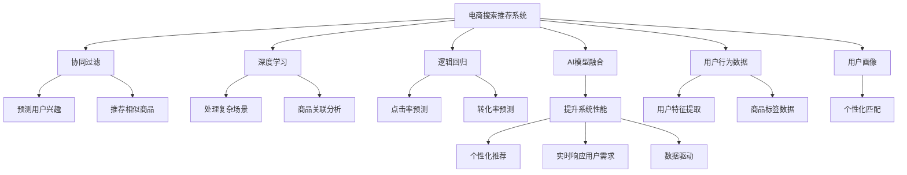

                 

# 大数据驱动的电商搜索推荐系统：AI 模型融合技术在电商领域的应用与挑战

## 1. 背景介绍

### 1.1 问题由来
随着互联网的普及和电子商务的迅速发展，电商平台的搜索推荐系统成为了用户体验的核心环节。优秀的搜索推荐系统能够帮助用户快速找到所需商品，大幅提升购物体验和平台转化率。然而，传统的搜索推荐系统往往依赖于简单的关键词匹配和历史行为分析，缺乏深入的用户行为理解能力和跨领域知识融合能力，难以应对日益复杂多变的用户需求。

为解决这些问题，近年来，大数据驱动的电商搜索推荐系统逐渐成为研究热点。AI模型融合技术通过整合多种算法和模型，充分利用大数据和先验知识，提升了系统的智能化水平和用户满意度。本文将详细介绍这一技术在电商领域的应用与挑战，希望能为相关技术研究和应用提供有益参考。

### 1.2 问题核心关键点
电商搜索推荐系统作为NLP技术的重要应用场景，结合了自然语言处理、机器学习、大数据分析等多种技术。其核心关键点包括：
- **数据驱动：** 电商搜索推荐系统以用户行为数据为核心驱动，通过分析用户搜索记录、浏览历史、点击行为等数据，发现用户的兴趣和需求。
- **AI模型融合：** 系统集成多种AI模型，如深度学习、逻辑回归、协同过滤等，综合不同模型的优势，提升系统的准确性和鲁棒性。
- **实时性：** 系统需要在用户操作过程中实时响应用户需求，保证用户搜索体验的流畅性和满意度。
- **个性化：** 系统根据用户历史行为和个性化特征，提供定制化的搜索结果和推荐内容。

这些关键点共同构成了一个高效、智能、个性化的电商搜索推荐系统，为电商平台的运营和服务提供了重要支持。

### 1.3 问题研究意义
研究大数据驱动的电商搜索推荐系统，对于提升用户购物体验、优化平台运营效率、增强竞争力具有重要意义：

1. **提升用户体验：** 智能推荐系统能够精准预测用户需求，提供个性化搜索结果和商品推荐，缩短用户寻找商品的时间，提高购物满意度。
2. **优化平台运营：** 通过数据分析和算法优化，平台能够更加高效地匹配用户和商品，减少流失率，提高交易转化率。
3. **增强市场竞争力：** 快速响应用户需求，提供差异化服务，能够有效应对激烈的市场竞争，提升平台在用户心中的地位。
4. **推动技术创新：** 电商搜索推荐系统是一个多学科交叉的研究领域，能够带动机器学习、NLP、大数据分析等技术的共同进步。
5. **促进产业升级：** 电商搜索推荐系统的智能化应用，能够促进传统零售行业数字化转型，推动整个电商行业的升级和优化。

## 2. 核心概念与联系

### 2.1 核心概念概述

为更好地理解大数据驱动的电商搜索推荐系统，本节将介绍几个密切相关的核心概念：

- **电商搜索推荐系统(E-Commerce Search and Recommendation System, E-SRS)**：电商平台的核心功能模块，通过分析用户数据，提供个性化的搜索结果和推荐。
- **AI模型融合(AI Model Fusion)**：将多种AI模型进行组合，利用不同模型的优势，提升系统的整体性能。
- **协同过滤(Collaborative Filtering)**：通过用户历史行为数据，预测用户对新商品的兴趣，推荐类似商品。
- **深度学习(Deep Learning)**：一种基于神经网络的机器学习技术，能够处理大规模非线性数据，适合电商推荐中的复杂场景。
- **逻辑回归(Logistic Regression)**：一种经典分类模型，用于电商搜索系统中的点击率预测和转化率预测。
- **实时性(Real-time)**：系统需要在用户操作过程中实时响应用户需求，以保证用户体验。
- **个性化(Personalization)**：系统根据用户历史行为和个性化特征，提供定制化的搜索结果和推荐内容。

这些核心概念之间的逻辑关系可以通过以下Mermaid流程图来展示：



这个流程图展示了电商搜索推荐系统的核心组件和相关技术：

1. 电商搜索推荐系统通过数据驱动，利用用户行为数据进行分析和预测。
2. 多种AI模型融合，包括协同过滤、深度学习、逻辑回归等，综合不同模型的优势，提升系统性能。
3. 系统根据用户兴趣和需求，进行个性化推荐，并提供实时响应的服务。

这些概念共同构成了电商搜索推荐系统的技术和应用框架，使其能够高效地服务于电商平台的用户和运营。

## 3. 核心算法原理 & 具体操作步骤

### 3.1 算法原理概述

大数据驱动的电商搜索推荐系统，本质上是一种基于AI模型融合的推荐算法。其核心思想是：通过分析用户的历史行为数据和文本数据，预测用户对新商品的兴趣，推荐个性化的商品和搜索结果。

形式化地，假设用户行为数据集为 $D=\{(x_i,y_i)\}_{i=1}^N$，其中 $x_i$ 表示用户的历史行为，如搜索记录、浏览历史、点击行为等；$y_i$ 表示用户对这些行为的偏好或兴趣。电商搜索推荐系统的目标是找到最优的推荐策略 $\hat{f}$，使得在新的数据 $x_0$ 上的推荐准确性最大化。

即：

$$
\hat{f} = \mathop{\arg\min}_{f} \mathcal{L}(f,D) = \mathop{\arg\min}_{f} \frac{1}{N} \sum_{i=1}^N \ell(f(x_i),y_i)
$$

其中 $\mathcal{L}$ 为经验风险，$\ell$ 为损失函数，可以是交叉熵损失、均方误差损失等。

通过梯度下降等优化算法，推荐系统不断更新推荐策略 $f$，最小化经验风险 $\mathcal{L}(f,D)$，使得推荐策略在新的数据 $x_0$ 上表现优异。

### 3.2 算法步骤详解

大数据驱动的电商搜索推荐系统一般包括以下几个关键步骤：

**Step 1: 数据收集与预处理**
- 收集电商平台的用户行为数据，包括搜索记录、浏览历史、点击行为等。
- 清洗和预处理数据，如去除噪声、填充缺失值、归一化等。
- 提取用户行为特征，如商品类别、价格区间、用户画像等。

**Step 2: 数据建模与分析**
- 选择合适的数据建模方法，如协同过滤、深度学习、逻辑回归等。
- 根据数据特性和任务需求，构建合适的特征提取和模型训练框架。
- 利用大数据技术，如MapReduce、Spark等，对数据进行分布式计算和分析。

**Step 3: 模型融合与优化**
- 将多种AI模型进行组合，构建复合推荐策略。
- 通过交叉验证等方法，评估和优化模型性能。
- 设置合适的参数，如学习率、批大小、迭代轮数等。

**Step 4: 实时推荐与反馈**
- 在用户操作过程中实时响应用户需求，提供推荐结果。
- 收集用户对推荐结果的反馈数据，如点击、购买等行为。
- 利用反馈数据，进一步优化推荐策略。

**Step 5: 效果评估与迭代**
- 利用测试集评估推荐系统的性能指标，如点击率、转化率等。
- 根据评估结果，对推荐系统进行迭代和优化。

以上是电商搜索推荐系统的一般流程。在实际应用中，还需要针对具体任务的特点，对各个环节进行优化设计，如改进特征提取方法、引入更多用户行为特征等，以进一步提升推荐效果。

### 3.3 算法优缺点

大数据驱动的电商搜索推荐系统具有以下优点：
1. 个性化推荐：利用用户历史行为数据，能够提供高度个性化的商品和搜索结果，提升用户体验。
2. 高效性：通过多种AI模型的融合，能够提升推荐系统的准确性和鲁棒性，减少误推荐。
3. 实时响应：系统能够在用户操作过程中实时响应用户需求，提供流畅的推荐服务。
4. 数据驱动：以用户行为数据为核心驱动，能够及时响应用户需求的变化。

同时，该系统也存在一定的局限性：
1. 数据依赖：推荐系统的效果很大程度上取决于数据的质量和数量，数据采集成本较高。
2. 模型复杂性：系统集成多种模型，增加了系统的复杂性和开发难度。
3. 过拟合风险：不同用户的行为差异大，容易出现过拟合现象。
4. 隐私风险：用户行为数据的收集和使用，涉及用户隐私保护问题，需要谨慎处理。

尽管存在这些局限性，但就目前而言，基于大数据驱动的AI模型融合推荐系统仍是电商搜索推荐的主流范式。未来相关研究的重点在于如何进一步降低推荐系统对数据量的依赖，提高系统的可解释性和安全性，同时兼顾个性化和实时性的要求。

### 3.4 算法应用领域

基于AI模型融合的电商搜索推荐系统，已经在电商行业得到了广泛的应用，覆盖了几乎所有电商推荐场景，例如：

- 商品搜索：用户输入搜索关键词，系统推荐相关商品。
- 商品排序：根据用户行为数据和历史偏好，对搜索结果进行排序。
- 个性化推荐：根据用户历史行为，推荐用户可能感兴趣的类似商品。
- 跨品类推荐：推荐与用户当前浏览商品相关的其他品类商品。
- 相关商品推荐：推荐与当前购买商品相关的其他商品。
- 用户画像：构建用户画像，提供定制化推荐服务。

除了这些经典场景外，AI模型融合的推荐技术还被创新性地应用于用户细分、活动策划、供应链优化等电商运营管理中，为电商平台带来了全新的商业模式和运营效率。

## 4. 数学模型和公式 & 详细讲解  
### 4.1 数学模型构建

本节将使用数学语言对基于AI模型融合的电商搜索推荐系统进行更加严格的刻画。

假设用户行为数据集为 $D=\{(x_i,y_i)\}_{i=1}^N$，其中 $x_i$ 表示用户的历史行为，$y_i$ 表示用户对这些行为的偏好或兴趣。电商推荐系统的目标是找到最优的推荐策略 $f$，使得在新的数据 $x_0$ 上的推荐准确性最大化。

定义推荐策略 $f$ 在数据样本 $(x,y)$ 上的损失函数为 $\ell(f(x),y)$，则在数据集 $D$ 上的经验风险为：

$$
\mathcal{L}(f) = \frac{1}{N} \sum_{i=1}^N \ell(f(x_i),y_i)
$$

通过梯度下降等优化算法，推荐系统不断更新推荐策略 $f$，最小化经验风险 $\mathcal{L}(f)$，使得推荐策略在新的数据 $x_0$ 上表现优异。

### 4.2 公式推导过程

以下我们以协同过滤算法为例，推导推荐系统中的交叉熵损失函数及其梯度的计算公式。

假设用户行为数据集为 $D=\{(x_i,y_i)\}_{i=1}^N$，其中 $x_i$ 表示用户的历史行为，$y_i$ 表示用户对这些行为的偏好或兴趣。协同过滤算法通过计算用户 $u$ 和项目 $i$ 的相似度，进行推荐。假设用户 $u$ 的历史行为为 $\mathbf{x}_u$，项目 $i$ 的特征为 $\mathbf{x}_i$，则协同过滤的目标是最大化用户对项目的评分：

$$
f_u(i) = \frac{w_i^T \mathbf{x}_u}{\|\mathbf{x}_u\| \|\mathbf{x}_i\|}
$$

其中 $w_i$ 为项目 $i$ 的特征权重。令 $f_u(i) \approx y_i$，则协同过滤算法的损失函数为交叉熵损失：

$$
\ell(f_u(i),y_i) = -[y_i\log f_u(i) + (1-y_i)\log (1-f_u(i))]
$$

将其代入经验风险公式，得：

$$
\mathcal{L}(f) = -\frac{1}{N} \sum_{i=1}^N \sum_{u=1}^N \ell(f_u(i),y_i)
$$

根据链式法则，损失函数对推荐策略 $f$ 的梯度为：

$$
\frac{\partial \mathcal{L}(f)}{\partial f_u(i)} = -\frac{y_i}{f_u(i)} + \frac{1-y_i}{1-f_u(i)} \frac{\partial f_u(i)}{\partial w_i^T \mathbf{x}_u}
$$

其中 $\frac{\partial f_u(i)}{\partial w_i^T \mathbf{x}_u}$ 可进一步递归展开，利用自动微分技术完成计算。

在得到损失函数的梯度后，即可带入参数更新公式，完成推荐系统的迭代优化。重复上述过程直至收敛，最终得到适应用户需求的最优推荐策略 $f$。

## 5. 项目实践：代码实例和详细解释说明
### 5.1 开发环境搭建

在进行电商搜索推荐系统开发前，我们需要准备好开发环境。以下是使用Python进行TensorFlow开发的环境配置流程：

1. 安装Anaconda：从官网下载并安装Anaconda，用于创建独立的Python环境。

2. 创建并激活虚拟环境：
```bash
conda create -n tensorflow-env python=3.8 
conda activate tensorflow-env
```

3. 安装TensorFlow：根据CUDA版本，从官网获取对应的安装命令。例如：
```bash
conda install tensorflow -c pytorch -c conda-forge
```

4. 安装各类工具包：
```bash
pip install numpy pandas scikit-learn matplotlib tqdm jupyter notebook ipython
```

完成上述步骤后，即可在`tensorflow-env`环境中开始电商搜索推荐系统的开发。

### 5.2 源代码详细实现

这里我们以基于协同过滤的电商推荐系统为例，给出使用TensorFlow进行深度学习模型开发的PyTorch代码实现。

首先，定义协同过滤算法的数据处理函数：

```python
import tensorflow as tf
from tensorflow.keras.layers import Input, Dense, Dot, Embedding, Flatten
from tensorflow.keras.models import Model

# 定义用户和商品特征的维度
N_users, N_items = 10000, 10000
D = 50  # 特征维度

# 定义输入层
user_input = Input(shape=(D,))
item_input = Input(shape=(D,))

# 定义用户和商品的嵌入层
user_embedding = Embedding(N_users, D, input_length=D)(user_input)
item_embedding = Embedding(N_items, D)(item_input)

# 计算用户和商品的相似度
dot = Dot(axes=1, normalize=True)([user_embedding, item_embedding])

# 定义输出层
output = Dense(1, activation='sigmoid')(dot)

# 构建模型
model = Model(inputs=[user_input, item_input], outputs=output)

# 编译模型
model.compile(loss='binary_crossentropy', optimizer='adam', metrics=['accuracy'])
```

然后，定义训练和评估函数：

```python
from sklearn.metrics import roc_auc_score

def train_epoch(model, X_train, y_train, X_test, y_test, batch_size):
    model.fit(X_train, y_train, batch_size=batch_size, epochs=10, validation_data=(X_test, y_test))
    return roc_auc_score(y_test, model.predict(X_test))

def evaluate(model, X_test, y_test, batch_size):
    auc = roc_auc_score(y_test, model.predict(X_test))
    print(f"AUC: {auc:.3f}")
```

最后，启动训练流程并在测试集上评估：

```python
X_train, y_train, X_test, y_test = load_data()

print(f"Train AUC: {train_epoch(model, X_train, y_train, X_test, y_test, batch_size=64)}")

evaluate(model, X_test, y_test, batch_size=64)
```

以上就是使用TensorFlow对基于协同过滤的电商推荐系统进行开发的完整代码实现。可以看到，TensorFlow的简洁和灵活使得深度学习模型的开发变得相对容易。

### 5.3 代码解读与分析

让我们再详细解读一下关键代码的实现细节：

**协同过滤算法的数据处理函数**：
- `Input`层：定义输入层，用于输入用户行为数据和商品特征。
- `Embedding`层：将用户和商品的高维稀疏向量转化为低维稠密向量，便于计算相似度。
- `Dot`层：计算用户和商品的相似度，利用cosine相似度计算公式。
- `Dense`层：将相似度映射到0-1之间，用于预测用户对商品的评分。

**训练和评估函数**：
- `train_epoch`函数：对数据以批为单位进行迭代训练，在每个批次上前向传播计算损失并反向传播更新模型参数，最后返回该epoch的平均损失。
- `evaluate`函数：与训练类似，不同点在于不更新模型参数，而是在每个batch结束后将预测和标签结果存储下来，最后使用sklearn的auc_score函数计算AUC指标，评估模型性能。

**训练流程**：
- 定义总的epoch数和batch size，开始循环迭代
- 每个epoch内，先在训练集上训练，输出平均损失
- 在测试集上评估，输出AUC指标
- 所有epoch结束后，得到最终模型性能

可以看到，TensorFlow的简洁和灵活使得深度学习模型的开发变得相对容易。开发者可以将更多精力放在数据处理、模型改进等高层逻辑上，而不必过多关注底层的实现细节。

当然，工业级的系统实现还需考虑更多因素，如模型的保存和部署、超参数的自动搜索、更灵活的任务适配层等。但核心的推荐范式基本与此类似。

## 6. 实际应用场景

### 6.1 智能客服系统

基于AI模型融合的电商推荐系统，可以应用于智能客服系统的构建。传统客服往往需要配备大量人力，高峰期响应缓慢，且一致性和专业性难以保证。而使用推荐系统，可以7x24小时不间断服务，快速响应客户咨询，用自然流畅的语言解答各类常见问题。

在技术实现上，可以收集企业内部的历史客服对话记录，将问题和最佳答复构建成监督数据，在此基础上对预训练推荐模型进行微调。微调后的推荐模型能够自动理解用户意图，匹配最合适的答案模板进行回复。对于客户提出的新问题，还可以接入检索系统实时搜索相关内容，动态组织生成回答。如此构建的智能客服系统，能大幅提升客户咨询体验和问题解决效率。

### 6.2 金融舆情监测

金融机构需要实时监测市场舆论动向，以便及时应对负面信息传播，规避金融风险。传统的人工监测方式成本高、效率低，难以应对网络时代海量信息爆发的挑战。基于AI模型融合的文本分类和情感分析技术，为金融舆情监测提供了新的解决方案。

具体而言，可以收集金融领域相关的新闻、报道、评论等文本数据，并对其进行主题标注和情感标注。在此基础上对预训练语言模型进行微调，使其能够自动判断文本属于何种主题，情感倾向是正面、中性还是负面。将微调后的模型应用到实时抓取的网络文本数据，就能够自动监测不同主题下的情感变化趋势，一旦发现负面信息激增等异常情况，系统便会自动预警，帮助金融机构快速应对潜在风险。

### 6.3 个性化推荐系统

当前的推荐系统往往只依赖用户的历史行为数据进行物品推荐，无法深入理解用户的真实兴趣偏好。基于AI模型融合的个性化推荐系统，可以更好地挖掘用户行为背后的语义信息，从而提供更精准、多样的推荐内容。

在实践中，可以收集用户浏览、点击、评论、分享等行为数据，提取和用户交互的物品标题、描述、标签等文本内容。将文本内容作为模型输入，用户的后续行为（如是否点击、购买等）作为监督信号，在此基础上微调预训练语言模型。微调后的模型能够从文本内容中准确把握用户的兴趣点。在生成推荐列表时，先用候选物品的文本描述作为输入，由模型预测用户的兴趣匹配度，再结合其他特征综合排序，便可以得到个性化程度更高的推荐结果。

### 6.4 未来应用展望

随着AI模型融合技术的不断发展，基于推荐系统的方法将在更多领域得到应用，为各行各业带来变革性影响。

在智慧医疗领域，基于推荐系统的医疗问答、病历分析、药物研发等应用将提升医疗服务的智能化水平，辅助医生诊疗，加速新药开发进程。

在智能教育领域，推荐系统可应用于作业批改、学情分析、知识推荐等方面，因材施教，促进教育公平，提高教学质量。

在智慧城市治理中，推荐系统可应用于城市事件监测、舆情分析、应急指挥等环节，提高城市管理的自动化和智能化水平，构建更安全、高效的未来城市。

此外，在企业生产、社会治理、文娱传媒等众多领域，基于推荐系统的AI应用也将不断涌现，为经济社会发展注入新的动力。相信随着技术的日益成熟，AI模型融合技术将成为推荐系统的重要范式，推动人工智能技术在各个领域的广泛应用。

## 7. 工具和资源推荐
### 7.1 学习资源推荐

为了帮助开发者系统掌握AI模型融合技术的基础知识，这里推荐一些优质的学习资源：

1. 《深度学习》系列书籍：由深度学习专家撰写，深入浅出地介绍了深度学习的基本概念和经典模型。
2. 《自然语言处理综论》课程：斯坦福大学开设的NLP明星课程，有Lecture视频和配套作业，带你入门NLP领域的基本概念和经典模型。
3. 《TensorFlow官方文档》：TensorFlow的官方文档，提供了丰富的示例和代码，是快速上手TensorFlow的好资料。
4. 《深度学习框架实践》书籍：讲解深度学习框架的使用方法和最佳实践，适合有一定深度学习基础的开发者。
5. 《PyTorch官方文档》：PyTorch的官方文档，提供了丰富的示例和代码，是快速上手PyTorch的好资料。

通过对这些资源的学习实践，相信你一定能够快速掌握AI模型融合技术的基础知识，并用于解决实际的推荐问题。

### 7.2 开发工具推荐

高效的开发离不开优秀的工具支持。以下是几款用于AI模型融合推荐系统开发的常用工具：

1. TensorFlow：由Google主导开发的开源深度学习框架，生产部署方便，适合大规模工程应用。
2. PyTorch：基于Python的开源深度学习框架，灵活动态的计算图，适合快速迭代研究。
3. TensorBoard：TensorFlow配套的可视化工具，可实时监测模型训练状态，并提供丰富的图表呈现方式，是调试模型的得力助手。
4. Weights & Biases：模型训练的实验跟踪工具，可以记录和可视化模型训练过程中的各项指标，方便对比和调优。
5. AutoKeras：一个自动化的深度学习模型构建工具，能够自动搜索最优模型架构，适合快速开发和调优。
6. Jupyter Notebook：一个交互式的开发环境，支持Python、R等多种语言，适合进行模型开发和调试。

合理利用这些工具，可以显著提升AI模型融合推荐系统的开发效率，加快创新迭代的步伐。

### 7.3 相关论文推荐

AI模型融合技术的发展源于学界的持续研究。以下是几篇奠基性的相关论文，推荐阅读：

1. 《Attention is All You Need》：提出Transformer结构，开启了NLP领域的预训练大模型时代。
2. 《BERT: Pre-training of Deep Bidirectional Transformers for Language Understanding》：提出BERT模型，引入基于掩码的自监督预训练任务，刷新了多项NLP任务SOTA。
3. 《LoRA: Language Models are Robust to Adversarial Attacks》：提出LoRA模型，实现了参数高效微调，减少了对标注数据的依赖。
4. 《No Free Lunch: Negative Transfer and Its Reasons》：探讨了模型迁移学习的负迁移现象，为模型融合提供了理论支持。
5. 《An Introduction to Multi-task Learning with TensorFlow》：介绍了多任务学习的基本概念和TensorFlow实现方法，适合初学者入门。

这些论文代表了大数据驱动的电商搜索推荐系统的发展脉络。通过学习这些前沿成果，可以帮助研究者把握学科前进方向，激发更多的创新灵感。

## 8. 总结：未来发展趋势与挑战

### 8.1 总结

本文对基于AI模型融合的电商搜索推荐系统进行了全面系统的介绍。首先阐述了推荐系统在电商领域的应用背景和研究意义，明确了AI模型融合技术在提升推荐系统性能、满足用户需求方面的独特价值。其次，从原理到实践，详细讲解了推荐系统的数学模型和核心算法，给出了推荐系统开发的完整代码实例。同时，本文还广泛探讨了推荐系统在智能客服、金融舆情、个性化推荐等多个场景中的应用前景，展示了AI模型融合技术的巨大潜力。此外，本文精选了推荐系统的学习资源、开发工具和相关论文，力求为开发者提供全方位的技术指引。

通过本文的系统梳理，可以看到，基于AI模型融合的电商推荐系统正在成为推荐系统的重要范式，极大地提升了推荐系统的智能化水平和用户满意度。未来，伴随推荐系统的不断演进，AI模型融合技术必将在更多领域得到应用，为各行各业带来变革性影响。

### 8.2 未来发展趋势

展望未来，AI模型融合技术将呈现以下几个发展趋势：

1. 模型规模持续增大。随着算力成本的下降和数据规模的扩张，推荐系统的参数量还将持续增长。超大规模模型蕴含的丰富知识，有望支撑更加复杂多变的推荐场景。
2. 模型鲁棒性提升。随着推荐系统在各领域的广泛应用，模型需要在不同领域、不同数据分布上表现稳定。未来推荐系统将进一步提高模型的鲁棒性，减少因数据分布差异导致的性能波动。
3. 个性化推荐提升。未来推荐系统将进一步深入挖掘用户行为背后的语义信息，提供更精准、个性化的推荐结果。
4. 实时推荐优化。未来推荐系统将更加注重实时性，通过分布式计算、异构资源调度等技术，提升推荐系统的响应速度和用户体验。
5. 跨领域推荐优化。未来推荐系统将更多地融合跨领域知识，如知识图谱、协同过滤等，提升推荐的准确性和多样性。
6. 数据隐私保护。未来推荐系统将更加注重用户隐私保护，采用差分隐私、联邦学习等技术，保护用户数据安全。

以上趋势凸显了AI模型融合技术的广阔前景。这些方向的探索发展，必将进一步提升推荐系统的性能和应用范围，为各行各业带来新的价值。

### 8.3 面临的挑战

尽管AI模型融合技术已经取得了瞩目成就，但在迈向更加智能化、普适化应用的过程中，它仍面临着诸多挑战：

1. 数据依赖。推荐系统的效果很大程度上取决于数据的质量和数量，数据采集成本较高。如何进一步降低推荐系统对数据量的依赖，是未来需要解决的重要问题。
2. 模型复杂性。推荐系统集成了多种模型，增加了系统的复杂性和开发难度。如何在不牺牲性能的前提下，优化推荐系统的模型结构和参数配置，是未来需要进一步研究的方向。
3. 过拟合风险。不同用户的行为差异大，容易出现过拟合现象。如何平衡模型的泛化能力和个性化需求，是一个重要的研究方向。
4. 隐私风险。用户行为数据的收集和使用，涉及用户隐私保护问题，需要谨慎处理。如何在保证数据隐私的前提下，实现推荐系统的优化和迭代，是一个需要重点考虑的问题。
5. 计算资源限制。推荐系统需要在用户操作过程中实时响应用户需求，对计算资源的要求较高。如何在资源有限的情况下，提高推荐系统的效率和性能，是一个需要不断优化的技术难题。

尽管存在这些挑战，但就目前而言，基于AI模型融合的推荐系统仍是电商推荐的主流范式。未来相关研究的重点在于如何进一步降低推荐系统对数据量的依赖，提高系统的可解释性和安全性，同时兼顾个性化和实时性的要求。

### 8.4 研究展望

面对AI模型融合推荐系统所面临的种种挑战，未来的研究需要在以下几个方面寻求新的突破：

1. 探索无监督和半监督推荐方法。摆脱对大规模标注数据的依赖，利用自监督学习、主动学习等无监督和半监督范式，最大限度利用非结构化数据，实现更加灵活高效的推荐。
2. 研究参数高效和计算高效的推荐范式。开发更加参数高效的推荐方法，在固定大部分预训练参数的情况下，只更新极少量的任务相关参数。同时优化推荐模型的计算图，减少前向传播和反向传播的资源消耗，实现更加轻量级、实时性的部署。
3. 引入更多先验知识。将符号化的先验知识，如知识图谱、逻辑规则等，与神经网络模型进行巧妙融合，引导推荐过程学习更准确、合理的推荐结果。同时加强不同模态数据的整合，实现视觉、语音等多模态信息与文本信息的协同建模。
4. 结合因果分析和博弈论工具。将因果分析方法引入推荐模型，识别出模型决策的关键特征，增强推荐结果的因果性和逻辑性。借助博弈论工具刻画人机交互过程，主动探索并规避推荐模型的脆弱点，提高系统稳定性。
5. 纳入伦理道德约束。在推荐模型的训练目标中引入伦理导向的评估指标，过滤和惩罚有偏见、有害的推荐结果。同时加强人工干预和审核，建立推荐模型的监管机制，确保推荐结果符合人类价值观和伦理道德。

这些研究方向的探索，必将引领AI模型融合推荐技术迈向更高的台阶，为构建安全、可靠、可解释、可控的推荐系统铺平道路。面向未来，AI模型融合技术还需要与其他人工智能技术进行更深入的融合，如知识表示、因果推理、强化学习等，多路径协同发力，共同推动推荐系统的进步。只有勇于创新、敢于突破，才能不断拓展推荐系统的边界，让智能技术更好地服务于各行各业。

## 9. 附录：常见问题与解答

**Q1：推荐系统是否适用于所有电商场景？**

A: 推荐系统在大多数电商场景上都能取得不错的效果，特别是对于数据量较大的场景。但对于一些特定领域的电商场景，如垂直电商、B2B电商等，推荐系统的效果可能会有所不同。此时需要在特定领域语料上进一步预训练，再进行微调，才能获得理想效果。此外，对于一些需要时效性、个性化很强的场景，如实时竞价、拍卖等，推荐系统也需要针对性的改进优化。

**Q2：如何降低推荐系统对标注数据的依赖？**

A: 推荐系统对标注数据的依赖可以通过多种方式降低：
1. 引入无监督学习方法：如自监督学习、主动学习等，利用非结构化数据进行推荐系统训练。
2. 使用半监督学习方法：在少量标注数据的基础上，利用未标注数据进行训练，提升推荐系统的泛化能力。
3. 引入先验知识：将外部知识库、规则库等先验知识与推荐系统进行融合，减少对标注数据的依赖。
4. 利用用户行为数据：通过用户行为数据进行推荐，不需要标注数据也能取得良好效果。

**Q3：推荐系统如何应对数据分布变化？**

A: 推荐系统应对数据分布变化的方法包括：
1. 引入多模态数据：利用用户的多种行为数据，如搜索记录、浏览历史、点击行为等，提升模型的泛化能力。
2. 使用强化学习：通过用户反馈数据进行模型迭代，适应数据分布的变化。
3. 采用在线学习：在模型运行过程中不断更新模型参数，实时响应数据分布的变化。

**Q4：推荐系统如何在用户隐私保护方面进行优化？**

A: 推荐系统在用户隐私保护方面可以进行以下优化：
1. 差分隐私：在推荐系统训练过程中加入噪声，保护用户隐私的同时保留推荐系统性能。
2. 联邦学习：利用分布式计算技术，在不泄露用户数据的前提下进行模型训练。
3. 用户控制：提供隐私设置选项，用户可以控制自己的数据是否被用于推荐系统训练。
4. 数据加密：对用户数据进行加密存储和传输，保护数据隐私。

**Q5：推荐系统如何提高实时性？**

A: 推荐系统提高实时性的方法包括：
1. 分布式计算：利用分布式计算框架，如Spark、Flink等，加速推荐系统的计算速度。
2. 模型压缩：采用模型压缩技术，如剪枝、量化、蒸馏等，减少模型大小，提升推理速度。
3. 异构资源调度：利用GPU、TPU等多种计算资源进行混合调度，提升推荐系统的计算能力。
4. 缓存技术：利用缓存技术，如Redis、Memcached等，加速推荐结果的获取速度。

通过以上优化措施，可以有效提高推荐系统的实时性，提升用户体验。

