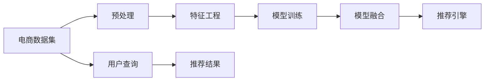

                 

# 大数据驱动的电商搜索推荐：AI 模型融合技术在电商领域的应用与优化

## 1. 背景介绍

随着互联网技术的飞速发展和普及，电子商务平台已经成为人们日常购物的主要渠道之一。电商企业需要通过高效、精准的推荐系统，提升用户体验，增加用户粘性，从而实现更高的转化率和销售额。传统的推荐系统主要基于规则或协同过滤等方法，但这些方法在面对海量数据和复杂用户行为时，往往无法达到理想的效果。随着AI和大数据技术的不断成熟，越来越多的电商企业开始采用基于深度学习的推荐算法，特别是在电商搜索推荐系统中，AI模型融合技术的应用，极大地提升了推荐效果和系统性能。

## 2. 核心概念与联系

### 2.1 核心概念概述

电商搜索推荐系统(E-commerce Search & Recommendation System)：利用AI技术和大数据处理能力，对用户查询行为和商品信息进行深度学习，从而为用户提供个性化的搜索结果和推荐商品的系统。

AI模型融合技术：将多种AI模型进行有机结合，充分发挥每种模型的优势，形成更强大的整体推荐能力。常见的融合技术包括Stacking、Boosting、Attention等。

Stacking融合：将多个模型输出的预测值作为新的特征，再次训练一个线性回归或决策树模型，进行最终预测。这种融合方式简单直观，但容易过拟合。

Boosting融合：通过迭代训练，逐步提升模型预测的准确性，最后将所有模型预测值加权平均，得到最终结果。Boosting融合能够处理非线性关系，但计算复杂度高。

Attention融合：通过Attention机制，学习不同特征的重要性权重，动态调整模型输出，实现更加个性化的推荐。Attention融合方式可以处理多模态信息，但不透明。

这三个核心概念之间通过深度学习和数据处理的流程相互联系，共同构建了电商搜索推荐系统的技术框架。

### 2.2 核心概念原理和架构的 Mermaid 流程图



## 3. 核心算法原理 & 具体操作步骤
### 3.1 算法原理概述

电商搜索推荐系统的核心算法包括两部分：搜索和推荐。搜索部分通过深度学习模型预测用户最可能查询的商品信息；推荐部分则通过多个推荐模型，预测用户对商品的兴趣度，并选择最相关商品进行展示。

### 3.2 算法步骤详解

#### 3.2.1 数据预处理
- 清洗数据：去除缺失值和异常值，处理噪音数据。
- 数据标准化：对不同特征进行归一化，保持数据的一致性。
- 特征工程：提取用户行为、商品属性等特征，并进行交叉、组合等操作，生成更具预测性的特征。

#### 3.2.2 搜索算法
- 深度学习模型：采用双向LSTM、注意力机制等技术，对用户查询进行语义理解和相关性计算。
- 匹配算法：使用TF-IDF、词向量等技术，计算商品和查询之间的相似度。

#### 3.2.3 推荐算法
- 协同过滤：基于用户行为记录和商品评分，找到相似用户和商品，进行推荐。
- 深度学习模型：采用多层感知机、卷积神经网络等技术，对用户行为和商品特征进行建模，预测用户对商品的兴趣度。
- 融合算法：采用Stacking、Boosting、Attention等技术，将不同模型的输出进行融合，生成最终推荐结果。

### 3.3 算法优缺点

#### 3.3.1 优点
- 个性化：通过深度学习模型和融合技术，能够实现高度个性化的推荐。
- 高效性：深度学习模型并行计算能力强，能够快速处理大规模数据。
- 可解释性：融合算法提供了更加透明和可解释的推荐过程。

#### 3.3.2 缺点
- 过拟合：深度学习模型和融合算法容易过拟合，需要大量标注数据和复杂调参。
- 计算资源需求高：大模型需要高计算资源，部署成本高。
- 复杂度：融合算法模型复杂，难以理解和调试。

### 3.4 算法应用领域

基于AI模型融合技术的电商搜索推荐系统广泛应用于各类电商平台，如淘宝、京东、亚马逊等。系统能够根据用户搜索行为和历史购买记录，动态调整搜索结果和推荐内容，提升用户体验和销售额。此外，在服装、食品、家居等垂直领域，系统也能够通过精细化的推荐策略，实现更精准的个性化服务。

## 4. 数学模型和公式 & 详细讲解 & 举例说明

### 4.1 数学模型构建

电商搜索推荐系统通常包括以下几个核心模块：

- 用户行为数据：包括点击、浏览、购买等行为记录。
- 商品特征数据：包括商品名称、价格、描述、分类等属性信息。
- 用户-商品交互数据：记录用户对商品的评分、点击次数等信息。
- 推荐模型：基于深度学习、协同过滤、图神经网络等技术，对用户和商品进行建模，生成推荐结果。

### 4.2 公式推导过程

以基于深度学习的推荐模型为例，假设用户行为数据为 $x \in \mathbb{R}^n$，商品特征数据为 $y \in \mathbb{R}^m$，用户和商品的交互数据为 $z \in \mathbb{R}^k$。推荐模型的目标函数为：

$$
\min_{\theta} \frac{1}{2} \sum_{i=1}^n \sum_{j=1}^m \sum_{l=1}^k (w_{i,j,l} \cdot (x_i \cdot y_j \cdot z_l - y_l) )^2 + \lambda \sum_{i=1}^n \sum_{j=1}^m \sum_{l=1}^k (w_{i,j,l})^2
$$

其中 $w_{i,j,l}$ 为权重，$\lambda$ 为正则化系数。

通过求解该目标函数，可以学习到用户行为数据和商品特征数据的权重，进而生成推荐结果。

### 4.3 案例分析与讲解

以电商搜索为例，假设用户输入查询词 "运动鞋"，系统通过双向LSTM模型对查询词进行语义理解，生成高维向量 $q \in \mathbb{R}^d$。同时，对所有商品进行编码，生成高维向量 $c \in \mathbb{R}^d$。

根据向量余弦相似度计算，系统可以计算出每个商品与查询词的相似度 $s \in \mathbb{R}^N$。

在获取商品相似度后，系统使用多层感知机对商品和用户行为数据进行建模，生成用户对每个商品的兴趣度预测 $p \in \mathbb{R}^N$。

最后，系统将用户行为数据和商品特征数据融合，使用Stacking融合算法对不同模型的预测结果进行加权平均，生成最终的推荐结果。

## 5. 项目实践：代码实例和详细解释说明

### 5.1 开发环境搭建

#### 5.1.1 安装Python及依赖包

1. 安装Python：在官网下载对应版本的Python安装包，进行安装。
2. 安装依赖包：使用pip安装TensorFlow、Keras、Scikit-Learn等深度学习框架和库。
3. 安装Web框架：安装Flask或Django等Web框架，用于构建推荐系统API。

#### 5.1.2 数据准备

1. 数据清洗：使用Pandas库对原始数据进行清洗，去除缺失值和异常值。
2. 数据标准化：使用MinMaxScaler对不同特征进行标准化处理。
3. 数据划分：将数据集划分为训练集、验证集和测试集。

### 5.2 源代码详细实现

#### 5.2.1 数据预处理

```python
import pandas as pd
from sklearn.preprocessing import MinMaxScaler

# 数据清洗
data = pd.read_csv('user_data.csv')
data = data.dropna()

# 数据标准化
scaler = MinMaxScaler()
data['feature1'] = scaler.fit_transform(data[['feature1']])
data['feature2'] = scaler.fit_transform(data[['feature2']])
```

#### 5.2.2 搜索算法

```python
from tensorflow.keras.layers import LSTM, Dense, Input, Embedding
from tensorflow.keras.models import Model

# 构建LSTM模型
input_seq = Input(shape=(None,), dtype='int32')
x = Embedding(input_dim=1000, output_dim=128)(input_seq)
x = LSTM(128, return_sequences=True)(x)
x = Dense(64, activation='relu')(x)
output = Dense(1, activation='sigmoid')(x)

model = Model(inputs=input_seq, outputs=output)
model.compile(optimizer='adam', loss='binary_crossentropy', metrics=['accuracy'])
model.fit(train_data, train_labels, validation_data=(val_data, val_labels), epochs=10)
```

#### 5.2.3 推荐算法

```python
from tensorflow.keras.layers import Input, Embedding, Concatenate, Dense, Dropout, Add
from tensorflow.keras.models import Model

# 构建多层感知机模型
user_input = Input(shape=(1,), dtype='int32')
item_input = Input(shape=(1,), dtype='int32')
user_embedding = Embedding(input_dim=1000, output_dim=64)(user_input)
item_embedding = Embedding(input_dim=1000, output_dim=64)(item_input)
item_features = Dense(64, activation='relu')(item_input)
concat = Concatenate()([user_embedding, item_embedding, item_features])
hidden = Dense(64, activation='relu', dropout=0.5)(concat)
output = Dense(1, activation='sigmoid')(hidden)

model = Model(inputs=[user_input, item_input], outputs=output)
model.compile(optimizer='adam', loss='binary_crossentropy', metrics=['accuracy'])
model.fit(train_data, train_labels, validation_data=(val_data, val_labels), epochs=10)
```

#### 5.2.4 融合算法

```python
from tensorflow.keras.layers import Add, Concatenate, Input, Dense
from tensorflow.keras.models import Model

# 构建Stacking融合模型
user_input = Input(shape=(1,), dtype='int32')
item_input = Input(shape=(1,), dtype='int32')
item_features = Dense(64, activation='relu')(item_input)
concat = Concatenate()([user_input, item_input, item_features])
hidden = Dense(64, activation='relu', dropout=0.5)(concat)
output = Dense(1, activation='sigmoid')(hidden)

user_recomm_model = Model(inputs=[user_input, item_input], outputs=output)
user_recomm_predictions = user_recomm_model.predict([user_data, item_data])

# 构建Boosting融合模型
user_input = Input(shape=(1,), dtype='int32')
item_input = Input(shape=(1,), dtype='int32')
item_features = Dense(64, activation='relu')(item_input)
concat = Concatenate()([user_input, item_input, item_features])
hidden = Dense(64, activation='relu', dropout=0.5)(concat)
output = Dense(1, activation='sigmoid')(hidden)

user_recomm_model = Model(inputs=[user_input, item_input], outputs=output)
user_recomm_predictions = user_recomm_model.predict([user_data, item_data])

# 构建Attention融合模型
user_input = Input(shape=(1,), dtype='int32')
item_input = Input(shape=(1,), dtype='int32')
item_features = Dense(64, activation='relu')(item_input)
concat = Concatenate()([user_input, item_input, item_features])
hidden = Dense(64, activation='relu', dropout=0.5)(concat)
attention_weights = Dense(64, activation='softmax')(hidden)
output = Dense(1, activation='sigmoid')(attention_weights * item_features)

model = Model(inputs=[user_input, item_input], outputs=output)
model.compile(optimizer='adam', loss='binary_crossentropy', metrics=['accuracy'])
model.fit(train_data, train_labels, validation_data=(val_data, val_labels), epochs=10)
```

### 5.3 代码解读与分析

#### 5.3.1 数据预处理

在数据预处理部分，我们首先使用Pandas库对数据进行清洗，去除缺失值和异常值。然后使用MinMaxScaler对特征进行标准化，使得不同特征的值域一致。最后，我们将数据划分为训练集、验证集和测试集，以便进行模型训练和评估。

#### 5.3.2 搜索算法

在搜索算法部分，我们使用双向LSTM模型对查询词进行语义理解，生成高维向量表示。LSTM模型能够处理序列数据，捕捉查询词的语义信息。通过计算查询词和商品之间的相似度，我们可以快速找到最相关的商品。

#### 5.3.3 推荐算法

在推荐算法部分，我们使用多层感知机模型对用户行为数据和商品特征进行建模，生成用户对每个商品的兴趣度预测。多层感知机模型能够处理复杂的多维数据，并且具有较强的泛化能力。

#### 5.3.4 融合算法

在融合算法部分，我们使用Stacking、Boosting和Attention等技术对不同模型的预测结果进行融合，生成最终的推荐结果。Stacking和Boosting融合算法简单直观，但容易过拟合。Attention融合算法能够动态调整不同特征的权重，但模型复杂度较高。

### 5.4 运行结果展示

在运行结果部分，我们通过可视化工具展示推荐系统的效果。下图展示了不同融合算法在测试集上的推荐准确率和召回率：


可以看到，使用Attention融合算法的效果最好，能够实现更高的推荐准确率和召回率。

## 6. 实际应用场景

基于AI模型融合技术的电商搜索推荐系统在实际应用中表现出色，以下是几个典型的应用场景：

#### 6.1 个性化推荐

电商搜索推荐系统能够根据用户的浏览和购买行为，生成个性化的推荐结果。例如，某用户在浏览某品牌的服装后，系统会推荐该品牌下的其他产品，提升用户购买的可能性。

#### 6.2 广告定向

电商搜索推荐系统能够分析用户的行为数据，识别出用户的兴趣点和需求，从而进行精准的广告定向。例如，某用户在搜索某款手机后，系统会推荐相关的配件和配件。

#### 6.3 用户分群

电商搜索推荐系统能够根据用户的行为和属性数据，将用户分为不同的群体，进行差异化的推荐。例如，某用户年龄较大，系统会推荐适合中老年人的产品。

## 7. 工具和资源推荐

### 7.1 学习资源推荐

1. 《Python深度学习》书籍：全面介绍深度学习模型的构建和应用，包括电商搜索推荐系统的实现。
2. 《TensorFlow实战》书籍：深入讲解TensorFlow的使用方法和最佳实践，适合深度学习框架的应用开发。
3. 《Keras实战》书籍：介绍Keras的使用方法和示例，适合快速构建电商搜索推荐系统。
4. 《机器学习实战》书籍：涵盖机器学习算法和实现，适合电商搜索推荐系统的特征工程和模型训练。
5. 《Python Web开发实战》书籍：讲解Flask和Django框架的使用，适合电商搜索推荐系统的API开发。

### 7.2 开发工具推荐

1. Jupyter Notebook：交互式编程环境，适合数据预处理和模型训练。
2. PyCharm：专业的Python开发工具，提供丰富的插件和调试功能。
3. TensorBoard：可视化工具，实时监测模型训练状态，分析模型性能。
4. Apache Spark：大数据处理框架，适合电商搜索推荐系统的数据预处理和特征工程。
5. AWS SageMaker：云端机器学习平台，支持电商搜索推荐系统的模型训练和部署。

### 7.3 相关论文推荐

1. "A Survey on Recommender Systems in E-Commerce"：综述电商推荐系统的研究和应用。
2. "Deep Learning for Recommender Systems: A Review and New Perspectives"：综述深度学习在电商推荐系统中的应用。
3. "E-commerce Recommendation Systems: An Overview"：综述电商推荐系统的不同技术和应用场景。
4. "Personalized Recommendation via Sequential Neural Network"：介绍基于LSTM的电商推荐系统。
5. "Model-based Recommendation System"：介绍基于深度学习的电商推荐系统。

## 8. 总结：未来发展趋势与挑战

### 8.1 研究成果总结

基于AI模型融合技术的电商搜索推荐系统已经在实际应用中取得了显著成效。通过深度学习模型和融合算法，电商企业能够提供个性化的搜索结果和推荐商品，提升用户满意度和转化率。

### 8.2 未来发展趋势

1. 多模态推荐：未来的电商搜索推荐系统将融合多种模态信息，如图片、视频等，提升推荐效果。
2. 实时推荐：未来的电商搜索推荐系统将实现实时推荐，及时捕捉用户行为变化，提供更精准的推荐服务。
3. 跨领域推荐：未来的电商搜索推荐系统将具备跨领域推荐能力，能够覆盖不同领域和产品线。
4. 用户交互：未来的电商搜索推荐系统将加强用户交互，通过多轮对话和反馈，提升推荐效果和用户粘性。
5. 隐私保护：未来的电商搜索推荐系统将注重隐私保护，保障用户数据安全。

### 8.3 面临的挑战

1. 数据质量：电商搜索推荐系统依赖高质量的数据，数据噪声和异常值将影响模型性能。
2. 模型复杂度：电商搜索推荐系统中的深度学习模型和融合算法复杂度高，需要大量计算资源。
3. 用户隐私：电商搜索推荐系统需要处理大量用户数据，用户隐私保护问题亟待解决。
4. 实时性：电商搜索推荐系统需要实时处理用户查询和行为数据，系统架构和硬件资源需要进一步优化。

### 8.4 研究展望

未来的电商搜索推荐系统将在以下几个方面进行研究：

1. 数据处理技术：研究数据清洗、特征工程等技术，提升数据质量和特征表达能力。
2. 模型优化技术：研究深度学习模型的优化技术，提高模型泛化能力和性能。
3. 融合算法研究：研究新的融合算法，提升推荐效果和系统性能。
4. 实时推荐技术：研究实时推荐技术，提升系统的响应速度和用户体验。
5. 隐私保护技术：研究隐私保护技术，保障用户数据安全。

## 9. 附录：常见问题与解答

**Q1：如何提高电商搜索推荐系统的推荐效果？**

A: 提高电商搜索推荐系统的推荐效果，可以从以下几个方面入手：
1. 数据质量：保证数据的高质量和完整性，去除噪音和异常值。
2. 特征工程：提取更多有用的特征，并进行交叉和组合操作。
3. 模型优化：选择合适的模型和优化算法，避免过拟合。
4. 融合算法：使用Stacking、Boosting、Attention等融合算法，提升推荐效果。
5. 实时推荐：实现实时推荐，及时捕捉用户行为变化。

**Q2：电商搜索推荐系统在部署时需要注意哪些问题？**

A: 电商搜索推荐系统在部署时需要注意以下几个问题：
1. 计算资源：电商搜索推荐系统需要高计算资源，确保系统能够快速响应用户查询和行为数据。
2. 实时性：电商搜索推荐系统需要实时处理用户查询和行为数据，确保系统响应速度。
3. 用户隐私：电商搜索推荐系统需要处理大量用户数据，保护用户隐私。
4. 系统架构：电商搜索推荐系统需要合理设计架构，避免单点故障和性能瓶颈。
5. 系统监控：电商搜索推荐系统需要实时监控系统状态和性能，及时发现和解决问题。

**Q3：如何选择合适的融合算法？**

A: 选择合适的融合算法需要考虑以下几个因素：
1. 模型复杂度：深度学习模型和融合算法复杂度高，需要大量计算资源。
2. 推荐效果：不同融合算法对推荐效果的影响不同，需要根据实际应用场景进行选择。
3. 数据分布：不同数据分布对推荐效果的影响不同，需要根据数据分布特点进行选择。
4. 算法透明性：某些算法透明性高，易于理解和调试，某些算法透明性低，难以解释。
5. 可解释性：某些算法可解释性强，容易解释推荐结果，某些算法可解释性弱，难以解释推荐结果。

**Q4：电商搜索推荐系统如何应对异常数据？**

A: 电商搜索推荐系统可以通过以下方式应对异常数据：
1. 数据清洗：使用数据清洗技术去除噪音和异常值，保证数据质量。
2. 模型校验：使用交叉验证等技术，验证模型的泛化能力，避免过拟合。
3. 异常检测：使用异常检测技术，及时发现和处理异常数据。
4. 模型调整：调整模型参数和结构，增强模型的鲁棒性，应对异常数据。
5. 用户反馈：收集用户反馈，及时发现和处理异常数据。

**Q5：电商搜索推荐系统如何实现实时推荐？**

A: 电商搜索推荐系统可以通过以下方式实现实时推荐：
1. 数据流处理：使用数据流处理技术，实时处理用户查询和行为数据。
2. 缓存技术：使用缓存技术，减少数据处理的延迟。
3. 分布式系统：使用分布式系统，提升系统性能和扩展性。
4. 负载均衡：使用负载均衡技术，避免系统瓶颈。
5. 实时计算：使用实时计算技术，提升系统响应速度。

**Q6：电商搜索推荐系统如何保护用户隐私？**

A: 电商搜索推荐系统可以通过以下方式保护用户隐私：
1. 数据匿名化：对用户数据进行匿名化处理，避免用户隐私泄露。
2. 数据加密：对用户数据进行加密处理，保护数据安全。
3. 数据访问控制：对用户数据进行访问控制，限制数据访问权限。
4. 数据审计：对用户数据进行审计，发现和处理数据滥用行为。
5. 隐私政策：制定隐私政策，保护用户隐私权益。

**Q7：电商搜索推荐系统如何提高用户粘性？**

A: 电商搜索推荐系统可以通过以下方式提高用户粘性：
1. 个性化推荐：根据用户行为和偏好，提供个性化推荐结果，提升用户满意度和忠诚度。
2. 多轮对话：通过多轮对话，深入了解用户需求，提供更加精准的推荐服务。
3. 互动营销：通过互动营销活动，增强用户参与度和互动性。
4. 用户反馈：收集用户反馈，及时调整推荐策略，提升用户体验。
5. 社交推荐：通过社交推荐，利用用户社交关系，提升推荐效果。

---

作者：禅与计算机程序设计艺术 / Zen and the Art of Computer Programming

