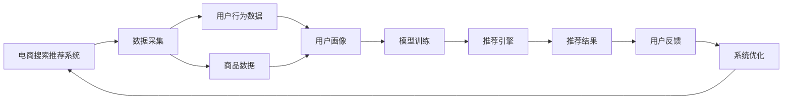

                 

# 大数据驱动的电商搜索推荐：AI 模型融合技术在电商领域的应用探索

## 1. 背景介绍

### 1.1 问题由来
在电商领域，搜索推荐系统（Recommendation System, RS）是提升用户体验和促进销售增长的核心环节。传统的搜索推荐系统依赖于手工规则和人工特征工程，随着用户需求的多样化、个性化不断增长，手工规则逐渐显得力不从心，难以跟上用户行为的快速变化。人工智能技术的发展为电商搜索推荐带来了新的突破，特别是AI模型融合技术的应用，使得搜索推荐系统能够更好地适应复杂多变的数据，提供更加个性化、精准的推荐服务。

### 1.2 问题核心关键点
本文聚焦于基于大数据驱动的电商搜索推荐，特别讨论了AI模型融合技术的应用和探索。AI模型融合技术是一种将多个模型进行集成或组合，以获得更好性能的推荐系统。典型的融合方法包括堆叠融合(Stacking)、梯度提升(Gradient Boosting)、神经网络集成(Neural Network Ensemble)等。这些方法通过结合不同模型的优势，可以有效提升模型的泛化能力和预测准确率。

## 2. 核心概念与联系

### 2.1 核心概念概述
1. **电商搜索推荐系统 (Retail E-commerce Search Recommendation System, RS)**：利用人工智能技术对用户搜索和购买行为进行建模，为用户提供个性化的商品推荐。
2. **AI模型融合 (AI Model Fusion)**：将多个AI模型进行组合，以提升推荐系统的性能。
3. **堆叠融合 (Stacking)**：将多个模型的预测结果作为新特征，输入到最终的全局模型中进行预测。
4. **梯度提升 (Gradient Boosting)**：通过迭代构建多个弱模型，每个模型修正前一个模型的预测误差，最终提升整体性能。
5. **神经网络集成 (Neural Network Ensemble)**：通过并行训练多个神经网络模型，对输出进行加权融合，实现性能提升。

这些概念之间相互联系，共同构成了电商搜索推荐系统的核心技术框架。

### 2.2 核心概念原理和架构的 Mermaid 流程图



## 3. 核心算法原理 & 具体操作步骤
### 3.1 算法原理概述

电商搜索推荐系统的核心任务是预测用户对商品的兴趣程度，从而进行推荐。其基本流程包括数据采集与处理、模型训练、推荐结果生成和系统优化。AI模型融合技术的应用主要在模型训练和推荐结果生成阶段。

#### 3.1.1 数据预处理
电商搜索推荐系统需要处理海量用户行为数据和商品信息。常用的数据预处理步骤包括数据清洗、缺失值处理、特征工程、特征归一化等。特征工程是构建推荐系统的重要环节，需要设计能够反映用户行为和商品属性的特征。

#### 3.1.2 模型训练
电商搜索推荐系统通常采用深度学习模型，如神经网络、深度线性模型、深度神经网络等。这些模型的训练通常需要大量的标注数据和计算资源，通过交叉验证和超参数调优等技术进行优化。

#### 3.1.3 推荐结果生成
推荐结果生成阶段需要对预测结果进行排序和过滤。常见的排序算法包括基于距离的排序算法（如K近邻算法）、基于评分的排序算法（如协同过滤算法）和基于矩阵分解的排序算法（如基于矩阵分解的推荐算法）。

#### 3.1.4 系统优化
系统优化阶段根据用户反馈调整模型参数，进行实时调整和迭代优化。常用的优化方法包括在线学习（Online Learning）、增量学习（Incremental Learning）和分布式学习（Distributed Learning）等。

### 3.2 算法步骤详解

#### 3.2.1 数据预处理
数据预处理是电商搜索推荐系统的基础，具体步骤如下：

1. **数据清洗**：去除缺失值、重复值、异常值等无效数据。
2. **缺失值处理**：对于缺失数据，可以采用插值法、均值替代法等进行填充。
3. **特征工程**：设计能够反映用户行为和商品属性的特征，如用户ID、商品ID、浏览时间、购买记录等。
4. **特征归一化**：对特征进行标准化或归一化，使得不同特征具有相同的量级。

#### 3.2.2 模型训练
模型训练的详细步骤包括：

1. **选择模型**：选择合适的深度学习模型，如神经网络、深度线性模型等。
2. **准备数据集**：将处理好的数据集分为训练集、验证集和测试集。
3. **模型构建**：搭建深度学习模型的架构，包括输入层、隐藏层和输出层。
4. **模型训练**：使用训练集进行模型训练，调整超参数进行模型调优。
5. **模型评估**：使用验证集对模型进行评估，选择表现最好的模型。
6. **模型测试**：使用测试集对模型进行测试，评估模型的泛化能力。

#### 3.2.3 推荐结果生成
推荐结果生成的具体步骤如下：

1. **预测**：对用户行为数据进行预测，得到用户对不同商品的评分。
2. **排序**：根据预测结果对商品进行排序，推荐评分较高的商品。
3. **过滤**：根据商品可用性和用户偏好过滤推荐结果。
4. **反馈处理**：根据用户反馈对模型进行实时优化。

#### 3.2.4 系统优化
系统优化的详细步骤包括：

1. **实时调整**：根据用户反馈和实时数据，动态调整模型参数。
2. **增量学习**：不断积累用户行为数据，进行模型更新。
3. **分布式训练**：利用多台机器进行模型并行训练，提升训练效率。

### 3.3 算法优缺点

#### 3.3.1 优点
1. **模型泛化能力强**：通过融合多个模型的优势，可以提升模型的泛化能力，更好地适应复杂多变的数据。
2. **性能提升显著**：不同模型的融合可以弥补单一模型的缺陷，提升整体性能。
3. **适应性强**：模型融合技术可以在不同的数据集和场景下进行灵活应用。

#### 3.3.2 缺点
1. **模型复杂度高**：融合模型需要训练多个模型，增加了模型复杂度。
2. **训练成本高**：需要大量的计算资源和时间进行模型训练和调优。
3. **模型可解释性差**：融合模型难以解释每个子模型的影响，不便于理解模型的决策过程。

### 3.4 算法应用领域

AI模型融合技术在电商搜索推荐系统中得到了广泛应用，主要领域包括：

1. **商品推荐**：通过分析用户行为数据，预测用户对不同商品的兴趣，推荐最符合用户需求的商品。
2. **个性化广告**：根据用户画像和行为数据，推荐个性化的广告内容。
3. **促销活动**：通过分析用户购买数据，推荐最符合用户需求和预算的促销活动。
4. **库存管理**：根据用户行为数据和库存信息，优化库存管理，提升库存利用率。

## 4. 数学模型和公式 & 详细讲解 & 举例说明

### 4.1 数学模型构建

电商搜索推荐系统通常使用深度学习模型进行训练。这里以神经网络模型为例，其基本框架为：

$$
\text{Input} \rightarrow \text{Hidden Layer} \rightarrow \text{Output}
$$

其中，输入层接收用户行为数据，隐藏层进行特征提取和计算，输出层输出推荐结果。

### 4.2 公式推导过程

以神经网络为例，其前向传播过程可以表示为：

$$
z_1 = W_1x + b_1 \\
h_1 = \sigma(z_1) \\
z_2 = W_2h_1 + b_2 \\
y = \sigma(z_2)
$$

其中，$x$ 为输入数据，$W$ 和 $b$ 分别为权重和偏置，$\sigma$ 为激活函数。

### 4.3 案例分析与讲解

以商品推荐为例，可以构建一个基于神经网络的推荐系统。首先，将用户行为数据作为输入，经过隐藏层计算得到用户对不同商品的评分。然后，根据评分对商品进行排序，输出推荐结果。具体步骤如下：

1. **数据预处理**：将用户行为数据和商品信息进行清洗和特征工程，生成输入向量 $x$。
2. **模型训练**：使用训练集 $D_{train}$ 对神经网络模型进行训练，得到权重 $W$ 和偏置 $b$。
3. **推荐结果生成**：对用户行为数据 $x$ 进行前向传播，得到预测结果 $y$，根据评分对商品进行排序。
4. **反馈处理**：根据用户反馈对模型进行实时优化。

## 5. 项目实践：代码实例和详细解释说明

### 5.1 开发环境搭建

在电商搜索推荐系统的开发过程中，需要使用大量的深度学习框架和工具。以下是使用TensorFlow和PyTorch搭建开发环境的流程：

1. **安装Python**：下载并安装Python，版本为3.7及以上。
2. **安装TensorFlow**：使用pip安装TensorFlow，版本为2.0及以上。
3. **安装PyTorch**：使用pip安装PyTorch，版本为1.0及以上。
4. **安装其他依赖库**：安装NumPy、Pandas、Scikit-learn等依赖库。

### 5.2 源代码详细实现

这里以TensorFlow为例，展示电商搜索推荐系统的代码实现：

```python
import tensorflow as tf
import numpy as np
import pandas as pd

# 数据预处理
def preprocess_data(data):
    # 数据清洗和缺失值处理
    # 特征工程
    # 特征归一化
    return processed_data

# 模型训练
class NeuralNetwork(tf.keras.Model):
    def __init__(self):
        super(NeuralNetwork, self).__init__()
        self.dense1 = tf.keras.layers.Dense(128, activation='relu')
        self.dense2 = tf.keras.layers.Dense(1)

    def call(self, inputs):
        x = self.dense1(inputs)
        x = self.dense2(x)
        return x

# 推荐结果生成
def recommend(model, user_data):
    # 数据预处理
    # 模型前向传播
    # 推荐结果排序
    return recommended_items
```

### 5.3 代码解读与分析

以上代码展示了神经网络模型的构建和推荐结果生成的流程。具体解读如下：

1. **数据预处理函数**：对输入数据进行清洗、缺失值处理、特征工程和特征归一化，生成模型所需的输入向量。
2. **神经网络模型**：定义神经网络模型架构，包括输入层、隐藏层和输出层。
3. **推荐结果生成函数**：对用户行为数据进行数据预处理，进行模型前向传播，根据预测结果生成推荐结果。

## 6. 实际应用场景

### 6.1 智能推荐系统

智能推荐系统是电商搜索推荐系统的核心应用。通过分析用户行为数据，智能推荐系统可以为用户推荐最符合其需求的商品。

具体实现步骤如下：

1. **数据采集**：采集用户行为数据，包括浏览记录、购买记录、评价信息等。
2. **数据预处理**：对采集到的数据进行清洗、特征工程和特征归一化。
3. **模型训练**：使用训练集对神经网络模型进行训练，得到权重和偏置。
4. **推荐结果生成**：对用户行为数据进行数据预处理和模型前向传播，生成推荐结果。
5. **反馈处理**：根据用户反馈对模型进行实时优化。

### 6.2 个性化广告

个性化广告是电商搜索推荐系统的另一重要应用。通过分析用户画像和行为数据，个性化广告可以为用户提供定制化的广告内容，提升广告点击率和转化率。

具体实现步骤如下：

1. **数据采集**：采集用户画像和行为数据。
2. **数据预处理**：对采集到的数据进行清洗、特征工程和特征归一化。
3. **模型训练**：使用训练集对神经网络模型进行训练，得到权重和偏置。
4. **推荐结果生成**：对用户画像和行为数据进行数据预处理和模型前向传播，生成广告内容。
5. **反馈处理**：根据广告点击率和转化率对模型进行实时优化。

### 6.3 促销活动推荐

促销活动推荐是电商搜索推荐系统的另一应用场景。通过分析用户购买数据和促销活动信息，促销活动推荐系统可以为用户推荐最符合其需求和预算的促销活动。

具体实现步骤如下：

1. **数据采集**：采集用户购买数据和促销活动信息。
2. **数据预处理**：对采集到的数据进行清洗、特征工程和特征归一化。
3. **模型训练**：使用训练集对神经网络模型进行训练，得到权重和偏置。
4. **推荐结果生成**：对用户购买数据和促销活动信息进行数据预处理和模型前向传播，生成推荐结果。
5. **反馈处理**：根据用户反馈对模型进行实时优化。

## 7. 工具和资源推荐

### 7.1 学习资源推荐

为了帮助开发者系统掌握电商搜索推荐系统的开发技术，这里推荐一些优质的学习资源：

1. **《深度学习》书籍**：这本书系统介绍了深度学习的基础知识和经典模型，是电商搜索推荐系统开发的必读之作。
2. **《TensorFlow官方文档》**：TensorFlow的官方文档，提供了详细的API说明和使用示例。
3. **《PyTorch官方文档》**：PyTorch的官方文档，提供了详细的API说明和使用示例。
4. **Kaggle竞赛**：Kaggle上的电商搜索推荐系统竞赛，提供了大量的数据集和代码示例，适合实战练习。
5. **GitHub项目**：GitHub上的电商搜索推荐系统项目，提供了大量的代码和文档，适合学习和参考。

### 7.2 开发工具推荐

以下是几款用于电商搜索推荐系统开发的常用工具：

1. **TensorFlow**：由Google开发的深度学习框架，提供了丰富的工具和模型库，适合电商搜索推荐系统的开发。
2. **PyTorch**：由Facebook开发的深度学习框架，提供了灵活的API和高效的计算图，适合电商搜索推荐系统的开发。
3. **Jupyter Notebook**：轻量级的开发工具，适合快速迭代实验和代码编写。
4. **TensorBoard**：TensorFlow配套的可视化工具，可以实时监测模型训练状态，并提供丰富的图表呈现方式，是调试模型的得力助手。
5. **Weights & Biases**：模型训练的实验跟踪工具，可以记录和可视化模型训练过程中的各项指标，方便对比和调优。

合理利用这些工具，可以显著提升电商搜索推荐系统的开发效率，加快创新迭代的步伐。

### 7.3 相关论文推荐

电商搜索推荐系统的发展得益于学界的持续研究。以下是几篇奠基性的相关论文，推荐阅读：

1. **《协同过滤推荐系统》论文**：介绍了协同过滤推荐系统的基本原理和实现方法。
2. **《基于深度学习的推荐系统》论文**：介绍了深度学习在推荐系统中的应用。
3. **《神经网络集成推荐系统》论文**：介绍了神经网络集成推荐系统的基本原理和实现方法。
4. **《基于知识图谱的推荐系统》论文**：介绍了知识图谱在推荐系统中的应用。

这些论文代表了电商搜索推荐系统的研究方向和前沿技术，通过学习这些前沿成果，可以帮助研究者把握学科前进方向，激发更多的创新灵感。

## 8. 总结：未来发展趋势与挑战

### 8.1 总结

本文对基于大数据驱动的电商搜索推荐系统进行了全面系统的介绍。首先阐述了电商搜索推荐系统的背景和核心技术，重点讨论了AI模型融合技术的应用和探索。通过本文的详细讲解，相信读者能够系统掌握电商搜索推荐系统的开发技术和实践方法。

### 8.2 未来发展趋势

展望未来，电商搜索推荐系统将呈现以下几个发展趋势：

1. **模型自动化调优**：通过自动化调优技术，优化模型超参数，提升模型性能。
2. **多模态融合**：将用户行为数据、商品信息和多媒体数据进行融合，提升推荐系统的精准度。
3. **实时推荐系统**：通过实时数据处理和优化，提升推荐系统的响应速度和用户体验。
4. **联邦学习**：通过联邦学习技术，保护用户隐私，提升推荐系统的安全性。
5. **自适应推荐系统**：通过自适应学习技术，动态调整推荐策略，提升推荐系统的个性化程度。

### 8.3 面临的挑战

尽管电商搜索推荐系统已经取得了一定的进展，但在迈向更加智能化、普适化应用的过程中，仍然面临诸多挑战：

1. **数据质量问题**：电商搜索推荐系统依赖于高质量的数据，如果数据存在噪声、缺失等问题，将影响推荐系统的性能。
2. **模型可解释性问题**：电商搜索推荐系统通常使用复杂模型，难以解释模型的决策过程，不便于理解。
3. **用户隐私问题**：电商搜索推荐系统需要收集用户行为数据，如何保护用户隐私，是一个重要的挑战。
4. **模型泛化能力问题**：电商搜索推荐系统需要在不同的场景和数据集上表现稳定，如何提升模型的泛化能力，是一个重要的问题。

### 8.4 研究展望

未来，电商搜索推荐系统需要在数据质量、模型可解释性、用户隐私保护等方面进行深入研究。同时，需要进一步探索多模态融合、实时推荐系统、联邦学习等技术，提升推荐系统的性能和用户体验。相信在学界和产业界的共同努力下，电商搜索推荐系统将迎来新的突破和应用。

## 9. 附录：常见问题与解答

**Q1：电商搜索推荐系统的核心算法是什么？**

A: 电商搜索推荐系统的核心算法包括堆叠融合(Stacking)、梯度提升(Gradient Boosting)和神经网络集成(Neural Network Ensemble)等。这些算法通过将多个模型的预测结果进行融合，提升整体性能。

**Q2：电商搜索推荐系统的数据预处理包括哪些步骤？**

A: 电商搜索推荐系统的数据预处理包括数据清洗、缺失值处理、特征工程和特征归一化等步骤。这些步骤能够保证数据的质量和一致性，为模型的训练和预测提供可靠的输入。

**Q3：电商搜索推荐系统的模型训练和推荐结果生成流程是什么？**

A: 电商搜索推荐系统的模型训练和推荐结果生成流程包括数据预处理、模型训练、推荐结果生成和反馈处理等步骤。数据预处理将原始数据转换为模型所需的输入向量，模型训练通过训练集对模型进行优化，推荐结果生成根据模型预测结果生成推荐列表，反馈处理根据用户反馈对模型进行实时优化。

**Q4：电商搜索推荐系统的未来发展趋势有哪些？**

A: 电商搜索推荐系统的未来发展趋势包括模型自动化调优、多模态融合、实时推荐系统、联邦学习和自适应推荐系统等。这些趋势将进一步提升推荐系统的性能和用户体验。

**Q5：电商搜索推荐系统在开发过程中需要注意哪些问题？**

A: 电商搜索推荐系统在开发过程中需要注意数据质量、模型可解释性、用户隐私保护和模型泛化能力等问题。这些问题直接影响到推荐系统的性能和应用效果。

通过本文的系统梳理，可以看到，电商搜索推荐系统在大数据驱动下，通过AI模型融合技术的应用，已经实现了显著的性能提升。未来，随着技术的不断演进和应用场景的拓展，电商搜索推荐系统必将在智能推荐、个性化广告和促销活动推荐等方面发挥更大的作用，推动电商领域的数字化转型升级。相信在各方的共同努力下，电商搜索推荐系统将迎来更多的创新和发展。

---

作者：禅与计算机程序设计艺术 / Zen and the Art of Computer Programming

