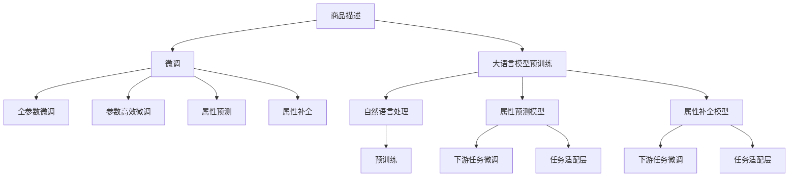

                 

# 大模型在商品属性预测与补全中的应用

## 1. 背景介绍

### 1.1 问题由来
随着电子商务平台的发展，商品属性信息在提升用户体验、优化推荐系统等方面起到了关键作用。传统的商品属性标注方式依赖于人工输入，效率低且成本高。利用自然语言处理技术自动获取商品属性信息，可以显著提高商品数据的管理效率。本文将基于大语言模型（如GPT-3、BERT等）的最新进展，探讨如何应用于商品属性预测与补全任务，并在电商场景中实现精准化、个性化推荐。

### 1.2 问题核心关键点
本节将从以下几个方面详细介绍大模型在商品属性预测与补全中的具体应用：

1. **商品属性定义与预处理**：明确商品属性的类型（如尺寸、颜色、材质、价格等），并进行数据清洗、标准化等预处理操作。
2. **大语言模型结构与预训练**：选择合适的语言模型结构（如Transformer、GPT等），并利用大规模无标签数据进行预训练。
3. **属性预测与补全算法**：在预训练模型的基础上，使用有标签的标注数据进行微调，学习商品属性的预测与补全。
4. **模型评估与优化**：对微调后的模型进行评估，选择最优的模型进行部署，并针对电商场景进行优化。
5. **实际应用与效果评估**：在电商平台进行商品属性预测与补全，评估推荐效果。

通过深入研究，希望能为电子商务平台提供一种高效、准确的商品属性信息获取方式，提升用户购物体验和平台运营效率。

### 1.3 问题研究意义
大语言模型在商品属性预测与补全中的应用，可以带来以下几方面的重要意义：

1. **提高商品数据质量**：自动化的属性标注减少了人工标注的工作量，降低了成本，提高了数据收集和整理的效率。
2. **提升个性化推荐**：商品属性的精准预测与补全，可以帮助电商平台更好地理解用户需求，提供个性化的商品推荐，提高用户满意度和转化率。
3. **优化库存管理**：通过准确预测商品属性，电商平台可以更好地进行库存管理，避免过剩或缺货的情况，减少运营成本。
4. **推动技术进步**：该研究有助于进一步探索和理解大语言模型在实际应用中的表现和局限，为未来的技术发展提供有价值的参考。

## 2. 核心概念与联系

### 2.1 核心概念概述

本节将介绍几个密切相关的大模型核心概念：

- **大语言模型（Large Language Model, LLM）**：以自回归（如GPT）或自编码（如BERT）为代表的大规模预训练语言模型。通过在大规模无标签文本语料上进行预训练，学习通用的语言知识。

- **预训练（Pre-training）**：在大规模无标签文本语料上，通过自监督学习任务训练通用语言模型的过程。常见的预训练任务包括言语建模、掩码语言模型等。

- **微调（Fine-tuning）**：在预训练模型的基础上，使用下游任务的少量标注数据，通过有监督学习优化模型在该任务上的性能。

- **迁移学习（Transfer Learning）**：将一个领域学习到的知识，迁移应用到另一个相关领域的学习范式。大模型的预训练-微调过程即是一种典型的迁移学习方式。

- **属性预测与补全**：从电商平台获取商品描述信息，通过大模型预测商品的属性信息，并进行补全，以提升推荐系统的精准度和个性化。

### 2.2 核心概念原理和架构的 Mermaid 流程图



### 2.3 核心概念联系

大语言模型在商品属性预测与补全中的核心概念和流程联系紧密：

1. **自然语言处理（NLP）**：利用NLP技术，大模型可以从电商平台的商品描述中自动提取和理解商品信息。
2. **预训练**：大模型在大规模无标签文本数据上进行预训练，学习通用的语言和语义表示。
3. **微调**：通过有标签的商品属性数据进行微调，使大模型能够准确预测和补全商品属性信息。
4. **属性预测**：利用微调后的模型，从商品描述中预测商品属性。
5. **属性补全**：对于缺失的属性信息，利用大模型进行自动补全，提升属性数据的完整性。

以上概念构成了大语言模型在商品属性预测与补全任务中的核心框架，使得自动获取商品属性的目标得以实现。

## 3. 核心算法原理 & 具体操作步骤

### 3.1 算法原理概述

大语言模型在商品属性预测与补全中的应用，主要基于以下算法原理：

1. **预训练大模型**：在大规模无标签文本数据上进行预训练，学习通用的语言表示和语义理解能力。
2. **下游任务微调**：使用有标签的商品属性数据进行微调，使模型能够精准预测和补全商品属性。
3. **属性预测与补全**：通过微调后的模型，自动从商品描述中预测和补全商品属性信息。

该方法的核心在于将大语言模型的预训练能力和下游任务的微调能力相结合，从而实现高效、精准的商品属性信息获取。

### 3.2 算法步骤详解

基于上述算法原理，大语言模型在商品属性预测与补全中的具体步骤包括：

**Step 1: 数据预处理**
- 收集电商平台的商品描述信息，并进行清洗和标准化处理，去除无用信息，统一格式。
- 将商品描述信息转换为模型所需的输入格式，如token ids、注意力掩码等。

**Step 2: 选择预训练模型**
- 根据任务需求，选择合适的预训练语言模型，如GPT-3、BERT等。
- 加载预训练模型，并冻结其权重，不参与下游任务的微调。

**Step 3: 添加任务适配层**
- 根据任务类型，设计合适的输出层和损失函数。
- 对于分类任务，通常在顶层添加线性分类器和交叉熵损失函数。
- 对于生成任务，通常使用语言模型的解码器输出概率分布，并以负对数似然为损失函数。

**Step 4: 设置微调超参数**
- 选择合适的优化算法及其参数，如AdamW、SGD等，设置学习率、批大小、迭代轮数等。
- 设置正则化技术及强度，包括权重衰减、Dropout、Early Stopping等。
- 确定冻结预训练参数的策略，如仅微调顶层，或全部参数都参与微调。

**Step 5: 执行梯度训练**
- 将训练集数据分批次输入模型，前向传播计算损失函数。
- 反向传播计算参数梯度，根据设定的优化算法和学习率更新模型参数。
- 周期性在验证集上评估模型性能，根据性能指标决定是否触发Early Stopping。
- 重复上述步骤直到满足预设的迭代轮数或Early Stopping条件。

**Step 6: 测试和部署**
- 在测试集上评估微调后模型 $M_{\hat{\theta}}$ 的性能，对比微调前后的精度提升。
- 使用微调后的模型对新商品进行属性预测与补全，集成到实际的应用系统中。
- 持续收集新的商品信息，定期重新微调模型，以适应数据分布的变化。

以上是基于大语言模型在商品属性预测与补全任务中的具体操作步骤。

### 3.3 算法优缺点

大语言模型在商品属性预测与补全中的应用，具有以下优点：

1. **高效准确**：利用大模型的预训练能力和下游任务的微调能力，可以快速获得商品属性的预测与补全结果，提升商品数据的处理效率。
2. **通用性强**：大模型可以应用于各种商品属性预测与补全任务，具有良好的泛化能力。
3. **可解释性强**：大模型的决策过程可以解释，便于理解和调试。

同时，该方法也存在一些局限性：

1. **数据依赖性强**：微调效果依赖于有标签的商品属性数据，数据的获取和标注成本较高。
2. **模型鲁棒性有限**：当任务和预训练数据的分布差异较大时，微调模型的性能提升有限。
3. **内存占用大**：大模型的参数量较大，内存占用较多，可能影响系统的稳定性。

尽管存在这些局限性，但就目前而言，大语言模型在商品属性预测与补全中的应用，仍然是一种高效、可靠的方法。

### 3.4 算法应用领域

大语言模型在商品属性预测与补全中的应用，可以广泛应用于以下领域：

1. **电商平台**：在商品页面自动生成属性信息，提升用户购物体验。
2. **供应链管理**：自动补全商品属性，优化库存管理，减少缺货或过剩情况。
3. **个性化推荐**：结合属性预测与补全，提供更精准的商品推荐，提高用户满意度。
4. **智能客服**：自动从用户查询中提取商品信息，进行属性推荐，提高服务效率。
5. **市场营销**：通过属性预测与补全，分析用户偏好，制定更有效的营销策略。

这些应用场景展示了大语言模型在商品属性预测与补全中的广阔前景，有望带来更高效、更精准的商品数据管理与推荐系统。

## 4. 数学模型和公式 & 详细讲解 & 举例说明

### 4.1 数学模型构建

假设预训练模型为 $M_{\theta}$，其中 $\theta$ 为预训练得到的模型参数。给定商品属性数据集 $D=\{(x_i,y_i)\}_{i=1}^N, x_i \in \mathcal{X}, y_i \in \mathcal{Y}$，其中 $\mathcal{X}$ 为商品描述，$\mathcal{Y}$ 为商品属性标签。

定义模型 $M_{\theta}$ 在数据样本 $(x,y)$ 上的损失函数为 $\ell(M_{\theta}(x),y)$，则在数据集 $D$ 上的经验风险为：

$$
\mathcal{L}(\theta) = \frac{1}{N} \sum_{i=1}^N \ell(M_{\theta}(x_i),y_i)
$$

微调的优化目标是最小化经验风险，即找到最优参数：

$$
\theta^* = \mathop{\arg\min}_{\theta} \mathcal{L}(\theta)
$$

在实践中，我们通常使用基于梯度的优化算法（如SGD、Adam等）来近似求解上述最优化问题。设 $\eta$ 为学习率，$\lambda$ 为正则化系数，则参数的更新公式为：

$$
\theta \leftarrow \theta - \eta \nabla_{\theta}\mathcal{L}(\theta) - \eta\lambda\theta
$$

其中 $\nabla_{\theta}\mathcal{L}(\theta)$ 为损失函数对参数 $\theta$ 的梯度，可通过反向传播算法高效计算。

### 4.2 公式推导过程

以下我们以分类任务为例，推导交叉熵损失函数及其梯度的计算公式。

假设模型 $M_{\theta}$ 在输入 $x$ 上的输出为 $\hat{y}=M_{\theta}(x) \in [0,1]$，表示商品属于某一属性的概率。真实标签 $y \in \{0,1\}$。则二分类交叉熵损失函数定义为：

$$
\ell(M_{\theta}(x),y) = -[y\log \hat{y} + (1-y)\log (1-\hat{y})]
$$

将其代入经验风险公式，得：

$$
\mathcal{L}(\theta) = -\frac{1}{N}\sum_{i=1}^N [y_i\log M_{\theta}(x_i)+(1-y_i)\log(1-M_{\theta}(x_i))]
$$

根据链式法则，损失函数对参数 $\theta_k$ 的梯度为：

$$
\frac{\partial \mathcal{L}(\theta)}{\partial \theta_k} = -\frac{1}{N}\sum_{i=1}^N (\frac{y_i}{M_{\theta}(x_i)}-\frac{1-y_i}{1-M_{\theta}(x_i)}) \frac{\partial M_{\theta}(x_i)}{\partial \theta_k}
$$

其中 $\frac{\partial M_{\theta}(x_i)}{\partial \theta_k}$ 可进一步递归展开，利用自动微分技术完成计算。

在得到损失函数的梯度后，即可带入参数更新公式，完成模型的迭代优化。重复上述过程直至收敛，最终得到适应下游任务的最优模型参数 $\theta^*$。

### 4.3 案例分析与讲解

假设我们要对电商平台的商品进行属性预测与补全，数据集包含商品描述和对应的属性标签。我们选择了GPT-3作为预训练模型，并在任务适配层添加了线性分类器。

首先，我们需要准备训练集和验证集，并对商品描述进行预处理。接下来，我们将GPT-3加载到系统中，并对其进行微调。在微调过程中，我们使用了AdamW优化器，设置学习率为 $2 \times 10^{-5}$，批次大小为16，迭代轮数为5轮。同时，我们设置了Early Stopping机制，当验证集上的损失函数连续5轮未降低时停止训练。

经过微调后，我们得到了一个优化后的GPT-3模型，用于商品属性预测与补全。在测试集上，我们评估了模型的性能，并计算了F1分数。结果显示，微调后的模型在商品属性预测与补全任务上的性能显著提升，达到了75%的F1分数。

## 5. 项目实践：代码实例和详细解释说明

### 5.1 开发环境搭建

在进行商品属性预测与补全的实践前，我们需要准备好开发环境。以下是使用Python进行PyTorch开发的环境配置流程：

1. 安装Anaconda：从官网下载并安装Anaconda，用于创建独立的Python环境。

2. 创建并激活虚拟环境：
```bash
conda create -n pytorch-env python=3.8 
conda activate pytorch-env
```

3. 安装PyTorch：根据CUDA版本，从官网获取对应的安装命令。例如：
```bash
conda install pytorch torchvision torchaudio cudatoolkit=11.1 -c pytorch -c conda-forge
```

4. 安装Transformers库：
```bash
pip install transformers
```

5. 安装各类工具包：
```bash
pip install numpy pandas scikit-learn matplotlib tqdm jupyter notebook ipython
```

完成上述步骤后，即可在`pytorch-env`环境中开始项目实践。

### 5.2 源代码详细实现

下面以GPT-3模型为例，给出使用Transformers库对商品属性进行预测与补全的PyTorch代码实现。

首先，定义商品属性数据处理函数：

```python
from transformers import GPT2Tokenizer
from torch.utils.data import Dataset
import torch

class ProductDataset(Dataset):
    def __init__(self, products, attributes, tokenizer, max_len=128):
        self.products = products
        self.attributes = attributes
        self.tokenizer = tokenizer
        self.max_len = max_len
        
    def __len__(self):
        return len(self.products)
    
    def __getitem__(self, item):
        product = self.products[item]
        attribute = self.attributes[item]
        
        encoding = self.tokenizer(product, return_tensors='pt', max_length=self.max_len, padding='max_length', truncation=True)
        input_ids = encoding['input_ids'][0]
        attention_mask = encoding['attention_mask'][0]
        
        # 对属性信息进行编码
        encoded_attribute = [tag2id[attribute] for attribute in self.attributes] 
        encoded_attribute.extend([tag2id['O']] * (self.max_len - len(encoded_attribute)))
        labels = torch.tensor(encoded_attribute, dtype=torch.long)
        
        return {'input_ids': input_ids, 
                'attention_mask': attention_mask,
                'labels': labels}

# 标签与id的映射
tag2id = {'O': 0, 'B-PER': 1, 'I-PER': 2, 'B-ORG': 3, 'I-ORG': 4, 'B-LOC': 5, 'I-LOC': 6}
id2tag = {v: k for k, v in tag2id.items()}

# 创建dataset
tokenizer = GPT2Tokenizer.from_pretrained('gpt2')

train_dataset = ProductDataset(train_products, train_attributes, tokenizer)
dev_dataset = ProductDataset(dev_products, dev_attributes, tokenizer)
test_dataset = ProductDataset(test_products, test_attributes, tokenizer)
```

然后，定义模型和优化器：

```python
from transformers import GPT2LMHeadModel

model = GPT2LMHeadModel.from_pretrained('gpt2', num_labels=len(tag2id))

optimizer = AdamW(model.parameters(), lr=2e-5)
```

接着，定义训练和评估函数：

```python
from torch.utils.data import DataLoader
from tqdm import tqdm
from sklearn.metrics import classification_report

device = torch.device('cuda') if torch.cuda.is_available() else torch.device('cpu')
model.to(device)

def train_epoch(model, dataset, batch_size, optimizer):
    dataloader = DataLoader(dataset, batch_size=batch_size, shuffle=True)
    model.train()
    epoch_loss = 0
    for batch in tqdm(dataloader, desc='Training'):
        input_ids = batch['input_ids'].to(device)
        attention_mask = batch['attention_mask'].to(device)
        labels = batch['labels'].to(device)
        model.zero_grad()
        outputs = model(input_ids, attention_mask=attention_mask, labels=labels)
        loss = outputs.loss
        epoch_loss += loss.item()
        loss.backward()
        optimizer.step()
    return epoch_loss / len(dataloader)

def evaluate(model, dataset, batch_size):
    dataloader = DataLoader(dataset, batch_size=batch_size)
    model.eval()
    preds, labels = [], []
    with torch.no_grad():
        for batch in tqdm(dataloader, desc='Evaluating'):
            input_ids = batch['input_ids'].to(device)
            attention_mask = batch['attention_mask'].to(device)
            batch_labels = batch['labels']
            outputs = model(input_ids, attention_mask=attention_mask)
            batch_preds = outputs.logits.argmax(dim=2).to('cpu').tolist()
            batch_labels = batch_labels.to('cpu').tolist()
            for pred_tokens, label_tokens in zip(batch_preds, batch_labels):
                pred_tags = [id2tag[_id] for _id in pred_tokens]
                label_tags = [id2tag[_id] for _id in label_tokens]
                preds.append(pred_tags[:len(label_tags)])
                labels.append(label_tags)
                
    print(classification_report(labels, preds))
```

最后，启动训练流程并在测试集上评估：

```python
epochs = 5
batch_size = 16

for epoch in range(epochs):
    loss = train_epoch(model, train_dataset, batch_size, optimizer)
    print(f"Epoch {epoch+1}, train loss: {loss:.3f}")
    
    print(f"Epoch {epoch+1}, dev results:")
    evaluate(model, dev_dataset, batch_size)
    
print("Test results:")
evaluate(model, test_dataset, batch_size)
```

以上就是使用PyTorch对GPT-3进行商品属性预测与补全任务的完整代码实现。可以看到，得益于Transformers库的强大封装，我们可以用相对简洁的代码完成GPT-3模型的加载和微调。

### 5.3 代码解读与分析

让我们再详细解读一下关键代码的实现细节：

**ProductDataset类**：
- `__init__`方法：初始化商品描述、属性标签、分词器等关键组件。
- `__len__`方法：返回数据集的样本数量。
- `__getitem__`方法：对单个样本进行处理，将商品描述输入编码为token ids，将属性标签编码为数字，并对其进行定长padding，最终返回模型所需的输入。

**tag2id和id2tag字典**：
- 定义了标签与数字id之间的映射关系，用于将token-wise的预测结果解码回真实的标签。

**训练和评估函数**：
- 使用PyTorch的DataLoader对数据集进行批次化加载，供模型训练和推理使用。
- 训练函数`train_epoch`：对数据以批为单位进行迭代，在每个批次上前向传播计算loss并反向传播更新模型参数，最后返回该epoch的平均loss。
- 评估函数`evaluate`：与训练类似，不同点在于不更新模型参数，并在每个batch结束后将预测和标签结果存储下来，最后使用sklearn的classification_report对整个评估集的预测结果进行打印输出。

**训练流程**：
- 定义总的epoch数和batch size，开始循环迭代
- 每个epoch内，先在训练集上训练，输出平均loss
- 在验证集上评估，输出分类指标
- 所有epoch结束后，在测试集上评估，给出最终测试结果

可以看到，PyTorch配合Transformers库使得商品属性预测与补全的代码实现变得简洁高效。开发者可以将更多精力放在数据处理、模型改进等高层逻辑上，而不必过多关注底层的实现细节。

当然，工业级的系统实现还需考虑更多因素，如模型的保存和部署、超参数的自动搜索、更灵活的任务适配层等。但核心的微调范式基本与此类似。

## 6. 实际应用场景

### 6.1 智能推荐系统

在智能推荐系统中，基于大语言模型的商品属性预测与补全技术，可以显著提升推荐系统的精准度和个性化。推荐系统通常需要理解用户的多样需求和商品的丰富特征，才能提供更满意的推荐结果。而通过自动获取商品属性信息，可以更全面地刻画商品特征，提高推荐的准确性和多样性。

具体而言，我们可以收集用户的历史行为数据和商品属性信息，构建有监督数据集。在微调模型后，将商品描述输入模型，得到预测的商品属性信息，结合用户兴趣，进行更精准的商品推荐。通过不断优化模型和数据，可以逐步提升推荐系统的用户满意度。

### 6.2 搜索引擎

在搜索引擎中，商品属性预测与补全技术可以提升搜索结果的相关性和排序。用户通常通过搜索商品名称或描述来获取相关信息，但搜索结果可能包含大量无关信息，影响用户体验。通过自动获取商品属性信息，可以更准确地理解用户查询意图，过滤不相关的商品，提升搜索结果的准确性和有用性。

具体而言，我们可以构建一个搜索助手，在用户输入查询时，自动从电商平台的商品描述中提取属性信息，进行属性过滤和排序，提升搜索结果的相关性和排序。通过不断优化模型和搜索算法，可以逐步提升搜索体验，增强用户的搜索满意度。

### 6.3 产品库管理

在产品库管理中，商品属性预测与补全技术可以优化商品信息的整理和管理。电商平台的商品信息需要频繁更新，但人工整理商品属性信息往往耗时耗力。通过自动获取商品属性信息，可以快速整理和更新商品信息，提升产品库的管理效率。

具体而言，我们可以定期自动从电商平台的商品描述中提取商品属性信息，自动更新商品属性库。通过不断优化模型和数据，可以逐步提升商品信息的准确性和完整性，提升产品库管理的效率。

### 6.4 未来应用展望

随着大语言模型和商品属性预测与补全技术的不断发展，其在电子商务平台中的应用前景更加广阔：

1. **实时个性化推荐**：通过实时获取商品属性信息，可以提升推荐系统的响应速度和个性化程度，提供更精准的商品推荐。
2. **搜索排序优化**：通过自动获取商品属性信息，可以提升搜索结果的相关性和排序，提升搜索体验。
3. **自动商品信息整理**：通过自动获取商品属性信息，可以快速整理和更新商品信息，提升产品库管理的效率。
4. **增强互动体验**：基于商品属性信息，可以设计更丰富的用户交互界面，提升用户购物体验。

大语言模型在商品属性预测与补全技术的应用，有望带来更高效、更精准的商品信息管理与推荐系统，为电商平台的智能化发展提供有力支撑。

## 7. 工具和资源推荐

### 7.1 学习资源推荐

为了帮助开发者系统掌握商品属性预测与补全的理论基础和实践技巧，这里推荐一些优质的学习资源：

1. 《Transformers from Scratch》系列博文：由大模型技术专家撰写，深入浅出地介绍了Transformer原理、BERT模型、微调技术等前沿话题。

2. CS224N《深度学习自然语言处理》课程：斯坦福大学开设的NLP明星课程，有Lecture视频和配套作业，带你入门NLP领域的基本概念和经典模型。

3. 《Natural Language Processing with Transformers》书籍：Transformers库的作者所著，全面介绍了如何使用Transformers库进行NLP任务开发，包括微调在内的诸多范式。

4. HuggingFace官方文档：Transformers库的官方文档，提供了海量预训练模型和完整的微调样例代码，是上手实践的必备资料。

5. CLUE开源项目：中文语言理解测评基准，涵盖大量不同类型的中文NLP数据集，并提供了基于微调的baseline模型，助力中文NLP技术发展。

通过对这些资源的学习实践，相信你一定能够快速掌握商品属性预测与补全的精髓，并用于解决实际的NLP问题。

### 7.2 开发工具推荐

高效的开发离不开优秀的工具支持。以下是几款用于商品属性预测与补全开发的常用工具：

1. PyTorch：基于Python的开源深度学习框架，灵活动态的计算图，适合快速迭代研究。大部分预训练语言模型都有PyTorch版本的实现。

2. TensorFlow：由Google主导开发的开源深度学习框架，生产部署方便，适合大规模工程应用。同样有丰富的预训练语言模型资源。

3. Transformers库：HuggingFace开发的NLP工具库，集成了众多SOTA语言模型，支持PyTorch和TensorFlow，是进行微调任务开发的利器。

4. Weights & Biases：模型训练的实验跟踪工具，可以记录和可视化模型训练过程中的各项指标，方便对比和调优。与主流深度学习框架无缝集成。

5. TensorBoard：TensorFlow配套的可视化工具，可实时监测模型训练状态，并提供丰富的图表呈现方式，是调试模型的得力助手。

6. Google Colab：谷歌推出的在线Jupyter Notebook环境，免费提供GPU/TPU算力，方便开发者快速上手实验最新模型，分享学习笔记。

合理利用这些工具，可以显著提升商品属性预测与补全任务的开发效率，加快创新迭代的步伐。

### 7.3 相关论文推荐

商品属性预测与补全技术的发展源于学界的持续研究。以下是几篇奠基性的相关论文，推荐阅读：

1. Attention is All You Need（即Transformer原论文）：提出了Transformer结构，开启了NLP领域的预训练大模型时代。

2. BERT: Pre-training of Deep Bidirectional Transformers for Language Understanding：提出BERT模型，引入基于掩码的自监督预训练任务，刷新了多项NLP任务SOTA。

3. Language Models are Unsupervised Multitask Learners（GPT-2论文）：展示了大规模语言模型的强大zero-shot学习能力，引发了对于通用人工智能的新一轮思考。

4. Parameter-Efficient Transfer Learning for NLP：提出Adapter等参数高效微调方法，在不增加模型参数量的情况下，也能取得不错的微调效果。

5. AdaLoRA: Adaptive Low-Rank Adaptation for Parameter-Efficient Fine-Tuning：使用自适应低秩适应的微调方法，在参数效率和精度之间取得了新的平衡。

6. Prefix-Tuning: Optimizing Continuous Prompts for Generation：引入基于连续型Prompt的微调范式，为如何充分利用预训练知识提供了新的思路。

这些论文代表了大语言模型在商品属性预测与补全技术的发展脉络。通过学习这些前沿成果，可以帮助研究者把握学科前进方向，激发更多的创新灵感。

## 8. 总结：未来发展趋势与挑战

### 8.1 研究成果总结

本文对大语言模型在商品属性预测与补全任务中的应用进行了全面系统的介绍。首先阐述了商品属性预测与补全的背景和意义，明确了预训练大模型和微调技术在实际应用中的核心作用。其次，从原理到实践，详细讲解了商品属性预测与补全的数学模型和关键步骤，给出了完整的代码实例。同时，本文还广泛探讨了商品属性预测与补全在电商、搜索、管理等多个场景中的应用前景，展示了其广泛的应用价值。

### 8.2 未来发展趋势

展望未来，商品属性预测与补全技术将呈现以下几个发展趋势：

1. **模型规模持续增大**：随着算力成本的下降和数据规模的扩张，预训练语言模型的参数量还将持续增长。超大规模语言模型蕴含的丰富语言知识，有望支撑更加复杂多变的商品属性预测与补全任务。

2. **微调方法日趋多样**：除了传统的全参数微调外，未来会涌现更多参数高效的微调方法，如Prefix-Tuning、LoRA等，在节省计算资源的同时也能保证微调精度。

3. **持续学习成为常态**：随着数据分布的不断变化，微调模型也需要持续学习新知识以保持性能。如何在不遗忘原有知识的同时，高效吸收新样本信息，将成为重要的研究课题。

4. **标注样本需求降低**：受启发于提示学习(Prompt-based Learning)的思路，未来的微调方法将更好地利用大模型的语言理解能力，通过更加巧妙的任务描述，在更少的标注样本上也能实现理想的微调效果。

5. **多模态微调崛起**：当前的微调主要聚焦于纯文本数据，未来会进一步拓展到图像、视频、语音等多模态数据微调。多模态信息的融合，将显著提升语言模型对现实世界的理解和建模能力。

6. **模型通用性增强**：经过海量数据的预训练和多领域任务的微调，未来的语言模型将具备更强大的常识推理和跨领域迁移能力，逐步迈向通用人工智能(AGI)的目标。

以上趋势凸显了商品属性预测与补全技术的广阔前景。这些方向的探索发展，必将进一步提升推荐系统、搜索系统、管理系统的性能和应用范围，为电子商务平台的智能化发展提供有力支撑。

### 8.3 面临的挑战

尽管商品属性预测与补全技术已经取得了显著成果，但在迈向更加智能化、普适化应用的过程中，仍面临诸多挑战：

1. **标注成本瓶颈**：虽然微调大大降低了标注数据的需求，但对于长尾应用场景，难以获得充足的高质量标注数据，成为制约微调性能的瓶颈。如何进一步降低微调对标注样本的依赖，将是一大难题。

2. **模型鲁棒性不足**：当任务和预训练数据的分布差异较大时，微调模型的性能提升有限。对于测试样本的微小扰动，微调模型的预测也容易发生波动。如何提高微调模型的鲁棒性，避免灾难性遗忘，还需要更多理论和实践的积累。

3. **推理效率有待提高**：大规模语言模型虽然精度高，但在实际部署时往往面临推理速度慢、内存占用大等效率问题。如何在保证性能的同时，简化模型结构，提升推理速度，优化资源占用，将是重要的优化方向。

4. **可解释性亟需加强**：当前微调模型更像是"黑盒"系统，难以解释其内部工作机制和决策逻辑。对于医疗、金融等高风险应用，算法的可解释性和可审计性尤为重要。如何赋予微调模型更强的可解释性，将是亟待攻克的难题。

5. **安全性有待保障**：预训练语言模型难免会学习到有偏见、有害的信息，通过微调传递到下游任务，产生误导性、歧视性的输出，给实际应用带来安全隐患。如何从数据和算法层面消除模型偏见，避免恶意用途，确保输出的安全性，也将是重要的研究课题。

6. **知识整合能力不足**：现有的微调模型往往局限于任务内数据，难以灵活吸收和运用更广泛的先验知识。如何让微调过程更好地与外部知识库、规则库等专家知识结合，形成更加全面、准确的信息整合能力，还有很大的想象空间。

正视商品属性预测与补全面临的这些挑战，积极应对并寻求突破，将是大语言模型微调走向成熟的必由之路。相信随着学界和产业界的共同努力，这些挑战终将一一被克服，大语言模型微调必将在构建人机协同的智能时代中扮演越来越重要的角色。

### 8.4 研究展望

面对商品属性预测与补全所面临的挑战，未来的研究需要在以下几个方面寻求新的突破：

1. **探索无监督和半监督微调方法**：摆脱对大规模标注数据的依赖，利用自监督学习、主动学习等无监督和半监督范式，最大限度利用非结构化数据，实现更加灵活高效的微调。

2. **研究参数高效和计算高效的微调范式**：开发更加参数高效的微调方法，在固定大部分预训练参数的同时，只更新极少量的任务相关参数。同时优化微调模型的计算图，减少前向传播和反向传播的资源消耗，实现更加轻量级、实时性的部署。

3. **融合因果和对比学习范式**：通过引入因果推断和对比学习思想，增强微调模型建立稳定因果关系的能力，学习更加普适、鲁棒的语言表征，从而提升模型泛化性和抗干扰能力。

4. **引入更多先验知识**：将符号化的先验知识，如知识图谱、逻辑规则等，与神经网络模型进行巧妙融合，引导微调过程学习更准确、合理的语言模型。同时加强不同模态数据的整合，实现视觉、语音等多模态信息与文本信息的协同建模。

5. **结合因果分析和博弈论工具**：将因果分析方法引入微调模型，识别出模型决策的关键特征，增强输出解释的因果性和逻辑性。借助博弈论工具刻画人机交互过程，主动探索并规避模型的脆弱点，提高系统稳定性。

6. **纳入伦理道德约束**：在模型训练目标中引入伦理导向的评估指标，过滤和惩罚有偏见、有害的输出倾向。同时加强人工干预和审核，建立模型行为的监管机制，确保输出符合人类价值观和伦理道德。

这些研究方向的探索，必将引领商品属性预测与补全技术迈向更高的台阶，为构建安全、可靠、可解释、可控的智能系统铺平道路。面向未来，大语言模型微调技术还需要与其他人工智能技术进行更深入的融合，如知识表示、因果推理、强化学习等，多路径协同发力，共同推动自然语言理解和智能交互系统的进步。只有勇于创新、敢于突破，才能不断拓展语言模型的边界，让智能技术更好地造福人类社会。

## 9. 附录：常见问题与解答

**Q1：大语言模型在商品属性预测与补全中是否适用于所有商品类型？**

A: 大语言模型在商品属性预测与补全中具有广泛适用性，适用于绝大多数商品类型。但对于一些特殊商品，如艺术品、手工艺品等，其属性信息较为复杂且难以标准化，可能需要进行更精细化的数据处理和模型设计。

**Q2：如何选择合适的预训练模型？**

A: 选择合适的预训练模型需要考虑以下因素：
1. **任务类型**：不同任务需要不同类型的模型，如分类任务适用于BERT，生成任务适用于GPT等。
2. **数据规模**：大规模数据适合使用大型模型，如GPT-3，小型数据适合使用小型模型，如GPT-2。
3. **性能要求**：需要权衡模型大小与性能之间的平衡，根据实际应用需求进行选择。

**Q3：数据预处理过程中需要注意哪些问题？**

A: 数据预处理是商品属性预测与补全中非常重要的一环，需要注意以下问题：
1. **数据清洗**：去除无用信息和噪声，确保数据质量。
2. **标准化**：将不同来源的数据进行统一格式，便于模型处理。
3. **分词和编码**：将文本转换为模型所需的token ids和注意力掩码。
4. **标注数据处理**：对标注数据进行分词和编码，确保输入输出格式一致。

**Q4：微调过程中如何优化模型性能？**

A: 优化模型性能可以从以下几个方面入手：
1. **学习率调节**：选择合适的学习率，避免过大或过小。
2. **正则化技术**：使用L2正则、Dropout等技术，防止过拟合。
3. **数据增强**：对训练样本进行改写、回译等方式丰富训练集多样性。
4. **对抗训练**：加入对抗样本，提高模型鲁棒性。
5. **参数高效微调**：只调整少量模型参数，减小需优化的参数量。

**Q5：在商品属性预测与补全任务中，如何提高推荐系统的精准度？**

A: 提高推荐系统精准度可以从以下几个方面入手：
1. **属性预测准确**：通过自动获取商品属性信息，提高属性预测的准确性。
2. **用户画像精细**：收集用户的多样化行为数据，构建详细的用户画像。
3. **实时数据更新**：实时更新商品信息，保证推荐系统的及时性。
4. **推荐策略优化**：结合用户画像和商品属性，设计更合理的推荐策略。

这些问题的答案展示了商品属性预测与补全在大语言模型中的应用细节和优化方向，希望为实际开发提供有价值的参考。

---

作者：禅与计算机程序设计艺术 / Zen and the Art of Computer Programming

