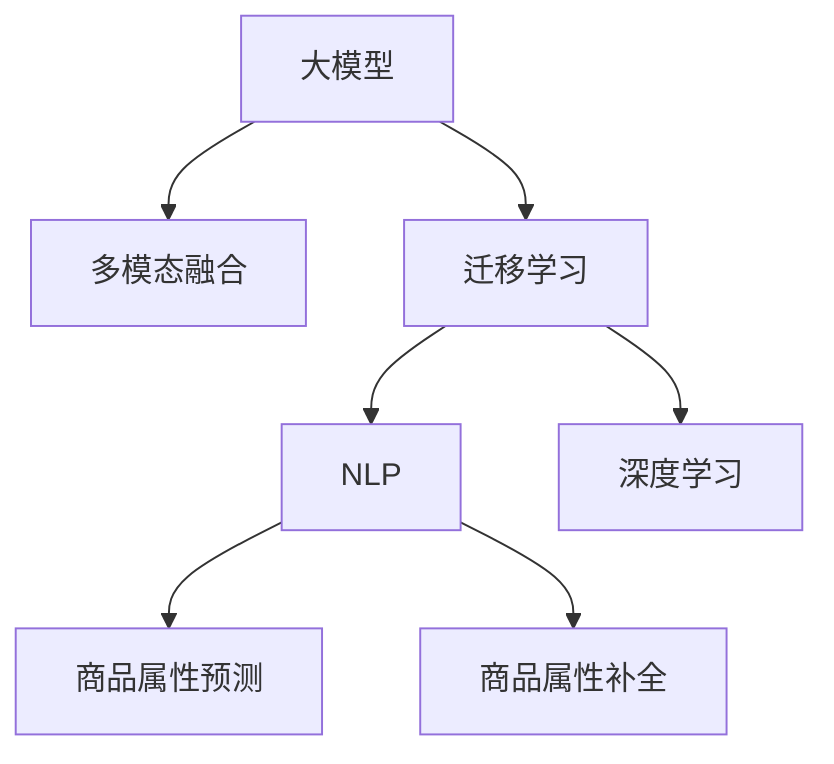

                 

# 大模型在商品属性预测与补全精确化中的应用

> 关键词：大模型，商品属性预测，补全精确化，自然语言处理，深度学习，多模态融合，迁移学习

## 1. 背景介绍

### 1.1 问题由来

电子商务平台如淘宝、京东等，拥有海量商品信息，然而这些信息往往缺少详细的商品属性标签。例如，一款手机可能在不同的商家上架时，其属性描述可能存在差异，如存储容量、电池容量、屏幕大小等。这给消费者查找商品带来很大不便，也影响了电商平台的搜索推荐系统的效果。因此，对商品属性的预测与补全，成为了电商领域的一个重要研究课题。

### 1.2 问题核心关键点

商品属性预测与补全的核心在于从自然语言描述中挖掘出具体的属性信息，并将其与相应的数值或类别标签对应起来。这需要模型具备强大的语言理解能力，以及跨模态数据融合的能力。大模型在这一领域具有天然优势，能够通过学习海量文本数据和图像数据，提取语言和视觉特征，并进行多模态融合，输出精准的商品属性标签。

## 2. 核心概念与联系

### 2.1 核心概念概述

为更好地理解大模型在商品属性预测与补全中的应用，本节将介绍几个密切相关的核心概念：

- 大模型(Large Model)：以自回归(如GPT)或自编码(如BERT)模型为代表的大规模预训练语言模型。通过在大规模无标签文本语料上进行预训练，学习通用的语言表示。
- 多模态融合(Multimodal Fusion)：将文本、图像、音频等多类型数据进行融合，提取不同模态的特征，形成联合表示。
- 迁移学习(Transfer Learning)：将一个领域学习到的知识，迁移应用到另一个不同但相关的领域的学习范式。大模型的预训练-微调过程即一种典型的迁移学习方式。
- 自然语言处理(NLP)：研究如何让计算机理解和生成自然语言的技术，商品属性预测与补全是NLP的一个重要应用领域。
- 深度学习(Deep Learning)：基于神经网络模型进行深度学习，是实现大模型和多模态融合的基础。

这些核心概念之间的逻辑关系可以通过以下Mermaid流程图来展示：



这个流程图展示了大模型在商品属性预测与补全中的应用框架：

1. 大模型通过预训练学习通用的语言表示。
2. 多模态融合技术将文本和图像数据结合，提取特征。
3. 迁移学习使得通用语言模型能够适应商品属性预测与补全任务。
4. NLP技术应用于商品属性预测与补全。
5. 深度学习提供多模态数据融合的基础。

这些概念共同构成了大模型在商品属性预测与补全应用中的技术框架，使得模型能够在商品描述文本中挖掘出更准确、全面的属性信息。

## 3. 核心算法原理 & 具体操作步骤
### 3.1 算法原理概述

大模型在商品属性预测与补全中，通常采用监督学习和迁移学习的策略，即先在大规模无标签文本数据上预训练大模型，然后将其微调到商品属性预测与补全任务上。具体而言，算法流程如下：

1. **数据预处理**：收集商品描述文本和对应的属性标签数据，进行数据清洗和预处理，如去除噪声、文本分词、标注等。
2. **特征提取**：利用预训练大模型，如BERT、GPT等，从商品描述文本中提取语义表示。
3. **属性预测与补全**：将提取的语义表示作为输入，通过分类器或回归器预测商品属性标签。

### 3.2 算法步骤详解

以下是商品属性预测与补全的详细算法步骤：

**Step 1: 数据收集与预处理**
- 收集商品描述文本和对应的属性标签，如手机存储容量、屏幕大小等。
- 对文本进行预处理，如分词、去除停用词、词干提取等。
- 将文本和标签转换为模型所需格式，如将标签转化为独热编码。

**Step 2: 特征提取**
- 使用预训练大模型，如BERT或GPT，对商品描述文本进行编码，得到语义表示。
- 对文本进行多头自注意力机制，提取出不同语义信息。
- 将编码结果作为后续预测模型的输入。

**Step 3: 模型训练与预测**
- 设计分类器或回归器，如线性回归、逻辑回归、决策树、随机森林等。
- 将语义表示作为输入，训练分类器或回归器，学习属性与文本表示之间的映射关系。
- 使用训练好的模型对新的商品描述文本进行预测，输出属性标签。

**Step 4: 模型评估与优化**
- 在验证集上评估模型性能，如准确率、召回率、F1分数等。
- 根据评估结果调整模型参数，如学习率、正则化系数、批大小等。
- 重复训练过程，直到模型在验证集上表现稳定。

**Step 5: 属性补全**
- 对缺失的属性标签，使用预测模型进行补全。
- 将补全后的属性标签反馈到商品描述文本中，形成新的训练数据。
- 重新训练模型，提升属性补全的准确性。

### 3.3 算法优缺点

大模型在商品属性预测与补全中，具有以下优点：

1. 多模态融合能力强：大模型能够同时处理文本和图像数据，提取丰富的语义和视觉特征。
2. 泛化能力强：预训练大模型在处理大规模数据时，具备较强的泛化能力，能够适应不同商品描述的多样性。
3. 可解释性强：大模型具备较高的可解释性，能够将预测结果与文本表示进行对比，找到属性标签的来源。

然而，该算法也存在以下缺点：

1. 训练成本高：大模型的训练需要大量的计算资源和时间，特别是在预训练和微调阶段。
2. 数据需求大：商品属性预测与补全需要大量标注数据，标注工作量大且容易出错。
3. 模型复杂：大模型参数量大，模型结构复杂，需要精细的调参优化。
4. 依赖标注数据：模型的性能很大程度上取决于标注数据的质量和数量，标注数据的不足可能导致模型性能下降。

尽管存在这些局限性，但大模型在商品属性预测与补全中仍然具有显著优势，特别是在数据标注资源有限的情况下，大模型能够利用多模态数据融合技术，弥补数据不足的问题。

### 3.4 算法应用领域

大模型在商品属性预测与补全中，已经被广泛应用于多个领域，包括：

- 电商推荐系统：通过商品属性预测，实现商品相似度匹配和推荐。
- 智能客服：通过属性补全，提升客户查询体验和问题解答的准确性。
- 图像识别：通过商品图像属性预测，实现商品分类和信息抽取。
- 智慧零售：通过属性补全，优化商品展示和推荐策略，提升用户体验。

除了上述这些经典应用外，大模型在商品属性预测与补全中，还不断探索新的应用场景，如个性化推荐、智能推荐广告、市场营销分析等，为电商行业的智能化转型提供了新的工具和技术。

## 4. 数学模型和公式 & 详细讲解 & 举例说明

### 4.1 数学模型构建

本节将使用数学语言对大模型在商品属性预测与补全中的应用进行更加严格的刻画。

记商品描述文本为 $x_i \in \mathcal{X}$，对应的属性标签为 $y_i \in \mathcal{Y}$，其中 $\mathcal{X}$ 为输入空间，$\mathcal{Y}$ 为输出空间。假设预训练大模型为 $M_{\theta}:\mathcal{X} \rightarrow \mathcal{H}$，其中 $\mathcal{H}$ 为隐藏空间，$\theta$ 为模型参数。

定义大模型在输入 $x_i$ 上的语义表示为 $\hat{h}_i=M_{\theta}(x_i)$，其中 $\hat{h}_i \in \mathcal{H}$。假设模型采用二分类任务，则目标函数为：

$$
\mathcal{L}(\theta) = -\frac{1}{N}\sum_{i=1}^N (y_i\log \hat{y}_i + (1-y_i)\log (1-\hat{y}_i))
$$

其中 $\hat{y}_i$ 为模型预测的概率，即 $\hat{y}_i=\sigma(\hat{h}_i^TW+\hat{b})$，其中 $W$ 为分类器权重，$b$ 为偏置项，$\sigma$ 为激活函数。

### 4.2 公式推导过程

以下我们以二分类任务为例，推导分类器的损失函数及其梯度的计算公式。

假设模型 $M_{\theta}$ 在输入 $x_i$ 上的语义表示为 $\hat{h}_i=M_{\theta}(x_i) \in [0,1]$，表示商品为正类的概率。真实标签 $y_i \in \{0,1\}$。则二分类交叉熵损失函数定义为：

$$
\ell(M_{\theta}(x),y) = -[y\log \hat{y} + (1-y)\log (1-\hat{y})]
$$

将其代入经验风险公式，得：

$$
\mathcal{L}(\theta) = -\frac{1}{N}\sum_{i=1}^N [y_i\log \hat{y}_i+(1-y_i)\log(1-\hat{y}_i)]
$$

根据链式法则，损失函数对参数 $\theta_k$ 的梯度为：

$$
\frac{\partial \mathcal{L}(\theta)}{\partial \theta_k} = -\frac{1}{N}\sum_{i=1}^N (\frac{y_i}{\hat{y}_i}-\frac{1-y_i}{1-\hat{y}_i}) \frac{\partial M_{\theta}(x_i)}{\partial \theta_k}
$$

其中 $\frac{\partial M_{\theta}(x_i)}{\partial \theta_k}$ 可进一步递归展开，利用自动微分技术完成计算。

在得到损失函数的梯度后，即可带入参数更新公式，完成模型的迭代优化。重复上述过程直至收敛，最终得到适应商品属性预测与补全任务的最优模型参数 $\theta^*$。

## 5. 项目实践：代码实例和详细解释说明
### 5.1 开发环境搭建

在进行商品属性预测与补全的微调实践前，我们需要准备好开发环境。以下是使用Python进行PyTorch开发的环境配置流程：

1. 安装Anaconda：从官网下载并安装Anaconda，用于创建独立的Python环境。

2. 创建并激活虚拟环境：
```bash
conda create -n pytorch-env python=3.8 
conda activate pytorch-env
```

3. 安装PyTorch：根据CUDA版本，从官网获取对应的安装命令。例如：
```bash
conda install pytorch torchvision torchaudio cudatoolkit=11.1 -c pytorch -c conda-forge
```

4. 安装Transformers库：
```bash
pip install transformers
```

5. 安装各类工具包：
```bash
pip install numpy pandas scikit-learn matplotlib tqdm jupyter notebook ipython
```

完成上述步骤后，即可在`pytorch-env`环境中开始微调实践。

### 5.2 源代码详细实现

这里我们以商品属性预测任务为例，给出使用Transformers库对BERT模型进行微调的PyTorch代码实现。

首先，定义数据处理函数：

```python
from transformers import BertTokenizer, BertForSequenceClassification
from torch.utils.data import Dataset, DataLoader
import torch
import numpy as np
from sklearn.metrics import accuracy_score, precision_recall_fscore_support

class ProductDataset(Dataset):
    def __init__(self, data, tokenizer, max_len):
        self.data = data
        self.tokenizer = tokenizer
        self.max_len = max_len

    def __len__(self):
        return len(self.data)

    def __getitem__(self, idx):
        product = self.data[idx]
        text = product['description']
        label = product['attribute']  # attribute为类别标签

        encoding = self.tokenizer(text, return_tensors='pt', max_length=self.max_len, padding='max_length', truncation=True)
        input_ids = encoding['input_ids']
        attention_mask = encoding['attention_mask']
        labels = torch.tensor([label], dtype=torch.long)

        return {
            'input_ids': input_ids,
            'attention_mask': attention_mask,
            'labels': labels
        }
```

然后，定义模型和优化器：

```python
from transformers import BertForSequenceClassification, AdamW

model = BertForSequenceClassification.from_pretrained('bert-base-cased', num_labels=10)
optimizer = AdamW(model.parameters(), lr=2e-5)
```

接着，定义训练和评估函数：

```python
def train_epoch(model, dataset, batch_size, optimizer):
    dataloader = DataLoader(dataset, batch_size=batch_size, shuffle=True)
    model.train()
    epoch_loss = 0
    for batch in dataloader:
        input_ids = batch['input_ids'].to(device)
        attention_mask = batch['attention_mask'].to(device)
        labels = batch['labels'].to(device)
        model.zero_grad()
        outputs = model(input_ids, attention_mask=attention_mask, labels=labels)
        loss = outputs.loss
        epoch_loss += loss.item()
        loss.backward()
        optimizer.step()
    return epoch_loss / len(dataloader)

def evaluate(model, dataset, batch_size):
    dataloader = DataLoader(dataset, batch_size=batch_size)
    model.eval()
    preds, labels = [], []
    with torch.no_grad():
        for batch in dataloader:
            input_ids = batch['input_ids'].to(device)
            attention_mask = batch['attention_mask'].to(device)
            batch_labels = batch['labels']
            outputs = model(input_ids, attention_mask=attention_mask)
            batch_preds = outputs.logits.argmax(dim=1).to('cpu').tolist()
            batch_labels = batch_labels.to('cpu').tolist()
            for pred, label in zip(batch_preds, batch_labels):
                preds.append(pred)
                labels.append(label)
                
    print('Accuracy:', accuracy_score(labels, preds))
```

最后，启动训练流程并在验证集上评估：

```python
epochs = 5
batch_size = 16

device = torch.device('cuda') if torch.cuda.is_available() else torch.device('cpu')
model.to(device)

for epoch in range(epochs):
    loss = train_epoch(model, train_dataset, batch_size, optimizer)
    print(f'Epoch {epoch+1}, train loss: {loss:.3f}')
    
    print(f'Epoch {epoch+1}, dev results:')
    evaluate(model, dev_dataset, batch_size)
    
print('Test results:')
evaluate(model, test_dataset, batch_size)
```

以上就是使用PyTorch对BERT进行商品属性预测任务的微调代码实现。可以看到，得益于Transformers库的强大封装，我们能够用相对简洁的代码完成BERT模型的加载和微调。

### 5.3 代码解读与分析

让我们再详细解读一下关键代码的实现细节：

**ProductDataset类**：
- `__init__`方法：初始化数据集、分词器、最大序列长度等关键组件。
- `__len__`方法：返回数据集的样本数量。
- `__getitem__`方法：对单个样本进行处理，将商品描述文本输入编码为token ids，将标签编码为数字，并对其进行定长padding，最终返回模型所需的输入。

**训练和评估函数**：
- 使用PyTorch的DataLoader对数据集进行批次化加载，供模型训练和推理使用。
- 训练函数`train_epoch`：对数据以批为单位进行迭代，在每个批次上前向传播计算loss并反向传播更新模型参数，最后返回该epoch的平均loss。
- 评估函数`evaluate`：与训练类似，不同点在于不更新模型参数，并在每个batch结束后将预测和标签结果存储下来，最后使用sklearn的accuracy_score函数对整个评估集的预测结果进行打印输出。

**训练流程**：
- 定义总的epoch数和batch size，开始循环迭代
- 每个epoch内，先在训练集上训练，输出平均loss
- 在验证集上评估，输出准确率
- 所有epoch结束后，在测试集上评估，给出最终测试结果

可以看到，PyTorch配合Transformers库使得BERT微调的代码实现变得简洁高效。开发者可以将更多精力放在数据处理、模型改进等高层逻辑上，而不必过多关注底层的实现细节。

当然，工业级的系统实现还需考虑更多因素，如模型的保存和部署、超参数的自动搜索、更灵活的任务适配层等。但核心的微调范式基本与此类似。

## 6. 实际应用场景
### 6.1 电商推荐系统

基于大模型的商品属性预测技术，可以广泛应用于电商推荐系统的构建。传统的推荐系统往往依赖用户历史行为数据进行推荐，难以处理商品属性缺失的情况。使用商品属性预测，可以弥补商品描述中的缺失信息，提升推荐系统的个性化和多样性。

在技术实现上，可以收集电商平台上商品描述文本和用户行为数据，训练模型学习商品属性与描述之间的映射关系。微调后的模型能够从商品描述中自动抽取属性标签，并将属性标签作为推荐系统的输入，辅助推荐系统进行匹配和推荐。同时，对缺失属性进行预测和补全，生成更全面的商品信息，进一步优化推荐效果。

### 6.2 智能客服

智能客服系统通常需要快速准确地处理用户查询，理解用户意图并给出响应。使用大模型进行商品属性预测，可以帮助客服系统在用户输入中自动识别商品属性，快速生成回复，提升用户满意度。

具体而言，当用户输入商品名称时，系统通过预训练大模型预测商品属性，并根据属性自动匹配商品信息和推荐策略。在对话过程中，系统不断更新属性预测模型，确保响应准确性。此外，属性预测可以应用于多轮对话，帮助系统理解上下文，提高对话连贯性。

### 6.3 图像识别

商品图像识别是大模型在商品属性预测与补全中的另一个重要应用。通过图像识别技术，系统可以从商品图片上自动提取颜色、尺寸、款式等属性信息，并将其转换为文本标签，供后续预测模型使用。

在图像识别中，可以使用预训练大模型，如VGG、ResNet等，提取商品图片的特征表示。然后，将特征表示输入到分类器或回归器中，进行属性预测和补全。通过图像属性预测，商品信息可以更加全面，提升购物体验。

### 6.4 未来应用展望

随着大模型和微调技术的不断发展，商品属性预测与补全的应用前景将更加广阔。未来，基于大模型的技术将在更多领域得到应用，为传统行业带来变革性影响。

在智慧医疗领域，基于大模型的医疗推荐系统可以帮助医生快速诊断疾病，推荐治疗方案，提升诊疗效率。在智能教育领域，商品属性预测技术可以应用于教材推荐、学习资源个性化推荐等，帮助学生找到最适合自己的学习材料。

此外，在大模型与人工智能技术的进一步融合中，商品属性预测与补全还将结合更多前沿技术，如自然语言生成、多模态融合、因果推理等，提升系统的智能水平和用户体验。

## 7. 工具和资源推荐
### 7.1 学习资源推荐

为了帮助开发者系统掌握大模型在商品属性预测与补全中的应用，这里推荐一些优质的学习资源：

1. 《深度学习与自然语言处理》课程：由Coursera平台提供，系统讲解深度学习在NLP中的应用，包括预训练模型、微调等前沿内容。
2. 《Transformers》书籍：由HuggingFace编写，全面介绍Transformers模型及其应用，特别是微调技术和多模态融合。
3. PyTorch官方文档：PyTorch的官方文档，提供详细的代码实现和示例，适合深度学习初学者和开发者。
4. HuggingFace官方博客：HuggingFace的官方博客，涵盖大量最新研究成果和应用案例，是学习大模型微调的重要资源。
5. Kaggle竞赛平台：Kaggle提供多个商品属性预测竞赛，可以参与实际项目练习，提升实战经验。

通过对这些资源的学习实践，相信你一定能够快速掌握大模型在商品属性预测与补全中的应用技巧，并用于解决实际的电商问题。

### 7.2 开发工具推荐

高效的开发离不开优秀的工具支持。以下是几款用于商品属性预测与补全开发的常用工具：

1. PyTorch：基于Python的开源深度学习框架，灵活的计算图设计，适合快速迭代研究。
2. TensorFlow：由Google主导开发的深度学习框架，支持分布式训练，适合大规模工程应用。
3. Transformers库：HuggingFace开发的NLP工具库，集成了大量预训练语言模型，支持多种微调任务。
4. TensorBoard：TensorFlow配套的可视化工具，可实时监测模型训练状态，提供丰富的图表呈现方式。
5. PyTorch Lightning：PyTorch的高级框架，提供自动化的模型训练、调参等功能，简化开发流程。

合理利用这些工具，可以显著提升商品属性预测与补全的开发效率，加快创新迭代的步伐。

### 7.3 相关论文推荐

大模型在商品属性预测与补全中的应用源于学界的持续研究。以下是几篇奠基性的相关论文，推荐阅读：

1. "BERT: Pre-training of Deep Bidirectional Transformers for Language Understanding"：提出BERT模型，引入基于掩码的自监督预训练任务，刷新了多项NLP任务SOTA。
2. "MART: Multi-modal Attention-based Ranking Transformer for E-commerce Recommendation"：结合文本和图像数据，提出MART模型，实现商品属性预测与推荐。
3. "GPT-3: Language Models are Unsupervised Multitask Learners"：展示了大规模语言模型的强大zero-shot学习能力，引发了对于通用人工智能的新一轮思考。
4. "Unsupervised Multi-modal Feature Learning for E-commerce Image Recommendation"：结合视觉和文本数据，提出无监督多模态特征学习模型，应用于商品推荐。
5. "Adversarial Multi-modal Image Product Recommendation System"：结合文本和图像数据，提出基于对抗学习的推荐系统，提升推荐效果。

这些论文代表了大模型在商品属性预测与补全中的应用方向，展示了如何利用大模型和多模态融合技术，提升电商推荐的个性化和准确性。

## 8. 总结：未来发展趋势与挑战

### 8.1 总结

本文对基于大模型的商品属性预测与补全方法进行了全面系统的介绍。首先阐述了商品属性预测与补全的研究背景和意义，明确了微调在商品属性预测与补全任务中的关键作用。其次，从原理到实践，详细讲解了监督学习和迁移学习的数学原理和关键步骤，给出了微调任务开发的完整代码实例。同时，本文还广泛探讨了商品属性预测与补全方法在电商推荐、智能客服、图像识别等多个行业领域的应用前景，展示了微调范式的巨大潜力。此外，本文精选了微调技术的各类学习资源，力求为读者提供全方位的技术指引。

通过本文的系统梳理，可以看到，基于大模型的商品属性预测与补全方法在电商领域具有广阔的应用前景，能够显著提升电商推荐系统的个性化和准确性，改善用户体验。未来，伴随大模型的不断演进，商品属性预测与补全技术将进一步拓展其应用范围，推动电商行业的智能化升级。

### 8.2 未来发展趋势

展望未来，商品属性预测与补全技术将呈现以下几个发展趋势：

1. 多模态融合能力更强：未来的模型将更好地融合文本、图像、音频等多模态数据，提取更加丰富的语义和视觉信息，提升预测的准确性。
2. 迁移学习更加灵活：模型将能够适应更多样化的商品描述和属性标签，减少对标注数据的需求，提升模型的泛化能力。
3. 无监督和半监督学习成为主流：未来的模型将更多依赖无监督和半监督学习范式，从非结构化数据中提取有价值的信息，减少对标注数据的依赖。
4. 模型结构更加高效：模型将通过知识蒸馏、模型压缩等技术，减小模型规模，提升推理速度，降低计算成本。
5. 应用场景更加广泛：商品属性预测与补全技术将更多应用于智能推荐、智能客服、图像识别等电商领域外的场景，拓展其应用边界。

以上趋势凸显了商品属性预测与补全技术的广阔前景。这些方向的探索发展，将进一步提升电商推荐系统的智能化水平，为电商行业带来更深远的变革。

### 8.3 面临的挑战

尽管商品属性预测与补全技术已经取得了显著成效，但在向实际应用落地过程中，仍面临以下挑战：

1. 数据标注成本高：商品属性预测与补全需要大量标注数据，标注工作量大且容易出错，数据获取成本较高。
2. 模型复杂度高：大模型参数量大，模型结构复杂，需要精细的调参优化，模型部署和维护成本较高。
3. 模型鲁棒性不足：模型在面对噪声数据和异常情况时，鲁棒性有待提高，预测结果可能出现波动。
4. 预测结果可解释性差：模型输出缺乏可解释性，难以解释预测结果的来源和推理过程，影响用户信任。
5. 数据隐私和安全问题：商品属性预测与补全涉及用户隐私数据，数据安全和个人隐私保护成为重要课题。

尽管存在这些挑战，但随着技术的不断进步，相关问题有望逐步得到解决，商品属性预测与补全技术将在大规模电商应用中发挥更大作用。

### 8.4 研究展望

面对商品属性预测与补全所面临的挑战，未来的研究需要在以下几个方面寻求新的突破：

1. 无监督和半监督学习方法的探索：减少对标注数据的依赖，从更多样化的数据源中提取信息，提升模型的泛化能力。
2. 参数高效微调技术的应用：通过参数高效微调方法，在保持大模型性能的同时，减少计算资源消耗，降低模型部署成本。
3. 多模态融合技术的提升：结合视觉、音频等多模态数据，提升模型对复杂场景的适应能力，增强预测准确性。
4. 模型可解释性的提升：开发可解释的模型，增强预测结果的可解释性，提升用户信任。
5. 数据隐私和安全机制的设计：采用差分隐私、联邦学习等技术，保护用户隐私数据，确保模型应用的安全性。

这些研究方向将推动商品属性预测与补全技术向更加智能化、可解释化、安全性方向发展，为电商行业的智能化转型提供更加坚实的技术保障。面向未来，商品属性预测与补全技术将在大模型和深度学习的驱动下，继续拓展其应用范围，为电商行业的智能化发展注入新的活力。

## 9. 附录：常见问题与解答

**Q1: 商品属性预测与补全的微调模型应该如何选择？**

A: 商品属性预测与补全的微调模型应该选择在大规模数据上预训练过的模型，如BERT、GPT等。这些模型能够学习到丰富的语言表示，具备较强的泛化能力，能够适应不同商品描述的多样性。同时，应该根据具体任务选择合适的分类器或回归器，如线性回归、逻辑回归、决策树等。

**Q2: 商品属性预测与补全的微调过程中应该如何处理噪声数据？**

A: 商品属性预测与补全的微调过程中，应该对噪声数据进行过滤和清洗。可以使用正则表达式、停用词过滤等方法，去除不必要的噪声信息。同时，在模型训练过程中，可以使用Dropout等正则化技术，减少噪声数据对模型学习的影响。

**Q3: 商品属性预测与补全的微调过程中应该注意哪些超参数？**

A: 商品属性预测与补全的微调过程中，应该注意的超参数包括学习率、批大小、迭代轮数、正则化系数等。通常建议学习率从0.001开始，逐步减小；批大小为16-32；迭代轮数为10-50；正则化系数为0.001-0.01。同时，应该根据具体任务和数据集进行调整，以达到最佳的模型效果。

**Q4: 商品属性预测与补全的微调模型应该如何进行模型评估？**

A: 商品属性预测与补全的微调模型应该进行交叉验证评估，以确保模型在各个数据集上的泛化能力。可以使用准确率、召回率、F1分数等指标进行评估，确保模型在不同数据集上的表现一致。同时，应该对模型进行多次随机初始化训练，以评估模型的稳定性。

**Q5: 商品属性预测与补全的微调模型应该如何进行模型优化？**

A: 商品属性预测与补全的微调模型应该进行超参数优化，以找到最佳的模型参数组合。可以使用网格搜索、随机搜索等方法，寻找最优的学习率、批大小、迭代轮数等超参数。同时，应该使用对抗训练等技术，提高模型的鲁棒性，减少过拟合风险。

**Q6: 商品属性预测与补全的微调模型应该如何进行模型部署？**

A: 商品属性预测与补全的微调模型应该进行模型压缩和量化，以降低模型推理的资源消耗。可以使用知识蒸馏、剪枝等技术，减小模型规模。同时，应该将模型封装为标准化的服务接口，便于部署和调用。

通过以上对常见问题的解答，相信你能够更全面地理解商品属性预测与补全的微调过程，并能够更好地应用于实际项目中。

---

作者：禅与计算机程序设计艺术 / Zen and the Art of Computer Programming

