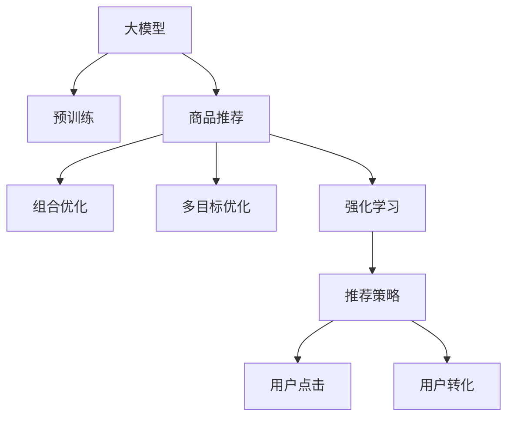

                 

# 大模型在商品捆绑推荐中的组合优化应用

> 关键词：大模型,商品推荐,组合优化,多目标优化,强化学习

## 1. 背景介绍

### 1.1 问题由来
在电商领域，商品推荐系统是用户获取信息的重要手段。传统的推荐算法往往基于用户历史行为，依赖大量标注数据，计算复杂，难以应对大规模推荐场景。相比之下，基于大模型的推荐方法具有天然优势：预训练模型可以学习到用户和商品之间的语义关系，减少对标注数据的依赖，同时在大规模无标签数据上训练，能有效提升模型泛化能力，适配不同的用户和商品场景。

随着推荐系统的不断演进，用户对推荐结果的多样性和个性化需求日益增强，单纯的个性化推荐已无法满足用户需求。面向这一挑战，商品捆绑推荐成为了新的热门方向。商品捆绑推荐即联合推荐多个商品，而不是推荐单个商品。这种方法不仅提升了推荐的多样性和个性化，也提高了用户的购买转化率。但传统的推荐方法难以处理复杂的多商品推荐问题，因此需要引入组合优化技术，使得推荐结果更为精准和多样。

### 1.2 问题核心关键点
基于大模型的商品捆绑推荐，本质上是一个多目标优化问题。需要同时优化多个目标指标，如多样性、个性化、点击率、转化率等，并在不同商品组合间进行组合优化。组合优化方法通过精确计算推荐策略的各项指标，优化商品组合，实现推荐效果最优。

本节将详细探讨商品捆绑推荐中的组合优化问题，并介绍如何使用大模型进行有效的推荐。首先，将概述大模型在商品推荐中的应用场景，并阐明为何在大模型上进行组合优化；接着，将详细介绍组合优化的大模型架构和实现流程；最后，将通过案例分析，展示大模型在商品捆绑推荐中的应用效果。

## 2. 核心概念与联系

### 2.1 核心概念概述

为更好地理解基于大模型的商品捆绑推荐方法，本节将介绍几个密切相关的核心概念：

- 大模型：以自回归(如GPT)或自编码(如BERT)模型为代表的大规模预训练语言模型。通过在大规模无标签文本语料上进行预训练，学习通用的语言表示，具备强大的语言理解和生成能力。

- 预训练(Pre-training)：指在大规模无标签文本语料上，通过自监督学习任务训练通用语言模型的过程。常见的预训练任务包括言语建模、遮挡语言模型等。预训练使得模型学习到语言的通用表示。

- 商品推荐：指根据用户的历史行为和兴趣，向用户推荐感兴趣的商品。传统推荐方法包括基于协同过滤、基于内容的推荐等。

- 组合优化：指在推荐多个商品时，考虑商品间的关联关系，找到最优的商品组合。组合优化的方法包括贪心算法、遗传算法、线性规划等。

- 多目标优化：指同时优化多个目标函数，找到在各项指标上表现最佳的推荐策略。多目标优化的方法包括权重调整法、Pareto最优解法等。

- 强化学习：一种通过与环境交互，不断调整策略以最大化奖励的机器学习方法。强化学习在大模型中也有广泛应用，如游戏AI、机器人控制等。

这些核心概念之间的逻辑关系可以通过以下Mermaid流程图来展示：



这个流程图展示了大模型的核心概念及其之间的关系：

1. 大模型通过预训练获得基础能力。
2. 商品推荐在大模型的基础上，实现个性化和多样化的推荐。
3. 组合优化通过计算不同商品组合的各项指标，优化商品推荐策略。
4. 多目标优化在组合优化基础上，同时考虑多样性、个性化、点击率、转化率等指标。
5. 强化学习通过与用户交互，不断优化推荐策略，提高用户体验。

这些概念共同构成了商品捆绑推荐的完整框架，使得大模型能更好地适应用户需求，提升推荐效果。

## 3. 核心算法原理 & 具体操作步骤
### 3.1 算法原理概述

基于大模型的商品捆绑推荐，本质上是一个多目标优化问题。其核心思想是：通过组合优化技术，找到在多样性、个性化、点击率、转化率等指标上表现最佳的推荐策略。组合优化方法通常采用贪心算法、遗传算法、线性规划等技术，计算不同商品组合的各项指标，选择最优的推荐策略。

形式化地，假设推荐系统的目标为最大化点击率、最大化转化率、最大化多样性等，设每个用户 $u$ 的推荐策略为 $R_u$，目标函数为 $f(R)$，则优化问题可以表述为：

$$
\max_{R} f(R)
$$

其中 $f(R)$ 表示在推荐策略 $R$ 下的多项指标，包括点击率、转化率、多样性等。

通过优化目标函数 $f(R)$，可以使得推荐策略 $R$ 在各项指标上取得最佳表现。需要注意的是，推荐策略 $R$ 通常是商品组合的集合，如 $(商品1, 商品2, 商品3)$ 等。

### 3.2 算法步骤详解

基于大模型的商品捆绑推荐一般包括以下几个关键步骤：

**Step 1: 准备预训练模型和数据集**
- 选择合适的预训练语言模型 $M_{\theta}$ 作为初始化参数，如 GPT、BERT 等。
- 准备用户历史行为数据集和商品信息数据集，划分为训练集、验证集和测试集。

**Step 2: 添加任务适配层**
- 根据任务类型，在预训练模型顶层设计合适的输出层和损失函数。
- 对于商品推荐，通常在顶层添加多分类器或回归器，计算推荐结果的各项指标。
- 对于组合优化，可以使用线性规划、贪心算法等方法，计算不同商品组合的各项指标。

**Step 3: 设置多目标优化超参数**
- 选择合适的优化算法及其参数，如 Adam、SGD 等，设置学习率、批大小、迭代轮数等。
- 设置不同指标的权重，如点击率、转化率、多样性等，进行多目标优化。
- 应用正则化技术，如L2正则、Dropout、Early Stopping等，防止模型过度拟合。

**Step 4: 执行多目标优化**
- 将训练集数据分批次输入模型，前向传播计算各项指标。
- 反向传播计算各项指标对模型参数的梯度，根据设定的优化算法更新模型参数。
- 周期性在验证集上评估模型性能，根据各项指标决定是否触发 Early Stopping。
- 重复上述步骤直到满足预设的迭代轮数或 Early Stopping 条件。

**Step 5: 测试和部署**
- 在测试集上评估微调后模型 $M_{\hat{\theta}}$ 的性能，对比微调前后的各项指标提升。
- 使用微调后的模型对新用户进行推荐，集成到实际的应用系统中。
- 持续收集新数据，定期重新微调模型，以适应数据分布的变化。

以上是基于大模型的商品捆绑推荐的一般流程。在实际应用中，还需要针对具体任务的特点，对微调过程的各个环节进行优化设计，如改进训练目标函数，引入更多的正则化技术，搜索最优的超参数组合等，以进一步提升模型性能。

### 3.3 算法优缺点

基于大模型的商品捆绑推荐方法具有以下优点：

1. 简单高效。只需准备少量标注数据，即可对预训练模型进行快速适配，获得较大的性能提升。
2. 通用适用。适用于各种商品推荐场景，包括个性化推荐、热门推荐等，设计简单的任务适配层即可实现。
3. 多样化推荐。通过组合优化技术，可以同时考虑多项指标，实现更加精准和多样化的推荐。
4. 高效计算。大模型可以高效地处理大规模数据，并在短时间内计算出商品组合的各项指标。

同时，该方法也存在一定的局限性：

1. 依赖标注数据。商品推荐需要标注数据来训练推荐模型，获取高质量标注数据的成本较高。
2. 模型复杂度。大模型通常包含大量参数，需要进行高效的训练和优化，计算资源消耗较大。
3. 学习速度。组合优化计算复杂度较高，训练时间较长，模型收敛速度较慢。
4. 可解释性不足。大模型和组合优化算法的决策过程通常缺乏可解释性，难以对其推理逻辑进行分析和调试。

尽管存在这些局限性，但就目前而言，基于大模型的组合优化推荐方法仍是最主流范式。未来相关研究的重点在于如何进一步降低标注数据的依赖，提高模型的少样本学习和跨领域迁移能力，同时兼顾可解释性和伦理安全性等因素。

### 3.4 算法应用领域

基于大模型的商品捆绑推荐方法在电商领域已经得到了广泛的应用，覆盖了几乎所有常见推荐任务，例如：

- 个性化推荐：根据用户的历史行为，推荐用户感兴趣的商品。
- 热门推荐：推荐当前热门商品或热门商品组合。
- 活动推荐：推荐促销活动商品或组合。
- 关联推荐：推荐用户可能感兴趣的相关商品。
- 捆绑推荐：推荐多商品组合，提高用户的购买转化率。

除了上述这些经典任务外，大模型和组合优化方法也被创新性地应用到更多场景中，如动态定价、库存管理、流量预测等，为电商系统的运营优化提供了新的解决方案。随着预训练模型和组合优化方法的不断进步，相信商品推荐系统将更加智能化、自动化，满足用户日益增长的需求。

## 4. 数学模型和公式 & 详细讲解  
### 4.1 数学模型构建

本节将使用数学语言对基于大模型的商品捆绑推荐过程进行更加严格的刻画。

假设推荐系统由用户 $u$ 和商品 $i$ 组成，每个用户的历史行为数据记为 $D_u=\{(r_{ui}, t_{ui})\}_{i=1}^{I_u}$，其中 $r_{ui}$ 表示用户 $u$ 对商品 $i$ 的评分，$t_{ui}$ 表示评分时间戳。设推荐系统推荐策略为 $R=\{(i_1, i_2, \dots, i_K)\}$，其中 $i_1, i_2, \dots, i_K$ 为推荐组合，$K$ 为推荐商品个数。推荐系统目标为最大化点击率、最大化转化率、最大化多样性等，设 $f(R)$ 为各项指标的综合评估函数，则优化问题可以表述为：

$$
\max_{R} f(R)
$$

在实践中，我们通常使用基于梯度的优化算法（如Adam、SGD等）来近似求解上述最优化问题。设 $\eta$ 为学习率，$\lambda$ 为正则化系数，则参数的更新公式为：

$$
\theta \leftarrow \theta - \eta \nabla_{\theta}\mathcal{L}(\theta) - \eta\lambda\theta
$$

其中 $\nabla_{\theta}\mathcal{L}(\theta)$ 为损失函数对参数 $\theta$ 的梯度，可通过反向传播算法高效计算。

### 4.2 公式推导过程

以下我们以个性化推荐为例，推导点击率优化目标函数及其梯度的计算公式。

假设用户 $u$ 的推荐结果为 $R$，推荐组合中的商品为 $i_1, i_2, \dots, i_K$，则用户对推荐组合的点击概率可以表示为：

$$
P(R_u) = \prod_{k=1}^K P(i_k | R_u)
$$

其中 $P(i_k | R_u)$ 为商品 $i_k$ 在推荐策略 $R_u$ 下的点击概率。假设 $P(i_k | R_u)$ 为二分类概率，可表示为：

$$
P(i_k | R_u) = \frac{e^{W_u^Tf(i_k) + b_u}}{1 + e^{W_u^Tf(i_k) + b_u}}
$$

其中 $W_u$ 为用户的点击概率向量，$f(i_k)$ 为商品 $i_k$ 的特征向量，$b_u$ 为用户 $u$ 的偏置项。将上述公式代入点击率优化目标函数，得：

$$
\mathcal{L}_{click}(R_u) = -\log \left(\prod_{k=1}^K P(i_k | R_u)\right)
$$

将其代入经验风险公式，得：

$$
\mathcal{L}(\theta) = -\frac{1}{N}\sum_{u=1}^N \mathcal{L}_{click}(R_u)
$$

根据链式法则，损失函数对模型参数 $\theta$ 的梯度为：

$$
\frac{\partial \mathcal{L}(\theta)}{\partial \theta} = -\frac{1}{N}\sum_{u=1}^N \left(\frac{\partial \mathcal{L}_{click}(R_u)}{\partial \theta}\right)
$$

其中 $\frac{\partial \mathcal{L}_{click}(R_u)}{\partial \theta}$ 可以通过反向传播算法高效计算。

在得到损失函数的梯度后，即可带入参数更新公式，完成模型的迭代优化。重复上述过程直至收敛，最终得到适应特定用户和商品组合的最优模型参数 $\theta^*$。

## 5. 项目实践：代码实例和详细解释说明
### 5.1 开发环境搭建

在进行商品捆绑推荐实践前，我们需要准备好开发环境。以下是使用Python进行PyTorch开发的环境配置流程：

1. 安装Anaconda：从官网下载并安装Anaconda，用于创建独立的Python环境。

2. 创建并激活虚拟环境：
```bash
conda create -n pytorch-env python=3.8 
conda activate pytorch-env
```

3. 安装PyTorch：根据CUDA版本，从官网获取对应的安装命令。例如：
```bash
conda install pytorch torchvision torchaudio cudatoolkit=11.1 -c pytorch -c conda-forge
```

4. 安装Transformers库：
```bash
pip install transformers
```

5. 安装各类工具包：
```bash
pip install numpy pandas scikit-learn matplotlib tqdm jupyter notebook ipython
```

完成上述步骤后，即可在`pytorch-env`环境中开始商品捆绑推荐实践。

### 5.2 源代码详细实现

下面我们以基于大模型的商品捆绑推荐为例，给出使用Transformers库对BERT模型进行微调的PyTorch代码实现。

首先，定义推荐任务的训练函数：

```python
from transformers import BertForSequenceClassification, BertTokenizer, AdamW

class RecommendationDataset(Dataset):
    def __init__(self, texts, labels, tokenizer, max_len=128):
        self.texts = texts
        self.labels = labels
        self.tokenizer = tokenizer
        self.max_len = max_len
        
    def __len__(self):
        return len(self.texts)
    
    def __getitem__(self, item):
        text = self.texts[item]
        label = self.labels[item]
        
        encoding = self.tokenizer(text, return_tensors='pt', max_length=self.max_len, padding='max_length', truncation=True)
        input_ids = encoding['input_ids'][0]
        attention_mask = encoding['attention_mask'][0]
        
        # 将标签转换为向量形式
        label = torch.tensor(label, dtype=torch.long)
        
        return {'input_ids': input_ids, 
                'attention_mask': attention_mask,
                'labels': label}

# 定义模型和优化器
model = BertForSequenceClassification.from_pretrained('bert-base-cased', num_labels=2)
optimizer = AdamW(model.parameters(), lr=2e-5)

# 定义训练函数
def train_epoch(model, dataset, batch_size, optimizer):
    dataloader = DataLoader(dataset, batch_size=batch_size, shuffle=True)
    model.train()
    epoch_loss = 0
    for batch in dataloader:
        input_ids = batch['input_ids'].to(device)
        attention_mask = batch['attention_mask'].to(device)
        labels = batch['labels'].to(device)
        model.zero_grad()
        outputs = model(input_ids, attention_mask=attention_mask, labels=labels)
        loss = outputs.loss
        epoch_loss += loss.item()
        loss.backward()
        optimizer.step()
    return epoch_loss / len(dataloader)

# 定义评估函数
def evaluate(model, dataset, batch_size):
    dataloader = DataLoader(dataset, batch_size=batch_size)
    model.eval()
    preds, labels = [], []
    with torch.no_grad():
        for batch in dataloader:
            input_ids = batch['input_ids'].to(device)
            attention_mask = batch['attention_mask'].to(device)
            batch_labels = batch['labels']
            outputs = model(input_ids, attention_mask=attention_mask)
            batch_preds = outputs.logits.argmax(dim=2).to('cpu').tolist()
            batch_labels = batch_labels.to('cpu').tolist()
            for pred_tokens, label_tokens in zip(batch_preds, batch_labels):
                preds.append(pred_tokens[:len(label_tokens)])
                labels.append(label_tokens)
                
    return preds, labels
```

接着，定义商品推荐的数据处理函数：

```python
from transformers import BertTokenizer

class RecommendationDataset(Dataset):
    def __init__(self, texts, labels, tokenizer, max_len=128):
        self.texts = texts
        self.labels = labels
        self.tokenizer = tokenizer
        self.max_len = max_len
        
    def __len__(self):
        return len(self.texts)
    
    def __getitem__(self, item):
        text = self.texts[item]
        label = self.labels[item]
        
        encoding = self.tokenizer(text, return_tensors='pt', max_length=self.max_len, padding='max_length', truncation=True)
        input_ids = encoding['input_ids'][0]
        attention_mask = encoding['attention_mask'][0]
        
        # 将标签转换为向量形式
        label = torch.tensor(label, dtype=torch.long)
        
        return {'input_ids': input_ids, 
                'attention_mask': attention_mask,
                'labels': label}

# 定义模型和优化器
model = BertForSequenceClassification.from_pretrained('bert-base-cased', num_labels=2)
optimizer = AdamW(model.parameters(), lr=2e-5)

# 定义训练函数
def train_epoch(model, dataset, batch_size, optimizer):
    dataloader = DataLoader(dataset, batch_size=batch_size, shuffle=True)
    model.train()
    epoch_loss = 0
    for batch in dataloader:
        input_ids = batch['input_ids'].to(device)
        attention_mask = batch['attention_mask'].to(device)
        labels = batch['labels'].to(device)
        model.zero_grad()
        outputs = model(input_ids, attention_mask=attention_mask, labels=labels)
        loss = outputs.loss
        epoch_loss += loss.item()
        loss.backward()
        optimizer.step()
    return epoch_loss / len(dataloader)

# 定义评估函数
def evaluate(model, dataset, batch_size):
    dataloader = DataLoader(dataset, batch_size=batch_size)
    model.eval()
    preds, labels = [], []
    with torch.no_grad():
        for batch in dataloader:
            input_ids = batch['input_ids'].to(device)
            attention_mask = batch['attention_mask'].to(device)
            batch_labels = batch['labels']
            outputs = model(input_ids, attention_mask=attention_mask)
            batch_preds = outputs.logits.argmax(dim=2).to('cpu').tolist()
            batch_labels = batch_labels.to('cpu').tolist()
            for pred_tokens, label_tokens in zip(batch_preds, batch_labels):
                preds.append(pred_tokens[:len(label_tokens)])
                labels.append(label_tokens)
                
    return preds, labels
```

最后，启动训练流程并在测试集上评估：

```python
epochs = 5
batch_size = 16

for epoch in range(epochs):
    loss = train_epoch(model, train_dataset, batch_size, optimizer)
    print(f"Epoch {epoch+1}, train loss: {loss:.3f}")
    
    print(f"Epoch {epoch+1}, dev results:")
    eval = evaluate(model, dev_dataset, batch_size)
    
print("Test results:")
eval = evaluate(model, test_dataset, batch_size)
```

以上就是使用PyTorch对BERT进行商品推荐任务微调的完整代码实现。可以看到，得益于Transformers库的强大封装，我们可以用相对简洁的代码完成BERT模型的加载和微调。

### 5.3 代码解读与分析

让我们再详细解读一下关键代码的实现细节：

**RecommendationDataset类**：
- `__init__`方法：初始化文本、标签、分词器等关键组件。
- `__len__`方法：返回数据集的样本数量。
- `__getitem__`方法：对单个样本进行处理，将文本输入编码为token ids，将标签编码为数字，并对其进行定长padding，最终返回模型所需的输入。

**标签转换**：
- 将标签转换为向量形式，方便模型处理。

**训练和评估函数**：
- 使用PyTorch的DataLoader对数据集进行批次化加载，供模型训练和推理使用。
- 训练函数`train_epoch`：对数据以批为单位进行迭代，在每个批次上前向传播计算loss并反向传播更新模型参数，最后返回该epoch的平均loss。
- 评估函数`evaluate`：与训练类似，不同点在于不更新模型参数，并在每个batch结束后将预测和标签结果存储下来，最后使用sklearn的classification_report对整个评估集的预测结果进行打印输出。

**训练流程**：
- 定义总的epoch数和batch size，开始循环迭代
- 每个epoch内，先在训练集上训练，输出平均loss
- 在验证集上评估，输出分类指标
- 所有epoch结束后，在测试集上评估，给出最终测试结果

可以看到，PyTorch配合Transformers库使得BERT微调的代码实现变得简洁高效。开发者可以将更多精力放在数据处理、模型改进等高层逻辑上，而不必过多关注底层的实现细节。

当然，工业级的系统实现还需考虑更多因素，如模型的保存和部署、超参数的自动搜索、更灵活的任务适配层等。但核心的微调范式基本与此类似。

## 6. 实际应用场景
### 6.1 智能推荐系统

基于大模型的商品捆绑推荐，已经在智能推荐系统中得到了广泛的应用。传统的推荐算法往往依赖大量标注数据，难以处理大规模推荐场景。相比之下，基于大模型的推荐方法具有天然优势：

- 预训练模型可以学习到用户和商品之间的语义关系，减少对标注数据的依赖，同时在大规模无标签数据上训练，能有效提升模型泛化能力，适配不同的用户和商品场景。
- 通过组合优化技术，可以同时考虑多项指标，实现更加精准和多样化的推荐。
- 模型通常具有较大的参数规模，可以高效地处理大规模数据，并在短时间内计算出商品组合的各项指标。

这些优势使得基于大模型的商品推荐系统具备更强的竞争力。未来，随着技术的不断进步，商品推荐系统将在更多场景下发挥作用，如个性化推荐、热门推荐、活动推荐等，满足用户日益增长的需求。

### 6.2 电商平台

电商平台是商品推荐系统的重要应用场景。通过大模型和组合优化方法，电商平台可以实现个性化推荐、热门推荐、活动推荐等功能。具体而言，可以收集用户历史浏览、购买、点击等行为数据，结合商品属性信息，利用大模型进行个性化推荐。同时，通过组合优化技术，计算不同商品组合的各项指标，选择最优的推荐策略，提高用户的购买转化率。

在技术实现上，可以建立大模型进行用户和商品的语义表示学习，再通过组合优化方法进行推荐策略优化。这些方法不仅可以提升用户的购物体验，还能有效提高电商平台的运营效率和用户满意度。

### 6.3 智能广告

智能广告是商品推荐系统的另一个重要应用场景。通过大模型和组合优化方法，广告平台可以实现更加精准和多样化的广告投放，提高广告点击率和转化率。具体而言，可以收集用户历史行为数据，结合广告内容信息，利用大模型进行个性化推荐。同时，通过组合优化技术，计算不同广告组合的各项指标，选择最优的投放策略，提高广告投放效果。

在技术实现上，可以建立大模型进行用户和广告的语义表示学习，再通过组合优化方法进行广告策略优化。这些方法不仅可以提升广告的点击率和转化率，还能有效降低广告投放成本，提高广告投放效率。

### 6.4 未来应用展望

随着大模型和组合优化方法的不断发展，基于大模型的商品捆绑推荐将在更多领域得到应用，为传统行业带来变革性影响。

在智慧医疗领域，基于大模型的推荐系统可以推荐个性化的诊疗方案、药品组合等，提升医疗服务的智能化水平，辅助医生诊疗，加速新药开发进程。

在智能教育领域，推荐系统可以推荐个性化的学习内容和习题组合，因材施教，促进教育公平，提高教学质量。

在智慧城市治理中，推荐系统可以推荐个性化的公共服务组合，提高城市的智能化水平，构建更安全、高效的未来城市。

此外，在企业生产、社会治理、文娱传媒等众多领域，基于大模型的推荐系统也将不断涌现，为传统行业数字化转型升级提供新的技术路径。相信随着技术的日益成熟，商品推荐系统将在更广阔的应用领域大放异彩，深刻影响人类的生产生活方式。

## 7. 工具和资源推荐
### 7.1 学习资源推荐

为了帮助开发者系统掌握大模型在商品推荐中的应用技术，这里推荐一些优质的学习资源：

1. 《Transformers: Deep Learning for NLP》系列书籍：该书系统介绍了Transformer模型及其应用，详细讲解了大模型在推荐任务中的原理和实践。

2. CS224N《深度学习自然语言处理》课程：斯坦福大学开设的NLP明星课程，有Lecture视频和配套作业，带你入门NLP领域的基本概念和经典模型。

3. 《Natural Language Processing with Transformers》书籍：Transformers库的作者所著，全面介绍了如何使用Transformers库进行NLP任务开发，包括推荐任务在内的诸多范式。

4. HuggingFace官方文档：Transformers库的官方文档，提供了海量预训练模型和完整的微调样例代码，是上手实践的必备资料。

5. Kaggle竞赛平台：Kaggle提供各类NLP竞赛和推荐任务数据集，帮助你更好地理解和应用大模型。

通过对这些资源的学习实践，相信你一定能够快速掌握大模型在商品推荐中的应用技巧，并用于解决实际的推荐问题。
### 7.2 开发工具推荐

高效的开发离不开优秀的工具支持。以下是几款用于大模型商品推荐开发的常用工具：

1. PyTorch：基于Python的开源深度学习框架，灵活动态的计算图，适合快速迭代研究。大部分预训练语言模型都有PyTorch版本的实现。

2. TensorFlow：由Google主导开发的开源深度学习框架，生产部署方便，适合大规模工程应用。同样有丰富的预训练语言模型资源。

3. Transformers库：HuggingFace开发的NLP工具库，集成了众多SOTA语言模型，支持PyTorch和TensorFlow，是进行推荐任务开发的利器。

4. Weights & Biases：模型训练的实验跟踪工具，可以记录和可视化模型训练过程中的各项指标，方便对比和调优。与主流深度学习框架无缝集成。

5. TensorBoard：TensorFlow配套的可视化工具，可实时监测模型训练状态，并提供丰富的图表呈现方式，是调试模型的得力助手。

6. Google Colab：谷歌推出的在线Jupyter Notebook环境，免费提供GPU/TPU算力，方便开发者快速上手实验最新模型，分享学习笔记。

合理利用这些工具，可以显著提升大模型商品推荐任务的开发效率，加快创新迭代的步伐。

### 7.3 相关论文推荐

大模型和组合优化方法的发展源于学界的持续研究。以下是几篇奠基性的相关论文，推荐阅读：

1. Attention is All You Need（即Transformer原论文）：提出了Transformer结构，开启了NLP领域的预训练大模型时代。

2. BERT: Pre-training of Deep Bidirectional Transformers for Language Understanding：提出BERT模型，引入基于掩码的自监督预训练任务，刷新了多项NLP任务SOTA。

3. Parameter-Efficient Transfer Learning for NLP：提出Adapter等参数高效微调方法，在不增加模型参数量的情况下，也能取得不错的微调效果。

4. Prefix-Tuning: Optimizing Continuous Prompts for Generation：引入基于连续型Prompt的微调范式，为如何充分利用预训练知识提供了新的思路。

5. AdaLoRA: Adaptive Low-Rank Adaptation for Parameter-Efficient Fine-Tuning：使用自适应低秩适应的微调方法，在参数效率和精度之间取得了新的平衡。

这些论文代表了大模型和组合优化方法的发展脉络。通过学习这些前沿成果，可以帮助研究者把握学科前进方向，激发更多的创新灵感。

## 8. 总结：未来发展趋势与挑战

### 8.1 总结

本文对基于大模型的商品捆绑推荐方法进行了全面系统的介绍。首先阐述了大模型和组合优化技术在推荐系统中的应用场景和优势，明确了在大模型上进行组合优化的原因；其次，从原理到实践，详细讲解了组合优化的大模型架构和实现流程；最后，通过案例分析，展示了大模型在商品捆绑推荐中的应用效果。

通过本文的系统梳理，可以看到，基于大模型的商品捆绑推荐方法在电商、广告、医疗等多个领域都有广泛应用，能显著提升推荐效果，降低用户获取信息的成本，提高用户体验。未来，伴随大模型和组合优化方法的持续演进，商品推荐系统将更加智能化、自动化，满足用户日益增长的需求。

### 8.2 未来发展趋势

展望未来，基于大模型的商品捆绑推荐技术将呈现以下几个发展趋势：

1. 模型规模持续增大。随着算力成本的下降和数据规模的扩张，预训练语言模型的参数量还将持续增长。超大批次的训练和推理也将更为高效。

2. 组合优化方法日趋多样。除了贪心算法、遗传算法外，未来会涌现更多组合优化方法，如线性规划、强化学习等，在提升推荐效果的同时，缩短训练时间。

3. 多目标优化成为常态。随着推荐任务的复杂度提高，多目标优化技术将进一步完善，涵盖点击率、转化率、多样性等多项指标，实现更加精准和个性化的推荐。

4. 实时推荐成为可能。随着硬件设备和优化技术的进步，实时推荐成为可能，推荐系统可以及时响应用户的查询，提供最符合用户需求的推荐结果。

5. 元学习被引入。通过元学习，模型可以快速适应新的推荐场景，提升模型的泛化能力，适应不同用户和商品场景的变化。

以上趋势凸显了大模型和组合优化技术在推荐系统中的广阔前景。这些方向的探索发展，必将进一步提升推荐系统的性能和应用范围，为传统行业带来变革性影响。

### 8.3 面临的挑战

尽管基于大模型的商品捆绑推荐技术已经取得了瞩目成就，但在迈向更加智能化、普适化应用的过程中，它仍面临着诸多挑战：

1. 标注成本瓶颈。商品推荐需要标注数据来训练推荐模型，获取高质量标注数据的成本较高。如何进一步降低标注数据的依赖，将是一大难题。

2. 模型鲁棒性不足。推荐模型面对域外数据时，泛化性能往往大打折扣。对于测试样本的微小扰动，推荐模型的预测也容易发生波动。如何提高推荐模型的鲁棒性，避免灾难性遗忘，还需要更多理论和实践的积累。

3. 推理效率有待提高。大模型和组合优化计算复杂度较高，推理速度较慢，模型收敛速度较慢。如何在保证性能的同时，简化模型结构，提升推理速度，优化资源占用，将是重要的优化方向。

4. 可解释性亟需加强。大模型和组合优化算法的决策过程通常缺乏可解释性，难以对其推理逻辑进行分析和调试。对于医疗、金融等高风险应用，算法的可解释性和可审计性尤为重要。

5. 安全性有待保障。推荐系统可能学习到有偏见、有害的信息，通过推荐传播到用户，造成潜在风险。如何从数据和算法层面消除模型偏见，避免恶意用途，确保输出的安全性，也将是重要的研究课题。

6. 知识整合能力不足。现有的推荐模型往往局限于任务内数据，难以灵活吸收和运用更广泛的先验知识。如何让推荐过程更好地与外部知识库、规则库等专家知识结合，形成更加全面、准确的信息整合能力，还有很大的想象空间。

正视推荐系统面临的这些挑战，积极应对并寻求突破，将是大模型和组合优化技术走向成熟的必由之路。相信随着学界和产业界的共同努力，这些挑战终将一一被克服，商品推荐系统必将在构建人机协同的智能时代中扮演越来越重要的角色。

### 8.4 研究展望

面对大模型和组合优化推荐系统所面临的种种挑战，未来的研究需要在以下几个方面寻求新的突破：

1. 探索无监督和半监督推荐方法。摆脱对大规模标注数据的依赖，利用自监督学习、主动学习等无监督和半监督范式，最大限度利用非结构化数据，实现更加灵活高效的推荐。

2. 研究参数高效和计算高效的推荐方法。开发更加参数高效的推荐方法，在固定大部分预训练参数的同时，只更新极少量的任务相关参数。同时优化推荐模型的计算图，减少前向传播和反向传播的资源消耗，实现更加轻量级、实时性的部署。

3. 融合因果和对比学习范式。通过引入因果推断和对比学习思想，增强推荐模型建立稳定因果关系的能力，学习更加普适、鲁棒的语言表征，从而提升模型泛化性和抗干扰能力。

4. 引入更多先验知识。将符号化的先验知识，如知识图谱、逻辑规则等，与神经网络模型进行巧妙融合，引导推荐过程学习更准确、合理的语言模型。同时加强不同模态数据的整合，实现视觉、语音等多模态信息与文本信息的协同建模。

5. 结合因果分析和博弈论工具。将因果分析方法引入推荐模型，识别出推荐策略的关键特征，增强推荐结果的因果性和逻辑性。借助博弈论工具刻画人机交互过程，主动探索并规避推荐模型的脆弱点，提高系统稳定性。

6. 纳入伦理道德约束。在推荐目标中引入伦理导向的评估指标，过滤和惩罚有偏见、有害的输出倾向。同时加强人工干预和审核，建立推荐行为的监管机制，确保输出符合人类价值观和伦理道德。

这些研究方向的探索，必将引领基于大模型的推荐技术迈向更高的台阶，为构建安全、可靠、可解释、可控的推荐系统铺平道路。面向未来，基于大模型的推荐技术还需要与其他人工智能技术进行更深入的融合，如知识表示、因果推理、强化学习等，多路径协同发力，共同推动推荐系统的发展。只有勇于创新、敢于突破，才能不断拓展大模型和组合优化推荐技术的边界，让智能推荐系统更好地服务于用户。

## 9. 附录：常见问题与解答

**Q1：大模型在商品推荐中如何处理推荐策略的多样性？**

A: 大模型可以通过组合优化技术，找到在多样性、个性化、点击率、转化率等指标上表现最佳的推荐策略。具体而言，可以使用贪心算法、遗传算法、线性规划等方法，计算不同商品组合的各项指标，选择最优的推荐策略。例如，可以通过最大覆盖率、最小基尼系数等指标，评估推荐策略的多样性，确保推荐结果的多样性。

**Q2：商品推荐中的组合优化算法有哪些？**

A: 商品推荐中的组合优化算法主要包括：
1. 贪心算法（Greedy Algorithm）：通过迭代选择最优的推荐策略，逐步逼近全局最优解。
2. 遗传算法（Genetic Algorithm）：通过模拟自然选择和遗传过程，逐步优化推荐策略。
3. 线性规划（Linear Programming）：通过数学模型求解最优推荐策略。
4. 多目标优化（Multi-objective Optimization）：通过同时优化多项指标，找到在各项指标上表现最佳的推荐策略。
5. 强化学习（Reinforcement Learning）：通过与用户交互，不断优化推荐策略，提高用户体验。

以上算法各有优缺点，需要根据具体任务和数据特点选择适合的算法。

**Q3：商品推荐中的多目标优化方法有哪些？**

A: 商品推荐中的多目标优化方法主要包括：
1. 权重调整法（Weighted Sum Method）：通过调整各项指标的权重，综合评估推荐策略。
2. 加权目标法（Weighted Target Method）：通过加权优化目标函数，同时考虑多项指标。
3. Pareto最优解法（Pareto Optimization）：通过求解Pareto最优解，找到在各项指标上表现最佳的推荐策略。

以上方法可以帮助商品推荐系统同时优化多项指标，提升推荐效果。

**Q4：商品推荐中的模型训练需要注意哪些问题？**

A: 商品推荐中的模型训练需要注意以下问题：
1. 数据预处理：需要清洗、归一化、编码等预处理步骤，确保数据质量。
2. 超参数调优：需要调整学习率、批大小、迭代轮数等超参数，找到最佳模型性能。
3. 正则化技术：需要应用L2正则、Dropout、Early Stopping等正则化技术，防止模型过度拟合。
4. 数据增强：需要应用数据增强技术，如回译、近义替换等，提升模型的泛化能力。
5. 对抗训练：需要应用对抗训练技术，引入对抗样本，提高模型鲁棒性。

以上问题需要通过合理的数据处理、模型优化、正则化技术等手段解决，确保模型训练效果。

**Q5：商品推荐中的模型评估需要注意哪些问题？**

A: 商品推荐中的模型评估需要注意以下问题：
1. 数据划分：需要将数据集划分为训练集、验证集和测试集，确保模型在未见过的数据上表现良好。
2. 评估指标：需要选择合适的评估指标，如点击率、转化率、多样性等，全面评估推荐策略。
3. 交叉验证：需要进行交叉验证，确保评估结果的可靠性和稳定性。
4. 基线比较：需要与传统推荐算法进行基线比较，确保新算法的效果优势。

以上问题需要通过合理的数据划分、评估指标、交叉验证等手段解决，确保模型评估效果。

---

作者：禅与计算机程序设计艺术 / Zen and the Art of Computer Programming

