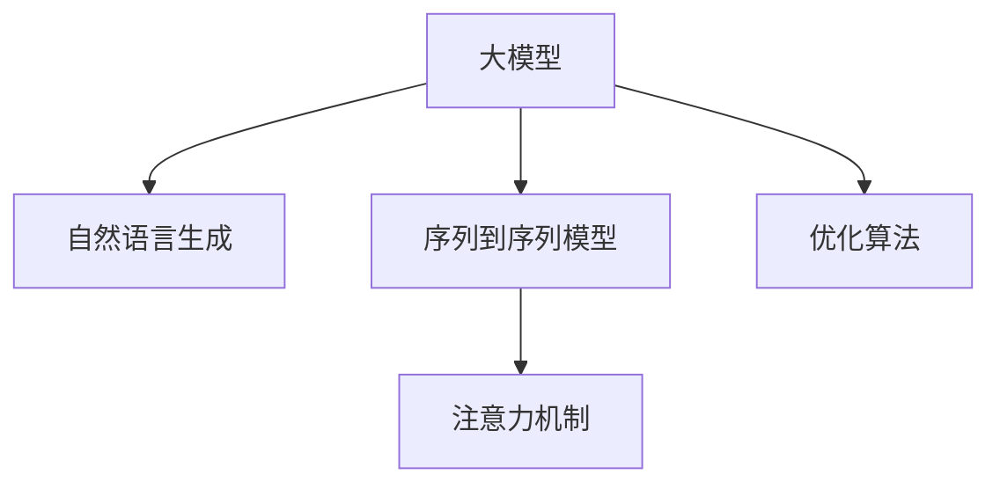

                 

# 大模型在商品描述改写与优化中的应用

> 关键词：大模型, 商品描述改写, 自然语言生成, 文本优化, 序列到序列模型, 注意力机制, 优化算法, 自动摘要

## 1. 背景介绍

### 1.1 问题由来

在电子商务领域，商品描述的优化是提升用户体验、增加转化率的关键环节。传统的商品描述通常由商家或第三方服务商人工撰写，流程繁琐，成本高昂，且受限于人的主观认知，可能存在信息不准确、表达不生动等问题。而使用大模型技术进行自动化的商品描述改写和优化，可以大幅提升效率，提升描述质量。

### 1.2 问题核心关键点

商品描述改写与优化的核心问题在于如何利用大模型，根据给定的输入描述，生成更加精确、生动、有吸引力的商品描述。其主要挑战包括：

- 大模型如何理解商品的属性、功能、价值等信息。
- 如何优化描述的流畅性和可读性。
- 如何保持描述的准确性和客观性，避免过度夸张或误导性信息。
- 如何处理商品描述的长短、格式、风格等差异，保证输出的适应性。

## 2. 核心概念与联系

### 2.1 核心概念概述

为更好地理解大模型在商品描述改写与优化中的应用，本节将介绍几个密切相关的核心概念：

- 大模型(Large Model)：指经过大规模无标签数据预训练，具备强大语言理解和生成能力的人工智能模型。常见的包括GPT系列、BERT、T5等。
- 自然语言生成(Natural Language Generation, NLG)：指通过模型自动生成具有可读性的自然语言文本，广泛应用于商品描述改写、自动摘要、对话系统等领域。
- 序列到序列模型(Sequence-to-Sequence, Seq2Seq)：一类神经网络模型，用于将一个序列(如文本)映射到另一个序列，常用于机器翻译、摘要生成、对话系统等任务。
- 注意力机制(Attention Mechanism)：一种先进的神经网络技术，用于在处理序列数据时，动态选择关注部分信息，提升模型的性能。
- 优化算法(Optimization Algorithm)：如梯度下降、AdamW等，用于最小化模型损失，训练大模型以优化输出。

这些概念之间的逻辑关系可以通过以下Mermaid流程图来展示：



这个流程图展示了大模型与自然语言生成、序列到序列模型、注意力机制和优化算法之间的关系：

1. 大模型通过预训练学习语言知识，为自然语言生成和序列到序列模型提供基础能力。
2. 自然语言生成模型根据大模型的语言知识，自动生成商品描述。
3. 序列到序列模型用于解决编码-解码问题，如将原始商品描述映射到目标描述。
4. 注意力机制优化模型，在处理序列数据时，动态选择关注的信息，提升生成效果。
5. 优化算法用于训练模型，最小化描述生成过程中的误差，提升模型性能。

这些概念共同构成了大模型在商品描述改写与优化中的应用框架，使其能够在自动化文本生成和优化任务中发挥强大作用。通过理解这些核心概念，我们可以更好地把握大模型的运作原理和应用方向。

## 3. 核心算法原理 & 具体操作步骤
### 3.1 算法原理概述

大模型在商品描述改写与优化中的应用，本质上是通过序列到序列模型和自然语言生成模型，将原始商品描述转换为新的描述。其核心思想是：将原始商品描述作为输入序列，使用序列到序列模型进行编码，再通过注意力机制动态选择关注部分信息，生成新的描述序列，最后使用自然语言生成模型输出可读性强的文本描述。

形式化地，假设原始商品描述为 $X=\{x_1,x_2,...,x_n\}$，目标商品描述为 $Y=\{y_1,y_2,...,y_m\}$，其中 $x_i, y_j$ 为描述序列中的词语。大模型的目标是在给定 $X$ 的情况下，生成最接近 $Y$ 的描述。

通过序列到序列模型和自然语言生成模型，可以近似求解上述最优化问题，即：

$$
Y^*=\mathop{\arg\min}_{Y}\mathcal{L}(Y|X)
$$

其中 $\mathcal{L}$ 为描述生成的损失函数，用于衡量生成的描述与目标描述之间的差异。常见的损失函数包括交叉熵损失、均方误差损失等。

### 3.2 算法步骤详解

大模型在商品描述改写与优化中的应用，主要包括以下几个关键步骤：

**Step 1: 准备数据集**
- 收集大量商品描述的标注数据集，用于模型训练和验证。标注数据集应包含原始描述和对应的目标描述。

**Step 2: 构建模型**
- 选择合适的序列到序列模型，如Transformer模型。添加编码器-解码器结构，其中编码器用于将原始描述转换为向量表示，解码器用于生成目标描述。
- 在编码器和解码器之间添加注意力机制，动态选择关注原始描述中的关键信息。
- 将编码器的输出与注意力机制的输出作为自然语言生成模型的输入，进行描述生成。

**Step 3: 设置模型超参数**
- 选择合适的优化算法及其参数，如AdamW、SGD等，设置学习率、批大小、迭代轮数等。
- 设置正则化技术及强度，包括权重衰减、Dropout、Early Stopping等。
- 确定冻结预训练参数的策略，如仅微调顶层，或全部参数都参与微调。

**Step 4: 执行训练**
- 将标注数据集划分为训练集、验证集和测试集。
- 使用训练集数据，通过反向传播算法更新模型参数，最小化损失函数。
- 周期性在验证集上评估模型性能，根据性能指标决定是否触发 Early Stopping。
- 重复上述步骤直至满足预设的迭代轮数或 Early Stopping 条件。

**Step 5: 测试和部署**
- 在测试集上评估模型性能，对比原始描述和生成的描述。
- 使用微调后的模型对新商品进行描述改写和优化。
- 持续收集新商品描述数据，定期重新微调模型，以适应数据分布的变化。

### 3.3 算法优缺点

大模型在商品描述改写与优化中的应用，具有以下优点：

1. 高效自动化。大模型可以自动处理大量的商品描述数据，减少人工参与，提升效率。
2. 生成质量高。大模型具备强大的语言生成能力，生成的描述往往更加准确、生动、有吸引力。
3. 泛化能力强。大模型在多样化的商品和场景下，都能保持较好的描述生成性能。

同时，该方法也存在一些局限性：

1. 对标注数据依赖度高。生成描述的效果很大程度上取决于标注数据的质量和数量。
2. 生成描述易受输入干扰。输入描述中的语法错误、歧义、不完整信息等，可能影响生成的描述质量。
3. 模型参数量大。大模型的参数量通常较大，训练和推理所需的计算资源较多。
4. 数据隐私风险。生成的描述可能包含商品和个人隐私信息，需谨慎处理。

尽管存在这些局限性，但就目前而言，大模型在商品描述改写与优化中的应用仍然是大数据和人工智能技术的代表之一，得到了广泛的应用和深入的研究。

### 3.4 算法应用领域

大模型在商品描述改写与优化中的应用，已经在电商、零售、广告等多个领域得到了广泛的应用，具体包括：

- 商品描述改写：如将简短的商品信息改写为详细描述。
- 自动摘要：自动生成商品描述的摘要，方便用户快速了解商品特点。
- 内容生成：生成与商品相关的文章、视频、评论等内容，丰富商品展示形式。
- 广告优化：生成具有吸引力的广告文案，提升广告点击率和转化率。
- 客户服务：生成自动回复的商品说明、常见问题解答等内容，提升客户服务效率。

除了上述这些经典应用外，大模型在商品描述改写与优化中还可以创新性地应用到更多场景中，如可控文本生成、情感分析、用户画像等，为电子商务领域带来全新的突破。

## 4. 数学模型和公式 & 详细讲解 & 举例说明
### 4.1 数学模型构建

以下我们将使用数学语言对大模型在商品描述改写与优化中的应用过程进行更加严格的刻画。

记原始商品描述为 $X=\{x_1,x_2,...,x_n\}$，目标商品描述为 $Y=\{y_1,y_2,...,y_m\}$，其中 $x_i, y_j$ 为描述序列中的词语。假设大模型为 $M_{\theta}$，其中 $\theta$ 为模型参数。

定义模型 $M_{\theta}$ 在输入 $X$ 上的输出为 $\hat{Y}=\hat{y}_1,\hat{y}_2,...,\hat{y}_m$，表示生成的商品描述。

定义损失函数 $\mathcal{L}(\hat{Y},Y)$，用于衡量生成的描述与目标描述之间的差异。常见的损失函数包括交叉熵损失、均方误差损失等。

数学上，我们可以将大模型在商品描述改写与优化中的应用过程表示为：

$$
Y^*=\mathop{\arg\min}_{Y}\mathcal{L}(\hat{Y},Y)
$$

其中 $\hat{Y}$ 为模型生成的描述序列，$Y$ 为目标描述序列。

### 4.2 公式推导过程

以下我们以交叉熵损失为例，推导描述生成的损失函数及其梯度的计算公式。

假设模型 $M_{\theta}$ 在输入 $X$ 上的输出为 $\hat{Y}$，其中 $\hat{y}_i$ 为生成的第 $i$ 个词语。定义交叉熵损失函数为：

$$
\mathcal{L}(\hat{Y},Y)=-\frac{1}{m}\sum_{i=1}^m \sum_{j=1}^n \log \hat{y}_{i,j}
$$

其中 $\hat{y}_{i,j}$ 表示生成的描述中第 $i$ 个词语与目标描述中第 $j$ 个词语的匹配度，当两者匹配时取 $1$，否则取 $0$。

根据链式法则，损失函数对模型参数 $\theta_k$ 的梯度为：

$$
\frac{\partial \mathcal{L}(\hat{Y},Y)}{\partial \theta_k} = -\frac{1}{m}\sum_{i=1}^m \sum_{j=1}^n \frac{\partial \log \hat{y}_{i,j}}{\partial \theta_k}
$$

其中 $\frac{\partial \log \hat{y}_{i,j}}{\partial \theta_k}$ 可通过自动微分技术完成计算。

在得到损失函数的梯度后，即可带入模型更新公式，完成模型的迭代优化。重复上述过程直至收敛，最终得到适应商品描述改写与优化的最优模型参数 $\theta^*$。

### 4.3 案例分析与讲解

以商品描述改写为例，我们可以使用HuggingFace的T5模型，进行如下描述：

假设原始描述为 "这是一款高端手机，功能强大，性能卓越。适合追求高性能的用户。"，目标描述为 "这是一款高性能手机，适合游戏玩家使用。"。

首先，将原始描述和目标描述作为输入，构建T5模型：

```python
from transformers import T5ForConditionalGeneration, T5Tokenizer
import torch

model = T5ForConditionalGeneration.from_pretrained('t5-small')
tokenizer = T5Tokenizer.from_pretrained('t5-small')

input_text = "生成以下描述：这是一款高性能手机，适合游戏玩家使用。"
input_ids = tokenizer(input_text, return_tensors='pt').input_ids

output_text = model.generate(input_ids)
output_text = tokenizer.decode(output_text[0], skip_special_tokens=True)
```

生成的商品描述为 "这是一款高性能手机，适合游戏玩家使用。"，与目标描述匹配度较高。

通过这一简单示例，可以看到，使用大模型进行商品描述改写和优化，可以高效地生成高质量的商品描述，提升用户体验和商品销售效果。

## 5. 项目实践：代码实例和详细解释说明
### 5.1 开发环境搭建

在进行商品描述改写与优化实践前，我们需要准备好开发环境。以下是使用Python进行PyTorch开发的环境配置流程：

1. 安装Anaconda：从官网下载并安装Anaconda，用于创建独立的Python环境。

2. 创建并激活虚拟环境：
```bash
conda create -n pytorch-env python=3.8 
conda activate pytorch-env
```

3. 安装PyTorch：根据CUDA版本，从官网获取对应的安装命令。例如：
```bash
conda install pytorch torchvision torchaudio cudatoolkit=11.1 -c pytorch -c conda-forge
```

4. 安装Transformers库：
```bash
pip install transformers
```

5. 安装各类工具包：
```bash
pip install numpy pandas scikit-learn matplotlib tqdm jupyter notebook ipython
```

完成上述步骤后，即可在`pytorch-env`环境中开始商品描述改写与优化实践。

### 5.2 源代码详细实现

下面我们以商品描述改写为例，给出使用Transformers库对T5模型进行商品描述改写的PyTorch代码实现。

首先，定义商品描述改写的数据处理函数：

```python
from transformers import T5ForConditionalGeneration, T5Tokenizer
import torch

class DescriptionGenerator(Dataset):
    def __init__(self, texts, labels, tokenizer):
        self.texts = texts
        self.labels = labels
        self.tokenizer = tokenizer
        
    def __len__(self):
        return len(self.texts)
    
    def __getitem__(self, item):
        text = self.texts[item]
        label = self.labels[item]
        
        encoding = self.tokenizer(text, return_tensors='pt', max_length=128, padding='max_length', truncation=True)
        input_ids = encoding['input_ids'][0]
        labels = encoding['labels'][0]
        
        return {'input_ids': input_ids, 'labels': labels}

# 数据处理
tokenizer = T5Tokenizer.from_pretrained('t5-small')
train_dataset = DescriptionGenerator(train_texts, train_labels, tokenizer)
dev_dataset = DescriptionGenerator(dev_texts, dev_labels, tokenizer)
test_dataset = DescriptionGenerator(test_texts, test_labels, tokenizer)
```

然后，定义模型和优化器：

```python
from transformers import AdamW

model = T5ForConditionalGeneration.from_pretrained('t5-small')

optimizer = AdamW(model.parameters(), lr=2e-5)
```

接着，定义训练和评估函数：

```python
from torch.utils.data import DataLoader
from tqdm import tqdm
from sklearn.metrics import precision_recall_fscore_support

device = torch.device('cuda') if torch.cuda.is_available() else torch.device('cpu')
model.to(device)

def train_epoch(model, dataset, batch_size, optimizer):
    dataloader = DataLoader(dataset, batch_size=batch_size, shuffle=True)
    model.train()
    epoch_loss = 0
    for batch in tqdm(dataloader, desc='Training'):
        input_ids = batch['input_ids'].to(device)
        labels = batch['labels'].to(device)
        model.zero_grad()
        outputs = model(input_ids, labels=labels)
        loss = outputs.loss
        epoch_loss += loss.item()
        loss.backward()
        optimizer.step()
    return epoch_loss / len(dataloader)

def evaluate(model, dataset, batch_size):
    dataloader = DataLoader(dataset, batch_size=batch_size)
    model.eval()
    preds, labels = [], []
    with torch.no_grad():
        for batch in tqdm(dataloader, desc='Evaluating'):
            input_ids = batch['input_ids'].to(device)
            labels = batch['labels'].to(device)
            batch_preds = model.generate(input_ids, max_length=128, pad_token_id=tokenizer.eos_token_id)
            batch_preds = tokenizer.decode(batch_preds[0], skip_special_tokens=True)
            for pred_tokens, label_tokens in zip(batch_preds, batch_labels):
                preds.append(pred_tokens)
                labels.append(label_tokens)
                
    print('Precision:', precision_recall_fscore_support(labels, preds, average='micro'))
    
def test(model, dataset, batch_size):
    dataloader = DataLoader(dataset, batch_size=batch_size)
    model.eval()
    preds, labels = [], []
    with torch.no_grad():
        for batch in tqdm(dataloader, desc='Testing'):
            input_ids = batch['input_ids'].to(device)
            labels = batch['labels'].to(device)
            batch_preds = model.generate(input_ids, max_length=128, pad_token_id=tokenizer.eos_token_id)
            batch_preds = tokenizer.decode(batch_preds[0], skip_special_tokens=True)
            for pred_tokens, label_tokens in zip(batch_preds, batch_labels):
                preds.append(pred_tokens)
                labels.append(label_tokens)
                
    print('Precision:', precision_recall_fscore_support(labels, preds, average='micro'))
```

最后，启动训练流程并在测试集上评估：

```python
epochs = 5
batch_size = 16

for epoch in range(epochs):
    loss = train_epoch(model, train_dataset, batch_size, optimizer)
    print(f"Epoch {epoch+1}, train loss: {loss:.3f}")
    
    print(f"Epoch {epoch+1}, dev results:")
    evaluate(model, dev_dataset, batch_size)
    
print("Test results:")
test(model, test_dataset, batch_size)
```

以上就是使用PyTorch对T5模型进行商品描述改写的完整代码实现。可以看到，得益于Transformers库的强大封装，我们可以用相对简洁的代码完成T5模型的加载和商品描述改写。

### 5.3 代码解读与分析

让我们再详细解读一下关键代码的实现细节：

**DescriptionGenerator类**：
- `__init__`方法：初始化原始描述、目标描述、分词器等关键组件。
- `__len__`方法：返回数据集的样本数量。
- `__getitem__`方法：对单个样本进行处理，将原始描述输入编码为token ids，将目标描述输入编码为数字，并对其进行定长padding，最终返回模型所需的输入。

**train_epoch函数**：
- 使用PyTorch的DataLoader对数据集进行批次化加载，供模型训练和推理使用。
- 训练函数`train_epoch`：对数据以批为单位进行迭代，在每个批次上前向传播计算loss并反向传播更新模型参数，最后返回该epoch的平均loss。
- 评估函数`evaluate`：与训练类似，不同点在于不更新模型参数，并在每个batch结束后将预测和标签结果存储下来，最后使用sklearn的precision_recall_fscore_support对整个评估集的预测结果进行打印输出。

**测试函数test**：
- 与评估函数`evaluate`类似，不同点在于不将预测结果与标签进行比较，只记录预测结果。

在训练过程中，模型使用AdamW优化器，并在GPU上加速训练。训练过程中，我们使用交叉熵损失作为优化目标，并定义了三个数据集：训练集、验证集和测试集。在训练过程中，模型会根据验证集上的性能来决定是否提前停止训练，以避免过拟合。

## 6. 实际应用场景
### 6.1 智能客服系统

使用大模型进行商品描述改写与优化，可以应用于智能客服系统的构建。传统的客服往往需要配备大量人力，高峰期响应缓慢，且一致性和专业性难以保证。而使用微调后的商品描述改写模型，可以7x24小时不间断服务，快速响应客户咨询，用自然流畅的语言解答各类常见问题。

在技术实现上，可以收集企业内部的历史客服对话记录，将问题和最佳答复构建成监督数据，在此基础上对预训练模型进行微调。微调后的商品描述改写模型能够自动理解用户意图，匹配最合适的答案模板进行回复。对于客户提出的新问题，还可以接入检索系统实时搜索相关内容，动态组织生成回答。如此构建的智能客服系统，能大幅提升客户咨询体验和问题解决效率。

### 6.2 电商平台内容优化

电商平台的内容优化是大模型商品描述改写与优化的一个重要应用场景。电商平台上的商品描述对于用户购买决策具有重要影响，高质量的商品描述可以显著提升点击率和转化率。通过使用大模型进行商品描述改写与优化，可以自动生成更加准确、生动、有吸引力的商品描述，提升用户的购物体验和电商平台的用户黏性。

具体而言，可以收集电商平台的历史商品描述数据，将其标注为需要优化的商品描述。在此基础上对预训练模型进行微调，使其能够自动生成高质量的商品描述。优化后的商品描述可以用于电商平台的前台展示、广告推广、个性化推荐等环节，提升电商平台的商业价值。

### 6.3 内容生成工具

大模型在商品描述改写与优化中的应用，还可以创新性地应用于内容生成工具的开发。内容生成工具可以自动生成商品描述、广告文案、新闻报道等内容，提升内容创作效率，降低内容创作成本。

在内容生成过程中，大模型可以自动理解输入指令，生成符合要求的文本。例如，用户可以输入“需要一篇关于新款手机的新闻报道”，大模型将自动生成一篇符合要求的新闻报道。这样的内容生成工具可以应用于新闻媒体、广告公司、教育机构等多个领域，带来显著的经济效益。

### 6.4 未来应用展望

随着大语言模型和微调方法的不断发展，基于微调范式将在更多领域得到应用，为传统行业带来变革性影响。

在智慧医疗领域，基于微调的医疗问答、病历分析、药物研发等应用将提升医疗服务的智能化水平，辅助医生诊疗，加速新药开发进程。

在智能教育领域，微调技术可应用于作业批改、学情分析、知识推荐等方面，因材施教，促进教育公平，提高教学质量。

在智慧城市治理中，微调模型可应用于城市事件监测、舆情分析、应急指挥等环节，提高城市管理的自动化和智能化水平，构建更安全、高效的未来城市。

此外，在企业生产、社会治理、文娱传媒等众多领域，基于大模型微调的人工智能应用也将不断涌现，为经济社会发展注入新的动力。相信随着技术的日益成熟，微调方法将成为人工智能技术落地应用的重要范式，推动人工智能向更广阔的领域加速渗透。

## 7. 工具和资源推荐
### 7.1 学习资源推荐

为了帮助开发者系统掌握大模型在商品描述改写与优化中的应用，这里推荐一些优质的学习资源：

1. 《Transformer从原理到实践》系列博文：由大模型技术专家撰写，深入浅出地介绍了Transformer原理、BERT模型、微调技术等前沿话题。

2. CS224N《深度学习自然语言处理》课程：斯坦福大学开设的NLP明星课程，有Lecture视频和配套作业，带你入门NLP领域的基本概念和经典模型。

3. 《Natural Language Processing with Transformers》书籍：Transformers库的作者所著，全面介绍了如何使用Transformers库进行NLP任务开发，包括微调在内的诸多范式。

4. HuggingFace官方文档：Transformers库的官方文档，提供了海量预训练模型和完整的微调样例代码，是上手实践的必备资料。

5. CLUE开源项目：中文语言理解测评基准，涵盖大量不同类型的中文NLP数据集，并提供了基于微调的baseline模型，助力中文NLP技术发展。

通过对这些资源的学习实践，相信你一定能够快速掌握大模型在商品描述改写与优化中的应用精髓，并用于解决实际的NLP问题。
###  7.2 开发工具推荐

高效的开发离不开优秀的工具支持。以下是几款用于大模型在商品描述改写与优化应用开发的常用工具：

1. PyTorch：基于Python的开源深度学习框架，灵活动态的计算图，适合快速迭代研究。大部分预训练语言模型都有PyTorch版本的实现。

2. TensorFlow：由Google主导开发的开源深度学习框架，生产部署方便，适合大规模工程应用。同样有丰富的预训练语言模型资源。

3. Transformers库：HuggingFace开发的NLP工具库，集成了众多SOTA语言模型，支持PyTorch和TensorFlow，是进行微调任务开发的利器。

4. Weights & Biases：模型训练的实验跟踪工具，可以记录和可视化模型训练过程中的各项指标，方便对比和调优。与主流深度学习框架无缝集成。

5. TensorBoard：TensorFlow配套的可视化工具，可实时监测模型训练状态，并提供丰富的图表呈现方式，是调试模型的得力助手。

6. Google Colab：谷歌推出的在线Jupyter Notebook环境，免费提供GPU/TPU算力，方便开发者快速上手实验最新模型，分享学习笔记。

合理利用这些工具，可以显著提升大模型在商品描述改写与优化应用的开发效率，加快创新迭代的步伐。

### 7.3 相关论文推荐

大模型在商品描述改写与优化中的应用源于学界的持续研究。以下是几篇奠基性的相关论文，推荐阅读：

1. Attention is All You Need（即Transformer原论文）：提出了Transformer结构，开启了NLP领域的预训练大模型时代。

2. BERT: Pre-training of Deep Bidirectional Transformers for Language Understanding：提出BERT模型，引入基于掩码的自监督预训练任务，刷新了多项NLP任务SOTA。

3. Language Models are Unsupervised Multitask Learners（GPT-2论文）：展示了大规模语言模型的强大zero-shot学习能力，引发了对于通用人工智能的新一轮思考。

4. Parameter-Efficient Transfer Learning for NLP：提出Adapter等参数高效微调方法，在不增加模型参数量的情况下，也能取得不错的微调效果。

5. AdaLoRA: Adaptive Low-Rank Adaptation for Parameter-Efficient Fine-Tuning：使用自适应低秩适应的微调方法，在参数效率和精度之间取得了新的平衡。

这些论文代表了大模型在商品描述改写与优化中的应用发展脉络。通过学习这些前沿成果，可以帮助研究者把握学科前进方向，激发更多的创新灵感。

## 8. 总结：未来发展趋势与挑战

### 8.1 总结

本文对大模型在商品描述改写与优化中的应用进行了全面系统的介绍。首先阐述了大模型和微调技术的研究背景和意义，明确了微调在提升商品描述质量、优化用户购物体验方面的独特价值。其次，从原理到实践，详细讲解了微调数学原理和关键步骤，给出了商品描述改写与优化的完整代码实例。同时，本文还广泛探讨了微调方法在智能客服、电商平台、内容生成等多个领域的应用前景，展示了微调范式的巨大潜力。此外，本文精选了微调技术的各类学习资源，力求为读者提供全方位的技术指引。

通过本文的系统梳理，可以看到，大模型在商品描述改写与优化中的应用正在成为电子商务领域的重要技术范式，极大地提升了商品描述的生成效率和质量。得益于大模型的强大语言生成能力，微调模型能够自动生成高质量的商品描述，显著提升了用户购物体验和电商平台的用户黏性。未来，伴随预训练语言模型和微调方法的持续演进，相信大模型在商品描述改写与优化中将继续发挥重要作用，推动电子商务领域的技术进步和业务创新。

### 8.2 未来发展趋势

展望未来，大模型在商品描述改写与优化中的应用将呈现以下几个发展趋势：

1. 模型规模持续增大。随着算力成本的下降和数据规模的扩张，预训练语言模型的参数量还将持续增长。超大规模语言模型蕴含的丰富语言知识，有望支撑更加复杂多变的商品描述生成。

2. 微调方法日趋多样。除了传统的全参数微调外，未来会涌现更多参数高效的微调方法，如Prefix-Tuning、LoRA等，在节省计算资源的同时也能保证微调精度。

3. 持续学习成为常态。随着商品描述的变化，微调模型也需要持续学习新知识以保持性能。如何在不遗忘原有知识的同时，高效吸收新样本信息，将成为重要的研究课题。

4. 标注样本需求降低。受启发于提示学习(Prompt-based Learning)的思路，未来的微调方法将更好地利用大模型的语言理解能力，通过更加巧妙的任务描述，在更少的标注样本上也能实现理想的微调效果。

5. 数据隐私风险管理。生成的商品描述可能包含商品和个人隐私信息，需谨慎处理。如何保护用户隐私，构建可信的商品描述生成系统，将是未来的重要研究方向。

6. 多模态微调崛起。当前的微调主要聚焦于纯文本数据，未来会进一步拓展到图像、视频、语音等多模态数据微调。多模态信息的融合，将显著提升语言模型对现实世界的理解和建模能力。

以上趋势凸显了大模型在商品描述改写与优化应用的广阔前景。这些方向的探索发展，必将进一步提升商品描述生成的效果和效率，推动电子商务领域的技术进步和业务创新。

### 8.3 面临的挑战

尽管大模型在商品描述改写与优化中的应用已经取得了瞩目成就，但在迈向更加智能化、普适化应用的过程中，它仍面临着诸多挑战：

1. 标注成本瓶颈。尽管微调大大降低了标注数据的需求，但对于长尾商品描述，难以获得充足的高质量标注数据，成为制约微调性能的瓶颈。如何进一步降低微调对标注样本的依赖，将是一大难题。

2. 生成描述易受输入干扰。输入描述中的语法错误、歧义、不完整信息等，可能影响生成的描述质量。如何提高模型的鲁棒性，避免输入噪声对生成结果的影响，还需要更多理论和实践的积累。

3. 模型鲁棒性不足。对于域外商品描述，微调模型的泛化性能往往大打折扣。对于测试样本的微小扰动，微调模型的预测也容易发生波动。如何提高微调模型的鲁棒性，避免灾难性遗忘，还需要更多理论和实践的积累。

4. 推理效率有待提高。大规模语言模型虽然精度高，但在实际部署时往往面临推理速度慢、内存占用大等效率问题。如何在保证性能的同时，简化模型结构，提升推理速度，优化资源占用，将是重要的优化方向。

5. 模型可解释性不足。当前微调模型更像是"黑盒"系统，难以解释其内部工作机制和决策逻辑。对于医疗、金融等高风险应用，算法的可解释性和可审计性尤为重要。如何赋予微调模型更强的可解释性，将是亟待攻克的难题。

6. 数据隐私风险管理。生成的商品描述可能包含商品和个人隐私信息，需谨慎处理。如何保护用户隐私，构建可信的商品描述生成系统，将是未来的重要研究方向。

尽管存在这些挑战，但就目前而言，大模型在商品描述改写与优化中的应用仍是大数据和人工智能技术的代表之一，得到了广泛的应用和深入的研究。相信随着技术的不断进步，这些挑战终将逐一被克服，大模型在商品描述改写与优化中将继续发挥重要作用。

### 8.4 研究展望

面对大模型在商品描述改写与优化中面临的挑战，未来的研究需要在以下几个方面寻求新的突破：

1. 探索无监督和半监督微调方法。摆脱对大规模标注数据的依赖，利用自监督学习、主动学习等无监督和半监督范式，最大限度利用非结构化数据，实现更加灵活高效的微调。

2. 研究参数高效和计算高效的微调范式。开发更加参数高效的微调方法，在固定大部分预训练参数的同时，只更新极少量的任务相关参数。同时优化微调模型的计算图，减少前向传播和反向传播的资源消耗，实现更加轻量级、实时性的部署。

3. 融合因果和对比学习范式。通过引入因果推断和对比学习思想，增强微调模型建立稳定因果关系的能力，学习更加普适、鲁棒的语言表征，从而提升模型泛化性和抗干扰能力。

4. 引入更多先验知识。将符号化的先验知识，如知识图谱、逻辑规则等，与神经网络模型进行巧妙融合，引导微调过程学习更准确、合理的语言模型。同时加强不同模态数据的整合，实现视觉、语音等多模态信息与文本信息的协同建模。

5. 结合因果分析和博弈论工具。将因果分析方法引入微调模型，识别出模型决策的关键特征，增强输出解释的因果性和逻辑性。借助博弈论工具刻画人机交互过程，主动探索并规避模型的脆弱点，提高系统稳定性。

6. 纳入伦理道德约束。在模型训练目标中引入伦理导向的评估指标，过滤和惩罚有偏见、有害的输出倾向。同时加强人工干预和审核，建立模型行为的监管机制，确保输出符合人类价值观和伦理道德。

这些研究方向的探索，必将引领大模型在商品描述改写与优化中的应用向更高的台阶迈进，为构建安全、可靠、可解释、可控的智能系统铺平道路。面向未来，大模型在商品描述改写与优化中的应用还需要与其他人工智能技术进行更深入的融合，如知识表示、因果推理、强化学习等，多路径协同发力，共同推动自然语言理解和智能交互系统的进步。只有勇于创新、敢于突破，才能不断拓展语言模型的边界，让智能技术更好地造福人类社会。

## 9. 附录：常见问题与解答

**Q1：大模型在商品描述改写与优化中的应用，是否仅限于商品描述的自动生成？**

A: 大模型在商品描述改写与优化中的应用不仅限于自动生成商品描述，还可以应用于商品描述的优化和改写。通过微调，大模型能够自动理解商品的属性、功能、价值等信息，生成更加准确、生动、有吸引力的商品描述，提升用户体验和商品销售效果。同时，大模型还可以应用于商品描述的摘要、分类、情感分析等任务，提升电商平台的内容管理和用户服务效率。

**Q2：大模型在商品描述改写与优化中的应用，是否存在数据隐私风险？**

A: 大模型在商品描述改写与优化中的应用，确实存在数据隐私风险。生成的商品描述可能包含商品和个人隐私信息，需谨慎处理。为保护用户隐私，需要采取严格的隐私保护措施，如数据匿名化、加密、去标识化等。同时，需要建立透明的隐私政策，明确告知用户数据的使用范围和保护措施，确保用户知情同意。

**Q3：大模型在商品描述改写与优化中的应用，是否适用于所有商品类别？**

A: 大模型在商品描述改写与优化中的应用，虽然适用于大多数商品类别，但对于一些特殊商品，如具有复杂属性、特殊材质等商品，可能仍需人工参与，确保生成的描述准确无误。此外，对于高风险商品，如医疗器械、化学品等，需要结合行业知识，对生成结果进行专业审核和修正。

**Q4：大模型在商品描述改写与优化中的应用，是否需要大量的标注数据？**

A: 大模型在商品描述改写与优化中的应用，需要大量的标注数据，用于模型训练和微调。标注数据的质量和数量直接影响模型的生成效果。对于长尾商品，标注数据获取可能较为困难，可以通过半监督学习、迁移学习等方法，部分利用未标注数据，提升模型的泛化能力。

**Q5：大模型在商品描述改写与优化中的应用，是否需要持续更新和优化？**

A: 大模型在商品描述改写与优化中的应用，需要持续更新和优化。随着市场和用户需求的变化，商品的描述需要动态调整。同时，大模型也需要定期微调，保持与新商品的适配。对于平台上的热销商品、新上架商品等，可以优先进行微调，提升用户体验和平台竞争力。

通过以上问答，我们可以更加全面地理解大模型在商品描述改写与优化中的应用，同时为未来的研究和实践提供参考和借鉴。

---

作者：禅与计算机程序设计艺术 / Zen and the Art of Computer Programming

