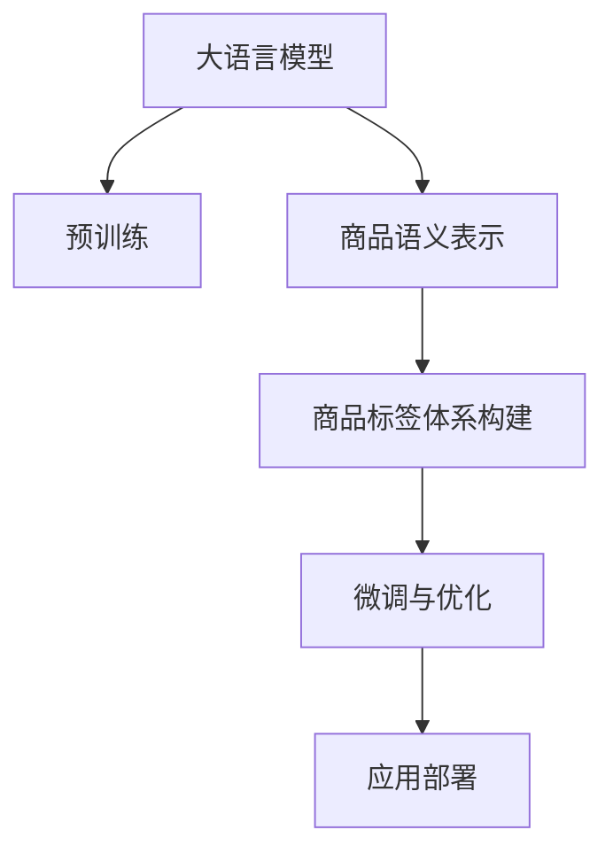

                 

# 大模型在商品标签体系构建中的应用

> 关键词：大模型, 商品标签体系, 商品分类, 语义表示, 无监督学习, 应用部署

## 1. 背景介绍

### 1.1 问题由来
商品标签体系是电商平台中用于描述商品属性和分类的基础架构。一个结构合理、语义清晰的商品标签体系，不仅能提升商品搜索和推荐的准确性，还能辅助用户快速找到所需商品，提升购物体验。然而，构建一个全面的商品标签体系是一个复杂且耗时的任务，尤其是对于跨品类、多规格的商品而言，更是难以通过手工构建标签体系完成。

当前，构建商品标签体系的方法大多依赖于人工标注和专家经验，但这种方法不仅成本高、耗时久，而且容易受到标注人员主观偏见的影响。特别是在大规模电商平台中，商品种类繁多，构建全量的商品标签体系几乎是不可能的。

近年来，随着大语言模型在自然语言处理（NLP）领域的突破性进展，利用预训练语言模型（LMP）自动构建商品标签体系成为了可能。通过在大规模无标签商品文本数据上预训练LMP，获取商品的语义表示，再利用这些语义表示构建商品标签体系，不仅能够大大降低构建成本，还能提升标签体系的全面性和准确性。

### 1.2 问题核心关键点
本文聚焦于如何利用大语言模型自动构建商品标签体系，以及如何在大模型基础上进行微调，以满足电商平台的特定需求。具体核心关键点包括：

- **大语言模型的选择与应用**：选择合适的预训练语言模型，并将其应用于商品标签体系构建。
- **商品语义表示的获取**：利用LMP获取商品的语义表示，并进行必要的特征提取和降维处理。
- **商品标签体系的构建**：根据商品语义表示，自动构建商品标签体系，并进行分类和聚类处理。
- **标签体系的微调与优化**：利用标注数据对标签体系进行微调，进一步提升标签体系的质量和实用性。
- **标签体系的应用部署**：将构建好的商品标签体系应用到电商平台的商品搜索和推荐系统中，提升用户体验和平台运营效率。

### 1.3 问题研究意义
利用大语言模型自动构建商品标签体系，对于电商平台来说，具有重要意义：

- **成本节约**：自动构建商品标签体系可以大幅减少人工标注的成本和时间投入，提升构建效率。
- **数据驱动**：基于大模型的商品标签体系能够从大量无标签数据中学习到商品的语义信息，提升标签体系的全面性和准确性。
- **实时更新**：自动构建的商品标签体系能够随着数据的变化而动态更新，保持标签体系的实时性和实用性。
- **用户需求响应**：通过商品标签体系，电商平台能够更准确地理解用户需求，提供个性化推荐，提升用户体验。

## 2. 核心概念与联系

### 2.1 核心概念概述

为更好地理解大语言模型在商品标签体系构建中的应用，本节将介绍几个密切相关的核心概念：

- **大语言模型(Large Language Model, LLM)**：以自回归(如GPT)或自编码(如BERT)模型为代表的大规模预训练语言模型。通过在大规模无标签文本语料上进行预训练，学习通用的语言知识和表示。

- **预训练(Pre-training)**：指在大规模无标签文本语料上，通过自监督学习任务训练通用语言模型的过程。常见的预训练任务包括言语建模、遮挡语言模型等。预训练使得模型学习到语言的通用表示。

- **语义表示(Semantic Representation)**：指利用语言模型将文本转化为向量表示，捕捉文本的语义信息。语义表示可以用于多种自然语言处理任务，包括文本分类、命名实体识别、信息检索等。

- **无监督学习(Unsupervised Learning)**：指在没有标签数据的情况下，通过数据本身的统计规律学习模型的过程。无监督学习在大模型预训练和标签体系构建中发挥重要作用。

- **商品标签体系(Merchandise Tagging System)**：指电商平台中用于描述商品属性和分类的标签集合。良好的商品标签体系能够提升商品搜索和推荐的准确性，辅助用户快速找到所需商品。

这些核心概念之间的逻辑关系可以通过以下Mermaid流程图来展示：



这个流程图展示了大语言模型在商品标签体系构建中的核心概念及其之间的关系：

1. 大语言模型通过预训练获得基础能力。
2. 利用大语言模型获取商品的语义表示。
3. 根据商品语义表示，自动构建商品标签体系。
4. 对商品标签体系进行微调，提升其质量和实用性。
5. 将构建好的商品标签体系应用到电商平台中，提升商品搜索和推荐效果。

## 3. 核心算法原理 & 具体操作步骤
### 3.1 算法原理概述

基于大语言模型的商品标签体系构建，本质上是一个从文本到标签的无监督学习过程。其核心思想是：利用大语言模型对商品文本进行语义表示，再通过聚类和分类等方法，自动构建商品标签体系。

具体来说，假设商品文本集合为 $X=\{x_1,x_2,...,x_N\}$，其中 $x_i$ 表示第 $i$ 个商品的文本描述。设预训练语言模型为 $M_{\theta}$，其中 $\theta$ 为预训练得到的模型参数。商品语义表示的计算公式为：

$$
\mathbf{E} = M_{\theta}(X)
$$

其中 $\mathbf{E}$ 为商品语义表示矩阵。接下来，通过聚类和分类等方法，将商品语义表示矩阵 $\mathbf{E}$ 映射到标签集合 $Y$ 上，得到商品标签体系。

### 3.2 算法步骤详解

基于大语言模型的商品标签体系构建，一般包括以下几个关键步骤：

**Step 1: 准备预训练模型和数据集**
- 选择合适的预训练语言模型 $M_{\theta}$ 作为初始化参数，如 BERT、GPT 等。
- 收集电商平台上的商品文本数据 $X=\{x_1,x_2,...,x_N\}$，进行数据清洗和标准化处理。

**Step 2: 计算商品语义表示**
- 利用预训练语言模型 $M_{\theta}$ 计算商品文本的语义表示 $\mathbf{E}$。
- 使用特征提取和降维技术，如主成分分析(PCA)、t-SNE等，对商品语义表示矩阵 $\mathbf{E}$ 进行预处理，得到更易于聚类的向量。

**Step 3: 构建商品标签体系**
- 利用聚类算法，如K-means、DBSCAN等，对预处理后的商品语义表示进行聚类，得到多个标签簇。
- 利用分类算法，如SVM、KNN等，对商品语义表示进行分类，得到具体的商品标签。

**Step 4: 微调商品标签体系**
- 收集电商平台上已标注的商品标签数据 $Y=\{y_1,y_2,...,y_M\}$，对商品标签体系进行微调。
- 利用标注数据，训练一个分类器，使得商品标签体系能够更准确地预测商品的实际标签。

**Step 5: 应用部署**
- 将微调后的商品标签体系应用到电商平台的商品搜索和推荐系统中，提升搜索和推荐的准确性。
- 持续收集新数据，定期重新构建和微调商品标签体系，以适应商品类型和需求的变化。

以上是基于大语言模型的商品标签体系构建的一般流程。在实际应用中，还需要针对具体平台的特点，对微调过程的各个环节进行优化设计，如改进特征提取方法、选择更合适的聚类和分类算法、调整超参数等，以进一步提升商品标签体系的性能。

### 3.3 算法优缺点

基于大语言模型的商品标签体系构建方法具有以下优点：

1. **自动构建**：通过预训练语言模型自动获取商品语义表示，减少了人工标注的投入和成本。
2. **语义全面**：大语言模型能够学习到丰富的语言知识，构建的商品标签体系语义全面，覆盖多种商品属性。
3. **动态更新**：商品标签体系能够随着数据的增加和变化而动态更新，保持实时性和实用性。
4. **提升搜索推荐**：商品标签体系提升了商品搜索和推荐的准确性，有助于提高用户体验和平台运营效率。

同时，该方法也存在一定的局限性：

1. **预训练数据质量要求高**：大语言模型对预训练数据的质量要求较高，数据噪音和偏差会影响标签体系的准确性。
2. **聚类和分类算法依赖**：商品标签体系的构建依赖于聚类和分类算法的选择和调参，算法选择不当可能影响标签体系的性能。
3. **微调效果受标注数据限制**：微调过程依赖于已标注的数据，标注数据不足可能导致微调效果不理想。
4. **计算资源消耗大**：预训练和微调过程对计算资源要求较高，特别是在构建大规模商品标签体系时，计算成本较高。

尽管存在这些局限性，但基于大语言模型的商品标签体系构建方法在电商平台中的应用前景广阔，未来将持续得到优化和提升。

### 3.4 算法应用领域

基于大语言模型的商品标签体系构建方法，在电商平台中具有广泛的应用场景，例如：

- **商品搜索**：利用商品标签体系提升商品搜索的准确性，帮助用户快速找到所需商品。
- **商品推荐**：通过商品标签体系对商品进行分类和聚类，生成个性化的推荐结果，提升推荐效果。
- **市场分析**：利用商品标签体系对商品进行市场分类，分析市场趋势和热点，辅助决策。
- **品牌管理**：通过商品标签体系对品牌商品进行分类和管理，提升品牌形象和用户信任。
- **库存管理**：利用商品标签体系对库存商品进行分类和监控，优化库存管理和物流调度。

除了上述这些经典应用外，商品标签体系还可以创新性地应用到更多场景中，如产品召回、售后客服、营销分析等，为电商平台带来更高效、更精准的运营支持。

## 4. 数学模型和公式 & 详细讲解  
### 4.1 数学模型构建

本节将使用数学语言对基于大语言模型的商品标签体系构建过程进行更加严格的刻画。

设商品文本集合为 $X=\{x_1,x_2,...,x_N\}$，其中 $x_i \in \mathcal{X}$，$\mathcal{X}$ 为商品文本的向量空间。设预训练语言模型为 $M_{\theta}$，其中 $\theta$ 为预训练得到的模型参数。商品语义表示的计算公式为：

$$
\mathbf{E} = M_{\theta}(X)
$$

其中 $\mathbf{E} \in \mathbb{R}^{N \times d}$，$d$ 为模型输出向量的维度。

接下来，利用聚类算法 $K$-means，将商品语义表示矩阵 $\mathbf{E}$ 聚类到 $K$ 个标签簇中，每个簇对应一个商品标签。聚类过程可以表示为：

$$
Y = K-means(\mathbf{E})
$$

其中 $Y$ 为商品标签集合，$K$ 为聚类簇的数量。

### 4.2 公式推导过程

以下我们以K-means聚类算法为例，推导商品标签体系构建的数学过程。

假设商品语义表示矩阵 $\mathbf{E}$ 中，第 $i$ 个商品的语义表示为 $\mathbf{e}_i \in \mathbb{R}^{d}$，$K$-means算法的目标是最小化样本到簇中心的距离平方和，即：

$$
\min_{\mathbf{C}, \mathbf{A}} \sum_{i=1}^N \sum_{k=1}^K (\mathbf{e}_i - \mathbf{a}_k)^2
$$

其中 $\mathbf{C} = \{\mathbf{c}_1, \mathbf{c}_2,..., \mathbf{c}_K\}$ 为簇中心，$\mathbf{A} = \{\mathbf{a}_k\}_{k=1}^K$ 为样本到簇中心的距离，$\mathbf{a}_k$ 表示第 $k$ 个簇的中心向量。

K-means算法通过迭代更新簇中心和样本到簇中心的距离，最小化上述目标函数。具体步骤如下：

1. 随机初始化簇中心 $\mathbf{C}_0$。
2. 对于每个样本 $\mathbf{e}_i$，计算其到簇中心的距离 $\mathbf{a}_k$。
3. 将样本 $\mathbf{e}_i$ 分配到最近的簇中心 $\mathbf{c}_k$。
4. 重新计算每个簇的中心 $\mathbf{c}_k$。
5. 重复步骤2-4，直到收敛或达到预设的迭代次数。

最终得到的商品标签体系 $Y$，即为商品文本的聚类结果。

### 4.3 案例分析与讲解

假设电商平台有 1000 种商品，分别为手机、电脑、鞋服、食品等。从电商平台上随机抽取 1000 个商品的文本描述，利用BERT模型计算其语义表示，得到商品语义表示矩阵 $\mathbf{E}$。

采用 K-means 算法对 $\mathbf{E}$ 进行聚类，得到 5 个商品标签簇。每个簇对应一个商品标签，例如：

- 簇 1：手机、平板电脑、手机配件等
- 簇 2：电脑、笔记本电脑、台式电脑等
- 簇 3：鞋服、运动鞋、服装等
- 簇 4：食品、零食、饮料等
- 簇 5：家居用品、装饰品、家电等

这样，通过自动构建商品标签体系，电商平台可以快速检索和推荐商品，提升用户体验。

## 5. 项目实践：代码实例和详细解释说明
### 5.1 开发环境搭建

在进行商品标签体系构建实践前，我们需要准备好开发环境。以下是使用Python进行PyTorch开发的环境配置流程：

1. 安装Anaconda：从官网下载并安装Anaconda，用于创建独立的Python环境。

2. 创建并激活虚拟环境：
```bash
conda create -n pytorch-env python=3.8 
conda activate pytorch-env
```

3. 安装PyTorch：根据CUDA版本，从官网获取对应的安装命令。例如：
```bash
conda install pytorch torchvision torchaudio cudatoolkit=11.1 -c pytorch -c conda-forge
```

4. 安装Transformers库：
```bash
pip install transformers
```

5. 安装各类工具包：
```bash
pip install numpy pandas scikit-learn matplotlib tqdm jupyter notebook ipython
```

完成上述步骤后，即可在`pytorch-env`环境中开始商品标签体系构建实践。

### 5.2 源代码详细实现

下面以使用BERT模型构建商品标签体系为例，给出完整的代码实现：

```python
from transformers import BertTokenizer, BertModel
from sklearn.cluster import KMeans
import numpy as np
import pandas as pd
from sklearn.metrics import adjusted_rand_score

# 准备数据
tokenizer = BertTokenizer.from_pretrained('bert-base-cased')
data = pd.read_csv('products.csv')  # 从电商平台上抽取商品文本数据

# 分批次处理文本数据
max_len = 128
sentences = []
for _, row in data.iterrows():
    text = row['product_description']
    tokenized = tokenizer.encode_plus(text, max_length=max_len, truncation=True, padding='max_length', return_tensors='pt')
    sentences.append(tokenized['input_ids'].numpy())

# 构建商品语义表示
model = BertModel.from_pretrained('bert-base-cased')
with torch.no_grad():
    encoded = model(torch.tensor(sentences))

# 计算商品语义表示矩阵
E = np.concatenate([row.numpy() for row in encoded])

# 聚类商品语义表示
K = 5  # 设定聚类簇的数量
kmeans = KMeans(n_clusters=K, random_state=0).fit(E)

# 生成商品标签体系
labels = pd.Series(kmeans.labels_, index=data['product_id'])
labels.to_csv('tagging_labels.csv')
```

这段代码实现了从电商平台上抽取商品文本数据，利用BERT模型计算其语义表示，并通过K-means算法聚类构建商品标签体系的过程。具体步骤如下：

1. 准备数据：从电商平台上读取商品文本数据，并进行数据清洗和标准化处理。
2. 分批次处理文本数据：将文本数据分批次输入BERT模型，计算其语义表示。
3. 计算商品语义表示矩阵：将BERT模型输出的向量拼接成矩阵，得到商品语义表示矩阵。
4. 聚类商品语义表示：利用K-means算法对商品语义表示进行聚类，得到多个商品标签簇。
5. 生成商品标签体系：将聚类结果保存为CSV文件，作为商品标签体系。

### 5.3 代码解读与分析

让我们再详细解读一下关键代码的实现细节：

**BERT模型和分批次处理**：
- 使用Transformers库的BertTokenizer进行文本分词和编码，得到token ids。
- 利用PyTorch的BertModel计算token ids的语义表示，得到模型的输出向量。
- 将输出向量拼接成矩阵，得到商品语义表示矩阵。

**K-means聚类**：
- 利用Scikit-learn库的KMeans算法对商品语义表示进行聚类，得到商品标签体系。
- 设定聚类簇的数量为5，通过调整簇的数量和初始化方法，可以进一步优化聚类结果。

**商品标签体系的保存**：
- 将聚类结果保存为CSV文件，方便后续的模型训练和推理。
- 可以将聚类结果作为标注数据，用于商品标签体系的微调。

可以看到，利用PyTorch和Scikit-learn，商品标签体系构建的代码实现变得简洁高效。开发者可以将更多精力放在数据处理、模型改进等高层逻辑上，而不必过多关注底层的实现细节。

当然，工业级的系统实现还需考虑更多因素，如数据增强、超参数调优、模型保存和部署等。但核心的商品标签体系构建流程基本与此类似。

## 6. 实际应用场景
### 6.1 智能推荐系统

商品标签体系在智能推荐系统中发挥着重要作用。通过商品标签体系，推荐系统可以更好地理解用户需求，生成个性化的推荐结果，提升用户体验和平台运营效率。

具体来说，推荐系统可以通过商品标签体系对商品进行分类和聚类，生成个性化的推荐结果。例如，对于喜欢购买手机和电脑的用户，推荐系统可以生成手机和电脑的推荐结果。对于喜欢购买鞋服和食品的用户，推荐系统可以生成鞋服和食品的推荐结果。

### 6.2 用户画像构建

商品标签体系能够帮助电商平台构建用户画像，了解用户兴趣和偏好，从而提供更加精准和个性化的服务。

通过商品标签体系，电商平台可以统计用户对不同类别的商品的购买和浏览行为，生成用户画像。例如，对于喜欢购买鞋服的用户，可以生成“时尚”、“个性化”、“休闲”等标签；对于喜欢购买食品的用户，可以生成“健康”、“美味”、“营养”等标签。这样，电商平台可以更好地了解用户需求，提供更加精准的服务。

### 6.3 商品搜索优化

商品标签体系能够提升商品搜索的准确性，帮助用户快速找到所需商品。

利用商品标签体系，电商平台可以构建更全面和精准的商品搜索索引，提升商品搜索的准确性和召回率。例如，用户输入“手机”作为搜索关键词，推荐系统可以根据商品标签体系生成“手机配件”、“平板电脑”、“手机壳”等搜索结果，提升用户体验。

### 6.4 未来应用展望

随着大语言模型和商品标签体系构建技术的不断发展，未来的应用场景将更加丰富和多样。

在智慧零售领域，商品标签体系和推荐系统将深度融合，构建更加智能和个性化的零售场景。通过分析用户的购买行为和反馈，推荐系统可以动态调整商品标签体系，提升推荐效果和用户体验。

在智能物流领域，商品标签体系和库存管理系统将深度融合，提升库存管理和物流调度的效率和准确性。通过分析商品标签体系和库存数据，系统可以预测商品需求，优化库存配置和物流路线，减少库存成本和配送时间。

在智能营销领域，商品标签体系和营销策略将深度融合，提升营销效果和广告精准度。通过分析商品标签体系和用户画像，营销系统可以生成更加精准的营销广告，提升广告点击率和转化率。

除此之外，商品标签体系还可以应用于更多场景中，如品牌管理、市场分析、售后服务等，为电商平台带来更高效、更精准的运营支持。

## 7. 工具和资源推荐
### 7.1 学习资源推荐

为了帮助开发者系统掌握大语言模型在商品标签体系构建中的应用，这里推荐一些优质的学习资源：

1. 《Transformer from Pretraining to Deployment》系列博文：由大模型技术专家撰写，深入浅出地介绍了Transformer原理、BERT模型、商品标签体系构建等前沿话题。

2. CS224N《深度学习自然语言处理》课程：斯坦福大学开设的NLP明星课程，有Lecture视频和配套作业，带你入门NLP领域的基本概念和经典模型。

3. 《Natural Language Processing with Transformers》书籍：Transformers库的作者所著，全面介绍了如何使用Transformers库进行NLP任务开发，包括商品标签体系构建在内的诸多范式。

4. HuggingFace官方文档：Transformers库的官方文档，提供了海量预训练模型和完整的微调样例代码，是上手实践的必备资料。

5. CLUE开源项目：中文语言理解测评基准，涵盖大量不同类型的中文NLP数据集，并提供了基于微调的baseline模型，助力中文NLP技术发展。

通过对这些资源的学习实践，相信你一定能够快速掌握大语言模型在商品标签体系构建中的应用，并用于解决实际的NLP问题。
###  7.2 开发工具推荐

高效的开发离不开优秀的工具支持。以下是几款用于大语言模型商品标签体系构建开发的常用工具：

1. PyTorch：基于Python的开源深度学习框架，灵活动态的计算图，适合快速迭代研究。大部分预训练语言模型都有PyTorch版本的实现。

2. TensorFlow：由Google主导开发的开源深度学习框架，生产部署方便，适合大规模工程应用。同样有丰富的预训练语言模型资源。

3. Transformers库：HuggingFace开发的NLP工具库，集成了众多SOTA语言模型，支持PyTorch和TensorFlow，是进行商品标签体系构建开发的利器。

4. Weights & Biases：模型训练的实验跟踪工具，可以记录和可视化模型训练过程中的各项指标，方便对比和调优。与主流深度学习框架无缝集成。

5. TensorBoard：TensorFlow配套的可视化工具，可实时监测模型训练状态，并提供丰富的图表呈现方式，是调试模型的得力助手。

6. Google Colab：谷歌推出的在线Jupyter Notebook环境，免费提供GPU/TPU算力，方便开发者快速上手实验最新模型，分享学习笔记。

合理利用这些工具，可以显著提升商品标签体系构建的开发效率，加快创新迭代的步伐。

### 7.3 相关论文推荐

大语言模型和商品标签体系构建技术的发展源于学界的持续研究。以下是几篇奠基性的相关论文，推荐阅读：

1. Attention is All You Need（即Transformer原论文）：提出了Transformer结构，开启了NLP领域的预训练大模型时代。

2. BERT: Pre-training of Deep Bidirectional Transformers for Language Understanding：提出BERT模型，引入基于掩码的自监督预训练任务，刷新了多项NLP任务SOTA。

3. Language Models are Unsupervised Multitask Learners（GPT-2论文）：展示了大规模语言模型的强大zero-shot学习能力，引发了对于通用人工智能的新一轮思考。

4. Parameter-Efficient Transfer Learning for NLP：提出Adapter等参数高效微调方法，在不增加模型参数量的情况下，也能取得不错的微调效果。

5. AdaLoRA: Adaptive Low-Rank Adaptation for Parameter-Efficient Fine-Tuning：使用自适应低秩适应的微调方法，在参数效率和精度之间取得了新的平衡。

这些论文代表了大语言模型商品标签体系构建技术的发展脉络。通过学习这些前沿成果，可以帮助研究者把握学科前进方向，激发更多的创新灵感。

## 8. 总结：未来发展趋势与挑战

### 8.1 总结

本文对基于大语言模型的商品标签体系构建方法进行了全面系统的介绍。首先阐述了商品标签体系构建的背景和意义，明确了大语言模型在构建商品标签体系中的独特价值。其次，从原理到实践，详细讲解了商品标签体系的构建流程，给出了完整的代码实现。同时，本文还广泛探讨了商品标签体系在电商平台中的实际应用场景，展示了其广泛的应用前景。

通过本文的系统梳理，可以看到，利用大语言模型自动构建商品标签体系，能够大幅减少人工标注的投入，提升商品标签体系的全面性和准确性，为电商平台带来更高的运营效率和用户体验。

### 8.2 未来发展趋势

展望未来，商品标签体系构建技术将呈现以下几个发展趋势：

1. **大规模语料预训练**：随着大语言模型的不断进步，预训练语料规模将不断扩大，商品标签体系将更加全面和准确。
2. **模型参数高效**：未来将出现更多参数高效的微调方法，如Prefix-Tuning、LoRA等，在固定大部分预训练参数的同时，只更新极少量的任务相关参数。
3. **多模态数据融合**：商品标签体系将不再局限于文本数据，而是融合视觉、语音等多模态数据，提升系统的全面性和智能化水平。
4. **实时动态更新**：商品标签体系将随着数据的增加和变化而动态更新，保持实时性和实用性。
5. **跨平台协同**：商品标签体系将与其他AI技术深度融合，如知识图谱、因果推理、强化学习等，形成更加全面和智能的商品管理系统。
6. **用户可控性提升**：商品标签体系将更加注重用户隐私和可控性，提供更加安全、透明的商品分类和推荐服务。

这些趋势凸显了商品标签体系构建技术的广阔前景。这些方向的探索发展，必将进一步提升商品标签体系的性能和实用性，为电商平台带来更高的运营效率和用户体验。

### 8.3 面临的挑战

尽管大语言模型商品标签体系构建技术已经取得了重要进展，但在迈向更加智能化、普适化应用的过程中，仍面临诸多挑战：

1. **数据噪音和偏差**：商品文本数据可能包含噪音和偏见，影响商品标签体系的准确性。如何过滤和清洗数据，提高数据质量，仍然是一个重要挑战。
2. **聚类和分类算法选择**：商品标签体系的构建依赖于聚类和分类算法的选择和调参，算法选择不当可能影响标签体系的性能。如何优化算法选择，提高聚类和分类的效果，仍需深入研究。
3. **计算资源消耗**：预训练和微调过程对计算资源要求较高，特别是在构建大规模商品标签体系时，计算成本较高。如何优化计算资源消耗，降低成本，仍需进一步探索。
4. **跨领域适应性**：商品标签体系在不同领域和场景下的适应性不足，仍需进行大量的领域适应和场景优化。如何构建通用的商品标签体系，提高其跨领域适应性，仍需深入研究。
5. **隐私和安全**：商品标签体系的构建和应用涉及用户隐私和安全问题，如何保护用户隐私，确保数据安全，仍需进一步探索。

尽管存在这些挑战，但基于大语言模型的商品标签体系构建方法在电商平台中的应用前景广阔，未来将持续得到优化和提升。

### 8.4 研究展望

面对大语言模型商品标签体系构建所面临的种种挑战，未来的研究需要在以下几个方面寻求新的突破：

1. **无监督学习改进**：探索无监督学习在商品标签体系构建中的新方法，摆脱对标注数据的依赖，利用非结构化数据学习商品语义表示。
2. **模型结构优化**：开发更加参数高效的微调方法，在固定大部分预训练参数的同时，只更新极少量的任务相关参数，提升微调效率和效果。
3. **多模态数据融合**：融合视觉、语音等多模态数据，提升商品标签体系的全面性和智能化水平，构建更加智能的商品管理系统。
4. **跨领域适应性提升**：研究如何构建通用的商品标签体系，提高其跨领域适应性，提升在不同领域和场景下的应用效果。
5. **隐私和安全保护**：研究如何保护用户隐私，确保数据安全，构建更加安全、透明的商品标签体系。

这些研究方向的探索，必将引领商品标签体系构建技术迈向更高的台阶，为电商平台带来更高的运营效率和用户体验。面向未来，商品标签体系构建技术还需要与其他AI技术进行更深入的融合，如知识图谱、因果推理、强化学习等，多路径协同发力，共同推动商品标签体系的创新和优化。只有勇于创新、敢于突破，才能不断拓展商品标签体系的应用边界，提升电商平台的智能化水平。

## 9. 附录：常见问题与解答

**Q1：如何选择合适的预训练语言模型？**

A: 选择合适的预训练语言模型需要考虑以下几个方面：
1. 模型规模：大模型具有更强的语言理解和生成能力，适合构建更全面和准确的商品标签体系。
2. 预训练任务：预训练任务是否涵盖商品文本的相关领域，如产品描述、用户评论等。
3. 模型参数量：大模型的参数量较大，需要足够的计算资源进行预训练和微调。

**Q2：商品标签体系构建过程中，如何处理数据噪音和偏差？**

A: 处理数据噪音和偏差可以通过以下方法：
1. 数据清洗：去除噪声和无用信息，确保数据的干净和完整。
2. 数据增强：利用数据增强技术，如近义替换、回译等，丰富数据多样性，提升数据质量。
3. 数据融合：融合多源数据，提高数据质量和准确性。
4. 特征选择：选择与商品标签体系相关的特征，避免不相关特征的干扰。

**Q3：商品标签体系构建过程中，如何选择聚类和分类算法？**

A: 选择聚类和分类算法需要考虑以下几个方面：
1. 算法性能：评估算法在商品语义表示聚类和分类的准确性和效率。
2. 数据特性：根据商品语义表示的特性，选择适合的聚类和分类算法。
3. 超参数调优：通过交叉验证等方法，调整算法参数，优化聚类和分类效果。

**Q4：商品标签体系构建过程中，如何优化计算资源消耗？**

A: 优化计算资源消耗可以通过以下方法：
1. 参数裁剪：裁剪不必要的模型参数，减小模型大小，降低计算资源消耗。
2. 模型压缩：采用模型压缩技术，如量化、剪枝等，减少模型内存和计算资源消耗。
3. 并行计算：利用多核或分布式计算，加速模型训练和推理过程，提高计算效率。

**Q5：商品标签体系构建过程中，如何保护用户隐私和数据安全？**

A: 保护用户隐私和数据安全可以通过以下方法：
1. 数据脱敏：对用户数据进行脱敏处理，保护用户隐私。
2. 访问控制：对用户数据访问进行严格控制，确保数据安全。
3. 加密传输：采用加密技术，保护数据在传输过程中的安全。
4. 审计日志：记录用户数据访问日志，及时发现和处理安全问题。

这些方法可以帮助构建更加安全、可靠的商品标签体系，提升电商平台的用户体验和信任度。

---

作者：禅与计算机程序设计艺术 / Zen and the Art of Computer Programming

