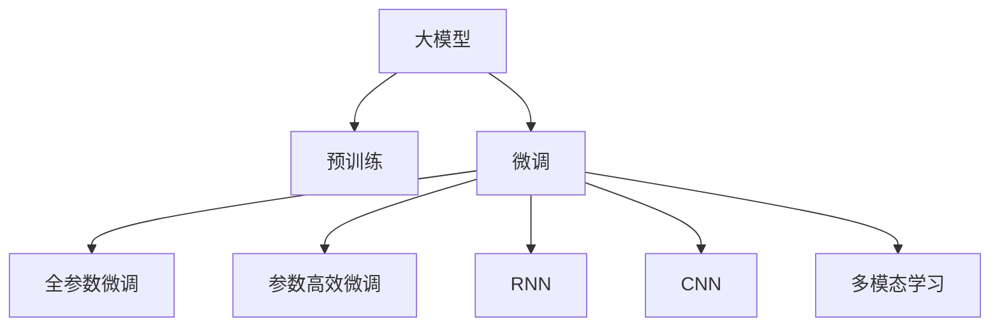

                 

# 大模型在商品趋势预测中的应用

## 1. 背景介绍

### 1.1 问题由来
随着电子商务平台的迅猛发展和消费者购物行为的多样化，企业越来越需要精准的商品趋势预测来优化库存、制定营销策略、提升用户体验。传统的统计方法和专家系统已无法满足日益复杂的数据分析需求，而基于深度学习的大模型则显示出其在趋势预测上的卓越能力。

### 1.2 问题核心关键点
商品趋势预测的核心在于如何高效利用海量的用户数据和历史交易数据，学习商品之间的关联关系和消费趋势。大模型因其庞大的参数规模和丰富的语言知识，可以在大规模无标签数据上进行预训练，然后在小样本标注数据上进行微调，从而精准预测商品的未来趋势。

### 1.3 问题研究意义
通过对商品趋势的精准预测，企业能够更好地控制库存水平，避免积压或缺货，同时也能更有效地制定营销策略，提高销售效率。此外，精确的趋势预测还能提升用户体验，通过推荐更符合用户需求的商品，增加用户粘性和满意度。

## 2. 核心概念与联系

### 2.1 核心概念概述

为更好地理解大模型在商品趋势预测中的应用，本节将介绍几个关键概念：

- 大模型(Large Model)：指具有海量参数的深度学习模型，如BERT、GPT等。通过在大规模无标签数据上进行预训练，学习通用的语言表示，具备强大的预测能力。

- 预训练(Pre-training)：指在大规模无标签数据上，通过自监督学习任务训练通用语言模型的过程。预训练使得模型学习到语言的通用表示，适用于多种下游任务。

- 微调(Fine-tuning)：指在预训练模型的基础上，使用下游任务的少量标注数据，通过有监督学习优化模型在特定任务上的性能。在商品趋势预测中，微调有助于模型学习具体的商品和趋势特征。

- 迁移学习(Transfer Learning)：指将一个领域学习到的知识，迁移应用到另一个不同但相关的领域的学习范式。大模型的预训练-微调过程即是一种典型的迁移学习方式。

- 循环神经网络(RNN)：适合处理序列数据的深度学习模型，如LSTM、GRU等。RNN可以捕捉商品时间序列数据的动态变化。

- 卷积神经网络(CNN)：擅长处理图像数据，但也可以应用于商品描述文本的特征提取。

- 多模态学习(Multi-modal Learning)：融合不同类型的数据（如文本、图像、时间序列等）进行联合训练，提升预测的准确性。

这些核心概念之间的逻辑关系可以通过以下Mermaid流程图来展示：



这个流程图展示了大模型在商品趋势预测中的核心概念及其之间的关系：

1. 大模型通过预训练获得基础能力。
2. 微调是对预训练模型进行任务特定的优化，通过学习具体的商品和趋势特征。
3. RNN、CNN等模型用于处理不同类型的数据，提升特征提取的准确性。
4. 多模态学习融合不同类型数据，提升预测的全面性和准确性。

## 3. 核心算法原理 & 具体操作步骤

### 3.1 算法原理概述

大模型在商品趋势预测中的应用，主要是通过微调过程实现的。其核心思想是：将大模型视作一个强大的预测器，通过在商品交易数据上进行有监督的微调，学习商品之间的关联关系和消费趋势。

形式化地，假设大模型为 $M_{\theta}$，其中 $\theta$ 为预训练得到的模型参数。给定商品趋势预测任务 $T$ 的标注数据集 $D=\{(x_i, y_i)\}_{i=1}^N$，其中 $x_i$ 为商品的历史交易数据和特征，$y_i$ 为商品的未来趋势（如销量、价格等）。微调的目标是找到新的模型参数 $\hat{\theta}$，使得模型预测的趋势与真实标签 $y_i$ 尽可能接近。

通过梯度下降等优化算法，微调过程不断更新模型参数 $\theta$，最小化损失函数 $\mathcal{L}$，使得模型预测的趋势逼近真实标签。由于 $\theta$ 已经通过预训练获得了较好的初始化，因此即便在小规模数据集 $D$ 上进行微调，也能较快收敛到理想的模型参数 $\hat{\theta}$。

### 3.2 算法步骤详解

基于大模型在商品趋势预测中的微调过程，可以划分为以下几个关键步骤：

**Step 1: 准备预训练模型和数据集**
- 选择合适的预训练模型，如BERT、GPT等，作为初始化参数。
- 准备商品交易数据集，划分为训练集、验证集和测试集。一般要求标注数据与预训练数据的分布不要差异过大。

**Step 2: 设计任务适配层**
- 根据商品趋势预测任务，设计合适的输出层和损失函数。例如，如果任务是销量预测，则通常使用回归问题，输出层为线性回归层，损失函数为均方误差。

**Step 3: 设置微调超参数**
- 选择合适的优化算法及其参数，如 AdamW、SGD 等，设置学习率、批大小、迭代轮数等。
- 设置正则化技术及强度，包括权重衰减、Dropout、Early Stopping等。
- 确定冻结预训练参数的策略，如仅微调顶层，或全部参数都参与微调。

**Step 4: 执行梯度训练**
- 将训练集数据分批次输入模型，前向传播计算损失函数。
- 反向传播计算参数梯度，根据设定的优化算法和学习率更新模型参数。
- 周期性在验证集上评估模型性能，根据性能指标决定是否触发 Early Stopping。
- 重复上述步骤直到满足预设的迭代轮数或 Early Stopping 条件。

**Step 5: 测试和部署**
- 在测试集上评估微调后模型 $M_{\hat{\theta}}$ 的性能，对比微调前后的精度提升。
- 使用微调后的模型对新商品进行趋势预测，集成到实际的应用系统中。
- 持续收集新的数据，定期重新微调模型，以适应数据分布的变化。

以上是基于大模型在商品趋势预测中的微调范式的一般流程。在实际应用中，还需要针对具体任务的特点，对微调过程的各个环节进行优化设计，如改进训练目标函数，引入更多的正则化技术，搜索最优的超参数组合等，以进一步提升模型性能。

### 3.3 算法优缺点

大模型在商品趋势预测中的应用具有以下优点：
1. 准确性高。大模型经过大规模预训练，拥有丰富的语言知识，在商品趋势预测中表现优异。
2. 泛化能力强。微调过程可以学习到具体的商品和趋势特征，使得模型具有较强的泛化能力，适应不同的商品和市场环境。
3. 可解释性好。大模型可以通过分析预测结果中的特征重要性，解释其决策过程，有助于优化模型和提升透明度。

同时，该方法也存在一些局限性：
1. 依赖标注数据。微调的效果很大程度上取决于标注数据的质量和数量，获取高质量标注数据的成本较高。
2. 模型复杂度高。大模型参数量庞大，对计算资源和存储空间有较高要求。
3. 解释性差。尽管大模型可以通过特征重要性分析提供一定的解释，但在处理复杂、非线性的预测任务时，仍存在解释性不足的问题。

尽管存在这些局限性，但大模型在商品趋势预测中的应用前景依然广阔，尤其是在数据质量和标注成本相对较高的场景中。未来，相关研究将致力于降低标注成本，提高模型泛化能力，提升模型可解释性，从而更好地应用于实际商品趋势预测中。

### 3.4 算法应用领域

大模型在商品趋势预测中的应用已经涉及多个领域，例如：

- 电商库存管理：通过预测商品未来销量，帮助电商平台优化库存水平，减少缺货或积压。
- 营销策略制定：预测商品趋势有助于制定更精准的营销策略，如折扣活动、广告投放等。
- 用户需求分析：分析用户对商品趋势的偏好，提升个性化推荐系统的准确性。
- 供应链管理：通过预测商品趋势，优化供应链管理，减少供需不匹配风险。

除了上述这些经典应用外，大模型在商品趋势预测中的应用还在不断拓展，如消费者行为分析、市场预测等，为商品市场的智能化运营提供了新的思路。

## 4. 数学模型和公式 & 详细讲解 & 举例说明

### 4.1 数学模型构建

假设我们有一个大模型 $M_{\theta}$，其中 $\theta$ 为预训练得到的模型参数。给定商品交易数据集 $D=\{(x_i, y_i)\}_{i=1}^N$，其中 $x_i$ 为商品的历史交易数据和特征，$y_i$ 为商品的未来趋势（如销量、价格等）。

定义模型 $M_{\theta}$ 在输入 $x_i$ 上的预测结果为 $\hat{y_i}=M_{\theta}(x_i)$，则均方误差损失函数为：

$$
\ell(M_{\theta}(x_i),y_i) = \frac{1}{N}\sum_{i=1}^N (y_i - \hat{y_i})^2
$$

微调的目标是最小化均方误差损失函数，即找到最优参数：

$$
\theta^* = \mathop{\arg\min}_{\theta} \mathcal{L}(\theta)
$$

其中 $\mathcal{L}$ 为均方误差损失函数，用于衡量模型预测与真实标签之间的差异。

### 4.2 公式推导过程

以下我们以销量预测任务为例，推导均方误差损失函数及其梯度的计算公式。

假设模型 $M_{\theta}$ 在输入 $x_i$ 上的输出为 $\hat{y_i}=M_{\theta}(x_i)$，表示模型预测的销量。真实标签 $y_i$ 为商品的实际销量。则均方误差损失函数为：

$$
\ell(M_{\theta}(x_i),y_i) = \frac{1}{N}\sum_{i=1}^N (y_i - \hat{y_i})^2
$$

将其代入均方误差损失函数公式，得：

$$
\mathcal{L}(\theta) = \frac{1}{N}\sum_{i=1}^N (y_i - \hat{y_i})^2
$$

根据链式法则，损失函数对参数 $\theta_k$ 的梯度为：

$$
\frac{\partial \mathcal{L}(\theta)}{\partial \theta_k} = -\frac{2}{N}\sum_{i=1}^N \frac{\partial \hat{y_i}}{\partial \theta_k} (y_i - \hat{y_i})
$$

其中 $\frac{\partial \hat{y_i}}{\partial \theta_k}$ 可进一步递归展开，利用自动微分技术完成计算。

在得到损失函数的梯度后，即可带入参数更新公式，完成模型的迭代优化。重复上述过程直至收敛，最终得到适应商品趋势预测任务的最优模型参数 $\theta^*$。

## 5. 项目实践：代码实例和详细解释说明

### 5.1 开发环境搭建

在进行商品趋势预测的大模型微调实践前，我们需要准备好开发环境。以下是使用Python进行PyTorch开发的环境配置流程：

1. 安装Anaconda：从官网下载并安装Anaconda，用于创建独立的Python环境。

2. 创建并激活虚拟环境：
```bash
conda create -n pytorch-env python=3.8 
conda activate pytorch-env
```

3. 安装PyTorch：根据CUDA版本，从官网获取对应的安装命令。例如：
```bash
conda install pytorch torchvision torchaudio cudatoolkit=11.1 -c pytorch -c conda-forge
```

4. 安装TensorFlow：
```bash
pip install tensorflow
```

5. 安装各类工具包：
```bash
pip install numpy pandas scikit-learn matplotlib tqdm jupyter notebook ipython
```

完成上述步骤后，即可在`pytorch-env`环境中开始微调实践。

### 5.2 源代码详细实现

下面我们以销量预测任务为例，给出使用Transformers库对BERT模型进行微调的PyTorch代码实现。

首先，定义销量预测任务的数据处理函数：

```python
from transformers import BertTokenizer
from torch.utils.data import Dataset
import torch

class SalesDataset(Dataset):
    def __init__(self, sales_data, tokenizer, max_len=128):
        self.sales_data = sales_data
        self.tokenizer = tokenizer
        self.max_len = max_len
        
    def __len__(self):
        return len(self.sales_data)
    
    def __getitem__(self, item):
        sales = self.sales_data[item]
        
        encoding = self.tokenizer(sales, return_tensors='pt', max_length=self.max_len, padding='max_length', truncation=True)
        input_ids = encoding['input_ids'][0]
        attention_mask = encoding['attention_mask'][0]
        
        # 将销量作为输出标签
        sales_value = sales['sales']
        return {'input_ids': input_ids, 
                'attention_mask': attention_mask,
                'sales': sales_value}

# 加载数据集
tokenizer = BertTokenizer.from_pretrained('bert-base-cased')

train_dataset = SalesDataset(train_sales_data, tokenizer)
dev_dataset = SalesDataset(dev_sales_data, tokenizer)
test_dataset = SalesDataset(test_sales_data, tokenizer)
```

然后，定义模型和优化器：

```python
from transformers import BertForRegression, AdamW

model = BertForRegression.from_pretrained('bert-base-cased')

optimizer = AdamW(model.parameters(), lr=2e-5)
```

接着，定义训练和评估函数：

```python
from torch.utils.data import DataLoader
from tqdm import tqdm
from sklearn.metrics import mean_squared_error

device = torch.device('cuda') if torch.cuda.is_available() else torch.device('cpu')
model.to(device)

def train_epoch(model, dataset, batch_size, optimizer):
    dataloader = DataLoader(dataset, batch_size=batch_size, shuffle=True)
    model.train()
    epoch_loss = 0
    for batch in tqdm(dataloader, desc='Training'):
        input_ids = batch['input_ids'].to(device)
        attention_mask = batch['attention_mask'].to(device)
        sales = batch['sales'].to(device)
        model.zero_grad()
        outputs = model(input_ids, attention_mask=attention_mask, labels=sales)
        loss = outputs.loss
        epoch_loss += loss.item()
        loss.backward()
        optimizer.step()
    return epoch_loss / len(dataloader)

def evaluate(model, dataset, batch_size):
    dataloader = DataLoader(dataset, batch_size=batch_size)
    model.eval()
    preds, labels = [], []
    with torch.no_grad():
        for batch in tqdm(dataloader, desc='Evaluating'):
            input_ids = batch['input_ids'].to(device)
            attention_mask = batch['attention_mask'].to(device)
            batch_sales = batch['sales']
            outputs = model(input_ids, attention_mask=attention_mask)
            batch_preds = outputs.predictions.argmax(dim=1).to('cpu').tolist()
            batch_sales = batch_sales.to('cpu').tolist()
            for pred_sales, real_sales in zip(batch_preds, batch_sales):
                preds.append(pred_sales)
                labels.append(real_sales)
                
    mse = mean_squared_error(labels, preds)
    return mse
```

最后，启动训练流程并在测试集上评估：

```python
epochs = 5
batch_size = 16

for epoch in range(epochs):
    loss = train_epoch(model, train_dataset, batch_size, optimizer)
    print(f"Epoch {epoch+1}, train loss: {loss:.3f}")
    
    print(f"Epoch {epoch+1}, dev mse:")
    mse = evaluate(model, dev_dataset, batch_size)
    print(f"mse: {mse:.3f}")
    
print("Test mse:")
mse = evaluate(model, test_dataset, batch_size)
print(f"mse: {mse:.3f}")
```

以上就是使用PyTorch对BERT进行销量预测任务微调的完整代码实现。可以看到，得益于Transformers库的强大封装，我们可以用相对简洁的代码完成BERT模型的加载和微调。

### 5.3 代码解读与分析

让我们再详细解读一下关键代码的实现细节：

**SalesDataset类**：
- `__init__`方法：初始化销售数据、分词器等关键组件。
- `__len__`方法：返回数据集的样本数量。
- `__getitem__`方法：对单个样本进行处理，将销售数据输入编码为token ids，同时将其作为模型输出标签。

**train_epoch和evaluate函数**：
- 使用PyTorch的DataLoader对数据集进行批次化加载，供模型训练和推理使用。
- 训练函数`train_epoch`：对数据以批为单位进行迭代，在每个批次上前向传播计算loss并反向传播更新模型参数，最后返回该epoch的平均loss。
- 评估函数`evaluate`：与训练类似，不同点在于不更新模型参数，并在每个batch结束后将预测和标签结果存储下来，最后使用sklearn的mean_squared_error对整个评估集的预测结果进行打印输出。

**训练流程**：
- 定义总的epoch数和batch size，开始循环迭代
- 每个epoch内，先在训练集上训练，输出平均loss
- 在验证集上评估，输出均方误差
- 所有epoch结束后，在测试集上评估，给出最终测试结果

可以看到，PyTorch配合Transformers库使得BERT微调的代码实现变得简洁高效。开发者可以将更多精力放在数据处理、模型改进等高层逻辑上，而不必过多关注底层的实现细节。

当然，工业级的系统实现还需考虑更多因素，如模型的保存和部署、超参数的自动搜索、更灵活的任务适配层等。但核心的微调范式基本与此类似。

## 6. 实际应用场景

### 6.1 电商库存管理

基于大模型微调的销量预测技术，可以广泛应用于电商平台的库存管理。传统的库存管理方式往往依赖历史销售数据和简单的统计模型，难以适应需求的不确定性和市场变化。而使用微调后的销量预测模型，可以实时预测商品销量，帮助电商平台动态调整库存水平，避免积压或缺货，提高供应链效率。

在技术实现上，可以收集电商平台的历史销售数据和特征数据，将其作为微调数据集，训练模型预测商品的未来销量。模型预测的销量可以作为库存调整的依据，动态控制库存量，避免过度或缺货情况的发生。

### 6.2 营销策略制定

商品销量预测不仅适用于库存管理，还可应用于营销策略的制定。通过精确预测商品未来的销量趋势，电商平台能够制定更精准的营销策略，如广告投放、促销活动等。预测销量下降的商品可以提前进行促销，而预测销量上升的商品则加大营销力度，从而提升整体销售业绩。

在具体应用中，可以将商品销量预测与用户行为分析结合，找到最具潜力的高销量商品，优先进行资源配置。同时，预测模型还能帮助分析营销策略的效果，持续优化广告和促销活动，提升ROI。

### 6.3 用户需求分析

用户对商品的需求往往受到多方面因素的影响，如季节变化、市场趋势、用户偏好等。通过销量预测模型，可以挖掘用户对不同商品的需求变化，分析其背后原因，从而更好地满足用户需求，提升用户体验。

在实际应用中，可以将销量预测模型与用户画像结合，分析用户对不同类别的商品需求变化，发现用户兴趣和行为模式。此外，预测模型还能帮助分析不同用户群体的需求差异，针对性地制定个性化推荐和营销策略。

### 6.4 未来应用展望

随着大模型和微调技术的不断发展，商品趋势预测的应用前景将更加广阔。未来，基于大模型的商品趋势预测技术将向着更加智能化、实时化的方向演进，为电商平台带来更多的商业价值。

在智慧供应链中，实时预测商品趋势能够帮助企业更好地应对市场变化，优化供应链管理，减少供需不匹配的风险。

在个性化推荐系统中，商品趋势预测可以与用户行为分析结合，动态调整推荐策略，提升推荐系统的准确性和用户体验。

此外，在更多垂直行业（如零售、制造、物流等）中，商品趋势预测也将得到广泛应用，为企业决策提供有力支持。相信未来随着技术进步和数据积累，商品趋势预测将成为一个重要的商业决策工具，推动企业智能化转型。

## 7. 工具和资源推荐

### 7.1 学习资源推荐

为了帮助开发者系统掌握大模型在商品趋势预测中的应用，这里推荐一些优质的学习资源：

1. 《深度学习实战》系列博文：由深度学习领域的知名专家撰写，深入浅出地介绍了深度学习技术在实际应用中的实践技巧，包括商品趋势预测等NLP任务的微调方法。

2. CS231n《深度学习课程》课程：斯坦福大学开设的深度学习课程，涵盖深度学习的基础知识和高级应用，适合深度学习初学者和从业者。

3. 《自然语言处理入门》书籍：全面介绍自然语言处理的基本概念和经典算法，并结合实际应用案例，帮助读者理解大模型在商品趋势预测中的应用。

4. PyTorch官方文档：PyTorch的官方文档，提供了丰富的深度学习模型和工具库，适合开发者学习和实践。

5. HuggingFace官方文档：HuggingFace的官方文档，提供了海量预训练模型和微调样例，是进行商品趋势预测任务开发的必备资源。

通过对这些资源的学习实践，相信你一定能够快速掌握大模型在商品趋势预测中的应用，并用于解决实际的电商问题。

### 7.2 开发工具推荐

高效的开发离不开优秀的工具支持。以下是几款用于商品趋势预测的大模型微调开发的常用工具：

1. PyTorch：基于Python的开源深度学习框架，灵活动态的计算图，适合快速迭代研究。

2. TensorFlow：由Google主导开发的开源深度学习框架，生产部署方便，适合大规模工程应用。

3. Transformers库：HuggingFace开发的NLP工具库，集成了众多SOTA语言模型，支持PyTorch和TensorFlow，是进行商品趋势预测任务微调的利器。

4. Weights & Biases：模型训练的实验跟踪工具，可以记录和可视化模型训练过程中的各项指标，方便对比和调优。

5. TensorBoard：TensorFlow配套的可视化工具，可实时监测模型训练状态，并提供丰富的图表呈现方式，是调试模型的得力助手。

6. Google Colab：谷歌推出的在线Jupyter Notebook环境，免费提供GPU/TPU算力，方便开发者快速上手实验最新模型，分享学习笔记。

合理利用这些工具，可以显著提升商品趋势预测任务的开发效率，加快创新迭代的步伐。

### 7.3 相关论文推荐

大模型在商品趋势预测中的应用研究正处于快速发展阶段，以下是几篇奠基性的相关论文，推荐阅读：

1. Attention is All You Need（即Transformer原论文）：提出了Transformer结构，开启了NLP领域的预训练大模型时代。

2. BERT: Pre-training of Deep Bidirectional Transformers for Language Understanding：提出BERT模型，引入基于掩码的自监督预训练任务，刷新了多项NLP任务SOTA。

3. Sales Prediction Using Deep Learning: A Review of Architectures, Challenges and Applications：全面综述了深度学习在销售预测中的应用，涵盖多种模型和优化技术。

4. Sales Forecasting with Long Short-Term Memory Networks：采用RNN结构预测销售趋势，取得了较好的预测效果。

5. Predicting Sales Using Deep Neural Networks: A Review and Case Study：对比了不同深度学习模型在销售预测中的应用，分析了各自的优缺点。

这些论文代表了大模型在商品趋势预测技术的发展脉络。通过学习这些前沿成果，可以帮助研究者把握学科前进方向，激发更多的创新灵感。

## 8. 总结：未来发展趋势与挑战

### 8.1 总结

本文对大模型在商品趋势预测中的应用进行了全面系统的介绍。首先阐述了商品趋势预测的背景和意义，明确了微调在精准预测商品趋势中的重要价值。其次，从原理到实践，详细讲解了大模型在商品趋势预测中的微调过程，给出了微调任务开发的完整代码实例。同时，本文还广泛探讨了大模型在电商库存管理、营销策略制定等多个领域的应用前景，展示了微调范式的强大能力。此外，本文还精选了微调技术的各类学习资源，力求为读者提供全方位的技术指引。

通过本文的系统梳理，可以看到，基于大模型的商品趋势预测技术正在成为电商领域的重要工具，极大地提升了库存管理和营销策略的智能化水平。未来，随着大模型的不断发展，商品趋势预测将迎来更多创新应用，为电商行业带来新的商业价值。

### 8.2 未来发展趋势

展望未来，大模型在商品趋势预测技术将呈现以下几个发展趋势：

1. 模型规模持续增大。随着算力成本的下降和数据规模的扩张，预训练语言模型的参数量还将持续增长。超大规模语言模型蕴含的丰富语言知识，有望支撑更加复杂多变的商品趋势预测任务。

2. 多模态学习兴起。商品趋势预测不仅是文本数据的处理，还需要融合图像、视频等多元数据。多模态学习能够提升模型对商品信息的全面理解，进一步提升预测的准确性。

3. 参数高效微调方法兴起。未来的微调方法将更加注重参数效率，通过优化模型结构，减少计算资源消耗，同时提升模型性能。

4. 实时预测成为可能。基于大模型的预测模型能够快速响应数据变化，实现实时化的商品趋势预测。这对于提高电商平台的灵活性和响应速度具有重要意义。

5. 跨领域迁移能力增强。未来的模型将具备更强的跨领域迁移能力，能够从不同领域的学习中汲取知识，提升在商品趋势预测任务中的表现。

以上趋势凸显了大模型在商品趋势预测中的广阔前景。这些方向的探索发展，必将进一步提升预测模型的性能和应用范围，为电商行业带来更大的商业价值。

### 8.3 面临的挑战

尽管大模型在商品趋势预测中已经取得了显著成就，但在迈向更加智能化、实时化的应用过程中，仍面临诸多挑战：

1. 标注成本瓶颈。尽管微调降低了标注需求，但对于某些特定商品，获取高质量标注数据的成本依然较高。如何进一步降低标注成本，提高数据利用效率，仍然是一个重要问题。

2. 数据质量问题。商品趋势预测依赖于大量历史交易数据，数据的完整性和质量直接影响到模型的预测效果。如何保证数据的准确性和代表性，需要企业在数据收集和处理上投入更多资源。

3. 模型泛化能力不足。商品趋势预测模型容易受到市场变化的影响，如何提升模型的泛化能力，减少对特定市场的依赖，也是一大挑战。

4. 实时预测的计算资源需求高。实时预测需要高性能计算资源，如何优化模型结构和算法，提升计算效率，是实际应用中的一大难点。

5. 模型可解释性不足。大模型的预测结果难以解释，企业难以信任模型的输出，如何提升模型的可解释性，增强用户信任，是一个亟待解决的问题。

6. 数据隐私和安全问题。电商数据涉及用户隐私和商业机密，如何保护数据安全，防止数据泄露，也是企业在应用大模型时必须考虑的重要因素。

这些挑战需要企业和研究机构共同应对，不断优化模型、改进算法、加强数据管理和保护，才能实现大模型在商品趋势预测中的长期可持续应用。

### 8.4 研究展望

面对商品趋势预测所面临的种种挑战，未来的研究需要在以下几个方面寻求新的突破：

1. 探索无监督和半监督微调方法。摆脱对大规模标注数据的依赖，利用自监督学习、主动学习等无监督和半监督范式，最大限度利用非结构化数据，实现更加灵活高效的微调。

2. 研究参数高效和计算高效的微调范式。开发更加参数高效的微调方法，在固定大部分预训练参数的同时，只更新极少量的任务相关参数。同时优化微调模型的计算图，减少前向传播和反向传播的资源消耗，实现更加轻量级、实时性的部署。

3. 融合因果和对比学习范式。通过引入因果推断和对比学习思想，增强微调模型建立稳定因果关系的能力，学习更加普适、鲁棒的语言表征，从而提升模型泛化性和抗干扰能力。

4. 引入更多先验知识。将符号化的先验知识，如知识图谱、逻辑规则等，与神经网络模型进行巧妙融合，引导微调过程学习更准确、合理的语言模型。

5. 结合因果分析和博弈论工具。将因果分析方法引入微调模型，识别出模型决策的关键特征，增强输出解释的因果性和逻辑性。借助博弈论工具刻画人机交互过程，主动探索并规避模型的脆弱点，提高系统稳定性。

6. 纳入伦理道德约束。在模型训练目标中引入伦理导向的评估指标，过滤和惩罚有偏见、有害的输出倾向。同时加强人工干预和审核，建立模型行为的监管机制，确保输出符合人类价值观和伦理道德。

这些研究方向的探索，必将引领大模型在商品趋势预测技术迈向更高的台阶，为电商行业带来新的商业价值。面向未来，大模型在商品趋势预测中的研究与应用将更加深入，带来更多的技术创新和商业机遇。

## 9. 附录：常见问题与解答

**Q1：商品趋势预测需要多少标注数据？**

A: 商品趋势预测对标注数据的需求因任务而异。一般来说，大模型的微调所需标注数据量相对较少，如几百万甚至数十万条商品销售数据即可。但对于某些特定商品或市场，标注数据的数量和质量对预测效果有较大影响，需根据具体情况进行标注。

**Q2：如何选择适当的微调模型？**

A: 选择合适的微调模型需要考虑商品特征、数据量、计算资源等因素。一般来说，BERT、GPT等预训练大模型在商品趋势预测中表现优异。对于特定领域或小数据集，也可以考虑使用针对特定任务训练的小规模模型。

**Q3：如何处理长序列数据？**

A: 大模型在处理长序列数据时，可以通过截断、拼接等方式进行处理。同时，可以引入RNN等序列模型，对长序列数据进行时间依赖性建模。

**Q4：如何提升模型泛化能力？**

A: 提升模型泛化能力需要增加数据多样性和数据量。可以通过引入更多来源、更多类型的数据，如用户评论、市场报告等，增强模型的泛化能力。此外，还可以引入正则化技术，如L2正则、Dropout等，防止过拟合。

**Q5：如何应对市场变化？**

A: 市场变化是商品趋势预测面临的一大挑战。可以通过定期更新数据集、引入动态模型等方式应对市场变化。例如，通过引入时间序列数据，训练动态预测模型，可以更好地捕捉市场变化趋势。

**Q6：如何保护数据隐私？**

A: 在电商领域，数据隐私保护尤为重要。可以采用数据脱敏、差分隐私等技术保护用户隐私。同时，企业也可以采用联邦学习、联合学习等分布式学习方法，在不共享原始数据的情况下，训练模型。

---

作者：禅与计算机程序设计艺术 / Zen and the Art of Computer Programming

