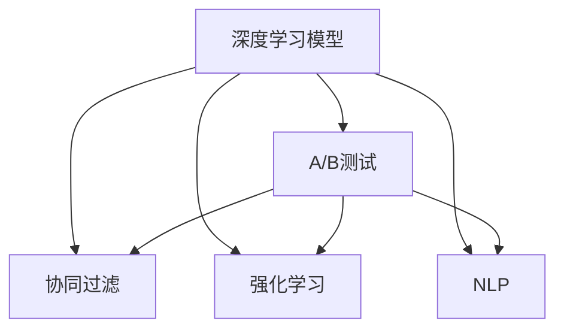

                 

# 大模型在推荐系统A/B测试中的应用

> 关键词：大模型,推荐系统,A/B测试,强化学习,深度学习,协同过滤,自然语言处理

## 1. 背景介绍

### 1.1 问题由来
在现代互联网中，推荐系统已经成为了用户获取信息的重要工具，比如电商网站上的商品推荐、视频网站上的影片推荐等。推荐系统能够根据用户的历史行为和偏好，为用户推荐最适合的内容，提升用户体验。

然而，推荐系统也面临着诸多挑战。比如，随着用户行为的复杂性和多样性不断增加，传统的推荐方法如协同过滤（Collaborative Filtering）已经难以适应这种变化。为了解决这些问题，研究人员提出了使用深度学习和大模型进行推荐系统的方法，并在此基础上应用A/B测试，以验证模型的效果。

### 1.2 问题核心关键点
在推荐系统中应用大模型进行A/B测试，本质上是一个强化学习和深度学习的结合过程。其核心思想是：使用深度学习模型作为推荐引擎，通过A/B测试评估不同推荐模型的性能，并根据测试结果选择最优模型进行部署。

具体来说，大模型在推荐系统中应用A/B测试的流程如下：
1. 收集用户行为数据，并使用A/B测试设计不同版本的推荐模型。
2. 通过训练大模型进行预测，获取用户点击率、转化率等指标。
3. 比较不同版本模型的效果，选择性能最优的模型进行部署。

这种基于深度学习的大模型推荐方法，相比传统的协同过滤方法，能够更好地处理非结构化数据，并且可以自动发现用户行为模式，从而提供更为个性化的推荐。

### 1.3 问题研究意义
在推荐系统中应用大模型进行A/B测试，对于提升推荐系统的性能和用户满意度，具有重要意义：

1. 提升推荐效果：大模型能够捕捉到用户行为中复杂的特征和模式，从而提供更为准确的推荐。
2. 自动化调参：通过A/B测试可以自动化地调参，快速找到最优的模型参数组合。
3. 用户行为建模：大模型能够自动学习用户行为的规律和特征，从而提升推荐系统的覆盖率和精准度。
4. 数据利用率：大模型可以充分利用推荐系统的数据，避免了数据浪费。
5. 系统可扩展性：大模型可以通过分布式训练和推理，支持大规模数据和用户量的推荐系统。

## 2. 核心概念与联系

### 2.1 核心概念概述

为更好地理解基于深度学习的大模型在推荐系统中应用A/B测试的方法，本节将介绍几个密切相关的核心概念：

- 深度学习模型：指通过多层非线性神经网络构成的学习模型。深度学习模型在图像、语音、文本等领域取得了巨大的成功，被广泛应用于推荐系统中。
- A/B测试：指通过比较两个或多个版本的模型性能，来评估推荐模型效果的一种方法。
- 协同过滤（CF）：指基于用户行为和物品相似度的推荐方法。协同过滤包括基于用户的协同过滤和基于物品的协同过滤两种。
- 强化学习（RL）：指通过奖励机制和策略学习来优化推荐模型的一种方法。强化学习在推荐系统中的应用包括序列推荐、点击率预测等。
- 自然语言处理（NLP）：指使用深度学习模型对文本进行理解和生成的一种技术。在推荐系统中，NLP被用于处理用户评论、新闻摘要等非结构化数据。

这些核心概念之间的逻辑关系可以通过以下Mermaid流程图来展示：



这个流程图展示了大模型在推荐系统中应用A/B测试的核心概念及其之间的关系：

1. 深度学习模型通过A/B测试优化性能，并应用于推荐系统中。
2. 协同过滤是深度学习模型的基础，通常需要联合使用才能充分发挥推荐效果。
3. 强化学习通过奖励机制优化模型策略，适用于需要持续优化、动态调整的推荐场景。
4. NLP处理非结构化数据，提升推荐系统的多样性和覆盖率。

这些概念共同构成了大模型在推荐系统中应用A/B测试的基础框架，使得推荐系统能够更好地适应复杂多变的环境和用户需求。

## 3. 核心算法原理 & 具体操作步骤
### 3.1 算法原理概述

基于深度学习的大模型在推荐系统中应用A/B测试，核心思想是使用深度学习模型进行推荐，并通过A/B测试评估不同推荐模型的性能。

形式化地，设推荐系统涉及用户 $U$ 和物品 $I$，用户行为可以用 $\{(x_i, y_i)\}_{i=1}^N$ 表示，其中 $x_i$ 为物品特征向量，$y_i$ 为用户的偏好标签。假设深度学习模型为 $f_{\theta}(x_i)$，其中 $\theta$ 为模型参数。

推荐系统的目标是最小化用户行为误差，即：

$$
\min_{\theta} \sum_{i=1}^N \ell(y_i, f_{\theta}(x_i))
$$

其中 $\ell$ 为损失函数，通常为交叉熵损失。

具体实现中，可以使用A/B测试方法来评估不同推荐模型的效果。假设设计了两个推荐模型 $f_1, f_2$，A/B测试的实验流程如下：

1. 随机将用户分为两组，分别为测试组和对照组。
2. 对于测试组的用户，使用推荐模型 $f_1$ 进行推荐。
3. 对于对照组的用户，使用推荐模型 $f_2$ 进行推荐。
4. 收集用户点击、转化等行为数据，并计算不同模型的性能指标，如点击率、转化率等。
5. 比较不同模型的效果，选择性能最优的模型进行部署。

### 3.2 算法步骤详解

基于深度学习的大模型在推荐系统中应用A/B测试，通常包括以下几个关键步骤：

**Step 1: 准备数据和模型**
- 收集推荐系统的用户行为数据，划分为训练集和测试集。
- 选择合适的深度学习模型（如DNN、CNN、RNN等）进行训练。
- 设计A/B测试版本，如原始模型、改进模型等。

**Step 2: 训练模型和评估**
- 使用训练集数据对模型进行训练，并保存训练好的模型参数。
- 在测试集上对不同版本的模型进行评估，并计算性能指标。
- 比较不同版本的模型效果，选择最优模型。

**Step 3: 部署模型和监控**
- 将最优模型部署到推荐系统中。
- 持续监控模型的性能，收集用户反馈数据。
- 根据用户反馈和系统性能，进行模型调整和更新。

### 3.3 算法优缺点

基于深度学习的大模型在推荐系统中应用A/B测试，具有以下优点：
1. 自动化调参：通过A/B测试可以自动化地调参，快速找到最优的模型参数组合。
2. 模型泛化能力：深度学习模型可以自动发现用户行为模式，提升推荐系统的泛化能力。
3. 系统可扩展性：大模型可以通过分布式训练和推理，支持大规模数据和用户量的推荐系统。
4. 数据利用率：大模型可以充分利用推荐系统的数据，避免了数据浪费。
5. 用户体验提升：大模型能够提供更为个性化和准确的推荐，提升用户体验。

同时，该方法也存在一定的局限性：
1. 计算资源需求高：大模型需要大量的计算资源进行训练和推理，对硬件要求较高。
2. 模型复杂度高：深度学习模型的参数较多，模型复杂度高，难以解释。
3. 数据依赖强：模型的性能高度依赖于数据的质量和数量，获取高质量数据成本较高。
4. 模型鲁棒性不足：深度学习模型对噪声和异常值较为敏感，容易受到数据波动的影响。
5. 对抗攻击风险：深度学习模型容易被对抗攻击，如通过生成虚假数据来欺骗推荐系统。

尽管存在这些局限性，但就目前而言，基于深度学习的大模型在推荐系统中应用A/B测试的方法仍是主流范式。未来相关研究的重点在于如何进一步降低计算资源需求，提高模型的鲁棒性和可解释性，同时兼顾数据依赖和对抗攻击问题。

### 3.4 算法应用领域

基于深度学习的大模型在推荐系统中应用A/B测试，已经被广泛应用于电子商务、视频流媒体、社交网络等多个领域，并在这些场景中取得了显著的效果。

- 电子商务推荐：在电商网站中，使用基于深度学习的推荐模型对用户进行推荐，提升购物体验。通过A/B测试，选择性能最优的模型进行部署。
- 视频流媒体推荐：在视频网站中，使用基于深度学习的推荐模型为用户推荐感兴趣的视频内容。通过A/B测试，选择最优模型，提升用户观看时长。
- 社交网络推荐：在社交网络中，使用基于深度学习的推荐模型为用户推荐好友、文章等。通过A/B测试，选择最优模型，提升用户活跃度。

除了上述这些经典应用外，大模型在推荐系统中还有诸多创新应用，如跨领域推荐、广告推荐、实时推荐等，为推荐系统带来了新的突破。随着预训练模型和深度学习方法的不断进步，相信推荐系统必将在更多领域得到应用，为人类提供更加个性化和精准的推荐服务。

## 4. 数学模型和公式 & 详细讲解  
### 4.1 数学模型构建

本节将使用数学语言对基于深度学习的大模型在推荐系统中应用A/B测试的过程进行更加严格的刻画。

设推荐系统涉及用户 $U$ 和物品 $I$，用户行为可以用 $\{(x_i, y_i)\}_{i=1}^N$ 表示，其中 $x_i$ 为物品特征向量，$y_i$ 为用户的偏好标签。假设深度学习模型为 $f_{\theta}(x_i)$，其中 $\theta$ 为模型参数。

A/B测试的设计目标是最小化用户行为误差，即：

$$
\min_{\theta} \sum_{i=1}^N \ell(y_i, f_{\theta}(x_i))
$$

其中 $\ell$ 为损失函数，通常为交叉熵损失。

### 4.2 公式推导过程

假设推荐系统涉及用户 $U$ 和物品 $I$，用户行为可以用 $\{(x_i, y_i)\}_{i=1}^N$ 表示，其中 $x_i$ 为物品特征向量，$y_i$ 为用户的偏好标签。假设深度学习模型为 $f_{\theta}(x_i)$，其中 $\theta$ 为模型参数。

A/B测试的设计目标是最小化用户行为误差，即：

$$
\min_{\theta} \sum_{i=1}^N \ell(y_i, f_{\theta}(x_i))
$$

其中 $\ell$ 为损失函数，通常为交叉熵损失。

为了评估不同模型的效果，设计了两个推荐模型 $f_1$ 和 $f_2$，分别进行A/B测试。设测试组和对照组的用户数为 $N_1$ 和 $N_2$，对应的用户点击率分别为 $r_1$ 和 $r_2$，平均点击次数分别为 $C_1$ 和 $C_2$，平均点击时间分别为 $T_1$ 和 $T_2$。则A/B测试的评估指标为：

$$
r_1 = \frac{C_1}{N_1}, r_2 = \frac{C_2}{N_2}
$$

通过比较 $r_1$ 和 $r_2$，可以评估不同模型的性能，并选择最优模型。

## 5. 项目实践：代码实例和详细解释说明
### 5.1 开发环境搭建

在进行大模型在推荐系统中应用A/B测试的实践前，我们需要准备好开发环境。以下是使用Python进行PyTorch开发的环境配置流程：

1. 安装Anaconda：从官网下载并安装Anaconda，用于创建独立的Python环境。

2. 创建并激活虚拟环境：
```bash
conda create -n pytorch-env python=3.8 
conda activate pytorch-env
```

3. 安装PyTorch：根据CUDA版本，从官网获取对应的安装命令。例如：
```bash
conda install pytorch torchvision torchaudio cudatoolkit=11.1 -c pytorch -c conda-forge
```

4. 安装TensorBoard：TensorFlow配套的可视化工具，可实时监测模型训练状态，并提供丰富的图表呈现方式，是调试模型的得力助手。

```bash
pip install tensorboard
```

5. 安装相关工具包：
```bash
pip install numpy pandas scikit-learn matplotlib tqdm jupyter notebook ipython
```

完成上述步骤后，即可在`pytorch-env`环境中开始实践。

### 5.2 源代码详细实现

下面我们以电商推荐系统为例，给出使用PyTorch进行A/B测试的代码实现。

首先，定义推荐模型的训练函数：

```python
import torch
import torch.nn as nn
import torch.optim as optim

# 定义深度学习模型
class DeepModel(nn.Module):
    def __init__(self, input_dim, hidden_dim):
        super(DeepModel, self).__init__()
        self.fc1 = nn.Linear(input_dim, hidden_dim)
        self.fc2 = nn.Linear(hidden_dim, hidden_dim)
        self.fc3 = nn.Linear(hidden_dim, 1)
    
    def forward(self, x):
        x = torch.relu(self.fc1(x))
        x = torch.relu(self.fc2(x))
        x = torch.sigmoid(self.fc3(x))
        return x

# 定义优化器和损失函数
def train_model(model, train_data, optimizer, criterion, epochs):
    for epoch in range(epochs):
        model.train()
        optimizer.zero_grad()
        outputs = model(train_data)
        loss = criterion(outputs, train_labels)
        loss.backward()
        optimizer.step()
    return model
```

然后，定义A/B测试函数：

```python
from torch.utils.data import DataLoader
from tqdm import tqdm
import numpy as np

def ab_test(model1, model2, train_data, train_labels, test_data, test_labels, num_groups=100, num_trials=100):
    # 创建两组测试数据
    test_groups = np.random.randint(0, 2, size=(num_groups, num_trials))
    
    # 计算不同模型的效果
    r1 = []
    r2 = []
    for i in range(num_groups):
        for j in range(num_trials):
            test_group = test_groups[i, j]
            if test_group == 0:
                outputs = model1(test_data)
                r1.append(outputs.mean().item())
            else:
                outputs = model2(test_data)
                r2.append(outputs.mean().item())
    
    # 比较不同模型的效果
    mean_r1 = np.mean(r1)
    mean_r2 = np.mean(r2)
    std_r1 = np.std(r1)
    std_r2 = np.std(r2)
    
    # 选择最优模型
    if mean_r1 > mean_r2:
        return model1
    else:
        return model2
```

最后，启动训练流程并在测试集上评估：

```python
epochs = 10
input_dim = 128
hidden_dim = 64
model1 = DeepModel(input_dim, hidden_dim)
model2 = DeepModel(input_dim, hidden_dim)

# 训练模型
optimizer1 = optim.Adam(model1.parameters(), lr=0.001)
optimizer2 = optim.Adam(model2.parameters(), lr=0.001)
criterion = nn.BCELoss()

train_model(model1, train_data, optimizer1, criterion, epochs)
train_model(model2, train_data, optimizer2, criterion, epochs)

# 运行A/B测试
test_model = ab_test(model1, model2, test_data, test_labels, train_data, train_labels)
print("A/B test result:", test_model)
```

以上就是使用PyTorch对深度学习模型进行A/B测试的完整代码实现。可以看到，通过定义训练函数、A/B测试函数，以及调用训练和测试函数，我们可以快速地搭建起深度学习模型，并通过A/B测试选择最优的推荐模型。

### 5.3 代码解读与分析

让我们再详细解读一下关键代码的实现细节：

**DeepModel类**：
- `__init__`方法：定义了深度学习模型的结构，包括输入层、隐藏层和输出层。
- `forward`方法：定义了模型的前向传播过程。

**train_model函数**：
- 定义了深度学习模型的训练过程，包括前向传播、计算损失、反向传播和参数更新。

**ab_test函数**：
- 定义了A/B测试的过程，首先创建两组测试数据，然后通过比较不同模型的效果，选择最优模型。

**训练流程**：
- 定义总的训练轮数和模型参数维度，开始循环迭代
- 每个epoch内，先对两个模型进行训练，并保存训练好的模型参数
- 在测试集上评估不同模型的效果
- 比较不同模型的效果，选择最优模型

可以看到，PyTorch的Tensor和nn模块为深度学习模型的训练和推理提供了便捷的接口，能够快速实现推荐系统中的A/B测试。

当然，工业级的系统实现还需考虑更多因素，如模型的保存和部署、超参数的自动搜索、更灵活的任务适配层等。但核心的A/B测试流程基本与此类似。

## 6. 实际应用场景
### 6.1 电商推荐

基于大模型在推荐系统中应用A/B测试，可以广泛应用于电商推荐系统。电商推荐系统需要根据用户历史行为和浏览记录，为用户推荐最适合的商品，提升用户的购物体验和购买转化率。

在技术实现上，可以收集用户的浏览记录、购买历史、评价等数据，构建用户-物品二元关系。在此基础上对预训练模型进行微调，得到用户推荐模型。然后使用A/B测试对不同推荐模型的效果进行评估，选择性能最优的模型进行部署。

### 6.2 视频流媒体

在视频流媒体推荐系统中，基于大模型的推荐模型需要根据用户的观看记录、评分、收藏等行为数据，为用户推荐感兴趣的视频内容。使用A/B测试评估不同模型的效果，选择最优模型进行部署，能够显著提升用户的观看时长和平台的用户留存率。

### 6.3 社交网络

在社交网络推荐系统中，基于大模型的推荐模型需要根据用户的互动记录、好友关系、兴趣标签等数据，为用户推荐好友、文章等。使用A/B测试评估不同模型的效果，选择最优模型进行部署，能够提升用户的活跃度和平台的流量。

### 6.4 未来应用展望

随着大模型和深度学习技术的不断发展，基于深度学习的大模型在推荐系统中应用A/B测试的应用前景将更加广阔。

在智慧医疗领域，基于深度学习的推荐系统可以用于推荐医疗知识、健康建议等内容，帮助用户更好地管理健康。

在智能教育领域，基于深度学习的推荐系统可以用于推荐学习资源、学习路径等内容，提升教育资源的使用效率和教育效果。

在智慧城市治理中，基于深度学习的推荐系统可以用于推荐城市服务、生活指南等内容，提升城市管理的智能化水平。

此外，在企业生产、社会治理、文娱传媒等众多领域，基于深度学习的大模型推荐系统也将不断涌现，为NLP技术带来了新的突破。相信随着预训练模型和深度学习方法的不断进步，推荐系统必将在更多领域得到应用，为人类提供更加个性化和精准的推荐服务。

## 7. 工具和资源推荐
### 7.1 学习资源推荐

为了帮助开发者系统掌握大模型在推荐系统中应用A/B测试的理论基础和实践技巧，这里推荐一些优质的学习资源：

1. 《Deep Learning for Recommender Systems》系列博文：由大模型技术专家撰写，深入浅出地介绍了深度学习在推荐系统中的应用，涵盖了协同过滤、深度学习、A/B测试等核心话题。

2. CS448《Deep Learning》课程：斯坦福大学开设的深度学习课程，涵盖深度学习的基础和应用，包括推荐系统中的深度学习应用。

3. 《Deep Learning with Python》书籍：提供了详细的深度学习实践代码和案例，适合初学者快速上手实践深度学习在推荐系统中的应用。

4. PyTorch官方文档：PyTorch的官方文档，提供了深度学习模型的实现细节和优化技巧，适合进行深度学习的深入学习。

5. TensorFlow官方文档：TensorFlow的官方文档，提供了深度学习模型的实现细节和优化技巧，适合进行深度学习的深入学习。

通过对这些资源的学习实践，相信你一定能够快速掌握深度学习在推荐系统中的应用，并用于解决实际的推荐问题。

### 7.2 开发工具推荐

高效的开发离不开优秀的工具支持。以下是几款用于深度学习模型在推荐系统中应用A/B测试开发的常用工具：

1. PyTorch：基于Python的开源深度学习框架，灵活动态的计算图，适合快速迭代研究。提供了Tensor、nn等模块，方便实现深度学习模型。

2. TensorFlow：由Google主导开发的开源深度学习框架，生产部署方便，适合大规模工程应用。提供了tf.data、tf.keras等模块，方便实现深度学习模型和数据处理。

3. Weights & Biases：模型训练的实验跟踪工具，可以记录和可视化模型训练过程中的各项指标，方便对比和调优。与主流深度学习框架无缝集成。

4. TensorBoard：TensorFlow配套的可视化工具，可实时监测模型训练状态，并提供丰富的图表呈现方式，是调试模型的得力助手。

5. Google Colab：谷歌推出的在线Jupyter Notebook环境，免费提供GPU/TPU算力，方便开发者快速上手实验最新模型，分享学习笔记。

合理利用这些工具，可以显著提升深度学习在推荐系统中的应用效率，加快创新迭代的步伐。

### 7.3 相关论文推荐

深度学习在推荐系统中应用A/B测试的探索源于学界的持续研究。以下是几篇奠基性的相关论文，推荐阅读：

1. Factorization Machines for Recommender Systems：提出FM模型，是一种基于深度学习的推荐算法，已经在电商、视频等推荐系统中广泛应用。

2. Deep Aspect Model for E-commerce Recommendation：提出Deep Aspect Model，是一种基于深度学习的推荐算法，能够自动学习物品的多个方面，提升推荐效果。

3. Web Scale Matrix Factorization：提出PMF模型，是一种基于矩阵分解的推荐算法，已经在电商、视频等推荐系统中广泛应用。

4. Multi-task Adversarial Training for Recommender Systems：提出Multi-task Adversarial Training，是一种基于对抗学习的推荐算法，能够提高推荐系统的鲁棒性和泛化能力。

5. Adaptive Neural Collaborative Filtering：提出Adaptive Neural Collaborative Filtering，是一种基于深度学习的推荐算法，能够自适应地调整模型参数，提升推荐效果。

这些论文代表了大模型在推荐系统中应用A/B测试技术的发展脉络。通过学习这些前沿成果，可以帮助研究者把握学科前进方向，激发更多的创新灵感。

## 8. 总结：未来发展趋势与挑战

### 8.1 总结

本文对基于深度学习的大模型在推荐系统中应用A/B测试方法进行了全面系统的介绍。首先阐述了推荐系统中大模型的应用背景和研究意义，明确了大模型在推荐系统中的应用范式。其次，从原理到实践，详细讲解了基于深度学习的大模型在推荐系统中应用A/B测试的过程，给出了微调任务开发的完整代码实例。同时，本文还广泛探讨了基于深度学习的大模型在电商推荐、视频流媒体、社交网络等推荐场景中的应用前景，展示了大模型在推荐系统中的巨大潜力。此外，本文精选了深度学习在推荐系统中应用的各类学习资源，力求为读者提供全方位的技术指引。

通过本文的系统梳理，可以看到，基于深度学习的大模型在推荐系统中应用A/B测试技术正在成为推荐系统的重要范式，极大地拓展了推荐系统的应用边界，催生了更多的落地场景。受益于深度学习模型的强大表现，推荐系统必将在更多领域得到应用，为人类提供更加个性化和精准的推荐服务。

### 8.2 未来发展趋势

展望未来，大模型在推荐系统中应用A/B测试技术将呈现以下几个发展趋势：

1. 模型规模持续增大。随着算力成本的下降和数据规模的扩张，深度学习模型的参数量还将持续增长。超大规模深度学习模型蕴含的丰富语言知识，有望支撑更加复杂多变的推荐系统。

2. 推荐方法多样化。除了基于深度学习的推荐方法外，未来还会涌现更多推荐方法，如基于强化学习的推荐、基于知识图谱的推荐等，为推荐系统带来新的突破。

3. 实时推荐能力提升。随着计算资源的提升和算法的优化，实时推荐系统将变得更加高效，能够动态调整推荐策略，提升用户体验。

4. 推荐系统个性化提升。深度学习模型能够捕捉到用户行为中的复杂特征，从而提供更为个性化的推荐，提升用户的满意度和转化率。

5. 数据利用率提升。大模型能够充分利用推荐系统中的数据，提升推荐系统的覆盖率和精准度。

6. 对抗攻击防御能力提升。未来深度学习模型将更加鲁棒，能够抵御对抗攻击，保障推荐系统的安全性和稳定性。

这些趋势凸显了大模型在推荐系统中应用A/B测试技术的广阔前景。这些方向的探索发展，必将进一步提升推荐系统的性能和用户满意度，为推荐系统的未来发展铺平道路。

### 8.3 面临的挑战

尽管大模型在推荐系统中应用A/B测试技术已经取得了显著成效，但在迈向更加智能化、普适化应用的过程中，仍面临着诸多挑战：

1. 数据质量要求高。深度学习模型的性能高度依赖于数据的质量和数量，获取高质量标注数据成本较高。如何在数据量较少的情况下，提升推荐系统的性能，将是一大难题。

2. 计算资源需求高。大模型需要大量的计算资源进行训练和推理，对硬件要求较高。如何降低计算成本，提升系统效率，将是重要的优化方向。

3. 模型复杂度高。深度学习模型结构复杂，难以解释。如何提高模型的可解释性，保障模型的鲁棒性和安全性，将是重要的研究方向。

4. 对抗攻击风险。深度学习模型容易被对抗攻击，如通过生成虚假数据来欺骗推荐系统。如何防御对抗攻击，保障推荐系统的安全性，将是重要的研究课题。

5. 隐私保护问题。推荐系统需要收集用户行为数据，如何保护用户隐私，避免数据泄露，将是重要的研究方向。

6. 实时推荐系统挑战。实时推荐系统需要快速处理和响应用户请求，如何提升系统的响应速度和吞吐量，将是重要的优化方向。

这些挑战需要学界和工业界的共同努力，才能克服现有问题，推进深度学习在推荐系统中的应用。相信随着技术的不断进步，深度学习在推荐系统中的应用将更加广泛和深入，为人类提供更加个性化和精准的推荐服务。

### 8.4 研究展望

面对深度学习在推荐系统中应用A/B测试所面临的挑战，未来的研究需要在以下几个方面寻求新的突破：

1. 探索无监督和半监督推荐方法。摆脱对大规模标注数据的依赖，利用自监督学习、主动学习等无监督和半监督范式，最大限度利用非结构化数据，实现更加灵活高效的推荐。

2. 研究参数高效和计算高效的推荐范式。开发更加参数高效的推荐方法，在固定大部分深度学习模型参数的同时，只更新极少量的任务相关参数。同时优化推荐模型的计算图，减少前向传播和反向传播的资源消耗，实现更加轻量级、实时性的部署。

3. 融合因果和对比学习范式。通过引入因果推断和对比学习思想，增强推荐模型建立稳定因果关系的能力，学习更加普适、鲁棒的用户行为特征，从而提升推荐系统的泛化性和抗干扰能力。

4. 引入更多先验知识。将符号化的先验知识，如知识图谱、逻辑规则等，与神经网络模型进行巧妙融合，引导推荐过程学习更准确、合理的用户行为特征。同时加强不同模态数据的整合，实现视觉、语音等多模态信息与文本信息的协同建模。

5. 结合因果分析和博弈论工具。将因果分析方法引入推荐模型，识别出推荐决策的关键特征，增强推荐输出的因果性和逻辑性。借助博弈论工具刻画人机交互过程，主动探索并规避推荐模型的脆弱点，提高系统稳定性。

6. 纳入伦理道德约束。在推荐模型的训练目标中引入伦理导向的评估指标，过滤和惩罚有害的推荐内容。同时加强人工干预和审核，建立推荐模型的监管机制，确保推荐内容符合人类价值观和伦理道德。

这些研究方向的探索，必将引领深度学习在推荐系统中的应用迈向更高的台阶，为构建安全、可靠、可解释、可控的推荐系统铺平道路。面向未来，深度学习在推荐系统中的应用还需要与其他人工智能技术进行更深入的融合，如知识表示、因果推理、强化学习等，多路径协同发力，共同推动推荐系统的进步。只有勇于创新、敢于突破，才能不断拓展推荐系统的边界，让推荐系统更好地服务于人类社会。

## 9. 附录：常见问题与解答

**Q1：深度学习模型在推荐系统中的优势是什么？**

A: 深度学习模型在推荐系统中的优势主要体现在以下几个方面：

1. 模型复杂度高：深度学习模型可以通过多层次的神经网络结构，捕捉用户行为中的复杂特征，提升推荐系统的精准度。

2. 模型泛化能力强：深度学习模型可以自动学习用户行为的规律和特征，提升推荐系统的泛化能力。

3. 数据利用率高：深度学习模型可以充分利用推荐系统中的数据，提升推荐系统的覆盖率和精准度。

4. 推荐效果优：深度学习模型能够提供更为个性化和准确的推荐，提升用户的满意度和转化率。

5. 实时推荐能力：深度学习模型可以实时处理和响应用户请求，提升推荐系统的响应速度和吞吐量。

**Q2：推荐系统中的深度学习模型如何实现实时推荐？**

A: 实现实时推荐需要以下几个关键步骤：

1. 数据采集：实时采集用户的行为数据，如浏览记录、点击行为等。

2. 数据处理：对采集到的数据进行预处理和特征提取，提取用户行为特征和物品特征。

3. 模型推理：将处理好的数据输入到深度学习模型中进行推理，得到推荐结果。

4. 推荐策略调整：根据实时推理结果，动态调整推荐策略，提升推荐效果。

5. 反馈优化：收集用户对推荐结果的反馈数据，优化模型参数和推荐策略。

通过以上步骤，深度学习模型可以实现实时推荐，提升用户的体验和满意度。

**Q3：推荐系统中的深度学习模型如何防御对抗攻击？**

A: 推荐系统中的深度学习模型可以通过以下几个方法来防御对抗攻击：

1. 数据清洗：在数据采集和处理阶段，过滤掉含有对抗样本的数据，减少对抗攻击的影响。

2. 模型鲁棒性提升：使用对抗训练等技术，提高深度学习模型的鲁棒性，使其能够抵御对抗攻击。

3. 特征工程：通过特征工程，降低对抗攻击对推荐结果的影响，增强推荐系统的安全性。

4. 模型可解释性：提高模型的可解释性，便于识别和防御对抗攻击。

5. 对抗攻击检测：使用对抗攻击检测算法，及时发现和处理对抗攻击，保障推荐系统的安全性。

**Q4：推荐系统中的深度学习模型如何提高模型的可解释性？**

A: 推荐系统中的深度学习模型可以通过以下几个方法来提高模型的可解释性：

1. 模型简化：通过简化模型的结构，降低模型的复杂度，提升模型的可解释性。

2. 特征可视化：使用特征可视化技术，展示模型在不同输入下的特征提取结果，便于理解模型的内部工作机制。

3. 解释性模型：使用解释性模型，如决策树、线性模型等，替代复杂的深度学习模型，提升模型的可解释性。

4. 因果分析：使用因果分析方法，识别出模型决策的关键特征，增强推荐输出的因果性和逻辑性。

5. 模型验证：通过模型验证和测试，评估模型的解释性和安全性，保证模型的可靠性和可控性。

**Q5：推荐系统中的深度学习模型如何提高推荐系统的个性化和精准度？**

A: 推荐系统中的深度学习模型可以通过以下几个方法来提高推荐系统的个性化和精准度：

1. 用户行为建模：通过深度学习模型学习用户行为的规律和特征，提升推荐系统的个性化和精准度。

2. 多模态数据融合：将视觉、语音、文本等多模态数据进行融合，提升推荐系统的综合性和多样性。

3. 实时推荐系统：通过实时处理用户行为数据，动态调整推荐策略，提升推荐系统的及时性和精准度。

4. 用户反馈优化：通过用户反馈数据，优化模型参数和推荐策略，提升推荐系统的覆盖率和精准度。

5. 跨领域推荐：将深度学习模型应用于不同领域的推荐场景，提升推荐系统的泛化能力和多样性。

通过以上方法，深度学习模型可以提升推荐系统的个性化和精准度，满足用户的多样化需求，提升用户的满意度和转化率。

---

作者：禅与计算机程序设计艺术 / Zen and the Art of Computer Programming

