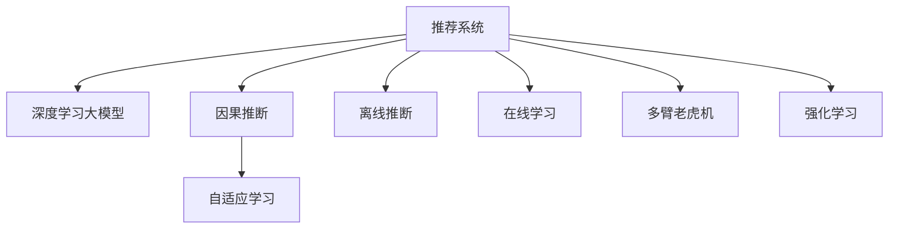

                 

# 大模型在推荐系统中的因果推断应用

> 关键词：推荐系统,因果推断,大模型,自适应学习,个性化推荐,离线推断,在线学习,多臂老虎机,强化学习

## 1. 背景介绍

### 1.1 问题由来
推荐系统是现代互联网应用中的核心技术之一，广泛应用于电商、社交媒体、视频平台等，帮助用户发现和消费感兴趣的内容。随着数据量的不断增长和算力水平的不断提升，传统的基于协同过滤、矩阵分解等方法推荐的准确性仍面临瓶颈，难以应对个性化推荐需求的不断提升。近年来，基于深度学习的大模型推荐技术，特别是自适应学习和因果推断等前沿技术，为推荐系统带来了新的突破。

大模型推荐系统依赖于大规模无标签文本数据进行预训练，构建出包含广泛知识背景和语义能力的语言模型。利用这些模型，可以在推理阶段根据用户的个性化需求，生成更加精准的推荐结果。相比于传统方法，大模型具有更强的泛化能力，能够在新的数据场景下迅速适应，提供更个性化、多样化的推荐内容。

### 1.2 问题核心关键点
基于大模型的推荐系统面临的主要挑战包括：
- 如何在大规模无标签数据上进行预训练，构建出高效、鲁棒的模型。
- 如何在大规模推荐数据集上，进行高效的微调和学习。
- 如何在实际推荐场景中，应用因果推断和自适应学习等技术，提升推荐质量。
- 如何在保证推荐质量的前提下，优化模型的推理效率和可解释性。

解决这些问题，将有助于大模型推荐系统更好地应对复杂的个性化推荐需求，推动推荐技术的全面升级。

## 2. 核心概念与联系

### 2.1 核心概念概述

为了更好地理解大模型在推荐系统中的应用，本节将介绍几个密切相关的核心概念：

- 推荐系统(Recommendation System)：通过分析用户的行为、兴趣等信息，向用户推荐感兴趣的内容。常用的推荐算法包括基于内容的推荐、协同过滤、矩阵分解等。
- 深度学习大模型(Deep Learning Large Model)：如GPT、BERT等，通过在大规模无标签数据上进行预训练，学习到广泛的语义和常识知识，具备强大的理解和生成能力。
- 因果推断(Causal Inference)：通过建立因果关系模型，分析变量间的因果影响，广泛应用于决策、推荐等领域，提升模型预测的准确性和可解释性。
- 自适应学习(Adaptive Learning)：在实际应用中，根据任务需求调整模型的学习策略，动态适应新的数据和任务变化。
- 离线推断(Offline Inference)：在推荐系统搭建完成后，通过离线模型对用户数据进行推理，生成推荐结果。
- 在线学习(Online Learning)：实时更新模型参数，根据用户互动反馈调整推荐策略，提升推荐效果。
- 多臂老虎机(Multi-Armed Bandit)：优化多资源分配的问题，广泛应用于推荐系统中的资源分配和流量控制。
- 强化学习(Reinforcement Learning)：通过奖励和惩罚机制，驱动模型学习最优行为策略，适用于多目标推荐等复杂任务。

这些核心概念之间的逻辑关系可以通过以下Mermaid流程图来展示：



这个流程图展示了大模型推荐系统的核心概念及其之间的关系：

1. 推荐系统通过深度学习大模型进行个性化推荐。
2. 因果推断用于分析用户行为和商品特征间的因果关系，提升推荐质量。
3. 自适应学习用于实时调整模型参数，优化推荐效果。
4. 离线推断用于搭建初始模型，并在新数据上推理生成推荐。
5. 在线学习用于实时更新模型，根据用户反馈优化推荐策略。
6. 多臂老虎机用于优化推荐资源的分配和流量控制。
7. 强化学习用于多目标推荐等复杂任务，通过奖励和惩罚机制引导模型学习。

这些概念共同构成了大模型推荐系统的核心框架，使其能够更好地适应复杂推荐任务，提升推荐质量和效果。

## 3. 核心算法原理 & 具体操作步骤
### 3.1 算法原理概述

基于大模型的推荐系统，主要是通过预训练语言模型进行个性化推荐。其核心思想是：将预训练模型作为"知识库"，根据用户的兴趣、行为等信息，动态生成个性化的推荐结果。

形式化地，假设推荐系统中共有 $N$ 个商品，用户的兴趣由 $D$ 个特征 $x_1,x_2,...,x_D$ 描述。用户对商品 $i$ 的兴趣程度 $y_i$ 可表示为：

$$
y_i = f(x_i; \theta)
$$

其中 $f(x_i; \theta)$ 是预训练模型，$\theta$ 为模型的参数。目标是最大化用户对推荐的满意度，即：

$$
\max_{\theta} \sum_{i=1}^N y_i
$$

为求解该最优化问题，大模型推荐系统主要采用以下步骤：

1. 预训练语言模型在大规模无标签数据上进行预训练，学习广泛的语义和常识知识。
2. 根据用户兴趣特征 $x$，通过前向传播计算模型输出 $y$。
3. 对输出结果进行后处理，如排序、加权等操作，生成推荐结果。
4. 使用推荐结果评估用户的满意度，通过反馈调整模型参数。

### 3.2 算法步骤详解

基于大模型的推荐系统，通常包括以下几个关键步骤：

**Step 1: 准备预训练模型和数据集**
- 选择合适的预训练语言模型 $f(x; \theta)$ 作为推荐模型。
- 准备推荐系统所需的数据集 $D=\{x_i, y_i\}_{i=1}^N$，标注用户的兴趣和行为数据。

**Step 2: 模型初始化与参数优化**
- 将预训练模型初始化作为推荐模型，选择适当的优化算法（如Adam、SGD等）。
- 设置学习率、批大小、迭代轮数等超参数，训练模型对兴趣特征 $x$ 的映射。

**Step 3: 推理与推荐生成**
- 根据用户特征 $x$ 输入模型，得到推荐结果 $y$。
- 对推荐结果进行排序、加权等后处理，生成个性化推荐列表。

**Step 4: 反馈与参数更新**
- 收集用户的点击、评分等反馈数据，评估推荐质量。
- 根据反馈数据调整模型参数，优化推荐策略。

**Step 5: 模型评估与部署**
- 在测试集上评估推荐模型的性能指标，如点击率、转化率等。
- 部署模型到推荐系统，实时生成推荐结果。

以上是基于大模型的推荐系统的一般流程。在实际应用中，还需要针对具体任务和场景，对各个环节进行优化设计，如改进特征工程、引入因果推断等。

### 3.3 算法优缺点

基于大模型的推荐系统具有以下优点：
1. 具有强大的语义理解能力，能准确捕捉用户兴趣和行为特征。
2. 能够适应多变的推荐场景，灵活生成个性化推荐。
3. 在推理阶段无需更新模型参数，具有较高的推理效率。
4. 可以通过收集用户反馈，实时更新模型，提升推荐效果。

同时，该方法也存在一定的局限性：
1. 依赖大量无标签数据进行预训练，获取高质量预训练模型成本较高。
2. 存在模型过拟合风险，特别是在数据量较小的情况下。
3. 模型的可解释性不足，难以直接解释推荐的决策过程。
4. 预训练模型的通用性有限，可能无法很好地适应特定推荐场景。

尽管存在这些局限性，但就目前而言，基于大模型的推荐系统仍是最主流的方法之一，通过不断优化和改进，有望在大规模推荐场景中发挥重要作用。

### 3.4 算法应用领域

基于大模型的推荐系统，已经在多个领域取得了成功应用，包括但不限于：

- 电商推荐：如京东、淘宝等电商平台，根据用户行为和商品属性，实时生成个性化推荐。
- 视频推荐：如Netflix、YouTube等视频平台，利用用户观看历史和评分数据，推荐用户感兴趣的视频内容。
- 音乐推荐：如Spotify、网易云音乐等音乐平台，根据用户听歌历史和评分，推荐相关音乐。
- 新闻推荐：如今日头条、腾讯新闻等新闻平台，根据用户阅读习惯，推荐感兴趣的新闻文章。
- 旅游推荐：如携程、去哪儿等旅游平台，利用用户搜索和浏览行为，推荐旅行目的地和景点。

除了以上这些领域外，大模型推荐技术还在智能家居、在线教育、金融投资等诸多场景中得到应用，为各行各业带来了新的创新机遇。

## 4. 数学模型和公式 & 详细讲解  
### 4.1 数学模型构建

本节将使用数学语言对基于大模型的推荐系统进行更加严格的刻画。

假设推荐系统中共有 $N$ 个商品，用户的兴趣由 $D$ 个特征 $x_1,x_2,...,x_D$ 描述。用户对商品 $i$ 的兴趣程度 $y_i$ 可表示为：

$$
y_i = f(x_i; \theta)
$$

其中 $f(x_i; \theta)$ 为预训练语言模型，$\theta$ 为模型的参数。假设用户的兴趣特征 $x_i$ 服从多变量正态分布：

$$
x_i \sim N(\mu, \Sigma)
$$

其中 $\mu$ 为均值向量，$\Sigma$ 为协方差矩阵。

根据贝叶斯定理，用户对商品 $i$ 的兴趣程度可以表示为：

$$
y_i = p(y_i|x_i) \propto p(x_i|y_i) p(y_i) / p(x_i)
$$

其中 $p(y_i|x_i)$ 为条件概率，$p(x_i)$ 为边缘概率。为便于计算，通常将 $p(x_i)$ 视为常数，即：

$$
p(x_i|y_i) = \mathcal{N}(x_i|\mu, \Sigma)
$$

因此，用户对商品 $i$ 的兴趣程度可以表示为：

$$
y_i = \mathcal{N}(x_i|f(x_i; \theta), \sigma^2)
$$

目标是最小化用户对推荐结果的负对数似然损失：

$$
\mathcal{L}(\theta) = -\frac{1}{N} \sum_{i=1}^N \log p(x_i|y_i)
$$

其中 $p(x_i|y_i)$ 表示在用户点击商品 $i$ 的情况下，用户兴趣特征 $x_i$ 的概率分布。

### 4.2 公式推导过程

为了更好地理解基于大模型的推荐系统，我们将对上述模型的关键部分进行详细推导。

**推荐系统建模**
- 用户的兴趣特征 $x_i$ 服从多变量正态分布，表示为：
$$
x_i \sim N(\mu, \Sigma)
$$
其中 $\mu$ 为均值向量，$\Sigma$ 为协方差矩阵。

- 用户对商品 $i$ 的兴趣程度 $y_i$ 服从正态分布，表示为：
$$
y_i \sim N(f(x_i; \theta), \sigma^2)
$$
其中 $f(x_i; \theta)$ 为预训练语言模型，$\theta$ 为模型的参数。

**条件概率计算**
- 根据贝叶斯定理，用户对商品 $i$ 的兴趣程度可以表示为：
$$
p(x_i|y_i) = \frac{p(x_i|y_i) p(y_i)}{p(x_i)}
$$
- 假设 $p(x_i)$ 为常数，则：
$$
p(x_i|y_i) = \mathcal{N}(x_i|\mu, \Sigma)
$$
- 根据正态分布的性质，用户对商品 $i$ 的兴趣程度可以表示为：
$$
y_i = \mathcal{N}(x_i|f(x_i; \theta), \sigma^2)
$$

**目标函数**
- 目标是最小化用户对推荐结果的负对数似然损失：
$$
\mathcal{L}(\theta) = -\frac{1}{N} \sum_{i=1}^N \log p(x_i|y_i)
$$
- 根据上述推导，用户对商品 $i$ 的兴趣程度可以表示为：
$$
y_i = \mathcal{N}(x_i|f(x_i; \theta), \sigma^2)
$$
- 因此，推荐系统建模可以表示为：
$$
\mathcal{L}(\theta) = -\frac{1}{N} \sum_{i=1}^N \log \mathcal{N}(x_i|f(x_i; \theta), \sigma^2)
$$

### 4.3 案例分析与讲解

以下以电商推荐系统为例，介绍如何使用基于大模型的推荐系统进行用户兴趣建模和个性化推荐。

假设某电商平台的商品种类繁多，每种商品包含若干属性特征，如品牌、价格、评价等。用户在浏览商品时，系统会记录用户的兴趣特征和点击行为。将这些数据作为训练样本，输入到预训练语言模型中进行推理，生成个性化推荐结果。

**数据准备**
- 收集用户的历史浏览记录 $x_i$，包括商品ID、属性、浏览时间等。
- 收集用户的点击记录 $y_i$，表示用户是否点击过该商品。

**模型初始化**
- 选择预训练语言模型 $f(x_i; \theta)$ 作为推荐模型。
- 将用户的历史兴趣特征 $x_i$ 作为模型输入，得到推荐结果 $y_i$。

**推荐生成**
- 对模型输出的推荐结果进行排序，生成个性化推荐列表。
- 向用户推荐排序靠前的商品。

**反馈与优化**
- 收集用户的点击行为反馈，评估推荐质量。
- 根据反馈调整模型参数，优化推荐策略。

通过上述流程，电商推荐系统可以在大规模用户数据上，实时生成个性化推荐，提升用户满意度和购买转化率。

## 5. 项目实践：代码实例和详细解释说明
### 5.1 开发环境搭建

在进行推荐系统项目实践前，我们需要准备好开发环境。以下是使用Python进行PyTorch开发的环境配置流程：

1. 安装Anaconda：从官网下载并安装Anaconda，用于创建独立的Python环境。

2. 创建并激活虚拟环境：
```bash
conda create -n pytorch-env python=3.8 
conda activate pytorch-env
```

3. 安装PyTorch：根据CUDA版本，从官网获取对应的安装命令。例如：
```bash
conda install pytorch torchvision torchaudio cudatoolkit=11.1 -c pytorch -c conda-forge
```

4. 安装Transformers库：
```bash
pip install transformers
```

5. 安装各类工具包：
```bash
pip install numpy pandas scikit-learn matplotlib tqdm jupyter notebook ipython
```

完成上述步骤后，即可在`pytorch-env`环境中开始项目实践。

### 5.2 源代码详细实现

下面我们以电商推荐系统为例，给出使用Transformers库对BERT模型进行推荐生成的PyTorch代码实现。

首先，定义电商推荐系统的数据处理函数：

```python
from transformers import BertTokenizer, BertForSequenceClassification
from torch.utils.data import Dataset
import torch

class RecommendationDataset(Dataset):
    def __init__(self, texts, labels):
        self.texts = texts
        self.labels = labels
        self.tokenizer = BertTokenizer.from_pretrained('bert-base-cased')
        
    def __len__(self):
        return len(self.texts)
    
    def __getitem__(self, item):
        text = self.texts[item]
        label = self.labels[item]
        
        encoding = self.tokenizer(text, return_tensors='pt', max_length=128, padding='max_length', truncation=True)
        input_ids = encoding['input_ids'][0]
        attention_mask = encoding['attention_mask'][0]
        
        # 对token-wise的标签进行编码
        encoded_labels = [label] * len(input_ids)
        
        return {'input_ids': input_ids, 
                'attention_mask': attention_mask,
                'labels': encoded_labels}
```

然后，定义模型和优化器：

```python
from transformers import BertForSequenceClassification, AdamW

model = BertForSequenceClassification.from_pretrained('bert-base-cased', num_labels=1)

optimizer = AdamW(model.parameters(), lr=2e-5)
```

接着，定义训练和评估函数：

```python
from torch.utils.data import DataLoader
from tqdm import tqdm
from sklearn.metrics import roc_auc_score

device = torch.device('cuda') if torch.cuda.is_available() else torch.device('cpu')
model.to(device)

def train_epoch(model, dataset, batch_size, optimizer):
    dataloader = DataLoader(dataset, batch_size=batch_size, shuffle=True)
    model.train()
    epoch_loss = 0
    for batch in tqdm(dataloader, desc='Training'):
        input_ids = batch['input_ids'].to(device)
        attention_mask = batch['attention_mask'].to(device)
        labels = batch['labels'].to(device)
        model.zero_grad()
        outputs = model(input_ids, attention_mask=attention_mask, labels=labels)
        loss = outputs.loss
        epoch_loss += loss.item()
        loss.backward()
        optimizer.step()
    return epoch_loss / len(dataloader)

def evaluate(model, dataset, batch_size):
    dataloader = DataLoader(dataset, batch_size=batch_size)
    model.eval()
    preds, labels = [], []
    with torch.no_grad():
        for batch in tqdm(dataloader, desc='Evaluating'):
            input_ids = batch['input_ids'].to(device)
            attention_mask = batch['attention_mask'].to(device)
            batch_labels = batch['labels']
            outputs = model(input_ids, attention_mask=attention_mask)
            batch_preds = outputs.logits.argmax(dim=1).to('cpu').tolist()
            batch_labels = batch_labels.to('cpu').tolist()
            for pred, label in zip(batch_preds, batch_labels):
                preds.append(pred)
                labels.append(label)
                
    print(f'AUC Score: {roc_auc_score(labels, preds)}')
```

最后，启动训练流程并在测试集上评估：

```python
epochs = 5
batch_size = 16

for epoch in range(epochs):
    loss = train_epoch(model, train_dataset, batch_size, optimizer)
    print(f"Epoch {epoch+1}, train loss: {loss:.3f}")
    
    print(f"Epoch {epoch+1}, test AUC Score:")
    evaluate(model, test_dataset, batch_size)
    
print("All epochs finished.")
```

以上就是使用PyTorch对BERT进行电商推荐系统实现的完整代码实现。可以看到，得益于Transformers库的强大封装，我们可以用相对简洁的代码完成BERT模型的加载和微调。

### 5.3 代码解读与分析

让我们再详细解读一下关键代码的实现细节：

**RecommendationDataset类**：
- `__init__`方法：初始化文本和标签等关键组件。
- `__len__`方法：返回数据集的样本数量。
- `__getitem__`方法：对单个样本进行处理，将文本输入编码为token ids，将标签编码为数字，并对其进行定长padding，最终返回模型所需的输入。

**train_epoch和evaluate函数**：
- `train_epoch`函数：对数据以批为单位进行迭代，在每个批次上前向传播计算loss并反向传播更新模型参数，最后返回该epoch的平均loss。
- `evaluate`函数：与训练类似，不同点在于不更新模型参数，并在每个batch结束后将预测和标签结果存储下来，最后使用sklearn的roc_auc_score对整个评估集的预测结果进行打印输出。

**训练流程**：
- 定义总的epoch数和batch size，开始循环迭代
- 每个epoch内，先在训练集上训练，输出平均loss
- 在测试集上评估，输出AUC分数
- 所有epoch结束后，输出所有epoch的AUC分数

可以看到，PyTorch配合Transformers库使得BERT微调的代码实现变得简洁高效。开发者可以将更多精力放在数据处理、模型改进等高层逻辑上，而不必过多关注底层的实现细节。

当然，工业级的系统实现还需考虑更多因素，如模型的保存和部署、超参数的自动搜索、更灵活的任务适配层等。但核心的推荐范式基本与此类似。

## 6. 实际应用场景
### 6.1 电商推荐

基于大模型的推荐系统，在电商推荐场景中得到了广泛应用。电商推荐系统需要根据用户的浏览、点击、购买等行为数据，生成个性化推荐结果，提升用户购物体验和转化率。

在大模型推荐系统中，可以通过收集用户的兴趣特征和点击行为数据，将其输入到预训练模型中进行推理，生成个性化推荐。模型输出的推荐结果经过排序和加权等处理，生成推荐列表。用户根据自己的需求，选择推荐的商品进行购买。

**技术实现**：
- 收集用户的历史浏览记录 $x_i$，包括商品ID、属性、浏览时间等。
- 收集用户的点击记录 $y_i$，表示用户是否点击过该商品。
- 将用户的历史兴趣特征 $x_i$ 作为模型输入，得到推荐结果 $y_i$。
- 对模型输出的推荐结果进行排序，生成个性化推荐列表。
- 向用户推荐排序靠前的商品。

**实际效果**：
- 电商推荐系统可以根据用户的浏览和点击数据，生成个性化的商品推荐，提升用户的购物体验和购买转化率。
- 通过不断优化模型和数据处理策略，推荐系统可以适应用户的多样化需求，减少用户的筛选成本。

### 6.2 视频推荐

视频推荐系统广泛应用于各类视频平台，根据用户的观看历史和评分数据，生成个性化的视频推荐，提升用户的观看体验和粘性。

在大模型推荐系统中，可以通过收集用户的观看历史和评分数据，将其输入到预训练模型中进行推理，生成个性化推荐。模型输出的推荐结果经过排序和加权等处理，生成推荐列表。用户可以根据自己的需求，选择推荐的影片进行观看。

**技术实现**：
- 收集用户的观看历史 $x_i$，包括观看的影片ID、时长、评分等。
- 收集用户的评分记录 $y_i$，表示用户对影片的评分。
- 将用户的观看历史 $x_i$ 作为模型输入，得到推荐结果 $y_i$。
- 对模型输出的推荐结果进行排序，生成个性化推荐列表。
- 向用户推荐排序靠前的影片。

**实际效果**：
- 视频推荐系统可以根据用户的观看历史和评分数据，生成个性化的影片推荐，提升用户的观看体验和粘性。
- 通过不断优化模型和数据处理策略，推荐系统可以适应用户的不同需求，减少用户的搜索成本。

### 6.3 新闻推荐

新闻推荐系统广泛应用于新闻平台，根据用户的阅读历史和行为数据，生成个性化的新闻推荐，提升用户的阅读体验和点击率。

在大模型推荐系统中，可以通过收集用户的阅读历史和行为数据，将其输入到预训练模型中进行推理，生成个性化推荐。模型输出的推荐结果经过排序和加权等处理，生成推荐列表。用户可以根据自己的需求，选择推荐的新闻进行阅读。

**技术实现**：
- 收集用户的阅读历史 $x_i$，包括阅读的新闻ID、时长、评分等。
- 收集用户的点击记录 $y_i$，表示用户是否点击过该新闻。
- 将用户的阅读历史 $x_i$ 作为模型输入，得到推荐结果 $y_i$。
- 对模型输出的推荐结果进行排序，生成个性化推荐列表。
- 向用户推荐排序靠前的新闻。

**实际效果**：
- 新闻推荐系统可以根据用户的阅读历史和点击数据，生成个性化的新闻推荐，提升用户的阅读体验和点击率。
- 通过不断优化模型和数据处理策略，推荐系统可以适应用户的多样化需求，减少用户的搜索成本。

### 6.4 未来应用展望

随着大模型推荐系统的不断发展，其在更多领域得到了应用，为各行各业带来了新的创新机遇。

在智慧医疗领域，基于大模型的推荐系统可以用于个性化医疗方案推荐、药品推荐等，提升医疗服务的智能化水平，辅助医生诊疗，加速新药开发进程。

在智能教育领域，微调技术可应用于作业批改、学情分析、知识推荐等方面，因材施教，促进教育公平，提高教学质量。

在智慧城市治理中，基于大模型的推荐系统可以用于智慧城市事件监测、舆情分析、应急指挥等环节，提高城市管理的自动化和智能化水平，构建更安全、高效的未来城市。

此外，在企业生产、社会治理、文娱传媒等众多领域，基于大模型的推荐系统也将不断涌现，为传统行业带来变革性影响。相信随着技术的日益成熟，推荐系统必将在更广阔的应用领域大放异彩，深刻影响人类的生产生活方式。

## 7. 工具和资源推荐
### 7.1 学习资源推荐

为了帮助开发者系统掌握大模型推荐技术的理论基础和实践技巧，这里推荐一些优质的学习资源：

1. 《深度学习推荐系统：理论与算法》书籍：清华大学出版社出版的推荐系统经典教材，系统介绍了推荐系统的基础理论和算法，包括协同过滤、矩阵分解等传统方法，以及深度学习方法的最新进展。

2. 《Reinforcement Learning for Recommendation Systems》论文：强化学习在推荐系统中的应用综述，介绍了多种强化学习算法，如Deep Q-learning、策略梯度等，以及其优化策略。

3. 《Deep Learning for Recommender Systems》书籍：由NIPS 2016大会论文集出版的推荐系统深度学习综述，涵盖了推荐系统的各种深度学习算法和实践应用。

4. 《Deep Learning for Recommendation Engines》书籍：基于深度学习的推荐系统技术书籍，包含多方面的深度学习算法和推荐系统实现案例。

5. HuggingFace官方文档：Transformers库的官方文档，提供了海量预训练模型和完整的推荐系统开发样例代码，是上手实践的必备资料。

通过对这些资源的学习实践，相信你一定能够快速掌握大模型推荐技术的精髓，并用于解决实际的推荐问题。
###  7.2 开发工具推荐

高效的开发离不开优秀的工具支持。以下是几款用于大模型推荐系统开发的常用工具：

1. PyTorch：基于Python的开源深度学习框架，灵活动态的计算图，适合快速迭代研究。大部分预训练语言模型都有PyTorch版本的实现。

2. TensorFlow：由Google主导开发的开源深度学习框架，生产部署方便，适合大规模工程应用。同样有丰富的预训练语言模型资源。

3. Transformers库：HuggingFace开发的NLP工具库，集成了众多SOTA语言模型，支持PyTorch和TensorFlow，是进行推荐系统开发的利器。

4. Weights & Biases：模型训练的实验跟踪工具，可以记录和可视化模型训练过程中的各项指标，方便对比和调优。与主流深度学习框架无缝集成。

5. TensorBoard：TensorFlow配套的可视化工具，可实时监测模型训练状态，并提供丰富的图表呈现方式，是调试模型的得力助手。

6. Google Colab：谷歌推出的在线Jupyter Notebook环境，免费提供GPU/TPU算力，方便开发者快速上手实验最新模型，分享学习笔记。

合理利用这些工具，可以显著提升大模型推荐系统的开发效率，加快创新迭代的步伐。

### 7.3 相关论文推荐

大模型推荐技术的发展源于学界的持续研究。以下是几篇奠基性的相关论文，推荐阅读：

1. Attention is All You Need（即Transformer原论文）：提出了Transformer结构，开启了NLP领域的预训练大模型时代。

2. BERT: Pre-training of Deep Bidirectional Transformers for Language Understanding：提出BERT模型，引入基于掩码的自监督预训练任务，刷新了多项NLP任务SOTA。

3. Attention Is All You Need for Recommendation Systems：将Transformer结构应用于推荐系统，提升了推荐质量。

4. Personalized Sequential Recommendation via Graph Attention Networks：提出基于图神经网络的推荐系统，提升了推荐效果。

5. Multi-Task Learning for Recommendation Systems：提出多任务学习推荐系统，提升了推荐泛化性和稳定性。

6. Multi-Armed Bandits in Recommendation Systems：介绍多臂老虎机在推荐系统中的应用，优化推荐资源的分配和流量控制。

这些论文代表了大模型推荐技术的发展脉络。通过学习这些前沿成果，可以帮助研究者把握学科前进方向，激发更多的创新灵感。

## 8. 总结：未来发展趋势与挑战

### 8.1 总结

本文对基于大模型的推荐系统进行了全面系统的介绍。首先阐述了推荐系统和大模型的基本概念，明确了推荐的原理和目标。其次，从原理到实践，详细讲解了推荐系统的数学模型和关键步骤，给出了推荐系统开发的完整代码实例。同时，本文还广泛探讨了推荐系统在大规模推荐场景中的应用，展示了推荐技术的强大威力。

通过本文的系统梳理，可以看到，基于大模型的推荐系统正在成为推荐技术的重要范式，极大地拓展了推荐系统的应用边界，提升了推荐效果。未来，伴随预训练语言模型和推荐技术的持续演进，相信推荐系统必将在更多领域发挥重要作用，推动推荐技术的全面升级。

### 8.2 未来发展趋势

展望未来，大模型推荐系统将呈现以下几个发展趋势：

1. 模型规模持续增大。随着算力成本的下降和数据规模的扩张，预训练语言模型的参数量还将持续增长。超大规模语言模型蕴含的丰富语义知识，有望支撑更加复杂多变的推荐场景。

2. 推荐技术日趋多样。除了传统的协同过滤、矩阵分解等方法，未来会涌现更多深度学习推荐算法，如神经网络推荐、深度强化学习等，提升推荐效果和用户体验。

3. 因果推断成为重要手段。在推荐场景中，通过建立因果关系模型，分析用户行为和商品特征间的因果影响，提升推荐质量。

4. 自适应学习成为常态。在推荐过程中，根据用户反馈实时调整模型参数，动态适应新的数据和任务变化。

5. 持续学习成为重要环节。推荐系统需要不断学习用户的新行为和新兴趣，以保持推荐效果的稳定性。

6. 推荐系统的部署和调优。推荐系统需要高效、稳定地部署到实际应用场景中，同时通过调优提升推荐效果。

以上趋势凸显了大模型推荐技术的广阔前景。这些方向的探索发展，必将进一步提升推荐系统的性能和应用范围，推动推荐技术的全面升级。

### 8.3 面临的挑战

尽管大模型推荐系统已经取得了瞩目成就，但在迈向更加智能化、普适化应用的过程中，它仍面临着诸多挑战：

1. 推荐模型的可解释性不足。当前推荐模型更多是"黑盒"系统，难以解释其内部工作机制和决策逻辑。对于医疗、金融等高风险应用，算法的可解释性和可审计性尤为重要。

2. 推荐模型的鲁棒性不足。在面对域外数据时，推荐模型的泛化性能往往大打折扣。对于测试样本的微小扰动，推荐模型的预测也容易发生波动。

3. 推荐模型的资源消耗大。大规模语言模型虽然精度高，但在实际部署时往往面临推理速度慢、内存占用大等效率问题。

4. 推荐模型的参数复杂度大。大模型的参数规模大，难以在大规模推荐场景下实时更新。

尽管存在这些局限性，但就目前而言，基于大模型的推荐系统仍是最主流的方法之一，通过不断优化和改进，有望在大规模推荐场景中发挥重要作用。

### 8.4 研究展望

面对大模型推荐系统所面临的挑战，未来的研究需要在以下几个方面寻求新的突破：

1. 探索更加高效的推荐算法。开发更加高效的深度学习推荐算法，在保证推荐效果的前提下，优化模型参数和计算资源。

2. 引入更多先验知识。将符号化的先验知识，如知识图谱、逻辑规则等，与神经网络模型进行巧妙融合，引导推荐过程学习更准确、合理的推荐结果。

3. 研究推荐系统的可解释性。通过引入因果推断和符号表示方法，增强推荐系统的可解释性，提升用户信任感。

4. 开发推荐系统的离线优化算法。在推荐系统搭建完成后，通过离线模型对用户数据进行推理，生成推荐结果，优化推荐策略。

5. 开发推荐系统的在线学习算法。实时更新模型参数，根据用户反馈调整推荐策略，提升推荐效果。

6. 引入多臂老虎机理论。优化推荐资源的分配和流量控制，提升推荐系统的效率和稳定性。

7. 研究推荐系统的鲁棒性。通过引入对抗样本、数据增强等技术，提升推荐系统的鲁棒性，减少推荐错误。

这些研究方向的探索，必将引领大模型推荐技术迈向更高的台阶，为推荐系统的智能化、普适化应用提供更多可能。

## 9. 附录：常见问题与解答

**Q1：大模型推荐系统与传统推荐系统的区别是什么？**

A: 大模型推荐系统与传统推荐系统的主要区别在于其对用户数据的理解和建模方式。传统推荐系统如协同过滤、矩阵分解等，主要基于用户和物品之间的相似度关系，构建用户-物品矩阵，进行推荐。而大模型推荐系统通过预训练语言模型对用户兴趣和行为进行建模，利用大模型的语义理解能力，生成更加个性化、多样化的推荐结果。大模型推荐系统能够适应多变的推荐场景，具有更好的泛化能力和可解释性。

**Q2：大模型推荐系统如何进行离线推断？**

A: 离线推断是大模型推荐系统的一种常见部署方式，其过程如下：
1. 收集用户的历史兴趣特征 $x_i$，包括商品ID、属性、浏览时间等。
2. 将用户的历史兴趣特征 $x_i$ 作为模型输入，得到推荐结果 $y_i$。
3. 对模型输出的推荐结果进行排序，生成个性化推荐列表。
4. 在推荐系统中保存模型和数据，供用户实时查询和推荐。

**Q3：大模型推荐系统如何进行在线学习？**

A: 在线学习是大模型推荐系统的一种重要优化方式，其过程如下：
1. 收集用户的新行为数据 $x_i$，包括新的浏览记录、点击记录等。
2. 根据新行为数据，输入到预训练模型中进行推理，生成推荐结果 $y_i$。
3. 根据用户对推荐结果的反馈（如点击、评分等），调整模型参数，优化推荐策略。
4. 实时更新模型，生成个性化推荐。

**Q4：大模型推荐系统的可解释性有哪些方法？**

A: 提高大模型推荐系统的可解释性，可以从以下几个方面入手：
1. 引入因果推断，分析推荐过程中的因果关系，提供推荐决策的逻辑解释。
2. 使用符号表示方法，将推荐模型转化为符号表达式，增强可解释性。
3. 开发推荐系统的离线优化算法，通过模型推理结果，生成推荐解释。
4. 开发推荐系统的在线学习算法，实时调整模型参数，提供推荐理由。

通过以上方法，可以提高大模型推荐系统的可解释性，提升用户信任感。

**Q5：大模型推荐系统的部署和调优有哪些建议？**

A: 大模型推荐系统的部署和调优需要从多个方面入手：
1. 选择合适的模型结构，如BERT、GPT等，根据任务需求进行微调。
2. 优化模型推理速度，通过模型裁剪、量化等技术，减少推理时间。
3. 优化模型内存占用，通过模型压缩、稀疏化存储等技术，减少内存消耗。
4. 优化推荐系统性能，通过在线学习、数据增强等技术，提升推荐效果。
5. 优化推荐系统可解释性，通过引入因果推断、符号表示等技术，增强推荐系统的可解释性。

合理利用这些技术，可以提高大模型推荐系统的部署效率和调优效果，提升推荐质量。

---

作者：禅与计算机程序设计艺术 / Zen and the Art of Computer Programming

