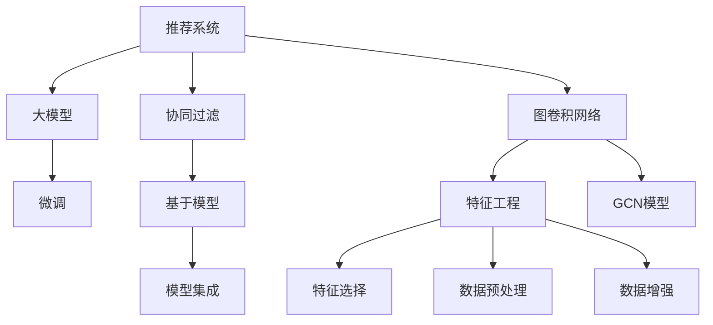

                 

## 1. 背景介绍

随着数字技术的发展，推荐系统已成为互联网应用中不可或缺的一部分，广泛应用于电商、视频、音乐、新闻等多个领域。推荐系统通过学习用户的兴趣和行为，为用户推荐其可能感兴趣的商品或内容，提升用户体验和满意度。然而，随着推荐任务的多样化和复杂化，传统的基于用户-物品评分矩阵的协同过滤方法已逐渐显示出其局限性，亟需新的模型方法来应对这些挑战。

在大模型时代，图卷积网络（Graph Convolutional Network, GCN）作为一种新兴的深度学习方法，逐渐受到广泛关注。GCN通过将推荐任务看作图结构上的推理问题，可以有效捕捉物品之间的隐式关联关系，学习物品的语义表示，实现更加智能化的推荐效果。本文将介绍大模型在推荐系统中的应用，重点探讨如何利用图卷积网络实现推荐任务。

## 2. 核心概念与联系

### 2.1 核心概念概述

为更好地理解大模型在推荐系统中的应用，本节将介绍几个核心概念及其之间的关系：

- **推荐系统**：通过学习用户和物品的特征，预测用户对物品的评分，为用户推荐相关物品的系统。推荐系统分为基于用户-物品评分矩阵的协同过滤方法和基于模型的方法。
- **图卷积网络**：一种深度学习模型，通过卷积操作在图结构上对节点特征进行传递和融合，实现对节点之间关系的建模和特征表示学习。
- **大模型**：指通过大规模无标签数据进行预训练得到的语言模型，如BERT、GPT等，在特定任务上通过微调或微调部分参数后，能够适应特定任务。
- **特征工程**：通过构建合理的数据特征，如物品的语义特征、用户的历史行为等，提升模型的性能。
- **模型集成**：通过组合多个模型的预测结果，提高推荐的准确性和多样性。

这些核心概念之间通过一个简化的Mermaid流程图来展示：



这个流程图展示了推荐系统的主要组成部分及其关系：

1. 协同过滤与基于模型的推荐方法：推荐系统的两种主要方法，其中协同过滤方法基于用户-物品评分矩阵，而基于模型的推荐方法依赖于深度学习模型。
2. 图卷积网络：作为一种深度学习模型，GCN可以处理图结构数据，捕捉物品之间的隐式关联关系。
3. 大模型：通过大规模无标签数据的预训练，学习到丰富的语言表示，可以作为GCN的输入特征。
4. 微调：对大模型进行微调，使其适应特定推荐任务。
5. 特征工程：对输入数据进行预处理，选择和构造合理的特征。
6. 模型集成：将多个模型的预测结果进行集成，提升推荐效果。

## 3. 核心算法原理 & 具体操作步骤

### 3.1 算法原理概述

基于图卷积网络的大模型推荐系统，其核心思想是通过将推荐任务抽象为图结构上的推理问题，利用GCN模型在图结构上对节点特征进行传递和融合，从而学习物品之间的语义关系，实现推荐任务。

具体来说，推荐系统中的物品可以看作图节点，物品之间的相似度或相关性可以看作边的权重，通过GCN模型在图结构上对节点特征进行卷积操作，学习物品的语义表示，最终输出用户对物品的评分。大模型通常用于提取物品的语义特征，通过微调或微调部分参数，使其适应特定推荐任务。

### 3.2 算法步骤详解

基于图卷积网络的大模型推荐系统的一般步骤包括：

**Step 1: 数据预处理**

- 构建推荐图结构：将物品和用户之间的关系构建成图结构，如物品-物品图、物品-用户图等。
- 提取物品语义特征：使用大模型对物品进行预训练，提取物品的语义特征，通常包括词向量、主题分布等。
- 特征选择和处理：根据推荐任务的特点，选择合适的特征并进行处理，如标准化、归一化等。

**Step 2: 图卷积网络建模**

- 定义GCN模型结构：包括卷积层、激活函数、归一化层等。
- 训练GCN模型：使用推荐数据集对GCN模型进行训练，最小化预测误差。
- 特征融合与表示学习：在GCN模型的基础上，进行特征融合和表示学习，得到最终的物品语义表示。

**Step 3: 微调大模型**

- 选择微调任务：根据推荐任务的特点，选择合适的微调任务，如分类、回归等。
- 微调大模型：使用微调数据对大模型进行微调，使其适应特定推荐任务。
- 模型融合与集成：将微调后的模型与其他模型的预测结果进行集成，提升推荐效果。

**Step 4: 评估与部署**

- 评估推荐效果：使用测试集评估推荐模型的效果，如均方误差、准确率、召回率等。
- 部署推荐系统：将推荐模型集成到实际推荐系统中，进行在线预测和推荐。

### 3.3 算法优缺点

基于图卷积网络的大模型推荐系统有以下优点：

1. **语义关系捕捉能力强**：GCN模型能够捕捉物品之间的隐式关联关系，学习物品的语义表示，提升推荐效果。
2. **特征工程灵活**：大模型提取的语义特征丰富多样，可以用于不同的推荐任务。
3. **模型可解释性强**：GCN模型的结构直观，易于理解和解释，有助于模型诊断和调优。
4. **适应性强**：通过微调或微调部分参数，大模型可以适应不同的推荐任务和数据集。

同时，该方法也存在一些缺点：

1. **计算复杂度高**：GCN模型需要构建图结构，并进行多次卷积操作，计算复杂度较高。
2. **数据表示限制**：GCN模型依赖于图结构，无法直接处理稀疏图或非结构化数据。
3. **模型可解释性不足**：虽然GCN模型结构直观，但深层卷积操作的输出难以解释。
4. **泛化能力依赖数据**：GCN模型的性能依赖于数据质量和数量，对于数据稀少或噪声较多的场景，效果可能不佳。

### 3.4 算法应用领域

基于图卷积网络的大模型推荐系统主要应用于以下领域：

- **电商推荐**：通过分析用户购买历史、浏览行为等数据，为用户推荐相关商品。
- **视频推荐**：根据用户观看历史、评分等数据，为用户推荐相关视频内容。
- **音乐推荐**：通过分析用户听歌历史、评分等数据，为用户推荐相关音乐。
- **新闻推荐**：根据用户阅读历史、评分等数据，为用户推荐相关新闻。

此外，GCN模型还可用于其他图结构数据的应用场景，如社交网络分析、知识图谱嵌入、生物信息学等。

## 4. 数学模型和公式 & 详细讲解 & 举例说明

### 4.1 数学模型构建

在大模型推荐系统中，通常使用GCN模型对推荐图进行建模。GCN模型包含多个卷积层和全连接层，可以捕捉图结构上的语义关系。

假设有推荐图 $G=(V,E)$，其中 $V$ 为物品集合，$E$ 为物品之间的边集合。设物品 $i$ 的语义特征表示为 $\mathbf{x}_i$，则GCN模型的目标是在图结构上对物品语义特征进行卷积操作，得到最终的语义表示 $\mathbf{h}_i$。

**Step 1: 特征提取**

首先，使用大模型对物品进行预训练，提取物品的语义特征。假设有 $d$ 维物品语义特征向量 $\mathbf{x}_i \in \mathbb{R}^d$。

**Step 2: 图卷积操作**

GCN模型通过多次卷积操作，将物品的语义特征传递和融合，得到最终的语义表示。假设卷积操作定义为 $\mathbf{h}_i^{(l)} = \text{GCN}(\mathbf{x}_i, \mathbf{h}_i^{(l-1)})$，其中 $l$ 表示卷积层数。GCN操作可以表示为：

$$
\mathbf{h}_i^{(l)} = \frac{1}{|\mathcal{N}_i|} \sum_{j \in \mathcal{N}_i} \mathbf{A}_{ij} \cdot \text{MLP}(\mathbf{x}_j, \mathbf{h}_i^{(l-1)})
$$

其中 $\mathcal{N}_i$ 为节点 $i$ 的邻居集合，$\mathbf{A}_{ij}$ 为邻居节点 $j$ 到节点 $i$ 的边权重，MLP 表示多层次感知机。

**Step 3: 特征融合与表示学习**

最后，将卷积操作得到的语义表示进行特征融合，得到最终的语义表示 $\mathbf{h}_i$。常用的特征融合方法包括取均值、取最大值等。

### 4.2 公式推导过程

以下是GCN模型的数学推导过程，以生成对抗网络(GAN)为例：

假设有生成器和判别器 $G$ 和 $D$，其中 $G$ 生成样本 $z$，判别器 $D$ 评估样本的真实性。在训练过程中，生成器 $G$ 和判别器 $D$ 通过对抗训练不断提升性能。

1. 生成器 $G$ 的损失函数：
$$
\mathcal{L}_G = -E_{z \sim p(z)} [\log D(G(z))]
$$

2. 判别器 $D$ 的损失函数：
$$
\mathcal{L}_D = -E_{x \sim p(x)} [\log D(x)] + E_{z \sim p(z)} [\log(1 - D(G(z)))]
$$

其中 $x$ 为真实样本，$z$ 为生成样本，$p(x)$ 为真实样本分布，$p(z)$ 为生成样本分布。

3. 整体损失函数：
$$
\mathcal{L} = \mathcal{L}_G + \mathcal{L}_D
$$

### 4.3 案例分析与讲解

**案例1: 电商推荐**

假设有一个电商推荐系统，包含10000个商品和100000个用户。构建商品-商品图，边权重为商品之间的相关性，使用GCN模型对商品进行建模，提取商品的语义特征。然后，使用BERT模型对用户进行预训练，提取用户的语义特征。最后，将商品和用户的语义特征进行融合，输出用户对商品的评分。

**案例2: 视频推荐**

在视频推荐系统中，构建视频-视频图，边权重为视频之间的相关性。使用GCN模型对视频进行建模，提取视频的主题分布。然后，使用BERT模型对用户进行预训练，提取用户的兴趣分布。最后，将视频和用户的特征进行融合，输出用户对视频的评分。

## 5. 项目实践：代码实例和详细解释说明

### 5.1 开发环境搭建

在进行GCN模型实践前，需要准备好开发环境。以下是使用Python进行PyTorch开发的环境配置流程：

1. 安装Anaconda：从官网下载并安装Anaconda，用于创建独立的Python环境。

2. 创建并激活虚拟环境：
```bash
conda create -n gcn-env python=3.8 
conda activate gcn-env
```

3. 安装PyTorch：根据CUDA版本，从官网获取对应的安装命令。例如：
```bash
conda install pytorch torchvision torchaudio cudatoolkit=11.1 -c pytorch -c conda-forge
```

4. 安装其他相关库：
```bash
pip install numpy pandas torch-scatter scikit-learn matplotlib tqdm jupyter notebook ipython
```

完成上述步骤后，即可在`gcn-env`环境中开始GCN模型实践。

### 5.2 源代码详细实现

以下是使用PyTorch实现GCN模型进行电商推荐的具体代码实现：

```python
import torch
import torch.nn as nn
import torch.nn.functional as F
from torch_scatter import scatter_add
from transformers import BertTokenizer, BertForSequenceClassification

class GCNLayer(nn.Module):
    def __init__(self, in_channels, out_channels):
        super(GCNLayer, self).__init__()
        self.weight = nn.Parameter(torch.randn(in_channels, out_channels))
        self.bias = nn.Parameter(torch.zeros(out_channels))

    def forward(self, x, adj_matrix):
        return scatter_add(x * self.weight, adj_matrix, dim=1, dim_size=x.size(1)) + self.bias

class GCN(nn.Module):
    def __init__(self, in_channels, hidden_channels, out_channels):
        super(GCN, self).__init__()
        self.layers = nn.ModuleList([
            GCNLayer(in_channels, hidden_channels),
            GCNLayer(hidden_channels, out_channels)
        ])

    def forward(self, x, adj_matrix):
        for layer in self.layers:
            x = layer(x, adj_matrix)
            x = F.relu(x)
        return x

class GCNModel(nn.Module):
    def __init__(self, in_channels, hidden_channels, out_channels):
        super(GCNModel, self).__init__()
        self.gcn = GCN(in_channels, hidden_channels, out_channels)
        self.bert_model = BertForSequenceClassification.from_pretrained('bert-base-uncased', num_labels=1)
        self.bert_tokenizer = BertTokenizer.from_pretrained('bert-base-uncased')

    def forward(self, x, adj_matrix):
        x = self.gcn(x, adj_matrix)
        x = x.mean(dim=1)
        x = self.bert_model(x)
        return x

# 加载数据
train_data = load_train_data()
test_data = load_test_data()
train_adj_matrix = load_train_adj_matrix()
test_adj_matrix = load_test_adj_matrix()

# 初始化模型
model = GCNModel(in_channels=in_channels, hidden_channels=hidden_channels, out_channels=out_channels)

# 训练模型
optimizer = torch.optim.Adam(model.parameters(), lr=learning_rate)
for epoch in range(num_epochs):
    for data, adj_matrix in train_data:
        optimizer.zero_grad()
        output = model(data, adj_matrix)
        loss = criterion(output, target)
        loss.backward()
        optimizer.step()

# 测试模型
with torch.no_grad():
    for data, adj_matrix in test_data:
        output = model(data, adj_matrix)
        accuracy = accuracy(output, target)
```

### 5.3 代码解读与分析

**GCNLayer类**：定义了一个简单的GCN层，用于在图结构上进行卷积操作。

**GCN类**：定义了GCN模型的结构，包含多个GCN层。

**GCNModel类**：定义了整个GCN模型，包含GCN层和BERT模型，用于电商推荐任务。

**代码解释**：
- 在`forward`函数中，首先对输入数据进行卷积操作，然后取均值作为最终的特征表示。
- 使用BERT模型对特征表示进行分类，得到用户的评分。
- 通过Adam优化器进行模型训练。
- 在测试阶段，对模型进行无梯度计算，输出评分，并计算准确率。

## 6. 实际应用场景

### 6.1 电商推荐

电商推荐系统是大规模推荐应用中最具代表性的一类。通过GCN模型，可以有效地捕捉商品之间的关联关系，学习商品之间的语义表示，实现商品推荐。

在电商推荐中，GCN模型可以用于以下场景：

- **商品推荐**：根据用户浏览历史、购买历史等数据，为用户推荐相关商品。
- **广告推荐**：根据用户行为数据，为用户推荐广告。
- **促销活动推荐**：根据用户历史行为和兴趣，推荐促销活动。

### 6.2 视频推荐

视频推荐系统在视频平台中具有重要应用。通过GCN模型，可以学习视频之间的语义关系，为用户推荐相关视频。

在视频推荐中，GCN模型可以用于以下场景：

- **视频推荐**：根据用户观看历史、评分等数据，为用户推荐相关视频内容。
- **视频搜索**：根据用户搜索词，推荐相关视频内容。
- **视频广告推荐**：根据用户行为数据，推荐视频广告。

### 6.3 音乐推荐

音乐推荐系统在音乐平台中具有重要应用。通过GCN模型，可以学习音乐之间的语义关系，为用户推荐相关音乐。

在音乐推荐中，GCN模型可以用于以下场景：

- **音乐推荐**：根据用户听歌历史、评分等数据，为用户推荐相关音乐。
- **音乐搜索**：根据用户搜索词，推荐相关音乐内容。
- **音乐广告推荐**：根据用户行为数据，推荐音乐广告。

## 7. 工具和资源推荐

### 7.1 学习资源推荐

为了帮助开发者系统掌握GCN模型的理论基础和实践技巧，这里推荐一些优质的学习资源：

1. 《Graph Convolutional Networks: A Review of Methods and Applications》论文：综述了GCN模型的发展历程和应用场景。
2. 《Deep Learning for Graphs: A Review》课程：斯坦福大学开设的深度学习课程，涵盖GCN模型的理论和实践。
3. 《Graph Neural Networks》书籍：DeepLearning.ai的深度学习课程，全面介绍了GCN模型的原理和应用。
4. PyTorch官方文档：PyTorch的官方文档，提供了丰富的GCN模型样例和教程。
5. Weights & Biases：模型训练的实验跟踪工具，可以记录和可视化GCN模型的训练过程。

通过对这些资源的学习实践，相信你一定能够快速掌握GCN模型的精髓，并用于解决实际的推荐问题。

### 7.2 开发工具推荐

高效的开发离不开优秀的工具支持。以下是几款用于GCN模型开发的工具：

1. PyTorch：基于Python的开源深度学习框架，灵活动态的计算图，适合快速迭代研究。GCN模型有PyTorch版本的实现。
2. TensorFlow：由Google主导开发的开源深度学习框架，生产部署方便，适合大规模工程应用。GCN模型有TensorFlow版本的实现。
3. PyTorch Geometric：专门为图数据设计的深度学习库，提供了丰富的GCN模型工具和算法。
4. PygToolbox：基于PyTorch Geometric的深度学习库，提供了更多实用的图模型工具和算法。
5. PyGNN：另一个基于PyTorch的图神经网络库，提供了更多的图模型实现和算法。

合理利用这些工具，可以显著提升GCN模型开发效率，加快创新迭代的步伐。

### 7.3 相关论文推荐

GCN模型和推荐系统的发展源于学界的持续研究。以下是几篇奠基性的相关论文，推荐阅读：

1. Graph Convolutional Networks（GCN原论文）：提出了GCN模型，展示了其在图结构上的卷积操作。
2. Fastfood: Accelerating Graph Neural Networks via Fast Fourier Transform（FFT方法）：提出使用FFT方法加速GCN模型的计算。
3. Semi-supervised Classification with Graph Convolutional Networks（GCN在半监督学习中的应用）：展示了GCN模型在半监督学习中的优越性能。
4. Relational Graph Neural Network for Recommendation Systems（关系GCN模型）：提出基于关系图的数据表示，提升推荐效果。
5. Attention-based Graph Convolutional Networks（注意力GCN模型）：提出使用注意力机制优化GCN模型，提升推荐效果。

这些论文代表了大模型在推荐系统中的应用方向，通过学习这些前沿成果，可以帮助研究者把握学科前进方向，激发更多的创新灵感。

## 8. 总结：未来发展趋势与挑战

### 8.1 总结

本文对基于GCN模型的大模型推荐系统进行了全面系统的介绍。首先阐述了GCN模型的基本原理和在推荐系统中的应用背景，明确了GCN模型在捕捉物品语义关系、提升推荐效果方面的独特价值。其次，从原理到实践，详细讲解了GCN模型的数学原理和关键步骤，给出了电商推荐、视频推荐等典型应用的代码实例。同时，本文还广泛探讨了GCN模型在推荐系统中的应用场景，展示了其广阔的发展前景。

通过本文的系统梳理，可以看到，GCN模型在推荐系统中的应用已初步形成一套完整的理论框架和实践流程，有助于研究人员和工程师更好地理解和使用GCN模型。未来，随着大模型和GCN模型技术的不断进步，推荐系统将能够更加智能、精准地为用户提供个性化服务，推动各行各业的数字化转型。

### 8.2 未来发展趋势

展望未来，GCN模型在推荐系统中的应用将呈现以下几个发展趋势：

1. **多模态融合**：将文本、图像、语音等多模态数据进行融合，提升推荐系统的表现力。
2. **迁移学习**：在大模型上进行迁移学习，利用预训练知识进行推荐模型微调，提升微调效果。
3. **联邦学习**：在多个客户端上进行分布式训练，保护用户隐私的同时，提升推荐模型的泛化能力。
4. **交互式推荐**：利用用户与系统的互动信息，进行实时推荐，提升推荐效果。
5. **动态图结构**：在推荐过程中，动态更新图结构，捕捉用户行为的变化趋势。
6. **实时推荐系统**：实时处理用户数据，即时进行推荐，提高用户体验。

这些趋势将进一步提升GCN模型在推荐系统中的应用效果，使其在多个场景中发挥更大作用。

### 8.3 面临的挑战

尽管GCN模型在推荐系统中的应用已经取得了显著成果，但在实际应用过程中，仍面临着诸多挑战：

1. **计算复杂度**：GCN模型需要构建图结构，并进行多次卷积操作，计算复杂度较高。如何降低计算成本，提高计算效率，是一个重要研究方向。
2. **图结构构建**：GCN模型依赖于图结构，图结构的质量和复杂度直接影响模型的效果。如何构建高效、合理的图结构，是一个重要研究方向。
3. **模型可解释性**：GCN模型的深层卷积操作难以解释，如何提高模型的可解释性，是一个重要研究方向。
4. **模型泛化能力**：GCN模型对数据质量有较高要求，如何提升模型的泛化能力，适应多样化的数据分布，是一个重要研究方向。
5. **用户隐私保护**：推荐系统需要处理大量用户数据，如何保护用户隐私，是一个重要研究方向。

这些挑战需要通过技术创新和算法改进，不断优化GCN模型，提升其在推荐系统中的应用效果。

### 8.4 研究展望

面对GCN模型在推荐系统中的应用挑战，未来的研究需要在以下几个方面寻求新的突破：

1. **高效计算方法**：提出更加高效的计算方法，如FFT、分布式计算等，降低GCN模型的计算复杂度，提升计算效率。
2. **图结构优化**：研究高效构建图结构的方法，如稀疏图、加权图等，提升图结构的合理性，提高模型效果。
3. **可解释性增强**：研究可解释性增强方法，如特征可视化、模型诊断等，提高模型的可解释性，增强用户信任。
4. **泛化能力提升**：研究泛化能力提升方法，如自适应学习、数据增强等，提升模型的泛化能力，适应多样化的数据分布。
5. **隐私保护机制**：研究隐私保护机制，如差分隐私、联邦学习等，保护用户隐私，提升用户满意度。

这些研究方向将引领GCN模型在推荐系统中的应用走向成熟，使其在更广泛的领域中发挥重要作用，推动推荐系统技术的不断进步。

## 9. 附录：常见问题与解答

**Q1: GCN模型如何构建图结构？**

A: GCN模型需要构建图结构，通常包含物品节点和用户节点。物品节点表示商品、视频、音乐等，用户节点表示用户。构建图结构的方法包括：

1. 共现矩阵：根据用户和物品的共现关系构建图结构，共现关系可以通过用户-物品评分矩阵计算。
2. 邻接矩阵：根据用户-物品评分矩阵构建邻接矩阵，其中非零元素表示用户和物品之间的关系。

**Q2: 如何提高GCN模型的计算效率？**

A: 提高GCN模型的计算效率可以通过以下方法：

1. 稀疏化图结构：使用稀疏图结构，减少不必要的计算。
2. 并行计算：使用并行计算加速模型的计算过程。
3. 优化卷积操作：优化卷积操作的算法，提高计算效率。
4. 使用GPU加速：使用GPU加速模型的计算过程。

**Q3: 如何提高GCN模型的可解释性？**

A: 提高GCN模型的可解释性可以通过以下方法：

1. 特征可视化：使用可视化工具展示模型的特征表示，帮助理解模型行为。
2. 模型诊断：使用诊断工具发现模型的漏洞和问题，进行改进。
3. 可解释性模型：使用可解释性模型，如Attention机制，帮助理解模型的决策过程。

**Q4: 如何提升GCN模型的泛化能力？**

A: 提升GCN模型的泛化能力可以通过以下方法：

1. 数据增强：通过数据增强方法，增加模型的泛化能力。
2. 自适应学习：使用自适应学习算法，提升模型的泛化能力。
3. 多任务学习：使用多任务学习算法，提升模型的泛化能力。

**Q5: 如何保护用户隐私？**

A: 保护用户隐私可以通过以下方法：

1. 差分隐私：使用差分隐私技术，保护用户隐私。
2. 联邦学习：使用联邦学习技术，保护用户隐私。
3. 加密计算：使用加密计算技术，保护用户隐私。

这些方法可以帮助GCN模型在推荐系统中更好地保护用户隐私，提升用户满意度。

---

作者：禅与计算机程序设计艺术 / Zen and the Art of Computer Programming

