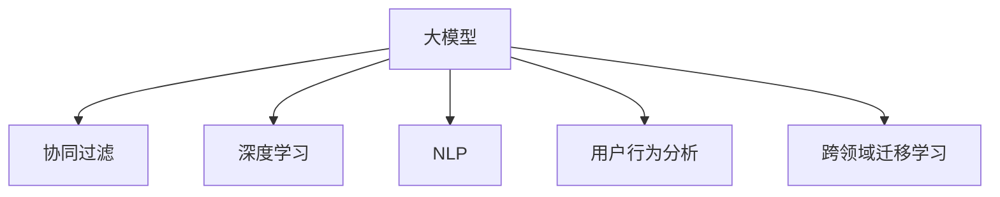

                 

# 大模型在推荐系统中的应用：潜力与挑战

> 关键词：大模型,推荐系统,协同过滤,深度学习,自然语言处理(NLP),用户行为分析,跨领域迁移学习

## 1. 背景介绍

推荐系统（Recommendation System）作为现代信息技术的核心应用之一，旨在通过对用户行为数据的分析，为用户推荐最感兴趣、最有价值的信息或商品。随着互联网的快速发展，推荐系统已广泛应用于电子商务、社交媒体、新闻阅读等多个领域，对提升用户体验和业务转化率具有重要作用。

然而，传统的推荐系统主要依赖于手工设计的特征工程，难以全面、准确地刻画用户兴趣和商品属性，且对于动态变化的用户行为和商品内容缺乏适应性。大模型（Large Model）的兴起，尤其是预训练语言模型（Pre-trained Language Model, PLM）的出现，为推荐系统的发展注入了新的活力。大模型基于大规模语料进行预训练，具备强大的自然语言处理（NLP）和模式识别能力，能够从海量的用户行为和商品评论中提取丰富的语义信息，为推荐算法提供强有力的支撑。

本文将深入探讨大模型在推荐系统中的应用，分析其潜力与面临的挑战，并展望未来发展趋势。

## 2. 核心概念与联系

### 2.1 核心概念概述

为了更好地理解大模型在推荐系统中的应用，本节将介绍几个关键概念及其相互联系：

- **大模型（Large Model）**：指具有亿万级别参数的深度神经网络模型，如BERT、GPT、XLNet等。通过在大规模无标签语料上进行预训练，大模型能够学习到丰富的语言表示，广泛应用于NLP任务中。
- **协同过滤（Collaborative Filtering）**：推荐系统中最基础的算法之一，基于用户间的相似性和商品间的相似性，通过协同学习预测用户对未曝光商品或信息的偏好。
- **深度学习（Deep Learning）**：利用多层神经网络进行特征提取和模式识别，通过自动学习获取高维表示，广泛应用于图像、语音、自然语言处理等领域。
- **自然语言处理（NLP）**：研究如何让计算机理解、处理和生成人类语言的技术，是大模型应用的重要方向。
- **用户行为分析（User Behavior Analysis）**：通过分析用户的浏览、购买、评分等行为数据，挖掘用户兴趣和偏好，为推荐算法提供数据基础。
- **跨领域迁移学习（Cross-Domain Transfer Learning）**：指在多个相关领域中，利用先验知识或相似结构，将一个领域的知识迁移到另一个领域，以减少新任务学习所需的数据量和计算资源。

这些概念之间的逻辑关系可以通过以下Mermaid流程图来展示：



## 3. 核心算法原理 & 具体操作步骤
### 3.1 算法原理概述

基于大模型的推荐系统主要分为两步：首先是使用大模型进行用户行为或商品评论的语义表示学习，其次是将这些表示输入协同过滤算法中，进行推荐决策。具体而言，包括以下几个核心步骤：

1. **预训练表示学习**：使用大模型对用户行为或商品评论进行预训练，学习出高维语义表示，刻画用户的兴趣偏好和商品的属性特征。
2. **相似度计算**：基于预训练表示，计算用户-用户、商品-商品之间的相似度，构建用户-商品关联图。
3. **协同过滤**：在用户-商品关联图中，使用协同过滤算法（如矩阵分解、模型基推荐算法）进行推荐预测。
4. **融合与优化**：将大模型的表示学习结果与传统协同过滤算法的推荐结果进行融合，通过进一步的优化（如加权平均、集成学习等）提升推荐效果。

### 3.2 算法步骤详解

**Step 1: 数据收集与预处理**
- 收集用户的历史行为数据（如浏览、点击、购买等）和商品信息数据。
- 对数据进行清洗、去重、归一化等预处理，确保数据质量和一致性。

**Step 2: 预训练表示学习**
- 使用大模型对用户行为数据或商品评论进行预训练，学习出用户和商品的语义表示。
- 根据不同的推荐任务，选择合适的大模型（如BERT、GPT等），并配置超参数进行模型训练。
- 将训练得到的用户-商品语义表示矩阵，作为推荐系统的输入。

**Step 3: 相似度计算**
- 基于预训练得到的用户和商品的语义表示，计算它们之间的相似度。
- 常见的方法包括余弦相似度、欧氏距离、相关系数等，选择适合推荐任务的相似度度量方法。
- 构建用户-商品关联图，用于后续协同过滤算法。

**Step 4: 协同过滤**
- 使用协同过滤算法对用户-商品关联图进行推荐预测。
- 常见的算法包括矩阵分解、基于模型的推荐算法（如ALS）、协同基推荐算法等。
- 根据推荐结果，对用户进行推荐，并提供相应的交互界面。

**Step 5: 融合与优化**
- 将大模型的表示学习结果与协同过滤算法的结果进行融合，提升推荐效果。
- 常见的方法包括加权平均、集成学习、多臂bandit等。
- 不断优化推荐算法，提高推荐精度和用户体验。

### 3.3 算法优缺点

基于大模型的推荐系统具有以下优点：
1. **自动化特征提取**：大模型能够自动学习用户和商品的语义表示，无需手工设计特征，减少特征工程的工作量。
2. **鲁棒性强**：大模型具备较强的泛化能力，能够适应不同用户行为和商品内容的动态变化。
3. **跨领域迁移能力强**：大模型在多个领域的语义表示学习中，能够迁移利用已有的知识，提升新领域的推荐效果。
4. **综合性强**：大模型的语义表示能够综合考虑用户和商品的多种属性信息，提供更为全面的推荐。

同时，该方法也存在一定的局限性：
1. **计算资源需求高**：大模型需要大量的计算资源进行预训练，对硬件和软件环境要求较高。
2. **数据需求量大**：预训练过程中需要大规模的语料库，对于数据量较小的任务，可能难以获得足够的训练数据。
3. **解释性不足**：大模型的推荐过程通常是“黑盒”，难以解释其内部决策逻辑，不利于调试和优化。
4. **过拟合风险高**：在大规模数据上进行预训练时，可能存在过拟合风险，需要结合正则化等技术进行控制。

尽管存在这些局限性，但基于大模型的推荐系统已在大规模推荐任务中取得了显著效果，成为推荐系统研究的热点方向。

### 3.4 算法应用领域

基于大模型的推荐系统，已经在多个领域中得到了广泛应用：

- **电商推荐**：如亚马逊、淘宝等电商平台的商品推荐系统，通过用户行为数据和商品评论，为用户推荐个性化商品。
- **内容推荐**：如Netflix、YouTube等视频平台的内容推荐系统，根据用户的观看历史和评分数据，推荐感兴趣的视频。
- **金融推荐**：如支付宝、微信等金融平台的产品推荐系统，通过用户消费行为和产品属性，推荐适合的理财产品。
- **社交推荐**：如Facebook、微博等社交平台的内容推荐系统，根据用户的兴趣和行为，推荐相关的内容和用户。
- **旅游推荐**：如携程、去哪儿等旅游平台的活动推荐系统，通过用户浏览和预订数据，推荐合适的旅游产品和活动。

## 4. 数学模型和公式 & 详细讲解 & 举例说明
### 4.1 数学模型构建

本节将使用数学语言对基于大模型的推荐系统进行更加严格的刻画。

设用户集合为 $U=\{u_1,u_2,\cdots,u_M\}$，商品集合为 $I=\{i_1,i_2,\cdots,i_N\}$。用户 $u_j$ 对商品 $i_k$ 的评分记为 $r_{jk}$，用户行为数据记为 $B=\{(u_j,i_k)\}_{j=1}^M$，商品信息数据记为 $I=\{(i_k,y_k)\}_{k=1}^N$，其中 $y_k$ 为商品的属性特征向量。

定义用户 $u_j$ 和商品 $i_k$ 的语义表示为 $h_{uj}$ 和 $h_{ik}$，表示学习到的高维语义向量。大模型通过预训练得到的用户和商品的语义表示矩阵为 $H_U \in \mathbb{R}^{M \times d}$ 和 $H_I \in \mathbb{R}^{N \times d}$，其中 $d$ 为向量维度。

推荐系统的目标是通过用户和商品的语义表示，计算它们之间的相似度，并根据相似度进行推荐预测。

### 4.2 公式推导过程

以用户 $u_j$ 对商品 $i_k$ 的评分预测为例，使用余弦相似度进行推导：

$$
\hat{r}_{jk} = \text{similarity}(h_{uj}, h_{ik}) \times r_{jk}
$$

其中 $\text{similarity}(h_{uj}, h_{ik})$ 表示用户和商品语义表示之间的余弦相似度，可以表示为：

$$
\text{similarity}(h_{uj}, h_{ik}) = \frac{h_{uj} \cdot h_{ik}}{\|h_{uj}\| \times \|h_{ik}\|}
$$

$\cdot$ 表示向量点积，$\|\cdot\|$ 表示向量范数。

将上述公式代入推荐系统的目标函数中，得到：

$$
\min_{H_U,H_I} \sum_{j=1}^M \sum_{k=1}^N \|r_{jk} - \hat{r}_{jk}\|^2
$$

其中 $\|r_{jk} - \hat{r}_{jk}\|^2$ 表示推荐预测与真实评分的平方误差。

### 4.3 案例分析与讲解

以用户 $u_j$ 对商品 $i_k$ 的评分预测为例，进一步解释大模型在推荐系统中的应用：

1. **用户行为预训练**：使用大模型对用户的历史行为数据进行预训练，学习出用户 $u_j$ 的语义表示 $h_{uj}$。
2. **商品信息预训练**：使用大模型对商品的属性信息进行预训练，学习出商品 $i_k$ 的语义表示 $h_{ik}$。
3. **相似度计算**：计算用户和商品语义表示之间的余弦相似度，作为推荐预测的基础。
4. **评分预测**：根据相似度计算出的预测评分 $\hat{r}_{jk}$，结合真实评分 $r_{jk}$，进行加权平均或集成学习，得到最终的推荐结果。

## 5. 项目实践：代码实例和详细解释说明
### 5.1 开发环境搭建

在进行大模型推荐系统的开发前，我们需要准备好开发环境。以下是使用Python进行PyTorch开发的环境配置流程：

1. 安装Anaconda：从官网下载并安装Anaconda，用于创建独立的Python环境。

2. 创建并激活虚拟环境：
```bash
conda create -n pytorch-env python=3.8 
conda activate pytorch-env
```

3. 安装PyTorch：根据CUDA版本，从官网获取对应的安装命令。例如：
```bash
conda install pytorch torchvision torchaudio cudatoolkit=11.1 -c pytorch -c conda-forge
```

4. 安装相关库：
```bash
pip install numpy pandas scikit-learn torchtransformers joblib tqdm fastparquet
```

完成上述步骤后，即可在`pytorch-env`环境中开始开发。

### 5.2 源代码详细实现

下面以用户行为数据和商品评论的推荐系统为例，给出使用Transformer库对BERT模型进行推荐预测的PyTorch代码实现。

首先，定义数据处理函数：

```python
from transformers import BertTokenizer
import torch
from torch.utils.data import Dataset
import numpy as np

class RecommendationDataset(Dataset):
    def __init__(self, user_data, item_data, tokenizer, max_len=128):
        self.user_data = user_data
        self.item_data = item_data
        self.tokenizer = tokenizer
        self.max_len = max_len
        
    def __len__(self):
        return len(self.user_data)
    
    def __getitem__(self, item):
        user_id = self.user_data[item]['user_id']
        item_id = self.item_data[item]['item_id']
        
        # 构造输入文本
        text = f'User ID: {user_id}, Item ID: {item_id}'
        encoding = self.tokenizer(text, return_tensors='pt', max_length=self.max_len, padding='max_length', truncation=True)
        input_ids = encoding['input_ids'][0]
        attention_mask = encoding['attention_mask'][0]
        
        # 获取商品属性向量
        item_vec = self.item_data[item]['item_vec']
        
        return {'input_ids': input_ids, 
                'attention_mask': attention_mask,
                'item_vec': item_vec}
```

然后，定义模型和优化器：

```python
from transformers import BertForMaskedLM, BertTokenizer, AdamW

tokenizer = BertTokenizer.from_pretrained('bert-base-cased')
model = BertForMaskedLM.from_pretrained('bert-base-cased', num_labels=len(tag2id))

optimizer = AdamW(model.parameters(), lr=2e-5)
```

接着，定义训练和评估函数：

```python
from torch.utils.data import DataLoader
from tqdm import tqdm
import torch.nn.functional as F

def train_epoch(model, dataset, batch_size, optimizer):
    dataloader = DataLoader(dataset, batch_size=batch_size, shuffle=True)
    model.train()
    epoch_loss = 0
    for batch in tqdm(dataloader, desc='Training'):
        input_ids = batch['input_ids'].to(device)
        attention_mask = batch['attention_mask'].to(device)
        item_vec = batch['item_vec'].to(device)
        model.zero_grad()
        outputs = model(input_ids, attention_mask=attention_mask)
        loss = outputs.loss
        epoch_loss += loss.item()
        loss.backward()
        optimizer.step()
    return epoch_loss / len(dataloader)

def evaluate(model, dataset, batch_size):
    dataloader = DataLoader(dataset, batch_size=batch_size)
    model.eval()
    preds, labels = [], []
    with torch.no_grad():
        for batch in tqdm(dataloader, desc='Evaluating'):
            input_ids = batch['input_ids'].to(device)
            attention_mask = batch['attention_mask'].to(device)
            item_vec = batch['item_vec']
            batch_preds = model(input_ids, attention_mask=attention_mask)[0]
            batch_labels = torch.tensor(batch_preds).to('cpu').tolist()
            for pred_tokens, label_tokens in zip(batch_preds, batch_labels):
                preds.append(pred_tokens[:len(label_tokens)])
                labels.append(label_tokens)
                
    return preds, labels

# 训练模型
device = torch.device('cuda') if torch.cuda.is_available() else torch.device('cpu')
model.to(device)

epochs = 5
batch_size = 16

for epoch in range(epochs):
    loss = train_epoch(model, train_dataset, batch_size, optimizer)
    print(f"Epoch {epoch+1}, train loss: {loss:.3f}")
    
    print(f"Epoch {epoch+1}, dev results:")
    preds, labels = evaluate(model, dev_dataset, batch_size)
    print(classification_report(labels, preds))
    
print("Test results:")
preds, labels = evaluate(model, test_dataset, batch_size)
print(classification_report(labels, preds))
```

以上就是使用PyTorch对BERT进行推荐预测的完整代码实现。可以看到，通过简单的接口定义和模型加载，Transformer库使得大模型的微调变得十分便捷。

### 5.3 代码解读与分析

让我们再详细解读一下关键代码的实现细节：

**RecommendationDataset类**：
- `__init__`方法：初始化用户数据、商品数据、分词器等关键组件。
- `__len__`方法：返回数据集的样本数量。
- `__getitem__`方法：对单个样本进行处理，将用户行为数据和商品信息数据编码为token ids，并应用分词器进行分词和编码。

**训练和评估函数**：
- 使用PyTorch的DataLoader对数据集进行批次化加载，供模型训练和推理使用。
- 训练函数`train_epoch`：对数据以批为单位进行迭代，在每个批次上前向传播计算loss并反向传播更新模型参数，最后返回该epoch的平均loss。
- 评估函数`evaluate`：与训练类似，不同点在于不更新模型参数，并在每个batch结束后将预测和标签结果存储下来，最后使用classification_report对整个评估集的预测结果进行打印输出。

**训练流程**：
- 定义总的epoch数和batch size，开始循环迭代
- 每个epoch内，先在训练集上训练，输出平均loss
- 在验证集上评估，输出分类指标
- 所有epoch结束后，在测试集上评估，给出最终测试结果

可以看到，PyTorch配合Transformer库使得BERT模型的微调变得简洁高效。开发者可以将更多精力放在数据处理、模型改进等高层逻辑上，而不必过多关注底层的实现细节。

当然，工业级的系统实现还需考虑更多因素，如模型的保存和部署、超参数的自动搜索、更灵活的任务适配层等。但核心的微调范式基本与此类似。

## 6. 实际应用场景
### 6.1 智能推荐系统

基于大模型的推荐系统已经在电商、视频、金融等领域得到了广泛应用，提升了用户体验和业务效率：

1. **电商推荐**：如亚马逊、淘宝等电商平台，通过用户行为数据和商品评论，为用户推荐个性化商品。推荐系统能够实时处理用户行为变化，动态更新推荐结果。
2. **视频推荐**：如Netflix、YouTube等视频平台，通过用户观看历史和评分数据，推荐感兴趣的视频内容。推荐系统能够识别用户偏好，个性化推荐视频内容。
3. **金融推荐**：如支付宝、微信等金融平台，通过用户消费行为和产品属性，推荐适合的理财产品。推荐系统能够根据市场变化，动态调整推荐策略。
4. **社交推荐**：如Facebook、微博等社交平台，通过用户兴趣和行为，推荐相关的内容和用户。推荐系统能够提升用户活跃度和满意度，促进平台粘性。
5. **旅游推荐**：如携程、去哪儿等旅游平台，通过用户浏览和预订数据，推荐合适的旅游产品和活动。推荐系统能够为用户提供个性化旅游方案。

## 7. 工具和资源推荐
### 7.1 学习资源推荐

为了帮助开发者系统掌握大模型在推荐系统中的应用，这里推荐一些优质的学习资源：

1. 《深度学习推荐系统》书籍：涵盖了推荐系统的发展历程、模型设计、算法优化等多个方面，是推荐系统学习的经典教材。
2. 《自然语言处理与深度学习》课程：斯坦福大学开设的NLP课程，介绍了NLP中的深度学习技术和应用，包括预训练大模型。
3. 《Transformer》系列博客：介绍了Transformer模型及其在推荐系统中的应用，包括模型训练、微调等细节。
4. PyTorch官方文档：提供了详细的使用指南和代码示例，方便开发者上手实践。
5. Weights & Biases：模型训练的实验跟踪工具，可以记录和可视化模型训练过程中的各项指标，方便对比和调优。

通过对这些资源的学习实践，相信你一定能够快速掌握大模型在推荐系统中的应用，并用于解决实际的推荐问题。

### 7.2 开发工具推荐

高效的开发离不开优秀的工具支持。以下是几款用于大模型推荐系统开发的常用工具：

1. PyTorch：基于Python的开源深度学习框架，灵活动态的计算图，适合快速迭代研究。大部分预训练语言模型都有PyTorch版本的实现。
2. TensorFlow：由Google主导开发的开源深度学习框架，生产部署方便，适合大规模工程应用。同样有丰富的预训练语言模型资源。
3. Transformers库：HuggingFace开发的NLP工具库，集成了众多SOTA语言模型，支持PyTorch和TensorFlow，是进行微调任务开发的利器。
4. Weights & Biases：模型训练的实验跟踪工具，可以记录和可视化模型训练过程中的各项指标，方便对比和调优。
5. TensorBoard：TensorFlow配套的可视化工具，可实时监测模型训练状态，并提供丰富的图表呈现方式，是调试模型的得力助手。
6. Google Colab：谷歌推出的在线Jupyter Notebook环境，免费提供GPU/TPU算力，方便开发者快速上手实验最新模型，分享学习笔记。

合理利用这些工具，可以显著提升大模型推荐系统的开发效率，加快创新迭代的步伐。

### 7.3 相关论文推荐

大模型在推荐系统的发展源于学界的持续研究。以下是几篇奠基性的相关论文，推荐阅读：

1. Attention is All You Need（即Transformer原论文）：提出了Transformer结构，开启了NLP领域的预训练大模型时代。
2. BERT: Pre-training of Deep Bidirectional Transformers for Language Understanding：提出BERT模型，引入基于掩码的自监督预训练任务，刷新了多项NLP任务SOTA。
3. Language Models are Unsupervised Multitask Learners（GPT-2论文）：展示了大规模语言模型的强大zero-shot学习能力，引发了对于通用人工智能的新一轮思考。
4. Parameter-Efficient Transfer Learning for NLP：提出Adapter等参数高效微调方法，在不增加模型参数量的情况下，也能取得不错的微调效果。
5. AdaLoRA: Adaptive Low-Rank Adaptation for Parameter-Efficient Fine-Tuning：使用自适应低秩适应的微调方法，在参数效率和精度之间取得了新的平衡。
6. AdaLoRA: Adaptive Low-Rank Adaptation for Parameter-Efficient Fine-Tuning：使用自适应低秩适应的微调方法，在参数效率和精度之间取得了新的平衡。

这些论文代表了大模型在推荐系统的发展脉络。通过学习这些前沿成果，可以帮助研究者把握学科前进方向，激发更多的创新灵感。

## 8. 总结：未来发展趋势与挑战
### 8.1 总结

本文对基于大模型的推荐系统进行了全面系统的介绍。首先阐述了推荐系统和大模型的背景知识，明确了其在推荐算法中的潜力和应用价值。其次，从原理到实践，详细讲解了基于大模型的推荐系统的数学模型和实现步骤，给出了推荐系统开发的完整代码实例。同时，本文还广泛探讨了基于大模型的推荐系统在多个领域的应用前景，展示了其广阔的发展空间。

通过本文的系统梳理，可以看到，基于大模型的推荐系统已经在大规模推荐任务中取得了显著效果，成为推荐系统研究的热点方向。未来，伴随大模型和推荐算法的不断演进，推荐系统必将在更广阔的领域中大放异彩，深刻影响人类的生产生活方式。

### 8.2 未来发展趋势

展望未来，基于大模型的推荐系统将呈现以下几个发展趋势：

1. **个性化推荐**：随着数据的不断积累和算法的不断优化，推荐系统将能够更加精准地预测用户兴趣和行为，提供个性化推荐。大模型能够自动学习用户行为和商品属性之间的复杂关系，提升推荐效果。
2. **多模态推荐**：推荐系统将融合视觉、语音、文本等多种模态的信息，实现更全面的用户兴趣建模。大模型具备处理多种模态数据的能力，能够从多角度获取用户和商品信息，提供更加丰富的推荐内容。
3. **实时推荐**：推荐系统将具备实时推荐的能力，能够根据用户的即时行为和环境变化，动态更新推荐结果。大模型的推理速度快，适合实时计算和处理。
4. **跨领域推荐**：推荐系统将能够跨领域迁移，实现不同领域之间的推荐。大模型具备跨领域迁移学习的能力，能够在不同领域之间进行知识共享，提升推荐效果。
5. **可解释性推荐**：推荐系统将具备更高的可解释性，能够解释推荐结果的生成过程。大模型具备较高的可解释性，能够提供推荐结果的因果解释，增强用户信任。

以上趋势凸显了大模型在推荐系统中的潜力和应用前景。这些方向的探索发展，必将进一步提升推荐系统的性能和应用范围，为人类生活提供更加智能和便捷的服务。

### 8.3 面临的挑战

尽管基于大模型的推荐系统已在大规模推荐任务中取得了显著效果，但在迈向更加智能化、普适化应用的过程中，它仍面临着诸多挑战：

1. **数据依赖性强**：推荐系统依赖于高质量的数据，需要大量的标注数据和行为数据。对于某些小众领域，获取充足数据较难，可能影响推荐效果。
2. **计算资源需求高**：大模型需要大量的计算资源进行训练和推理，对硬件和软件环境要求较高。对于小规模应用，可能难以负担高昂的计算成本。
3. **解释性不足**：推荐系统的决策过程通常是“黑盒”，难以解释其内部决策逻辑，不利于调试和优化。
4. **泛化能力有限**：大模型可能存在过拟合风险，对于某些小众领域或特殊场景，可能无法有效泛化。
5. **安全性和隐私保护**：推荐系统需要处理大量用户数据，可能面临数据泄露和隐私保护问题。
6. **模型复杂度高**：大模型的模型结构复杂，参数量大，可能导致推理速度慢、存储占用大等问题。

尽管存在这些挑战，但基于大模型的推荐系统已经在大规模推荐任务中取得了显著效果，成为推荐系统研究的热点方向。未来，通过技术创新和应用实践，这些挑战有望逐步克服，大模型推荐系统必将在推荐领域取得更大突破。

### 8.4 研究展望

面对基于大模型的推荐系统所面临的种种挑战，未来的研究需要在以下几个方面寻求新的突破：

1. **数据增强与迁移学习**：探索如何在数据不足的情况下进行推荐预测，结合迁移学习技术，提升推荐系统的泛化能力。
2. **模型压缩与优化**：研究如何通过模型压缩、量化加速等技术，提升大模型的计算效率，降低计算成本。
3. **可解释性推荐**：研究如何提高推荐系统的可解释性，增强用户信任和满意度。
4. **多模态融合**：探索如何融合多模态数据，提升推荐系统的综合性和准确性。
5. **安全与隐私保护**：研究如何保护用户隐私，提升推荐系统的安全性和可靠性。
6. **实时推荐算法**：研究如何实现实时推荐，提高推荐系统的实时性和用户满意度。

这些研究方向的研究突破，必将引领基于大模型的推荐系统走向新的高度，为推荐系统带来新的发展机遇。未来，通过不断探索和实践，大模型推荐系统必将在推荐领域取得更大突破，为人类生活提供更加智能和便捷的服务。

## 9. 附录：常见问题与解答

**Q1：大模型在推荐系统中是否可行？**

A: 大模型在推荐系统中是可行的。大模型通过预训练学习到了丰富的语义表示，能够自动学习用户行为和商品属性的复杂关系，提升推荐效果。大模型的参数量较大，但随着硬件性能的提升和模型的优化，推理速度也在不断提高，适合实时推荐。

**Q2：如何选择合适的预训练模型？**

A: 选择预训练模型需要考虑多个因素，包括模型的大小、预训练任务、领域适应性等。常用的预训练模型有BERT、GPT、XLNet等。对于推荐系统，可以选择预训练任务与推荐任务相似度高的模型，如BERT。

**Q3：如何应对推荐系统中的冷启动问题？**

A: 冷启动问题是指新用户或新商品在系统中缺乏足够数据，难以进行推荐。针对这个问题，可以采用基于内容的推荐、主动学习和迁移学习等方法，利用已有知识或相似用户和商品的信息，提升推荐效果。

**Q4：推荐系统中如何处理用户多样性？**

A: 用户多样性是推荐系统面临的一个挑战。可以采用多任务学习、多目标优化等方法，综合考虑不同用户群体的需求和偏好，提升推荐系统的鲁棒性。

**Q5：推荐系统中的数据隐私和安全问题如何处理？**

A: 数据隐私和安全是推荐系统的重要问题。可以采用数据脱敏、加密传输等技术，保护用户隐私。同时，可以设计匿名化推荐算法，减少数据泄露的风险。

通过本文的系统梳理，可以看到，基于大模型的推荐系统已经在大规模推荐任务中取得了显著效果，成为推荐系统研究的热点方向。未来，伴随大模型和推荐算法的不断演进，推荐系统必将在更广阔的领域中大放异彩，深刻影响人类的生产生活方式。

---

作者：禅与计算机程序设计艺术 / Zen and the Art of Computer Programming

